# Context Management

The **RunContext** provides the essential runtime environment for step execution, managing variables, permissions, resources, and state inheritance throughout the execution hierarchy.

## 📋 RunContext Structure

```typescript
interface RunContext {
    /** Static Runtime Configuration */
    readonly runId: string;
    readonly stepSchema: RoutineStepSchema;
    readonly parent?: RunContext;
    
    readonly permissions: Permission[];              // Execution permissions and constraints
    readonly resourceLimits: ResourceLimits;         // Credit, time, and computational limits
    readonly qualityRequirements: QualityRequirements; // Output quality and validation rules
    
    // Tool Integration
    readonly availableTools: ToolDefinition[];       // Accessible tools and APIs
    readonly authenticationCredentials: Credentials; // API keys and authentication tokens
    readonly integrationConfigs: IntegrationConfig[]; // Third-party service configurations
    
    // State Management
    inheritFromParent(parentContext: RunContext): RunContext;
    createChildContext(overrides: ContextOverrides): RunContext;
    updateVariable(key: string, value: unknown): RunContext;
    validatePermissions(action: ExecutionAction): PermissionResult;

    /** Dynamic Runtime State */
    vars: Record<string, unknown>;
    intermediate: Record<string, unknown>;
    exports: ExportDeclaration[];      // populated by manifest or tool call
    sensitivity: Record<string, DataSensitivity>; // NONE | INSENSITIVE | SENSITIVE | CONFIDENTIAL

    /* Helper Methods */
    createChild(overrides?: Partial<RunContextInit>): RunContext;
    markForExport(key: string, toParent?: boolean, toBlackboard?: boolean): void;
}
```

## 🔄 Context Inheritance Architecture

```mermaid
graph TB
    subgraph "Context Inheritance Hierarchy"
        SwarmContext[Swarm Context<br/>🐝 Top-level swarm environment<br/>👥 Team configuration<br/>💰 Resource allocation]
        
        RoutineContext[Routine Context<br/>⚙️ Individual routine execution<br/>📊 Step orchestration<br/>🔄 State management]
        
        StepContext[Step Context<br/>🎯 Single step execution<br/>📋 Tool configuration<br/>🔍 Variable scope]
        
        ToolContext[Tool Context<br/>🔧 Tool-specific environment<br/>🔒 Isolated execution<br/>📊 Resource tracking]
    end
    
    subgraph "Inheritance Flow"
        ConfigInheritance[Config Inheritance<br/>⚙️ Tool availability<br/>🔐 Authentication credentials<br/>📋 Integration settings]
        
        PermissionInheritance[Permission Inheritance<br/>🔒 Access control<br/>👤 User permissions<br/>🛡️ Security boundaries]
        
        ResourceInheritance[Resource Inheritance<br/>💰 Budget allocation<br/>⏱️ Time limits<br/>📊 Computational quotas]
        
        StateInheritance[State Inheritance<br/>📊 Variable context<br/>🗃️ Shared state<br/>🔄 Export declarations]
    end
    
    SwarmContext --> RoutineContext
    RoutineContext --> StepContext
    StepContext --> ToolContext
    
    SwarmContext --> ConfigInheritance
    RoutineContext --> PermissionInheritance
    StepContext --> ResourceInheritance
    ToolContext --> StateInheritance
    
    classDef context fill:#e8f5e8,stroke:#2e7d32,stroke-width:3px
    classDef inheritance fill:#e3f2fd,stroke:#1565c0,stroke-width:2px
    
    class SwarmContext,RoutineContext,StepContext,ToolContext context
    class ConfigInheritance,PermissionInheritance,ResourceInheritance,StateInheritance inheritance
```



## 🔐 Permission and Security Management

```mermaid
graph TB
    subgraph "Permission Management Framework"
        PermissionRegistry[Permission Registry<br/>📋 Available permissions<br/>🏷️ Permission categories<br/>⚡ Dynamic validation]
        
        ContextualPermissions[Contextual Permissions<br/>🎯 Step-specific access<br/>📊 Resource-based limits<br/>🔍 Dynamic evaluation]
        
        SecurityBoundaries[Security Boundaries<br/>🔒 Isolation enforcement<br/>🛡️ Cross-context protection<br/>⚠️ Violation detection]
        
        AuditLogging[Audit Logging<br/>📊 Permission usage tracking<br/>🔍 Access pattern analysis<br/>⚠️ Security event logging]
    end
    
    subgraph "Permission Types"
        ResourcePermissions[Resource Permissions<br/>🗃️ CRUD operations<br/>📊 Data access levels<br/>🔍 Query restrictions]
        
        ToolPermissions[Tool Permissions<br/>🔧 Tool access rights<br/>⚡ Execution capabilities<br/>📊 Parameter restrictions]
        
        NetworkPermissions[Network Permissions<br/>🌐 External API access<br/>🔒 Domain restrictions<br/>📡 Protocol limitations]
        
        SystemPermissions[System Permissions<br/>⚙️ System operations<br/>📁 File system access<br/>💻 Process management]
    end
    
    PermissionRegistry --> ContextualPermissions
    ContextualPermissions --> SecurityBoundaries
    SecurityBoundaries --> AuditLogging
    
    ContextualPermissions --> ResourcePermissions
    ContextualPermissions --> ToolPermissions
    ContextualPermissions --> NetworkPermissions
    ContextualPermissions --> SystemPermissions
    
    classDef permission fill:#f3e5f5,stroke:#7b1fa2,stroke-width:3px
    classDef types fill:#fff3e0,stroke:#f57c00,stroke-width:2px
    
    class PermissionRegistry,ContextualPermissions,SecurityBoundaries,AuditLogging permission
    class ResourcePermissions,ToolPermissions,NetworkPermissions,SystemPermissions types
```



## 📊 Variable and State Management

```mermaid
graph TB
    subgraph "Variable Management System"
        VariableScope[Variable Scope<br/>🎯 Context-specific variables<br/>🔍 Scope resolution<br/>📋 Type safety]
        
        StateTracking[State Tracking<br/>📊 Change monitoring<br/>🔄 Version management<br/>📋 Rollback support]
        
        ExportManagement[Export Management<br/>📤 Cross-context sharing<br/>🗃️ Blackboard integration<br/>🎯 Selective exposure]
        
        SensitivityTracking[Sensitivity Tracking<br/>🔒 Data classification<br/>⚠️ Privacy enforcement<br/>📋 Compliance monitoring]
    end
    
    subgraph "Data Sensitivity Levels"
        NoneLevel[NONE<br/>📋 Public data<br/>✅ No restrictions<br/>🔄 Free sharing]
        
        InsensitiveLevel[INSENSITIVE<br/>📊 Internal data<br/>🔍 Basic controls<br/>📋 Standard logging]
        
        SensitiveLevel[SENSITIVE<br/>⚠️ Controlled data<br/>🔒 Access restrictions<br/>📊 Enhanced monitoring]
        
        ConfidentialLevel[CONFIDENTIAL<br/>🚨 Highly restricted<br/>🔐 Encryption required<br/>📋 Audit trails]
    end
    
    VariableScope --> StateTracking
    StateTracking --> ExportManagement
    ExportManagement --> SensitivityTracking
    
    SensitivityTracking --> NoneLevel
    SensitivityTracking --> InsensitiveLevel
    SensitivityTracking --> SensitiveLevel
    SensitivityTracking --> ConfidentialLevel
    
    classDef management fill:#e3f2fd,stroke:#1565c0,stroke-width:3px
    classDef sensitivity fill:#ffebee,stroke:#c62828,stroke-width:2px
    
    class VariableScope,StateTracking,ExportManagement,SensitivityTracking management
    class NoneLevel,InsensitiveLevel,SensitiveLevel,ConfidentialLevel sensitivity
```



## 🔧 Tool Integration Context

```mermaid
graph TB
    subgraph "Tool Integration Framework"
        ToolRegistry[Tool Registry<br/>📋 Available tools catalog<br/>🔧 Capability mapping<br/>⚡ Dynamic discovery]
        
        CredentialManagement[Credential Management<br/>🔐 API key storage<br/>🎫 Token management<br/>🔄 Rotation policies]
        
        ConfigurationManagement[Configuration Management<br/>⚙️ Tool-specific settings<br/>📊 Environment variables<br/>🔍 Template resolution]
        
        AuthenticationFlow[Authentication Flow<br/>🔒 OAuth workflows<br/>🎯 Service authentication<br/>📊 Session management]
    end
    
    subgraph "Integration Configurations"
        APIConfigs[API Configurations<br/>🌐 Endpoint definitions<br/>📊 Rate limit settings<br/>🔒 Security parameters]
        
        ServiceConfigs[Service Configurations<br/>⚙️ Third-party services<br/>📋 Connection pools<br/>⏱️ Timeout settings]
        
        TemplateConfigs[Template Configurations<br/>📝 Prompt templates<br/>🎯 Context injection<br/>🔄 Variable substitution]
        
        PolicyConfigs[Policy Configurations<br/>📋 Usage policies<br/>🔒 Security rules<br/>⚠️ Compliance requirements]
    end
    
    ToolRegistry --> CredentialManagement
    CredentialManagement --> ConfigurationManagement
    ConfigurationManagement --> AuthenticationFlow
    
    ConfigurationManagement --> APIConfigs
    ConfigurationManagement --> ServiceConfigs
    ConfigurationManagement --> TemplateConfigs
    ConfigurationManagement --> PolicyConfigs
    
    classDef integration fill:#e8f5e8,stroke:#2e7d32,stroke-width:3px
    classDef configs fill:#f3e5f5,stroke:#7b1fa2,stroke-width:2px
    
    class ToolRegistry,CredentialManagement,ConfigurationManagement,AuthenticationFlow integration
    class APIConfigs,ServiceConfigs,TemplateConfigs,PolicyConfigs configs
```



## 🎯 Context Creation and Lifecycle

### Context Creation Flow


### Context Lifecycle Management

```typescript
interface ContextLifecycle {
    // Creation
    create(parent: RunContext, overrides: ContextOverrides): Promise<RunContext>;
    
    // Runtime Operations
    updateVariable(key: string, value: unknown, sensitivity: DataSensitivity): void;
    exportVariable(key: string, targets: ExportTarget[]): void;
    importFromParent(keys: string[]): void;
    
    // Resource Management
    allocateResources(allocation: ResourceAllocation): Promise<void>;
    trackUsage(usage: ResourceUsage): void;
    enforceQuotas(): QuotaEnforcementResult;
    
    // Security Operations
    validateAccess(action: ExecutionAction): PermissionResult;
    auditOperation(operation: Operation, result: OperationResult): void;
    
    // Cleanup
    cleanup(): Promise<void>;
    finalizeExports(): ExportSummary;
}
```

## 🔍 Context Export and Sharing

```mermaid
graph TB
    subgraph "Export Management System"
        ExportDeclaration[Export Declaration<br/>📋 Variable selection<br/>🎯 Target specification<br/>📊 Export rules]
        
        ParentExport[Parent Export<br/>⬆️ Upstream sharing<br/>🔄 Context inheritance<br/>📊 Hierarchical flow]
        
        BlackboardExport[Blackboard Export<br/>🗃️ Swarm-wide sharing<br/>👥 Team collaboration<br/>📊 Global state]
        
        PersistentExport[Persistent Export<br/>💾 Long-term storage<br/>🔄 Cross-session state<br/>📊 Data persistence]
    end
    
    subgraph "Export Processing"
        SensitivityFilter[Sensitivity Filter<br/>🔒 Privacy compliance<br/>⚠️ Confidentiality checks<br/>📋 Data classification]
        
        TransformationEngine[Transformation Engine<br/>🔄 Format conversion<br/>📊 Schema adaptation<br/>🎯 Target optimization]
        
        ValidationEngine[Validation Engine<br/>✅ Export validation<br/>📋 Schema compliance<br/>🔍 Integrity checks]
        
        DeliveryManager[Delivery Manager<br/>📤 Export delivery<br/>🎯 Target routing<br/>📊 Status tracking]
    end
    
    ExportDeclaration --> ParentExport
    ExportDeclaration --> BlackboardExport
    ExportDeclaration --> PersistentExport
    
    ParentExport --> SensitivityFilter
    BlackboardExport --> TransformationEngine
    PersistentExport --> ValidationEngine
    
    SensitivityFilter --> DeliveryManager
    TransformationEngine --> DeliveryManager
    ValidationEngine --> DeliveryManager
    
    classDef export fill:#fff3e0,stroke:#f57c00,stroke-width:3px
    classDef processing fill:#e3f2fd,stroke:#1565c0,stroke-width:2px
    
    class ExportDeclaration,ParentExport,BlackboardExport,PersistentExport export
    class SensitivityFilter,TransformationEngine,ValidationEngine,DeliveryManager processing
```



## 🛡️ Security Boundaries and Isolation

**Context Isolation**: Each context maintains strict boundaries preventing unauthorized access to parent or sibling contexts while enabling controlled data sharing through explicit export mechanisms.

**Permission Enforcement**: The system validates all operations against the context's permission set, preventing privilege escalation and ensuring operations remain within authorized boundaries.

**Resource Tracking**: Comprehensive resource usage tracking ensures fair allocation and prevents resource exhaustion while enabling effective cost management and optimization.

**Audit Trail**: All context operations are logged for security analysis, compliance reporting, and performance optimization.

This context management system provides the foundation for secure, efficient, and well-organized execution environments that scale from simple tool calls to complex multi-agent swarm operations. 