# Cross-Tier Integration

Tier 3 integrates seamlessly with the upper tiers through well-defined interfaces, providing the foundational execution layer that powers Vrooli's unified automation ecosystem.

## 🔄 Integration with Tier 1 and Tier 2


## 🏗️ Architectural Integration Points

```mermaid
graph TB
    subgraph "Tier 1: Coordination Intelligence"
        SwarmOrchestrator[Swarm Orchestrator<br/>🐝 Team coordination<br/>👥 Role management<br/>🎯 Goal decomposition]
        
        SwarmStateMachine[Swarm State Machine<br/>📊 Team state tracking<br/>🔄 Coordination logic<br/>📈 Progress monitoring]
    end
    
    subgraph "Tier 2: Process Intelligence"
        RoutineNavigator[Routine Navigator<br/>⚙️ Process orchestration<br/>📋 Step sequencing<br/>🔄 Flow control]
        
        RunStateMachine[Run State Machine<br/>📊 Execution state<br/>🔄 Error handling<br/>⚡ Recovery logic]
    end
    
    subgraph "Tier 3: Execution Intelligence"
        UnifiedExecutor[Unified Executor<br/>🎯 Strategy execution<br/>🔧 Tool coordination<br/>📊 Resource management]
        
        ToolOrchestrator[Tool Orchestrator<br/>🔧 MCP integration<br/>📊 Service coordination<br/>🔒 Security enforcement]
    end
    
    subgraph "Integration Mechanisms"
        ContextPropagation[Context Propagation<br/>📋 State inheritance<br/>🔄 Variable sharing<br/>🔒 Security boundaries]
        
        EventStreaming[Event Streaming<br/>📊 Performance telemetry<br/>⚠️ Error notifications<br/>📈 Progress updates]
        
        ResourceFlowControl[Resource Flow Control<br/>💰 Budget allocation<br/>⏱️ Time management<br/>⚖️ Fair sharing]
    end
    
    SwarmOrchestrator --> RoutineNavigator
    SwarmStateMachine --> RunStateMachine
    RoutineNavigator --> UnifiedExecutor
    RunStateMachine --> ToolOrchestrator
    
    SwarmStateMachine --> ContextPropagation
    RunStateMachine --> EventStreaming
    UnifiedExecutor --> ResourceFlowControl
    
    classDef tier1 fill:#e8f5e8,stroke:#2e7d32,stroke-width:3px
    classDef tier2 fill:#fff3e0,stroke:#f57c00,stroke-width:3px
    classDef tier3 fill:#e3f2fd,stroke:#1565c0,stroke-width:3px
    classDef integration fill:#f3e5f5,stroke:#7b1fa2,stroke-width:2px
    
    class SwarmOrchestrator,SwarmStateMachine tier1
    class RoutineNavigator,RunStateMachine tier2
    class UnifiedExecutor,ToolOrchestrator tier3
    class ContextPropagation,EventStreaming,ResourceFlowControl integration
```



## 📊 Data Flow and State Management

```mermaid
graph TB
    subgraph "Cross-Tier Data Flow Architecture"
        SwarmBlackboard[Swarm Blackboard<br/>🗃️ Shared team state<br/>📊 Global coordination<br/>👥 Collaborative workspace]
        
        RoutineContext[Routine Context<br/>📋 Process state<br/>🔄 Variable scope<br/>⚡ Execution environment]
        
        StepContext[Step Context<br/>🎯 Local execution<br/>📊 Tool state<br/>🔒 Security boundaries]
        
        ResultAggregation[Result Aggregation<br/>📊 Output consolidation<br/>🔄 State synthesis<br/>📈 Progress tracking]
    end
    
    subgraph "State Synchronization"
        UpwardPropagation[Upward Propagation<br/>⬆️ Results to parents<br/>📊 Status updates<br/>⚠️ Error escalation]
        
        DownwardInheritance[Downward Inheritance<br/>⬇️ Context to children<br/>🔒 Permission delegation<br/>💰 Resource allocation]
        
        PeerCommunication[Peer Communication<br/>↔️ Lateral coordination<br/>📊 State sharing<br/>🔄 Synchronization]
        
        PersistentStorage[Persistent Storage<br/>💾 Long-term state<br/>🔄 Session continuity<br/>📊 Audit trails]
    end
    
    SwarmBlackboard --> RoutineContext
    RoutineContext --> StepContext
    StepContext --> ResultAggregation
    
    ResultAggregation --> UpwardPropagation
    SwarmBlackboard --> DownwardInheritance
    RoutineContext --> PeerCommunication
    StepContext --> PersistentStorage
    
    classDef dataflow fill:#e8f5e8,stroke:#2e7d32,stroke-width:3px
    classDef synchronization fill:#e3f2fd,stroke:#1565c0,stroke-width:2px
    
    class SwarmBlackboard,RoutineContext,StepContext,ResultAggregation dataflow
    class UpwardPropagation,DownwardInheritance,PeerCommunication,PersistentStorage synchronization
```



## 🎯 Interface Contracts

### Tier 2 → Tier 3 Interface

```typescript
interface RunStepContract {
    // Request Structure
    request: {
        stepContext: RunStepContext;
        strategy: ExecutionStrategy;
        resourceLimits: ResourceLimits;
        qualityRequirements: QualityRequirements;
    };
    
    // Response Structure
    response: {
        stepResult: RunStepResult;
        resourceUsage: ResourceUsage;
        performanceMetrics: PerformanceMetrics;
        qualityScore: QualityScore;
    };
    
    // Error Handling
    errors: {
        ValidationError: "Invalid step configuration";
        ResourceExhaustedError: "Insufficient resources";
        TimeoutError: "Execution timeout exceeded";
        SecurityViolationError: "Permission denied";
    };
    
    // Event Emissions
    events: {
        "step.started": StepStartedEvent;
        "step.progress": StepProgressEvent;
        "step.completed": StepCompletedEvent;
        "step.failed": StepFailedEvent;
    };
}
```

### Tier 1 → Tier 2 Interface

```typescript
interface SwarmExecutionContract {
    // Request Structure
    request: {
        swarmContext: SwarmExecutionContext;
        goal: SwarmGoal;
        teamConfiguration: TeamConfiguration;
        resourceAllocation: ResourceAllocation;
    };
    
    // Response Structure
    response: {
        executionResult: SwarmExecutionResult;
        teamPerformance: TeamPerformanceMetrics;
        resourceUtilization: ResourceUtilization;
        achievementScore: GoalAchievementScore;
    };
    
    // Coordination Events
    events: {
        "swarm.initialized": SwarmInitializedEvent;
        "routine.assigned": RoutineAssignedEvent;
        "routine.completed": RoutineCompletedEvent;
        "swarm.completed": SwarmCompletedEvent;
    };
}
```

## 🔄 Event-Driven Integration


## 🧠 Learning and Optimization Integration

```mermaid
graph TB
    subgraph "Learning Integration Framework"
        TelemetryEmission[Telemetry Emission<br/>📊 Performance data<br/>📈 Usage patterns<br/>🔍 Behavioral insights]
        
        PatternAnalysis[Pattern Analysis<br/>🧠 Machine learning<br/>📊 Trend identification<br/>🎯 Optimization opportunities]
        
        StrategyEvolution[Strategy Evolution<br/>🔄 Adaptive improvement<br/>📈 Performance optimization<br/>🎯 Automatic tuning]
        
        FeedbackLoop[Feedback Loop<br/>🔄 Continuous improvement<br/>📊 Results validation<br/>⚡ Rapid adaptation]
    end
    
    subgraph "Optimization Agents"
        PerformanceOptimizer[Performance Optimizer<br/>⚡ Speed optimization<br/>📊 Resource efficiency<br/>🎯 Bottleneck removal]
        
        CostOptimizer[Cost Optimizer<br/>💰 Budget efficiency<br/>📊 Cost-benefit analysis<br/>⚖️ Value maximization]
        
        QualityOptimizer[Quality Optimizer<br/>✅ Output quality<br/>🔍 Error reduction<br/>📈 Reliability improvement]
        
        SecurityOptimizer[Security Optimizer<br/>🔒 Safety enhancement<br/>⚠️ Risk mitigation<br/>🛡️ Protection strengthening]
    end
    
    TelemetryEmission --> PatternAnalysis
    PatternAnalysis --> StrategyEvolution
    StrategyEvolution --> FeedbackLoop
    
    PatternAnalysis --> PerformanceOptimizer
    PatternAnalysis --> CostOptimizer
    PatternAnalysis --> QualityOptimizer
    PatternAnalysis --> SecurityOptimizer
    
    classDef learning fill:#e8f5e8,stroke:#2e7d32,stroke-width:3px
    classDef optimization fill:#e3f2fd,stroke:#1565c0,stroke-width:2px
    
    class TelemetryEmission,PatternAnalysis,StrategyEvolution,FeedbackLoop learning
    class PerformanceOptimizer,CostOptimizer,QualityOptimizer,SecurityOptimizer optimization
```



## 🎯 Key Design Principles

### **1. MCP-First Architecture**
The system uses Model Context Protocol as the universal interface for tool integration:
- **External AI agents** connect via MCP to access Vrooli's tool ecosystem
- **Internal swarms** use the same MCP tools for consistency and reliability
- **Dynamic tool servers** provide routine-specific MCP endpoints

### **2. Tool Approval as First-Class Citizen**
User oversight is built into the core architecture:
- **Configurable approval policies** per swarm and tool type
- **Scheduled execution** with user-defined delays
- **Resource-aware gating** based on cost and complexity

### **3. Schema Compression for Efficiency**
The `define_tool` mechanism reduces context overhead:
- **On-demand schema generation** for specific resource types and operations
- **Precise parameter definitions** instead of comprehensive tool schemas
- **Dynamic adaptation** based on current execution context

### **4. Resource Inheritance in Swarm Spawning**
Child swarms inherit controlled portions of parent resources:
- **Configurable allocation ratios** for credits, time, and computational resources
- **Hierarchical limit enforcement** prevents resource exhaustion
- **Graceful degradation** when limits are approached

### **5. Unified Tool Execution Layer**
All tools, whether built-in or dynamic, follow consistent patterns:
- **Common authentication and authorization** across all tool types
- **Standardized error handling** and response formatting
- **Comprehensive logging and audit trails** for all tool executions

## 🔒 Security and Compliance Integration

```mermaid
graph TB
    subgraph "Security Integration Framework"
        PolicyEnforcement[Policy Enforcement<br/>🔒 Security policies<br/>📋 Compliance rules<br/>⚠️ Violation detection]
        
        PermissionPropagation[Permission Propagation<br/>🛡️ Access control<br/>🔄 Context inheritance<br/>📊 Privilege delegation]
        
        AuditTrail[Audit Trail<br/>📊 Operation logging<br/>🔍 Security monitoring<br/>📋 Compliance reporting]
        
        ThreatDetection[Threat Detection<br/>🚨 Anomaly detection<br/>⚠️ Security alerts<br/>🔒 Incident response]
    end
    
    subgraph "Compliance Mechanisms"
        DataClassification[Data Classification<br/>🏷️ Sensitivity tagging<br/>🔒 Privacy protection<br/>📋 Regulatory compliance]
        
        EncryptionManagement[Encryption Management<br/>🔐 Data encryption<br/>🔑 Key management<br/>🛡️ Secure transmission]
        
        AccessControl[Access Control<br/>👤 User authentication<br/>🔒 Role-based access<br/>📊 Permission tracking]
        
        ComplianceReporting[Compliance Reporting<br/>📊 Regulatory reports<br/>📋 Audit documentation<br/>✅ Certification support]
    end
    
    PolicyEnforcement --> PermissionPropagation
    PermissionPropagation --> AuditTrail
    AuditTrail --> ThreatDetection
    
    ThreatDetection --> DataClassification
    PolicyEnforcement --> EncryptionManagement
    PermissionPropagation --> AccessControl
    AuditTrail --> ComplianceReporting
    
    classDef security fill:#ffebee,stroke:#c62828,stroke-width:3px
    classDef compliance fill:#f3e5f5,stroke:#7b1fa2,stroke-width:2px
    
    class PolicyEnforcement,PermissionPropagation,AuditTrail,ThreatDetection security
    class DataClassification,EncryptionManagement,AccessControl,ComplianceReporting compliance
```



## 🚀 Performance and Scalability

**Horizontal Scaling**: The architecture supports scaling from single tool calls to massive swarm operations through distributed execution and resource management.

**Vertical Integration**: Each tier optimizes for its specific concerns while maintaining clean interfaces and separation of responsibilities.

**Event-Driven Coordination**: Asynchronous event processing enables loose coupling and high throughput across all tiers.

**Resource Optimization**: Intelligent resource allocation and usage tracking ensure efficient utilization and cost management.

**Quality Assurance**: Comprehensive validation and monitoring at each tier ensures reliability and safety throughout the execution pipeline.

This MCP-based tool integration architecture provides the foundation for Vrooli's unified automation ecosystem, enabling seamless collaboration between AI agents, swarms, and external systems while maintaining strict resource control and user oversight. 