# Resource Accounting

The **ResourceManager** ensures accurate tracking and enforcement of computational resources during execution, providing comprehensive oversight of credits, time, and computational resources.

## 💰 Runtime Resource Accounting Framework

```mermaid
graph TB
    subgraph "Runtime Resource Accounting Framework"
        ResourceManager[ResourceManager<br/>💰 Central resource coordination<br/>📊 Usage tracking<br/>🚫 Limit enforcement]
        
        subgraph "Credit Management"
            CreditTracker[Credit Tracker<br/>💰 Usage monitoring<br/>📊 Balance management<br/>⚠️ Limit enforcement]
        end
        
        subgraph "Time Management"
            TimeTracker[Time Tracker<br/>⏱️ Execution time monitoring<br/>📊 Performance analysis<br/>🎯 Bottleneck identification]
            
            TimeoutManager[Timeout Manager<br/>⏰ Execution time limits<br/>🚨 Timeout handling<br/>🔄 Recovery strategies]
        end
        
        subgraph "Computational Resources"
            CPUManager[CPU Manager<br/>⚡ Processing allocation<br/>📊 Usage optimization<br/>🔄 Load distribution]
            
            MemoryManager[Memory Manager<br/>💾 Memory allocation<br/>📊 Usage tracking<br/>🗑️ Garbage collection]
            
            ConcurrencyController[Concurrency Controller<br/>🔄 Parallel execution<br/>⚖️ Resource sharing<br/>📊 Synchronization]
        end
    end
    
    ResourceManager --> CreditTracker
    ResourceManager --> TimeTracker
    ResourceManager --> TimeoutManager
    ResourceManager --> CPUManager
    ResourceManager --> MemoryManager
    ResourceManager --> ConcurrencyController
    
    classDef manager fill:#e8f5e8,stroke:#2e7d32,stroke-width:3px
    classDef credit fill:#fff3e0,stroke:#f57c00,stroke-width:2px
    classDef time fill:#e3f2fd,stroke:#1565c0,stroke-width:2px
    classDef compute fill:#f3e5f5,stroke:#7b1fa2,stroke-width:2px
    
    class ResourceManager manager
    class CreditTracker credit
    class TimeTracker,TimeoutManager time
    class CPUManager,MemoryManager,ConcurrencyController compute
```



## 💳 Credit Management System

```mermaid
graph TB
    subgraph "Credit Management Architecture"
        CreditAllocation[Credit Allocation<br/>💰 Budget distribution<br/>📊 Hierarchical allocation<br/>⚖️ Fair resource sharing]
        
        UsageTracking[Usage Tracking<br/>📊 Real-time monitoring<br/>💰 Cost accumulation<br/>🔍 Granular attribution]
        
        QuotaEnforcement[Quota Enforcement<br/>🚫 Limit checking<br/>⚠️ Warning thresholds<br/>🚨 Emergency stops]
        
        BillingIntegration[Billing Integration<br/>💳 External billing APIs<br/>📊 Cost reporting<br/>📋 Invoice generation]
    end
    
    subgraph "Credit Types"
        ComputeCredits[Compute Credits<br/>⚡ CPU/GPU usage<br/>📊 Processing time<br/>💰 Variable pricing]
        
        APICredits[API Credits<br/>🌐 External API calls<br/>📱 LLM interactions<br/>💰 Per-request pricing]
        
        StorageCredits[Storage Credits<br/>💾 Data persistence<br/>📁 File storage<br/>💰 Volume-based pricing]
        
        NetworkCredits[Network Credits<br/>📡 Data transfer<br/>🌐 Bandwidth usage<br/>💰 Traffic-based pricing]
    end
    
    CreditAllocation --> UsageTracking
    UsageTracking --> QuotaEnforcement
    QuotaEnforcement --> BillingIntegration
    
    UsageTracking --> ComputeCredits
    UsageTracking --> APICredits
    UsageTracking --> StorageCredits
    UsageTracking --> NetworkCredits
    
    classDef management fill:#e8f5e8,stroke:#2e7d32,stroke-width:3px
    classDef types fill:#fff3e0,stroke:#f57c00,stroke-width:2px
    
    class CreditAllocation,UsageTracking,QuotaEnforcement,BillingIntegration management
    class ComputeCredits,APICredits,StorageCredits,NetworkCredits types
```



### Credit Allocation Strategy

```typescript
interface CreditAllocation {
    // Allocation Management
    totalCredits: number;
    allocatedCredits: number;
    reservedCredits: number;
    availableCredits: number;
    
    // Hierarchical Distribution
    parentAllocation?: CreditAllocation;
    childAllocations: Map<string, CreditAllocation>;
    
    // Usage Tracking
    usedCredits: number;
    projectedUsage: number;
    usageHistory: UsageRecord[];
    
    // Enforcement Policies
    hardLimit: number;
    warningThreshold: number;
    emergencyThreshold: number;
    
    // Methods
    allocateToChild(childId: string, amount: number): AllocationResult;
    trackUsage(usage: CreditUsage): void;
    checkQuota(estimatedCost: number): QuotaCheck;
    enforceLimit(): EnforcementAction;
}
```

## ⏱️ Time Management and Monitoring

```mermaid
graph TB
    subgraph "Time Management System"
        ExecutionTimer[Execution Timer<br/>⏱️ Step timing<br/>📊 Performance metrics<br/>🎯 Optimization insights]
        
        TimeoutController[Timeout Controller<br/>⏰ Deadline enforcement<br/>🚨 Abort mechanisms<br/>🔄 Graceful termination]
        
        SchedulingManager[Scheduling Manager<br/>📅 Execution scheduling<br/>⚖️ Resource balancing<br/>🎯 Priority handling]
        
        PerformanceAnalyzer[Performance Analyzer<br/>📊 Timing analysis<br/>🔍 Bottleneck detection<br/>📈 Trend identification]
    end
    
    subgraph "Timing Metrics"
        ExecutionTime[Execution Time<br/>⚡ Processing duration<br/>📊 Step-by-step timing<br/>🎯 Critical path analysis]
        
        WaitTime[Wait Time<br/>⏸️ Queue waiting<br/>🔄 Resource contention<br/>📊 Scheduling efficiency]
        
        NetworkLatency[Network Latency<br/>🌐 API call delays<br/>📡 Connection overhead<br/>🔍 Service performance]
        
        ResourceSetup[Resource Setup<br/>🔧 Initialization time<br/>📦 Environment prep<br/>⚡ Startup optimization]
    end
    
    ExecutionTimer --> TimeoutController
    TimeoutController --> SchedulingManager
    SchedulingManager --> PerformanceAnalyzer
    
    ExecutionTimer --> ExecutionTime
    ExecutionTimer --> WaitTime
    ExecutionTimer --> NetworkLatency
    ExecutionTimer --> ResourceSetup
    
    classDef timing fill:#e3f2fd,stroke:#1565c0,stroke-width:3px
    classDef metrics fill:#f3e5f5,stroke:#7b1fa2,stroke-width:2px
    
    class ExecutionTimer,TimeoutController,SchedulingManager,PerformanceAnalyzer timing
    class ExecutionTime,WaitTime,NetworkLatency,ResourceSetup metrics
```



### Timeout Management Strategy

```mermaid
graph TB
    subgraph "Timeout Management Flow"
        TimeoutDetection[Timeout Detection<br/>⏰ Duration monitoring<br/>🚨 Threshold checking<br/>📊 Warning signals]
        
        GracefulShutdown[Graceful Shutdown<br/>🔄 Clean termination<br/>💾 State preservation<br/>📋 Resource cleanup]
        
        ForceTermination[Force Termination<br/>🚨 Emergency stop<br/>⚡ Immediate halt<br/>🔒 Safety measures]
        
        RecoveryProcedure[Recovery Procedure<br/>🔄 State restoration<br/>📊 Error reporting<br/>⚡ Restart mechanisms]
    end
    
    subgraph "Timeout Types"
        OperationTimeout[Operation Timeout<br/>⚡ Single operation limit<br/>🎯 Fine-grained control<br/>📊 Per-action timing]
        
        RoutineTimeout[Routine Timeout<br/>⚙️ Complete routine limit<br/>📋 Multi-step coordination<br/>🎯 Overall execution]
        
        SwarmTimeout[Swarm Timeout<br/>🐝 Team execution limit<br/>👥 Collective operations<br/>📊 Coordination overhead]
        
        ResourceTimeout[Resource Timeout<br/>💰 Budget-based timing<br/>⚖️ Cost efficiency<br/>📊 ROI optimization]
    end
    
    TimeoutDetection --> GracefulShutdown
    GracefulShutdown --> ForceTermination
    ForceTermination --> RecoveryProcedure
    
    TimeoutDetection --> OperationTimeout
    TimeoutDetection --> RoutineTimeout
    TimeoutDetection --> SwarmTimeout
    TimeoutDetection --> ResourceTimeout
    
    classDef timeout fill:#ffebee,stroke:#c62828,stroke-width:3px
    classDef types fill:#fff3e0,stroke:#f57c00,stroke-width:2px
    
    class TimeoutDetection,GracefulShutdown,ForceTermination,RecoveryProcedure timeout
    class OperationTimeout,RoutineTimeout,SwarmTimeout,ResourceTimeout types
```



## 🖥️ Computational Resource Management

```mermaid
graph TB
    subgraph "Computational Resource Framework"
        ResourceAllocator[Resource Allocator<br/>⚖️ Resource distribution<br/>🎯 Optimal allocation<br/>📊 Demand prediction]
        
        CapacityManager[Capacity Manager<br/>📊 System capacity<br/>⚡ Load monitoring<br/>🔄 Auto-scaling]
        
        PerformanceOptimizer[Performance Optimizer<br/>🚀 Execution optimization<br/>📈 Efficiency tuning<br/>🎯 Bottleneck removal]
        
        ResourceMonitor[Resource Monitor<br/>📊 Real-time tracking<br/>⚠️ Alert generation<br/>📈 Trend analysis]
    end
    
    subgraph "Resource Types"
        CPUResources[CPU Resources<br/>⚡ Processing power<br/>🔄 Core allocation<br/>📊 Utilization tracking]
        
        MemoryResources[Memory Resources<br/>💾 RAM allocation<br/>🗃️ Cache management<br/>🔄 Memory optimization]
        
        DiskResources[Disk Resources<br/>💽 Storage space<br/>📁 I/O bandwidth<br/>⚡ Access optimization]
        
        NetworkResources[Network Resources<br/>📡 Bandwidth allocation<br/>🌐 Connection pooling<br/>⚡ Latency optimization]
    end
    
    ResourceAllocator --> CapacityManager
    CapacityManager --> PerformanceOptimizer
    PerformanceOptimizer --> ResourceMonitor
    
    ResourceAllocator --> CPUResources
    ResourceAllocator --> MemoryResources
    ResourceAllocator --> DiskResources
    ResourceAllocator --> NetworkResources
    
    classDef framework fill:#e8f5e8,stroke:#2e7d32,stroke-width:3px
    classDef resources fill:#e3f2fd,stroke:#1565c0,stroke-width:2px
    
    class ResourceAllocator,CapacityManager,PerformanceOptimizer,ResourceMonitor framework
    class CPUResources,MemoryResources,DiskResources,NetworkResources resources
```



### Resource Allocation Algorithm

```typescript
interface ResourceAllocation {
    // Resource Quotas
    cpu: {
        cores: number;
        timeLimit: number;
        priority: Priority;
    };
    
    memory: {
        limit: number;
        swapAllowed: boolean;
        gcStrategy: GCStrategy;
    };
    
    disk: {
        storageLimit: number;
        iopsLimit: number;
        temporarySpace: number;
    };
    
    network: {
        bandwidthLimit: number;
        connectionLimit: number;
        domains: string[];
    };
    
    // Allocation Methods
    allocate(requirements: ResourceRequirements): AllocationResult;
    deallocate(allocation: ActiveAllocation): void;
    resize(allocation: ActiveAllocation, newRequirements: ResourceRequirements): ResizeResult;
    
    // Monitoring
    getUsage(): ResourceUsage;
    checkAvailability(requirements: ResourceRequirements): AvailabilityCheck;
    predictExhaustion(): ExhaustionPrediction;
}
```

## 🔄 Resource Inheritance and Sharing


## 📊 Resource Optimization Strategies

### Dynamic Resource Scaling

```mermaid
graph TB
    subgraph "Dynamic Scaling Framework"
        DemandPredictor[Demand Predictor<br/>📊 Usage forecasting<br/>🎯 Pattern recognition<br/>📈 Trend analysis]
        
        ScalingController[Scaling Controller<br/>⚖️ Auto-scaling logic<br/>🔄 Resource adjustment<br/>⚡ Performance optimization]
        
        LoadBalancer[Load Balancer<br/>📊 Work distribution<br/>⚖️ Resource utilization<br/>🎯 Efficiency maximization]
        
        EfficiencyMonitor[Efficiency Monitor<br/>📈 Performance tracking<br/>💰 Cost analysis<br/>🎯 ROI optimization]
    end
    
    subgraph "Scaling Triggers"
        UsageThresholds[Usage Thresholds<br/>📊 CPU/Memory limits<br/>⚠️ Warning levels<br/>🚨 Critical thresholds]
        
        PerformanceMetrics[Performance Metrics<br/>⚡ Response times<br/>📊 Throughput rates<br/>🎯 Quality indicators]
        
        CostConstraints[Cost Constraints<br/>💰 Budget limits<br/>📊 Cost efficiency<br/>⚖️ Value optimization]
        
        PredictiveSignals[Predictive Signals<br/>🔮 Future demand<br/>📈 Trend indicators<br/>🎯 Proactive scaling]
    end
    
    DemandPredictor --> ScalingController
    ScalingController --> LoadBalancer
    LoadBalancer --> EfficiencyMonitor
    
    ScalingController --> UsageThresholds
    ScalingController --> PerformanceMetrics
    ScalingController --> CostConstraints
    ScalingController --> PredictiveSignals
    
    classDef scaling fill:#f3e5f5,stroke:#7b1fa2,stroke-width:3px
    classDef triggers fill:#fff3e0,stroke:#f57c00,stroke-width:2px
    
    class DemandPredictor,ScalingController,LoadBalancer,EfficiencyMonitor scaling
    class UsageThresholds,PerformanceMetrics,CostConstraints,PredictiveSignals triggers
```



## 🎯 Resource Optimization Goals

**Cost Efficiency**: Minimize resource costs while maintaining performance standards through intelligent allocation and usage optimization.

**Performance Reliability**: Ensure consistent execution performance through proactive resource management and capacity planning.

**Scalability**: Support dynamic scaling from single tool calls to massive swarm operations with automatic resource adjustment.

**Fair Allocation**: Provide equitable resource distribution across competing workloads while respecting priority levels and user quotas.

**Predictive Management**: Use historical usage patterns and machine learning to anticipate resource needs and prevent bottlenecks.

The ResourceManager focuses on immediate operational concerns: tracking resource consumption, enforcing hard limits, and ensuring execution stays within allocated bounds. Strategic cost tuning and long-term optimization are handled by specialized optimizer agents that subscribe to `swarm/perf.*` events and suggest improvements through data-driven analysis. 