# Single-Step Execution Engine

When agents call `run_routine`, they trigger either **multi-step routines** (orchestrated by Tier 2's RunStateMachine) or **single-step routines** (executed directly by Tier 3). Single-step routines handle the actual actions that interact with external systems.

## ⚙️ Single-Step Routine Execution Framework

## 🔧 Action Type Implementations

### **1. Code Execution**

Runs in isolated child processes with strict resource limits, timeout enforcement, and security sandboxing to prevent malicious code execution.

```mermaid
graph TB
    subgraph "Code Execution Pipeline"
        CodeRequest[Code Execution Request<br/>💻 Source code input<br/>🏷️ Language detection<br/>📋 Environment requirements]
        
        SecurityAnalysis[Security Analysis<br/>🔒 Static code analysis<br/>⚠️ Risk assessment<br/>🚨 Malware detection]
        
        SandboxSetup[Sandbox Setup<br/>📦 Isolated container<br/>🔧 Runtime environment<br/>⚖️ Resource allocation]
        
        Execution[Code Execution<br/>⚡ Process spawning<br/>📊 Real-time monitoring<br/>⏱️ Timeout enforcement]
        
        ResultProcessing[Result Processing<br/>📤 Output capture<br/>🔍 Error parsing<br/>📊 Performance metrics]
    end
    
    subgraph "Security Controls"
        NetworkIsolation[Network Isolation<br/>🚫 Internet access blocked<br/>🔒 Private network only<br/>📡 Monitored connections]
        
        FileSystemLimits[File System Limits<br/>📁 Read-only base system<br/>📝 Limited write access<br/>💾 Storage quotas]
        
        ResourceQuotas[Resource Quotas<br/>🧠 Memory limits<br/>⚡ CPU time limits<br/>⏱️ Execution duration]
    end
    
    CodeRequest --> SecurityAnalysis
    SecurityAnalysis --> SandboxSetup
    SandboxSetup --> Execution
    Execution --> ResultProcessing
    
    SandboxSetup --> NetworkIsolation
    SandboxSetup --> FileSystemLimits
    SandboxSetup --> ResourceQuotas
    
    classDef execution fill:#e8f5e8,stroke:#2e7d32,stroke-width:3px
    classDef security fill:#ffebee,stroke:#c62828,stroke-width:2px
    
    class CodeRequest,SecurityAnalysis,SandboxSetup,Execution,ResultProcessing execution
    class NetworkIsolation,FileSystemLimits,ResourceQuotas security
```

### **2. API Calls**

Include comprehensive timeout/abort systems, rate limiting, credential management, and circuit breaker patterns for resilient external service integration.

```mermaid
graph TB
    subgraph "API Call Pipeline"
        RequestPrep[Request Preparation<br/>📝 Parameter validation<br/>🔒 Credential injection<br/>📋 Header construction]
        
        RateLimiting[Rate Limiting<br/>⏱️ Request throttling<br/>📊 Quota tracking<br/>⏸️ Backoff strategies]
        
        NetworkCall[Network Call<br/>🌐 HTTP/GraphQL request<br/>⏱️ Timeout monitoring<br/>🔄 Connection pooling]
        
        ResponseHandling[Response Handling<br/>📥 Status code analysis<br/>📋 Data parsing<br/>🔍 Error extraction]
        
        CircuitBreaker[Circuit Breaker<br/>⚡ Failure detection<br/>🚨 Service protection<br/>🔄 Recovery monitoring]
    end
    
    subgraph "Authentication & Security"
        CredentialManagement[Credential Management<br/>🔐 API key rotation<br/>🎫 Token refresh<br/>🔒 Secret storage]
        
        TLSValidation[TLS Validation<br/>🛡️ Certificate checking<br/>🔒 Encryption verification<br/>⚠️ Security warnings]
        
        RequestSigning[Request Signing<br/>✍️ HMAC signatures<br/>🎯 Integrity verification<br/>🕐 Timestamp validation]
    end
    
    RequestPrep --> RateLimiting
    RateLimiting --> NetworkCall
    NetworkCall --> ResponseHandling
    ResponseHandling --> CircuitBreaker
    
    RequestPrep --> CredentialManagement
    NetworkCall --> TLSValidation
    RequestPrep --> RequestSigning
    
    classDef api fill:#e3f2fd,stroke:#1565c0,stroke-width:3px
    classDef security fill:#fff3e0,stroke:#f57c00,stroke-width:2px
    
    class RequestPrep,RateLimiting,NetworkCall,ResponseHandling,CircuitBreaker api
    class CredentialManagement,TLSValidation,RequestSigning security
```

### **3. Web Search**

Implements query optimization, provider selection, content extraction, and quality filtering to deliver relevant, safe search results.

```mermaid
graph TB
    subgraph "Web Search Pipeline"
        QueryProcessing[Query Processing<br/>🔍 Query optimization<br/>📝 Keyword extraction<br/>🎯 Intent analysis]
        
        ProviderSelection[Provider Selection<br/>🌐 Search engine choice<br/>⚖️ Load balancing<br/>💰 Cost optimization]
        
        SearchExecution[Search Execution<br/>🔎 API requests<br/>📊 Result aggregation<br/>🔄 Parallel queries]
        
        ContentExtraction[Content Extraction<br/>📄 HTML parsing<br/>📝 Text extraction<br/>🖼️ Media processing]
        
        QualityFiltering[Quality Filtering<br/>✅ Relevance scoring<br/>🚫 Spam detection<br/>📊 Source credibility]
    end
    
    subgraph "Safety & Compliance"
        ContentModeration[Content Moderation<br/>🚫 Inappropriate content<br/>🔒 Privacy protection<br/>⚠️ Legal compliance]
        
        SourceVerification[Source Verification<br/>✅ Domain reputation<br/>🏆 Authority scoring<br/>📊 Trustworthiness]
        
        DataSanitization[Data Sanitization<br/>🧽 Personal data removal<br/>🔒 Sensitive info filtering<br/>📋 Format normalization]
    end
    
    QueryProcessing --> ProviderSelection
    ProviderSelection --> SearchExecution
    SearchExecution --> ContentExtraction
    ContentExtraction --> QualityFiltering
    
    ContentExtraction --> ContentModeration
    QualityFiltering --> SourceVerification
    QualityFiltering --> DataSanitization
    
    classDef search fill:#f3e5f5,stroke:#7b1fa2,stroke-width:3px
    classDef safety fill:#e8f5e8,stroke:#2e7d32,stroke-width:2px
    
    class QueryProcessing,ProviderSelection,SearchExecution,ContentExtraction,QualityFiltering search
    class ContentModeration,SourceVerification,DataSanitization safety
```

### **4. AI Generation**

Manages LLM interactions with prompt engineering, response processing, and quality assessment for consistent AI-generated content.

```mermaid
graph TB
    subgraph "AI Generation Pipeline"
        PromptEngineering[Prompt Engineering<br/>🎯 Context optimization<br/>📝 Template selection<br/>🔧 Parameter tuning]
        
        ModelSelection[Model Selection<br/>🤖 LLM provider choice<br/>⚖️ Capability matching<br/>💰 Cost optimization]
        
        GenerationExecution[Generation Execution<br/>⚡ API calls<br/>📊 Streaming support<br/>⏱️ Timeout handling]
        
        ResponseProcessing[Response Processing<br/>📝 Output parsing<br/>🔍 Quality assessment<br/>📊 Confidence scoring]
        
        QualityControl[Quality Control<br/>✅ Content validation<br/>🚫 Hallucination detection<br/>📋 Format compliance]
    end
    
    subgraph "Content Safety"
        ToxicityFilter[Toxicity Filter<br/>🚫 Harmful content<br/>⚠️ Bias detection<br/>🔒 Safety scoring]
        
        FactualityCheck[Factuality Check<br/>✅ Information accuracy<br/>📊 Source verification<br/>🔍 Consistency analysis]
        
        ComplianceCheck[Compliance Check<br/>📋 Policy adherence<br/>🔒 Legal requirements<br/>⚠️ Ethical guidelines]
    end
    
    PromptEngineering --> ModelSelection
    ModelSelection --> GenerationExecution
    GenerationExecution --> ResponseProcessing
    ResponseProcessing --> QualityControl
    
    ResponseProcessing --> ToxicityFilter
    QualityControl --> FactualityCheck
    QualityControl --> ComplianceCheck
    
    classDef generation fill:#fff3e0,stroke:#f57c00,stroke-width:3px
    classDef safety fill:#ffebee,stroke:#c62828,stroke-width:2px
    
    class PromptEngineering,ModelSelection,GenerationExecution,ResponseProcessing,QualityControl generation
    class ToxicityFilter,FactualityCheck,ComplianceCheck safety
```

### **5. Data Processing**

Provides format conversion, schema validation, and transformation logic with sensitivity-aware handling for different data types.

```mermaid
graph TB
    subgraph "Data Processing Pipeline"
        DataIngestion[Data Ingestion<br/>📥 Multiple format support<br/>🔍 Structure detection<br/>📊 Size validation]
        
        SchemaValidation[Schema Validation<br/>✅ Structure compliance<br/>🔍 Type checking<br/>⚠️ Error reporting]
        
        Transformation[Transformation<br/>🔄 Format conversion<br/>📊 Data enrichment<br/>🧽 Cleaning operations]
        
        QualityAssurance[Quality Assurance<br/>📊 Completeness check<br/>🔍 Anomaly detection<br/>✅ Integrity validation]
        
        OutputGeneration[Output Generation<br/>📤 Format serialization<br/>📋 Metadata attachment<br/>🔒 Encryption if needed]
    end
    
    subgraph "Sensitivity Handling"
        DataClassification[Data Classification<br/>🏷️ Sensitivity detection<br/>📊 Privacy scoring<br/>⚠️ Risk assessment]
        
        SensitiveProcessing[Sensitive Processing<br/>🔒 Encryption handling<br/>🎭 Anonymization<br/>📋 Audit logging]
        
        ComplianceTracking[Compliance Tracking<br/>📋 Regulatory adherence<br/>🔍 Data lineage<br/>📊 Processing records]
    end
    
    DataIngestion --> SchemaValidation
    SchemaValidation --> Transformation
    Transformation --> QualityAssurance
    QualityAssurance --> OutputGeneration
    
    DataIngestion --> DataClassification
    Transformation --> SensitiveProcessing
    OutputGeneration --> ComplianceTracking
    
    classDef processing fill:#e3f2fd,stroke:#1565c0,stroke-width:3px
    classDef sensitivity fill:#f3e5f5,stroke:#7b1fa2,stroke-width:2px
    
    class DataIngestion,SchemaValidation,Transformation,QualityAssurance,OutputGeneration processing
    class DataClassification,SensitiveProcessing,ComplianceTracking sensitivity
```

### **6. Internal Actions**

Handles Vrooli-specific operations like resource CRUD, state management, and system integrations with appropriate authorization.

```mermaid
graph TB
    subgraph "Internal Action Pipeline"
        ActionClassification[Action Classification<br/>🏷️ Operation type detection<br/>🎯 Resource identification<br/>📊 Impact assessment]
        
        AuthorizationCheck[Authorization Check<br/>🔒 Permission validation<br/>👤 User context<br/>🛡️ Role verification]
        
        StateValidation[State Validation<br/>✅ Precondition checks<br/>📊 Consistency validation<br/>🔍 Conflict detection]
        
        OperationExecution[Operation Execution<br/>⚡ Database operations<br/>🔄 State updates<br/>📊 Transaction management]
        
        ChangeNotification[Change Notification<br/>📢 Event broadcasting<br/>📊 Audit logging<br/>🔄 Cache invalidation]
    end
    
    subgraph "Resource Operations"
        CRUDOperations[CRUD Operations<br/>➕ Create resources<br/>🔍 Read data<br/>🔄 Update records<br/>🗑️ Delete items]
        
        StateManagement[State Management<br/>📊 Swarm state updates<br/>🗃️ Blackboard operations<br/>🎯 Context sharing]
        
        SystemIntegration[System Integration<br/>🔗 External service calls<br/>📊 Data synchronization<br/>⚡ Workflow triggers]
    end
    
    ActionClassification --> AuthorizationCheck
    AuthorizationCheck --> StateValidation
    StateValidation --> OperationExecution
    OperationExecution --> ChangeNotification
    
    OperationExecution --> CRUDOperations
    OperationExecution --> StateManagement
    OperationExecution --> SystemIntegration
    
    classDef internal fill:#e8f5e8,stroke:#2e7d32,stroke-width:3px
    classDef operations fill:#fff3e0,stroke:#f57c00,stroke-width:2px
    
    class ActionClassification,AuthorizationCheck,StateValidation,OperationExecution,ChangeNotification internal
    class CRUDOperations,StateManagement,SystemIntegration operations
```

## 🔄 Execution Modes

Each execution type supports both **synchronous** and **asynchronous** operation modes:

### Synchronous Execution
- **Immediate processing** with blocking operations
- **Direct response** with complete results
- **Real-time error handling** and feedback
- **Resource limit enforcement** during execution

### Asynchronous Execution  
- **Non-blocking operations** with immediate task acceptance
- **Background processing** with status tracking
- **Event-driven notifications** for completion/failure
- **Scheduled execution** with configurable delays

## 🛡️ Security and Safety

All single-step executions include comprehensive security measures:

- **Sandbox isolation** for code execution and external calls
- **Resource quotas** preventing resource exhaustion
- **Content moderation** for AI-generated and web-scraped content
- **Authentication management** with secure credential handling
- **Audit logging** for all operations and their outcomes

## 📊 Performance Optimization

The execution engine optimizes performance through:

- **Connection pooling** for external API calls
- **Result caching** for frequently accessed data
- **Parallel processing** where operations can be parallelized
- **Circuit breakers** preventing cascade failures
- **Adaptive timeouts** based on historical performance 