# Strategy Framework

The heart of Tier 3's execution intelligence lies in its **strategy-aware adaptation** - dynamically choosing the optimal execution approach based on context, usage patterns, and performance metrics.

## 🧠 Three-Strategy Execution Framework

### **1. Conversational Strategy**

**Purpose**:

* Handle open-ended tasks via natural-language reasoning and creative problem-solving.
* Useful when the goal or approach isn't fully defined yet, and human-like flexibility is required.

**Key Characteristics**:

* Adaptive, exploratory, and tolerant of ambiguity.
* Often involves human feedback loops.
* Outputs can be fuzzy and require further refinement.

**Illustrative Capabilities**:

* **Natural Language Processing**

  * **Prompt Engineering**

    * Context-aware prompt templates
    * Goal framing via dynamic template selection
    * Role-specific instructions
  * **Response Interpretation**

    * Intent extraction from model output
    * Sentiment and tone analysis
    * Tracking conversational context
  * **Creativity Engine**

    * Generating novel suggestions or brainstorming ideas
    * Applying "creative constraints" for specific scenarios
    * Iterative refinement based on partial feedback

* **Adaptive Reasoning**

  * **Situational Awareness**

    * Assessing the broader context and constraints
    * Aligning sub-goals with overall objectives
    * Dynamically adjusting lines of inquiry
  * **Exploratory Thinking**

    * Hypothesis generation (e.g., "What if we try X?")
    * Experimental approaches to uncover insights
    * Evaluating intermediate findings for next steps
  * **Edge-Case Handling**

    * Spotting unusual or unexpected scenarios early
    * Graceful fallbacks when instructions conflict
    * Integrating newly learned patterns on the fly

* **Human-AI Collaboration**

  * **Human-in-the-Loop**

    * Prompting for clarification when ambiguous
    * Soliciting feedback on intermediate ideas
    * Guided oversight for high-risk decisions
  * **Uncertainty Handling**

    * Quantifying confidence scores for generated text
    * Asking clarifying questions to reduce ambiguity
    * Incorporating human decisions when model confidence is low
  * **Learning Capture**

    * Documenting patterns that emerge from back-and-forth
    * Building a simple working memory of past interactions
    * Flagging novel insights for later codification

### **2. Reasoning Strategy**

**Purpose**:

* Apply structured, logic-driven frameworks to tasks once basic conversational patterns are known.
* Good for multi-step decision trees, data-driven analysis, and evidence-based conclusions.

**Key Characteristics**:

* Emphasizes consistency, traceability, and justifiable outputs.
* Often involves deterministic sub-routines or scripts combined with LLM assistance.
* Balances human interpretability with partial automation.

**Illustrative Capabilities**:

* **Analytical Frameworks**

  * **Logical Structures**

    * Premise-conclusion chains (if-then reasoning)
    * Formal logic validation to catch contradictions
    * Inference rules for systematic deduction
  * **Data Analysis**

    * Statistical reasoning (e.g., mean, variance, trends)
    * Trend identification from datasets or text corpora
    * Evidence evaluation ("Which data supports X?")
  * **Decision Trees**

    * Building branching logic for complex choices
    * Calculating outcome probabilities where possible
    * Selecting optimized paths based on defined criteria

* **Knowledge Integration**

  * **Fact Retrieval**

    * Querying an internal knowledge base or vector store
    * Semantic search to rank relevant documents
    * Ensuring relevant facts are surfaced before analysis
  * **Concept Mapping**

    * Identifying relationships between entities or ideas
    * Diagramming conceptual dependencies (e.g., cause/effect)
    * Highlighting gaps in available knowledge
  * **Evidence Synthesis**

    * Merging information from multiple sources
    * Resolving conflicting data points through comparison
    * Producing coherent, consolidated conclusions

* **Quality Assurance**

  * **Logic Validation**

    * Automated consistency checks on conclusions
    * Detecting fallacies or flawed inference steps
    * Ensuring each step follows established rules
  * **Bias Detection**

    * Scanning reasoning for potential cognitive biases
    * Measuring fairness with basic heuristics
    * Triggering corrective routines when bias is found
  * **Confidence Scoring**

    * Assigning confidence levels to each sub-conclusion
    * Quantifying uncertainty numerically (e.g., 0–1 scale)
    * Driving conditional flows based on confidence thresholds

### **3. Deterministic Strategy**

**Purpose**:

* Execute fully codified, repeatable processes once best practices are established.
* Ideal for high-volume, low-ambiguity tasks where reliability and cost-efficiency are paramount.

**Key Characteristics**:

* Strict validation, idempotency, and monitoring.
* Minimal to zero human intervention.
* Optimized for throughput, resource usage, and error-resilience.

**Illustrative Capabilities**:

* **Process Automation**

  * **Routine Execution**

    * Step-by-step procedural workflows (e.g., ETL pipelines)
    * State-machine logic for branching and parallelism
    * Built-in synchronization points to avoid race conditions
  * **API Integration**

    * REST/GraphQL calls to external services
    * Authentication management (tokens, retries)
    * Rate-limit handling and back-off strategies
  * **Data Transformation**

    * Schema validation (JSON ⇄ CSV, internal object mappings)
    * Format conversions (e.g., currency, date/time normalization)
    * Bulk data processing with error-tolerant mechanisms

* **Optimization & Efficiency**

  * **Cache Management**

    * Result memoization to skip redundant work
    * Local or distributed caching layers (TTL, invalidation)
    * Cache hit-rate tracking for performance tuning
  * **Batch Processing**

    * Grouping many small operations into bulk requests
    * Reducing API call overhead by aggregating inputs
    * Throughput optimization via parallel batching
  * **Resource Optimization**

    * Credit-cost analysis to choose cheaper model/API variants
    * Time-based scheduling to exploit off-peak pricing
    * Load balancing across parallel workers

* **Reliability & Monitoring**

  * **Error Handling**

    * Granular exception management with retries & fallback
    * Graceful degradation paths when dependencies fail
    * Automated "circuit breaker" to halt repeated failures
  * **Health Monitoring**

    * Service-level checks (availability, latency, error rate)
    * Alerts on SLA violations (e.g., > 99.9 % uptime)
    * Proactive remediation (auto-restart failing components)
  * **Quality Assurance**

    * Strict output validation against predefined schemas
    * Consistency checks to enforce data invariants
    * SLA compliance gates (e.g., "no processing beyond 5 min")

## ⚡ Strategy Selection Intelligence

Vrooli resolves a step's execution strategy through a **two-layer rule set**:

| Resolution layer | Rule | Notes |
|------------------|------|-------|
| **1. Declarative default** | Each Routine (and every nested Sub-routine) carries a `strategy` field in its manifest. Accepted values: `"conversational"`, `"reasoning"`, `"deterministic"`. Child routines always override the parent's setting, so a deterministic parent can embed a conversational brainstorming step without friction. | Think of this as the *author's intent* – predictable and easy to audit. |
| **2. Adaptive override** | At execution-time the `StrategySelector` may substitute a different strategy **only** when:<br/>• the declared strategy violates a hard policy (e.g. `"conversational"` forbidden in HIPAA context) | All substitutions are logged; the ImprovementEngine feeds results back to routine authors. |

```ts
// Manifest snippet
type RoutineConfig = {
  id: string
  name: string
  strategy?: "conversational" | "reasoning" | "deterministic"  // default: "conversational"
  ...
}
```

### Strategy Selection Algorithm

```mermaid
graph TB
    subgraph "Strategy Selection Process"
        ManifestStrategy[Manifest Strategy<br/>📋 Author's declared intent<br/>🎯 Default strategy setting]
        
        ContextAnalysis[Context Analysis<br/>🔍 Runtime environment<br/>📊 Performance history<br/>🎯 Task complexity]
        
        PolicyCheck[Policy Check<br/>🔒 Security constraints<br/>📋 Compliance rules<br/>⚠️ Domain restrictions]
        
        PerformanceHints[Performance Hints<br/>📊 Historical execution data<br/>⚡ Resource usage patterns<br/>🎯 Success rates]
        
        FinalSelection[Final Selection<br/>✅ Selected strategy<br/>📝 Decision rationale<br/>📊 Logging & telemetry]
    end
    
    subgraph "Strategy Override Conditions"
        SecurityViolation[Security Violation<br/>🚨 High-risk operations<br/>🔒 Sensitive data handling<br/>⚠️ Compliance failures]
        
        ResourceConstraints[Resource Constraints<br/>💰 Budget limitations<br/>⏱️ Time constraints<br/>⚡ Performance requirements]
        
        EnvironmentLimits[Environment Limits<br/>🌐 Network restrictions<br/>📱 Device capabilities<br/>🔧 Tool availability]
    end
    
    ManifestStrategy --> ContextAnalysis
    ContextAnalysis --> PolicyCheck
    PolicyCheck --> PerformanceHints
    PerformanceHints --> FinalSelection
    
    PolicyCheck --> SecurityViolation
    PolicyCheck --> ResourceConstraints
    PolicyCheck --> EnvironmentLimits
    
    SecurityViolation --> FinalSelection
    ResourceConstraints --> FinalSelection
    EnvironmentLimits --> FinalSelection
    
    classDef selection fill:#e8f5e8,stroke:#2e7d32,stroke-width:3px
    classDef override fill:#ffebee,stroke:#c62828,stroke-width:2px
    
    class ManifestStrategy,ContextAnalysis,PolicyCheck,PerformanceHints,FinalSelection selection
    class SecurityViolation,ResourceConstraints,EnvironmentLimits override
```



### Evolution Pipeline

The strategy framework enables a natural **evolution pipeline** where routines progressively optimize:

```mermaid
graph LR
    subgraph "Strategy Evolution Pipeline"
        NewTask[New Task<br/>❓ Unknown patterns<br/>🔍 Exploratory phase]
        
        ConversationalPhase[Conversational Phase<br/>💬 Human guidance<br/>🧠 Pattern discovery<br/>📝 Learning capture]
        
        ReasoningPhase[Reasoning Phase<br/>🧠 Structured analysis<br/>📊 Data-driven decisions<br/>⚖️ Logic validation]
        
        DeterministicPhase[Deterministic Phase<br/>⚙️ Automated execution<br/>📈 Optimized performance<br/>🔄 Reliable processes]
    end
    
    subgraph "Transition Triggers"
        PatternRecognition[Pattern Recognition<br/>📊 Success rate thresholds<br/>🎯 Consistency metrics<br/>📈 Performance stability]
        
        ConfidenceThreshold[Confidence Threshold<br/>✅ Validated approaches<br/>📋 Documented processes<br/>🔒 Quality assurance]
        
        VolumeThreshold[Volume Threshold<br/>📊 Frequency of execution<br/>💰 Cost optimization needs<br/>⚡ Performance requirements]
    end
    
    NewTask --> ConversationalPhase
    ConversationalPhase --> ReasoningPhase
    ReasoningPhase --> DeterministicPhase
    
    ConversationalPhase --> PatternRecognition
    ReasoningPhase --> ConfidenceThreshold
    ReasoningPhase --> VolumeThreshold
    
    PatternRecognition --> ReasoningPhase
    ConfidenceThreshold --> DeterministicPhase
    VolumeThreshold --> DeterministicPhase
    
    classDef evolution fill:#f3e5f5,stroke:#7b1fa2,stroke-width:3px
    classDef triggers fill:#fff3e0,stroke:#f57c00,stroke-width:2px
    
    class NewTask,ConversationalPhase,ReasoningPhase,DeterministicPhase evolution
    class PatternRecognition,ConfidenceThreshold,VolumeThreshold triggers
```



This evolution pipeline ensures that:
- **New and uncertain tasks** start with maximum flexibility
- **Proven patterns** graduate to structured analysis
- **High-volume, stable processes** achieve optimal automation
- **Quality and safety** are maintained throughout transitions 