# Tool Integration Architecture

Tier 3's **ToolOrchestrator** provides a unified tool execution system built around the **Model Context Protocol (MCP)** that serves both external AI agents and internal swarms through a centralized tool registry.

## 🔌 MCP Server Architecture

```mermaid
graph TB
    subgraph "MCP Server Architecture"
        McpServerApp[McpServerApp<br/>🎯 Central MCP coordination<br/>🔌 Multi-mode connectivity<br/>🔐 Authentication & authorization]
        
        subgraph "Connection Modes"
            SSEMode[SSE Mode<br/>🌐 Server-Sent Events<br/>🔄 Remote agent access<br/>📊 WebSocket-like communication]
            
            STDIOMode[STDIO Mode<br/>💻 Standard I/O<br/>📱 Local agent access<br/>⚡ Direct process communication]
        end
        
        subgraph "Tool Registry System"
            ToolRegistry[ToolRegistry<br/>📋 Central tool coordination<br/>🔄 Built-in & dynamic tools<br/>⚡ Execution routing]
            
            BuiltInTools[BuiltInTools<br/>🛠️ Core MCP tools<br/>📊 Resource management<br/>🔧 System operations]
            
            SwarmTools[SwarmTools<br/>🐝 Swarm-specific tools<br/>👥 Team coordination<br/>📊 State management]
            
            DynamicServers[Dynamic Tool Servers<br/>🔄 Routine-specific servers<br/>🎯 Single-tool instances<br/>⚡ On-demand creation]
        end
    end
    
    subgraph "Tool Execution Pipeline"
        RequestRouter[Request Router<br/>🎯 Tool selection<br/>📊 Load balancing<br/>🔐 Permission validation]
        
        ApprovalSystem[Approval System<br/>👤 User intervention<br/>⏱️ Scheduled execution<br/>🚨 Timeout handling]
        
        ExecutionEngine[Execution Engine<br/>⚡ Sync/async execution<br/>📊 Resource tracking<br/>🔄 Error handling]
        
        ResponseHandler[Response Handler<br/>📤 Result formatting<br/>📊 Status reporting<br/>🔄 Event broadcasting]
    end
    
    McpServerApp --> SSEMode
    McpServerApp --> STDIOMode
    McpServerApp --> ToolRegistry
    
    ToolRegistry --> BuiltInTools
    ToolRegistry --> SwarmTools
    ToolRegistry --> DynamicServers
    
    ToolRegistry --> RequestRouter
    RequestRouter --> ApprovalSystem
    ApprovalSystem --> ExecutionEngine
    ExecutionEngine --> ResponseHandler
    
    classDef server fill:#e8f5e8,stroke:#2e7d32,stroke-width:3px
    classDef connection fill:#fff3e0,stroke:#f57c00,stroke-width:2px
    classDef registry fill:#e3f2fd,stroke:#1565c0,stroke-width:2px
    classDef execution fill:#f3e5f5,stroke:#7b1fa2,stroke-width:2px
    
    class McpServerApp server
    class SSEMode,STDIOMode connection
    class ToolRegistry,BuiltInTools,SwarmTools,DynamicServers registry
    class RequestRouter,ApprovalSystem,ExecutionEngine,ResponseHandler execution
```



## 🛠️ Core Tool Architecture

The system provides **six core tools** that enable comprehensive automation and coordination:

### **1. Built-In System Tools**

```mermaid
graph TB
    subgraph "Built-In Tools (BuiltInTools class)"
        DefineTool[define_tool<br/>📋 Schema compression layer<br/>🎯 Dynamic tool definitions<br/>⚡ Context optimization]
        
        ResourceManage[resource_manage<br/>🗃️ CRUD operations<br/>📊 Universal resource access<br/>🔍 Find, Add, Update, Delete]
        
        SendMessage[send_message<br/>💬 Team communication<br/>🎯 Multi-recipient support<br/>📢 Event-driven messaging]
        
        RunRoutine[run_routine<br/>⚙️ Routine execution<br/>🔄 Sync/async modes<br/>📊 Resource allocation]
    end
    
    subgraph "DefineTool Schema Generation"
        ResourceVariants[Resource Variants<br/>📝 Note, Project, Standard<br/>🔄 Routine, API, Code<br/>📊 Dynamic sub-types]
        
        OperationSchemas[Operation Schemas<br/>🔍 Find filters<br/>➕ Add attributes<br/>🔄 Update attributes<br/>🗑️ Delete operations]
        
        CompressionBenefit[Compression Benefit<br/>📉 Reduced context size<br/>⚡ Faster tool discovery<br/>🎯 Precise parameter schemas]
    end
    
    DefineTool --> ResourceVariants
    ResourceVariants --> OperationSchemas
    OperationSchemas --> CompressionBenefit
    
    classDef tools fill:#e8f5e8,stroke:#2e7d32,stroke-width:2px
    classDef schema fill:#fff3e0,stroke:#f57c00,stroke-width:2px
    
    class DefineTool,ResourceManage,SendMessage,RunRoutine tools
    class ResourceVariants,OperationSchemas,CompressionBenefit schema
```



### **2. Swarm-Specific Tools**

```mermaid
graph TB
    subgraph "Swarm Tools (SwarmTools class)"
        SpawnSwarm[spawn_swarm<br/>🐝 Child swarm creation<br/>💰 Resource allocation<br/>👥 Team inheritance]
        
        UpdateState[update_swarm_shared_state<br/>📊 State synchronization<br/>📋 Subtask management<br/>🗃️ Blackboard operations]
        
        EndSwarm[end_swarm<br/>🏁 Swarm termination<br/>📊 Final state capture<br/>🔐 Authorization checks]
    end
    
    subgraph "Spawn Swarm Modes"
        SimpleSpawn[Simple Spawn<br/>🎯 Leader + goal<br/>⚡ Quick deployment<br/>🔄 Resource inheritance]
        
        TeamSpawn[Team Spawn<br/>👥 Predefined team<br/>🏗️ Structured approach<br/>📊 Role-based allocation]
    end
    
    subgraph "State Management Operations"
        SubtaskOps[Subtask Operations<br/>➕ Add/update tasks<br/>🗑️ Remove tasks<br/>👤 Assign leaders]
        
        BlackboardOps[Blackboard Operations<br/>📝 Set key-value pairs<br/>🗑️ Delete entries<br/>🔄 Shared scratchpad]
        
        TeamConfigOps[Team Config Operations<br/>🏗️ MOISE+ updates<br/>👥 Role modifications<br/>📋 Structure changes]
    end
    
    SpawnSwarm --> SimpleSpawn
    SpawnSwarm --> TeamSpawn
    
    UpdateState --> SubtaskOps
    UpdateState --> BlackboardOps
    UpdateState --> TeamConfigOps
    
    classDef swarmTools fill:#f3e5f5,stroke:#7b1fa2,stroke-width:2px
    classDef spawn fill:#e8f5e8,stroke:#2e7d32,stroke-width:2px
    classDef state fill:#e3f2fd,stroke:#1565c0,stroke-width:2px
    
    class SpawnSwarm,UpdateState,EndSwarm swarmTools
    class SimpleSpawn,TeamSpawn spawn
    class SubtaskOps,BlackboardOps,TeamConfigOps state
```



## 🔄 Dynamic Tool Server Architecture

For routine execution, the system creates **dynamic, single-tool MCP servers**:

```typescript
interface DynamicToolServer {
    // Server Creation
    createRoutineServer(routineId: string): Promise<McpServer | null>;
    cacheServerInstance(toolId: string, server: McpServer): void;
    
    // Tool-Specific Capabilities
    exposeRoutineAsTools(routine: Routine): ToolDefinition[];
    handleRoutineExecution(routineId: string, args: RoutineArgs): Promise<RoutineResult>;
    
    // Resource Management
    inheritParentResources(parentSwarmId: string): ResourceAllocation;
    trackResourceUsage(toolId: string, usage: ResourceUsage): void;
    
    // Authorization
    validateToolAccess(toolId: string, requestor: Agent): AuthorizationResult;
    enforceResourceLimits(toolId: string, request: ToolRequest): LimitResult;
}
```

## 🚦 Tool Approval Architecture

A sophisticated **approval and scheduling system** allows for user oversight and controlled execution:

```mermaid
graph TB
    subgraph "Tool Approval Architecture"
        ChatConfig[ChatConfig<br/>📋 Per-swarm configuration<br/>⚙️ Approval policies<br/>⏱️ Scheduling rules]
        
        subgraph "Approval Policies"
            RequiresApproval[Requires Approval<br/>🔧 Specific tools<br/>🌐 All tools<br/>❌ No approval needed]
            
            ApprovalTimeout[Approval Timeout<br/>⏱️ Configurable duration<br/>🚨 Auto-reject option<br/>👤 User-specific approval]
            
            ToolSpecificDelays[Tool-Specific Delays<br/>⏱️ Custom per-tool delays<br/>📊 Risk-based timing<br/>💰 Cost consideration]
        end
        
        subgraph "Execution Modes"
            SynchronousExec[Synchronous Execution<br/>⚡ Immediate execution<br/>🔄 Blocking operation<br/>📊 Direct response]
            
            AsynchronousExec[Asynchronous Execution<br/>📅 Scheduled execution<br/>🔄 Non-blocking operation<br/>📢 Event notification]
            
            PendingApproval[Pending Approval<br/>⏸️ User intervention required<br/>📊 Status tracking<br/>⏱️ Timeout monitoring]
        end
        
        subgraph "Pending Tool Call Management"
            PendingStore[Pending Store<br/>💾 Persistent storage<br/>📊 Status tracking<br/>🔄 Retry logic]
            
            StatusTracking[Status Tracking<br/>📊 PENDING_APPROVAL<br/>✅ APPROVED_READY<br/>❌ REJECTED_BY_USER<br/>⏱️ REJECTED_BY_TIMEOUT]
            
            ResourceTracking[Resource Tracking<br/>💰 Cost estimation<br/>⏱️ Execution time<br/>📊 Attempt counting]
        end
    end
    
    ChatConfig --> RequiresApproval
    ChatConfig --> ApprovalTimeout
    ChatConfig --> ToolSpecificDelays
    
    RequiresApproval --> SynchronousExec
    RequiresApproval --> AsynchronousExec
    RequiresApproval --> PendingApproval
    
    PendingApproval --> PendingStore
    PendingStore --> StatusTracking
    StatusTracking --> ResourceTracking
    
    classDef config fill:#e8f5e8,stroke:#2e7d32,stroke-width:3px
    classDef policy fill:#fff3e0,stroke:#f57c00,stroke-width:2px
    classDef execution fill:#e3f2fd,stroke:#1565c0,stroke-width:2px
    classDef management fill:#f3e5f5,stroke:#7b1fa2,stroke-width:2px
    
    class ChatConfig config
    class RequiresApproval,ApprovalTimeout,ToolSpecificDelays policy
    class SynchronousExec,AsynchronousExec,PendingApproval execution
    class PendingStore,StatusTracking,ResourceTracking management
```



### Tool Approval Configuration

```typescript
interface ToolApprovalConfig {
    // Policy Configuration
    requiresApprovalTools: string[] | "all" | "none";
    approvalTimeoutMs: number;
    autoRejectOnTimeout: boolean;
    
    // Scheduling Configuration
    defaultDelayMs: number;
    toolSpecificDelays: Record<string, number>;
    
    // Execution Tracking
    pendingToolCalls: PendingToolCallEntry[];
    executionHistory: ToolExecutionRecord[];
}
```

## 🔄 Tool Execution Flow


## 💡 Key Integration Features

### **1. Schema Compression via `define_tool`**

```typescript
// Instead of loading all resource schemas into context
const compressedContext = await defineTool({
    toolName: "resource_manage",
    variant: "Note", 
    op: "add"
});
// Returns precise schema for Note creation only
```

### **2. Resource Allocation in Swarm Spawning**

```typescript
const childSwarm = await spawnSwarm({
    kind: "simple",
    swarmLeader: "analyst_bot",
    goal: "Analyze Q4 data",
    // Inherits portion of parent's resource allocation
    resourceAllocation: {
        maxCredits: parentAllocation.maxCredits * 0.3,
        maxDuration: parentAllocation.maxDuration * 0.5
    }
});
```

### **3. Approval-Gated Execution**

```typescript
const chatConfig = {
    scheduling: {
        requiresApprovalTools: ["run_routine", "resource_manage"],
        approvalTimeoutMs: 600000, // 10 minutes
        toolSpecificDelays: {
            "run_routine": 5000, // 5 second delay
            "send_message": 0   // Immediate
        }
    }
};
```

## 🎯 Unified Tool Execution Layer

All tools, whether built-in or dynamic, follow consistent patterns:

- **Common authentication and authorization** across all tool types
- **Standardized error handling** and response formatting
- **Comprehensive logging and audit trails** for all tool executions
- **Resource inheritance** for child swarms and nested routines
- **Approval workflows** with configurable policies and timeouts

This architecture provides a **unified tool execution layer** that serves both external AI agents (via MCP) and internal swarms, with comprehensive approval controls, resource management, and dynamic tool generation capabilities. 