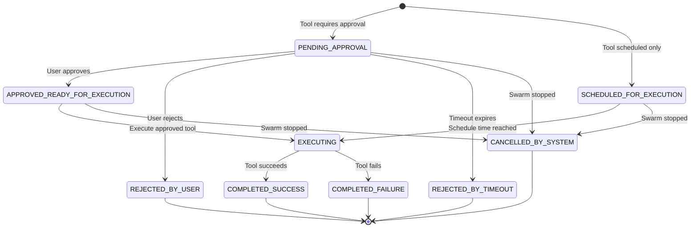
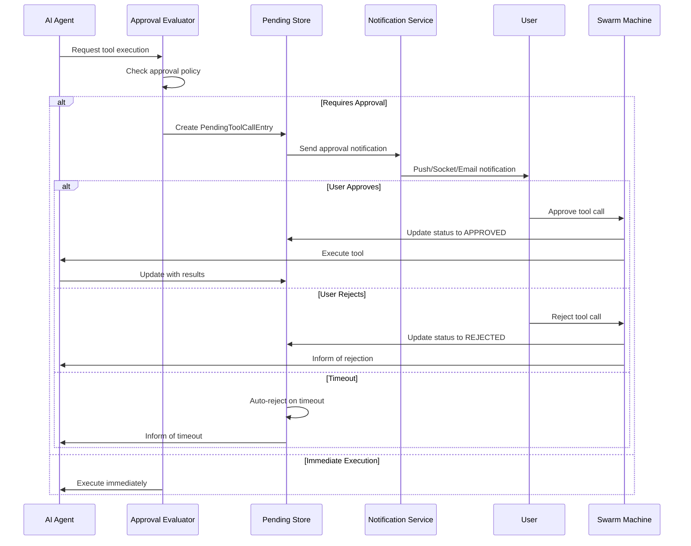

# 🛡️ Tool Approval & Scheduling System: User Control Over AI Actions

> **TL;DR**: Vrooli's tool approval system gives users fine-grained control over AI agent actions. Tools can require explicit approval, be scheduled for later execution, or run immediately based on configurable policies. This ensures safety, cost control, and user oversight of autonomous operations.

---

## 🎯 Overview: Why Tool Approval Matters

When AI agents have access to powerful tools—from web searches to financial transactions—users need control over what gets executed automatically vs. what requires approval. Our tool approval system provides this control through:

- **Granular Approval Policies**: Configure which tools require approval vs. automatic execution
- **Flexible Scheduling**: Schedule tool calls for later execution with customizable delays
- **User-Friendly Approval Interface**: Real-time notifications and easy approve/reject workflows
- **Timeout Handling**: Automatic rejection when approval isn't provided within time limits
- **Audit Trail**: Complete tracking of all approval decisions and tool executions

```mermaid
graph TB
    subgraph "🤖 AI Agent Tool Request"
        TR[Tool Request<br/>🔧 Tool: web_search<br/>💰 Est. Cost: 150 credits<br/>⏰ Timeout: 5 minutes]
    end
    
    subgraph "⚖️ Policy Evaluation"
        PE{Policy Check}
        PE -->|Requires Approval| PA[Approval Required]
        PE -->|Schedule Only| PS[Schedule for Later]
        PE -->|Immediate| PI[Execute Immediately]
    end
    
    subgraph "👤 User Interaction"
        UN[User Notification<br/>📱 Push/Socket/Email<br/>🔔 Approval deadline<br/>💰 Cost estimate]
        UA[User Decision<br/>✅ Approve<br/>❌ Reject<br/>⏰ Timeout]
    end
    
    subgraph "🔄 Execution Flow"
        EX[Execute Tool<br/>📊 Track results<br/>💰 Record actual cost<br/>📝 Audit trail]
        RE[Reject Tool<br/>🚫 Cancel execution<br/>📝 Log rejection reason<br/>💬 Inform agent]
    end
    
    TR --> PE
    PA --> UN --> UA
    PS --> EX
    PI --> EX
    UA -->|Approve| EX
    UA -->|Reject/Timeout| RE
    
    classDef request fill:#e3f2fd,stroke:#1565c0,stroke-width:2px
    classDef policy fill:#f3e5f5,stroke:#7b1fa2,stroke-width:2px
    classDef user fill:#fff3e0,stroke:#f57c00,stroke-width:2px
    classDef execution fill:#e8f5e8,stroke:#2e7d32,stroke-width:2px
    
    class TR request
    class PE,PA,PS,PI policy
    class UN,UA user
    class EX,RE execution
```



---

## 🏗️ System Architecture

### **Core Components**

#### **1. PendingToolCallEntry: The State Model**

Every tool call requiring approval or scheduling is represented by a `PendingToolCallEntry`:

```typescript
interface PendingToolCallEntry {
  // Identification
  pendingId: string;              // Unique Vrooli-generated ID
  toolCallId: string;             // Original LLM tool call ID
  toolName: string;               // Tool being called (e.g., "web_search")
  toolArguments: string;          // JSON-stringified tool arguments
  
  // Context
  callerBotId: string;            // Which bot requested the tool
  conversationId: string;         // Which conversation/swarm
  requestedAt: number;            // When requested (epoch ms)
  
  // Status & Lifecycle
  status: PendingToolCallStatus;  // Current state (see status enum below)
  statusReason?: string;          // Human-readable reason for status
  executionAttempts: number;      // Retry counter
  lastAttemptTime?: number;       // Last execution attempt
  
  // Scheduling & Approval
  scheduledExecutionTime?: number;     // When to execute (epoch ms)
  approvalTimeoutAt?: number;          // When approval expires (epoch ms)
  userIdToApprove?: string;            // Which user must approve
  approvedOrRejectedByUserId?: string; // Who made the decision
  decisionTime?: number;               // When decision was made
  
  // Results (after execution)
  result?: string;                // JSON-stringified tool output
  error?: string;                 // JSON-stringified error details
  cost?: string;                  // Actual credits used (stringified bigint)
}
```

#### **2. PendingToolCallStatus: The State Machine**

Tool calls progress through a well-defined state machine:

```typescript
enum PendingToolCallStatus {
  // Initial States
  PENDING_APPROVAL = "PENDING_APPROVAL",           // Awaiting user approval
  SCHEDULED_FOR_EXECUTION = "SCHEDULED_FOR_EXECUTION", // Scheduled for later
  
  // Approved/Ready States  
  APPROVED_READY_FOR_EXECUTION = "APPROVED_READY_FOR_EXECUTION", // User approved
  
  // Rejection States
  REJECTED_BY_USER = "REJECTED_BY_USER",           // User declined
  REJECTED_BY_TIMEOUT = "REJECTED_BY_TIMEOUT",     // Approval timed out
  
  // Execution States
  EXECUTING = "EXECUTING",                         // Currently running
  COMPLETED_SUCCESS = "COMPLETED_SUCCESS",         // Executed successfully
  COMPLETED_FAILURE = "COMPLETED_FAILURE",         // Execution failed
  CANCELLED_BY_SYSTEM = "CANCELLED_BY_SYSTEM"      // System cancelled (e.g., swarm stopped)
}
```



---

## ⚙️ Configuration System

### **Swarm-Level Tool Approval Policies**

Tool approval behavior is configured per swarm through the `scheduling` section of `ChatConfigObject`:

```typescript
interface ToolSchedulingConfig {
  // Default behavior for tools not explicitly configured
  defaultDelayMs?: number;                    // Default delay in milliseconds
  
  // Tool-specific delays (overrides defaultDelayMs)
  toolSpecificDelays?: { [toolName: string]: number };
  
  // Approval requirements
  requiresApprovalTools?: string[] | "all" | "none";  // Which tools need approval
  
  // Approval timeout settings
  approvalTimeoutMs?: number;                 // How long to wait for approval
  autoRejectOnTimeout?: boolean;              // Auto-reject vs. keep pending
}
```

### **Example Configurations**

#### **High-Security Financial Trading Team**
```typescript
const financialTradingScheduling: ToolSchedulingConfig = {
  // All financial tools require approval
  requiresApprovalTools: [
    "execute_trade",
    "transfer_funds", 
    "modify_portfolio",
    "external_api_call"
  ],
  
  // Conservative approval timeout
  approvalTimeoutMs: 5 * 60 * 1000, // 5 minutes
  autoRejectOnTimeout: true,         // Auto-reject for safety
  
  // Non-financial tools can run with short delays
  defaultDelayMs: 2000, // 2 seconds for logging/audit
  toolSpecificDelays: {
    "market_data_fetch": 0,      // Immediate - read-only
    "risk_analysis": 1000,       // 1 second delay
    "compliance_check": 0        // Immediate - safety tool
  }
};
```

#### **Content Creation Team** 
```typescript
const contentCreationScheduling: ToolSchedulingConfig = {
  // Only expensive tools require approval
  requiresApprovalTools: [
    "advanced_image_generation",  // High cost
    "video_processing",           // High cost
    "premium_ai_model"            // High cost
  ],
  
  // Generous approval timeout for creative work
  approvalTimeoutMs: 30 * 60 * 1000, // 30 minutes
  autoRejectOnTimeout: false,         // Keep pending
  
  // Most tools run immediately
  defaultDelayMs: 0,
  toolSpecificDelays: {
    "web_search": 0,           // Immediate
    "text_generation": 0,      // Immediate
    "image_resize": 500        // Brief delay for rate limiting
  }
};
```

#### **Development/Testing Team**
```typescript
const developmentScheduling: ToolSchedulingConfig = {
  // All tools require approval during testing
  requiresApprovalTools: "all",
  
  // Short timeout for development velocity
  approvalTimeoutMs: 2 * 60 * 1000, // 2 minutes
  autoRejectOnTimeout: true,
  
  // No additional delays
  defaultDelayMs: 0
};
```

---

## 🔄 Execution Flow

### **1. Tool Call Initiation**

When an AI agent wants to use a tool, the system evaluates the approval policy:

```typescript
class ToolApprovalEvaluator {
  determineToolScheduling(
    toolName: string,
    config: ChatConfigObject
  ): SchedulingDecision {
    const scheduling = config.scheduling || this.getDefaultScheduling();
    
    // Check if tool requires approval
    const requiresApproval = this.toolRequiresApproval(toolName, scheduling);
    
    if (requiresApproval) {
      return {
        requiresApproval: true,
        requiresSchedulingOnly: false,
        approvalTimeoutMs: scheduling.approvalTimeoutMs || 300000 // 5 min default
      };
    }
    
    // Check if tool has scheduling delay
    const delayMs = scheduling.toolSpecificDelays?.[toolName] 
                    ?? scheduling.defaultDelayMs 
                    ?? 0;
    
    if (delayMs > 0) {
      return {
        requiresApproval: false,
        requiresSchedulingOnly: true,
        specificDelayMs: delayMs
      };
    }
    
    // Execute immediately
    return {
      requiresApproval: false,
      requiresSchedulingOnly: false
    };
  }
  
  private toolRequiresApproval(
    toolName: string, 
    scheduling: ToolSchedulingConfig
  ): boolean {
    if (scheduling.requiresApprovalTools === "all") return true;
    if (scheduling.requiresApprovalTools === "none") return false;
    
    return Array.isArray(scheduling.requiresApprovalTools) 
           && scheduling.requiresApprovalTools.includes(toolName);
  }
}
```

### **2. Approval Required Flow**

When a tool requires approval, the system:



### **3. User Notification System**

The system supports multiple notification channels:

#### **Real-Time Notifications (Active Users)**
```typescript
// WebSocket notification for active users
SocketService.emitSocketEvent("tool_approval_required", conversationId, {
  pendingId: "pending_123",
  toolCallId: "call_456", 
  toolName: "web_search",
  toolArguments: { query: "market analysis", maxResults: 10 },
  callerBotId: "bot_789",
  callerBotName: "Market Analyst",
  approvalTimeoutAt: 1705123456789,
  estimatedCost: "150"
});
```

#### **Push Notifications (Inactive Users)**
```typescript
// Push notification for offline users
Notify(userLanguages)
  .pushToolApprovalRequired(
    conversationId,
    pendingId,
    toolName,
    callerBotName,
    conversationName,
    approvalTimeoutAt,
    estimatedCost,
    autoRejectOnTimeout
  )
  .toUser(userId);
```

### **4. Approval Decision Processing**

Users respond through the `/task/respondToToolApproval` endpoint:

```typescript
interface RespondToToolApprovalInput {
  conversationId: string;    // Which conversation
  pendingId: string;         // Which pending tool call
  approved: boolean;         // Approve or reject
  reason?: string;           // Optional reason for decision
}

// Example approval
{
  conversationId: "conv_123",
  pendingId: "pending_456", 
  approved: true,
  reason: "Market analysis is needed for quarterly report"
}

// Example rejection
{
  conversationId: "conv_123",
  pendingId: "pending_789",
  approved: false,
  reason: "Cost too high, use cached data instead"
}
```

---

## 📊 Integration with Event System

The tool approval system emits events for monitoring and automation:

### **Approval-Related Events**

| Event Type | When Triggered | Payload | Subscribers |
|------------|----------------|---------|-------------|
| `tool/approval_required` | Tool needs user approval | `{ pendingId, toolName, estimatedCost, timeoutAt }` | Notification agents, UI components |
| `tool/approval_granted` | User approves tool | `{ pendingId, toolName, approvedBy, reason }` | Audit agents, analytics |
| `tool/approval_rejected` | User rejects tool | `{ pendingId, toolName, rejectedBy, reason }` | Learning agents, cost optimization |
| `tool/approval_timeout` | Approval times out | `{ pendingId, toolName, timeoutDuration }` | Reliability agents, policy tuning |
| `tool/scheduled_execution` | Tool scheduled for later | `{ pendingId, toolName, scheduledFor }` | Scheduling agents, workload balancing |

### **Example Event Handlers**

```typescript
// Cost optimization agent learns from rejections
eventBus.subscribe('tool/approval_rejected', async (event) => {
  const { toolName, reason } = event.payload;
  
  if (reason?.includes('cost') || reason?.includes('expensive')) {
    await costOptimizer.suggestCheaperAlternative(toolName);
    await costOptimizer.adjustCostThresholds(toolName);
  }
});

// Learning agent improves approval predictions
eventBus.subscribe(['tool/approval_granted', 'tool/approval_rejected'], async (event) => {
  const { toolName, reason, estimatedCost } = event.payload;
  
  await learningAgent.updateApprovalPatterns({
    tool: toolName,
    cost: estimatedCost,
    approved: event.type === 'tool/approval_granted',
    userReason: reason
  });
});
```

---

## 🛡️ Safety & Security Features

### **1. Timeout Protection**

Prevents tools from hanging indefinitely awaiting approval:

```typescript
class TimeoutManager {
  async scheduleTimeout(pendingCall: PendingToolCallEntry): Promise<void> {
    const timeoutMs = pendingCall.approvalTimeoutAt! - Date.now();
    
    setTimeout(async () => {
      const currentStatus = await this.getCurrentStatus(pendingCall.pendingId);
      
      if (currentStatus === PendingToolCallStatus.PENDING_APPROVAL) {
        await this.handleTimeout(pendingCall);
      }
    }, timeoutMs);
  }
  
  private async handleTimeout(pendingCall: PendingToolCallEntry): Promise<void> {
    const config = await this.getSwarmConfig(pendingCall.conversationId);
    const autoReject = config.scheduling?.autoRejectOnTimeout ?? true;
    
    if (autoReject) {
      pendingCall.status = PendingToolCallStatus.REJECTED_BY_TIMEOUT;
      pendingCall.statusReason = "Approval timed out";
      pendingCall.decisionTime = Date.now();
      
      await this.notifySwarm(pendingCall, 'timeout_rejection');
    }
    
    // Emit timeout event for learning/optimization
    await eventBus.publish('tool/approval_timeout', {
      pendingId: pendingCall.pendingId,
      toolName: pendingCall.toolName,
      timeoutDuration: Date.now() - pendingCall.requestedAt
    });
  }
}
```

### **2. Permission Validation**

Ensures only authorized users can approve/reject:

```typescript
class PermissionValidator {
  async validateApprovalPermission(
    pendingCall: PendingToolCallEntry,
    requestingUser: SessionUser
  ): Promise<ValidationResult> {
    
    // Check if specific user is required
    if (pendingCall.userIdToApprove && 
        pendingCall.userIdToApprove !== requestingUser.id) {
      return {
        valid: false,
        reason: `Only user ${pendingCall.userIdToApprove} can approve this tool call`
      };
    }
    
    // Check conversation access
    const hasAccess = await this.userHasConversationAccess(
      requestingUser.id, 
      pendingCall.conversationId
    );
    
    if (!hasAccess) {
      return {
        valid: false,
        reason: "User does not have access to this conversation"
      };
    }
    
    // Check team-specific approval policies
    const teamPolicy = await this.getTeamApprovalPolicy(pendingCall.conversationId);
    if (teamPolicy && !teamPolicy.authorizedApprovers.includes(requestingUser.id)) {
      return {
        valid: false,
        reason: "User not authorized to approve tools for this team"
      };
    }
    
    return { valid: true };
  }
}
```

### **3. Cost Protection**

Prevents runaway costs through approval thresholds:

```typescript
class CostProtection {
  async evaluateCostPolicy(
    toolName: string,
    estimatedCost: number,
    swarmConfig: ChatConfigObject
  ): Promise<CostPolicyDecision> {
    
    const costThresholds = swarmConfig.costProtection || this.getDefaultThresholds();
    
    // Always require approval for high-cost tools
    if (estimatedCost > costThresholds.requireApprovalAbove) {
      return {
        requiresApproval: true,
        reason: `Cost ${estimatedCost} exceeds threshold ${costThresholds.requireApprovalAbove}`
      };
    }
    
    // Check daily spending limits
    const dailySpending = await this.getDailySpending(swarmConfig.teamId);
    if (dailySpending + estimatedCost > costThresholds.dailyLimit) {
      return {
        requiresApproval: true,
        reason: `Would exceed daily spending limit`
      };
    }
    
    return { requiresApproval: false };
  }
}
```

---

## 📈 Analytics & Optimization

### **Approval Pattern Analytics**

The system tracks approval patterns to optimize policies:

```typescript
class ApprovalAnalytics {
  async generateApprovalInsights(teamId: string): Promise<ApprovalInsights> {
    const data = await this.getApprovalHistory(teamId);
    
    return {
      // Tool-specific patterns
      toolApprovalRates: data.groupBy('toolName').map(group => ({
        tool: group.key,
        approvalRate: group.approvals / group.total,
        avgApprovalTime: group.avgApprovalTime,
        commonRejectionReasons: group.getTopRejectionReasons()
      })),
      
      // User behavior patterns
      userApprovalPatterns: data.groupBy('approverId').map(group => ({
        userId: group.key,
        avgResponseTime: group.avgResponseTime,
        approvalRate: group.approvalRate,
        mostRejectedTools: group.getMostRejectedTools()
      })),
      
      // Cost optimization opportunities
      costOptimizations: [
        ...this.identifyOverApprovedTools(data),
        ...this.identifyUnderApprovedTools(data)
      ],
      
      // Policy recommendations
      policyRecommendations: this.generatePolicyRecommendations(data)
    };
  }
  
  private generatePolicyRecommendations(data: ApprovalData[]): PolicyRecommendation[] {
    const recommendations: PolicyRecommendation[] = [];
    
    // Tools with 100% approval rate could be auto-approved
    const alwaysApproved = data.filter(d => d.approvalRate === 1.0 && d.totalRequests > 10);
    alwaysApproved.forEach(tool => {
      recommendations.push({
        type: 'remove_approval_requirement',
        tool: tool.toolName,
        reason: `${tool.toolName} has 100% approval rate over ${tool.totalRequests} requests`,
        estimatedTimeSavings: tool.avgApprovalTime * tool.averageMonthlyUsage
      });
    });
    
    // Tools with frequent rejections might need cost optimization
    const frequentlyRejected = data.filter(d => d.approvalRate < 0.5 && d.totalRequests > 5);
    frequentlyRejected.forEach(tool => {
      recommendations.push({
        type: 'optimize_tool_cost',
        tool: tool.toolName,
        reason: `${tool.toolName} rejected ${(1-tool.approvalRate)*100}% of time, often for cost reasons`,
        topRejectionReason: tool.topRejectionReason
      });
    });
    
    return recommendations;
  }
}
```

---

## 🔗 Related Documentation

- **[Event Catalog](event-driven/event-catalog.md)** - Complete event definitions including tool approval events
- **[Security Architecture](security/README.md)** - Security frameworks that integrate with tool approval
- **[Resource Management](resource-management/README.md)** - Cost tracking and credit management
- **[Swarm State Management](swarm-state-management.md)** - How tool approvals are persisted in swarm state
- **[MCP Integration](communication/mcp-integration.md)** - How MCP tools integrate with the approval system

---

> 💡 **Implementation Priority**: The tool approval system is essential for production deployments where AI agents have access to sensitive or costly tools. Teams should configure approval policies before enabling autonomous tool usage in production environments. 