# 🔧 Types System: The Foundation of Type Safety

> **TL;DR**: This directory contains Vrooli's comprehensive type system for the three-tier execution architecture. All interfaces, enums, and types are centralized here to ensure consistency and type safety across the entire system.

---

## 📚 What's in This Directory

### **🎯 Core Files**
- **[`core-types.ts`](./core-types.ts)** - The **single source of truth** for all execution architecture types (746 lines of comprehensive type definitions)
- **[`index.ts`](./index.ts)** - Re-exports and type utilities for easy importing

### **🧠 Type Categories**

The type system is organized into logical categories that mirror the execution architecture:

```mermaid
graph TB
    subgraph "Types Hierarchy"
        subgraph "🎯 Core Infrastructure"
            SWARM[SwarmContext<br/>TeamLeaderConfig<br/>ChatConfigObject]
            RUN[RunContext<br/>RunProgress<br/>RunLimits]
            EXEC[ExecutionContext<br/>StepResult<br/>ResourceUsage]
        end
        
        subgraph "🧭 Navigation & Workflow"
            NAV[NavigatorType<br/>RoutineStep<br/>NavigationDecision]
            BPMN[BpmnConfig<br/>BpmnElement<br/>GraphBpmnConfig]
            NATIVE[VrooliNativeConfig<br/>NativeStep<br/>GraphCustomConfig]
        end
        
        subgraph "⚙️ Tools & Resources"
            TOOL[ToolRequest<br/>ToolApproval<br/>ToolResponse]
            RES[ResourceRequirements<br/>ResourceUsage<br/>ResourceLimits]
        end
        
        subgraph "🔐 Security & Permissions"
            PERM[Permission<br/>SecurityContext<br/>ApprovalConfig]
            DATA[DataSensitivity<br/>EncryptionLevel<br/>AuditTrail]
        end
    end
    
    classDef core fill:#e3f2fd,stroke:#1565c0,stroke-width:3px
    classDef nav fill:#e8f5e8,stroke:#2e7d32,stroke-width:3px
    classDef tool fill:#fff3e0,stroke:#f57c00,stroke-width:3px
    classDef sec fill:#fce4ec,stroke:#c2185b,stroke-width:3px
    
    class SWARM,RUN,EXEC core
    class NAV,BPMN,NATIVE nav
    class TOOL,RES tool
    class PERM,DATA sec
```



---

## 🏠 Native Vrooli Workflow Format Types

The **CUSTOM** navigator type implements Vrooli's native workflow format - a clean, AI-friendly JSON-based alternative to BPMN for straightforward workflows.

### **🎯 Core Native Types**

```typescript
// Main routine configuration for CUSTOM navigator
interface VrooliNativeRoutine {
    routineId: string;
    version: string;
    name: string;
    description?: string;
    navigatorType: "custom";
    
    // Core workflow definition
    steps: NativeRoutineStep[];
    inputs: NativeInputSpec[];
    outputs: NativeOutputSpec[];
    
    // Execution configuration
    defaultStrategy: StrategyType;
    resourceRequirements: ResourceRequirements;
    
    // Optional metadata
    metadata?: RoutineMetadata;
}

// Individual step in native workflow
interface NativeRoutineStep {
    stepId: string;
    stepType: NativeStepType;
    name: string;
    description?: string;
    
    // Data flow - simple string mappings
    inputMappings: Record<string, string>;   // "param": "inputs.value" or "step_1.output"
    outputMappings: Record<string, string>;  // "result": "step_output" 
    
    // Step behavior
    configuration: Record<string, unknown>;  // Tool-specific config
    required: boolean;                       // Whether step failure fails entire routine
    timeout?: number;                        // Max execution time in ms
    strategy?: StrategyType;                 // Override routine default
    retryPolicy?: RetryPolicy;               // Custom retry behavior
    
    // Conditional execution (for decision steps)
    condition?: NativeCondition;
    
    // Parallel execution (for parallel steps)
    branches?: NativeRoutineStep[];
    
    // Loop configuration (for loop steps)
    loopConfig?: NativeLoopConfig;
}

// Step types supported by native format
enum NativeStepType {
    PROCESS = "process",     // Standard processing step
    DECISION = "decision",   // Conditional branching
    PARALLEL = "parallel",   // Execute branches in parallel
    LOOP = "loop",          // Iterative execution
    WAIT = "wait",          // Wait for event or time
    CHECKPOINT = "checkpoint" // Save state for recovery
}

// Simple condition evaluation
interface NativeCondition {
    field: string;                    // "step_1.output.status"
    operator: NativeOperator;         // "equals", "greater_than", etc.
    value: unknown;                   // Comparison value
    nextStepId?: string;              // Step to execute if true
    elseStepId?: string;              // Step to execute if false
}

enum NativeOperator {
    EQUALS = "equals",
    NOT_EQUALS = "not_equals", 
    GREATER_THAN = "greater_than",
    LESS_THAN = "less_than",
    CONTAINS = "contains",
    EXISTS = "exists",
    MATCHES_REGEX = "matches_regex"
}

// Loop configuration
interface NativeLoopConfig {
    type: NativeLoopType;
    maxIterations?: number;           // Safety limit
    condition?: NativeCondition;      // When to continue looping
    iterateOver?: string;            // Field to iterate over ("inputs.items")
    currentItemVar?: string;         // Variable name for current item
    indexVar?: string;               // Variable name for current index
}

enum NativeLoopType {
    WHILE = "while",                 // Loop while condition is true
    FOR_EACH = "for_each",          // Iterate over array/object
    FOR_COUNT = "for_count",        // Loop N times
    UNTIL = "until"                 // Loop until condition is true
}

// Input/Output specifications
interface NativeInputSpec {
    name: string;
    type: NativeDataType;
    required: boolean;
    description?: string;
    defaultValue?: unknown;
    validation?: NativeValidation;
}

interface NativeOutputSpec {
    name: string;
    type: NativeDataType;
    description?: string;
    sensitivity?: DataSensitivity;
}

enum NativeDataType {
    STRING = "string",
    NUMBER = "number", 
    BOOLEAN = "boolean",
    OBJECT = "object",
    ARRAY = "array",
    ANY = "any"
}

// Validation rules for inputs
interface NativeValidation {
    pattern?: string;                // Regex pattern
    minLength?: number;
    maxLength?: number;
    minValue?: number;
    maxValue?: number;
    allowedValues?: unknown[];       // Enum-like validation
    required?: boolean;
}
```

### **🔄 Navigation Integration**

```typescript
// Graph config for CUSTOM navigator
interface GraphCustomConfig extends GraphConfig {
    __type: "CUSTOM-1.0";
    routine: VrooliNativeRoutine;
    
    // Runtime state
    executionHistory?: NativeExecutionStep[];
    checkpoints?: NativeCheckpoint[];
    
    // Configuration overrides
    globalTimeout?: number;
    globalRetryPolicy?: RetryPolicy;
    parallelismLimit?: number;
}

// Execution tracking
interface NativeExecutionStep {
    stepId: string;
    status: StepStatus;
    startTime: Date;
    endTime?: Date;
    inputs: Record<string, unknown>;
    outputs: Record<string, unknown>;
    errors?: ExecutionError[];
    retryCount: number;
}

// State checkpointing
interface NativeCheckpoint {
    checkpointId: string;
    stepId: string;
    timestamp: Date;
    variables: Record<string, unknown>;
    executionPath: string[];         // Steps completed so far
    nextSteps: string[];            // Steps ready to execute
}
```

### **🎯 Usage Examples**

#### **Sequential Data Processing**
```typescript
const dataProcessingRoutine: VrooliNativeRoutine = {
    routineId: "data_pipeline_v1",
    navigatorType: "custom",
    steps: [
        {
            stepId: "extract",
            stepType: NativeStepType.PROCESS,
            name: "Extract Data",
            inputMappings: { "source": "inputs.data_source" },
            outputMappings: { "raw_data": "extract_output" },
            configuration: { tool: "data_extractor" },
            required: true
        },
        {
            stepId: "transform", 
            stepType: NativeStepType.PROCESS,
            name: "Transform Data",
            inputMappings: { "data": "extract_output.raw_data" },
            outputMappings: { "clean_data": "transform_output" },
            configuration: { tool: "data_transformer" },
            required: true
        },
        {
            stepId: "load",
            stepType: NativeStepType.PROCESS, 
            name: "Load Data",
            inputMappings: { "data": "transform_output.clean_data" },
            outputMappings: { "success": "final_output" },
            configuration: { tool: "database_loader" },
            required: true
        }
    ]
    // ... rest of configuration
};
```

#### **Conditional Processing**
```typescript
const conditionalRoutine: VrooliNativeRoutine = {
    // ...
    steps: [
        {
            stepId: "check_data_quality",
            stepType: NativeStepType.DECISION,
            name: "Quality Check",
            inputMappings: { "data": "inputs.dataset" },
            configuration: { tool: "quality_checker" },
            condition: {
                field: "quality_check.score",
                operator: NativeOperator.GREATER_THAN,
                value: 0.8,
                nextStepId: "process_high_quality",
                elseStepId: "process_low_quality"
            },
            required: true
        },
        {
            stepId: "process_high_quality",
            stepType: NativeStepType.PROCESS,
            // ... high quality processing
        },
        {
            stepId: "process_low_quality", 
            stepType: NativeStepType.PROCESS,
            // ... low quality processing with additional validation
        }
    ]
    // ...
};
```

### **⚖️ When to Use Native vs BPMN**

| **Scenario** | **Native (CUSTOM)** | **BPMN** |
|-------------|-------------------|----------|
| **Sequential workflows** | ✅ Perfect fit | ⚠️ Overkill |
| **AI-generated routines** | ✅ Easy to generate | ❌ Complex for AI |
| **Simple branching** | ✅ Clean conditions | ⚠️ Works but verbose |
| **Complex business logic** | ❌ Limited | ✅ Full featured |
| **Regulatory compliance** | ❌ Not standard | ✅ Industry standard |
| **Event-driven processes** | ⚠️ Basic support | ✅ Advanced events |
| **Rapid prototyping** | ✅ Quick to write | ❌ Requires modeling |
| **Multi-party coordination** | ❌ Limited | ✅ Sophisticated |

---

## 🔧 Type Safety & Validation

### **Runtime Validation**
```typescript
// All native workflows are validated at runtime
interface NativeWorkflowValidator {
    validateRoutine(routine: VrooliNativeRoutine): ValidationResult;
    validateStep(step: NativeRoutineStep): ValidationResult;
    validateDataFlow(routine: VrooliNativeRoutine): ValidationResult;
    validateCircularDependencies(routine: VrooliNativeRoutine): ValidationResult;
}

interface ValidationResult {
    valid: boolean;
    errors: ValidationError[];
    warnings: ValidationWarning[];
    suggestions: string[];
}
```

### **Type Guards & Utilities**
```typescript
// Type guards for native format
function isNativeRoutine(config: unknown): config is VrooliNativeRoutine;
function isNativeStep(step: unknown): step is NativeRoutineStep;
function isGraphCustomConfig(config: GraphConfig): config is GraphCustomConfig;

// Utility functions
function createNativeRoutine(template: Partial<VrooliNativeRoutine>): VrooliNativeRoutine;
function validateNativeWorkflow(routine: VrooliNativeRoutine): ValidationResult;
function convertToNativeFormat(bpmnXml: string): VrooliNativeRoutine;
```

---

## 📖 Using the Types

### **Import Pattern**
```typescript
// Import everything you need
import {
    VrooliNativeRoutine,
    NativeRoutineStep,
    NativeStepType,
    GraphCustomConfig,
    NavigatorType
} from "./types/index.js";

// Create type-safe workflows
const myRoutine: VrooliNativeRoutine = {
    navigatorType: NavigatorType.CUSTOM,
    // ... TypeScript will validate everything
};
```

### **Type Documentation**
- **Comprehensive JSDoc**: Every interface includes detailed documentation
- **Usage examples**: Real-world examples for each major type
- **Migration guides**: How to convert between formats
- **Best practices**: Recommended patterns for each use case

---

## 🚀 Next Steps

1. **[Explore Concrete Examples](../concrete-examples.md)** - See these types in action
2. **[Read Navigator Documentation](../tiers/tier2-process-intelligence/navigators.md)** - Understand how navigators use these types
3. **[Check Implementation Guide](../implementation-guide.md)** - Start building with these types
4. **[Browse core-types.ts](./core-types.ts)** - See the complete type definitions

The native Vrooli format provides a perfect balance of simplicity and power, making it the ideal fallback navigator for the majority of AI-generated workflows while maintaining a clear upgrade path to BPMN when complexity demands it.

---

## 🚀 Quick Start Guide

### **📥 Importing Types**

```typescript
// Import everything from the centralized index
import { 
    RoutineExecutionRequest,
    StepExecutionResult,
    ExecutionStrategy,
    StrategyType,
    RunContext
} from '@/architecture/execution/types';

// Or import specific categories
import { 
    SecurityContext, 
    Permission, 
    AuditEntry 
} from '@/architecture/execution/types/core-types';
```

### **🏗️ Basic Usage Examples**

#### **Creating an Execution Request**
```typescript
const executionRequest: RoutineExecutionRequest = {
    routineId: "routine_123",
    requestId: "req_456",
    conversationId: "conv_789",
    initiatingAgent: "agent_abc",
    
    inputs: {
        inputData: "Hello world",
        maxTokens: 1000
    },
    
    resourceLimits: {
        maxCredits: 100,
        maxDurationMs: 30000,
        maxConcurrentBranches: 3,
        maxMemoryMB: 512,
        maxToolCalls: 10
    },
    
    priority: ExecutionPriority.NORMAL,
    
    permissions: [
        {
            resource: "tool:web_search",
            action: "execute",
            effect: PermissionEffect.ALLOW,
            scope: "global",
            priority: 1
        }
    ],
    
    sensitivityLevel: DataSensitivity.INTERNAL,
    approvalConfig: {
        required: false,
        approvers: [],
        threshold: 0,
        timeoutMs: 5000,
        autoRejectOnTimeout: true
    },
    
    securityContext: {
        requesterTier: Tier.TIER_1,
        targetTier: Tier.TIER_3,
        operation: "routine_execution",
        clearanceLevel: SecurityClearance.INTERNAL,
        permissions: [],
        auditTrail: [],
        encryptionRequired: false,
        signatureRequired: false,
        sessionId: "session_xyz",
        timestamp: new Date()
    }
};
```

#### **Defining Execution Strategies**
```typescript
const conversationalStrategy: ExecutionStrategy = {
    type: StrategyType.CONVERSATIONAL,
    configuration: {
        model: "gpt-4",
        temperature: 0.7,
        maxTokens: 2000
    },
    costMultiplier: 1.0,
    qualityTarget: 0.8
};

const deterministicStrategy: ExecutionStrategy = {
    type: StrategyType.DETERMINISTIC,
    configuration: {
        cacheEnabled: true,
        validateOutputSchema: true
    },
    fallbackStrategy: conversationalStrategy,
    costMultiplier: 0.1,
    qualityTarget: 0.95
};
```

#### **Working with Context Variables**
```typescript
const contextVar: ContextVariable = {
    key: "user_preference",
    value: { theme: "dark", language: "en" },
    source: VariableSource.USER,
    timestamp: new Date(),
    sensitivity: DataSensitivity.INTERNAL,
    mutable: true
};

// Context conflict resolution
const conflictResolution: VariableConflict = {
    key: "shared_data",
    parentValue: { count: 5 },
    childValue: { count: 10 },
    resolutionStrategy: ConflictResolutionStrategy.TIMESTAMP_LATEST
};
```

---

## 📊 Type Categories Reference

### **🎯 Execution Core Types**

| Type | Purpose | Key Fields |
|------|---------|------------|
| `RoutineManifest` | Complete routine definition | `routineId`, `steps[]`, `navigatorType` |
| `RoutineStep` | Individual step definition | `stepId`, `stepType`, `strategy` |
| `ExecutionStrategy` | Strategy configuration | `type`, `configuration`, `costMultiplier` |
| `ResourceRequirements` | Resource specifications | `minCredits`, `estimatedDurationMs` |

### **🔒 Security & Permissions**

| Type | Purpose | Key Fields |
|------|---------|------------|
| `SecurityContext` | Security boundary info | `