# 🔄 URL Redirection System for Swarm Simulation Mode

> **TL;DR**: A comprehensive system for redirecting external API calls at the swarm level, enabling simulation mode, testing environments, and flexible endpoint management for AI agent coordination.

---

## 🎯 Overview

The URL Redirection System allows swarms to transparently redirect all external API calls from production endpoints to test/simulation endpoints. This is essential for:

- **Simulation Mode**: Redirect `yoursite.com/*` → `testsite.com/*`
- **Testing Environments**: Route calls to mock services
- **A/B Testing**: Direct different swarms to different API versions
- **Cost Management**: Route expensive calls to local mock services
- **Development**: Use staging endpoints without code changes

### **Key Features**

- **Swarm-Level Configuration**: Each swarm can have its own redirection rules
- **Pattern-Based Matching**: Support for wildcard and regex patterns
- **Conditional Redirection**: Rules based on swarm context, user, or execution environment
- **Transparent Operation**: No changes needed to existing routines
- **Audit Trail**: Full logging of redirected calls

---

## 🏗️ Architecture Overview

```mermaid
graph TB
    subgraph "🎯 Swarm Level"
        SwarmConfig[Swarm Configuration<br/>🔄 URL redirection rules<br/>🎯 Simulation mode settings<br/>📊 Environment mappings]
    end
    
    subgraph "⚙️ Execution Flow"
        T1[Tier 1: SwarmStateMachine<br/>🔧 Apply swarm redirection context]
        T2[Tier 2: RunStateMachine<br/>📊 Propagate redirection context]
        T3[Tier 3: UnifiedExecutor<br/>🛠️ Execute with redirected URLs]
    end
    
    subgraph "🔌 Redirection Engine"
        URLRedirector[URL Redirector<br/>🔄 Pattern matching<br/>🎯 Rule application<br/>📝 Audit logging]
        
        RuleEngine[Rule Engine<br/>📋 Evaluate conditions<br/>🎯 Apply transformations<br/>⚡ Cache results]
        
        ConfigStore[Configuration Store<br/>💾 Redirection rules<br/>🔒 Access control<br/>📊 Version management]
    end
    
    subgraph "🛠️ Tool Execution"
        ApiTool[API Tool<br/>🌐 External API calls<br/>🔄 URL transformation<br/>📊 Response handling]
        
        WebTool[Web Search Tool<br/>🔍 Search engine calls<br/>🔄 Endpoint redirection<br/>📝 Result processing]
        
        CodeTool[Code Execution Tool<br/>💻 Sandbox environment<br/>🔄 Network redirection<br/>📊 Resource tracking]
    end
    
    SwarmConfig --> T1
    T1 --> T2 --> T3
    
    T3 --> URLRedirector
    URLRedirector --> RuleEngine
    RuleEngine --> ConfigStore
    
    URLRedirector --> ApiTool
    URLRedirector --> WebTool
    URLRedirector --> CodeTool
    
    classDef swarm fill:#e3f2fd,stroke:#1565c0,stroke-width:2px
    classDef execution fill:#f3e5f5,stroke:#7b1fa2,stroke-width:2px
    classDef redirection fill:#e8f5e8,stroke:#2e7d32,stroke-width:2px
    classDef tools fill:#fff3e0,stroke:#f57c00,stroke-width:2px
    
    class SwarmConfig swarm
    class T1,T2,T3 execution
    class URLRedirector,RuleEngine,ConfigStore redirection
    class ApiTool,WebTool,CodeTool tools
```



---

## 📊 Configuration Schema

### **Swarm-Level Redirection Configuration**

```typescript
// packages/shared/src/execution/types/redirection.ts

export interface URLRedirectionConfig {
    /** Enable/disable URL redirection for this swarm */
    enabled: boolean;
    
    /** Redirection mode */
    mode: RedirectionMode;
    
    /** Redirection rules ordered by priority */
    rules: RedirectionRule[];
    
    /** Default behavior when no rules match */
    defaultBehavior: 'allow' | 'block' | 'redirect';
    
    /** Default redirect target when defaultBehavior is 'redirect' */
    defaultRedirectTarget?: string;
    
    /** Audit configuration */
    audit: {
        enabled: boolean;
        logLevel: 'basic' | 'detailed' | 'verbose';
        includeHeaders: boolean;
        includeBody: boolean;
    };
}

export enum RedirectionMode {
    /** Only redirect when simulation mode is active */
    SIMULATION_ONLY = 'simulation_only',
    
    /** Always apply redirection rules */
    ALWAYS = 'always',
    
    /** Redirect based on swarm context */
    CONTEXT_AWARE = 'context_aware',
    
    /** Redirect based on user/team settings */
    USER_CONTROLLED = 'user_controlled'
}

export interface RedirectionRule {
    /** Unique identifier for this rule */
    id: string;
    
    /** Human-readable name */
    name: string;
    
    /** Rule priority (higher numbers = higher priority) */
    priority: number;
    
    /** Pattern to match against URLs */
    pattern: URLPattern;
    
    /** Transformation to apply */
    transformation: URLTransformation;
    
    /** Conditions for when this rule applies */
    conditions?: RedirectionCondition[];
    
    /** Whether this rule is active */
    enabled: boolean;
    
    /** Additional metadata */
    metadata?: {
        description?: string;
        tags?: string[];
        createdBy?: string;
        createdAt?: Date;
    };
}

export interface URLPattern {
    /** Pattern type */
    type: 'exact' | 'prefix' | 'suffix' | 'contains' | 'regex' | 'wildcard';
    
    /** The pattern string */
    pattern: string;
    
    /** Case sensitivity */
    caseSensitive?: boolean;
}

export interface URLTransformation {
    /** Transformation type */
    type: 'replace' | 'prefix' | 'suffix' | 'regex_replace' | 'template';
    
    /** Source pattern or template */
    source: string;
    
    /** Target pattern or template */
    target: string;
    
    /** Additional transformation options */
    options?: {
        preserveQuery?: boolean;
        preserveFragment?: boolean;
        preservePath?: boolean;
        addHeaders?: Record<string, string>;
        addQueryParams?: Record<string, string>;
    };
}

export interface RedirectionCondition {
    /** Condition type */
    type: 'swarm_mode' | 'user_role' | 'execution_context' | 'time_range' | 'custom';
    
    /** Condition operator */
    operator: 'equals' | 'not_equals' | 'contains' | 'regex' | 'in' | 'not_in';
    
    /** Field to check */
    field: string;
    
    /** Expected value(s) */
    value: string | string[] | boolean | number;
}
```

### **Swarm Configuration Integration**

```typescript
// packages/shared/src/execution/types/swarm.ts

export interface SwarmConfiguration {
    // ... existing swarm configuration
    
    /** URL redirection configuration */
    urlRedirection?: URLRedirectionConfig;
    
    /** Simulation mode settings */
    simulationMode?: {
        enabled: boolean;
        mockEndpoints: Record<string, string>;
        mockResponses: Record<string, any>;
        simulationLevel: 'basic' | 'advanced' | 'full';
    };
}
```

---

## 🛠️ Implementation

### **1. URL Redirector Core Engine**

```typescript
// packages/server/src/services/execution/cross-cutting/redirection/urlRedirector.ts

export class URLRedirector {
    constructor(
        private configStore: RedirectionConfigStore,
        private auditLogger: RedirectionAuditLogger,
        private eventBus: EventBus
    ) {}

    /**
     * Apply URL redirection for a swarm context
     */
    async redirectURL(
        originalURL: string,
        context: RedirectionContext
    ): Promise<RedirectionResult> {
        const config = await this.getSwarmRedirectionConfig(context.swarmId);
        
        if (!config.enabled) {
            return {
                originalURL,
                finalURL: originalURL,
                redirected: false,
                rule: null
            };
        }

        // Evaluate redirection rules
        const applicableRules = await this.findApplicableRules(
            originalURL,
            config.rules,
            context
        );

        if (applicableRules.length === 0) {
            return this.handleNoMatchingRules(originalURL, config, context);
        }

        // Apply highest priority rule
        const rule = applicableRules[0];
        const redirectedURL = await this.applyTransformation(
            originalURL,
            rule.transformation,
            context
        );

        const result: RedirectionResult = {
            originalURL,
            finalURL: redirectedURL,
            redirected: true,
            rule: rule.id,
            appliedAt: new Date()
        };

        // Audit logging
        await this.auditLogger.logRedirection(result, context);

        // Emit event for monitoring
        await this.eventBus.emit({
            id: generateId(),
            type: 'redirection/url_redirected',
            timestamp: new Date(),
            executionId: context.executionId,
            tier: 'cross-cutting',
            payload: {
                originalURL,
                redirectedURL,
                ruleId: rule.id,
                swarmId: context.swarmId
            }
        });

        return result;
    }

    private async findApplicableRules(
        url: string,
        rules: RedirectionRule[],
        context: RedirectionContext
    ): Promise<RedirectionRule[]> {
        const applicable: RedirectionRule[] = [];

        for (const rule of rules) {
            if (!rule.enabled) continue;

            // Check pattern match
            const patternMatches = await this.evaluatePattern(url, rule.pattern);
            if (!patternMatches) continue;

            // Check conditions
            const conditionsMatch = await this.evaluateConditions(
                rule.conditions || [],
                context
            );
            if (!conditionsMatch) continue;

            applicable.push(rule);
        }

        // Sort by priority (descending)
        return applicable.sort((a, b) => b.priority - a.priority);
    }

    private async evaluatePattern(
        url: string,
        pattern: URLPattern
    ): Promise<boolean> {
        const testString = pattern.caseSensitive ? url : url.toLowerCase();
        const patternString = pattern.caseSensitive ? pattern.pattern : pattern.pattern.toLowerCase();

        switch (pattern.type) {
            case 'exact':
                return testString === patternString;
            
            case 'prefix':
                return testString.startsWith(patternString);
            
            case 'suffix':
                return testString.endsWith(patternString);
            
            case 'contains':
                return testString.includes(patternString);
            
            case 'wildcard':
                const wildcardRegex = new RegExp(
                    '^' + patternString.replace(/\*/g, '.*').replace(/\?/g, '.') + '$'
                );
                return wildcardRegex.test(testString);
            
            case 'regex':
                const regex = new RegExp(patternString, pattern.caseSensitive ? '' : 'i');
                return regex.test(url);
            
            default:
                return false;
        }
    }

    private async applyTransformation(
        originalURL: string,
        transformation: URLTransformation,
        context: RedirectionContext
    ): Promise<string> {
        const url = new URL(originalURL);

        switch (transformation.type) {
            case 'replace':
                return transformation.target;
            
            case 'prefix':
                return `${transformation.target}${originalURL}`;
            
            case 'suffix':
                return `${originalURL}${transformation.target}`;
            
            case 'regex_replace':
                const regex = new RegExp(transformation.source, 'g');
                return originalURL.replace(regex, transformation.target);
            
            case 'template':
                return this.applyTemplate(transformation.target, {
                    originalURL,
                    hostname: url.hostname,
                    pathname: url.pathname,
                    search: url.search,
                    protocol: url.protocol,
                    context
                });
            
            default:
                throw new Error(`Unknown transformation type: ${transformation.type}`);
        }
    }

    private applyTemplate(
        template: string,
        variables: Record<string, any>
    ): string {
        return template.replace(/\{\{(\w+)\}\}/g, (match, key) => {
            return variables[key] || match;
        });
    }
}

export interface RedirectionContext {
    executionId: string;
    swarmId: string;
    userId: string;
    routineId?: string;
    stepId?: string;
    environment: 'production' | 'staging' | 'development' | 'test';
    simulationMode: boolean;
    userRoles: string[];
    timestamp: Date;
}

export interface RedirectionResult {
    originalURL: string;
    finalURL: string;
    redirected: boolean;
    rule: string | null;
    appliedAt?: Date;
    error?: string;
}
```

### **2. Integration with Tool Execution**

```typescript
// packages/server/src/services/execution/tier3/tools/apiToolWithRedirection.ts

export class APIToolWithRedirection extends BaseTool {
    constructor(
        private urlRedirector: URLRedirector,
        private httpClient: HTTPClient
    ) {}

    async execute(
        params: APIToolParams,
        context: ExecutionContext
    ): Promise<ToolExecutionResult> {
        const redirectionContext: RedirectionContext = {
            executionId: context.executionId,
            swarmId: context.swarmId,
            userId: context.userId,
            routineId: params.routineId,
            stepId: params.stepId,
            environment: this.getEnvironment(),
            simulationMode: context.simulationMode || false,
            userRoles: context.userRoles || [],
            timestamp: new Date()
        };

        // Apply URL redirection
        const redirection = await this.urlRedirector.redirectURL(
            params.endpoint,
            redirectionContext
        );

        // Execute API call with redirected URL
        const apiResult = await this.httpClient.request({
            url: redirection.finalURL,
            method: params.method,
            headers: params.headers,
            body: params.body,
            timeout: params.timeoutMs
        });

        // Include redirection info in response metadata
        return {
            success: true,
            result: apiResult.data,
            metadata: {
                originalURL: redirection.originalURL,
                finalURL: redirection.finalURL,
                redirected: redirection.redirected,
                redirectionRule: redirection.rule,
                responseTime: apiResult.responseTime,
                statusCode: apiResult.statusCode
            }
        };
    }
}
```

### **3. Swarm Configuration Integration**

```typescript
// packages/server/src/services/execution/tier1/coordination/swarmConfigManager.ts

export class SwarmConfigManager {
    async createSwarmWithRedirection(
        swarmConfig: SwarmConfiguration
    ): Promise<SwarmInstance> {
        // Validate redirection configuration
        if (swarmConfig.urlRedirection) {
            await this.validateRedirectionConfig(swarmConfig.urlRedirection);
        }

        // Create swarm with redirection context
        const swarm = await this.createSwarm(swarmConfig);
        
        // Initialize URL redirector for this swarm
        if (swarmConfig.urlRedirection?.enabled) {
            await this.initializeSwarmRedirection(swarm.id, swarmConfig.urlRedirection);
        }

        return swarm;
    }

    async updateSwarmRedirectionConfig(
        swarmId: string,
        config: URLRedirectionConfig
    ): Promise<void> {
        await this.validateRedirectionConfig(config);
        await this.redirectionConfigStore.updateConfig(swarmId, config);
        
        // Emit configuration change event
        await this.eventBus.emit({
            id: generateId(),
            type: 'swarm/redirection_config_updated',
            timestamp: new Date(),
            executionId: swarmId,
            tier: 'tier1',
            payload: { swarmId, config }
        });
    }
}
```

---

## 🎯 Usage Examples

### **Example 1: Simple Simulation Mode**

```typescript
// Configure swarm for simulation mode
const swarmConfig: SwarmConfiguration = {
    // ... other swarm settings
    
    urlRedirection: {
        enabled: true,
        mode: RedirectionMode.SIMULATION_ONLY,
        rules: [
            {
                id: 'prod-to-test-redirect',
                name: 'Production to Test Redirect',
                priority: 100,
                pattern: {
                    type: 'wildcard',
                    pattern: 'https://yoursite.com/*'
                },
                transformation: {
                    type: 'regex_replace',
                    source: 'https://yoursite\\.com',
                    target: 'https://testsite.com'
                },
                conditions: [
                    {
                        type: 'swarm_mode',
                        operator: 'equals',
                        field: 'simulationMode',
                        value: true
                    }
                ],
                enabled: true
            }
        ],
        defaultBehavior: 'allow',
        audit: {
            enabled: true,
            logLevel: 'detailed',
            includeHeaders: false,
            includeBody: false
        }
    },
    
    simulationMode: {
        enabled: true,
        mockEndpoints: {
            'https://yoursite.com/api/users': 'https://testsite.com/api/users',
            'https://yoursite.com/api/orders': 'https://testsite.com/api/orders'
        },
        simulationLevel: 'advanced'
    }
};
```

### **Example 2: Environment-Based Redirection**

```typescript
const environmentRedirection: URLRedirectionConfig = {
    enabled: true,
    mode: RedirectionMode.CONTEXT_AWARE,
    rules: [
        {
            id: 'development-api-redirect',
            name: 'Development API Redirect',
            priority: 200,
            pattern: {
                type: 'prefix',
                pattern: 'https://api.production.com'
            },
            transformation: {
                type: 'regex_replace',
                source: 'https://api\\.production\\.com',
                target: 'https://api.development.com'
            },
            conditions: [
                {
                    type: 'execution_context',
                    operator: 'equals',
                    field: 'environment',
                    value: 'development'
                }
            ],
            enabled: true
        },
        {
            id: 'staging-api-redirect',
            name: 'Staging API Redirect',
            priority: 150,
            pattern: {
                type: 'prefix',
                pattern: 'https://api.production.com'
            },
            transformation: {
                type: 'regex_replace',
                source: 'https://api\\.production\\.com',
                target: 'https://api.staging.com'
            },
            conditions: [
                {
                    type: 'execution_context',
                    operator: 'equals',
                    field: 'environment',
                    value: 'staging'
                }
            ],
            enabled: true
        }
    ],
    defaultBehavior: 'allow',
    audit: {
        enabled: true,
        logLevel: 'basic',
        includeHeaders: true,
        includeBody: false
    }
};
```

### **Example 3: Advanced Template-Based Redirection**

```typescript
const templateRedirection: RedirectionRule = {
    id: 'dynamic-service-redirect',
    name: 'Dynamic Service Redirect',
    priority: 300,
    pattern: {
        type: 'regex',
        pattern: 'https://([a-z]+)\\.api\\.com/(.+)'
    },
    transformation: {
        type: 'template',
        source: 'https://{{service}}.api.com/{{path}}',
        target: 'https://{{service}}.test-api.com/{{path}}?simulation=true',
        options: {
            preserveQuery: true,
            addHeaders: {
                'X-Simulation-Mode': 'true',
                'X-Original-Host': '{{hostname}}'
            }
        }
    },
    conditions: [
        {
            type: 'swarm_mode',
            operator: 'equals',
            field: 'simulationMode',
            value: true
        }
    ],
    enabled: true
};
```

---

## 📊 Monitoring and Debugging

### **Redirection Analytics**

```typescript
// packages/server/src/services/execution/cross-cutting/redirection/analytics.ts

export class RedirectionAnalytics {
    async getRedirectionStats(
        swarmId: string,
        timeRange: TimeRange
    ): Promise<RedirectionStats> {
        const stats = await this.queryRedirectionEvents(swarmId, timeRange);
        
        return {
            totalRequests: stats.totalRequests,
            redirectedRequests: stats.redirectedRequests,
            redirectionRate: stats.redirectedRequests / stats.totalRequests,
            topRedirectedDomains: stats.topRedirectedDomains,
            mostUsedRules: stats.mostUsedRules,
            averageRedirectionTime: stats.averageRedirectionTime,
            errorRate: stats.errorRate
        };
    }

    async generateRedirectionReport(
        swarmId: string,
        options: ReportOptions
    ): Promise<RedirectionReport> {
        return {
            summary: await this.getRedirectionStats(swarmId, options.timeRange),
            rulePerformance: await this.analyzeRulePerformance(swarmId, options.timeRange),
            recommendations: await this.generateOptimizationRecommendations(swarmId),
            auditTrail: await this.getAuditTrail(swarmId, options)
        };
    }
}
```

### **Debug Endpoint**

```bash
# Get redirection status for a swarm
curl -X GET "http://localhost:8080/debug/swarm/${swarmId}/redirection/status"

# Test URL redirection without executing
curl -X POST "http://localhost:8080/debug/redirection/test" \
  -H "Content-Type: application/json" \
  -d '{
    "url": "https://yoursite.com/api/users",
    "swarmId": "swarm-123",
    "simulationMode": true
  }'

# Get redirection analytics
curl -X GET "http://localhost:8080/debug/swarm/${swarmId}/redirection/analytics?timeRange=24h"
```

---

## 🔗 Integration Points

### **With Existing Architecture**

1. **Tier 1 Integration**: SwarmStateMachine passes redirection context
2. **Tier 2 Integration**: RunStateMachine propagates redirection settings
3. **Tier 3 Integration**: UnifiedExecutor applies redirections before tool execution
4. **Event System**: All redirections are logged as events for monitoring
5. **Resource Management**: Redirection overhead is tracked in resource usage

### **With Tool System**

- All tools that make external requests integrate with URLRedirector
- MCP tools automatically inherit swarm redirection settings
- Custom tools can opt-in to redirection system
- Sandboxed code execution respects network redirection rules

---

## ✅ Best Practices

### **Configuration Management**
- Use version control for redirection configurations
- Test redirection rules in development before production
- Implement gradual rollout for configuration changes
- Monitor redirection performance impact

### **Security Considerations**
- Validate all redirection targets to prevent SSRF attacks
- Implement access controls for redirection configuration
- Audit all redirection rule changes
- Use allowlists for permitted redirection targets

### **Performance Optimization**
- Cache frequently used redirection rules
- Use efficient pattern matching algorithms
- Minimize redirection evaluation overhead
- Monitor and optimize rule execution time

### **Troubleshooting**
- Enable detailed audit logging for debugging
- Use test endpoints to validate redirection rules
- Monitor redirection success/failure rates
- Implement alerts for configuration errors

---

This URL redirection system provides the foundation for powerful simulation and testing capabilities while maintaining transparency and auditability for all external API interactions within swarms. 