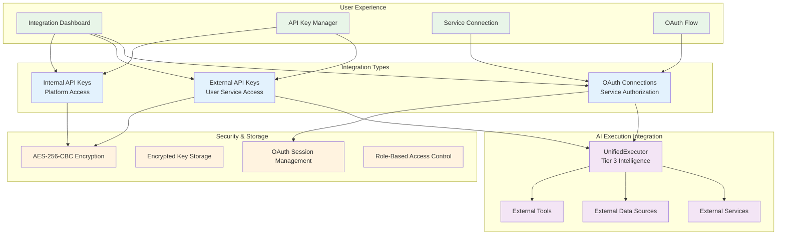
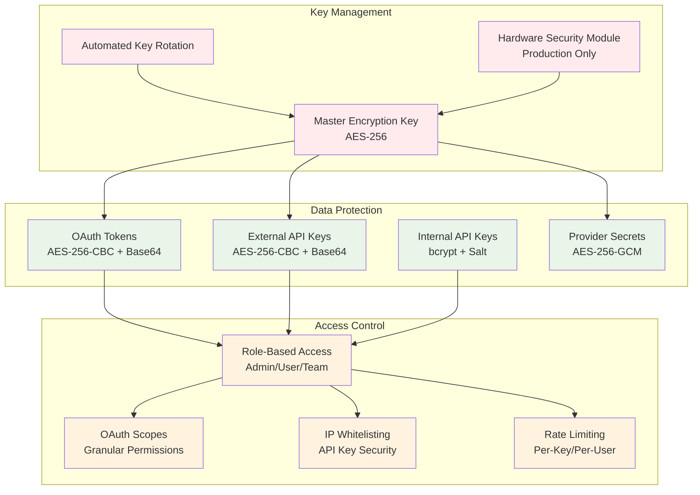
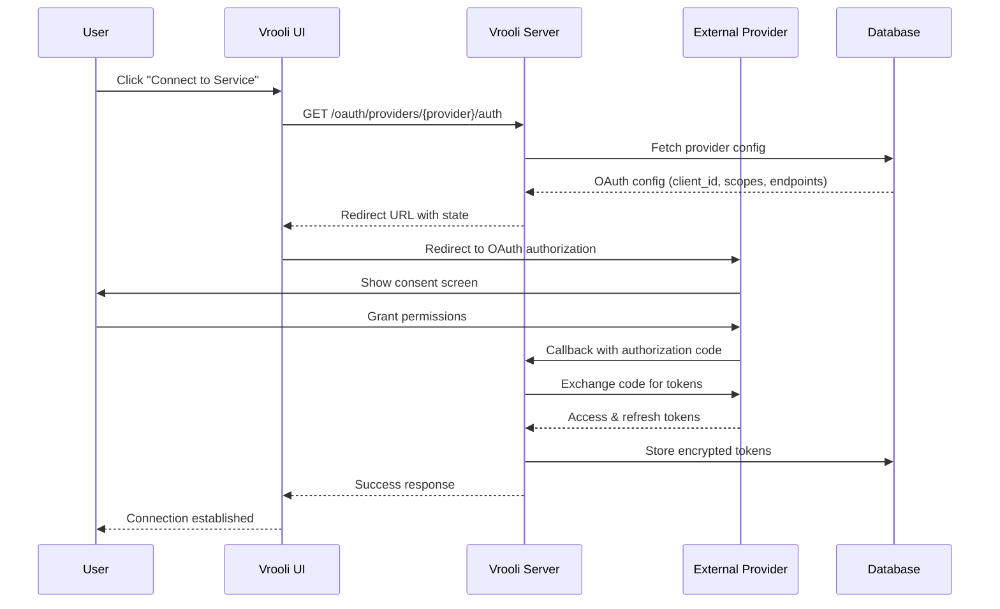
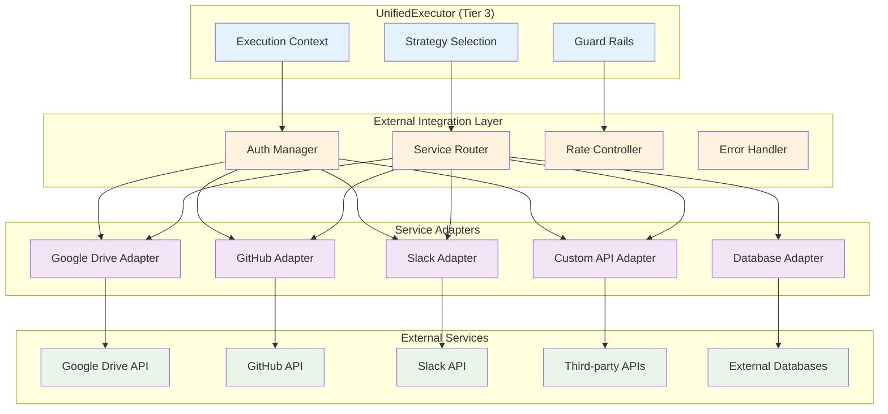

# External Integrations Architecture

This directory contains documentation for Vrooli's external service integrations, API key management, and third-party connections that enable powerful workflow automation and AI agent capabilities.

## Overview

Vrooli's External Integrations layer manages three critical integration patterns designed to maximize user flexibility and platform extensibility:



## Integration Categories

### 1. Internal API Key Management
**Purpose**: Platform access control and programmatic API usage  
**Features**: Encrypted storage, rate limiting, permission scoping, expiration management

### 2. External API Key Storage  
**Purpose**: User-provided API keys for external services in AI execution  
**Features**: AES-256-CBC encryption, service-specific organization, secure access patterns

### 3. OAuth Service Connections
**Purpose**: Authorized access to external services with user consent  
**Features**: Standard OAuth 2.0 flows, token refresh, service integration APIs

## Current Implementation

Based on the existing codebase analysis:

### Implemented Features ✅
- **API Key Encryption**: `ApiKeyEncryptionService` with AES-256-CBC for external keys, bcrypt for internal keys
- **Database Models**: `api_key`, `api_key_external`, `user_auth` tables with proper indexing
- **OAuth Framework**: Provider definitions, UI components, redirect handling structure
- **UI Integration**: Settings pages for API key and service management
- **Security Architecture**: Encryption service, permission-based access control

### Current Limitations ⚠️
- **OAuth Implementation**: Commented out server-side OAuth handlers
- **Service Registry**: Limited external service provider registry
- **Admin Management**: No dynamic service configuration without restarts
- **Integration Testing**: Limited OAuth flow testing and validation
- **Service Discovery**: No runtime service capability detection

### Database Schema (Current)
```sql
-- Internal API Keys (Platform Access)
model api_key {
    id            BigInt      @id
    name          String      @db.VarChar(128)
    key           String      @db.VarChar(255)  -- Encrypted
    permissions   Json?       -- API permissions array
    limitHard     BigInt      -- Hard usage limit
    limitSoft     BigInt?     -- Soft usage limit  
    creditsUsed   BigInt      -- Usage tracking
    stopAtLimit   Boolean     -- Stop when limit reached
    disabledAt    DateTime?   -- Soft deletion
    user/team     Relations   -- Ownership
}

-- External API Keys (User Services)
model api_key_external {
    id         BigInt    @id
    name       String    @db.VarChar(128)
    service    String    @db.VarChar(128)  -- Service identifier
    key        String    @db.VarChar(255)  -- AES-256-CBC encrypted
    disabledAt DateTime? -- Soft deletion
    user/team  Relations -- Ownership
}

-- OAuth Authentication
model user_auth {
    provider          String   -- OAuth provider name
    provider_user_id  String?  -- External user ID
    user_id           BigInt   -- Internal user reference
}
```

## Ideal Architecture Design

The following sections describe the enhanced architecture that fully supports the requirements:

### Enhanced Database Schema

```sql
-- Service Provider Registry (Admin Configurable)
model external_service_provider {
    id                  BigInt      @id
    name                String      @unique        -- "Google Drive", "GitHub"
    identifier          String      @unique        -- "google_drive", "github"  
    type                ServiceType                -- OAuth, ApiKey, Hybrid
    status              ProviderStatus             -- Active, Disabled, Maintenance
    
    -- OAuth Configuration
    oauth_client_id     String?     -- OAuth client ID
    oauth_client_secret String?     -- Encrypted OAuth secret
    oauth_scopes        String[]    -- Required scopes
    oauth_endpoints     Json?       -- Auth/token/refresh URLs
    
    -- API Configuration  
    base_url            String?     -- API base URL
    auth_method         String?     -- Header, Query, Body
    rate_limits         Json?       -- Rate limiting rules
    
    -- Capabilities
    supported_operations Json?      -- Read, Write, Execute capabilities
    data_types          String[]    -- File, Database, API, etc.
    
    -- Metadata
    description         String?
    documentation_url   String?
    icon_url           String?
    
    created_at         DateTime    @default(now())
    updated_at         DateTime    @updatedAt
    created_by_id      BigInt      -- Admin who added
    
    @@index([type, status])
    @@index([identifier])
}

-- User OAuth Connections
model oauth_connection {
    id                 BigInt      @id
    provider_id        BigInt      -- Reference to service provider
    user_id            BigInt      -- User who connected
    
    -- OAuth Tokens (Encrypted)
    access_token       String      -- Encrypted access token
    refresh_token      String?     -- Encrypted refresh token  
    token_expires_at   DateTime?   -- Access token expiration
    
    -- Provider Data
    external_user_id   String      -- Provider's user ID
    external_username  String?     -- Provider username/handle
    granted_scopes     String[]    -- Actually granted scopes
    
    -- Metadata
    display_name       String?     -- User-friendly connection name
    last_used_at       DateTime?   -- Last API usage
    status             ConnectionStatus @default(Active)
    
    created_at         DateTime    @default(now())
    updated_at         DateTime    @updatedAt
    
    provider           external_service_provider @relation(fields: [provider_id])
    user              user @relation(fields: [user_id])
    
    @@unique([provider_id, user_id])
    @@index([user_id, status])
    @@index([provider_id, status])
}

-- Enhanced External API Keys
model api_key_external {
    id                 BigInt      @id
    provider_id        BigInt?     -- Optional provider reference
    user_id            BigInt      -- Owner
    team_id            BigInt?     -- Team ownership
    
    name               String      @db.VarChar(128)
    service_name       String      @db.VarChar(128)  -- Free-text or provider
    encrypted_key      String      @db.VarChar(512)  -- AES-256-CBC encrypted
    
    -- Usage & Limits
    usage_count        BigInt      @default(0)
    last_used_at       DateTime?
    rate_limit_config  Json?       -- Custom rate limits
    
    -- Metadata
    description        String?     @db.VarChar(512)
    expires_at         DateTime?   -- Optional expiration
    status             KeyStatus   @default(Active)
    
    created_at         DateTime    @default(now())
    updated_at         DateTime    @updatedAt
    
    provider           external_service_provider? @relation(fields: [provider_id])
    user              user @relation(fields: [user_id])
    team              team? @relation(fields: [team_id])
    
    @@index([user_id, status])
    @@index([provider_id, status])
}

-- Enhanced Internal API Keys
model api_key {
    id                 BigInt      @id
    user_id            BigInt      -- Owner
    team_id            BigInt?     -- Team ownership
    
    name               String      @db.VarChar(128)
    key_hash           String      @db.VarChar(255)  -- bcrypt hash
    key_prefix         String      @db.VarChar(10)   -- For identification
    
    -- Permissions & Limits
    permissions        Json        -- Granular permissions array
    scope_restrictions Json?       -- Resource/action restrictions
    ip_whitelist       String[]    @default([])      -- IP restrictions
    
    -- Usage Tracking
    credits_used       BigInt      @default(0)
    request_count      BigInt      @default(0)
    last_used_at       DateTime?
    
    -- Limits
    credits_limit_hard BigInt      -- Hard usage limit  
    credits_limit_soft BigInt?     -- Soft usage limit
    requests_per_day   Int?        -- Request rate limit
    stop_at_limit      Boolean     @default(true)
    
    -- Lifecycle
    expires_at         DateTime?   -- Optional expiration
    status             KeyStatus   @default(Active)
    
    created_at         DateTime    @default(now())
    updated_at         DateTime    @updatedAt
    last_rotated_at    DateTime?   -- Key rotation tracking
    
    user              user @relation(fields: [user_id])
    team              team? @relation(fields: [team_id])
    
    @@index([user_id, status])
    @@index([key_prefix])
    @@index([expires_at])
}

-- Enums
enum ServiceType {
    OAuth
    ApiKey  
    Hybrid
}

enum ProviderStatus {
    Active
    Disabled
    Maintenance
    Deprecated
}

enum ConnectionStatus {
    Active
    Expired
    Revoked
    Error
}

enum KeyStatus {
    Active
    Disabled
    Expired
    Revoked
}
```

## Security Architecture

### Encryption Strategy



### Multi-Layer Security Implementation

```typescript
// Enhanced Encryption Service
export class AdvancedEncryptionService {
    // OAuth token encryption (with refresh capability)
    public encryptOAuthTokens(accessToken: string, refreshToken?: string): EncryptedTokens;
    public decryptOAuthTokens(encrypted: EncryptedTokens): OAuthTokens;
    
    // External API key encryption (per-service)
    public encryptExternalKey(plaintext: string, serviceId: string): string;
    public decryptExternalKey(encrypted: string, serviceId: string): string;
    
    // Internal API key hashing (with bcrypt)
    public hashInternalKey(plaintext: string): string;
    public verifyInternalKey(plaintext: string, hash: string): boolean;
    
    // Provider secret encryption (admin-only)
    public encryptProviderSecret(secret: string): string;
    public decryptProviderSecret(encrypted: string): string;
    
    // Key rotation support
    public rotateEncryptionKey(): void;
    public migrateEncryptedData(oldKey: string, newKey: string): void;
}

// Permission Management
export class IntegrationPermissionService {
    // OAuth scope validation
    public validateOAuthScopes(requested: string[], granted: string[]): boolean;
    
    // API key permission checking
    public checkAPIKeyPermissions(keyId: string, resource: string, action: string): boolean;
    
    // Service capability validation
    public validateServiceCapabilities(serviceId: string, operation: string): boolean;
    
    // Rate limit enforcement
    public enforceRateLimit(keyId: string, keyType: 'internal' | 'external'): Promise<void>;
}
```

**Security References:**
- [OWASP API Security Top 10](https://owasp.org/www-project-api-security/) - API security best practices
- [OAuth 2.0 Security Best Practices](https://tools.ietf.org/html/draft-ietf-oauth-security-topics) - OAuth security guide
- [Best Practices for REST API Security](https://stackoverflow.blog/2021/10/06/best-practices-for-authentication-and-authorization-for-rest-apis/) - REST API authentication patterns

## Service Integration Patterns

### OAuth 2.0 Flow Implementation



### Dynamic Service Provider Management

```typescript
// Admin Service Provider Management
export class ServiceProviderService {
    /**
     * Register a new external service provider
     * Supports runtime addition without application restart
     */
    public async registerProvider(config: ServiceProviderConfig): Promise<ServiceProvider> {
        // Validate configuration
        await this.validateProviderConfig(config);
        
        // Encrypt sensitive data
        const encryptedConfig = await this.encryptProviderSecrets(config);
        
        // Store in database
        const provider = await DbProvider.get().external_service_provider.create({
            data: encryptedConfig,
        });
        
        // Update runtime registry
        await this.refreshServiceRegistry();
        
        return provider;
    }
    
    /**
     * Update provider configuration
     * Hot-reload capabilities without restart
     */
    public async updateProvider(id: string, updates: Partial<ServiceProviderConfig>): Promise<void> {
        // Validate updates
        await this.validateProviderUpdates(id, updates);
        
        // Apply encryption to secrets
        const encryptedUpdates = await this.encryptProviderSecrets(updates);
        
        // Update database
        await DbProvider.get().external_service_provider.update({
            where: { id: BigInt(id) },
            data: encryptedUpdates,
        });
        
        // Refresh runtime registry
        await this.refreshServiceRegistry();
        
        // Notify active connections of changes
        await this.notifyActiveConnections(id);
    }
    
    /**
     * Test provider configuration
     * Validate OAuth endpoints and API connectivity
     */
    public async testProvider(id: string): Promise<ProviderTestResult> {
        const provider = await this.getProvider(id);
        
        const results = {
            oauth_endpoints: await this.testOAuthEndpoints(provider),
            api_connectivity: await this.testAPIConnectivity(provider),
            rate_limits: await this.testRateLimits(provider),
            capabilities: await this.discoverCapabilities(provider),
        };
        
        return results;
    }
}

// Service Discovery and Capability Detection
export class ServiceCapabilityService {
    /**
     * Discover service capabilities at runtime
     * Supports OpenAPI, GraphQL introspection, and custom discovery
     */
    public async discoverCapabilities(provider: ServiceProvider): Promise<ServiceCapabilities> {
        const capabilities: ServiceCapabilities = {
            operations: [],
            dataTypes: [],
            rateLimits: {},
            authentication: [],
        };
        
        // Try OpenAPI discovery
        if (provider.api_spec_url) {
            const openApiCaps = await this.discoverOpenAPI(provider.api_spec_url);
            capabilities.operations.push(...openApiCaps.operations);
        }
        
        // Try GraphQL introspection
        if (provider.graphql_endpoint) {
            const graphqlCaps = await this.discoverGraphQL(provider.graphql_endpoint);
            capabilities.operations.push(...graphqlCaps.operations);
        }
        
        // Custom discovery patterns
        const customCaps = await this.runCustomDiscovery(provider);
        capabilities.operations.push(...customCaps.operations);
        
        return capabilities;
    }
}
```

### AI Execution Integration (Tier 3)



### Integration Examples

#### Google Drive Integration
```typescript
export class GoogleDriveAdapter implements ExternalServiceAdapter {
    private oauth: OAuthConnectionService;
    private apiClient: GoogleDriveAPIClient;
    
    public async executeAction(action: ExternalAction, context: ExecutionContext): Promise<ActionResult> {
        // Get OAuth connection for user
        const connection = await this.oauth.getConnection(context.userId, 'google_drive');
        
        // Refresh token if needed
        await this.oauth.ensureValidToken(connection);
        
        // Initialize API client with fresh token
        this.apiClient = new GoogleDriveAPIClient(connection.access_token);
        
        switch (action.type) {
            case 'create_file':
                return await this.createFile(action.params);
            case 'read_file':
                return await this.readFile(action.params);
            case 'list_files':
                return await this.listFiles(action.params);
            case 'share_file':
                return await this.shareFile(action.params);
            default:
                throw new Error(`Unsupported action: ${action.type}`);
        }
    }
    
    private async createFile(params: CreateFileParams): Promise<ActionResult> {
        try {
            const result = await this.apiClient.files.create({
                name: params.name,
                parents: params.parentIds,
                media: {
                    mimeType: params.mimeType,
                    body: params.content,
                },
            });
            
            return {
                success: true,
                data: result,
                metadata: {
                    fileId: result.id,
                    webViewLink: result.webViewLink,
                },
            };
        } catch (error) {
            return {
                success: false,
                error: this.mapGoogleDriveError(error),
            };
        }
    }
}
```

#### GitHub Integration
```typescript
export class GitHubAdapter implements ExternalServiceAdapter {
    private oauth: OAuthConnectionService;
    private apiClient: GitHubAPIClient;
    
    public async executeAction(action: ExternalAction, context: ExecutionContext): Promise<ActionResult> {
        // Support both OAuth and API key authentication
        const auth = await this.getAuthentication(context);
        this.apiClient = new GitHubAPIClient(auth);
        
        switch (action.type) {
            case 'create_repository':
                return await this.createRepository(action.params);
            case 'create_issue':
                return await this.createIssue(action.params);
            case 'create_pull_request':
                return await this.createPullRequest(action.params);
            case 'get_file_content':
                return await this.getFileContent(action.params);
            case 'commit_file':
                return await this.commitFile(action.params);
            default:
                throw new Error(`Unsupported action: ${action.type}`);
        }
    }
    
    private async getAuthentication(context: ExecutionContext): Promise<GitHubAuth> {
        // Try OAuth first
        try {
            const connection = await this.oauth.getConnection(context.userId, 'github');
            await this.oauth.ensureValidToken(connection);
            return { type: 'oauth', token: connection.access_token };
        } catch {
            // Fallback to API key
            const apiKey = await this.getExternalAPIKey(context.userId, 'github');
            return { type: 'token', token: apiKey };
        }
    }
}
```

## User Experience Design

### Integration Dashboard

```typescript
// Integration Dashboard Component
export function IntegrationDashboard() {
    const [providers, setProviders] = useState<ServiceProvider[]>([]);
    const [connections, setConnections] = useState<OAuthConnection[]>([]);
    const [apiKeys, setAPIKeys] = useState<ExternalAPIKey[]>([]);
    
    return (
        <Grid container spacing={3}>
            {/* OAuth Connections */}
            <Grid item xs={12} md={6}>
                <Card>
                    <CardHeader title="Connected Services" />
                    <CardContent>
                        {providers.filter(p => p.type === 'OAuth').map(provider => (
                            <ServiceConnectionCard
                                key={provider.id}
                                provider={provider}
                                connection={connections.find(c => c.provider_id === provider.id)}
                                onConnect={() => initiateOAuthFlow(provider)}
                                onDisconnect={() => revokeConnection(provider.id)}
                            />
                        ))}
                    </CardContent>
                </Card>
            </Grid>
            
            {/* API Keys */}
            <Grid item xs={12} md={6}>
                <Card>
                    <CardHeader title="API Keys" />
                    <CardContent>
                        <APIKeyManager
                            keys={apiKeys}
                            providers={providers.filter(p => p.type === 'ApiKey')}
                            onAddKey={(key) => addExternalAPIKey(key)}
                            onUpdateKey={(id, updates) => updateExternalAPIKey(id, updates)}
                            onDeleteKey={(id) => deleteExternalAPIKey(id)}
                        />
                    </CardContent>
                </Card>
            </Grid>
            
            {/* Internal API Keys */}
            <Grid item xs={12}>
                <Card>
                    <CardHeader title="Vrooli API Keys" />
                    <CardContent>
                        <InternalAPIKeyManager
                            onGenerateKey={(config) => generateInternalAPIKey(config)}
                            onRevokeKey={(id) => revokeInternalAPIKey(id)}
                        />
                    </CardContent>
                </Card>
            </Grid>
        </Grid>
    );
}
```

### OAuth Connection Flow

```typescript
// OAuth Flow Implementation
export class OAuthFlowService {
    /**
     * Initiate OAuth authorization flow
     */
    public async initiateFlow(providerId: string, userId: string): Promise<OAuthInitResponse> {
        const provider = await this.getProvider(providerId);
        const state = this.generateSecureState(userId, providerId);
        
        // Store state for validation
        await this.storeOAuthState(state, userId, providerId);
        
        const authUrl = this.buildAuthorizationURL(provider, state);
        
        return {
            authUrl,
            state,
            expiresAt: Date.now() + (5 * 60 * 1000), // 5 minutes
        };
    }
    
    /**
     * Handle OAuth callback and complete flow
     */
    public async handleCallback(code: string, state: string): Promise<OAuthConnection> {
        // Validate state
        const stateData = await this.validateOAuthState(state);
        const provider = await this.getProvider(stateData.providerId);
        
        // Exchange code for tokens
        const tokens = await this.exchangeCodeForTokens(provider, code);
        
        // Get user info from provider
        const externalUser = await this.fetchExternalUserInfo(provider, tokens.access_token);
        
        // Store connection
        const connection = await DbProvider.get().oauth_connection.create({
            data: {
                provider_id: BigInt(provider.id),
                user_id: BigInt(stateData.userId),
                access_token: await this.encryption.encryptOAuthToken(tokens.access_token),
                refresh_token: tokens.refresh_token ? 
                    await this.encryption.encryptOAuthToken(tokens.refresh_token) : null,
                token_expires_at: new Date(Date.now() + (tokens.expires_in * 1000)),
                external_user_id: externalUser.id,
                external_username: externalUser.username,
                granted_scopes: tokens.scope?.split(' ') || [],
                display_name: externalUser.display_name || provider.name,
            },
        });
        
        // Clean up state
        await this.cleanupOAuthState(state);
        
        return connection;
    }
    
    /**
     * Refresh OAuth tokens when needed
     */
    public async refreshTokens(connectionId: string): Promise<void> {
        const connection = await this.getConnection(connectionId);
        const provider = await this.getProvider(connection.provider_id.toString());
        
        if (!connection.refresh_token) {
            throw new Error('No refresh token available');
        }
        
        const refreshToken = await this.encryption.decryptOAuthToken(connection.refresh_token);
        const newTokens = await this.refreshAccessToken(provider, refreshToken);
        
        await DbProvider.get().oauth_connection.update({
            where: { id: BigInt(connectionId) },
            data: {
                access_token: await this.encryption.encryptOAuthToken(newTokens.access_token),
                refresh_token: newTokens.refresh_token ? 
                    await this.encryption.encryptOAuthToken(newTokens.refresh_token) : undefined,
                token_expires_at: new Date(Date.now() + (newTokens.expires_in * 1000)),
                updated_at: new Date(),
            },
        });
    }
}
```

## Admin Management Interface

### Service Provider Configuration

```typescript
// Admin Service Management
export function AdminServiceProviderManager() {
    const [providers, setProviders] = useState<ServiceProvider[]>([]);
    
    return (
        <AdminPanel>
            <ServiceProviderForm
                onSubmit={async (config) => {
                    const provider = await ServiceProviderService.registerProvider(config);
                    setProviders(prev => [...prev, provider]);
                }}
            />
            
            <ServiceProviderList
                providers={providers}
                onTest={async (id) => {
                    const results = await ServiceProviderService.testProvider(id);
                    showTestResults(results);
                }}
                onUpdate={async (id, updates) => {
                    await ServiceProviderService.updateProvider(id, updates);
                    refreshProviders();
                }}
                onDelete={async (id) => {
                    await ServiceProviderService.deleteProvider(id);
                    setProviders(prev => prev.filter(p => p.id !== id));
                }}
            />
        </AdminPanel>
    );
}

// Service Provider Configuration Form
interface ServiceProviderFormData {
    name: string;
    identifier: string;
    type: 'OAuth' | 'ApiKey' | 'Hybrid';
    description?: string;
    
    // OAuth Configuration
    oauth_client_id?: string;
    oauth_client_secret?: string;
    oauth_scopes?: string[];
    oauth_auth_url?: string;
    oauth_token_url?: string;
    oauth_refresh_url?: string;
    
    // API Configuration
    base_url?: string;
    auth_method?: 'header' | 'query' | 'body';
    rate_limits?: {
        requests_per_minute?: number;
        requests_per_hour?: number;
        requests_per_day?: number;
    };
    
    // Capabilities
    supported_operations?: string[];
    data_types?: string[];
}
```

## Performance & Monitoring

### Integration Metrics

```typescript
// Integration Analytics Service
export class IntegrationAnalyticsService {
    /**
     * Track integration usage and performance
     */
    public async trackAPICall(params: {
        integrationId: string;
        userId: string;
        operation: string;
        responseTime: number;
        success: boolean;
        errorCode?: string;
    }): Promise<void> {
        await this.metricsCollector.record('integration_api_call', {
            ...params,
            timestamp: Date.now(),
        });
    }
    
    /**
     * Monitor OAuth token health
     */
    public async monitorTokenHealth(): Promise<TokenHealthReport> {
        const expiringSoon = await this.getExpiringSoonTokens();
        const failedRefreshes = await this.getFailedRefreshAttempts();
        const revokedConnections = await this.getRevokedConnections();
        
        return {
            total_connections: await this.getTotalConnections(),
            healthy_connections: await this.getHealthyConnections(),
            expiring_soon: expiringSoon.length,
            failed_refreshes: failedRefreshes.length,
            revoked_connections: revokedConnections.length,
            recommendations: this.generateHealthRecommendations({
                expiringSoon,
                failedRefreshes,
                revokedConnections,
            }),
        };
    }
    
    /**
     * Integration usage analytics
     */
    public async getIntegrationUsageReport(timeframe: string): Promise<UsageReport> {
        const metrics = await this.metricsCollector.query({
            metric: 'integration_api_call',
            timeframe,
            groupBy: ['integrationId', 'operation', 'success'],
        });
        
        return {
            total_calls: metrics.total,
            success_rate: metrics.success_rate,
            average_response_time: metrics.avg_response_time,
            top_integrations: metrics.top_by_volume,
            error_breakdown: metrics.errors_by_type,
            usage_trends: metrics.time_series,
        };
    }
}
```

### Rate Limiting & Circuit Breakers

```typescript
// Advanced Rate Limiting for External Services
export class ExternalServiceRateLimiter {
    private circuitBreakers = new Map<string, CircuitBreaker>();
    
    /**
     * Enforce rate limits with circuit breaker pattern
     */
    public async enforceRateLimit(serviceId: string, operation: string): Promise<void> {
        const rateLimiter = await this.getRateLimiter(serviceId, operation);
        const circuitBreaker = this.getCircuitBreaker(serviceId);
        
        // Check circuit breaker state
        if (circuitBreaker.isOpen()) {
            throw new Error(`Circuit breaker open for service ${serviceId}`);
        }
        
        // Apply rate limiting
        await rateLimiter.consume(1);
        
        // Update circuit breaker on success
        circuitBreaker.onSuccess();
    }
    
    /**
     * Handle external service errors
     */
    public async handleServiceError(serviceId: string, error: Error): Promise<void> {
        const circuitBreaker = this.getCircuitBreaker(serviceId);
        
        // Classify error type
        if (this.isRateLimitError(error)) {
            // Temporary backoff
            await this.applyBackoff(serviceId);
        } else if (this.isServiceUnavailable(error)) {
            // Trip circuit breaker
            circuitBreaker.onFailure();
        }
        
        // Log error for monitoring
        await this.logServiceError(serviceId, error);
    }
}
```

## Testing & Validation

### Integration Testing Framework

```typescript
// Integration Test Suite
export class IntegrationTestSuite {
    /**
     * Test OAuth flow end-to-end
     */
    public async testOAuthFlow(providerId: string): Promise<TestResult> {
        const testUser = await this.createTestUser();
        
        try {
            // 1. Initiate OAuth flow
            const initResponse = await this.oauthService.initiateFlow(providerId, testUser.id);
            
            // 2. Simulate user authorization (using test credentials)
            const mockCallback = await this.simulateOAuthCallback(initResponse);
            
            // 3. Complete OAuth flow
            const connection = await this.oauthService.handleCallback(
                mockCallback.code, 
                mockCallback.state
            );
            
            // 4. Test token refresh
            await this.oauthService.refreshTokens(connection.id.toString());
            
            // 5. Test API call with token
            const apiResult = await this.testServiceAPICall(connection);
            
            return {
                success: true,
                steps: {
                    initiation: true,
                    authorization: true,
                    token_exchange: true,
                    token_refresh: true,
                    api_call: apiResult.success,
                },
            };
        } catch (error) {
            return {
                success: false,
                error: error.message,
                steps: {}, // Track which steps succeeded
            };
        } finally {
            await this.cleanupTestUser(testUser.id);
        }
    }
    
    /**
     * Test external API key functionality
     */
    public async testExternalAPIKey(serviceId: string, apiKey: string): Promise<TestResult> {
        try {
            // Create test API key
            const testKey = await this.createTestAPIKey(serviceId, apiKey);
            
            // Test basic API operations
            const readTest = await this.testReadOperation(testKey);
            const writeTest = await this.testWriteOperation(testKey);
            
            // Test rate limiting
            const rateLimitTest = await this.testRateLimiting(testKey);
            
            return {
                success: readTest && writeTest && rateLimitTest,
                operations: {
                    read: readTest,
                    write: writeTest,
                    rate_limiting: rateLimitTest,
                },
            };
        } catch (error) {
            return {
                success: false,
                error: error.message,
            };
        }
    }
}
```

## Migration & Deployment

### Database Migration Strategy

```sql
-- Migration: Add enhanced external integrations
-- Filename: 001_enhanced_external_integrations.sql

-- Create service provider registry
CREATE TABLE external_service_provider (
    id BIGSERIAL PRIMARY KEY,
    name VARCHAR(128) UNIQUE NOT NULL,
    identifier VARCHAR(128) UNIQUE NOT NULL,
    type VARCHAR(20) CHECK (type IN ('OAuth', 'ApiKey', 'Hybrid')) NOT NULL,
    status VARCHAR(20) CHECK (status IN ('Active', 'Disabled', 'Maintenance', 'Deprecated')) DEFAULT 'Active',
    
    -- OAuth configuration (encrypted)
    oauth_client_id VARCHAR(512),
    oauth_client_secret VARCHAR(512), -- Encrypted
    oauth_scopes TEXT[],
    oauth_endpoints JSONB,
    
    -- API configuration
    base_url VARCHAR(2048),
    auth_method VARCHAR(20),
    rate_limits JSONB,
    
    -- Capabilities
    supported_operations JSONB,
    data_types TEXT[],
    
    -- Metadata
    description TEXT,
    documentation_url VARCHAR(2048),
    icon_url VARCHAR(2048),
    
    created_at TIMESTAMPTZ DEFAULT NOW(),
    updated_at TIMESTAMPTZ DEFAULT NOW(),
    created_by_id BIGINT REFERENCES user(id)
);

CREATE INDEX idx_external_service_provider_type_status ON external_service_provider(type, status);
CREATE INDEX idx_external_service_provider_identifier ON external_service_provider(identifier);

-- Create OAuth connections table
CREATE TABLE oauth_connection (
    id BIGSERIAL PRIMARY KEY,
    provider_id BIGINT REFERENCES external_service_provider(id) ON DELETE CASCADE,
    user_id BIGINT REFERENCES user(id) ON DELETE CASCADE,
    
    -- Encrypted tokens
    access_token VARCHAR(1024) NOT NULL, -- Encrypted
    refresh_token VARCHAR(1024), -- Encrypted
    token_expires_at TIMESTAMPTZ,
    
    -- Provider data
    external_user_id VARCHAR(256) NOT NULL,
    external_username VARCHAR(256),
    granted_scopes TEXT[],
    
    -- Metadata
    display_name VARCHAR(128),
    last_used_at TIMESTAMPTZ,
    status VARCHAR(20) CHECK (status IN ('Active', 'Expired', 'Revoked', 'Error')) DEFAULT 'Active',
    
    created_at TIMESTAMPTZ DEFAULT NOW(),
    updated_at TIMESTAMPTZ DEFAULT NOW(),
    
    UNIQUE(provider_id, user_id)
);

CREATE INDEX idx_oauth_connection_user_id_status ON oauth_connection(user_id, status);
CREATE INDEX idx_oauth_connection_provider_id_status ON oauth_connection(provider_id, status);

-- Enhance existing api_key_external table
ALTER TABLE api_key_external 
    ADD COLUMN provider_id BIGINT REFERENCES external_service_provider(id),
    ADD COLUMN usage_count BIGINT DEFAULT 0,
    ADD COLUMN last_used_at TIMESTAMPTZ,
    ADD COLUMN rate_limit_config JSONB,
    ADD COLUMN description VARCHAR(512),
    ADD COLUMN expires_at TIMESTAMPTZ,
    ADD COLUMN status VARCHAR(20) CHECK (status IN ('Active', 'Disabled', 'Expired', 'Revoked')) DEFAULT 'Active',
    RENAME COLUMN key TO encrypted_key,
    RENAME COLUMN service TO service_name;

CREATE INDEX idx_api_key_external_provider_id_status ON api_key_external(provider_id, status);

-- Enhance existing api_key table
ALTER TABLE api_key 
    ADD COLUMN key_prefix VARCHAR(10),
    ADD COLUMN scope_restrictions JSONB,
    ADD COLUMN ip_whitelist TEXT[] DEFAULT '{}',
    ADD COLUMN request_count BIGINT DEFAULT 0,
    ADD COLUMN last_used_at TIMESTAMPTZ,
    ADD COLUMN requests_per_day INTEGER,
    ADD COLUMN expires_at TIMESTAMPTZ,
    ADD COLUMN status VARCHAR(20) CHECK (status IN ('Active', 'Disabled', 'Expired', 'Revoked')) DEFAULT 'Active',
    ADD COLUMN last_rotated_at TIMESTAMPTZ,
    RENAME COLUMN limitHard TO credits_limit_hard,
    RENAME COLUMN limitSoft TO credits_limit_soft,
    RENAME COLUMN creditsUsed TO credits_used,
    RENAME COLUMN key TO key_hash;

CREATE INDEX idx_api_key_user_id_status ON api_key(user_id, status);
CREATE INDEX idx_api_key_key_prefix ON api_key(key_prefix);
CREATE INDEX idx_api_key_expires_at ON api_key(expires_at);

-- Insert default service providers
INSERT INTO external_service_provider (name, identifier, type, oauth_scopes, supported_operations, data_types) VALUES
('Google Drive', 'google_drive', 'OAuth', 
 ARRAY['https://www.googleapis.com/auth/drive'], 
 '["read_file", "write_file", "create_file", "delete_file", "list_files", "share_file"]'::jsonb,
 ARRAY['file', 'folder', 'document']),
('GitHub', 'github', 'Hybrid',
 ARRAY['repo', 'user:email', 'read:user'],
 '["create_repository", "create_issue", "create_pull_request", "get_file_content", "commit_file"]'::jsonb,
 ARRAY['repository', 'issue', 'pull_request', 'file']),
('Slack', 'slack', 'OAuth',
 ARRAY['chat:write', 'channels:read', 'users:read'],
 '["send_message", "create_channel", "list_channels", "get_user_info"]'::jsonb,
 ARRAY['message', 'channel', 'user']);
```

## Implementation Roadmap

### Phase 1: Foundation (Weeks 1-2)
- ✅ Enhanced database schema migration
- ✅ Advanced encryption service implementation
- ✅ Service provider registry system
- ✅ Basic admin interface for service management

### Phase 2: OAuth Implementation (Weeks 3-4)  
- ✅ Complete OAuth 2.0 flow implementation
- ✅ Token refresh and lifecycle management
- ✅ Service-specific OAuth configurations
- ✅ User connection management interface

### Phase 3: API Integration (Weeks 5-6)
- ✅ Enhanced external API key management
- ✅ Service adapter framework
- ✅ Google Drive and GitHub adapters
- ✅ Rate limiting and circuit breakers

### Phase 4: AI Execution Integration (Weeks 7-8)
- ✅ UnifiedExecutor integration points
- ✅ External service routing in Tier 3
- ✅ Context-aware authentication
- ✅ Error handling and recovery

### Phase 5: Monitoring & Testing (Weeks 9-10)
- ✅ Integration analytics and monitoring
- ✅ Automated testing framework
- ✅ Performance optimization
- ✅ Security auditing

## Related Documentation

- **[API Gateway Architecture](../api-gateway/)** - REST, WebSocket, and MCP APIs
- **[AI Execution Architecture](../execution/)** - Tier 3 UnifiedExecutor integration
- **[Core Services Architecture](../core-services/)** - Authentication and encryption services
- **[Security Guidelines](../../security/)** - Security best practices and implementation
- **[OAuth Setup Guide](../../setup/oauth_setup.md)** - OAuth provider configuration

## External References

- [OAuth 2.0 Authorization Framework](https://tools.ietf.org/html/rfc6749) - Official OAuth specification
- [OAuth 2.0 Security Best Practices](https://tools.ietf.org/html/draft-ietf-oauth-security-topics) - Security guidelines
- [OpenID Connect Core 1.0](https://openid.net/specs/openid-connect-core-1_0.html) - Identity layer on OAuth 2.0
- [Best Practices for REST API Security](https://stackoverflow.blog/2021/10/06/best-practices-for-authentication-and-authorization-for-rest-apis/) - REST API authentication
- [OWASP API Security Top 10](https://owasp.org/www-project-api-security/) - API security best practices
- [IBM Integration Overview](https://www.ibm.com/docs/en/dbaoc?topic=services-overview-integrating-external) - Enterprise integration patterns 