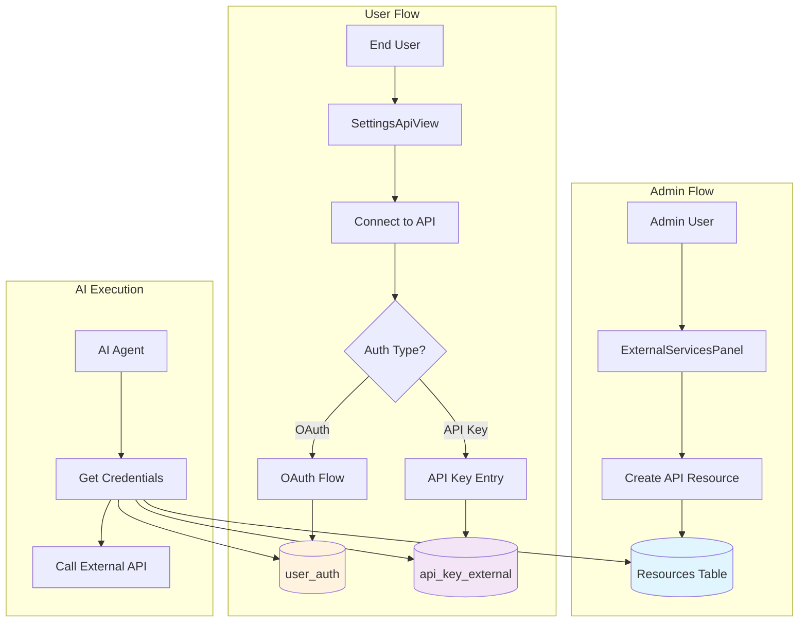

# Dynamic API Integration Implementation Plan

## Goal

Enable administrators to dynamically add external service integrations (APIs) that users can connect to without requiring code changes or application restarts. This allows Vrooli to expand its integration capabilities on-the-fly, supporting both OAuth and API key authentication methods.

## Context

### Current State
- **Admin Panel**: `ExternalServicesPanel.tsx` exists but uses mock data
- **User Settings**: `SettingsApiView.tsx` manages API keys with hardcoded integrations
- **Database**: 
  - `user_auth` table exists for authentication providers
  - `api_key_external` table stores external API keys
  - Resource system with `ResourceType.Api` for API configurations
- **API Config**: `ApiVersionConfig` class handles API-specific configuration

### Key Insight
Instead of creating new database tables and systems, we leverage the existing Resource system where APIs are first-class resources with versioning, translations, and configuration support.

## Architecture Overview



## Database Changes

### 1. Update `user_auth` Table
Add OAuth-specific fields to the existing table (update last migration file):

```sql
-- In the last migration file, add these columns to user_auth table creation:
model user_auth {
    id                              BigInt    @id @db.BigInt
    user_id                         BigInt    @db.BigInt
    provider                        String
    provider_user_id                String?
    hashed_password                 String?
    resetPasswordCode               String?   @unique @db.VarChar(256)
    lastResetPasswordRequestAttempt DateTime? @db.Timestamptz(6)
    createdAt                       DateTime  @default(now()) @db.Timestamptz(6)
    updatedAt                       DateTime  @updatedAt @db.Timestamptz(6)
    
    -- NEW OAuth fields
    access_token                    String?   @db.VarChar(1024)  // Encrypted
    refresh_token                   String?   @db.VarChar(1024)  // Encrypted
    token_expires_at                DateTime? @db.Timestamptz(6)
    granted_scopes                  String[]  @default([])
    last_used_at                    DateTime? @db.Timestamptz(6)
    
    user     user      @relation(fields: [user_id], references: [id], onDelete: Cascade)
    sessions session[]
    
    @@unique([provider, provider_user_id], name: "user_auth_provider_provider_user_id_unique")
    @@index([user_id, createdAt], name: "idx_user_auth_user_id_createdAt")
}
```

### 2. Update `api_key_external` Table
Add reference to the API resource (update last migration file):

```sql
-- In the last migration file, add this column to api_key_external table:
model api_key_external {
    id         BigInt    @id @db.BigInt
    createdAt  DateTime  @default(now()) @db.Timestamptz(6)
    updatedAt  DateTime  @updatedAt @db.Timestamptz(6)
    key        String    @db.VarChar(255)
    disabledAt DateTime? @db.Timestamptz(6)
    name       String    @db.VarChar(128)
    service    String    @db.VarChar(128)
    teamId     BigInt?   @db.BigInt
    userId     BigInt?   @db.BigInt
    
    -- NEW: Link to API resource
    resourceId BigInt?   @db.BigInt
    
    team       team?     @relation(fields: [teamId], references: [id], onDelete: Cascade)
    user       user?     @relation(fields: [userId], references: [id], onDelete: Cascade)
    resource   resource? @relation(fields: [resourceId], references: [id], onDelete: SetNull)
    
    @@unique([userId, service, name], name: "api_key_external_userId_service_name_unique")
    @@index([userId], name: "idx_api_key_external_userId")
    @@index([teamId], name: "idx_api_key_external_teamId")
    @@index([resourceId], name: "idx_api_key_external_resourceId")
}
```

## Implementation Plan

### Phase 1: Backend Foundation (3-4 days)

#### 1.1 Update Database Schema
- [ ] Update the last migration file to add OAuth fields to `user_auth`
- [ ] Update the last migration file to add `resourceId` to `api_key_external`
- [ ] Run `pnpm prisma generate` to update the client

#### 1.2 Create API Resource Endpoints
- [ ] Update `resource_createOne.ts` to handle API-specific validation
- [ ] Create `resource_findManyAPIs.ts` endpoint for fetching API resources
- [ ] Add API resource validation logic in `resourceValidation.ts`

#### 1.3 OAuth Flow Implementation
- [ ] Create `auth_oauthInitiate.ts` endpoint to start OAuth flow
- [ ] Create `auth_oauthCallback.ts` endpoint to handle provider callbacks
- [ ] Update `AuthService` to handle OAuth token storage/refresh
- [ ] Implement token encryption in `ApiKeyEncryptionService`

### Phase 2: Admin Interface (2-3 days)

#### 2.1 Update ExternalServicesPanel
Replace mock data with real API resource management:

```typescript
// ExternalServicesPanel.tsx changes
interface APIResourceFormData {
    name: string;
    identifier: string;
    type: "OAuth" | "ApiKey" | "Hybrid";
    description?: string;
    baseUrl: string;
    
    // OAuth specific
    oauthClientId?: string;
    oauthClientSecret?: string;
    oauthScopes?: string[];
    oauthAuthUrl?: string;
    oauthTokenUrl?: string;
    
    // API Key specific
    authLocation?: "header" | "query" | "body";
    authParameterName?: string;
    
    // Rate limits
    requestsPerMinute?: number;
    burstLimit?: number;
}

const createAPIResource = async (formData: APIResourceFormData) => {
    const apiConfig: ApiVersionConfigObject = {
        __version: "1.0",
        resources: [],
        authentication: {
            type: formData.type.toLowerCase(),
            location: formData.authLocation || "header",
            parameterName: formData.authParameterName || "Authorization",
            settings: {
                clientId: formData.oauthClientId,
                clientSecret: encrypt(formData.oauthClientSecret), // Admin enters, we encrypt
                scopes: formData.oauthScopes,
                authUrl: formData.oauthAuthUrl,
                tokenUrl: formData.oauthTokenUrl,
            }
        },
        rateLimiting: {
            requestsPerMinute: formData.requestsPerMinute || 1000,
            burstLimit: formData.burstLimit || 100,
        },
        callLink: formData.baseUrl,
    };
    
    const resourceInput: ResourceCreateInput = {
        resourceType: ResourceType.Api,
        isPublic: true, // APIs should be discoverable by users
        versions: [{
            versionLabel: "1.0",
            callLink: formData.baseUrl,
            config: JSON.stringify(apiConfig),
            translations: [{
                language: "en",
                name: formData.name,
                description: formData.description,
            }]
        }]
    };
    
    return await createResource(resourceInput);
};
```

#### 2.2 Add Service Testing
- [ ] Implement API connectivity testing
- [ ] Add OAuth configuration validation
- [ ] Create test endpoints for each auth type

### Phase 3: User Integration (3-4 days)

#### 3.1 Update SettingsApiView
Replace hardcoded integrations with dynamic API resources:

```typescript
// SettingsApiView.tsx changes
const [availableAPIs, setAvailableAPIs] = useState<Resource[]>([]);
const [userConnections, setUserConnections] = useState<Map<string, ConnectionStatus>>();

// Fetch available API resources
useEffect(() => {
    const loadAPIs = async () => {
        const { edges } = await findManyResources({
            resourceType: ResourceType.Api,
            visibility: Visibility.Public,
            sortBy: "popularity",
        });
        
        setAvailableAPIs(edges.map(e => e.node));
        
        // Check user's existing connections
        const connections = new Map<string, ConnectionStatus>();
        for (const api of edges.map(e => e.node)) {
            const status = await checkAPIConnection(api.id);
            connections.set(api.id, status);
        }
        setUserConnections(connections);
    };
    
    loadAPIs();
}, []);

// Render dynamic API connections
{availableAPIs.map((api) => {
    const config = ApiVersionConfig.parse(api.versions[0]);
    const status = userConnections.get(api.id);
    
    return (
        <APIConnectionCard
            key={api.id}
            api={api}
            config={config}
            status={status}
            onConnect={() => connectToAPI(api, config)}
            onDisconnect={() => disconnectFromAPI(api)}
        />
    );
})}
```

#### 3.2 OAuth Connection Flow
```typescript
const connectToAPI = async (api: Resource, config: ApiVersionConfig) => {
    if (config.authentication?.type === "oauth2") {
        // Start OAuth flow
        const { authUrl } = await initiateOAuthFlow({
            resourceId: api.id,
            redirectUri: `${window.location.origin}/settings/api/oauth-callback`,
        });
        
        window.location.href = authUrl;
    } else if (config.authentication?.type === "apikey") {
        // Show API key dialog
        setSelectedAPI(api);
        setShowAPIKeyDialog(true);
    }
};

// OAuth callback handler (new route needed)
const handleOAuthCallback = async () => {
    const params = new URLSearchParams(window.location.search);
    const code = params.get("code");
    const state = params.get("state");
    
    if (code && state) {
        await completeOAuthFlow({ code, state });
        // Redirect back to settings
        navigate("/settings/api");
    }
};
```

### Phase 4: AI Execution Integration (2-3 days)

#### 4.1 Credential Retrieval Service
Create a unified service for AI agents to get API credentials:

```typescript
// services/execution/shared/ExternalAPIService.ts
export class ExternalAPIService {
    async getAPICredentials(resourceId: string, userId: string): Promise<APICredentials> {
        // Get the API resource
        const api = await this.resourceService.findOne(resourceId);
        const config = ApiVersionConfig.parse(api.versions[0]);
        
        if (config.authentication?.type === "oauth2") {
            // Get OAuth tokens from user_auth
            const auth = await this.db.user_auth.findFirst({
                where: {
                    user_id: BigInt(userId),
                    provider: api.versions[0].translations[0].name.toLowerCase(),
                },
            });
            
            if (!auth?.access_token) {
                throw new Error("User not connected to this API");
            }
            
            // Check token expiry and refresh if needed
            if (auth.token_expires_at && auth.token_expires_at < new Date()) {
                await this.refreshOAuthToken(auth, config);
            }
            
            return {
                type: "Bearer",
                token: await this.encryption.decrypt(auth.access_token),
                headers: {
                    "Authorization": `Bearer ${await this.encryption.decrypt(auth.access_token)}`
                }
            };
        } else {
            // Get API key from api_key_external
            const externalKey = await this.db.api_key_external.findFirst({
                where: {
                    userId: BigInt(userId),
                    resourceId: BigInt(resourceId),
                    disabledAt: null,
                },
            });
            
            if (!externalKey) {
                throw new Error("No API key found for this service");
            }
            
            const decryptedKey = await this.encryption.decryptExternalKey(externalKey.key);
            
            return {
                type: config.authentication?.location || "header",
                parameterName: config.authentication?.parameterName || "api_key",
                value: decryptedKey,
                headers: this.buildAuthHeaders(config.authentication, decryptedKey),
            };
        }
    }
    
    private buildAuthHeaders(auth: ApiVersionConfigObject["authentication"], key: string) {
        if (!auth) return {};
        
        switch (auth.location) {
            case "header":
                return { [auth.parameterName || "X-API-Key"]: key };
            case "query":
                // Query params handled elsewhere
                return {};
            case "body":
                // Body params handled elsewhere
                return {};
            default:
                return { "X-API-Key": key };
        }
    }
}
```

#### 4.2 Integration with Tier 3 Execution
Update the UnifiedExecutor to use external APIs:

```typescript
// In UnifiedExecutor or appropriate service
async executeExternalAPICall(params: {
    resourceId: string;
    endpoint: string;
    method: string;
    data?: any;
    userId: string;
}) {
    const credentials = await this.externalAPIService.getAPICredentials(
        params.resourceId,
        params.userId
    );
    
    const api = await this.resourceService.findOne(params.resourceId);
    const config = ApiVersionConfig.parse(api.versions[0]);
    
    const url = new URL(params.endpoint, config.callLink);
    
    // Add auth to query if needed
    if (config.authentication?.location === "query" && credentials.type !== "Bearer") {
        url.searchParams.append(
            credentials.parameterName || "api_key",
            credentials.value
        );
    }
    
    const response = await fetch(url.toString(), {
        method: params.method,
        headers: {
            "Content-Type": "application/json",
            ...credentials.headers,
        },
        body: params.data ? JSON.stringify(params.data) : undefined,
    });
    
    // Handle rate limiting
    if (response.status === 429) {
        await this.handleRateLimit(params.resourceId);
        // Retry logic
    }
    
    return response.json();
}
```

### Phase 5: Testing & Documentation (2 days)

#### 5.1 Testing
- [ ] Unit tests for OAuth flow
- [ ] Unit tests for API key management
- [ ] Integration tests for admin API creation
- [ ] Integration tests for user connections
- [ ] E2E tests for complete flow

#### 5.2 Documentation
- [ ] Update API documentation
- [ ] Create user guide for connecting to services
- [ ] Create admin guide for adding services
- [ ] Document security considerations

## Security Considerations

1. **OAuth Secrets**: Admin-entered OAuth client secrets must be encrypted before storage
2. **Token Storage**: All OAuth tokens encrypted with AES-256-CBC
3. **API Keys**: External API keys encrypted with per-service salt
4. **Rate Limiting**: Respect external API rate limits to prevent key revocation
5. **Scope Management**: Store and validate OAuth scopes granted vs requested
6. **Token Refresh**: Automatic token refresh before expiry
7. **Audit Trail**: Log all external API usage for security monitoring

## Success Metrics

1. **Admin can add new APIs** without code changes
2. **Users can discover and connect** to admin-added APIs
3. **AI agents can use connected APIs** in routine execution
4. **OAuth tokens refresh automatically** without user intervention
5. **System respects rate limits** of external services

## Future Enhancements

1. **API Marketplace**: Users can share API configurations
2. **Usage Analytics**: Track API usage per user/service
3. **Credential Sharing**: Team-level API connections
4. **Webhook Support**: Incoming webhooks from external services
5. **GraphQL Support**: Beyond REST API integration
6. **Auto-discovery**: Detect API capabilities from OpenAPI/GraphQL schemas

## Implementation Timeline

- **Week 1**: Backend foundation + Database changes
- **Week 2**: Admin interface + OAuth implementation  
- **Week 3**: User integration + Connection management
- **Week 4**: AI execution + Testing + Documentation

Total estimated time: **4 weeks** with 1-2 developers

## Key Benefits

1. **No Code Changes**: New integrations without deployment
2. **Leverages Existing Systems**: Uses Resource, Auth, and Encryption systems
3. **Minimal Database Changes**: Only adds fields to existing tables
4. **Secure by Design**: Encryption and rate limiting built-in
5. **User-Friendly**: Simple connection flow for end users
6. **AI-Ready**: Seamless integration with execution tiers