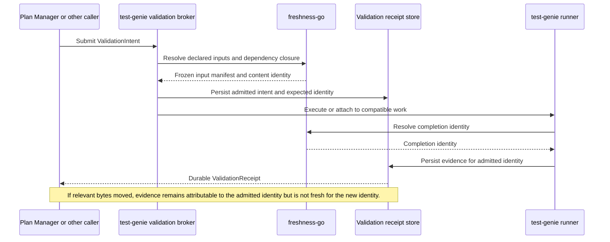
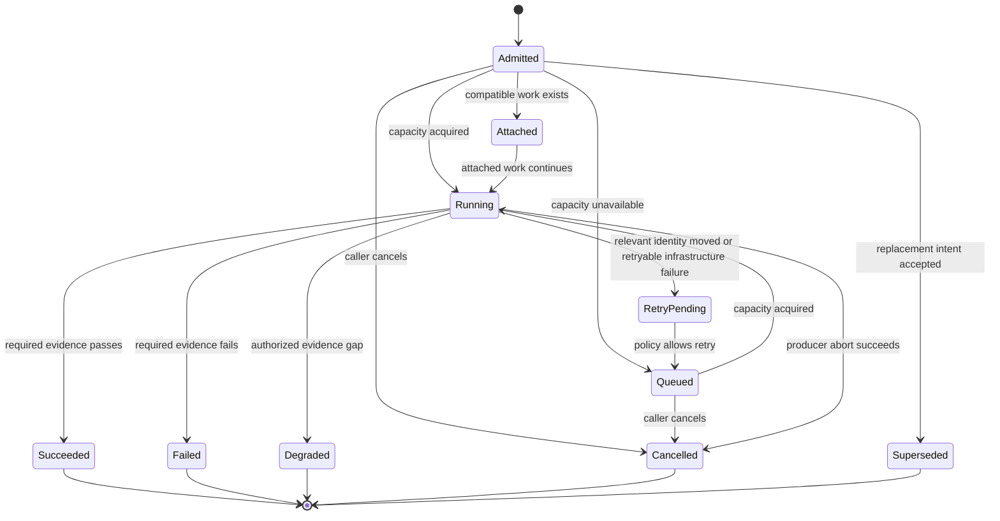
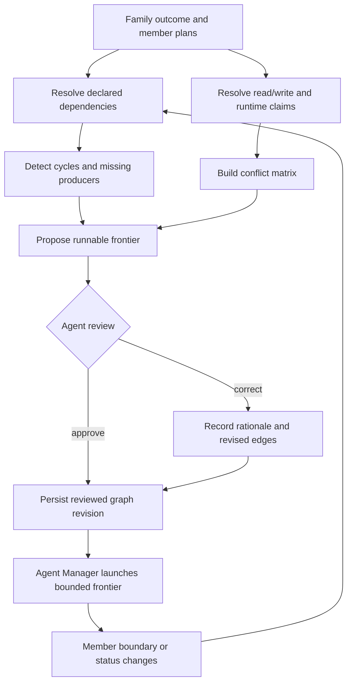
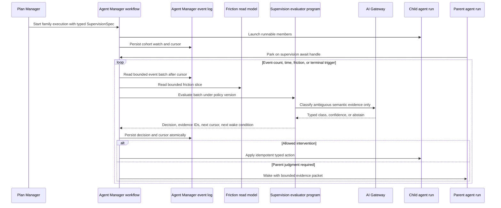
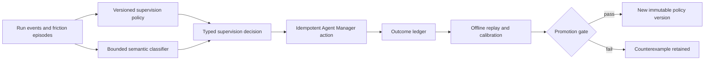

# Validation Coordination and Plan-Family Supervision Source Brief

Date: 2026-09-04  
Workspace: `/home/matthalloran8/Vrooli`  
Purpose: Preserve the investigation, operator constraints, selected architecture, rejected alternatives, example contracts, and proof expectations that produced the Plan Manager implementation plan `validation-coordination-plan-family-supervision`.

## 1. Why this initiative exists

Agents implementing Plan Manager plans repeatedly spend disproportionate time on baseline capture, baseline repair, suite admission, reattachment, validation freshness, and moving shared-worktree state. The infrastructure is meant to protect correctness, but its coordination cost often displaces the product work that a plan exists to deliver. This is especially visible in long-running UI work: visible progress can stop while an agent reasons about baseline state and retries infrastructure operations.

The problem is not that Vrooli validates too much in the abstract. The problem is that several scenarios expose parts of one lifecycle, while the calling agent must infer how those parts compose. Plan Manager owns plan validation intent. Git Control Tower owns baseline collections and repository evidence. test-genie owns test execution and reuse. Agent Manager owns the executing agent and long waits. Each has useful primitives, but the cross-scenario state machine is not yet one explicit, typed, durable contract.

This initiative must leave the system materially simpler. Adding a compatibility facade while retaining competing lifecycle paths is a failure. The implementation must identify displaced paths, migrate callers, delete obsolete state and adapters, and ratchet against their return.

## 2. Operator constraints preserved from the design discussion

1. Multiple agents work in the same working tree.
2. The operator commits frequently and at unpredictable times.
3. A moving `HEAD` must not invalidate otherwise identical evidence.
4. Unrelated working-tree edits must not invalidate scoped evidence.
5. Relevant content changes must invalidate reuse without relying on modification times.
6. The freshness computation must remain performant and portable across supported operating systems.
7. Validation must remain rigorous, but routine agents must not manually coordinate several state machines.
8. Parallel plan execution must be suggested from evidence and reviewed by an agent. It must never be blind.
9. Durable supervision must survive Agent Manager restarts without token-burning polls.
10. Learned classification may improve detection and recommendations. It must not override hard safety or authority rules.
11. Recurring coordination must move down the three-speed stack: skill judgment, governed finite programs, then scenario-owned authoritative state.
12. The migration is complete only when technical debt is removed and the new path covers the expected lifecycle matrix.

## 3. Current-state findings

| Capability | Existing foundation | Current gap |
| --- | --- | --- |
| Working-tree identity | `packages/freshness-go` computes deterministic content digests from tracked and untracked-not-ignored bytes. Git context is diagnostic. | Validation admission does not expose one canonical frozen input manifest across all consumers. Shared dependency closure must be explicit. |
| Build freshness | The manifest engine hashes exact source/import closure and selected non-file inputs. It avoids mtime fallback. | Different callers still narrate freshness and retry semantics differently. |
| test-genie reuse | Phase cache identity combines scoped input digest, provider build identity, descriptor snapshot, and execution configuration. It rejects publication if scoped inputs move during execution. | The public admission contract is run-shaped, not a general validation-intent/receipt lifecycle for Plan Manager and other callers. |
| Baseline collections | Git Control Tower owns durable collection capture, member coverage, source snapshots, and collection diff. | Plan Manager must coordinate capture, wait, synchronization, current evidence, and repair states across scenario boundaries. |
| Plan baseline intent | Plan Manager derives a `baseline_set` from the change boundary and checkpoints it at execution start. | New plans require this lifecycle even when a narrower cached validation receipt could prove the phase. The plan model conflates durable before evidence, current validation, and certification policy. |
| Plan graph | Plan Manager persists `supersedes` and `depends_on` edges and exposes graph reads. | It has no plan-family aggregate, claim model, cycle analysis, runnable frontier, scheduling recommendation, or frontier recomputation after boundary expansion. |
| Agent events | Agent Manager has append-only run events and stable per-run sequence cursors. Its repository also has a global row watermark. | The public cohort watch surface lacks an opaque durable cursor with retention/reset semantics. |
| Friction evidence | Agent Manager derives durable `FrictionEpisode` records with evidence IDs, turns, cycles, tokens, wall time, fingerprints, and suspected owner. | Friction evidence is analytical. It is not connected to a governed supervision decision and intervention lifecycle. |
| Durable waiting | Agent Manager can park a run, persist an await handle, recover watchers after restart, and wake with a typed result. test-genie and GCT waits adopt this seam. | There is no general cohort supervision wait producer, and no explicit typed live-nudge actuator was found. |
| Programs | Agent Manager owns `friction-digest` and `setpoint-read` programs. Program Runtime supports governed, bounded execution and typed contracts. | Program Runtime is not appropriate as an indefinite watcher. Event telemetry lacks a complete cursor contract for this purpose. |
| Scenario skills | Agent Manager has scenario-owned operational and improvement skills. | Plan Manager, test-genie, Git Control Tower, and Vrooli Onboarding expose no scenario-owned skills or governed programs in their repositories. |
| Existing plans | Prior plans implemented shared-workspace baseline semantics, proportional validation, friction analytics, and park/wake. | Several older draft plans overlap individual seams. None expresses the integrated authority model, migration, deletion, plan family, and supervision outcome in this brief. |

## 4. Source identity is not a commit

The canonical source identity is a content-addressed digest over a resolved input set. The input set includes relevant files and declared non-file inputs. The identity must not include the current commit SHA as a freshness discriminator.

```go
type SourceIdentity struct {
    Algorithm          string            `json:"algorithm"`
    RootScope          string            `json:"root_scope"`
    InputManifestHash  string            `json:"input_manifest_hash"`
    DependencyRootHash string            `json:"dependency_root_hash"`
    ConfigHash         string            `json:"config_hash"`
    ToolchainHash      string            `json:"toolchain_hash"`
    Inputs             []InputDigest     `json:"inputs,omitempty"`
    Attribution        SourceAttribution `json:"attribution"`
}

type SourceAttribution struct {
    CommitSHA string `json:"commit_sha,omitempty"`
    Branch    string `json:"branch,omitempty"`
    Dirty     bool   `json:"dirty"`
}
```

`Attribution` explains where evidence was observed. It never participates in equality. A commit that changes no relevant bytes preserves identity. An unrelated edit preserves identity. A relevant byte, configuration input, provider build, descriptor, or toolchain change produces a new identity.

Validation admission must persist the resolved manifest and root digest. Completion must attach evidence to that captured identity. The implementation must not recompute an admission identity later and pretend it was the original identity.



## 5. Authority model

Single source of truth means one owner per concept. It does not mean one scenario owns every record.

| Concept | Authority | Responsibilities |
| --- | --- | --- |
| Content identity | `packages/freshness-go` | Resolve normalized input manifests and calculate portable deterministic digests. |
| Validation intent and receipt execution | test-genie | Admit, coalesce, schedule, execute, wait, retry, and persist durable validation receipts. |
| Behavioral before evidence and source evidence | Git Control Tower | Own baseline collections, before/after evidence, collection comparison, and repository provenance. |
| Plan and plan-family intent | Plan Manager | Own detailed plans, family membership, claims, dependency decisions, runnable frontier, and validation policy selection. |
| Agent run lifecycle and supervision | Agent Manager | Own child runs, event cursors, watch state, timers, park/wake, interventions, and escalation evidence. |
| Finite recurring judgment | Program Runtime programs owned by the relevant scenario | Evaluate bounded batches through typed bindings and return bounded decisions. |
| Learning evidence | Agent Manager and Source Ledger | Retain intervention outcomes, counterexamples, and promotion candidates. |
| Host remediation | Vrooli control plane | Detect and repair host state. Scenarios report and schedule but do not implement private host repair. |

No scenario may implement a private substitute for another row.

## 6. Canonical validation lifecycle

### 6.1 Validation intent

```proto
message ValidationIntent {
  string intent_id = 1;
  string idempotency_key = 2;
  string caller_scenario = 3;
  string caller_execution_id = 4;
  string plan_id = 5;
  string phase_id = 6;
  repeated ValidationTarget targets = 7;
  ValidationPurpose purpose = 8;
  ValidationStrength required_strength = 9;
  ReusePolicy reuse_policy = 10;
  ConcurrencyPolicy concurrency_policy = 11;
  SourceIdentity expected_identity = 12;
  EvidencePolicy evidence_policy = 13;
  DeadlinePolicy deadline_policy = 14;
}

enum ValidationPurpose {
  VALIDATION_PURPOSE_UNSPECIFIED = 0;
  PHASE = 1;
  REGRESSION_BEFORE = 2;
  REGRESSION_CURRENT = 3;
  CERTIFICATION = 4;
  INVESTIGATION = 5;
}
```

The caller expresses required evidence and policy. It does not select test-genie internal orchestration steps. test-genie resolves the execution plan, compatible cache entries, active compatible work, capacity, and retry policy.

### 6.2 Validation receipt

```proto
message ValidationReceipt {
  string receipt_id = 1;
  string intent_id = 2;
  ReceiptState state = 3;
  ValidationStrength achieved_strength = 4;
  SourceIdentity admitted_identity = 5;
  SourceIdentity observed_identity = 6;
  repeated EvidenceReference evidence = 7;
  repeated ChildOperation children = 8;
  CompatibilityDecision compatibility = 9;
  RetryDisposition retry = 10;
  Degradation degradation = 11;
  string created_at = 12;
  string updated_at = 13;
}

enum ReceiptState {
  RECEIPT_STATE_UNSPECIFIED = 0;
  ADMITTED = 1;
  ATTACHED = 2;
  QUEUED = 3;
  RUNNING = 4;
  RETRY_PENDING = 5;
  SUCCEEDED = 6;
  FAILED = 7;
  DEGRADED = 8;
  CANCELLED = 9;
  SUPERSEDED = 10;
}
```

The receipt is the only object Plan Manager needs to decide whether validation is pending, reusable, fresh, failed, degraded, or complete. Child run IDs and GCT operation IDs remain evidence references. They are not competing top-level lifecycles.

### 6.3 State machine



`cancel` means stop waiting or request cancellation according to the contract. `abort` means stop producer work. The API and CLI must not blur these operations.

### 6.4 Validation levels

| Level | Purpose | Typical evidence | When required |
| --- | --- | --- | --- |
| Source identity | Establish whether relevant inputs changed. | Frozen manifest and digests. | Every intent. |
| Behavioral prior | Preserve before behavior for comparison. | GCT collection member receipts. | When the plan changes behavior or needs an oracle. |
| Phase validation | Prove the affected phase outcome. | Narrow test-genie receipt. | Each phase transition. |
| Certification | Prove the complete plan outcome. | Full inventory receipt and collection diff. | Final Definition of Done. |

Plan Manager must not require comprehensive recapture for every phase. It must select the smallest honest validation that proves the phase, while final certification covers the full captured boundary.

## 7. Plan families and reviewed parallelism

A plan family is an initiative-level aggregate. It preserves shared outcome and design context while keeping child plans independently executable.

```proto
message PlanFamily {
  string id = 1;
  string title = 2;
  string outcome = 3;
  repeated PlanMember members = 4;
  repeated PlanDependency dependencies = 5;
  repeated PlanClaim claims = 6;
  string graph_revision = 7;
  string policy_version = 8;
}

message PlanClaim {
  string plan_id = 1;
  ClaimKind kind = 2;
  string target = 3;
  AccessMode access = 4;
  bool exclusive = 5;
}

enum ClaimKind {
  CLAIM_KIND_UNSPECIFIED = 0;
  REPOSITORY_PATH = 1;
  API_CONTRACT = 2;
  GENERATED_OUTPUT = 3;
  DATA_SCHEMA = 4;
  RUNTIME_PLANT = 5;
  VALIDATION_TARGET = 6;
}
```

The scheduler derives a recommendation from explicit dependencies and claim conflicts. An agent reviews the recommendation and persists an approval or correction. Unknown interaction remains sequential until independence is established.



The family must track graph revisions. A boundary extension, new claim, terminal failure, or changed produced contract invalidates the prior frontier and triggers recomputation before new launches.

## 8. Durable child-agent supervision

Durable supervision belongs in Agent Manager. Program Runtime evaluates finite batches; it does not own an indefinite watcher.



### 8.1 Watch specification

```json
{
  "watch_id": "family-exec-123",
  "subjects": {
    "family_id": "family-1",
    "plan_ids": ["plan-a", "plan-b"],
    "run_ids": ["run-a", "run-b"]
  },
  "cursor": "opaque:v1:...",
  "triggers": {
    "event_count": 100,
    "max_quiet_seconds": 300,
    "terminal_events": true,
    "friction_severity": ["recurring", "systemic"]
  },
  "allowed_actions": ["observe", "nudge", "wake_parent", "park", "stop"],
  "limits": {
    "events_per_batch": 250,
    "inference_calls_per_batch": 1,
    "nudges_per_run": 2,
    "nudge_cooldown_seconds": 600
  },
  "policy_version": "plan-family-supervision.v1"
}
```

### 8.2 Evaluator result

```json
{
  "status": "signal",
  "next_cursor": "opaque:v1:...",
  "matched_evidence": ["event-77", "episode-12"],
  "classification": "validation_infrastructure_thrash",
  "confidence": 0.94,
  "recommended_action": {
    "kind": "nudge",
    "reason_code": "return_to_plan_intent",
    "message_template": "Record the infrastructure defect. Use the authorized degraded receipt path if available. Resume the phase outcome."
  },
  "next_wake_condition": {
    "after_events": 100,
    "after_seconds": 300
  }
}
```

No signal is `quiet`, not `success`. The evaluator always returns a next cursor or a typed cursor-reset disposition.

### 8.3 Cursor contract

The cursor must be opaque, scoped to the watch filter, monotonically progressive, and bound to a retention generation. A retention discontinuity returns `cursor_reset` with the earliest available watermark. The consumer then performs bounded reconciliation from durable run state.

Delivery is at least once. Decision and action idempotency keys prevent duplicate effects. Event IDs and friction episode IDs provide durable evidence.

### 8.4 Intervention authority

Agent Manager must expose typed actions with grants, idempotency, cooldowns, audit records, and terminal-state guards.

| Action | Meaning | Required guard |
| --- | --- | --- |
| `observe` | Persist evidence without contacting a child. | Always allowed. |
| `nudge` | Inject one bounded guidance message at the next safe turn boundary. | Policy permission, active child, cooldown, idempotency key. |
| `park` | End the child turn and wait on a typed handle. | Child identity and supported producer. |
| `continue` | Resume a terminal or parked conversation with typed context. | Valid resumable state. |
| `stop` | Request normal child termination. | Parent authority and terminal guard. |
| `escalate` | Wake the parent with evidence and recommended choices. | Always allowed when evidence is bounded. |

The supervisor cannot waive a hard gate. A degraded receipt is valid only when the plan or family policy explicitly authorizes that evidence class.

## 9. Neuro-symbolic self-improvement boundary

The symbolic layer owns invariants, enums, permissions, thresholds, state transitions, and policy versions. The learned layer classifies ambiguous evidence and proposes policy improvements.



The active policy never edits itself during an orchestration. Candidate changes use historical replay, a labelled corpus, false-positive limits, completion impact, and bounded rollout. Memory stores evidence and hypotheses. It is not execution authority.

Retention must include deduplication by fingerprint, supersession, bounded recall, TTL or decay for weak observations, and permanent retention for promoted counterexamples and policy decisions.

## 10. Scenario skills and programs

The final architecture must make the intended operation discoverable to future agents.

| Owner | Skill | Purpose | Governed program or stable operation |
| --- | --- | --- | --- |
| Plan Manager | `implementation-plan-authoring` | Author a single execution-grade plan or family member. Move the existing core pack into scenario ownership without breaking registry lookup. | Existing authoring runtime. |
| Plan Manager | `implementation-plan-execution` | Execute to intent, manage divergence, and consume validation receipts. Move the existing core pack into scenario ownership. | Existing execution runtime. |
| Plan Manager | `plan-family-orchestration` | Review a proposed family graph, launch the runnable frontier, and respond to supervision signals. | `plan-manager.family-review` and `plan-manager.family-frontier`. |
| Plan Manager | `plan-manager-improve` | Use family, validation, and execution evidence to identify structural improvements. | `plan-manager.setpoint-read`. |
| test-genie | `validation-intent` | Select and explain the smallest honest validation strength through the broker contract. | `test-genie.intent-explain` or stable API operation. |
| test-genie | `test-genie-improve` | Analyze admission, cache, retry, and receipt reliability. | `test-genie.validation-digest` and `test-genie.setpoint-read`. |
| Git Control Tower | `regression-evidence` | Explain when behavioral before evidence or source evidence is required. | Prefer stable baseline operations; add a program only for repeated multi-call analysis. |
| Git Control Tower | `git-control-tower-improve` | Analyze collection reliability and evidence cost without redefining freshness. | `git-control-tower.setpoint-read`. |
| Agent Manager | `plan-family-supervision` | Configure and operate durable cohort supervision. | `agent-manager.supervision-evaluate`, `agent-manager.friction-slice`, and durable watch operations. |
| Agent Manager | existing improvement skills | Promote reliable supervision changes through replay. | Extend existing `friction-digest` and `setpoint-read` where their contracts fit. |
| Vrooli Onboarding | `vrooli-onboarding` | Guide agents through setup, readiness, degraded continuation, and handoff. | `vrooli-onboarding.readiness-explain` if repeated orchestration justifies it. |
| Vrooli Onboarding | `vrooli-onboarding-improve` | Analyze drop-off, confusing steps, failed recommendations, and evidence gaps. | `vrooli-onboarding.setpoint-read` and a bounded experience evidence digest. |

Skills carry judgment and route to scenario operations. They must not contain private orchestration code. Programs must have typed input/output contracts, budgets, grants, fixtures, deterministic tests, and bounded evidence.

## 11. Migration and deletion strategy

This initiative uses a shadow, compare, cut over, and delete sequence.

1. Inventory every caller and persisted lifecycle field.
2. Define canonical proto contracts and conformance fixtures.
3. Implement the broker behind a disabled or shadow-only policy.
4. Dual-read legacy state only through one migration adapter.
5. Compare legacy and new decisions against recorded fixtures and live shadow traffic.
6. Cut Plan Manager to receipts and remove orchestration decisions from its clients.
7. Cut Git Control Tower to canonical receipt references.
8. Cut Agent Manager waits to receipt and supervision await handles.
9. Migrate durable records or preserve a read-only legacy view with an explicit sunset.
10. Delete legacy writers, duplicate freshness logic, baseline command synthesis, retry loops, and compatibility aliases.
11. Add structural ratchets that fail when deleted imports, fields, routes, or command patterns return.
12. Prove no production caller uses the legacy path before removing the feature flag.

The migration must not retain two authorities indefinitely. The final code should have fewer lifecycle branches than the starting code.

## 12. Required proof matrix

| Case | Expected result |
| --- | --- |
| Commit changes, relevant bytes unchanged | Existing compatible receipt remains fresh. |
| Unrelated working-tree file changes | Existing scoped receipt remains fresh. |
| Relevant tracked file changes | New content identity; incompatible prior receipt. |
| Relevant untracked-not-ignored file changes | New content identity. |
| Relevant file changes during a run | Evidence stays attached to admitted identity; it is not published as fresh for the new identity. Retry follows policy. |
| Shared dependency changes | Every target declaring that dependency receives a new composed identity. Unrelated targets do not. |
| Identical concurrent intents | One producer execution; all callers attach to one durable receipt lineage. |
| Different incompatible intents for one scenario | test-genie serializes or schedules according to explicit concurrency policy. |
| Caller disconnects | Server-owned work continues. Caller can reattach by receipt ID. |
| Agent Manager restarts while parent is parked | Watch and await handle recover. Parent wakes once on signal or terminal result. |
| Duplicate event delivery | One persisted decision and at most one action effect. |
| Cursor retention gap | Watch returns typed reset and reconciles bounded durable state. |
| Friction classifier abstains | Deterministic policy selects observe or escalate. It does not guess an intervention. |
| Nudge repeats within cooldown | Agent Manager rejects or coalesces the duplicate. |
| Supervisor recommends gate bypass | Actuator rejects the action. |
| Plan claim conflict | Plans do not enter the same runnable frontier. |
| Unknown plan interaction | Scheduler recommends sequential execution. |
| Agent corrects proposed dependency | New graph revision records the decision and recomputes the frontier. |
| Child expands its boundary | Claims and frontier recompute before new children launch. |
| Partial child failure | Independent runnable members may continue according to family policy; dependants remain blocked. |
| Degraded validation allowed | Receipt records exact missing evidence and authorization. |
| Degraded validation not allowed | Phase cannot transition to done. |
| Legacy persisted baseline | One migration adapter produces canonical read state or a typed terminal legacy state. |
| Deleted legacy CLI path is invoked | CLI gives one migration instruction; no hidden fallback executes. |
| Linux and macOS fixtures | Content identity and normalized manifest match for identical logical inputs. |
| Windows path fixture | Path normalization produces the documented logical manifest without platform separators leaking into identity. |

## 13. Performance and reliability budgets

The implementation must establish measured budgets from current data before selecting final thresholds. At minimum, measure and gate:

- p50 and p95 validation admission latency with warm and cold identity resolution;
- bytes and files hashed per declared scope;
- cache and active-work attachment rates;
- duplicate producer suppression rate;
- receipt terminalization latency after child work ends;
- event batch size, evaluator duration, and inference calls;
- false-positive and false-negative supervision rates on the labelled replay corpus;
- mean time spent by implementation agents in validation coordination;
- number of manual baseline commands per completed plan phase;
- restart recovery time for watches and parked parents;
- database growth per 1,000 receipts, watch decisions, and intervention records.

Performance optimization must not weaken identity. Use manifest caching, dependency-root composition, bounded batches, and indexed lookups. Do not substitute timestamps, commit hashes, or whole-worktree locks.

## 14. Rejected alternatives

| Alternative | Why rejected | Revisit trigger |
| --- | --- | --- |
| Make Plan Manager own test execution | It duplicates test-genie and couples plan semantics to runner internals. | Never, unless test-genie ceases to be the execution authority. |
| Make Git Control Tower the whole validation broker | GCT owns before/after repository evidence, not all validation target scheduling. | Only if the Vrooli domain model changes explicitly. |
| Key freshness on commit SHA | Random commits and shared worktrees make the identity incorrect. | Never for freshness; retain SHA as attribution only. |
| Require a clean or frozen worktree | It defeats the multi-agent operating model and creates global contention. | Never as a general requirement. |
| Run one long-lived Program Runtime watcher per child | Program sessions are bounded computation and are not the durable lifecycle authority. | Revisit only if Program Runtime explicitly adds durable workflow ownership and recovery semantics. |
| Let free-form memory control interventions | Memory is unversioned evidence and can drift. It cannot be audited as execution policy. | Never for hard authority. |
| Ask an AI classifier on every event | It is expensive, nondeterministic, and unnecessary for structural signals. | Use only after deterministic filters leave an ambiguous bounded batch. |
| Launch every dependency-free plan in parallel | File independence misses contracts, schemas, generated outputs, runtime plants, and unknown interactions. | Never without reviewed claims. |
| Keep old and new lifecycle writers for compatibility | It preserves the debt and makes divergence inevitable. | Permit only during a time-bounded migration with a deletion gate. |
| Split plans by technical layer | API/UI/test splits often cannot deliver or validate an independent outcome. | Split by coherent outcome, stable contract, and independently testable boundary instead. |

## 15. Relevant prior Plan Manager plans

| Plan | Status on 2026-09-04 | Use in this initiative |
| --- | --- | --- |
| `shared-workspace-baseline-semantics-and-cache-safe` | Complete | Treat its content-based, unrelated-edit-safe semantics as an invariant. Do not regress them. |
| `test-genie-validation-cost-proportionate-plan-validation` | Complete | Reuse proportional phase validation, deterministic caching, and throughput measures. |
| `agent-manager-investigation-evidence-calibration-and` | Complete | Reuse calibrated friction evidence and outcome linkage. |
| `generalized-content-addressed-test-genie-run-cache` | Draft, last activity about ten days before this brief | Reassess each phase against shipped cache work. Supersede or absorb remaining target-agnostic identity work. Do not execute it independently without reconciliation. |
| `make-baseline-diff-async-durable-re-attachable-and-enforce` | Draft, last activity about ten days before this brief | Reuse async/reattachment goals where not already delivered by durable collections and park/wake. Supersede redundant lifecycle design. |
| `agent-manager-durable-park-resume-env-safe-wait-suspension` | Draft, last activity about ten days before this brief | Treat documented shipped park/wake behavior as current truth. Reconcile the stale phase statuses instead of rebuilding it. |

## 16. Primary code and document evidence

- `/home/matthalloran8/Vrooli/packages/freshness-go/README.md`
- `/home/matthalloran8/Vrooli/packages/freshness-go/treedigest/treedigest.go`
- `/home/matthalloran8/Vrooli/docs/reference/scenario-freshness-build-inputs.md`
- `/home/matthalloran8/Vrooli/docs/TESTING.md`
- `/home/matthalloran8/Vrooli/scenarios/plan-manager/docs/concepts/PLAN-MODEL.md`
- `/home/matthalloran8/Vrooli/scenarios/plan-manager/api/internal/planmodel/types.go`
- `/home/matthalloran8/Vrooli/scenarios/plan-manager/api/internal/execution/service.go`
- `/home/matthalloran8/Vrooli/scenarios/plan-manager/api/internal/plans/service.go`
- `/home/matthalloran8/Vrooli/scenarios/test-genie/api/internal/orchestrator/phasecacheidentity/identity.go`
- `/home/matthalloran8/Vrooli/scenarios/test-genie/api/internal/orchestrator/suite_execution.go`
- `/home/matthalloran8/Vrooli/scenarios/git-control-tower/docs/baseline-model.md`
- `/home/matthalloran8/Vrooli/scenarios/git-control-tower/api/handlers/baseline/connect_handler.go`
- `/home/matthalloran8/Vrooli/packages/proto/schemas/agent-manager/v1/domain/events.proto`
- `/home/matthalloran8/Vrooli/packages/proto/schemas/agent-manager/v1/domain/episode.proto`
- `/home/matthalloran8/Vrooli/scenarios/agent-manager/api/internal/eventlog/repository.go`
- `/home/matthalloran8/Vrooli/scenarios/agent-manager/api/internal/runsignal/episode.go`
- `/home/matthalloran8/Vrooli/scenarios/agent-manager/docs/internal/SEAMS.md`
- `/home/matthalloran8/Vrooli/scenarios/agent-manager/docs/internal/TEMPORAL-FLOWS.md`
- `/home/matthalloran8/Vrooli/scenarios/program-runtime/schemas/program-contract.schema.json`
- `/home/matthalloran8/Vrooli/docs/agent-system/SKILL_AUTHORING.md`
- `/home/matthalloran8/Vrooli/docs/agent-system/PRIMITIVES.md`

## 17. Completion principle

The implementation is done when an agent can submit or resume a plan-family execution, receive a reviewed runnable frontier, let Agent Manager supervise child runs durably, and consume one validation receipt per validation intent without reasoning about baseline internals. It must continue to work while other agents edit and the operator commits. The result must reduce lifecycle code, commands, branches, and agent coordination time while preserving or increasing evidence strength.

## 18. Phase 1 durable census and before-state

Captured on 2026-09-04 before implementation edits under Plan Manager execution
`305259b4-f11f-4c88-8962-2cf448a1ac20`. The inventory is organized by
authority, not by call order, so every displaced surface has one explicit
disposition.

### 18.1 Lifecycle inventory

| Lifecycle item | Current writer / reader evidence | Current authority | Disposition |
| --- | --- | --- | --- |
| Scenario working-tree byte digest | `packages/freshness-go/treedigest/treedigest.go`; direct readers in `scenarios/test-genie/api/internal/app/runs/`, `orchestrator/phasecache/`, `orchestrator/suite_execution.go`, and `runmanager/manager.go` | freshness-go | Extend to a frozen manifest and composed source identity. Retain `treedigest.Compute` only as the compatibility adapter. |
| Test-run admission and single-active-run guard | `scenarios/test-genie/api/internal/runmanager/manager.go` | test-genie | Retain execution ownership; adapt behind receipt admission and remove caller retry decisions. |
| Suite planning, provider readiness, phase cache, and terminal evidence | `scenarios/test-genie/api/internal/orchestrator/suite_execution.go`, `providerreadiness/`, `phasecacheidentity/identity.go`; `suite_executions`, `suite_execution_phases`, and `suite_execution_stages` | test-genie | Retain and compose behind the broker. |
| Plan-authored baseline policy | `packages/proto/schemas/plan-manager/v1/shared/model.proto`; Plan Manager `planmodel`, `plans`, and authoring projections | Plan Manager | Migrate to behavioral-prior policy plus receipt intent; retain a read-only legacy projection only for historical plans. |
| Execution baseline checkpoint and scope repair | `scenarios/plan-manager/api/internal/execution/{types.go,service.go,steering.go,sqlite.go,schema.sql}`; `execution_baseline_sets` and `execution_scope_states` | Plan Manager today | Replace as a live state machine with receipt references. Keep migration reads until all supported records are terminalized. |
| Plan validation operation, children, command synthesis, wait/sync | `scenarios/plan-manager/api/internal/validation/{types.go,service.go,checks.go,sqlite.go,schema.sql}`; `validation_results` and `validation_operations` | Plan Manager today | Delete producer orchestration after Plan Manager consumes test-genie receipts. Keep policy selection and receipt rendering in Plan Manager. |
| Behavioral-before capture and comparison | `scenarios/git-control-tower/api/internal/baseline/{collection.go,collection_service.go,service.go,storage.go}` and `handlers/baseline/connect_handler.go` | Git Control Tower | Retain. Expose baseline work as typed receipt child operations and parent receipt references. |
| Standalone baseline CLI | `scenarios/git-control-tower/cli/domains/baseline/register.go` and `collection.go` | Git Control Tower | Retain evidence operations; remove Plan Manager-generated command walls and caller-owned retries. |
| Durable run events and sequence cursor | `scenarios/agent-manager/api/internal/eventlog/{repository.go,dispatch.go,types.go}`; `run_events` | Agent Manager | Extend with bounded cohort reads, filter-bound opaque cursors, and retention reset. |
| Park/wake and producer waiters | `scenarios/agent-manager/api/internal/orchestration/{await_registry.go,park.go,waiter.go,recovery.go}` | Agent Manager | Retain and extend with one supervision await producer per family execution. |
| Workflow nudge primitive | `scenarios/agent-manager/api/internal/orchestration/workflow_nudge.go` and its tests | Agent Manager | Extend behind typed supervision actions and safe-turn, authority, cooldown, terminal, and idempotency guards. |
| Friction evidence | `scenarios/agent-manager/api/internal/runsignal/`; `invocation_read_model_episodes` and related projection tables | Agent Manager | Retain as evidence. Add bounded supervision slices and outcome linkage; never make it authority. |
| Bounded program execution | `scenarios/program-runtime/` and its contract schema | Program Runtime | Retain as finite computation only. Add scenario-owned contracts, budgets, grants, and fixtures. |
| Ambiguous semantic classification | AI Gateway structured inference surface | AI Gateway | Adapt only after deterministic Agent Manager predicates abstain; no direct actuation grant. |
| Intervention outcomes and counterexamples | Agent Manager evidence tables plus Source Ledger journal/facet seams | Agent Manager and Source Ledger | Extend through a typed evidence adapter. Agent Manager remains the execution authority. |
| Plan dependency graph | `scenarios/plan-manager/api/internal/plans/{service.go,sqlite.go,schema.sql}`; `plan_edges` | Plan Manager | Extend into a PlanFamily aggregate, claims, immutable graph revisions, and review decisions. |

### 18.2 Persisted state and public coordination surface

The selected coordination cores contain 16,338 lines before this initiative:

```text
Plan Manager execution core       3,080
Plan Manager validation core      1,844
Git Control Tower baseline core   4,855
test-genie run/cache core         5,010
Agent Manager park/wait core      1,549
                                 ------
                                  16,338
```

The count is reproducible with `wc -l` over the files named in section 18.1.
It is a comparison denominator, not a claim that every line will be deleted.

Current Plan Manager exposes 10 `validate` and 17 `exec` manifest commands.
Git Control Tower registers 14 baseline commands outside its manifest-driven
groups. Test Genie exposes run reads and mutation commands plus manually wired
`wait` and `wait-all` operations. A normal guided plan currently requires three
agent-issued operations just to establish its before-state (`capture`, producer
`wait`, `baseline-sync`) and at least three more for each validation ticket
(start/dispatch, producer wait, sync) before the phase transition itself.

The legacy lifecycle persists overlapping state in these tables:

- Plan Manager: `execution_baseline_sets`, `execution_scope_states`,
  `validation_results`, and `validation_operations`.
- Test Genie: `suite_executions`, `suite_execution_phases`, and
  `suite_execution_stages`.
- Agent Manager: `run_events`, `runs`, `run_checkpoints`, workflow execution
  tables, and invocation/friction read-model tables.
- Git Control Tower: baseline manifests and collection state in its baseline
  store, plus repository audit tables.

The current public status vocabularies also overlap: Plan Manager has five
baseline-set statuses, three validation-operation statuses, three validation
child statuses, and three verdicts; Git Control Tower adds collection member
and operation-standing states; Test Genie adds run, phase, cache, and source
stability states. The broker must reduce what callers interpret to one receipt
state machine while preserving owner-private states behind evidence references.

### 18.3 Capability inventory

| Scenario | Scenario-owned skills | Governed programs | Disposition |
| --- | ---: | ---: | --- |
| Plan Manager | 0 | 0 | Add authoring, execution, family orchestration, and improvement ownership. |
| test-genie | 0 | 0 | Add validation-intent operation/improvement capabilities and bounded digests. |
| Git Control Tower | 0 | 0 | Add regression-evidence operation/improvement capabilities. |
| Agent Manager | 6 | 2 | Extend existing capabilities; add family supervision and bounded evaluation. |
| Program Runtime | 2 | 11 | Retain as the bounded substrate; do not add durable watch authority. |
| Vrooli Onboarding | 0 | 0 | Add operating and improvement capabilities without visual redesign actions. |

Counts exclude third-party `node_modules` skill files.

### 18.4 Migration fixtures

These sanitized records define the minimum legacy shapes the migration tests
must preserve. They intentionally contain no repository paths, credentials, or
operator content.

```json
{"kind":"plan_manager_baseline_set","status":"partial","required":2,"ready":1,"pending":0,"failed":1,"members":[{"scenario":"alpha","status":"ready","run_id":"run-a"},{"scenario":"beta","status":"failed","error":"producer unavailable"}]}
{"kind":"plan_manager_validation_operation","status":"terminal","verdict":"pass","execution_id":"exec-1","scope_generation":2,"required_members":["alpha"],"selected_members":["alpha"],"test_runs":[{"scenario":"alpha","run_id":"run-a","status":"passed","fingerprint":"sha256:example"}]}
{"kind":"test_genie_terminal_run","scenario":"alpha","run_id":"run-a","status":"passed","tree_digest":"sha256:admitted","source_stable":true,"configuration_fingerprint":"sha256:config"}
{"kind":"gct_collection_member","scenario":"alpha","baseline_name":"before","required":true,"status":"ready","run_id":"run-a","git_sha":"attribution-only"}
```

### 18.5 Observed coordination friction before implementation

The first execution attempt itself produced three concrete before-state
failures, which are retained as evidence rather than normalized away:

1. `plan-manager exec continue ... --json` created execution
   `80829e43-cce6-498a-b2f0-aa0b8e575229` but the CLI attachment returned no
   payload; a subsequent explicit start correctly reported the active execution.
2. The authored collection included nonexistent `scenario-qa`, so Git Control
   Tower terminalized the collection while nine valid child runs continued.
3. After repairing the plan and preserving the failed collection, a replacement
   collection could not attach to those nine identical in-flight comprehensive
   runs and instead marked every member failed as busy.
4. A caller-owned `test-genie runs wait-all` attachment then consumed nearly an
   hour without producing a phase deliverable or a bounded terminal result. The
   absence of a durable receipt-level deadline and useful progress contract made
   ordinary validation latency indistinguishable from a stuck workflow.

The first two abandoned executions and Plan Manager finding
`09211d3f-5ccc-4227-9629-672e10383598` preserve the audit trail. These failures
directly motivate idempotent receipt admission, active-work attachment, durable
reattachment, bounded notification-driven waits, and removal of caller-coordinated
baseline state. A command that can hold an agent for this long without a durable
decision is itself a product defect even when the underlying runs are healthy.

### 18.6 Concurrent worktree conflicts

The workspace was already heavily modified. Relevant overlapping changes were
present in Plan Manager integration tests and CLI manifest/handlers, Agent
Manager wiring and conversation-search files, test-genie phase-registry files,
Source Ledger handlers, and the Vrooli Onboarding API/CLI/UI. Every implementation
phase must inspect the exact touched diff before editing or generation. No
existing changes are attributed to this execution merely because they fall
inside its broad acceptance boundary.

### 18.7 Prior-plan lineage decisions

| Prior plan | Decision |
| --- | --- |
| `shared-workspace-baseline-semantics-and-cache-safe` | Dependency/invariant: retain relevant-byte and unrelated-edit-safe semantics. |
| `test-genie-validation-cost-proportionate-plan-validation` | Dependency/invariant: retain proportional phase selection, deterministic caching, and cost measures. |
| `agent-manager-investigation-evidence-calibration-and` | Dependency/invariant: reuse calibrated friction evidence and outcome linkage. |
| `generalized-content-addressed-test-genie-run-cache` | Supersede its remaining target-neutral identity/admission scope in this integrated plan; do not run independently. |
| `make-baseline-diff-async-durable-re-attachable-and-enforce` | Supersede its caller-facing orchestration target while retaining shipped durable GCT evidence primitives. |
| `agent-manager-durable-park-resume-env-safe-wait-suspension` | Supersede stale phase state; retain the shipped park/wake substrate as a dependency. |

These lineage decisions are persisted and were read back from Plan Manager as
three dependency edges and three supersession edges for this plan.

### 18.8 Initial scientific-debugging hypotheses

Prior-art checks found no matching Git Control Tower, Plan Manager, or
test-genie fix record. Search Hub and Swarm Manager semantic fallback were
unavailable, while scenario-local archived-fix searches returned no rows.

| Hypothesis | Falsification test | Result |
| --- | --- | --- |
| Test Genie treats collection reservation identity as execution identity, so byte- and contract-identical baseline requests from different collection tickets cannot coalesce. | Compare `admissionKey` inputs and add a unit test whose requests differ only by `CollectionReservationID` and member count. | Confirmed and fixed: reservation metadata no longer contributes to execution identity, and an integration-style regression proves replacement collections attach to one producer run. |
| Git Control Tower declares a parent collection terminal on the first failed member even while already-admitted child runs remain live. | Construct a collection with one failed member and one pending member carrying a run ID; inspect `CollectionCaptureStanding`. | Confirmed and fixed: the parent remains executing with its native reattach command until every admitted child is terminal. |
| The lost `exec continue` response is caused by a slow synchronous source preflight after execution persistence, not by a failed mutation or CLI rendering. | Correlate API access duration with the durable execution creation time and compare repeated cached calls. | Confirmed and fixed at both boundaries: Plan Manager bounds advisory preflight at two seconds and still issues authoritative capture; Git Control Tower constrains Git enumeration to authored paths and honors cancellation. A live three-scenario estimate completed in 1.29 seconds versus the observed 69.519-second call. |

All three fixes are covered by package-level regressions. Complete focused
packages pass for `test-genie/internal/runmanager`,
`git-control-tower/internal/baseline`, and `plan-manager/internal/execution`.
The larger broker/admission refactor must preserve these invariants: durable
handles precede expensive work, compatible callers reattach to active work,
and parent terminality never races ahead of admitted children.

## 19. Cutover and deletion report

Captured on 2026-09-04 after the first-party receipt cutover.

| Measure | Before | After | Interpretation |
| --- | ---: | ---: | --- |
| Plan Manager `validate` commands | 10 | 5 | Removed baseline synthesis, caller wait/resume, direct run, and direct DoD verification. |
| Plan Manager public validation wait routes | 2 | 0 | Receipt owners now provide the only wait/recovery operations. |
| Plan Manager validation subprocess runners | 1 | 0 | Deleted private `os/exec` and `git diff --numstat` freshness logic. |
| Canonical receipt schema owners | 0 | 1 | Test Genie is the sole first-party authority. |
| Migration/shadow commands | 0 | 3 | Actor-attributed migration and comparison are explicit, typed, bounded surfaces. |

The total code volume increased because this initiative adds receipt state,
content identity, family scheduling, durable supervision, policy calibration,
migration safety, and their proof suites. Treating that required safety surface
as a regression would reward deleting tests and invariants. The accepted
complexity comparison is therefore the displaced coordination surface above:
commands, wait routes, subprocess runners, and schema authorities all decrease
or converge. Static tests prevent removed commands, private command execution,
private freshness calculation, and duplicate receipt schemas from returning.

The shadow ledger is retained as immutable migration evidence rather than
deleted with its writer. This is an intentional intent-preserving divergence
from temporary-code deletion: erasing explained mismatches would weaken the
audit trail. Once historical import is disabled, the two mutation RPCs may be
removed while the bounded read model and retained rows remain available.
