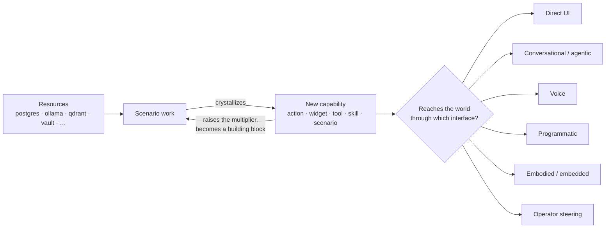

# Vrooli Ecosystem Fit

> **Owner:** `director-swarm` (drift detection via `vision-walk-prep` + `vision-update` decision context). **Author:** operator-direct for the *framing* (the vision recap, the role/interface taxonomy); the *operational lens* (the fit questions, worked examples, enabler tables) is a living tool that agents may extend as Vrooli's interfaces and category set evolve, subject to operator review. Agents may always flag drift.
>
> This doc is the **how-a-piece-fits-the-whole** layer. Its siblings: [`VISION.md`](../../VISION.md) is the *why* (the recursive-intelligence thesis); [`ARCHITECTURE.md`](./ARCHITECTURE.md) is the technical *how* (control plane, resources, layers).

## Why this document exists

The vision is already documented richly — `VISION.md` is a full manifesto, and the `morning-vision-walk` skill steers the portfolio big-picture. The gap this doc closes is different:

> **The vision is inert at decision time.** An agent reads "self-improving ecosystem" as flavor text, then makes *scenario-local* decisions — polishing one app in isolation. What's missing is a **translation layer** that converts the vision into concrete questions an agent actually asks while planning, building, refactoring, or fixing a given scenario.

This document is that translation layer. It gives every agent a shared lens so that working on *any* scenario means asking: **how does this become a good citizen of the whole, not just a standalone app?**

The deep, on-demand walkthrough of the lens is the `ecosystem-fit` skill (`prompt-manager skill read ecosystem-fit`). This doc is the canonical reference that skill cites.

## The loop, in one picture

Vrooli compounds because every solved problem crystallizes into a reusable capability (see `VISION.md` for the full thesis). The thing this doc adds: **a new capability has to reach the world through an *interface*, and it has a *functional role* in the loop.** Those two dimensions are what the lens makes you think about.

## Axis 1 — Functional role

Scenario manifests may declare the controlled `service.class` vocabulary:
`meta`, `interface-enabler`, `external-integration`, or `product`. This role is
separate from the Offer Desk deliverable class (`MARKETED`/`ENABLING`) and from
meter class A/B; the former describes schedule membership and the latter
describes who pays for usage.

What a scenario *does for the ecosystem*, ordered by **multiplicative effect** (how much building it raises the system's own capability ceiling). These are descriptive, not bureaucratic — scenarios routinely span rows.

| Role | Multiplier | What it does | Examples |
|---|---|---|---|
| **Meta / self-improvement** | Highest | Improves Vrooli's own ability to engineer, test, deploy, monetize, and maintain itself | `swarm-manager`, `test-genie`, `prompt-manager`, the `*-health` scenarios |
| **Interface enabler** | High | Makes one of the interfaces below possible or better | `audio-tools`, `agent-inbox`, `tunnel-manager`, `app-monitor`, `cli-health`, `ui-health` |
| **External integration / connector** | Medium | Bridges Vrooli to outside services and hardware — extends *reach* | `browser-automation-studio`, device-control, IoT, Slack/GitHub connectors |
| **Product / personal / monetization** | Low (meta) | Delivers standalone value or revenue — the economic point of the whole thing | finance, health, nutrition, lifestyle apps |

**Low meta-multiplier is not low value.** Products are why the system earns its keep. The lens just asks product authors to *also* spend the cheap design effort that lets a product become a building block later (Axis 3).

## Axis 2 — Interfaces

An **interface is any boundary crossing between Vrooli and the world (or the operator).** Classify each by `(modality × direction)`. Most interfaces are **bidirectional** — that's the key insight that resolves "is X an interface?": yes, if it crosses the boundary; the only question is direction.

| Modality | Inbound (world → Vrooli) | Outbound (Vrooli → world) | Enabler scenarios |
|---|---|---|---|
| **Direct UI** | scenario web UIs | — | `tunnel-manager`, `app-monitor` |
| **Conversational / agentic** | you ask `agent-inbox` | an agent prompts you (`morning-vision-walk`) | `cli-health`, `ui-health` (command + widget discovery), declared widgets & tools |
| **Voice** | you speak | it speaks; future phone calls | `audio-tools` (local + BYOK; monetized via LPBS) |
| **Programmatic** | CLI / REST / Connect | scenarios calling scenarios | — |
| **Embodied / embedded** | `switchboard` | In-app, Telegram, Slack, and iMessage agent reach — "Vrooli comes to you" | Switchboard descriptor registry and adapter catalogue |
| **Operator steering** | accepted decisions | agents present work for approval | `prompt-manager` teams, `morning-vision-walk` |

A scenario can sit in any **role** (Axis 1) while touching one or more **interfaces** (Axis 2). The two axes are orthogonal: `audio-tools` is an *interface enabler* (role) that powers the *voice* interface; a nutrition app is a *product* (role) that ships a *direct UI* and could later add *conversational* and *voice*.

## Axis 3 — Compound value (the cross-cutting principle)

Regardless of role or interface, **build every scenario as a future building block.** A one-off that satisfies a personal need today should be designed so it can be composed into something grander tomorrow — exposed through interfaces, declared as widgets/tools, integrable into dashboards and other scenarios.

> **Worked illustration.** A nutrition app starts as a calorie/macro tracker. Built for compound value, its recipes and food-on-hand are a clean data surface — so a later meal-prep app can plan from what you already have, and a later personal-health dashboard can compose nutrition + skincare + nootropics + a sequenced-genome scenario into cross-cutting protocols. Built *without* that foresight, each of those becomes a painful retrofit.

This is the same reflex as CLAUDE.md Rule #4 (Discover → Use → Capture) applied at design time: leave seams so the next scenario reuses you instead of re-implementing you.

## The ecosystem-fit lens

When you plan, build, refactor, or fix a scenario, run these five question clusters. (Depth scales with the work — a new scenario answers all five; a bugfix may answer none. See the `ecosystem-fit` skill for the depth decision tree.)

1. **Interfaces — which channel(s) does this serve or enable, and what does that make "done" mean?**
   - Direct UI → polished, production-ready.
   - Conversational → widgets and tools declared *and discoverable* (`cli-health` / `ui-health`).
   - Voice → actually wired into the consuming scenarios, not just present.
   - Programmatic → a clean CLI / Connect surface other scenarios can call.

2. **Functional role & multiplier — which role does this play, and is there a cheap way to *raise* its multiplier?**
   - e.g. replace an LLM step with deterministic code or a `prompt-manager action`; expose a reusable capability instead of burying it.

3. **Compound value — is it built to be extended and composed later? What seams make that cheap?**
   - *(Programmatic aid: if `tech-tree-designer` is validated and running, it can answer "where does this sit on the map of all possible software / what does it unlock." Treat as optional — fall back to reasoning from this doc when it is unavailable.)*

4. **Self-improvement — does this, or could it cheaply, advance one of Vrooli's own meta-capabilities** (engineering, testing, deployment, monetization, upkeep, or how the operator/user interacts with the system)?

5. **Monetization & bundle fit — how does this earn its keep, and which bundle does it serve?** (See the dedicated section below.)
   - Which bundle (business / lifestyle), and is it a headliner or depth-layer scenario?
   - Is each capability free, **metered** (real per-use cost — AI tokens, audio seconds), or **gated** (a plan/tier differentiator)?
   - If metered or gated, is it wired through LPBS rather than reinvented?

## Monetization & bundles

Every scenario "is meant to be set up so it can potentially be monetized" (CLAUDE.md) — so monetization is part of ecosystem citizenship, not an afterthought. But the lens only asks you to **route to the canon and pick the integration pattern**; it does not decide strategy.

- **Whether to monetize, pricing, and which bundle** are operator-curated **monetization canon** — agents never edit it directly. Read, don't write: [`docs/monetization/README.md`](../monetization/README.md) (plan of record), [`strategy/STRATEGY.md`](../monetization/strategy/STRATEGY.md) (posture), [`catalogs/CATALOG.md`](../monetization/catalogs/CATALOG.md) + `offer-desk offers catalog-edges` (bundle membership). At the portfolio level, `morning-vision-walk` assesses bundle fit.
- **How to wire a paid feature** (the free / metered / gated decision and the LPBS credit + entitlement contracts) is the engineering sibling of this doc: [`PAID_FEATURES.md`](./PAID_FEATURES.md). Use `bundle-integration-steer` for the wiring.

Key principle (from `STRATEGY.md`): the subscription buys **convenience and integrated access, not access to the code**. Never gate a capability a self-hoster could already run with their own keys — keep BYOK valid.

## Worked examples

| Scenario | Role (Axis 1) | Interfaces (Axis 2) | Compound value (Axis 3) | What "done" means |
|---|---|---|---|---|
| `test-genie` | Meta / self-improvement (highest multiplier) | Programmatic (CLI) + UI; consumed by `swarm-manager` & GCT | Every new phase/producer raises testing power for *all* scenarios | Phases catalogued, findings structured & routed, integration green |
| `audio-tools` | Interface enabler | Voice (in + out) + programmatic | Voice embeds into `web-console`, `swarm-manager`, `agent-inbox`; monetized via LPBS | Local + BYOK providers, capability slug + feature contract, consumers adopted |
| nutrition app (hypothetical) | Product / personal / monetization (low meta-multiplier) | Direct UI now; conversational + voice later | Recipe / food-on-hand data is a clean surface for a future meal-prep app and health dashboard | Polished UI **and** an extensible data model + declared widgets/tools so it is a building block |

## How this is wired in

- **Light, always-on:** the CLAUDE.md *Situational Skill Loading* table routes scenario-building intent to the `ecosystem-fit` skill; the plan-manager authoring wizard's context checkpoint points new-scenario / refactor work here; `implementation-plan-authoring` carries an ecosystem-fit consideration in its Definition of Done for scenario-creating or role-changing plans.
- **Deep, on demand:** `prompt-manager skill read ecosystem-fit` walks the full lens with a depth decision tree, the taxonomy, and the optional `tech-tree-designer` hook.

## Related

- [`VISION.md`](../../VISION.md) — the recursive-intelligence thesis (the *why*).
- [`ARCHITECTURE.md`](./ARCHITECTURE.md) — control plane, resources, layers (the technical *how*).
- `prompt-manager skill read morning-vision-walk` — the operator's steering interface, which applies this lens at the portfolio level.
- `prompt-manager skill read ecosystem-fit` — the deep, on-demand lens walkthrough.
