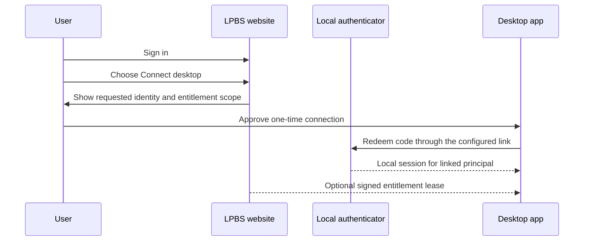

# Vrooli Identity And Authentication

This document is the project-level contract for identity, authentication, and
the relationship between local Vrooli applications, desktop bundles, remote
Vrooli deployments, and commercial products such as Landing Page Business
Suite (LPBS).

It is the canonical starting point for implementation plans. Scenario-specific
documents may add detail, but they must not redefine these boundaries.

## The short version

Vrooli has one identity boundary and several authorization boundaries:

```text
scenario-authenticator proves who a principal is
        |
        +--> coarse scenario capabilities and delegated scope ceilings
        |
        +--> relying scenario verifies the identity locally
                 |
                 +--> scenario enforces domain and object authorization
                 |
                 +--> LPBS separately enforces business accounts,
                      subscriptions, downloads, and entitlements
```

Authentication is not the same as authorization, and neither is the same as a
commercial entitlement.

## Authority map

| Concern | Authority | Contract |
|---|---|---|
| Person or service identity | `scenario-authenticator` or an explicitly configured external provider | Verified principal, issuer, audience, expiry, and provider source |
| Local Vrooli capabilities | `scenario-authenticator` plus the shared capability catalog | Coarse grants such as `<scenario>:read` or `<scenario>:write` |
| Agent delegation | `agent-manager` | Child identity is narrower than its owner and expires no later than its parent |
| Scenario domain authorization | The relying scenario | Ownership, object-level rules, approvals, and mutation safety |
| Customer/business account | LPBS or the product's declared commerce authority | Organization membership, billing customer, and account relationship |
| Commercial entitlement | LPBS or the product's declared entitlement authority | Subscription, plan, feature, download, and activation decisions |
| Desktop shell-to-runtime access | Tier 2 runtime supervisor | App-private loopback control token and lifecycle authority |
| Secret storage | Vrooli credential authority / native OS secure store | Passwords, refresh tokens, signing keys, and provider credentials at rest |

The credential authority stores secrets. It does not become the user identity
provider. The desktop supervisor authenticates the Electron shell to its local
control API. It does not replace human authentication.

## Identity objects

The following objects must remain distinct:

### Principal

A verified human, service, machine, or agent identity. The canonical request
shape is the shared `api-core/identity.Principal` model. A relying party must
not trust a subject, email, role, or scope received directly from a request
body.

### Local installation

A particular Vrooli or desktop installation. It has its own data directory,
signing material, machine bindings, provider configuration, and security mode.

### Business account

An LPBS or product-owned commercial relationship. A person may belong to more
than one business account, and a business account may have many principals.

### Entitlement

A time-bounded or persistent authorization to use a commercial feature, obtain
a download, or activate a product. An entitlement is not a login session and
must not be represented by copying a website session token into a desktop app.

### Capability

A coarse technical permission for a scenario or effect. Capabilities are
catalogued from scenario declarations. A capability does not by itself prove
ownership of a specific domain object.

## Deployment authentication modes

Every desktop or hosted deployment must declare its authentication mode. The
runtime must not infer a different mode from an unavailable dependency.

| Mode | Human sign-in | Identity authority | Offline behavior | Default use |
|---|---|---|---|---|
| `personal_local` | No | Current OS user plus app-private runtime | Supported when the bundle is otherwise offline-capable | Default for a bundled single-user app such as Git Control Tower |
| `local_multi_user` | Yes | Private local `scenario-authenticator` realm | Local sign-in works; external linking may be unavailable | Explicitly enabled by the operator |
| `remote_vrooli` | Yes when the remote API requires it | Configured Tier 1 Vrooli identity provider | Not available unless the product declares a cache/lease policy | Thin desktop client |
| `shared_provider` | Yes or provider-specific | Broker-issued scoped provider lease | Depends on the provider lease | Reuse of a running Tier 1 or approved peer provider |

`personal_local` is not an authorization bypass. The OS account and private
application boundary are the declared authority for that mode. If the app is
exposed to another user, another host, or a shared network, it must use a
multi-user or remote mode.

## Hosted LPBS versus installation-local identity

`scenario-authenticator` is an installation-scoped identity provider. It is
not automatically a single global account database for every Vrooli machine.
The correct topology depends on where the product is deployed:

| Product topology | Authenticator placement | What the realm means | LPBS relationship |
|---|---|---|---|
| Public LPBS hosted on one VPS or cloud service | One dedicated/shared hosted provider for that LPBS deployment, or an approved external provider | The hosted LPBS tenant or product identity boundary | LPBS is a relying party and remains the business/commerce authority |
| Self-hosted LPBS deployed by `scenario-to-cloud` | `scenario-authenticator` may be bundled as a dependency in the same mini-Vrooli installation | That customer's installation | LPBS and the local authenticator are co-located, but they still own different data |
| Tier 2 personal desktop | No authenticator by default | The OS user and private app boundary | LPBS is optional and is used only for explicit paid-feature linking |
| Tier 2 multi-user desktop | One private local authenticator per installation | The local installation | LPBS may link a principal to a business account through a scoped flow |

One authenticator may serve many relying-party scenarios inside one
installation. A scenario must not silently start a private authenticator for
itself when an installation provider is already configured. Conversely, a
public hosted LPBS deployment must not create one isolated local realm per
request or per customer unless that tenant topology is an intentional product
decision with the required operational backing.

The `scenario-to-cloud` mini-Vrooli model makes a local LPBS deployment
technically possible: the dependency analyzer can include
`scenario-authenticator`, and the remote installation can start both
scenarios. This does not make the local realm the global LPBS identity
authority. It creates an installation-scoped realm whose lifecycle, backup,
key custody, and recovery must be managed with the rest of that installation.

## Administrative ownership and bootstrap

There are three different administrative roles:

| Role | Authority | Examples |
|---|---|---|
| Identity administrator | `scenario-authenticator` | Unlock or disable a principal, reset credentials, revoke sessions, manage MFA, assign coarse capabilities |
| Product administrator | LPBS or another relying party | Manage landing content, billing, downloads, business accounts, entitlements, and product operations |
| Installation operator | Vrooli/deployment surface | Configure providers, modes, bundles, secrets, backups, and service lifecycle |

The same human may hold all three roles, but the roles are not represented by
one universal administrator token. In a self-hosted LPBS deployment, the
first LPBS administrator can be provisioned as the first local
`scenario-authenticator` realm administrator during an explicit bootstrap
flow. The bootstrap must record the mapping between the local principal and
the LPBS administrator; it must not rely on email equality or copy the LPBS
session.

After bootstrap, LPBS product-administration screens that need identity
operations call the authenticator through a server-side, authenticated
API-to-API client resolved with `api-core/discovery`. The call carries the
verified actor and an explicitly bounded management action. The browser never
receives an authenticator management credential and the LPBS API never
becomes a second password database.

The target management surface includes user search, lock/unlock, credential
reset initiation, MFA reset/recovery, session revocation, role/capability
assignment, and audit lookup. These are management capabilities, not claims
that the current authenticator endpoint set already exposes every operation.
The endpoint reference labels the current and planned portions separately.

## Scale and operational boundary

The design must work for a personal installation and have a clean path to
thousands or tens of thousands of principals. Scale comes from keeping the
authenticator out of the request hot path:

- relying parties verify short-lived access tokens locally from cached JWKS;
- only login, refresh, recovery, administration, and revocation coordination
  call the authenticator;
- a hosted deployment uses managed durable storage, shared Redis or an
  equivalent hot-state service, key rotation, backups, rate-limit
  coordination, and observable audit delivery before adding replicas;
- a local single-replica installation may use the documented SQLite and
  durable hot-state path, but it must not advertise hosted HA guarantees;
- realm, tenant, and account indexes must be explicit before large hosted
  populations are enabled.

The scale target does not mean every deployment needs a managed database. It
means the storage, key, cache, and provider seams must not force a rewrite
when the deployment moves from one private installation to a hosted fleet.

## Tier 2 desktop rules

The desktop supervisor owns only verified private service lifecycle. It:

- starts only artifacts admitted by the bundle manifest;
- stores mutable state in the per-user application-data directory;
- stores secrets through the credential authority;
- authenticates the Electron shell with its app-private loopback token;
- does not scan arbitrary ports or adopt arbitrary processes;
- does not silently switch from a private bundle to a remote provider.

The bundled application and the supervisor token are separate from human
identity. A bundled app must not require a website login merely because the
user downloaded it.

When an operator changes from `personal_local` to `local_multi_user`, the
application must show a setup flow, provision the local identity provider,
create or select the first administrator, and record the mode transition.
Changing modes is a security-sensitive configuration change, not a cosmetic
UI setting.

## Website identity and local identity linking

An LPBS website login authenticates a website principal and authorizes LPBS
operations. It does not automatically authenticate that person to a local
Vrooli installation.

Linking must use an explicit, one-time, consented protocol such as an
authorization-code/PKCE or device flow:



The link must be:

- explicit and auditable;
- revocable from both sides;
- scoped to one installation and product audience;
- independent of email-string equality;
- free of copied LPBS admin or website session tokens.

LPBS remains authoritative for subscriptions, customer accounts, download
rights, and commercial feature entitlements. The local authenticator remains
authoritative for local principals, sessions, MFA, and scenario capabilities.

## Git Control Tower behavior

Git Control Tower uses the following policy:

| Deployment | Expected behavior |
|---|---|
| Bundled private, personal | No human sign-in. The current OS user operates the private app. |
| Bundled private, shared local | Local authenticator sign-in is required after explicit opt-in. |
| External-server | The configured server decides identity and authorization. |
| Shared provider | The broker supplies a scoped, expiring lease; the app does not discover arbitrary peers. |

The Git scenario still enforces its own repository, mutation, human-control,
and agent-policy rules. A valid identity or LPBS entitlement never replaces
those domain decisions.

## Browser, API, and token rules

- A browser talks to its own scenario API. Cross-origin browser calls to
  `scenario-authenticator` are not the normal integration path.
- Relying parties verify access tokens locally from JWKS on the hot path.
- Tokens must use a resource-specific audience when the migration contract
  permits it; the old default-realm audience is compatibility state.
- Browser sessions use secure same-origin cookies or an authorization-code
  flow. Bearer access and refresh tokens must not be stored in `localStorage`.
- Access tokens are short-lived. Refresh tokens rotate and are stored through
  the credential authority when used by a desktop client.
- Agent and service identities are distinct from human identities.
- A provider conflict fails closed. External-provider subjects are linked by
  an explicit mapping record, never by an unreviewed string comparison.

## Scenario manifest direction

Protected scenarios should declare non-secret authentication metadata in their
service or bundle manifest:

```json
{
  "authentication": {
    "mode": "scenario_authenticator",
    "required": true,
    "resource": "git-control-tower",
    "audience": "scenario:git-control-tower",
    "public_routes": ["/health", "/public/*"],
    "capability_namespace": "git-control-tower",
    "multi_user": "optional"
  }
}
```

The manifest declares the deployment contract. It does not contain passwords,
private keys, refresh tokens, provider management credentials, or user data.
Desktop bundles may additionally declare non-secret profiles for explicit
operator-selected mode transitions. The desktop runtime persists only the
selected mode and transition metadata; provider credentials and entitlement
leases remain in their owning authority.

## Migration contract

The full migration proceeds in this order:

1. Publish this identity and deployment contract.
2. Make `api-core/identity` the canonical principal shape.
3. Make `api-core/authn` the canonical provider-adapter boundary.
4. Retire bespoke consumer JWT parsers behind compatibility adapters.
5. Unify capability matching and agent attenuation.
6. Move browser flows away from browser-visible bearer storage.
7. Add explicit LPBS-to-local account linking.
8. Migrate LPBS identity to the shared provider while retaining LPBS commerce
   and entitlement ownership.
9. Add reusable account/security components to
   `react-component-library`.

No implementation plan should skip the contract reconciliation step. A
scenario may remain on a compatibility path temporarily, but its current mode,
authority, migration owner, and removal condition must be documented.

## Documentation and release gate

The migration is ready for implementation planning only when each adopting
scenario has a short, explicit record containing:

1. its deployment modes and default mode;
2. its identity provider and realm/tenant boundary;
3. the claims or provider adapter it consumes;
4. the domain authorization and entitlement decisions it still owns;
5. its bootstrap, account-linking, logout, recovery, and offline behavior;
6. the compatibility seam, migration owner, and removal condition; and
7. the evidence required for local, hosted, and desktop release claims.

The implementation is not complete when a shared UI renders a sign-in form.
It is complete when the API, CLI, browser flow, deployment manifest,
operator runbook, audit behavior, backup/recovery path, and tests all agree on
the same authority model. A document must label an endpoint, mode, or
provider as `shipped`, `compatibility`, `planned`, or `deferred`; “target” is
not evidence of current support.

## Related documents

- [`AUTHORIZATION.md`](AUTHORIZATION.md) — capability and domain-authorization boundary
- [`GATED-UI-AUTHENTICATION.md`](GATED-UI-AUTHENTICATION.md) — configured provider ingress
- [`../deployment/README.md`](../deployment/README.md) — deployment vocabulary
- [`../../scenarios/deployment-manager/docs/tiers/tier-2-desktop.md`](../../scenarios/deployment-manager/docs/tiers/tier-2-desktop.md) — Tier 2 target contract
- [`../../scenarios/scenario-authenticator/README.md`](../../scenarios/scenario-authenticator/README.md) — IdP scenario entrypoint
- [`../../scenarios/landing-page-business-suite/docs/integrations/subscription-entitlements-system.md`](../../scenarios/landing-page-business-suite/docs/integrations/subscription-entitlements-system.md) — commerce authority
- [`../../scenarios/react-component-library/docs/internal/SECURITY.md`](../../scenarios/react-component-library/docs/internal/SECURITY.md) — shared UI security boundary
