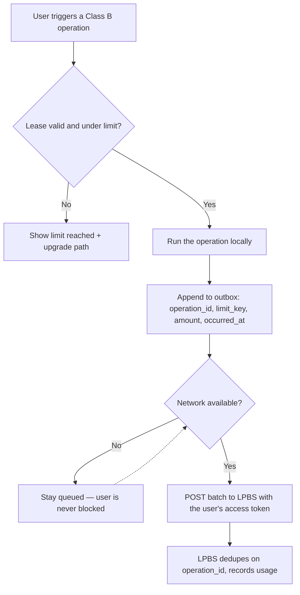

# Paid Features — Integration Contract

> **What this is:** the engineering contract for *how* any scenario turns a capability into a paid feature — the free/metered/gated decision, the trust boundary that decides where enforcement runs, and how to wire each through `landing-page-business-suite` (LPBS). Agent-maintainable engineering reference, sibling to [`ECOSYSTEM.md`](./ECOSYSTEM.md).
>
> **What this is NOT:** the *whether*, the *price*, or the *bundle*. Those are operator-curated **monetization canon** under [`docs/monetization/`](../monetization/README.md) — which agents never edit directly (canon changes flow through operator-approved decisions). This doc *cites* that canon; it does not restate or override it.

## Why this exists

Every scenario that wants to charge for something otherwise rediscovers LPBS or invents its own approach. This doc is the single contract so a scenario builder asks the right questions once and wires the known pattern instead of improvising.

It is the engineering half of the `ecosystem-fit` lens's "Monetization & bundle fit" cluster (`prompt-manager skill read ecosystem-fit`). The lens routes you here; this doc tells you how to build it. `prompt-manager skill read bundle-integration-steer` is the step-by-step wiring skill and follows this contract.

## Implementation status

This contract is the implementation contract. The status table below distinguishes shipped machinery from seams that are intentionally still being completed.

| Contract element | Status |
|---|---|
| LPBS Stripe rail: plans, prices, coupons, webhooks, wallet, reservations | Live |
| Consumer identity: magic link → JWT, asymmetric signing, published JWKS | Live |
| Shared device session (`packages/credentialclient-go`) | Live |
| Cost-bearing metering through LPBS (`POST /api/v1/ai/inference`) | Live |
| Gated downloads + desktop update manifests | Live |
| Per-tier + per-app limit model (`subscription_tier_limits`) | Live in the database |
| `plan_rank` on the entitlement payload | Live |
| Signed entitlement lease | Live: RS256 lease, `kid`, `not_after`, JWKS verification |
| User-authenticated batch usage endpoint | Live |
| Local-capacity usage outbox | Live through `packages/monetization-go`; BAS and web-console use scenario storage adapters |
| `.vrooli/monetization.json` manifest + `monetization-conformance` phase | Live for BAS and web-console; schema version 2 requires `bundle_key` and `app_key` |
| Non-Stripe (Apple / Google) subscription sources | Live behind the LPBS `ReceiptValidator` seam; mobile platform SDK calls remain shell-owned |

Planned items are tracked in the monetization foundation plan; run `plan-manager plans list` to find it.

## Decision 1 — free, metered, or gated?

```
Does this capability have a real marginal cost per use
(LLM tokens, STT/TTS seconds, hosted compute, a paid third-party API)?
│
├─ YES → does it ALSO need to be restricted to certain plans?
│        ├─ YES → METERED + GATED (check entitlement, then charge credits)
│        └─ NO  → METERED (charge credits per use)
│
└─ NO → is it a plan/tier differentiator (premium feature, gated download)?
         ├─ YES → GATED (entitlement flag / plan-tier check)
         └─ NO  → FREE (no integration — most features)
```

| Mode | Use when | Mechanism |
|---|---|---|
| **Free** | No marginal cost, not a tier differentiator. The default. | Nothing to wire. |
| **Metered** | Each use costs real money | Charge credits through LPBS |
| **Gated** | Plan/tier differentiator with negligible marginal cost | Check the entitlement lease |
| **Metered + gated** | Expensive *and* tier-restricted | Entitlement check first, then credit charge |

> **Do not paywall core/free capability.** Per monetization `STRATEGY.md` principle 1, the subscription buys convenience and integrated API routing — not access to open-source code. If you find yourself gating something a self-hoster could already run with their own keys, the framing is wrong. BYOK (bring-your-own-key) must remain a valid path: a metered feature falls back to the user's own provider key with no credit charge.

## Decision 2 — which meter class?

Every metered capability is one of two classes. **The class decides where enforcement runs**, and getting it wrong is the difference between a meter that holds and a meter that is decorative.

| | **Class A — cost-bearing** | **Class B — local-capacity** |
|---|---|---|
| Definition | Vrooli pays real money per use | The user's own machine does the work; Vrooli pays nothing |
| Examples | LLM tokens, TTS/STT seconds, hosted compute, an upload to Vrooli-owned storage, a paid third-party API called with a Vrooli key | Workflow exports, local workflow runs, project counts |
| Executed by | LPBS (server-side) | The client |
| Wallet authority | LPBS, before the work happens | LPBS, eventually |
| Works offline | No — the feature *is* a network call | Yes, always |
| Bypassable | No | Yes, and that is accepted |
| Enforcement | Reserve → execute → finalize | Local optimistic check + durable outbox |

The dividing line is **who pays**, not where the code runs. Two capabilities that look local but are Class A: an export that uploads to Vrooli-owned storage, and a "local" feature that calls a paid API with a Vrooli-owned key.

### Why Class B enforcement is deliberately weak

A Class B meter runs on hardware the user controls. Any enforcement there is bypassable by patching the binary, and blocking on a network round-trip to enforce it would break the feature on a plane or a bad connection while still not stopping anyone determined.

So the design accepts the bypass. A Class B meter is a **nudge, not a lock**. Revenue integrity comes from Class A, which is genuinely unbypassable because the wallet check happens on the server before any tokens come back. Class B exists to shape plan choice for the honest majority, and blocking it offline costs more in goodwill than the bypass costs in revenue.

Recording overage is still useful: it is a pricing signal. Never retro-bill or disable a feature after a backlog syncs.

## The trust boundary

**A scenario running on a user's machine is untrusted.** In tier-2 desktop and tier-3 mobile the scenario's own API binary ships inside the app bundle, so anything it enforces locally is advisory and anything it holds is readable.

Three rules follow, and the `monetization-conformance` phase enforces all three:

1. **No shared service secret ever ships to a client.** A static service token that authorizes writes is a forgery primitive the moment it leaves your servers.
2. **Identity comes from the verified token, never from the request body.** A server that reads `user_identity` out of a payload lets any authenticated caller write against a stranger's account.
3. **Never verify a lease with a shared symmetric secret.** LPBS publishes an asymmetric JWKS; a client-held signing secret could mint leases.
4. **A Class A meter is never client-executed.** If the client can decide not to charge, it is not a meter.

Client-side entitlement checks remain valuable — they drive correct button states, upgrade prompts, and fast local decisions. They are a **user-experience affordance, not a security boundary**. LPBS re-checks authoritatively on every Class A call.

## The entitlement lease (gated features)

A gate must be fast and must survive a lost connection. Both come from the same mechanism.

LPBS issues a **signed, time-boxed entitlement lease**: the entitlement payload, signed with the key already published at `/.well-known/jwks.json`, carrying a `not_after`. The client caches it and verifies the signature locally on every gate.

```mermaid
sequenceDiagram
    participant App as Scenario (client)
    participant CA as Credential authority
    participant LPBS

    App->>CA: resolve refresh token (vrooli/lpbs-account)
    CA-->>App: refresh token
    App->>LPBS: POST /api/v1/auth/refresh
    LPBS-->>App: access token (short-lived) + rotated refresh token
    App->>LPBS: GET /api/v1/entitlements (Bearer access token)
    LPBS-->>App: signed lease {status, plan_tier, plan_rank, features[], limits[], not_after}
    Note over App: cache lease; verify signature locally per gate
    App->>App: gate check — no network
```

Why signed rather than a plain cached payload: it cannot be extended past `not_after`, it cannot be hand-edited without tooling, and revocation is bounded and predictable — a cancelled subscription dies at lease renewal rather than needing a push.

Lease rules:

- **Verify against JWKS.** Never verify an LPBS token with a shared symmetric secret. A symmetric secret capable of *verifying* is also capable of *minting*, and in a client bundle that is an account-takeover primitive.
- **Carry the limits in the lease.** Tier limits are authoritative in LPBS's `subscription_tier_limits`. A scenario that also keeps limits in local config has two sources of truth that drift the first time pricing changes.
- **Degrade to the cached lease while it is valid.** Do not hard-fail a gate on a transient network error.
- **Expire honestly.** Once `not_after` passes with no refresh, gated features fall back to the free tier and the UI says why.

## The Class A contract (server-executed metering)

Charge through LPBS so every cost-bearing feature shares one wallet, one auth, and one set of safety guarantees.

1. **Authenticate** — the user's LPBS access token (`Authorization: Bearer …`).
2. **Reserve** — atomically check balance and reserve estimated cost (row-level lock) to avoid TOCTOU overspend. Estimates carry a safety margin (1.5× in the AI gateway).
3. **Execute** — run the operation. For streaming, hold the reservation (auto-expires ~10 min) and stream.
4. **Finalize** — settle to actual usage: refund the difference if under, charge extra if over.
5. **Handle `insufficient_credits` (HTTP 402)** — short-circuit gracefully with a clear upgrade/top-up path; never partially deliver and silently fail.
6. **Record** — write a usage-ledger row so the user sees spend and the platform can reconcile.

Credits are stored as internal units (`credits_per_usd × USD`) and rendered with `display_credits_multiplier` / `display_credits_label` — do not hardcode display numbers.

**Reference implementations to copy from, not reinvent:**

- **AI / LLM tokens** — `scenarios/landing-page-business-suite/docs/reference/METERED_INFERENCE.md`; the client side is `scenarios/ai-gateway/api/internal/providers/metered.go` against `POST /api/v1/ai/{chat,inference,stream}`. The fully-canonical example.
- **Audio per-second / per-ms** — `scenarios/audio-tools/docs/domains/usage/`. Same credit model, metered by duration instead of tokens.

A scenario that only needs LLM inference gets Class A metering for free by calling ai-gateway normally. It does not implement any of the above itself.

## The Class B contract (local-capacity metering)



Rules:

- **Never block the operation on the network.** The outbox drains on a ticker, on reconnect, and at startup — never in the request path.
- **The outbox is durable.** An in-memory retry that gives up loses paid-plan usage data silently. Persist the row, mark it synced, retry until it lands.
- **Reuse one `operation_id`** across the local ledger row and every retry. LPBS already dedupes on it, so replay is safe and a batch can be sent twice with no double count.
- **Report, do not retro-bill.** A backlog that syncs over a limit is recorded as overage. Never claw back credits or disable a feature because of it.
- **Show pending state.** "12 operations pending sync" is honest and cheap; silent divergence is neither.

## Declaring monetization

A monetized scenario declares its paid surface in `.vrooli/monetization.json`, validated by [`.vrooli/schemas/monetization.schema.json`](../../.vrooli/schemas/monetization.schema.json). The file's presence makes the `monetization-conformance` test-genie phase applicable.

```jsonc
{
  "$schema": "../../../.vrooli/schemas/monetization.schema.json",
  "version": 2,
  "bundle_key": "business_suite",
  "app_key": "example-scenario",
  "features": [
    { "key": "watermark_free", "class": "B", "min_plan_rank": 2,
      "enforcement_paths": ["api/services/export/watermark.go"] }
  ],
  "meters": [
    { "limit_key": "ai_credits", "class": "A", "byok": true,
      "enforcement_paths": ["api/services/ai/service.go"] },
    { "limit_key": "workflow_exports", "class": "B", "outbox": "api/internal/billing",
      "enforcement_paths": ["api/services/export/service.go"] }
  ]
}
```

`class` is load-bearing: it is what lets conformance distinguish a correctly optimistic Class B meter from a Class A meter that was wrongly moved client-side.

Declaring nothing is not a way to pass. Conformance also becomes applicable when a scenario is *detected* to touch LPBS, and an undeclared monetized scenario fails with `money.undeclared_monetization`.

## Validation

`monetization-conformance` is a test-genie phase provided by LPBS, in the same shape as `ai-conformance` (provided by ai-gateway) and `search` (provided by search-hub). See `scenarios/test-genie/docs/phases/monetization-conformance/README.md` for the rungs, the finding codes, and the canonical fix for each.

Static conformance proves the *shape*. It cannot prove that LPBS actually refuses a forged client — that is a `scenario-to-desktop` journey that patches the local entitlement to a higher tier and asserts the server still refuses the Class A call. Run both: the phase catches drift cheaply on every run, the journey catches "the server-side check was never real" once per release.

## Bundle membership (which SKU does this scenario belong to?)

That is a **strategy** decision, not an engineering one. The registry is operator-curated:

- **`docs/monetization/catalogs/CATALOG.md`** — the sellable units.
- **`offer-desk offers catalog-edges`** — the authoritative many-to-many scenario→SKU map, held as typed `belongs_to` edges. It was `docs/monetization/catalogs/scenario-sku-map.json` until the 2026-08-16 retirement moved its 13 mappings into Offer Desk; the retired file remains recoverable under `~/.vrooli/retired/`.

If you believe a scenario should join/change a bundle, **do not edit the map** — surface it: the `catalog-strategist` proposes via a `catalog-mapping-update` decision and the operator curates.

## Deployment tiers

The contract is identical across tiers. Only the purchase rail and the token store differ.

| | Tier 1 local | Tier 2 desktop | Tier 3 mobile | Tier 4 cloud |
|---|---|---|---|---|
| Enforcement point | Local (semi-trusted) | Untrusted | Untrusted | Server (trusted) |
| Purchase rail | Stripe via LPBS | Stripe via LPBS | Store IAP | Stripe via LPBS |
| Sign-in | Browser → loopback callback | Browser → loopback callback with PKCE | Platform web-auth session | Cookie/session |
| Token store | Credential authority | Electron `safeStorage` + credential authority | Keychain / Keystore through the credential authority | Server |

Tier 2 ships as a **direct download**, not through the Mac App Store or Microsoft Store. That keeps one payment rail, no store cut, no in-app-purchase obligation, and direct update control through LPBS's delivery system.

Tier 3 is the only genuine second rail. Entitlements are therefore **source-agnostic**: a subscription resolves identically whether Stripe, Apple, or Google issued it, so signing in on desktop reflects a subscription bought on a phone. Store policy for digital-goods purchase moves; confirm the current App Review and Play Payments rules at implementation time rather than trusting any doc.

## Worked examples

| Capability | Mode | Class | How |
|---|---|---|---|
| LLM chat/analysis inside a scenario | Metered | A | Call ai-gateway normally; BYOK bypasses credits |
| TTS / STT (audio-tools) | Metered | A | LPBS credits per audio-ms |
| Studio-tier-only UI feature | Gated | — | `plan_rank ≥ studio` or a `features[]` flag from the lease |
| Desktop app download | Gated | — | `status` active + `GET /api/v1/downloads` server-side check |
| Local export capped per plan | Metered | B | Lease limit + local optimistic check + outbox |
| Premium export that uploads to Vrooli storage | Metered + gated | A | Entitlement check, then server-side reserve/finalize |

## Governance & related

- **Strategy canon is operator-write-only.** `docs/monetization/` changes via operator-approved decisions only. This doc is engineering reference and may be updated by agents as the LPBS contract evolves — but it must stay a *pointer* to that canon, never a second source of truth for pricing/bundles.
- [`ECOSYSTEM.md`](./ECOSYSTEM.md) — where a scenario fits the whole; this doc is the monetization facet's engineering detail.
- [`docs/monetization/README.md`](../monetization/README.md) — the monetization plan of record.
- `scenarios/landing-page-business-suite/docs/integrations/subscription-entitlements-system.md` — LPBS-side subsystem design.
