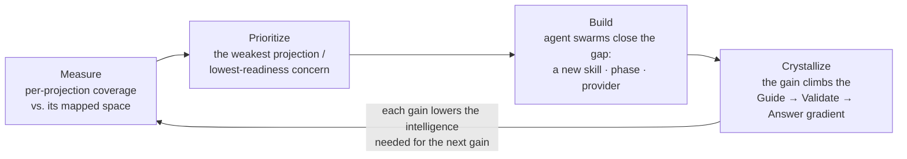
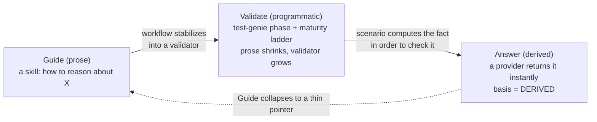
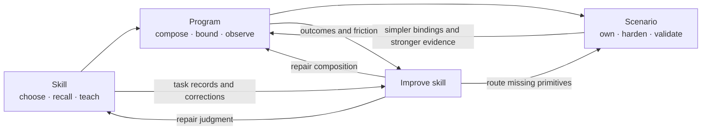

# Recursive Self-Improvement

> **Owner:** `director-swarm` (drift detection via `vision-walk-prep` + `vision-update` decision context). **Author:** operator-directed; the integrating *framing* is concept canon (operator-curated), while the links it threads track living subsystems and may be extended by agents subject to operator review. Agents may always flag drift.
>
> **Objectives served:** `I1` (capability compounding), `I2` (coherence), `I3` (enablement) — declared in [`OBJECTIVES.md`](../director-swarm/strategy/OBJECTIVES.md), joined live by `prompt-manager graph objectives`. This doc is the narrative face of the instrumental objectives; the table is the declaration. It uses objective ids rather than a local goal vocabulary, because `goal` is a reserved swarm-manager work type (`goals`, `milestones`, `backlog items`).
>
> This doc is the **spine** of Vrooli's self-improvement story. Its siblings: [`VISION.md`](../../VISION.md) is the *why* (the recursive-intelligence thesis); [`ARCHITECTURE.md`](./ARCHITECTURE.md) is the technical *how* (control plane, resources, layers); [`ECOSYSTEM.md`](./ECOSYSTEM.md) is how a single scenario fits the whole. This doc is the *loop that ties them together*: how Vrooli improves its own ability to improve.

## Why this document exists

The recursive-self-improvement idea is documented richly but **scattered**: the philosophy lives in `VISION.md`, the measurement model in the meta-optimization-manager's [`COVERAGE-MODEL.md`](../../scenarios/meta-optimization-manager/docs/concepts/COVERAGE-MODEL.md), the machinery in `agent-system/` ([`PROMOTION_LADDER.md`](../agent-system/PROMOTION_LADDER.md), [`TEMPLATE_CONVERGENCE_LOOP.md`](../agent-system/TEMPLATE_CONVERGENCE_LOOP.md)), and the operating cadence in the [`meta-optimization`](../meta-optimization/README.md) plan-of-record. A reader has to island-hop to assemble the whole.

This doc is the single read-path. It says, in order: **what the loop is, why it closes, why three measurements suffice, what makes it compound, and who runs it** — deferring the formal detail to the canon each section links. It does *not* restate those docs; it names them as stations on one conveyor belt.

## 1. The loop, in one picture

Vrooli's product is software, and its meta-product is *the ability to build software more cheaply*. The recursive loop is the second one improving the first — and, in the same motion, improving itself.



The closing edge is the whole point: every improvement doesn't just raise a number, it makes the *next* improvement cheaper to engineer — because the system can now understand, verify, and guide more of its own development. That is the recursion. Everything below is detail on each node and on why that closing edge exists.

This is the same flywheel `ECOSYSTEM.md` draws over *capabilities* (resource → scenario work → capability → raises the multiplier), observed one level up: here the "capability" being compounded is **the engineering process itself**.

## 2. The four projections — the coordinate system

Software engineering, done by a (local) agent, is **understand → change → verify**, with know-how guiding the whole way. The project's *readiness* for that work decomposes into four measurable **projections**, each owned by the scenario that holds its ground truth:

| Projection | The question it answers | Owner | Engineering step |
|---|---|---|---|
| **Answer** | Can the project be *understood* — are architectural questions answerable? | [`search-hub`](../../scenarios/search-hub/docs/spaces/answer-space.md) | understand |
| **Validate** | Can a change be *verified* and auto-fixed? | [`test-genie`](../../scenarios/test-genie/docs/spaces/validate-space.md) | verify |
| **Guide** | Is there a *skill* to guide each engineering task? | [`prompt-manager`](../../scenarios/prompt-manager/docs/spaces/guide-space.md) | the know-how, throughout |
| **Act** | Can an agent programmatically *invoke* each operation? | [`program-runtime`](../../scenarios/program-runtime/docs/spaces/act-space.md) | change (the effect surface, not the synthesis) |

**Why these four, and where the boundary sits.** Answer, Validate, and Guide externalize the *inputs* to engineering: understanding becomes a queryable Answer, verification becomes an automatic Validate, know-how becomes a reusable Guide. The **synthesis itself — deciding what to change — stays the model's residual job**, and no projection removes it. That boundary is the load-bearing insight of the framework: the input projections are the **scaffolding that shrinks the irreducible intelligence** synthesis demands.

**Act measures the other side of that boundary.** It does not externalize synthesis. It measures whether the conclusion can be *expressed symbolically* — whether each operation the model wants to perform resolves to a governed, typed, programmatically invocable call instead of prose the agent must improvise around. Answer, Validate, and Guide raise the quality of what the model reasons over; Act raises the fidelity of what it can do with the conclusion. Map the project well along all four, and "change" becomes a small, well-supported step that even a weak local model can take — and one it expresses as a checkable program rather than a sequence of guesses. The formal contract is in [`COVERAGE-MODEL.md`](../../scenarios/meta-optimization-manager/docs/concepts/COVERAGE-MODEL.md). (Coverage is a map; actual readiness is proven *empirically* by the manager's `trials` domain, not declared from the map. A map also says nothing about whether the roads it draws are still open — that is the **Condition** axis, §6.)

Each projection is measured against a **denominator** — the curated *intended* space (the owner's `*-space.md` doc, the "search space" of everything that projection should eventually cover) — joined live against the owner's registry to get the **numerator**. Crucially, the honesty is **recursive**: every coverage number is reported as "X% complete *against a Y-confidence denominator*," so the system can never imply false completeness. The formal denominator/numerator/confidence/attestation contract lives in [`COVERAGE-MODEL.md`](../../scenarios/meta-optimization-manager/docs/concepts/COVERAGE-MODEL.md); this doc only needs you to hold the intuition.

> **Projection vs. space.** A *projection* is the measured view (Answer/Validate/Guide). Its *space* is the denominator side of it — the enumerable set of everything that view should eventually cover. The `*-space.md` filenames name the spaces; the projections are what we compute over them.

## 3. The maturation gradient — the engine

Answer, Validate, and Guide are not parallel, independent dials. They are a **gradient** a capability climbs as it matures, and that climb *is* the engine of self-improvement. Act does not sit on this gradient — it is the effect surface, not a maturing form of the same knowledge — which is why §2 treats it as the other side of the synthesis boundary rather than a fourth rung:



A concern is **born as prose** (a Guide skill: "here's how to think about dependency hygiene"). As the workflow stabilizes, the prose compresses into deterministic structure — a `test-genie` phase backed by a scenario and a maturity ladder (Validate). Once a scenario *computes* a fact in order to check it, that same fact becomes derived-answerable: it registers a provider and joins the Answer space. The mature end-state is "present in all three modes, with the Guide collapsed to a thin **pointer** because Validate + Answer now carry it."

This is exactly `I1` (**capability compounding**) in motion: judgment (prose, LLM-required) migrating into deterministic code (CLI, phase, provider), so each capability makes later work cheaper. The machinery that drives each step is already canon:

- [`PROMOTION_LADDER.md`](../agent-system/PROMOTION_LADDER.md) — *"stability unlocks compression"*: how a prose skill graduates into a CLI contract, then an Action, then retires. The per-skill version of the gradient.
- [`TEMPLATE_CONVERGENCE_LOOP.md`](../agent-system/TEMPLATE_CONVERGENCE_LOOP.md) — *"improve the gene, not the organism"*: the same compounding applied to portfolio-wide architecture (improve the template once, mechanize convergence so every scenario climbs without re-deciding).

A graduated pointer-skill is the **success state, not a Guide gap** — measuring readiness per-concern as a *trajectory* up this gradient (rather than three independent buckets) is what keeps the model honest about what's truly mature.

## 4. Why it compounds — the recursion

### Fast learning, governed repetition, durable capability

At scenario scale, the closing edge has three speeds. A **skill** is the low-cost
interface: it lets an agent use a capability now, supplies judgment that the tool
cannot yet encode, and surrounds each attempt with recall and capture. A
**governed program** is the low-cost execution hypothesis: it turns a repeated
multi-capability path into typed, bounded, attributable work before the product
surface is mature. The **scenario** is the durable substrate: it eventually owns
the invariants, state transitions, recovery, and operations that repeated use has
shown to be generally valuable.



The improve skill therefore regulates the interfaces between layers, not only
the scenario's code. A failed attempt can mean that guidance selected the wrong
route, a program composed the route badly, or the scenario lacks a robust
primitive. The sensor evidence must decide the owner. Optimizing only the skill
creates ever-longer prose; optimizing only the program creates a shadow product;
optimizing only the scenario makes every learning cycle wait for the most
expensive implementation layer.

Promotion is complete only when the faster layer becomes simpler after the
durable layer improves. A new scenario operation that leaves the old workaround
in every program has added capability but has not closed the learning loop.

`I1` has two readings, and they are the same motion seen from capability and from cost: **more of engineering becomes programmatic**, and therefore **less intelligence is required to engineer it** (run local models; cost-optimize). The second follows from the first:

- When **understanding is pre-derived** (a rich Answer space), the model doesn't have to reason out the architecture from scratch.
- When **verification is automatic and auto-fixing** (a reliable Validate space), the model doesn't have to be trusted to get it right the first time — the loop catches and repairs regressions.
- When **the next step is pre-named** (a complete Guide space), the model doesn't have to invent the approach.
- When **the effect surface is typed and governed** (a broad Act space), the model doesn't have to improvise how to invoke an operation, and a malformed call fails before it runs rather than after.

What's left for the model is the small residual **change** step — and where Act coverage is high, it expresses that step as a program over typed calls rather than as improvised prose. A small, well-scaffolded step in a checkable form is something a *cheap, local* model can do. So every gain along the gradient does two things at once:

1. It **raises a projection's coverage** (more of the project is answerable / verifiable / guided).
2. It **lowers the intelligence and cost of the next gain** — because the system can now answer, verify, and guide more of *its own* development.

That second effect is the closing edge of the §1 diagram. It is why the loop is *recursive* rather than merely iterative: the rate of improvement is itself improving. The portfolio bet is roughly an **order-of-magnitude gain in development speed** once the Validate projection (test-genie) is reliable enough to run the loop with minimal supervision — at which point the cost of each turn of the loop drops far enough that the system can take far more turns.

## 5. Who runs it — the operating layer

The loop is executed by **agent swarms** — Vrooli's "executive team," running on heartbeats (`ARCHITECTURE.md` → *operator steers, agents execute*). One swarm is dedicated to the loop itself: the **Meta-Optimization Team**, whose plan-of-record is [`docs/meta-optimization/`](../meta-optimization/README.md) and whose operating cadence (six audit loops draining a universal friction inbox) is [`OPERATING_MODEL.md`](../meta-optimization/operating/OPERATING_MODEL.md). It is not the only loop steering the platform, and its measurements only hold while the substrate beneath it does — how it sits beside the platform-reliability loop and above the fast service loops is *Control topology*, below.

Its instrument is the **`meta-optimization-manager`** scenario — a thin, read-mostly aggregator that **measures** per-projection coverage and **tells the swarms what to prioritize** (it surfaces candidates and numbers; it does not decide — substrate, tiering, and improvement decisions stay agentic). The live measurement is:

```
meta-optimization-manager coverage status --json
```

…which returns each projection's coverage joined live against its owner, paired with denominator-confidence. The manager's own model is its [`COVERAGE-MODEL.md`](../../scenarios/meta-optimization-manager/docs/concepts/COVERAGE-MODEL.md) and [`DOMAINS.md`](../../scenarios/meta-optimization-manager/docs/concepts/DOMAINS.md) (`coverage`, `convergence`, `focus`, `trials`).

## Control topology

The loop above is the slowest, most reflective of several nested loops — and its measurements only mean something because faster loops hold the ground beneath it steady.

**Fast platform loops.** Beneath the swarms, four platform loops keep individual services alive minute-to-minute: commissioning (`vrooli setup`, host tools), the capacity broker, autoheal, and system-monitor. Each absorbs what it can at its own timescale and escalates only what the inner loops repeatedly fail to catch. The layered map — timescales, ownership, escalation rules — is [`OPERATING_MODEL.md` § Platform Under Control](../infra-health/operating/OPERATING_MODEL.md); this doc does not restate it.

**Two peer slow loops.** Above the fast loops sit two slow loops that do not direct each other. Both declare `I2` (coherence):

- **infra-health** keeps the substrate's *aggregate* reliability in band — repeat failures, heal-loops, reliability-target drift, cross-platform debt ([`docs/infra-health/`](../infra-health/README.md)).
- **meta-optimization** improves the *engineering process* — skills, agents, teams, and the toolchain (§5 above).

Neither is above the other. Both **drain into `director-swarm` and the operator through the morning vision walk**: infra-health findings at Phase 5.7, meta-optimization decisions at Phase 5.5, and both teams' `capability-gap` decisions into Phase 3 (director-swarm consumes them). Authority lives in the **accepted operator decisions** those phases produce, not in the teams themselves — the teams surface and recommend; the operator decides.

**The dependency edge.** The two loops are peers in command but not independent in fact: meta-optimization's measurements are valid only while the substrate its experiments run through — agent runtime, prompt store, sandboxes — is itself in band. A degraded substrate silently corrupts every coverage number and trial verdict. So the peer relationship carries one directed dependency:

- Substrate degradation that impairs the improvement loop is **priority-elevated in infra-health's routing**, not treated as one finding among many.
- meta-optimization is an **authorized external raiser of `capability-gap` decisions into infra-health** when it observes substrate trouble it cannot itself fix.
- the experiment **conclude gate carries a substrate-validity precondition** (owned by `skill-optimizer`'s responsibilities): a trial concluded while the substrate was out of band is not admissible evidence.

This is a dependency, not a hierarchy of command: infra-health does not run experiments and meta-optimization does not set reliability targets. The edge exists so the improvement loop never mistakes substrate noise for a real result.

## 6. Signal in, improvement out

The loop is fed by friction and emits structured improvement:

- **In** — friction enters through a universal inbox (report-friction, audit findings, run lessons), routed by the inbox-router-drain pattern in [`INTAKE_PIPELINE.md`](../agent-system/INTAKE_PIPELINE.md).
- **Out** — improvements land as operator-approved decisions and as new artifacts that climb the gradient: a new skill (Guide), a new test phase or auto-fix (Validate), a new derived provider (Answer), or a template change that converges the whole portfolio (`TEMPLATE_CONVERGENCE_LOOP.md`).

**Friction is not the only input, because it only reports what hurts.** A capability that is built, passing every gate, and quietly degrading — or that nothing calls at all — generates no friction, and so this loop never hears about it. That is the **Condition** axis: whether the supply the projections count is still working. It is measured per contributor leg along three families — does the leg answer, is what it serves current, and is anyone calling it — and its honesty rule is that an uninstrumented leg is never reported as healthy. The formal model is [`CONDITION-MODEL.md`](../../scenarios/meta-optimization-manager/docs/concepts/CONDITION-MODEL.md); this doc only needs you to hold the intuition that **coverage growth without condition measurement compounds unverified claims rather than capability.**

Where each lives — truth vs. judgment vs. execution vs. raw learning — is governed by [`LAYERS.md`](../agent-system/LAYERS.md).

## 7. Status is computed, not written here

This doc is **timeless canon**: it describes the loop's *shape*, never its current completeness. Live status — which projection is weakest, what's prioritized, how close the bet is — is computed, not authored:

- **Coverage / readiness**: `meta-optimization-manager coverage status --json` (numbers + denominator-confidence).
- **What's prioritized / in flight**: the active plans and backlog (e.g. `plan-manager plans render …`, swarm-manager backlog).

If you find percentages or "N% done" in this file, treat it as drift and remove it — point to the live command instead.

## Related

- [`VISION.md`](../../VISION.md) — the recursive-intelligence thesis (the *why*).
- [`ECOSYSTEM.md`](./ECOSYSTEM.md) — how a single scenario fits the whole (the capability flywheel one level down).
- [`ARCHITECTURE.md`](./ARCHITECTURE.md) — control plane, resources, layers (the technical *how*).
- [`COVERAGE-MODEL.md`](../../scenarios/meta-optimization-manager/docs/concepts/COVERAGE-MODEL.md) — the formal projection / denominator / attestation model (the *measurement*).
- [`PROMOTION_LADDER.md`](../agent-system/PROMOTION_LADDER.md), [`TEMPLATE_CONVERGENCE_LOOP.md`](../agent-system/TEMPLATE_CONVERGENCE_LOOP.md) — the gradient's machinery at skill and portfolio scale.
- [`OPERATING_MODEL.md`](../meta-optimization/operating/OPERATING_MODEL.md) — the Meta-Optimization Team's operating loops (who runs it).
- The three space denominators: [`answer-space.md`](../../scenarios/search-hub/docs/spaces/answer-space.md), [`validate-space.md`](../../scenarios/test-genie/docs/spaces/validate-space.md), [`guide-space.md`](../../scenarios/prompt-manager/docs/spaces/guide-space.md).
