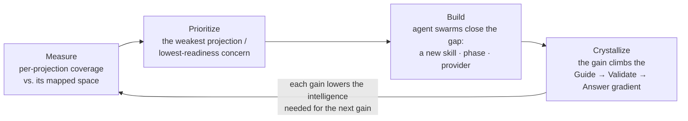
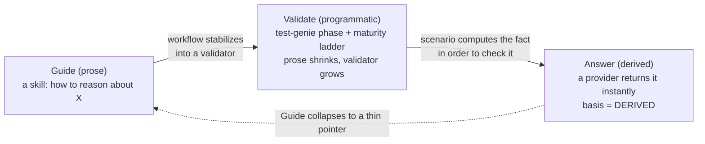

# Recursive Self-Improvement

> **Owner:** `director-swarm` (drift detection via `vision-walk-prep` + `vision-update` decision context). **Author:** operator-directed; the integrating *framing* is concept canon (operator-curated), while the links it threads track living subsystems and may be extended by agents subject to operator review. Agents may always flag drift.
>
> This doc is the **spine** of Vrooli's self-improvement story. Its siblings: [`VISION.md`](../../VISION.md) is the *why* (the recursive-intelligence thesis); [`ARCHITECTURE.md`](./ARCHITECTURE.md) is the technical *how* (control plane, resources, layers); [`ECOSYSTEM.md`](./ECOSYSTEM.md) is how a single scenario fits the whole. This doc is the *loop that ties them together*: how Vrooli improves its own ability to improve.

## Why this document exists

The recursive-self-improvement idea is documented richly but **scattered**: the philosophy lives in `VISION.md`, the measurement model in the meta-optimization-manager's [`COVERAGE-MODEL.md`](../../scenarios/meta-optimization-manager/docs/concepts/COVERAGE-MODEL.md), the machinery in `agent-system/` ([`PROMOTION_LADDER.md`](../agent-system/PROMOTION_LADDER.md), [`TEMPLATE_CONVERGENCE_LOOP.md`](../agent-system/TEMPLATE_CONVERGENCE_LOOP.md)), and the operating cadence in the [`meta-optimization`](../meta-optimization/README.md) plan-of-record. A reader has to island-hop to assemble the whole.

This doc is the single read-path. It says, in order: **what the loop is, why it closes, why three measurements suffice, what makes it compound, and who runs it** — deferring the formal detail to the canon each section links. It does *not* restate those docs; it names them as stations on one conveyor belt.

## 1. The loop, in one picture

Vrooli's product is software, and its meta-product is *the ability to build software more cheaply*. The recursive loop is the second one improving the first — and, in the same motion, improving itself.



The closing edge is the whole point: every improvement doesn't just raise a number, it makes the *next* improvement cheaper to engineer — because the system can now understand, verify, and guide more of its own development. That is the recursion. Everything below is detail on each node and on why that closing edge exists.

This is the same flywheel `ECOSYSTEM.md` draws over *capabilities* (resource → scenario work → capability → raises the multiplier), observed one level up: here the "capability" being compounded is **the engineering process itself**.

## 2. The three projections — the coordinate system

Software engineering, done by a (local) agent, is **understand → change → verify**, with know-how guiding the whole way. The project's *readiness* for that work decomposes into three measurable **projections**, each owned by the scenario that holds its ground truth:

| Projection | The question it answers | Owner | Engineering step |
|---|---|---|---|
| **Answer** | Can the project be *understood* — are architectural questions answerable? | [`search-hub`](../../scenarios/search-hub/docs/spaces/answer-space.md) | understand |
| **Validate** | Can a change be *verified* and auto-fixed? | [`test-genie`](../../scenarios/test-genie/docs/spaces/validate-space.md) | verify |
| **Guide** | Is there a *skill* to guide each engineering task? | [`prompt-manager`](../../scenarios/prompt-manager/docs/spaces/guide-space.md) | the know-how, throughout |

**Why exactly these three — and why the set is complete.** Of the four parts of engineering, three are *externalizable into the project itself*: understanding becomes a queryable Answer, verification becomes an automatic Validate, know-how becomes a reusable Guide. The fourth — **the *change* itself, the code synthesis** — is the model's own residual job. It is deliberately *not* a projection ([`COVERAGE-MODEL.md`](../../scenarios/meta-optimization-manager/docs/concepts/COVERAGE-MODEL.md)). That single omission is the load-bearing insight of the whole framework: the three projections are the **scaffolding that shrinks the irreducible intelligence** the synthesis step demands. Map the project well enough along all three, and "change" becomes a small, well-supported step that even a weak local model can take. (Coverage is a map; actual readiness is proven *empirically* by the manager's `trials` domain, not declared from the map.)

Each projection is measured against a **denominator** — the curated *intended* space (the owner's `*-space.md` doc, the "search space" of everything that projection should eventually cover) — joined live against the owner's registry to get the **numerator**. Crucially, the honesty is **recursive**: every coverage number is reported as "X% complete *against a Y-confidence denominator*," so the system can never imply false completeness. The formal denominator/numerator/confidence/attestation contract lives in [`COVERAGE-MODEL.md`](../../scenarios/meta-optimization-manager/docs/concepts/COVERAGE-MODEL.md); this doc only needs you to hold the intuition.

> **Projection vs. space.** A *projection* is the measured view (Answer/Validate/Guide). Its *space* is the denominator side of it — the enumerable set of everything that view should eventually cover. The `*-space.md` filenames name the spaces; the projections are what we compute over them.

## 3. The maturation gradient — the engine

The three projections are not parallel, independent dials. They are a **gradient** a capability climbs as it matures, and that climb *is* the engine of self-improvement:



A concern is **born as prose** (a Guide skill: "here's how to think about dependency hygiene"). As the workflow stabilizes, the prose compresses into deterministic structure — a `test-genie` phase backed by a scenario and a maturity ladder (Validate). Once a scenario *computes* a fact in order to check it, that same fact becomes derived-answerable: it registers a provider and joins the Answer space. The mature end-state is "present in all three modes, with the Guide collapsed to a thin **pointer** because Validate + Answer now carry it."

This is exactly **Goal 1 — maximize the share of engineering that is programmatic** — in motion: judgment (prose, LLM-required) migrating into deterministic code (CLI, phase, provider). The machinery that drives each step is already canon:

- [`PROMOTION_LADDER.md`](../agent-system/PROMOTION_LADDER.md) — *"stability unlocks compression"*: how a prose skill graduates into a CLI contract, then an Action, then retires. The per-skill version of the gradient.
- [`TEMPLATE_CONVERGENCE_LOOP.md`](../agent-system/TEMPLATE_CONVERGENCE_LOOP.md) — *"improve the gene, not the organism"*: the same compounding applied to portfolio-wide architecture (improve the template once, mechanize convergence so every scenario climbs without re-deciding).

A graduated pointer-skill is the **success state, not a Guide gap** — measuring readiness per-concern as a *trajectory* up this gradient (rather than three independent buckets) is what keeps the model honest about what's truly mature.

## 4. Why it compounds — the recursion and the two goals

Goal 1 (above) makes engineering programmatic. **Goal 2 — minimize the intelligence required to engineer (run local models; cost-optimize)** — is its payoff, and the two are the same motion seen from cost vs. capability:

- When **understanding is pre-derived** (a rich Answer space), the model doesn't have to reason out the architecture from scratch.
- When **verification is automatic and auto-fixing** (a reliable Validate space), the model doesn't have to be trusted to get it right the first time — the loop catches and repairs regressions.
- When **the next step is pre-named** (a complete Guide space), the model doesn't have to invent the approach.

What's left for the model is the small residual **change** step — and a small, well-scaffolded step is something a *cheap, local* model can do. So every gain along the gradient does two things at once:

1. It **raises a projection's coverage** (more of the project is answerable / verifiable / guided).
2. It **lowers the intelligence and cost of the next gain** — because the system can now answer, verify, and guide more of *its own* development.

That second effect is the closing edge of the §1 diagram. It is why the loop is *recursive* rather than merely iterative: the rate of improvement is itself improving. The portfolio bet is roughly an **order-of-magnitude gain in development speed** once the Validate projection (test-genie) is reliable enough to run the loop with minimal supervision — at which point the cost of each turn of the loop drops far enough that the system can take far more turns.

## 5. Who runs it — the operating layer

The loop is executed by **agent swarms** — Vrooli's "executive team," running on heartbeats (`ARCHITECTURE.md` → *operator steers, agents execute*). One swarm is dedicated to the loop itself: the **Meta-Optimization Team**, whose plan-of-record is [`docs/meta-optimization/`](../meta-optimization/README.md) and whose operating cadence (six audit loops draining a universal friction inbox) is [`OPERATING_MODEL.md`](../meta-optimization/operating/OPERATING_MODEL.md).

Its instrument is the **`meta-optimization-manager`** scenario — a thin, read-mostly aggregator that **measures** per-projection coverage and **tells the swarms what to prioritize** (it surfaces candidates and numbers; it does not decide — substrate, tiering, and improvement decisions stay agentic). The live measurement is:

```
meta-optimization-manager coverage status --json
```

…which returns each projection's coverage joined live against its owner, paired with denominator-confidence. The manager's own model is its [`COVERAGE-MODEL.md`](../../scenarios/meta-optimization-manager/docs/concepts/COVERAGE-MODEL.md) and [`DOMAINS.md`](../../scenarios/meta-optimization-manager/docs/concepts/DOMAINS.md) (`coverage`, `convergence`, `focus`, `trials`).

## 6. Signal in, improvement out

The loop is fed by friction and emits structured improvement:

- **In** — friction enters through a universal inbox (report-friction, audit findings, run lessons), routed by the inbox-router-drain pattern in [`INTAKE_PIPELINE.md`](../agent-system/INTAKE_PIPELINE.md).
- **Out** — improvements land as operator-approved decisions and as new artifacts that climb the gradient: a new skill (Guide), a new test phase or auto-fix (Validate), a new derived provider (Answer), or a template change that converges the whole portfolio (`TEMPLATE_CONVERGENCE_LOOP.md`).

Where each lives — truth vs. judgment vs. execution vs. raw learning — is governed by [`LAYERS.md`](../agent-system/LAYERS.md).

## 7. Status is computed, not written here

This doc is **timeless canon**: it describes the loop's *shape*, never its current completeness. Live status — which projection is weakest, what's prioritized, how close the bet is — is computed, not authored:

- **Coverage / readiness**: `meta-optimization-manager coverage status --json` (numbers + denominator-confidence).
- **What's prioritized / in flight**: the active plans and backlog (e.g. `vrooli plans show …`, swarm-manager backlog).

If you find percentages or "N% done" in this file, treat it as drift and remove it — point to the live command instead.

## Related

- [`VISION.md`](../../VISION.md) — the recursive-intelligence thesis (the *why*).
- [`ECOSYSTEM.md`](./ECOSYSTEM.md) — how a single scenario fits the whole (the capability flywheel one level down).
- [`ARCHITECTURE.md`](./ARCHITECTURE.md) — control plane, resources, layers (the technical *how*).
- [`COVERAGE-MODEL.md`](../../scenarios/meta-optimization-manager/docs/concepts/COVERAGE-MODEL.md) — the formal projection / denominator / attestation model (the *measurement*).
- [`PROMOTION_LADDER.md`](../agent-system/PROMOTION_LADDER.md), [`TEMPLATE_CONVERGENCE_LOOP.md`](../agent-system/TEMPLATE_CONVERGENCE_LOOP.md) — the gradient's machinery at skill and portfolio scale.
- [`OPERATING_MODEL.md`](../meta-optimization/operating/OPERATING_MODEL.md) — the Meta-Optimization Team's operating loops (who runs it).
- The three space denominators: [`answer-space.md`](../../scenarios/search-hub/docs/spaces/answer-space.md), [`validate-space.md`](../../scenarios/test-genie/docs/spaces/validate-space.md), [`guide-space.md`](../../scenarios/prompt-manager/docs/spaces/guide-space.md).
