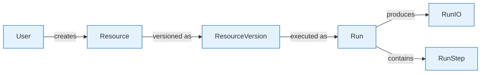

# Vrooli Data Model Documentation

Comprehensive documentation of Vrooli's data architecture, entities, relationships, and database design patterns.

## 📋 Overview

Vrooli's data model is designed to support a complex AI-powered platform with the following key requirements:

- **Hierarchical Organization**: Users → Teams → Chats → Resources → Runs
- **Flexible Content**: Support for various resource types and AI interactions
- **Audit Trail**: Complete history tracking for AI safety and compliance
- **Performance**: Optimized for read-heavy workloads with real-time updates
- **Scalability**: Designed for horizontal scaling and data partitioning

## 📚 Documentation Structure

### **Core Documentation**

#### 🏗️ **[Database Architecture](architecture.md)**
- Technology stack and infrastructure
- Application layers and data flow
- Storage systems and caching
- Backup and recovery strategies

#### 🔗 **Entity Models**
- **[Core Entities](entities/core.md)** - Users, teams, resources, runs
- **[Communication](entities/communication.md)** - Chats, messages, notifications, emails
- **[Content Management](entities/content.md)** - Comments, issues, pull requests, reactions
- **[Commerce & Billing](entities/commerce.md)** - Payments, plans, credits, wallets
- **[Organization](entities/organization.md)** - Bookmarks, tags, schedules, meetings
- **[Analytics & Stats](entities/analytics.md)** - Statistics, awards, reputation, views
- **[Authentication](entities/auth.md)** - Sessions, API keys, user auth, devices

#### 🔄 **[Entity Relationships](relationships.md)**
- Core relationship patterns
- Foreign key constraints
- Many-to-many relationships
- Referential integrity rules

#### 📖 **[Data Dictionary](data-dictionary.md)**
- Core data types and formats
- Enum definitions and values
- Field specifications and constraints
- Validation rules and patterns

### **Implementation Guides**

#### ⚡ **[Performance Guide](performance.md)**
- Indexing strategies and optimization
- Query performance patterns
- Caching implementation
- Database scaling approaches

#### 🔧 **[Access Patterns](access-patterns.md)**
- Repository pattern implementation
- Transaction management
- Bulk operations and batching
- Data loading strategies

#### 🔄 **[Schema Evolution](schema-evolution.md)**
- Migration strategies and best practices
- Versioning and backwards compatibility
- Schema change management
- Data preservation techniques

## 🚀 Quick Start

### For Developers
1. Start with **[Entity Model](entities.md)** to understand the data structure
2. Review **[Relationships](relationships.md)** for foreign key patterns
3. Check **[Access Patterns](access-patterns.md)** for implementation guidance

### For Database Administrators
1. Review **[Architecture](architecture.md)** for infrastructure requirements
2. Study **[Performance Guide](performance.md)** for optimization strategies
3. Follow **[Schema Evolution](schema-evolution.md)** for migration procedures

### For Data Analysts
1. Explore **[Data Dictionary](data-dictionary.md)** for field definitions
2. Understand **[Entity Model](entities.md)** for data relationships
3. Use **[Access Patterns](access-patterns.md)** for efficient queries

## 🔍 Key Concepts

### **Entity Hierarchy**
```
User (BigInt ID)
├── Teams (via Member)
│   ├── Chats
│   └── Resources
├── Resources (Direct ownership)
└── Runs (Execution instances)
```

> **Note**: For complete entity definitions and field specifications, see [Entity Model](entities.md).

### **Data Flow**


## 🔧 Common Operations

### **Creating a Resource**
```typescript
// 1. Create base resource
const resource = await prisma.resource.create({
  data: {
    resourceType: 'Routine',
    isPrivate: false,
    createdById: userId
  }
});

// 2. Create initial version
const version = await prisma.resourceVersion.create({
  data: {
    rootId: resource.id,
    versionIndex: 0,
    versionLabel: '1.0.0',
    isLatest: true,
    config: routineConfig
  }
});
```

### **Executing a Resource**
```typescript
// Create run instance
const run = await prisma.run.create({
  data: {
    name: 'Automated Task Execution',
    resourceVersionId: version.id,
    status: 'Scheduled',
    isPrivate: false
  }
});

// Track execution steps
const step = await prisma.runStep.create({
  data: {
    runId: run.id,
    name: 'Data Processing',
    status: 'Running',
    step: 1
  }
});
```

## 📊 Performance Overview

For detailed database statistics, performance targets, and optimization strategies, see **[Performance Guide](performance.md)**.

## 🔒 Security Considerations

- **Row-Level Security**: Implemented via application logic and permissions JSON
- **Audit Logging**: All modifications tracked with timestamps and user attribution
- **Data Encryption**: Sensitive fields encrypted at application level
- **Access Control**: Role-based permissions enforced through member relationships

## 📈 Monitoring & Health

### **Key Metrics**
- Query performance (p95 < 100ms for reads)
- Connection pool utilization (< 80%)
- Cache hit rates (> 90% for frequently accessed data)
- Storage growth trends and capacity planning

### **Health Checks**
- Database connectivity and response time
- Replication lag for read replicas
- Backup completion and integrity
- Index usage and query plan analysis

## 🔗 Related Documentation

- **[Schema File](../../packages/server/src/db/schema.prisma)** - Source of truth Prisma schema
- **[API Documentation](../api/README.md)** - REST and GraphQL endpoints
- **[Architecture Guide](../architecture/README.md)** - System design overview
- **[Production Operations](../operations/production-guide.md)** - Production deployment and operations

## 🛠️ Tools & Utilities

- **[Prisma Studio](https://www.prisma.io/studio)** - Visual database browser
- **[Database Migrations](../../packages/server/src/db/migrations/)** - Schema change history
- **[Seed Scripts](../../packages/server/src/db/seeds/)** - Development data seeding
- **[Backup Scripts](../../scripts/main/backup.sh)** - Automated backup procedures

---

**Last Updated**: 2024-01-15  
**Schema Version**: 1.0  
**Next Review**: 2024-04-15