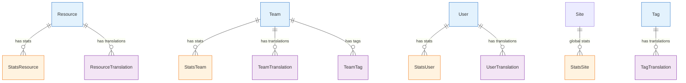

# Analytics & Statistics Entities

Entities that handle platform analytics, statistics tracking, and internationalization.

## 🔗 Entity Relationship Diagram



## 📋 Entity Definitions

## 📊 Statistics Entities

### **StatsResource** - Resource Analytics
Analytics and metrics for individual resources.

```typescript
interface StatsResource {
  id: bigint;                    // Primary key
  periodType: StatPeriodType;   // Period type (Daily, Weekly, Monthly, Yearly)
  periodStart: Date;            // Period start date
  periodEnd: Date;              // Period end date
  resourceId: bigint;           // Associated resource
  views: number;                // View count
  downloads: number;            // Download count
  bookmarks: number;            // Bookmark count
  forks: number;               // Fork count
  runs: number;                // Execution count
  completedRuns: number;       // Successful executions
  score: number;               // Community score
}
```

**Key Features:**
- Multi-period analytics (daily, weekly, monthly, yearly)
- Comprehensive engagement metrics
- Performance tracking
- Community scoring

### **StatsTeam** - Team Analytics
Analytics and metrics for team performance.

```typescript
interface StatsTeam {
  id: bigint;                    // Primary key
  periodType: StatPeriodType;   // Period type
  periodStart: Date;            // Period start date
  periodEnd: Date;              // Period end date
  teamId: bigint;              // Associated team
  membersCreated: number;      // New members added
  resourcesCreated: number;    // Resources created
  runsStarted: number;         // Runs initiated
  runsCompleted: number;       // Runs completed
  apiCalls: number;           // API usage
  score: number;              // Team score
}
```

**Key Features:**
- Team activity tracking
- Member growth metrics
- Resource creation stats
- API usage monitoring

### **StatsUser** - User Analytics
Analytics and metrics for individual user activity.

```typescript
interface StatsUser {
  id: bigint;                    // Primary key
  periodType: StatPeriodType;   // Period type
  periodStart: Date;            // Period start date
  periodEnd: Date;              // Period end date
  userId: bigint;              // Associated user
  resourcesCreated: number;    // Resources created
  resourcesUpdated: number;    // Resources updated
  runsStarted: number;         // Runs initiated
  runsCompleted: number;       // Runs completed
  runTimeCompleted: number;    // Total execution time
  apiCalls: number;           // API usage
  score: number;              // User score
}
```

**Key Features:**
- Personal productivity metrics
- Activity tracking
- Time-based analytics
- Score calculation

### **StatsSite** - Platform Analytics
Global platform statistics and metrics.

```typescript
interface StatsSite {
  id: bigint;                    // Primary key
  periodType: StatPeriodType;   // Period type
  periodStart: Date;            // Period start date
  periodEnd: Date;              // Period end date
  usersCreated: number;        // New user registrations
  teamsCreated: number;        // New teams created
  resourcesCreated: number;    // New resources created
  runsStarted: number;         // Total runs started
  runsCompleted: number;       // Total runs completed
  apiCalls: number;           // Total API calls
  creditsUsed: bigint;        // Credits consumed
}
```

**Key Features:**
- Platform-wide metrics
- Growth tracking
- Usage analytics
- Resource utilization

## 🌐 Internationalization Entities

### **ResourceTranslation** - Resource Translations
Multi-language content for resources with AI embeddings for semantic search.

```typescript
interface ResourceTranslation {
  id: bigint;                    // Primary key
  resourceVersionId: bigint;    // Associated resource version
  language: string;             // Language code (ISO 639-1)
  name: string;                // Translated name
  description?: string;        // Translated description
  instructions?: string;       // Translated instructions
  embedding?: number[];        // AI embedding vector (1536 dimensions)
  embeddingExpiredAt?: Date;   // Embedding expiration timestamp
}
```

**Key Features:**
- Multi-language resource support
- AI-powered semantic search
- Embedding cache management with expiration
- Localized content management
- SEO optimization and global accessibility

### **TeamTranslation** - Team Translations
Multi-language content for teams with AI embeddings.

```typescript
interface TeamTranslation {
  id: bigint;                    // Primary key
  language: string;             // Language code (ISO 639-1)
  name: string;                // Translated team name
  bio?: string;                // Translated team bio
  teamId: bigint;              // Parent team
  embedding?: number[];        // AI embedding vector (1536 dimensions)
  embeddingExpiredAt?: Date;   // Embedding expiration timestamp
}
```

**Key Features:**
- Localized team profiles with semantic search
- AI-powered team discovery
- Multi-language community building
- International team support
- Cultural adaptation

### **UserTranslation** - User Translations
Multi-language content for user profiles with AI embeddings.

```typescript
interface UserTranslation {
  id: bigint;                    // Primary key
  language: string;             // Language code (ISO 639-1)
  bio?: string;                // Translated user bio
  userId: bigint;              // Parent user
  embedding?: number[];        // AI embedding vector (1536 dimensions)
  embeddingExpiredAt?: Date;   // Embedding expiration timestamp
}
```

**Key Features:**
- Localized user profiles with semantic search
- AI-powered user discovery
- Multi-language personal branding
- Cross-cultural communication
- Global networking

### **TagTranslation** - Tag Translations
Multi-language labels for tags with AI embeddings.

```typescript
interface TagTranslation {
  id: bigint;                    // Primary key
  language: string;             // Language code (ISO 639-1)
  tag: string;                 // Translated tag name
  tagId: bigint;               // Parent tag
  embedding?: number[];        // AI embedding vector (1536 dimensions)
  embeddingExpiredAt?: Date;   // Embedding expiration timestamp
}
```

**Key Features:**
- Localized tagging system with semantic search
- AI-powered tag similarity and clustering
- Cross-language content discovery
- Semantic consistency across languages
- Global categorization

### **TeamTag** - Team Tags
Tag associations for teams.

```typescript
interface TeamTag {
  id: bigint;                    // Primary key
  teamId: bigint;              // Associated team
  tagId: bigint;               // Associated tag
}
```

**Key Features:**
- Team categorization
- Skill-based grouping
- Discovery optimization
- Community organization

## 🔍 Query Patterns

### **Get Resource Performance Metrics**
```typescript
const resourceStats = await prisma.statsResource.findMany({
  where: {
    resourceId: resourceId,
    periodType: 'Monthly',
    periodStart: { gte: new Date(Date.now() - 6 * 30 * 24 * 60 * 60 * 1000) }
  },
  orderBy: { periodStart: 'desc' }
});
```

### **Get Team Growth Analytics**
```typescript
const teamGrowth = await prisma.statsTeam.aggregate({
  where: {
    teamId: teamId,
    periodType: 'Daily',
    periodStart: { gte: startDate, lte: endDate }
  },
  _sum: {
    membersCreated: true,
    resourcesCreated: true,
    runsCompleted: true
  }
});
```

### **Get Localized Content**
```typescript
const localizedResource = await prisma.resource.findUnique({
  where: { publicId: resourceId },
  include: {
    translations: {
      where: { language: userLanguage }
    }
  }
});
```

### **Platform Health Dashboard**
```typescript
const platformMetrics = await prisma.statsSite.findFirst({
  where: {
    periodType: 'Daily',
    periodStart: { gte: startOfDay, lte: endOfDay }
  }
});
```

---

**Related Documentation:**
- [Core Entities](core.md) - Users, teams, resources
- [Organization](organization.md) - Scheduling, reminders
- [Security](security.md) - Authentication, API keys