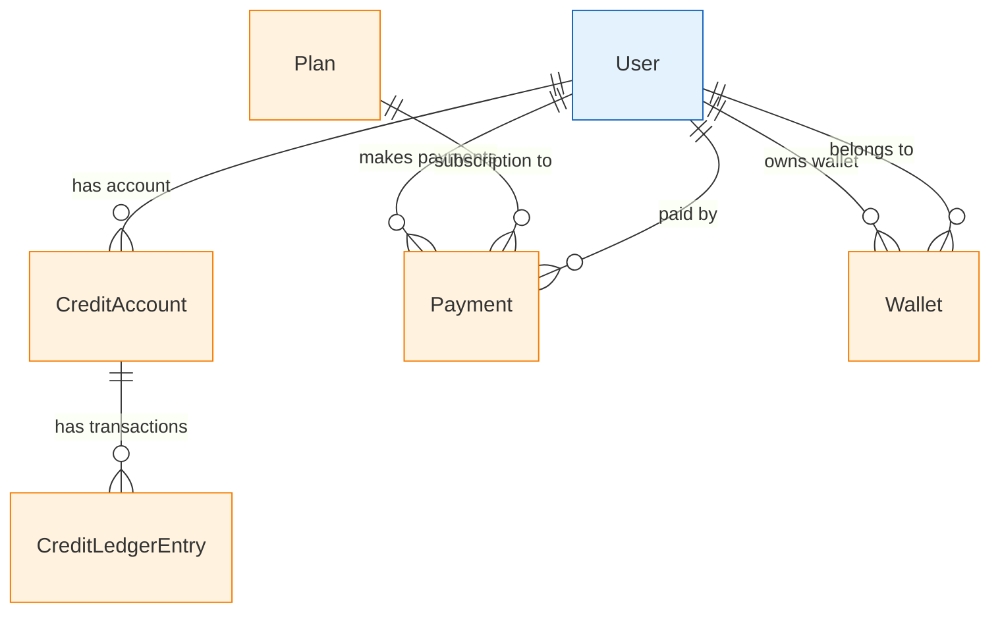

# Commerce & Billing Entities

Entities that handle payments, subscriptions, credits, and financial transactions in Vrooli.

## 🔗 Entity Relationship Diagram



## 📋 Entity Definitions

### **Plan** - Subscription Plans
Different subscription tiers and pricing plans available to users.

```typescript
interface Plan {
  id: bigint;                        // Primary key
  publicId: string;                  // URL-safe identifier (12 chars)
  category: string;                  // Plan category (e.g., 'premium', 'enterprise')
  cost: number;                      // Plan cost in cents
  discountPercent: number;           // Discount percentage (0-100)
  duration: string;                  // Billing period ('monthly', 'yearly', etc.)
  features: object;                  // Plan features and limits
  isActive: boolean;                 // Plan availability status
  maxCreditsPerMonth?: bigint;       // Monthly credit allowance
  stripePriceId?: string;            // Stripe price ID for integration
  createdAt: Date;
  updatedAt: Date;
}
```

**Key Features:**
- Flexible pricing with discounts
- Feature-based plan differentiation
- Credit allocation per plan
- Stripe integration for payment processing

### **Payment** - Payment Transactions
Records of all payment transactions and billing events.

```typescript
interface Payment {
  id: bigint;                        // Primary key
  amount: number;                    // Payment amount in cents
  currency: string;                  // Currency code (ISO 4217)
  description?: string;              // Payment description
  status: PaymentStatus;             // Payment processing status
  userId?: bigint;                   // User making payment
  planId?: bigint;                   // Associated subscription plan
  createdAt: Date;
  updatedAt: Date;
}
```

**Key Features:**
- Multi-currency support
- Comprehensive status tracking
- Plan-based subscription payments
- Audit trail for all transactions

### **CreditAccount** - User Credit Balance
Credit balance and account information for each user.

```typescript
interface CreditAccount {
  id: bigint;                        // Primary key
  credits: bigint;                   // Current credit balance
  nextResetDate?: Date;              // When credits reset for subscription
  userId: bigint;                    // Account owner (unique)
  createdAt: Date;
  updatedAt: Date;
}
```

**Key Features:**
- Real-time credit balance tracking
- Subscription-based credit resets
- One account per user
- Historical balance tracking via ledger

### **CreditLedgerEntry** - Credit Transaction Log
Detailed log of all credit transactions and balance changes.

```typescript
interface CreditLedgerEntry {
  id: bigint;                        // Primary key
  amount: bigint;                    // Credit amount (positive = credit, negative = debit)
  description?: string;              // Transaction description
  type: CreditEntryType;             // Transaction type (purchase, usage, refund, etc.)
  wasAutomated: boolean;             // Automated vs manual transaction
  yupId?: string;                    // External transaction ID
  accountId: bigint;                 // Associated credit account
  createdAt: Date;
  updatedAt: Date;
}
```

**Key Features:**
- Complete audit trail for credits
- Automated transaction tracking
- External system integration (yupId)
- Detailed transaction categorization

### **Wallet** - Digital Wallet
Digital wallet functionality for storing value and making transactions.

```typescript
interface Wallet {
  id: bigint;                        // Primary key
  publicId: string;                  // URL-safe identifier (12 chars)
  name?: string;                     // Wallet name/label
  description?: string;              // Wallet description
  verified: boolean;                 // Wallet verification status
  userId: bigint;                    // Wallet owner (unique)
  createdAt: Date;
  updatedAt: Date;
}
```

**Key Features:**
- Named wallet organization
- Verification system for security
- One primary wallet per user
- Extensible for multiple wallet types

## 🔄 Key Relationships

### **Subscription Flow**
```
1. User selects Plan
2. Payment created with plan reference
3. On successful payment, CreditAccount updated
4. CreditLedgerEntry records credit addition
5. Next reset date set based on plan duration
```

### **Credit Usage Flow**
```
1. User performs action requiring credits
2. CreditLedgerEntry created (negative amount)
3. CreditAccount balance decremented
4. Transaction marked as automated
```

### **Payment Processing Flow**
```
1. Payment record created with 'Pending' status
2. External payment processor (Stripe) handles transaction
3. Webhook updates Payment status to 'Succeeded' or 'Failed'
4. On success, credits added to user account
5. CreditLedgerEntry records the transaction
```

## 🎯 Usage Patterns

### **Creating a Subscription**
```typescript
// 1. Create payment intent
const payment = await prisma.payment.create({
  data: {
    amount: plan.cost,
    currency: 'usd',
    description: `${plan.category} subscription`,
    status: 'Pending',
    userId: userId,
    planId: plan.id
  }
});

// 2. Process with Stripe
const stripePayment = await stripe.paymentIntents.create({
  amount: payment.amount,
  currency: payment.currency,
  metadata: { paymentId: payment.id.toString() }
});

// 3. On successful payment webhook
await prisma.$transaction(async (tx) => {
  // Update payment status
  await tx.payment.update({
    where: { id: payment.id },
    data: { status: 'Succeeded' }
  });
  
  // Add credits to account
  const account = await tx.creditAccount.upsert({
    where: { userId: userId },
    create: {
      userId: userId,
      credits: plan.maxCreditsPerMonth || 0,
      nextResetDate: getNextResetDate(plan.duration)
    },
    update: {
      credits: { increment: plan.maxCreditsPerMonth || 0 },
      nextResetDate: getNextResetDate(plan.duration)
    }
  });
  
  // Record ledger entry
  await tx.creditLedgerEntry.create({
    data: {
      amount: plan.maxCreditsPerMonth || 0,
      description: `${plan.category} subscription credits`,
      type: 'Purchase',
      wasAutomated: false,
      accountId: account.id
    }
  });
});
```

### **Spending Credits**
```typescript
async function spendCredits(userId: bigint, amount: bigint, description: string) {
  return await prisma.$transaction(async (tx) => {
    // Check available balance
    const account = await tx.creditAccount.findUnique({
      where: { userId: userId }
    });
    
    if (!account || account.credits < amount) {
      throw new Error('Insufficient credits');
    }
    
    // Deduct credits
    await tx.creditAccount.update({
      where: { userId: userId },
      data: { credits: { decrement: amount } }
    });
    
    // Record transaction
    await tx.creditLedgerEntry.create({
      data: {
        amount: -amount, // Negative for debit
        description: description,
        type: 'Usage',
        wasAutomated: true,
        accountId: account.id
      }
    });
  });
}
```

### **Monthly Credit Reset**
```typescript
// Automated job to reset subscription credits
async function resetMonthlyCredits() {
  const accountsToReset = await prisma.creditAccount.findMany({
    where: {
      nextResetDate: { lte: new Date() }
    },
    include: {
      user: {
        include: {
          payments: {
            where: { status: 'Succeeded' },
            include: { plan: true },
            orderBy: { createdAt: 'desc' },
            take: 1
          }
        }
      }
    }
  });
  
  for (const account of accountsToReset) {
    const latestPlan = account.user.payments[0]?.plan;
    if (latestPlan && latestPlan.maxCreditsPerMonth) {
      await prisma.$transaction(async (tx) => {
        // Reset credits to plan allowance
        await tx.creditAccount.update({
          where: { id: account.id },
          data: {
            credits: latestPlan.maxCreditsPerMonth,
            nextResetDate: getNextResetDate(latestPlan.duration)
          }
        });
        
        // Record reset transaction
        await tx.creditLedgerEntry.create({
          data: {
            amount: latestPlan.maxCreditsPerMonth,
            description: `Monthly credit reset - ${latestPlan.category}`,
            type: 'Reset',
            wasAutomated: true,
            accountId: account.id
          }
        });
      });
    }
  }
}
```

## 🔍 Query Patterns

### **Get User's Billing Summary**
```typescript
const billingSummary = await prisma.user.findUnique({
  where: { publicId: userPublicId },
  include: {
    creditAccount: {
      include: {
        ledgerEntries: {
          orderBy: { createdAt: 'desc' },
          take: 10
        }
      }
    },
    payments: {
      where: { status: 'Succeeded' },
      include: { plan: true },
      orderBy: { createdAt: 'desc' },
      take: 5
    },
    wallet: true
  }
});
```

### **Get Credit Usage Analytics**
```typescript
const creditUsage = await prisma.creditLedgerEntry.groupBy({
  by: ['type'],
  where: {
    account: { userId: userId },
    createdAt: { gte: startDate }
  },
  _sum: { amount: true },
  _count: true
});
```

### **Get Monthly Revenue Report**
```typescript
const monthlyRevenue = await prisma.payment.groupBy({
  by: ['createdAt'],
  where: {
    status: 'Succeeded',
    createdAt: { gte: startOfMonth, lte: endOfMonth }
  },
  _sum: { amount: true },
  _count: true
});
```

## 💰 Business Logic

### **Credit Pricing Tiers**
```typescript
const CREDIT_COSTS = {
  'basic': { monthly: 1000, cost: 999 },      // $9.99 for 1000 credits
  'premium': { monthly: 5000, cost: 1999 },   // $19.99 for 5000 credits  
  'enterprise': { monthly: 20000, cost: 4999 } // $49.99 for 20000 credits
};
```

### **Transaction Types**
- **Purchase**: Credits bought via subscription or one-time purchase
- **Usage**: Credits spent on AI operations, API calls, etc.
- **Reset**: Monthly/yearly subscription credit renewal
- **Refund**: Credits returned due to failed operations
- **Bonus**: Promotional or referral credits
- **Transfer**: Credits moved between accounts (future feature)

---

**Related Documentation:**
- [Core Entities](core.md) - Users, teams, resources, runs
- [Communication](communication.md) - Chats, messages, notifications
- [Content Management](content.md) - Comments, issues, pull requests