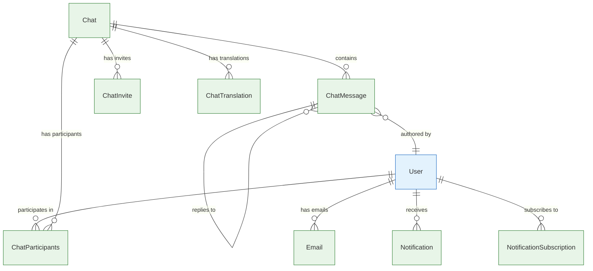

# Communication Entities

Entities that handle all forms of communication in Vrooli: chats, messages, notifications, and email systems.

## 🔗 Entity Relationship Diagram



## 📋 Entity Definitions

### **Chat** - Group Conversations
Real-time chat functionality for team collaboration and AI interactions.

```typescript
interface Chat {
  id: bigint;                        // Primary key
  publicId: string;                  // URL-safe identifier (12 chars)
  config: object;                    // Chat configuration settings
  isPrivate: boolean;                // Chat visibility
  openToAnyoneWithInvite: boolean;   // Invite-based access
  creatorId?: bigint;                // User who created chat
  teamId?: bigint;                   // Associated team
  createdAt: Date;
  updatedAt: Date;
}
```

**Key Features:**
- Public/private visibility controls
- Team-based or individual chats
- Configurable invite permissions
- Real-time message synchronization

### **ChatMessage** - Individual Messages
Messages within chat conversations.

```typescript
interface ChatMessage {
  id: bigint;                        // Primary key
  language: string;                  // Message language (ISO 3-letter code)
  config: object;                    // Message configuration (attachments, etc.)
  text: string;                      // Message content (max 32,768 chars)
  score: number;                     // Community rating
  versionIndex: number;              // Edit version number
  parentId?: bigint;                 // Reply parent message
  userId?: bigint;                   // Message author (null for system messages)
  chatId: bigint;                    // Parent chat
  createdAt: Date;
  updatedAt: Date;
}
```

**Key Features:**
- Threaded conversations (parent/child relationships)
- Message editing with version tracking
- Community scoring system
- Multi-language support
- System message support (userId can be null)

### **ChatParticipants** - Chat Membership
Junction table managing who can access each chat.

```typescript
interface ChatParticipants {
  id: bigint;                        // Primary key
  hasUnread: boolean;                // Unread message indicator
  chatId: bigint;                    // Chat reference
  userId: bigint;                    // Participant user
  createdAt: Date;
  updatedAt: Date;
}
```

**Key Features:**
- Unread message tracking
- Simple membership model
- Efficient participant lookups

### **ChatInvite** - Chat Invitations
Pending invitations for users to join chats.

```typescript
interface ChatInvite {
  id: bigint;                        // Primary key
  status: InviteStatus;              // Pending/Accepted/Declined/Expired
  message?: string;                  // Invitation message (max 4,096 chars)
  chatId: bigint;                    // Target chat
  userId: bigint;                    // Invited user
  createdAt: Date;
  updatedAt: Date;
}
```

**Key Features:**
- Status tracking for invitation lifecycle
- Custom invitation messages
- Automatic expiration handling

### **ChatTranslation** - Internationalization
Translations for chat metadata in multiple languages.

```typescript
interface ChatTranslation {
  id: bigint;                        // Primary key
  embedding?: Vector;                // AI embedding for semantic search
  embeddingExpiredAt?: Date;         // Embedding cache expiration
  chatId: bigint;                    // Parent chat
  language: string;                  // Language code (ISO 3-letter)
  name?: string;                     // Translated chat name
  description?: string;              // Translated description
}
```

**Key Features:**
- Multi-language chat metadata
- AI embeddings for semantic search
- Embedding cache management

### **Email** - Email Management
Email addresses and verification for user accounts.

```typescript
interface Email {
  id: bigint;                        // Primary key
  emailAddress: string;              // Email address (unique, citext)
  receivesAccountUpdates: boolean;   // Account notification preference
  receivesBusinessUpdates: boolean;  // Business notification preference
  verified: boolean;                 // Email verification status
  userId: bigint;                    // Owner user
  createdAt: Date;
  updatedAt: Date;
}
```

**Key Features:**
- Email verification system
- Granular notification preferences
- Multiple emails per user support
- Case-insensitive email storage

### **Notification** - System Notifications
System-generated notifications for users.

```typescript
interface Notification {
  id: bigint;                        // Primary key
  category: string;                  // Notification category
  isRead: boolean;                   // Read status
  title: string;                     // Notification title
  description?: string;              // Detailed description
  imgSrc?: string;                   // Optional image
  link?: string;                     // Action link
  userId: bigint;                    // Target user
  createdAt: Date;
  updatedAt: Date;
}
```

**Key Features:**
- Categorized notifications
- Rich content with images and links
- Read/unread tracking
- Action-oriented design

### **NotificationSubscription** - Subscription Management
User preferences for receiving notifications about specific entities.

```typescript
interface NotificationSubscription {
  id: bigint;                        // Primary key
  context: object;                   // Subscription context/filters
  silent: boolean;                   // Silent notification mode
  userId: bigint;                    // Subscriber
  chatId?: bigint;                   // Chat-specific subscription
  createdAt: Date;
  updatedAt: Date;
}
```

**Key Features:**
- Entity-specific subscriptions
- Silent mode for reduced noise
- Contextual filtering options

## 🔄 Key Relationships

### **Chat Participation Flow**
```
1. User creates Chat
2. ChatParticipants entries created for initial members
3. ChatInvite records created for pending invitations
4. Users send ChatMessages within the chat
5. NotificationSubscriptions track engagement preferences
```

### **Message Threading**
```
Parent ChatMessage
├── Reply ChatMessage (parentId = parent.id)
│   └── Sub-reply ChatMessage (parentId = reply.id)
└── Another Reply ChatMessage (parentId = parent.id)
```

### **Notification Flow**
```
1. System event occurs (new message, mention, etc.)
2. Check NotificationSubscription preferences
3. Create Notification record
4. Send via Email if user preferences allow
5. Real-time push via WebSocket
```

## 🎯 Usage Patterns

### **Creating a Team Chat**
```typescript
// 1. Create chat
const chat = await prisma.chat.create({
  data: {
    isPrivate: false,
    openToAnyoneWithInvite: true,
    creatorId: userId,
    teamId: teamId
  }
});

// 2. Add team members as participants
await prisma.chatParticipants.createMany({
  data: teamMembers.map(memberId => ({
    chatId: chat.id,
    userId: memberId,
    hasUnread: false
  }))
});

// 3. Create notification subscriptions
await prisma.notificationSubscription.createMany({
  data: teamMembers.map(memberId => ({
    userId: memberId,
    chatId: chat.id,
    silent: false
  }))
});
```

### **Sending a Message with Notifications**
```typescript
// 1. Create message
const message = await prisma.chatMessage.create({
  data: {
    text: messageText,
    language: 'eng',
    chatId: chatId,
    userId: authorId
  }
});

// 2. Find subscribers
const subscribers = await prisma.notificationSubscription.findMany({
  where: { chatId: chatId, silent: false },
  include: { user: { include: { emails: true } } }
});

// 3. Create notifications and send emails
for (const subscription of subscribers) {
  if (subscription.userId !== authorId) { // Don't notify author
    await prisma.notification.create({
      data: {
        category: 'message',
        title: `New message in ${chatName}`,
        description: messageText.substring(0, 100),
        link: `/chat/${chat.publicId}`,
        userId: subscription.userId
      }
    });
  }
}
```

## 🔍 Query Patterns

### **Get User's Unread Messages**
```typescript
const unreadChats = await prisma.chatParticipants.findMany({
  where: {
    userId: userId,
    hasUnread: true
  },
  include: {
    chat: {
      include: {
        messages: {
          orderBy: { createdAt: 'desc' },
          take: 1
        }
      }
    }
  }
});
```

### **Get Chat Message Thread**
```typescript
const threadMessages = await prisma.chatMessage.findMany({
  where: {
    OR: [
      { id: parentMessageId },
      { parentId: parentMessageId }
    ]
  },
  orderBy: { createdAt: 'asc' },
  include: {
    user: {
      select: { publicId: true, name: true, handle: true }
    }
  }
});
```

---

**Related Documentation:**
- [Core Entities](core.md) - Users, teams, resources, runs
- [Content Management](content.md) - Comments, issues, pull requests  
- [Authentication](auth.md) - Sessions, API keys, user auth