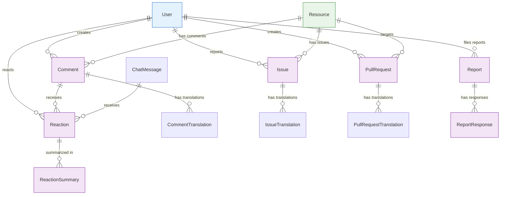

# Content Management Entities

Entities that handle user-generated content, collaboration, and community features: comments, issues, pull requests, and reactions.

## 🔗 Entity Relationship Diagram



## 📋 Entity Definitions

### **Comment** - User Comments
Comments on resources, providing feedback and discussion.

```typescript
interface Comment {
  id: bigint;                        // Primary key
  publicId: string;                  // URL-safe identifier (12 chars)
  createdByUserId?: bigint;          // Comment author
  updatedByUserId?: bigint;          // Last editor
  resourceId?: bigint;               // Target resource
  parentId?: bigint;                 // Parent comment for threading
  isDeleted: boolean;                // Soft delete flag
  isPrivate: boolean;                // Visibility setting
  score: number;                     // Community rating
  bookmarks: number;                 // Bookmark count
  createdAt: Date;
  updatedAt: Date;
}
```

**Key Features:**
- Threaded comments via parent/child relationships
- Soft deletion with audit trail
- Community scoring and bookmarking
- Public/private visibility controls

### **CommentTranslation** - Comment Internationalization
Translations for comments in multiple languages.

```typescript
interface CommentTranslation {
  id: bigint;                        // Primary key
  embedding?: Vector;                // AI embedding for semantic search
  embeddingExpiredAt?: Date;         // Embedding cache expiration
  commentId: bigint;                 // Parent comment
  language: string;                  // Language code (ISO 3-letter)
  text: string;                      // Comment text content
}
```

**Key Features:**
- Multi-language comment support
- AI embeddings for semantic search
- Automatic embedding cache management

### **Issue** - Bug Reports and Feature Requests
Issue tracking system for resources and the platform.

```typescript
interface Issue {
  id: bigint;                        // Primary key
  publicId: string;                  // URL-safe identifier (12 chars)
  status: IssueStatus;               // Issue lifecycle status
  labels: string[];                  // Categorization labels
  closedAt?: Date;                   // Issue resolution timestamp
  createdByUserId?: bigint;          // Issue reporter
  hasAcceptedAnswer: boolean;        // Whether issue has accepted solution
  isPrivate: boolean;                // Visibility setting
  score: number;                     // Community rating
  bookmarks: number;                 // Bookmark count
  resourceId?: bigint;               // Related resource
  createdAt: Date;
  updatedAt: Date;
}
```

**Key Features:**
- Comprehensive issue lifecycle management
- Label-based categorization system
- Accepted answer functionality
- Community engagement metrics

### **IssueTranslation** - Issue Internationalization
Translations for issue content in multiple languages with AI embeddings.

```typescript
interface IssueTranslation {
  id: bigint;                        // Primary key
  issueId: bigint;                   // Parent issue
  language: string;                  // Language code (ISO 639-1)
  name: string;                      // Issue title
  description?: string;              // Issue description
  embedding?: number[];              // AI embedding vector (1536 dimensions)
  embeddingExpiredAt?: Date;         // Embedding cache expiration
}
```

**Key Features:**
- Multi-language issue support with semantic search
- AI-powered issue similarity detection
- Title and description translations
- Cross-language issue discovery

### **PullRequest** - Code Review and Collaboration
Pull request system for collaborative development.

```typescript
interface PullRequest {
  id: bigint;                        // Primary key
  publicId: string;                  // URL-safe identifier (12 chars)
  status: PullRequestStatus;         // PR lifecycle status
  mergedOrRejectedAt?: Date;         // Resolution timestamp
  createdByUserId?: bigint;          // PR creator
  isPrivate: boolean;                // Visibility setting
  score: number;                     // Community rating
  bookmarks: number;                 // Bookmark count
  resourceId?: bigint;               // Target resource
  createdAt: Date;
  updatedAt: Date;
}
```

**Key Features:**
- Complete pull request workflow
- Merge/rejection tracking
- Community review and rating
- Resource-based collaboration

### **PullRequestTranslation** - PR Internationalization
Translations for pull request content.

```typescript
interface PullRequestTranslation {
  id: bigint;                        // Primary key
  embedding?: Vector;                // AI embedding for semantic search
  embeddingExpiredAt?: Date;         // Embedding cache expiration
  pullRequestId: bigint;             // Parent pull request
  language: string;                  // Language code (ISO 3-letter)
  text: string;                      // PR description/content
}
```

### **Reaction** - User Reactions
Emoji reactions and responses to content.

```typescript
interface Reaction {
  id: bigint;                        // Primary key
  emoji: string;                     // Reaction emoji (Unicode)
  userId: bigint;                    // User who reacted
  commentId?: bigint;                // Target comment
  chatMessageId?: bigint;            // Target chat message
  createdAt: Date;
  updatedAt: Date;
}
```

**Key Features:**
- Unicode emoji support
- Multi-target reactions (comments, messages)
- User attribution for all reactions

### **ReactionSummary** - Aggregated Reactions
Summarized reaction counts for performance optimization.

```typescript
interface ReactionSummary {
  id: bigint;                        // Primary key
  emoji: string;                     // Reaction emoji
  count: number;                     // Total reaction count
  commentId?: bigint;                // Target comment
  chatMessageId?: bigint;            // Target chat message
  createdAt: Date;
  updatedAt: Date;
}
```

**Key Features:**
- Denormalized reaction counts
- Performance optimization for popular content
- Real-time count updates

### **Report** - Content Reporting
User reports for inappropriate content or behavior.

```typescript
interface Report {
  id: bigint;                        // Primary key
  details?: string;                  // Report details/description
  language: string;                  // Report language
  reason: string;                    // Report reason/category
  status: ReportStatus;              // Report processing status
  userId: bigint;                    // Reporter
  chatMessageId?: bigint;            // Reported message
  createdAt: Date;
  updatedAt: Date;
}
```

**Key Features:**
- Multi-category reporting system
- Status tracking for moderation workflow
- Detailed report descriptions
- Multi-language support

### **ReportResponse** - Moderation Responses
Administrative responses to user reports.

```typescript
interface ReportResponse {
  id: bigint;                        // Primary key
  actionSuggested?: string;          // Suggested moderation action
  details?: string;                  // Response details
  language: string;                  // Response language
  createdByUserId: bigint;           // Responding moderator
  reportId: bigint;                  // Parent report
  createdAt: Date;
  updatedAt: Date;
}
```

**Key Features:**
- Moderator response tracking
- Action recommendation system
- Multi-language moderation support

## 🔄 Key Relationships

### **Comment Threading Flow**
```
Root Comment (parentId = null)
├── Reply Comment (parentId = root.id)
│   └── Sub-reply Comment (parentId = reply.id)
└── Another Reply (parentId = root.id)
```

### **Issue Resolution Flow**
```
1. User creates Issue (status = 'Open')
2. Community discusses via Comments
3. Solutions proposed and rated
4. Best solution marked hasAcceptedAnswer = true
5. Issue status updated to 'ClosedResolved'
6. closedAt timestamp recorded
```

### **Pull Request Flow**
```
1. User creates PullRequest (status = 'Draft')
2. PR status updated to 'Open' when ready
3. Community reviews via Comments
4. PR approved/rejected by resource owner
5. mergedOrRejectedAt timestamp recorded
6. Status updated to 'Merged' or 'Rejected'
```

### **Content Moderation Flow**
```
1. User files Report about content
2. Report status = 'Open'
3. Moderator reviews and creates ReportResponse
4. Action taken (content removed, user warned, etc.)
5. Report status = 'Resolved'
```

## 🎯 Usage Patterns

### **Creating a Comment Thread**
```typescript
// 1. Create root comment
const rootComment = await prisma.comment.create({
  data: {
    resourceId: resourceId,
    createdByUserId: userId,
    isPrivate: false,
    score: 0
  }
});

// 2. Add translation
await prisma.commentTranslation.create({
  data: {
    commentId: rootComment.id,
    language: 'eng',
    text: commentText
  }
});

// 3. Create reply comment
const replyComment = await prisma.comment.create({
  data: {
    resourceId: resourceId,
    parentId: rootComment.id,
    createdByUserId: replyUserId,
    isPrivate: false,
    score: 0
  }
});
```

### **Adding Reactions with Summary Updates**
```typescript
async function addReaction(userId: bigint, targetId: bigint, targetType: 'comment' | 'message', emoji: string) {
  return await prisma.$transaction(async (tx) => {
    // Check if user already reacted with this emoji
    const existing = await tx.reaction.findFirst({
      where: {
        userId: userId,
        emoji: emoji,
        ...(targetType === 'comment' ? { commentId: targetId } : { chatMessageId: targetId })
      }
    });
    
    if (existing) {
      throw new Error('User already reacted with this emoji');
    }
    
    // Create reaction
    const reaction = await tx.reaction.create({
      data: {
        userId: userId,
        emoji: emoji,
        ...(targetType === 'comment' ? { commentId: targetId } : { chatMessageId: targetId })
      }
    });
    
    // Update summary
    await tx.reactionSummary.upsert({
      where: {
        emoji_commentId_chatMessageId: {
          emoji: emoji,
          commentId: targetType === 'comment' ? targetId : null,
          chatMessageId: targetType === 'message' ? targetId : null
        }
      },
      create: {
        emoji: emoji,
        count: 1,
        ...(targetType === 'comment' ? { commentId: targetId } : { chatMessageId: targetId })
      },
      update: {
        count: { increment: 1 }
      }
    });
    
    return reaction;
  });
}
```

### **Processing Content Reports**
```typescript
async function moderateReport(reportId: bigint, moderatorId: bigint, action: string, details: string) {
  return await prisma.$transaction(async (tx) => {
    // Create moderation response
    await tx.reportResponse.create({
      data: {
        reportId: reportId,
        createdByUserId: moderatorId,
        actionSuggested: action,
        details: details,
        language: 'eng'
      }
    });
    
    // Update report status
    await tx.report.update({
      where: { id: reportId },
      data: { status: 'Resolved' }
    });
    
    // Take action based on report
    if (action === 'remove_content') {
      const report = await tx.report.findUnique({
        where: { id: reportId },
        include: { chatMessage: true }
      });
      
      if (report?.chatMessage) {
        await tx.chatMessage.update({
          where: { id: report.chatMessage.id },
          data: { text: '[Content removed by moderator]' }
        });
      }
    }
  });
}
```

## 🔍 Query Patterns

### **Get Comment Thread**
```typescript
const commentThread = await prisma.comment.findMany({
  where: {
    OR: [
      { id: rootCommentId },
      { parentId: rootCommentId }
    ],
    isDeleted: false
  },
  include: {
    translations: {
      where: { language: userLanguage }
    },
    createdByUser: {
      select: { publicId: true, name: true, handle: true }
    },
    reactions: {
      include: { 
        _count: { select: { reactionSummary: true } }
      }
    }
  },
  orderBy: { createdAt: 'asc' }
});
```

### **Get User's Open Issues**
```typescript
const userIssues = await prisma.issue.findMany({
  where: {
    createdByUserId: userId,
    status: { in: ['Open', 'InProgress'] }
  },
  include: {
    translations: {
      where: { language: userLanguage }
    },
    resource: {
      select: { publicId: true, resourceType: true }
    }
  },
  orderBy: { createdAt: 'desc' }
});
```

### **Get Popular Content by Reactions**
```typescript
const popularContent = await prisma.reactionSummary.groupBy({
  by: ['commentId', 'chatMessageId'],
  _sum: { count: true },
  where: {
    createdAt: { gte: last7Days }
  },
  orderBy: {
    _sum: { count: 'desc' }
  },
  take: 20
});
```

---

**Related Documentation:**
- [Communication](communication.md) - Chats, messages, notifications
- [Core Entities](core.md) - Users, teams, resources, runs
- [Commerce & Billing](commerce.md) - Payments, plans, credits