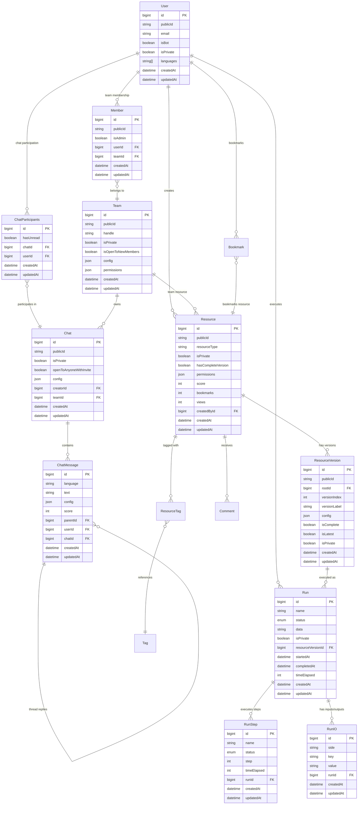

# Core Entities

Primary entities that form the foundation of Vrooli's data model: Users, Teams, Resources, and Runs.

## 🔗 Entity Relationship Diagram



## 🏛️ Core Entities

### **User** - Platform Users
Central entity representing all users in the system.

```typescript
interface User {
  id: bigint;                        // Primary key
  publicId: string;                  // URL-safe identifier (12 chars)
  name: string;                      // Display name (required)
  handle?: string;                   // Unique @username (citext)
  bannerImage?: string;              // Profile banner URL
  profileImage?: string;             // Profile image URL
  confirmationCode?: string;         // Email confirmation code
  confirmationCodeDate?: Date;       // Code expiration
  invitedByUserId?: bigint;         // User who invited this user
  isBot: boolean;                    // Bot account flag
  isBotDepictingPerson: boolean;     // Bot representing real person
  isPrivate: boolean;                // Profile visibility
  isPrivateMemberships: boolean;     // Hide team memberships
  isPrivatePullRequests: boolean;    // Hide PR activity
  isPrivateResources: boolean;       // Hide resource activity
  isPrivateResourcesCreated: boolean;// Hide created resources
  isPrivateTeamsCreated: boolean;    // Hide created teams
  isPrivateBookmarks: boolean;       // Hide bookmarks
  isPrivateVotes: boolean;           // Hide voting activity
  languages: string[];               // Preferred languages (ISO codes)
  theme: string;                     // UI theme preference
  lastExport?: Date;                 // Last data export
  lastLoginAttempt: Date;            // Last login attempt
  logInAttempts: number;             // Failed login count
  numExports: number;                // Total exports performed
  currentStreak: number;             // Current activity streak
  longestStreak: number;             // Longest activity streak
  accountTabsOrder?: string;         // UI tab order preference
  botSettings: object;               // Bot-specific settings
  creditSettings: object;            // Credit/billing settings
  notificationSettings?: string;     // Notification preferences
  bookmarks: number;                 // Denormalized bookmark count
  views: number;                     // Profile view count
  reputation: number;                // Community reputation score
  stripeCustomerId?: string;         // Stripe customer ID
  status: AccountStatus;             // Account status
  createdAt: Date;
  updatedAt: Date;
}
```

**Key Features:**
- Public ID for URL-safe references
- Multi-language support
- Privacy controls
- Bot user support for AI agents
- Configurable themes and preferences

### **Team** - Organizational Units
Collaborative workspaces for users to work together.

```typescript
interface Team {
  id: bigint;                    // Primary key
  publicId: string;              // URL-safe public identifier
  handle?: string;               // Unique team handle (@teamname)
  name: string;                  // Team display name
  description?: string;          // Team description
  isPrivate: boolean;            // Team visibility
  isOpenToNewMembers: boolean;   // Auto-join permission
  config: TeamConfig;            // Team configuration
  permissions: TeamPermissions;   // Role-based permissions
  bannerImage?: string;          // Team banner
  profileImage?: string;         // Team logo
  parentId?: bigint;             // Parent team (for hierarchies)
  createdAt: Date;
  updatedAt: Date;
}
```

**Key Features:**
- Hierarchical team structure (teams can have sub-teams)
- Configurable privacy and membership policies
- Rich permission system
- Branding support with images

### **Resource** - Core Content Entity
Universal entity for all content types in the system.

```typescript
interface Resource {
  id: bigint;                    // Primary key
  publicId: string;              // URL-safe public identifier
  resourceType: ResourceType;    // Type of resource
  isPrivate: boolean;            // Visibility setting
  hasCompleteVersion: boolean;   // Has at least one complete version
  isDeleted: boolean;            // Soft delete flag
  permissions: ResourcePermissions; // Access control
  score: number;                 // Community score/rating
  bookmarks: number;             // Bookmark count
  views: number;                 // View count
  createdById?: bigint;          // Creator user ID
  teamId?: bigint;               // Owning team ID
  transferredAt?: Date;          // Transfer timestamp
  completedAt?: Date;            // Completion timestamp
  createdAt: Date;
  updatedAt: Date;
}
```

**Resource Types:**
- `Routine` - Automation workflows
- `Api` - External service integrations
- `Project` - Project containers
- `Standard` - Reusable patterns
- `Team` - Team profiles
- `User` - User profiles

### **ResourceVersion** - Versioned Content
Versioned instances of resources supporting evolution and collaboration.

```typescript
interface ResourceVersion {
  id: bigint;                    // Primary key
  publicId: string;              // URL-safe public identifier
  rootId: bigint;                // Parent resource ID
  versionIndex: number;          // Sequential version number
  versionLabel: string;          // Human-readable version (e.g., "1.2.0")
  isComplete: boolean;           // Version completeness
  isLatest: boolean;             // Current latest version
  isLatestPublic: boolean;       // Latest public version
  isPrivate: boolean;            // Version visibility
  isDeleted: boolean;            // Soft delete flag
  config: VersionConfig;         // Version-specific configuration
  versionNotes?: string;         // Release notes
  pullRequestId?: bigint;        // Associated pull request
  directoryId?: bigint;          // File directory reference
  createdAt: Date;
  updatedAt: Date;
  completedAt?: Date;
}
```

**Key Features:**
- Semantic versioning support
- Public/private version control
- Pull request integration
- Rich configuration per version

### **Run** - Execution Instances
Represents execution instances of resources (primarily routines).

```typescript
interface Run {
  id: bigint;                    // Primary key
  name: string;                  // Execution name/description
  status: RunStatus;             // Current execution status
  data?: string;                 // Execution data/context
  isPrivate: boolean;            // Execution visibility
  wasRunAutomatically: boolean;  // Automatic vs manual execution
  resourceVersionId?: bigint;    // Executed resource version
  scheduleId?: bigint;           // Associated schedule
  teamId?: bigint;               // Team context
  userId?: bigint;               // Executing user
  startedAt?: Date;              // Execution start time
  completedAt?: Date;            // Execution completion time
  timeElapsed?: number;          // Execution duration (ms)
  completedComplexity: number;   // Complexity score
  contextSwitches: number;       // Context switch count
  createdAt: Date;
  updatedAt: Date;
}
```

**Run Statuses:**
- `Scheduled` - Queued for execution
- `InProgress` - Currently executing
- `Completed` - Successfully finished
- `Failed` - Execution failed
- `Cancelled` - User cancelled

### **Chat** - Conversation Contexts
Chat instances for real-time communication and AI interactions.

```typescript
interface Chat {
  id: bigint;                    // Primary key
  publicId: string;              // URL-safe public identifier
  isPrivate: boolean;            // Chat visibility
  openToAnyoneWithInvite: boolean; // Invite-based access
  config: ChatConfig;            // Chat configuration
  creatorId?: bigint;            // Chat creator
  teamId?: bigint;               // Associated team
  parentId?: bigint;             // Parent chat (for threads)
  createdAt: Date;
  updatedAt: Date;
}
```

**Key Features:**
- Team-based and private chats
- Invite-based access control
- Threaded conversations
- Real-time synchronization

### **ChatMessage** - Individual Messages
Messages within chat conversations.

```typescript
interface ChatMessage {
  id: bigint;                    // Primary key
  language: string;              // Message language (ISO code)
  text: string;                  // Message content
  config: MessageConfig;         // Message configuration
  score: number;                 // Message score/rating
  versionIndex: number;          // Message version (for edits)
  parentId?: bigint;             // Reply parent message
  userId?: bigint;               // Message author
  chatId: bigint;                // Parent chat
  createdAt: Date;
  updatedAt: Date;
}
```

**Key Features:**
- Multi-language support
- Message threading and replies
- Versioning for edits
- Scoring and moderation

## 🔗 Relationship Entities

### **Member** - Team Membership
Links users to teams with role information.

```typescript
interface Member {
  id: bigint;                    // Primary key
  publicId: string;              // URL-safe public identifier
  isAdmin: boolean;              // Admin privileges
  permissions: MemberPermissions; // Role-based permissions
  userId: bigint;                // Member user
  teamId: bigint;                // Team membership
  createdAt: Date;
  updatedAt: Date;
}
```

### **ChatParticipants** - Chat Membership
Links users to chat conversations.

```typescript
interface ChatParticipants {
  id: bigint;                    // Primary key
  hasUnread: boolean;            // Unread message indicator
  chatId: bigint;                // Chat reference
  userId: bigint;                // Participant user
  createdAt: Date;
  updatedAt: Date;
}
```

## 🏃‍♂️ Execution Entities

### **RunStep** - Execution Steps
Individual steps within a run execution.

```typescript
interface RunStep {
  id: bigint;                    // Primary key
  name: string;                  // Step name/description
  status: RunStepStatus;         // Step status
  step: number;                  // Step sequence number
  timeElapsed?: number;          // Step duration (ms)
  runId: bigint;                 // Parent run
  createdAt: Date;
  updatedAt: Date;
}
```

### **RunIO** - Execution Inputs/Outputs
Input and output data for run executions.

```typescript
interface RunIO {
  id: bigint;                    // Primary key
  side: 'input' | 'output';      // Data direction
  key: string;                   // Data key/name
  value: string;                 // Data value (JSON string)
  runId: bigint;                 // Parent run
  createdAt: Date;
  updatedAt: Date;
}
```

## 🏷️ Content Organization

### **Tag** - Content Classification
Tags for organizing and categorizing content.

```typescript
interface Tag {
  id: bigint;                    // Primary key
  tag: string;                   // Tag name
  hidden: boolean;               // Visibility flag
  createdAt: Date;
  updatedAt: Date;
}
```

### **ResourceTag** - Resource Tagging
Links resources to tags for organization.

```typescript
interface ResourceTag {
  id: bigint;                    // Primary key
  resourceId: bigint;            // Tagged resource
  tagId: bigint;                 // Applied tag
  createdAt: Date;
  updatedAt: Date;
}
```

### **Bookmark** - User Bookmarks
User bookmarks for saving content.

```typescript
interface Bookmark {
  id: bigint;                    // Primary key
  listId?: bigint;               // Bookmark list
  resourceId?: bigint;           // Bookmarked resource
  userId?: bigint;               // Bookmarked user
  teamId?: bigint;               // Bookmarked team
  createdAt: Date;
  updatedAt: Date;
}
```

## 📊 Statistics Entities

### **StatsUser** - User Statistics
Aggregated statistics for users.

```typescript
interface StatsUser {
  id: bigint;                    // Primary key
  periodStart: Date;             // Statistics period start
  periodEnd: Date;               // Statistics period end
  periodType: StatPeriodType;    // Period type (daily, weekly, etc.)
  verifiedEmailsCreated: number; // Email verifications
  codeCompletions: number;       // Code completion events
  otherCompletions: number;      // Other completion events
  projectCompletions: number;    // Project completions
  routineCompletions: number;    // Routine completions
  standardCompletions: number;   // Standard completions
  teamCompletions: number;       // Team completions
  apisCreated: number;           // APIs created
  codesCreated: number;          // Code resources created
  projectsCreated: number;       // Projects created
  routinesCreated: number;       // Routines created
  standardsCreated: number;      // Standards created
  teamsCreated: number;          // Teams created
  userId: bigint;                // User reference
  createdAt: Date;
  updatedAt: Date;
}
```

## 🔒 Security & Audit

### **Session** - User Sessions
Active user session tracking.

```typescript
interface Session {
  id: string;                    // Session ID (UUID)
  userId: bigint;                // Session user
  isActive: boolean;             // Session status
  expiresAt: Date;               // Expiration time
  ipAddress?: string;            // Client IP
  userAgent?: string;            // Client user agent
  createdAt: Date;
  updatedAt: Date;
}
```

### **ReputationHistory** - Reputation Tracking
History of user reputation changes.

```typescript
interface ReputationHistory {
  id: bigint;                    // Primary key
  amount: number;                // Reputation change amount
  event: ReputationEvent;        // Event type
  userId: bigint;                // Affected user
  createdAt: Date;
  updatedAt: Date;
}
```

## 📝 Content & Communication

### **Comment** - Resource Comments
Comments on resources for discussion and feedback.

```typescript
interface Comment {
  id: bigint;                    // Primary key
  isDeleted: boolean;            // Soft delete flag
  score: number;                 // Comment score
  bookmarks: number;             // Bookmark count
  resourceId?: bigint;           // Commented resource
  parentId?: bigint;             // Parent comment (for threads)
  createdById?: bigint;          // Comment author
  updatedById?: bigint;          // Last editor
  createdAt: Date;
  updatedAt: Date;
}
```

### **Issue** - Bug Reports & Feature Requests
Issue tracking for resources and the platform.

```typescript
interface Issue {
  id: bigint;                    // Primary key
  isDeleted: boolean;            // Soft delete flag
  status: IssueStatus;           // Current status
  score: number;                 // Issue score
  bookmarks: number;             // Bookmark count
  resourceId?: bigint;           // Related resource
  createdById?: bigint;          // Issue creator
  assignedToId?: bigint;         // Assigned user
  referencedVersionId?: bigint;  // Referenced resource version
  createdAt: Date;
  updatedAt: Date;
}
```

---

**Related Documentation:**
- [Entity Relationships](relationships.md) - Detailed relationship patterns
- [Data Dictionary](data-dictionary.md) - Field definitions and constraints
- [Database Architecture](architecture.md) - Infrastructure and configuration