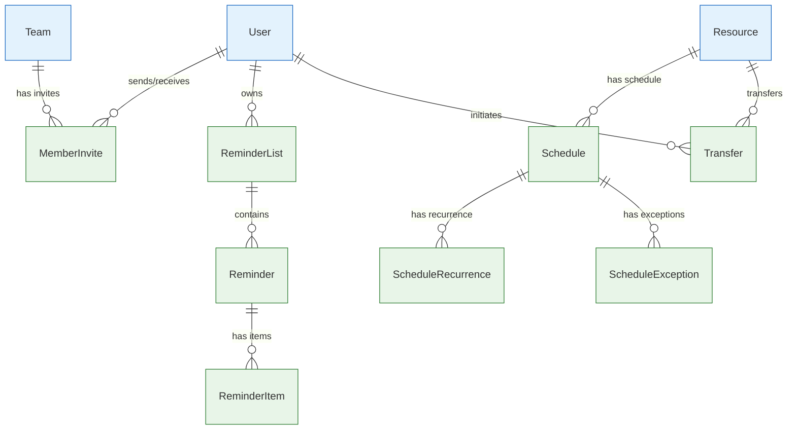

# Organization & Scheduling Entities

Entities that handle team organization, scheduling, reminders, and workflow management.

## 🔗 Entity Relationship Diagram



## 📋 Entity Definitions

### **MemberInvite** - Team Invitations
Invitations for users to join teams.

```typescript
interface MemberInvite {
  id: bigint;                    // Primary key
  createdAt: Date;               // Invitation creation time
  updatedAt: Date;               // Last update timestamp
  teamId: bigint;               // Target team
  userId: bigint;               // Invited user
  invitedById: bigint;          // User who sent invite
  message?: string;             // Custom invitation message
  status: InviteStatus;         // Invitation status
  expiresAt?: Date;            // Invitation expiration
}
```

**Key Features:**
- Team invitation management
- Custom invitation messages
- Expiration handling
- Status tracking

### **ReminderList** - Reminder Collections
Collections of reminders for users.

```typescript
interface ReminderList {
  id: bigint;                    // Primary key
  createdAt: Date;               // Creation timestamp
  updatedAt: Date;               // Last update timestamp
  name: string;                 // List name
  description?: string;         // List description
  isPrivate: boolean;           // Visibility control
  userId: bigint;               // List owner
  focusMode: object;            // Focus mode settings
}
```

**Key Features:**
- Organized reminder management
- Privacy controls
- Focus mode integration
- User ownership

### **Reminder** - Individual Reminders
Individual reminder entries with scheduling and AI embeddings.

```typescript
interface Reminder {
  id: bigint;                    // Primary key
  createdAt: Date;               // Creation timestamp
  updatedAt: Date;               // Last update timestamp
  completedAt?: Date;           // Completion timestamp
  dueDate?: Date;              // Due date/time
  name: string;                 // Reminder name
  description?: string;         // Reminder description
  index: number;               // Order in list
  isComplete: boolean;         // Completion status
  reminderListId: bigint;      // Parent list
  embedding?: number[];        // AI embedding vector (1536 dimensions)
  embeddingExpiredAt?: Date;   // Embedding expiration timestamp
}
```

**Key Features:**
- Scheduled reminders with semantic search
- AI-powered reminder suggestions
- Completion tracking with timestamps
- Ordered lists and due date management

### **ReminderItem** - Reminder Sub-tasks
Sub-items within reminders for detailed task breakdown.

```typescript
interface ReminderItem {
  id: bigint;                    // Primary key
  createdAt: Date;               // Creation timestamp
  updatedAt: Date;               // Last update timestamp
  name: string;                 // Item name
  description?: string;         // Item description
  index: number;               // Order in reminder
  isComplete: boolean;         // Completion status
  reminderId: bigint;          // Parent reminder
}
```

**Key Features:**
- Hierarchical task organization
- Individual completion tracking
- Ordered sub-tasks
- Progress indicators

### **Schedule** - Resource Scheduling
Scheduling information for automated resource execution.

```typescript
interface Schedule {
  id: bigint;                    // Primary key
  createdAt: Date;               // Creation timestamp
  updatedAt: Date;               // Last update timestamp
  name: string;                 // Schedule name
  description?: string;         // Schedule description
  startTime: Date;             // Schedule start time
  endTime?: Date;              // Schedule end time
  timezone: string;            // Timezone identifier
  isActive: boolean;           // Schedule active status
  resourceId: bigint;          // Scheduled resource
}
```

**Key Features:**
- Timezone-aware scheduling
- Start/end time management
- Active/inactive control
- Resource automation

### **ScheduleRecurrence** - Recurring Patterns
Recurrence rules for scheduled executions.

```typescript
interface ScheduleRecurrence {
  id: bigint;                      // Primary key
  createdAt: Date;                 // Creation timestamp
  updatedAt: Date;                 // Last update timestamp
  recurrenceType: ScheduleRecurrenceType; // Recurrence pattern
  dayOfWeek?: number;             // Day of week (0-6)
  dayOfMonth?: number;            // Day of month (1-31)
  month?: number;                 // Month (1-12)
  endDate?: Date;                 // Recurrence end date
  scheduleId: bigint;            // Parent schedule
}
```

**Key Features:**
- Multiple recurrence patterns
- Flexible date constraints
- End date management
- Schedule integration

### **ScheduleException** - Schedule Overrides
Exceptions and overrides for scheduled executions.

```typescript
interface ScheduleException {
  id: bigint;                    // Primary key
  createdAt: Date;               // Creation timestamp
  updatedAt: Date;               // Last update timestamp
  originalStartTime: Date;      // Original scheduled time
  newStartTime?: Date;          // Rescheduled time
  isCancelled: boolean;         // Cancellation flag
  scheduleId: bigint;          // Parent schedule
}
```

**Key Features:**
- Schedule override management
- Cancellation tracking
- Time rescheduling
- Exception handling

### **Transfer** - Resource Transfers
Resource ownership transfers between users.

```typescript
interface Transfer {
  id: bigint;                    // Primary key
  createdAt: Date;               // Transfer creation time
  updatedAt: Date;               // Last update timestamp
  fromUserId: bigint;           // Current owner
  toUserId: bigint;             // New owner
  resourceId: bigint;           // Transferred resource
  status: TransferStatus;       // Transfer status
  message?: string;             // Transfer message
  completedAt?: Date;           // Completion timestamp
}
```

**Key Features:**
- Resource ownership management
- Transfer status tracking
- Message communication
- Completion timestamps

## 🔍 Query Patterns

### **Get Pending Team Invites**
```typescript
const pendingInvites = await prisma.memberInvite.findMany({
  where: {
    userId: userId,
    status: 'Pending',
    expiresAt: { gt: new Date() }
  },
  include: {
    team: {
      select: { name: true, publicId: true }
    },
    invitedBy: {
      select: { name: true, handle: true }
    }
  }
});
```

### **Get User's Active Schedules**
```typescript
const activeSchedules = await prisma.schedule.findMany({
  where: {
    resource: {
      OR: [
        { createdById: userId },
        { team: { members: { some: { userId: userId } } } }
      ]
    },
    isActive: true,
    endTime: { gt: new Date() }
  },
  include: {
    resource: { select: { name: true, publicId: true } },
    recurrences: true,
    exceptions: true
  }
});
```

### **Get Upcoming Reminders**
```typescript
const upcomingReminders = await prisma.reminder.findMany({
  where: {
    reminderList: { userId: userId },
    isComplete: false,
    dueDate: {
      gte: new Date(),
      lte: new Date(Date.now() + 7 * 24 * 60 * 60 * 1000) // Next 7 days
    }
  },
  include: {
    items: true,
    reminderList: { select: { name: true } }
  },
  orderBy: { dueDate: 'asc' }
});
```

---

**Related Documentation:**
- [Core Entities](core.md) - Users, teams, resources
- [Security](security.md) - Authentication, API keys
- [Content Management](content.md) - Comments, issues, pull requests