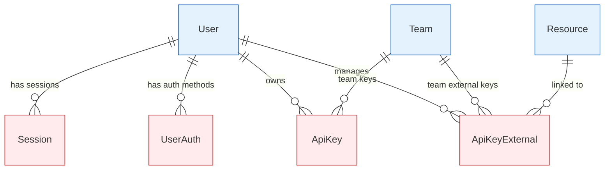

# Security & Authentication Entities

Entities that handle authentication, authorization, API keys, and security-related functionality.

## 🔗 Entity Relationship Diagram



## 📋 Entity Definitions

### **Session** - User Sessions
User authentication sessions for web and mobile clients.

```typescript
interface Session {
  id: bigint;                    // Primary key
  createdAt: Date;               // Session creation time
  updatedAt: Date;               // Last activity time
  isActive: boolean;             // Session active status
  expiresAt: Date;              // Session expiration
  userId: bigint;               // Associated user
  ipAddress: string;            // Client IP address
  userAgent: string;            // Client user agent
  lastActiveAt: Date;           // Last activity timestamp
}
```

**Key Features:**
- Secure session management
- IP and user agent tracking
- Automatic expiration
- Activity monitoring

### **UserAuth** - Authentication Methods
User authentication credentials and OAuth connections.

```typescript
interface UserAuth {
  id: bigint;                    // Primary key
  createdAt: Date;               // Creation timestamp
  updatedAt: Date;               // Last update timestamp
  userId: bigint;               // Associated user
  provider: string;             // Auth provider (local, google, github, etc.)
  providerId?: string;          // Provider user ID
  email?: string;               // Provider email
  accessToken?: string;         // OAuth access token (encrypted)
  refreshToken?: string;        // OAuth refresh token (encrypted)
  tokenExpiresAt?: Date;        // Token expiration
  metadata?: object;            // Provider-specific metadata
}
```

**Key Features:**
- Multi-provider OAuth support
- Secure token storage
- Provider metadata management
- Token refresh automation

### **ApiKey** - Internal API Keys
API keys for accessing Vrooli's internal APIs.

```typescript
interface ApiKey {
  id: bigint;                    // Primary key
  createdAt: Date;               // Creation timestamp
  updatedAt: Date;               // Last update timestamp
  key: string;                   // API key (unique, hashed)
  name: string;                  // Human-readable name
  creditsUsed: bigint;          // Credits consumed
  limitHard: bigint;            // Hard credit limit
  limitSoft?: bigint;           // Soft credit limit
  stopAtLimit: boolean;         // Stop when limit reached
  permissions: object;          // API permissions JSON
  disabledAt?: Date;           // Disabled timestamp
  userId?: bigint;             // Owner user
  teamId?: bigint;             // Owner team
}
```

**Key Features:**
- Credit-based usage tracking
- Granular permission system
- Hard and soft limits
- Team and user ownership

### **ApiKeyExternal** - External Service Keys
API keys for external services and integrations.

```typescript
interface ApiKeyExternal {
  id: bigint;                    // Primary key
  createdAt: Date;               // Creation timestamp
  updatedAt: Date;               // Last update timestamp
  key: string;                   // External API key (encrypted)
  name: string;                  // Key description
  service: string;              // Service name (openai, anthropic, etc.)
  disabledAt?: Date;           // Disabled timestamp
  userId?: bigint;             // Owner user
  teamId?: bigint;             // Owner team
  resourceId?: bigint;         // Linked resource
}
```

**Key Features:**
- Secure external key storage
- Service-specific organization
- Resource linking for automation
- Team and user sharing

### **Award** - User Achievements
Achievement and badge system for user gamification.

```typescript
interface Award {
  id: bigint;                    // Primary key
  createdAt: Date;               // Creation timestamp
  updatedAt: Date;               // Last update timestamp
  userId: bigint;               // Achievement recipient
  category: string;             // Award category
  progress: number;             // Progress towards completion
  tierCompletedAt?: Date;       // Completion timestamp
}
```

**Key Features:**
- Progressive achievement system
- Category-based organization
- Progress tracking
- Completion timestamps

### **View** - Content View Tracking
Track views and engagement metrics for resources.

```typescript
interface View {
  id: bigint;                    // Primary key
  createdAt: Date;               // View timestamp
  resourceId?: bigint;          // Viewed resource
  userId?: bigint;              // Viewer (if authenticated)
  ipAddress: string;            // Viewer IP address
  sessionId?: string;           // Session identifier
  duration?: number;            // View duration (seconds)
  metadata?: object;            // Additional view data
}
```

**Key Features:**
- Anonymous and authenticated tracking
- View duration measurement
- IP-based analytics
- Session correlation

## 🔍 Query Patterns

### **Get Active User Sessions**
```typescript
const activeSessions = await prisma.session.findMany({
  where: {
    userId: userId,
    isActive: true,
    expiresAt: { gt: new Date() }
  },
  orderBy: { lastActiveAt: 'desc' }
});
```

### **Check API Key Permissions**
```typescript
const hasPermission = await prisma.apiKey.findFirst({
  where: {
    key: apiKeyHash,
    disabledAt: null,
    permissions: {
      path: ['actions', action],
      equals: true
    }
  }
});
```

### **Track Resource Views**
```typescript
await prisma.view.create({
  data: {
    resourceId: resourceId,
    userId: userId,
    ipAddress: req.ip,
    sessionId: req.sessionID,
    createdAt: new Date()
  }
});
```

---

**Related Documentation:**
- [Core Entities](core.md) - Users, teams, resources
- [Communication](communication.md) - Chats, messages, notifications
- [Commerce & Billing](commerce.md) - Payments, plans, credits