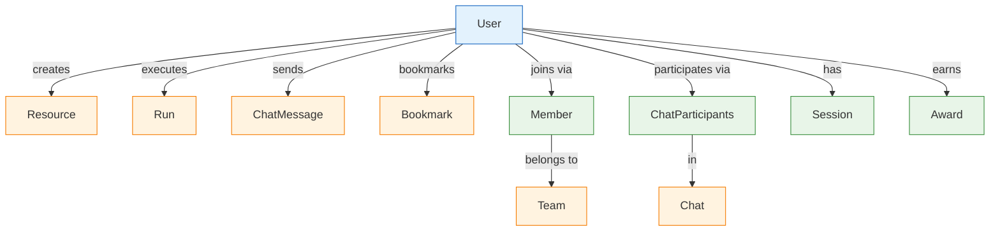
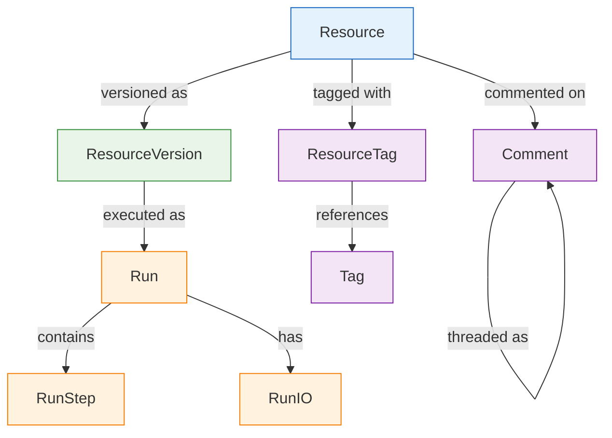
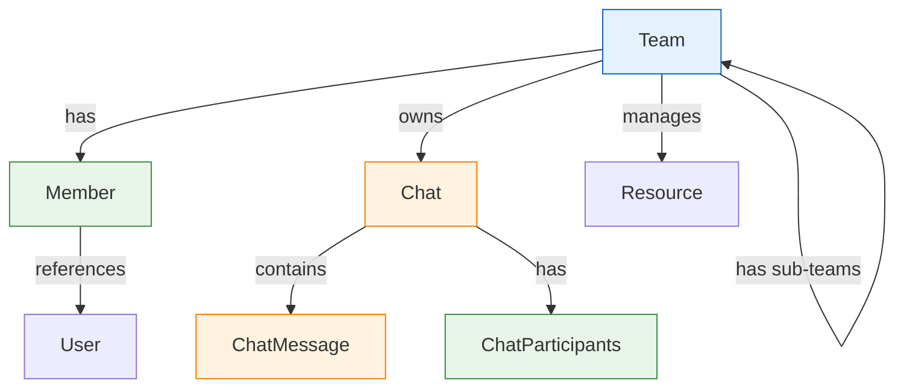

# Entity Relationships

Detailed documentation of relationships between entities in Vrooli's data model, including foreign key constraints, relationship patterns, and referential integrity rules.

## 🔗 Core Relationship Patterns

### **User-Centric Relationships**



### **Content Hierarchy**



### **Team Structure**



## 📋 Relationship Details

### **One-to-Many Relationships**

#### **User → Resource (Creator)**
```sql
-- Foreign key constraint
ALTER TABLE resource 
ADD CONSTRAINT fk_resource_created_by 
FOREIGN KEY (createdById) REFERENCES user(id) ON DELETE SET NULL;
```

**Business Rules:**
- Users can create multiple resources
- Resources can exist without a creator (if user is deleted)
- Soft delete preserves creator relationships

#### **Resource → ResourceVersion (Versioning)**
```sql
-- Foreign key constraint
ALTER TABLE resource_version 
ADD CONSTRAINT fk_resource_version_root 
FOREIGN KEY (rootId) REFERENCES resource(id) ON DELETE CASCADE;
```

**Business Rules:**
- Each resource has one or more versions
- Versions are deleted when parent resource is deleted
- Latest version tracking via `isLatest` flag

#### **ResourceVersion → Run (Execution)**
```sql
-- Foreign key constraint
ALTER TABLE run 
ADD CONSTRAINT fk_run_resource_version 
FOREIGN KEY (resourceVersionId) REFERENCES resource_version(id) ON DELETE SET NULL;
```

**Business Rules:**
- Runs can reference specific resource versions
- Runs preserve execution history even if version is deleted
- Multiple runs can execute the same version

### **Many-to-Many Relationships**

#### **User ↔ Team (via Member)**
```sql
-- Junction table with additional attributes
CREATE TABLE member (
    id BIGINT PRIMARY KEY,
    userId BIGINT NOT NULL REFERENCES user(id) ON DELETE CASCADE,
    teamId BIGINT NOT NULL REFERENCES team(id) ON DELETE CASCADE,
    isAdmin BOOLEAN DEFAULT FALSE,
    permissions JSON DEFAULT '{}',
    createdAt TIMESTAMPTZ DEFAULT NOW(),
    updatedAt TIMESTAMPTZ DEFAULT NOW(),
    
    UNIQUE(userId, teamId)
);
```

**Business Rules:**
- Users can be members of multiple teams
- Teams can have multiple members
- Membership includes role information (admin status, permissions)
- Unique constraint prevents duplicate memberships

#### **User ↔ Chat (via ChatParticipants)**
```sql
-- Junction table with participation metadata
CREATE TABLE chat_participants (
    id BIGINT PRIMARY KEY,
    userId BIGINT NOT NULL REFERENCES user(id) ON DELETE CASCADE,
    chatId BIGINT NOT NULL REFERENCES chat(id) ON DELETE CASCADE,
    hasUnread BOOLEAN DEFAULT TRUE,
    createdAt TIMESTAMPTZ DEFAULT NOW(),
    updatedAt TIMESTAMPTZ DEFAULT NOW(),
    
    UNIQUE(userId, chatId)
);
```

**Business Rules:**
- Users can participate in multiple chats
- Chats can have multiple participants
- Tracks unread status per participant
- Participation history preserved

#### **Resource ↔ Tag (via ResourceTag)**
```sql
-- Junction table for resource tagging
CREATE TABLE resource_tag (
    id BIGINT PRIMARY KEY,
    resourceId BIGINT NOT NULL REFERENCES resource(id) ON DELETE CASCADE,
    tagId BIGINT NOT NULL REFERENCES tag(id) ON DELETE CASCADE,
    createdAt TIMESTAMPTZ DEFAULT NOW(),
    updatedAt TIMESTAMPTZ DEFAULT NOW(),
    
    UNIQUE(resourceId, tagId)
);
```

**Business Rules:**
- Resources can have multiple tags
- Tags can be applied to multiple resources
- Tag relationships deleted with resource
- No duplicate tag applications per resource

### **Self-Referencing Relationships**

#### **Team → Team (Hierarchical Structure)**
```sql
-- Self-referencing foreign key for team hierarchy
ALTER TABLE team 
ADD CONSTRAINT fk_team_parent 
FOREIGN KEY (parentId) REFERENCES team(id) ON DELETE SET NULL;
```

**Business Rules:**
- Teams can have parent teams (organizational hierarchy)
- Parent teams can be deleted without affecting child teams
- Circular references prevented by application logic

#### **ChatMessage → ChatMessage (Threading)**
```sql
-- Self-referencing for message threads
ALTER TABLE chat_message 
ADD CONSTRAINT fk_chat_message_parent 
FOREIGN KEY (parentId) REFERENCES chat_message(id) ON DELETE SET NULL;
```

**Business Rules:**
- Messages can reply to other messages
- Thread depth limited by application logic
- Parent message deletion doesn't cascade to replies

#### **Comment → Comment (Nested Comments)**
```sql
-- Self-referencing for comment threads
ALTER TABLE comment 
ADD CONSTRAINT fk_comment_parent 
FOREIGN KEY (parentId) REFERENCES comment(id) ON DELETE SET NULL;
```

**Business Rules:**
- Comments can have nested replies
- Comment deletion preserves reply chain
- Thread depth configurable per resource type

## 🔒 Referential Integrity Rules

### **Cascade Deletion Patterns**

#### **Strong Ownership (CASCADE)**
```sql
-- Child entities deleted when parent is deleted
FOREIGN KEY (userId) REFERENCES user(id) ON DELETE CASCADE
FOREIGN KEY (teamId) REFERENCES team(id) ON DELETE CASCADE
FOREIGN KEY (chatId) REFERENCES chat(id) ON DELETE CASCADE
```

**Applied to:**
- `member.userId` → `user.id`
- `chat_participants.chatId` → `chat.id`
- `resource_version.rootId` → `resource.id`
- `run_step.runId` → `run.id`

#### **Weak References (SET NULL)**
```sql
-- Reference preserved but set to null when parent deleted
FOREIGN KEY (createdById) REFERENCES user(id) ON DELETE SET NULL
FOREIGN KEY (parentId) REFERENCES entity(id) ON DELETE SET NULL
```

**Applied to:**
- `resource.createdById` → `user.id`
- `run.resourceVersionId` → `resource_version.id`
- `chat_message.parentId` → `chat_message.id`
- `team.parentId` → `team.id`

#### **Protected References (RESTRICT)**
```sql
-- Prevent deletion if referenced
FOREIGN KEY (rootId) REFERENCES resource(id) ON DELETE RESTRICT
```

**Applied to:**
- Critical system data
- Active execution references
- Financial records

### **Constraint Validation**

#### **Unique Constraints**
```sql
-- Prevent duplicate relationships
CONSTRAINT unique_member_user_team UNIQUE (userId, teamId)
CONSTRAINT unique_participant_user_chat UNIQUE (userId, chatId)
CONSTRAINT unique_resource_tag UNIQUE (resourceId, tagId)
CONSTRAINT unique_bookmark_user_resource UNIQUE (userId, resourceId)
```

#### **Check Constraints**
```sql
-- Business rule enforcement
CONSTRAINT check_version_index CHECK (versionIndex >= 0)
CONSTRAINT check_score_range CHECK (score >= 0)
CONSTRAINT check_time_elapsed CHECK (timeElapsed >= 0)
CONSTRAINT check_step_order CHECK (step > 0)
```

## 🔄 Relationship Patterns

### **Versioning Pattern**

```typescript
// Resource versioning relationship
interface ResourceVersionRelationship {
  // One resource has many versions
  resource: {
    id: bigint;
    versions: ResourceVersion[];
    latestVersion?: ResourceVersion;
  };
  
  // Each version belongs to one resource
  version: {
    id: bigint;
    rootId: bigint;
    root: Resource;
  };
}

// Query pattern for latest version
const resourceWithLatest = await prisma.resource.findUnique({
  where: { id: resourceId },
  include: {
    versions: {
      where: { isLatest: true },
      take: 1
    }
  }
});
```

### **Execution Pattern**

```typescript
// Run execution relationship
interface RunExecutionRelationship {
  // Run references specific version
  run: {
    id: bigint;
    resourceVersionId: bigint;
    resourceVersion?: ResourceVersion;
    steps: RunStep[];
    inputs: RunIO[];
    outputs: RunIO[];
  };
  
  // Version can have multiple runs
  version: {
    id: bigint;
    runs: Run[];
  };
}

// Query pattern for run with details
const runWithDetails = await prisma.run.findUnique({
  where: { id: runId },
  include: {
    resourceVersion: {
      include: {
        root: true
      }
    },
    steps: {
      orderBy: { step: 'asc' }
    },
    inputs: true,
    outputs: true
  }
});
```

### **Membership Pattern**

```typescript
// User-Team membership relationship
interface MembershipRelationship {
  // User belongs to multiple teams
  user: {
    id: bigint;
    memberships: Member[];
    teams: Team[]; // via memberships
  };
  
  // Team has multiple members
  team: {
    id: bigint;
    members: Member[];
    users: User[]; // via members
  };
  
  // Membership junction with metadata
  member: {
    userId: bigint;
    teamId: bigint;
    isAdmin: boolean;
    permissions: MemberPermissions;
  };
}

// Query pattern for user teams with roles
const userWithTeams = await prisma.user.findUnique({
  where: { id: userId },
  include: {
    memberships: {
      include: {
        team: true
      }
    }
  }
});
```

### **Communication Pattern**

```typescript
// Chat communication relationship
interface ChatRelationship {
  // Chat has participants and messages
  chat: {
    id: bigint;
    participants: ChatParticipants[];
    messages: ChatMessage[];
    creator?: User;
    team?: Team;
  };
  
  // User participates in chats
  user: {
    id: bigint;
    chatParticipations: ChatParticipants[];
    chats: Chat[]; // via participations
    messages: ChatMessage[];
  };
  
  // Message threading
  message: {
    id: bigint;
    parentId?: bigint;
    parent?: ChatMessage;
    children: ChatMessage[];
  };
}

// Query pattern for chat with recent messages
const chatWithMessages = await prisma.chat.findUnique({
  where: { id: chatId },
  include: {
    messages: {
      take: 50,
      orderBy: { createdAt: 'desc' },
      include: {
        user: true,
        children: {
          take: 5,
          orderBy: { createdAt: 'asc' }
        }
      }
    },
    participants: {
      include: {
        user: true
      }
    }
  }
});
```

## 📊 Relationship Statistics

### **Cardinality Estimates**

| Relationship | Type | Typical Ratio | Max Ratio |
|-------------|------|---------------|-----------|
| User → Resource | 1:N | 1:50 | 1:1000 |
| Resource → ResourceVersion | 1:N | 1:10 | 1:100 |
| ResourceVersion → Run | 1:N | 1:20 | 1:10000 |
| Run → RunStep | 1:N | 1:15 | 1:500 |
| User ↔ Team | M:N | 1:5 | 1:100 |
| User ↔ Chat | M:N | 1:20 | 1:1000 |
| Chat → ChatMessage | 1:N | 1:100 | 1:100000 |

### **Performance Considerations**

#### **Indexed Relationships**
```sql
-- Critical indexes for relationship queries
CREATE INDEX idx_resource_created_by ON resource(createdById);
CREATE INDEX idx_resource_version_root ON resource_version(rootId);
CREATE INDEX idx_run_resource_version ON run(resourceVersionId);
CREATE INDEX idx_member_user_team ON member(userId, teamId);
CREATE INDEX idx_chat_participants_user ON chat_participants(userId);
CREATE INDEX idx_chat_message_chat ON chat_message(chatId);
```

#### **Query Optimization**
```typescript
// Efficient relationship loading with select optimization
const resourcesWithLatest = await prisma.resource.findMany({
  select: {
    id: true,
    name: true,
    createdAt: true,
    versions: {
      where: { isLatest: true },
      select: {
        id: true,
        versionLabel: true,
        isComplete: true
      },
      take: 1
    }
  },
  where: {
    isPrivate: false,
    hasCompleteVersion: true
  }
});
```

## 🔧 Maintenance Operations

### **Constraint Validation**
```sql
-- Check referential integrity
SELECT 
  schemaname,
  tablename,
  attname,
  n_distinct,
  correlation
FROM pg_stats 
WHERE schemaname = 'public' 
  AND tablename IN ('user', 'team', 'resource', 'run')
  AND attname LIKE '%Id';
```

### **Orphaned Record Detection**
```sql
-- Find orphaned records
SELECT COUNT(*) as orphaned_resources
FROM resource r
LEFT JOIN user u ON r.createdById = u.id
WHERE r.createdById IS NOT NULL 
  AND u.id IS NULL;

-- Find unused tags
SELECT t.id, t.tag
FROM tag t
LEFT JOIN resource_tag rt ON t.id = rt.tagId
WHERE rt.tagId IS NULL;
```

### **Relationship Health Monitoring**
```typescript
// Monitor relationship health
export async function checkRelationshipHealth() {
  const checks = await Promise.all([
    // Check for orphaned resources
    prisma.resource.count({
      where: {
        createdById: { not: null },
        creator: null
      }
    }),
    
    // Check for incomplete versions
    prisma.resource.count({
      where: {
        hasCompleteVersion: true,
        versions: {
          none: {
            isComplete: true
          }
        }
      }
    }),
    
    // Check for runs without steps
    prisma.run.count({
      where: {
        status: 'Completed',
        steps: {
          none: {}
        }
      }
    })
  ]);
  
  return {
    orphanedResources: checks[0],
    inconsistentVersions: checks[1],
    runsWithoutSteps: checks[2],
    timestamp: new Date()
  };
}
```

---

**Related Documentation:**
- [Entity Model](entities.md) - Entity definitions and fields
- [Data Dictionary](data-dictionary.md) - Field specifications and constraints
- [Performance Guide](performance.md) - Query optimization strategies