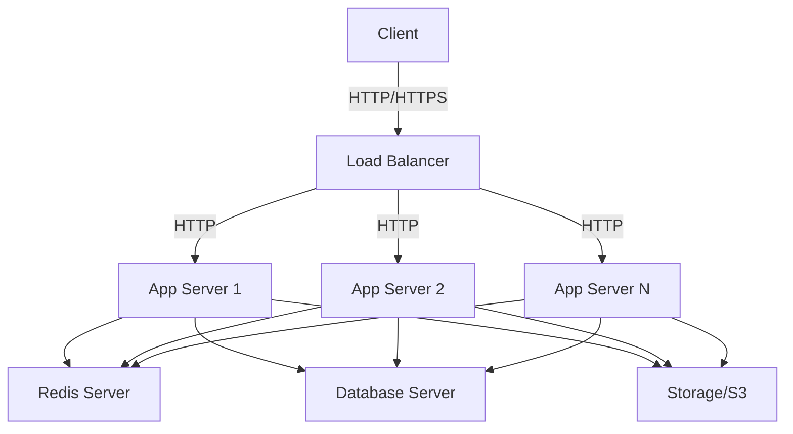

# Multiple Servers Deployment

For production environments with higher traffic or for better scalability and fault tolerance, deploying Vrooli across multiple servers is recommended. This approach provides better performance, improved reliability, and easier maintenance compared to a single server deployment.

## Architecture Overview

A typical multi-server Vrooli deployment consists of:

1. **Load Balancer**: Distributes traffic across multiple application servers
2. **Application Servers**: Runs the UI and server components
3. **Database Server**: Dedicated PostgreSQL database server
4. **Redis Server**: For caching and message queuing
5. **Storage Server**: For persistent file storage (optional, can use S3 or similar)




## Prerequisites

Before starting a multi-server deployment, ensure you have:

- Multiple VPS instances or cloud servers with Ubuntu 20.04+
- A domain name with DNS properly configured
- SSL certificates for secure communication
- Basic understanding of networking and infrastructure

## Server Setup

### Load Balancer Setup

1. Provision a server with at least 2 CPU cores and 2GB RAM
2. Install NGINX for load balancing:
   ```bash
   sudo apt update
   sudo apt install -y nginx
   ```
3. Create an NGINX load balancer configuration:
   ```bash
   sudo nano /etc/nginx/sites-available/vrooli
   ```
4. Add this configuration:
   ```nginx
   upstream vrooli_ui {
     server app1_ip:3000;
     server app2_ip:3000;
     # Add more servers as needed
   }
   
   upstream vrooli_api {
     server app1_ip:5329;
     server app2_ip:5329;
     # Add more servers as needed
   }
   
   server {
     listen 80;
     server_name your_domain.com;
     return 301 https://$host$request_uri;
   }
   
   server {
     listen 443 ssl;
     server_name your_domain.com;
     
     ssl_certificate /etc/letsencrypt/live/your_domain.com/fullchain.pem;
     ssl_certificate_key /etc/letsencrypt/live/your_domain.com/privkey.pem;
     
     location / {
       proxy_pass http://vrooli_ui;
       proxy_set_header Host $host;
       proxy_set_header X-Real-IP $remote_addr;
       proxy_set_header X-Forwarded-For $proxy_add_x_forwarded_for;
       proxy_set_header X-Forwarded-Proto $scheme;
     }
     
     location /api {
       proxy_pass http://vrooli_api;
       proxy_set_header Host $host;
       proxy_set_header X-Real-IP $remote_addr;
       proxy_set_header X-Forwarded-For $proxy_add_x_forwarded_for;
       proxy_set_header X-Forwarded-Proto $scheme;
     }
   }
   ```
5. Enable the configuration:
   ```bash
   sudo ln -s /etc/nginx/sites-available/vrooli /etc/nginx/sites-enabled/
   sudo nginx -t
   sudo systemctl restart nginx
   ```
6. Set up SSL with Let's Encrypt:
   ```bash
   sudo apt install -y certbot python3-certbot-nginx
   sudo certbot --nginx -d your_domain.com
   ```

### Database Server Setup

1. Provision a server with at least 4 CPU cores and 8GB RAM
2. Install PostgreSQL with pgvector:
   ```bash
   sudo apt update
   sudo apt install -y postgresql postgresql-contrib
   
   # For pgvector, you may need to build from source or use a Docker image
   # This is a simplified example
   git clone https://github.com/pgvector/pgvector.git
   cd pgvector
   make
   make install
   ```
3. Configure PostgreSQL for remote access:
   ```bash
   sudo nano /etc/postgresql/13/main/postgresql.conf
   ```
   Update these lines:
   ```
   listen_addresses = '*'
   ```
4. Configure client authentication:
   ```bash
   sudo nano /etc/postgresql/13/main/pg_hba.conf
   ```
   Add this line (restrict to your app server IPs for security):
   ```
   host    all    all    app_server_ip/32    md5
   ```
5. Create the database and user:
   ```bash
   sudo -u postgres psql
   ```
   ```sql
   CREATE USER vrooli WITH PASSWORD 'secure_password';
   CREATE DATABASE vrooli OWNER vrooli;
   \q
   ```
6. Restart PostgreSQL:
   ```bash
   sudo systemctl restart postgresql
   ```

### Redis Server Setup

1. Provision a server with at least 2 CPU cores and 4GB RAM
2. Install Redis:
   ```bash
   sudo apt update
   sudo apt install -y redis-server
   ```
3. Configure Redis for remote access:
   ```bash
   sudo nano /etc/redis/redis.conf
   ```
   Update these settings:
   ```
   bind 0.0.0.0
   requirepass secure_redis_password
   ```
4. Restart Redis:
   ```bash
   sudo systemctl restart redis
   ```

### Application Servers Setup

For each application server:

1. Provision a server with at least 4 CPU cores and 8GB RAM
2. Install Docker and Docker Compose:
   ```bash
   # Install Docker
   curl -fsSL https://get.docker.com -o get-docker.sh
   sudo sh get-docker.sh
   
   # Install Docker Compose
   sudo curl -L "https://github.com/docker/compose/releases/download/v2.22.0/docker-compose-$(uname -s)-$(uname -m)" -o /usr/local/bin/docker-compose
   sudo chmod +x /usr/local/bin/docker-compose
   ```
3. Clone the repository:
   ```bash
   cd ~
   git clone https://github.com/Vrooli/Vrooli.git
   cd Vrooli
   ```
4. Set up environment variables:
   ```bash
   cp .env-example .env-prod
   nano .env-prod
   ```
   
   Update the following variables:
   ```
   DB_URL=postgresql://vrooli:secure_password@db_server_ip:5432/vrooli
   REDIS_URL=redis://:secure_redis_password@redis_server_ip:6379
   ```

## Deployment Process

### 1. Deploy the First Application Server

1. Prepare the deployment:
   ```bash
   cd ~/Vrooli
   chmod +x ./scripts/*
   ```
2. Modify the docker-compose file to avoid conflicts:
   ```bash
   nano docker-compose-prod.yml
   ```
   
   Ensure each container has a unique name by removing or modifying container_name directives.
   
3. Run the deployment script:
   ```bash
   ./scripts/deploy.sh
   ```

### 2. Test the First Server

1. Verify the containers are running:
   ```bash
   docker ps
   ```
2. Check the logs for errors:
   ```bash
   docker-compose --env-file .env-prod logs
   ```
3. Test direct access to the server:
   ```bash
   curl http://localhost:5329/healthcheck
   ```

### 3. Deploy Additional Servers

Repeat the application server setup and deployment steps for each additional server.

### 4. Configure the Load Balancer

Update the load balancer configuration with the IPs of all your application servers.

### 5. Testing the Entire Setup

1. Test the load balancer by accessing your domain:
   ```
   https://your_domain.com
   ```
2. Verify API access:
   ```
   https://your_domain.com/api/healthcheck
   ```
3. Check high availability by stopping one app server:
   ```bash
   # On one app server
   docker-compose --env-file .env-prod down
   ```
   Verify the service remains available through the load balancer.

## Maintenance

### Backups

Set up regular database backups:

```bash
# On the database server
sudo -u postgres pg_dump vrooli > /var/backups/vrooli_db_$(date +%Y%m%d).sql

# Optionally, set up a cron job
sudo crontab -e
# Add this line for daily backups at 2 AM
0 2 * * * su postgres -c "pg_dump vrooli > /var/backups/vrooli_db_$(date +%Y%m%d).sql"
```

### Monitoring

Set up monitoring for each server:

1. Install a monitoring solution like Prometheus and Grafana:
   ```bash
   sudo apt install -y prometheus grafana
   ```
2. Configure node exporters on each server to collect metrics
3. Set up alerting for critical events

### Updates

When updating the application:

1. Use a rolling update strategy to avoid downtime:
   ```bash
   # Update each app server one at a time
   cd ~/Vrooli
   git pull
   docker-compose --env-file .env-prod down
   ./scripts/deploy.sh
   ```
2. Verify each server before moving to the next

## Scaling Considerations

### Horizontal Scaling

To add more capacity:

1. Add more application servers using the same setup process
2. Update the load balancer configuration to include new servers
3. No changes needed for existing servers

### Vertical Scaling

For better performance on existing servers:

1. Increase resources (CPU, RAM) on your cloud provider dashboard
2. For database improvements, consider:
   - Increasing `shared_buffers` in PostgreSQL
   - Adding read replicas for read-heavy workloads

## Advanced Topics

### Setting up a CDN

For better global performance, consider adding a CDN like Cloudflare:

1. Sign up for a Cloudflare account
2. Add your domain and follow setup instructions
3. Set caching rules for static assets

### Database Replication

For improved database reliability:

1. Set up PostgreSQL streaming replication:
   ```bash
   # On primary database
   # Configure postgresql.conf for replication
   
   # On replica
   # Set up pg_basebackup to create a standby
   ```
2. Configure your application to use the replica for reads

### Container Orchestration

For larger deployments, consider Kubernetes:

1. Set up a Kubernetes cluster
2. Convert Docker Compose files to Kubernetes manifests
3. Deploy using Kubernetes deployment resources

## Troubleshooting

### Load Balancer Issues

If the load balancer is not routing traffic correctly:

1. Check NGINX configuration
2. Verify app servers are accessible directly
3. Check firewall rules:
   ```bash
   sudo ufw status
   ```

### Database Connection Problems

If application servers can't connect to the database:

1. Verify the database server is running
2. Check network connectivity:
   ```bash
   ping db_server_ip
   telnet db_server_ip 5432
   ```
3. Verify PostgreSQL configuration in pg_hba.conf

### Redis Connectivity

If Redis connection fails:

1. Test direct connection:
   ```bash
   redis-cli -h redis_server_ip -a secure_redis_password ping
   ```
2. Check Redis configuration and firewall rules 