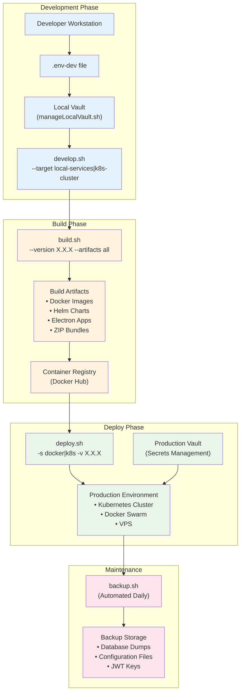
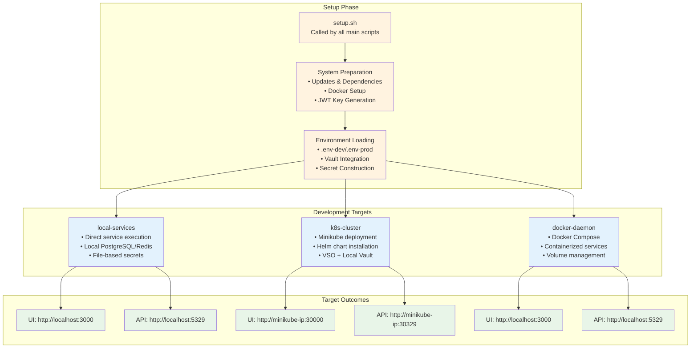
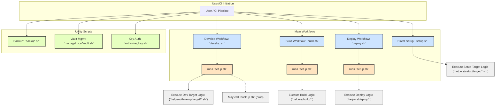
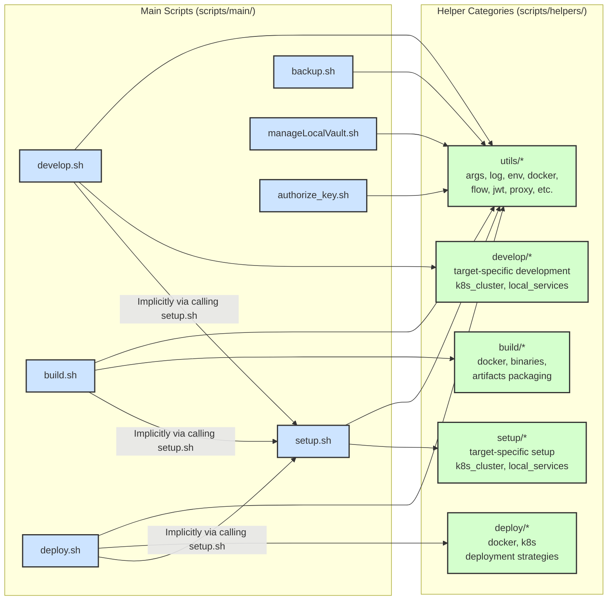
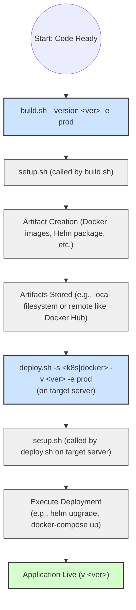

# DevOps

This directory contains scripts for automating various development, build, deployment, and maintenance tasks for the Vrooli project.

## Directory Structure

```
scripts/
├── main/                   # Main executable scripts
│   ├── setup.sh            # Prepares the project environment
│   ├── develop.sh          # Starts the development environment
│   ├── build.sh            # Builds project artifacts
│   ├── deploy.sh           # Deploys project artifacts
│   ├── backup.sh           # Manages backups
│   ├── manageLocalVault.sh # Manages a local Vault instance for development
│   └── authorize_key.sh    # Adds an SSH public key to authorized_keys
│
├── helpers/                # Helper functions and modules used by main scripts
│   ├── utils/              # Common utility functions (logging, args, env, etc.)
│   ├── setup/              # Helpers specific to the setup process
│   ├── develop/            # Helpers specific to the development process
│   ├── build/              # Helpers specific to the build process
│   ├── deploy/             # Helpers specific to the deployment process
│   └── ...                 # Potentially other specialized helper categories
│
└── README.md               # This file
```

## Key Documentation

### Core Infrastructure
- [Development Environment](./development-environment.md) - Comprehensive local development setup guide
- [Environment Management](./environment-management.md) - Multi-environment support and Vault integration
- [Testing Infrastructure](./testing-infrastructure.md) - BATS testing framework and quality assurance
- [Build System](./build-system.md) - Multi-platform builds and artifact management

### Deployment & Infrastructure
- [Server Deployment](./server-deployment.md) - VPS setup, security hardening, and production deployment
- [Kubernetes Deployment](./kubernetes.md) - Container orchestration and Helm charts
- [CI/CD Pipeline](./ci-cd.md) - Comprehensive GitHub Actions workflows and deployment automation

### Operations & Support
- [Logging](./logging.md) - Understanding and managing application and system logs
- [Troubleshooting](./troubleshooting.md) - Comprehensive troubleshooting guide for all components

Whether you're setting up a local development environment, deploying to a production server, or implementing a CI/CD pipeline, you'll find the necessary information here.

## Main Scripts (`scripts/main/`)

Detailed descriptions of the primary scripts:

*   **`setup.sh`**:
    *   **Purpose**: Initializes and configures the project environment. This is often the first script run and is called by other main scripts like `develop.sh`, `build.sh`, and `deploy.sh`.
    *   **Key Functions**: System preparation (updates, dependencies), tool installation (Docker, BATS, ShellCheck), environment variable loading, JWT generation, Docker setup, target-specific setup (e.g., for Docker, K8s, local machine), Vault integration, Stripe CLI setup. Can also trigger backups in production.
    *   **Usage**: `bash scripts/main/setup.sh [options]`
    *   **Important Targets**: 
        - `local-services` - Local development with services running directly
        - `k8s-cluster` - Kubernetes cluster development (Minikube)
        - `docker-daemon` - Docker-based development

*   **`develop.sh`**:
    *   **Purpose**: Starts the local development environment for a specified target (e.g., local services, Kubernetes cluster).
    *   **Key Functions**: Parses arguments, runs `setup.sh` to prepare the environment, sets up reverse proxies (if remote), and then executes target-specific development scripts.
    *   **Usage**: `bash scripts/main/develop.sh --target <target_name> [options]`
    *   **Common Examples**:
        - `bash scripts/main/develop.sh --target local-services` - Start local development
        - `bash scripts/main/develop.sh --target k8s-cluster` - Start K8s development

*   **`build.sh`**:
    *   **Purpose**: Builds various project artifacts, including Docker images, Kubernetes Helm charts, ZIP bundles, and platform-specific binaries.
    *   **Key Functions**: Parses arguments (version, bundles, artifacts, binaries), runs `setup.sh`, cleans previous builds, runs tests/linting (optional), updates project version, builds Electron scripts, packages artifacts (Docker images, Helm charts, Helm values files), and optionally copies bundles to a remote server.
    *   **Usage**: `bash scripts/main/build.sh [options]`
    *   **Key Options**:
        - `--version <ver>` - Specify version (mandatory for production)
        - `--bundles <all|zip|cli>` - Bundle types to generate
        - `--artifacts <all|docker|k8s>` - Container artifacts to include
        - `--binaries <all|windows|mac|linux|android|ios>` - Platform binaries
        - `--dest <local|remote>` - Where to save bundles

*   **`deploy.sh`**:
    *   **Purpose**: Deploys built artifacts to a target environment. This script is typically run on the server where the deployment occurs (e.g., production server).
    *   **Key Functions**: Parses arguments (source type, version), runs `setup.sh`, loads build artifacts from bundles, and executes deployment logic based on the source type (e.g., Docker deployment, Kubernetes Helm upgrade).
    *   **Usage**: `bash scripts/main/deploy.sh --source <docker|k8s> --version <version> [options]`
    *   **Examples**:
        - `bash scripts/main/deploy.sh -s docker -v 1.0.0 -e prod`
        - `bash scripts/main/deploy.sh -s k8s -v 1.0.0 -e staging`

*   **`backup.sh`**:
    *   **Purpose**: Performs backups of critical data (e.g., database, specific directories) from a remote server to a local backup directory. Can also schedule daily backups via cron.
    *   **Key Functions**: Connects to remote server via SSH, fetches project version, creates a versioned backup archive, and prunes old backups.
    *   **Usage**: `bash scripts/main/backup.sh` (schedules and runs initial), `bash scripts/main/backup.sh run_backup` (runs on-demand for cron)
    *   **What it backs up**: PostgreSQL data, JWT files, environment files

*   **`manageLocalVault.sh`**:
    *   **Purpose**: Manages a local HashiCorp Vault instance specifically for development purposes. **Not for production use.**
    *   **Key Functions**: Starts/stops a dev Vault server, checks status, sets up AppRole authentication, and seeds secrets from `.env-dev` into Vault for local development testing.
    *   **Usage**: `bash scripts/main/manageLocalVault.sh [--start-dev|--stop|--status]`
    *   **Features**: AppRole setup, secret seeding from .env-dev, policy management

*   **`authorize_key.sh`**:
    *   **Purpose**: A utility script to append an SSH public key to the `~/.ssh/authorized_keys` file on a server.
    *   **Key Functions**: Ensures `.ssh` directory exists with correct permissions, appends key from stdin, and sets `authorized_keys` permissions.
    *   **Usage**: `bash scripts/main/authorize_key.sh` (then paste key and Ctrl-D)

## Helper Script Categories (`scripts/helpers/`)

These directories contain bash functions and modules that are sourced by the main scripts to provide shared functionality and keep the main scripts organized.

*   **`utils/`**: Contains common utilities for argument parsing, logging, environment variable management, Docker interactions, system checks, version handling, flow control, JWT operations, proxy management, and more.
    *   Key modules: `args.sh`, `log.sh`, `env.sh`, `docker.sh`, `flow.sh`, `jwt.sh`, `proxy.sh`, `var.sh`, `version.sh`
*   **`setup/`**: Contains helpers specifically for the `setup.sh` script, often including target-specific setup logic (e.g., `setup/target/docker_daemon.sh`, `setup/target/k8s_cluster.sh`, `setup/target/local_services.sh`).
*   **`develop/`**: Contains helpers for `develop.sh`, including logic for different development targets (e.g., `develop/target/local_services.sh`, `develop/target/k8s_cluster.sh`).
*   **`build/`**: Contains helpers for `build.sh`, such as functions for packaging different types of artifacts (e.g., `build/binaries/`, `build/docker.sh`).
*   **`deploy/`**: Contains helpers for `deploy.sh`, including deployment strategies for different platforms (e.g., `deploy/docker.sh`, `deploy/k8s.sh`).

## Key Features & Integrations

### Environment Management
- **Multiple Environments**: `development`, `staging`, `production`
- **Location Awareness**: `local` vs `remote` execution
- **Secrets Management**: File-based or Vault-based secret loading
- **Environment Files**: `.env-dev`, `.env-prod`

### Vault Integration
- **Local Development**: Automated Vault setup with AppRole authentication
- **Secret Seeding**: Automatic population of Vault from `.env-dev` files
- **Policy Management**: Automated creation of Vault policies for different access levels
- **VSO Support**: Integration with Vault Secrets Operator for Kubernetes

### Target System Support
- **Local Services**: Direct service execution on local machine
- **Docker Daemon**: Containerized development environment
- **Kubernetes Cluster**: Full K8s development with Minikube/local cluster
- **Remote Deployment**: Production deployment to remote servers

### Build System
- **Multi-Platform**: Support for Windows, macOS, Linux, Android, iOS
- **Multiple Artifacts**: Docker images, Helm charts, ZIP bundles, CLI tools
- **Electron Apps**: Desktop application building with platform-specific packaging
- **Version Management**: Automated version tracking and updating

## Scripting Workflow Visualizations

### 1. Complete Development to Production Flow



### 2. Target-Specific Development Workflows



### 3. Main Script Execution Flow

This diagram shows how the primary scripts are typically invoked and how `setup.sh` acts as a common preparatory step.



### 4. Main Scripts and Helper Category Usage

This diagram illustrates which categories of helper scripts are primarily used by each main script.



### 5. Core Workflow: Setup -> Build -> Deploy

This diagram highlights the typical lifecycle for a production release.



## Common Usage Examples

### Development Workflows
```bash
# Start local development with direct services
bash scripts/main/develop.sh --target local-services

# Start Kubernetes development
bash scripts/main/develop.sh --target k8s-cluster

# Start with Docker containers
bash scripts/main/develop.sh --target docker-daemon
```

### Build Workflows
```bash
# Build for development
bash scripts/main/build.sh --bundles zip --artifacts docker

# Build for production with specific version
bash scripts/main/build.sh --version 1.2.0 --environment production --artifacts all --bundles all

# Build desktop apps for multiple platforms
bash scripts/main/build.sh --binaries windows,mac,linux
```

### Deployment Workflows
```bash
# Deploy Docker containers to production
bash scripts/main/deploy.sh --source docker --version 1.2.0 --environment production

# Deploy to Kubernetes
bash scripts/main/deploy.sh --source k8s --version 1.2.0 --environment staging
```

### Vault Management (Development)
```bash
# Start local Vault for development
bash scripts/main/manageLocalVault.sh --start-dev

# Check Vault status
bash scripts/main/manageLocalVault.sh --status

# Stop local Vault
bash scripts/main/manageLocalVault.sh --stop
```

This documentation should provide a comprehensive overview of your scripting system and help both current and future team members understand the powerful automation infrastructure you've built! 