# DevOps

This directory contains scripts for automating various development, build, deployment, and maintenance tasks for the Vrooli project.

## System Architecture

Vrooli now uses a unified CLI tool (`vrooli`) that replaces the previous complex script system. The architecture centers around:

```
cli/                        # Vrooli CLI implementation
├── vrooli                  # Main CLI executable
└── commands/               # CLI command implementations

scripts/                    # Backend automation scripts
├── manage.sh               # Core system management
├── lib/                    # Shared libraries and utilities
├── resources/              # Resource management system
└── scenarios/              # Scenario and app management

.vrooli/                    # Configuration and runtime data
├── service.json            # Service configuration
├── app-identity.json       # Application identity
└── running-resources.json  # Runtime status tracking
```

## Key Documentation

### Core Infrastructure
- [Development Environment](./development-environment.md) - Comprehensive local development setup guide
- [Environment Management](./environment-management.md) - Multi-environment support and Vault integration
- [Testing Infrastructure](./testing-infrastructure.md) - BATS testing framework and quality assurance
- [Build System](./build-system.md) - Multi-platform builds and artifact management

### Deployment & Infrastructure
- [Server Deployment](./server-deployment.md) - VPS setup, security hardening, and production deployment
- [Kubernetes Deployment](./kubernetes.md) - Container orchestration and Helm charts
- [CI/CD Pipeline](./ci-cd.md) - Comprehensive GitHub Actions workflows and deployment automation

### Operations & Support
- [Logging](./logging.md) - Understanding and managing application and system logs
- [Troubleshooting](./troubleshooting.md) - Comprehensive troubleshooting guide for all components

Whether you're setting up a local development environment, deploying to a production server, or implementing a CI/CD pipeline, you'll find the necessary information here.

## Vrooli CLI Commands

The `vrooli` CLI provides a unified interface for all development operations:

### **🔄 Lifecycle Commands**

*   **`vrooli setup`**:
    *   **Purpose**: Initialize the development environment with all necessary dependencies and configurations
    *   **Key Functions**: System preparation, dependency installation, resource setup, environment configuration
    *   **Usage**: `vrooli setup`
    *   **Features**: Automatic dependency detection, resource installation, network diagnostics

*   **`vrooli develop`**:
    *   **Purpose**: Start the development environment with hot reloading and live updates
    *   **Key Functions**: Starts all necessary services, enables development mode, provides real-time feedback
    *   **Usage**: `vrooli develop`
    *   **Features**: Auto-restart, live reloading, integrated logging

*   **`vrooli build`**:
    *   **Purpose**: Build production-ready artifacts and deployments
    *   **Key Functions**: Compiles code, creates containers, packages applications
    *   **Usage**: `vrooli build`
    *   **Features**: Multi-platform support, optimization, artifact generation

*   **`vrooli deploy`**:
    *   **Purpose**: Deploy applications to production or staging environments
    *   **Key Functions**: Handles deployment orchestration, environment-specific configurations
    *   **Usage**: `vrooli deploy`
    *   **Features**: Environment management, rollback capabilities, health checks

*   **`vrooli clean`**:
    *   **Purpose**: Clean build artifacts and reset environment state
    *   **Key Functions**: Removes build files, resets containers, clears caches
    *   **Usage**: `vrooli clean`

*   **`vrooli status`**:
    *   **Purpose**: Show comprehensive system health and component status
    *   **Key Functions**: Resource status, service health, system diagnostics
    *   **Usage**: `vrooli status`

*   **`vrooli stop`**:
    *   **Purpose**: Stop all or specific components (apps, resources, containers)
    *   **Key Functions**: Graceful shutdown, selective stopping, status reporting
    *   **Usage**: `vrooli stop [component]`


### **🎯 Scenario Management**  

*   **Scenario Commands**: `vrooli scenario list`, `vrooli scenario generate`, `vrooli scenario validate`
*   **Purpose**: Manage templates that define how to generate applications
*   **Features**: Template validation, app generation, configuration management

### **🔧 Resource Management**

*   **Resource Commands**: `vrooli resource list`, `vrooli resource start`, `vrooli resource stop`, `vrooli resource status`
*   **Purpose**: Manage external services and dependencies (databases, APIs, etc.)
*   **Features**: Dependency tracking, health monitoring, automated setup

### **🧪 Testing Commands**

*   **Test Commands**: `vrooli test`, `vrooli test static`, `vrooli test resources`, `vrooli test scenarios`
*   **Purpose**: Comprehensive testing framework with scenario-first approach
*   **Features**: Static analysis, resource validation, integration testing

## Backend System Architecture

The Vrooli CLI is supported by a sophisticated backend system organized into several key areas:

### **🔧 Core Systems (`scripts/lib/`)**
*   **System Management**: Clock synchronization, dependency checks, kernel configuration
*   **Network Utilities**: Firewall management, SSH setup, port management, connectivity diagnostics
*   **Runtime Support**: Docker, Node.js, Python, Go, Helm integration and management
*   **Process Management**: Service lifecycle, process tracking, graceful shutdown handling
*   **Security & Auth**: Permission management, key authentication, secure communications

### **📦 Resource Framework (`scripts/resources/`)**
*   **Resource Lifecycle**: Installation, configuration, health monitoring, backup management
*   **Contract System**: Universal contracts for resource compatibility and validation
*   **Integration Framework**: Docker utilities, HTTP clients, credential management
*   **Testing Infrastructure**: Smoke tests, integration tests, performance validation

### **🎯 Scenario System (`scripts/scenarios/`)**
*   **App Generation**: Template-based application creation from scenario definitions
*   **Validation Framework**: Structure validation, dependency checking, configuration verification  
*   **Orchestration**: Multi-app coordination, resource allocation, lifecycle management
*   **Testing Integration**: Scenario-specific testing, end-to-end validation

### **⚙️ Configuration Management (`.vrooli/`)**
*   **Service Configuration**: `service.json` for resource and app definitions
*   **Runtime Tracking**: Dynamic status monitoring, resource registry, process coordination
*   **Identity Management**: Application identity, authentication tokens, secure configurations

## Key Features & Integrations

### Environment Management
- **Multiple Environments**: `development`, `staging`, `production`
- **Location Awareness**: `local` vs `remote` execution
- **Secrets Management**: File-based or Vault-based secret loading
- **Environment Files**: `.env-dev`, `.env-prod`

### Vault Integration
- **Local Development**: Automated Vault setup with AppRole authentication
- **Secret Seeding**: Automatic population of Vault from `.env-dev` files
- **Policy Management**: Automated creation of Vault policies for different access levels
- **VSO Support**: Integration with Vault Secrets Operator for Kubernetes

### Target System Support
- **Local Services**: Direct service execution on local machine
- **Docker Daemon**: Containerized development environment
- **Kubernetes Cluster**: Full K8s development with Minikube/local cluster
- **Remote Deployment**: Production deployment to remote servers

### Build System
- **Multi-Platform**: Support for Windows, macOS, Linux, Android, iOS
- **Multiple Artifacts**: Docker images, Helm charts, ZIP bundles, CLI tools
- **Electron Apps**: Desktop application building with platform-specific packaging
- **Version Management**: Automated version tracking and updating

## Scripting Workflow Visualizations

### 1. Complete Development to Production Flow

```mermaid
graph TD
    subgraph "Development Phase"
        Dev[Developer Workstation]
        DevEnv[".env-dev file"]
        LocalVault["Local Vault<br/>(manageLocalVault.sh)"]
        DevelopSh["develop.sh<br/>--target local-services|k8s-cluster"]
    end

    subgraph "Build Phase"
        BuildSh["build.sh<br/>--version X.X.X --artifacts all"]
        BuildArtifacts["Build Artifacts<br/>• Docker Images<br/>• Helm Charts<br/>• Electron Apps<br/>• ZIP Bundles"]
        Registry["Container Registry<br/>(Docker Hub)"]
    end

    subgraph "Deploy Phase"
        DeploySh["deploy.sh<br/>-s docker|k8s -v X.X.X"]
        ProdEnv["Production Environment<br/>• Kubernetes Cluster<br/>• Docker Swarm<br/>• VPS"]
        ProdVault["Production Vault<br/>(Secrets Management)"]
    end

    subgraph "Maintenance"
        BackupSh["backup.sh<br/>(Automated Daily)"]
        BackupStorage["Backup Storage<br/>• Database Dumps<br/>• Configuration Files<br/>• JWT Keys"]
    end

    Dev --> DevEnv
    DevEnv --> LocalVault
    LocalVault --> DevelopSh
    DevelopSh --> BuildSh
    
    BuildSh --> BuildArtifacts
    BuildArtifacts --> Registry
    Registry --> DeploySh
    
    DeploySh --> ProdEnv
    ProdVault --> ProdEnv
    ProdEnv --> BackupSh
    BackupSh --> BackupStorage

    classDef dev fill:#e3f2fd
    classDef build fill:#fff3e0  
    classDef deploy fill:#e8f5e8
    classDef maintain fill:#fce4ec

    class Dev,DevEnv,LocalVault,DevelopSh dev
    class BuildSh,BuildArtifacts,Registry build
    class DeploySh,ProdEnv,ProdVault deploy
    class BackupSh,BackupStorage maintain
```



### 2. Target-Specific Development Workflows

```mermaid
graph TD
    subgraph "Setup Phase"
        SetupSh["setup.sh<br/>Called by all main scripts"]
        SystemPrep["System Preparation<br/>• Updates & Dependencies<br/>• Docker Setup<br/>• JWT Key Generation"]
        EnvLoading["Environment Loading<br/>• .env-dev/.env-prod<br/>• Vault Integration<br/>• Secret Construction"]
    end

    subgraph "Development Targets"
        LocalServices["local-services<br/>• Direct service execution<br/>• Local PostgreSQL/Redis<br/>• File-based secrets"]
        K8sCluster["k8s-cluster<br/>• Minikube deployment<br/>• Helm chart installation<br/>• VSO + Local Vault"]
        DockerDaemon["docker-daemon<br/>• Docker Compose<br/>• Containerized services<br/>• Volume management"]
    end

    subgraph "Target Outcomes"
        LocalUI["UI: http://localhost:3000"]
        LocalAPI["API: http://localhost:5329"]
        K8sUI["UI: http://minikube-ip:30000"]
        K8sAPI["API: http://minikube-ip:30329"]
        DockerUI["UI: http://localhost:3000"]
        DockerAPI["API: http://localhost:5329"]
    end

    SetupSh --> SystemPrep
    SystemPrep --> EnvLoading
    
    EnvLoading --> LocalServices
    EnvLoading --> K8sCluster  
    EnvLoading --> DockerDaemon
    
    LocalServices --> LocalUI
    LocalServices --> LocalAPI
    K8sCluster --> K8sUI
    K8sCluster --> K8sAPI
    DockerDaemon --> DockerUI
    DockerDaemon --> DockerAPI

    classDef setup fill:#fff3e0
    classDef target fill:#e3f2fd
    classDef outcome fill:#e8f5e8

    class SetupSh,SystemPrep,EnvLoading setup
    class LocalServices,K8sCluster,DockerDaemon target
    class LocalUI,LocalAPI,K8sUI,K8sAPI,DockerUI,DockerAPI outcome
```



### 3. Main Script Execution Flow

This diagram shows how the primary scripts are typically invoked and how `setup.sh` acts as a common preparatory step.


### 4. Vrooli CLI System Architecture

This diagram shows how the unified CLI interfaces with the backend systems:

```mermaid
graph TB
    subgraph "Vrooli CLI Interface"
        CLI[vrooli CLI]
        LifecycleCommands["🔄 Lifecycle Commands<br>setup, develop, build, deploy<br>clean, status, stop"]
        AppCommands["📱 App Management<br>app list, start, stop<br>logs, status, protect"]
        ScenarioCommands["🎯 Scenario Management<br>scenario list, generate<br>validate"]
        ResourceCommands["🔧 Resource Management<br>resource list, start, stop<br>status, install"]
        TestCommands["🧪 Testing Framework<br>test, test static<br>test resources, scenarios"]
    end

    subgraph "Backend Systems"
        CoreSystems["🔧 Core Systems<br>scripts/lib/<br>System, Network, Runtime<br>Process, Security"]
        ResourceFramework["📦 Resource Framework<br>scripts/resources/<br>Lifecycle, Contracts<br>Integration, Testing"]
        ScenarioSystem["🎯 Scenario System<br>scripts/scenarios/<br>Generation, Validation<br>Orchestration"]
        ConfigManagement["⚙️ Configuration<br>.vrooli/<br>Service Config, Runtime<br>Identity Management"]
    end

    CLI --> LifecycleCommands
    CLI --> AppCommands  
    CLI --> ScenarioCommands
    CLI --> ResourceCommands
    CLI --> TestCommands

    LifecycleCommands --> CoreSystems
    AppCommands --> ScenarioSystem
    ScenarioCommands --> ScenarioSystem
    ResourceCommands --> ResourceFramework
    TestCommands --> ResourceFramework
    TestCommands --> ScenarioSystem

    CoreSystems --> ConfigManagement
    ResourceFramework --> ConfigManagement
    ScenarioSystem --> ConfigManagement

    classDef cli fill:#cde4ff,stroke:#333,stroke-width:2px;
    classDef backend fill:#d4ffcd,stroke:#333,stroke-width:2px;
    classDef commands fill:#ffe4b5,stroke:#333,stroke-width:1px;
    
    class CLI cli;
    class CoreSystems,ResourceFramework,ScenarioSystem,ConfigManagement backend;
    class LifecycleCommands,AppCommands,ScenarioCommands,ResourceCommands,TestCommands commands;
```



### 5. Core Workflow: Setup -> Develop -> Build -> Deploy

This diagram shows the streamlined development-to-production workflow:

```mermaid
graph TD
    Start((Start: Development)) --> Setup[vrooli setup]
    Setup --> Develop[vrooli develop]
    Develop --> Test[vrooli test]
    Test --> Build[vrooli build]
    Build --> Deploy[vrooli deploy]
    Deploy --> Live[Application Live]

    Setup --> ResourceSetup["Resource Installation<br>• Dependency management<br>• System configuration<br>• Environment preparation"]
    
    Develop --> DevEnvironment["Development Environment<br>• Hot reloading<br>• Service orchestration<br>• Real-time monitoring"]
    
    Test --> TestSuite["Test Execution<br>• Static analysis<br>• Resource validation<br>• Scenario testing"]
    
    Build --> BuildArtifacts["Build Process<br>• Code compilation<br>• Artifact generation<br>• Container building"]
    
    Deploy --> DeployProcess["Deployment<br>• Environment-specific config<br>• Service orchestration<br>• Health verification"]

    classDef command fill:#cde4ff,stroke:#333,stroke-width:2px;
    classDef process fill:#f0f0f0,stroke:#555,stroke-width:1px;
    classDef final fill:#d4ffcd,stroke:#333,stroke-width:2px;
    
    class Setup,Develop,Test,Build,Deploy command;
    class ResourceSetup,DevEnvironment,TestSuite,BuildArtifacts,DeployProcess process;
    class Live final;
```



## Common Usage Examples

### Development Workflows
```bash
# Initialize development environment
vrooli setup

# Start development environment
vrooli develop

# Check system status
vrooli status

# Run tests during development
vrooli test
```

### Build Workflows
```bash
# Build project artifacts
vrooli build

# Clean and rebuild
vrooli clean
vrooli build

# Run comprehensive tests before build
vrooli test
vrooli build
```

### Deployment Workflows
```bash
# Deploy to production
vrooli deploy

# Check deployment status
vrooli status

# View application logs
vrooli status <app-name>
```

### Resource Management
```bash
# List available resources
vrooli resource list

# Start specific resources
vrooli resource start <resource-name>

# Check resource status
vrooli resource status

# Stop all resources
vrooli resource stop-all
```

### Application Management
```bash
# List all generated applications
vrooli scenario list

# Start specific application
vrooli scenario run <scenario-name>

# View application logs
vrooli status <app-name>

# Stop scenarios
vrooli stop scenarios
```

### Scenario Management
```bash
# List available scenarios
vrooli scenario list

# Generate app from scenario
vrooli scenario generate

# Validate scenario configuration
vrooli scenario validate
```

This documentation provides a comprehensive overview of Vrooli's unified CLI system and the powerful automation infrastructure that enables rapid development and deployment of AI-driven applications. 