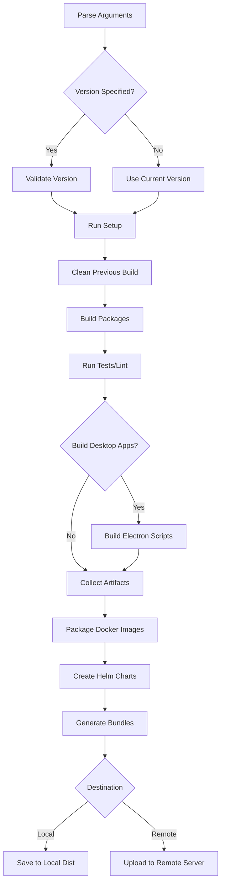

# Build System

> **Prerequisites**: See [Prerequisites Guide](./getting-started/prerequisites.md) for required tools installation.

This guide covers Vrooli's comprehensive build system, which supports multi-platform builds, container orchestration, desktop applications, and sophisticated artifact management.

## Overview

Vrooli's build system provides:

- 🏗️ **Multi-Platform Builds**: Windows, macOS, Linux, Android, iOS support
- 📦 **Container Management**: Docker image building and registry integration
- 🖥️ **Desktop Applications**: Electron-based cross-platform apps
- ☸️ **Kubernetes Artifacts**: Helm charts and container deployment
- 🎯 **Intelligent Versioning**: Automatic version management and artifact tagging
- 🚀 **Deployment Ready**: Artifacts optimized for different deployment targets

## Build Architecture

### Build Process Flow



## Build Script Usage

### Basic Usage

```bash
# Build for development with default settings
bash scripts/main/build.sh

# Build for production with specific version
bash scripts/main/build.sh --version 1.2.0 --environment production

# Build specific artifacts
bash scripts/main/build.sh --artifacts docker,k8s --bundles zip
```

### Command Line Options

```bash
# Core Options
--version <ver>           # Specify version (mandatory for production)
--environment <env>       # Target environment (development/staging/production)
--bundles <types>         # Bundle types: all|zip|cli
--artifacts <types>       # Artifact types: all|docker|k8s
--binaries <platforms>    # Platform binaries: all|windows|mac|linux|android|ios
--dest <target>           # Destination: local|remote

# Quality Control
--test yes|no             # Run tests before building (default: no)
--lint yes|no             # Run linting before building (default: no)

# System Options
--sudo-mode error|skip    # Sudo behavior for privileged operations
--yes                     # Auto-confirm all prompts
--location local|remote   # Override location detection
```

## Bundle Types

### 1. ZIP Bundles

Standard deployment bundles containing built artifacts:

```bash
# Generate ZIP bundle
bash scripts/main/build.sh --bundles zip

# Creates: dist/{version}/bundles/artifacts.zip.gz
```

**Contents:**
- Built package distributions
- Configuration files
- Package manifests (package.json, pnpm-lock.yaml)

### 2. CLI Bundles

Command-line interface executables:

```bash
# Generate CLI executables  
bash scripts/main/build.sh --bundles cli

# Platform-specific CLI tools for automation
```

## Artifact Types

### 1. Docker Artifacts

Container images and related assets:

```bash
# Build Docker artifacts
bash scripts/main/build.sh --artifacts docker
```

**Process:**
1. **Build Images**: Creates optimized container images
2. **Save Images**: Exports images to tarball
3. **Registry Push**: Uploads to Docker Hub (for K8s builds)

**Generated:**
```
dist/{version}/artifacts/
└── docker-images.tar    # Container images for local deployment
```

### 2. Kubernetes Artifacts

Helm charts and Kubernetes manifests:

```bash
# Build Kubernetes artifacts
bash scripts/main/build.sh --artifacts k8s
```

**Process:**
1. **Build Docker Images**: Creates and pushes to registry
2. **Package Helm Chart**: Creates versioned chart package
3. **Environment Values**: Copies environment-specific configurations

**Generated:**
```
dist/{version}/artifacts/
├── k8s-chart-packages/
│   └── vrooli-{version}.tgz     # Packaged Helm chart
└── helm-value-files/
    ├── values-dev.yaml          # Development overrides
    └── values-prod.yaml         # Production overrides
```

## Platform Binaries

### Desktop Applications (Electron)

Cross-platform desktop application builds:

```bash
# Build for all desktop platforms
bash scripts/main/build.sh --binaries all

# Build for specific platforms
bash scripts/main/build.sh --binaries windows,mac,linux
```

#### Windows Builds

```bash
# Windows-specific build
bash scripts/main/build.sh --binaries windows

# Requires Wine for cross-compilation on Linux
# Automatically installs Wine if needed
```

**Output:** `Vrooli-Setup-{version}.exe`

#### macOS Builds

```bash
# macOS-specific build
bash scripts/main/build.sh --binaries mac
```

**Output:** `Vrooli-{version}.dmg`

#### Linux Builds

```bash
# Linux-specific build
bash scripts/main/build.sh --binaries linux
```

**Output:** `Vrooli-{version}.AppImage`

### Mobile Applications

#### Android Builds

```bash
# Android package build
bash scripts/main/build.sh --binaries android

# Triggers Google Play Store packaging
```

#### iOS Builds

```bash
# iOS package build (stub)
bash scripts/main/build.sh --binaries ios

# TODO: Implementation pending
```

## Version Management

### Automatic Version Handling

```bash
# Use current version from package.json
bash scripts/main/build.sh

# Specify explicit version
bash scripts/main/build.sh --version 1.2.3
```

### Version Update Process

When a version is specified:

1. **Package.json Updates**: All package.json files updated
2. **Helm Chart Updates**: Chart.yaml appVersion updated  
3. **Values File Updates**: Service tags in values-prod.yaml updated
4. **Consistency Checks**: Validates version format and uniqueness

### Production Version Requirements

```bash
# Production builds REQUIRE explicit version
bash scripts/main/build.sh --environment production --version 1.2.3

# Warns if version matches current (overwrites artifacts)
# Allows user confirmation before proceeding
```

## Docker Integration

> **Note**: For detailed Docker troubleshooting, see [Troubleshooting Guide](./troubleshooting.md#container-issues).

### Image Building Strategy

#### Development Images
```bash
# Development image tags
ui:development
server:development  
jobs:development
```

#### Production Images
```bash
# Production image tags
ui:production
server:production
jobs:production
```

### Docker Hub Integration

For Kubernetes deployments:

```bash
# Automatic tagging and pushing
export DOCKERHUB_USERNAME=your-username
export DOCKERHUB_TOKEN=your-token

bash scripts/main/build.sh --artifacts k8s --version 1.2.3
```

**Process:**
1. **Login**: Authenticates with Docker Hub
2. **Tag Images**: Creates version and floating tags
3. **Push Images**: Uploads to registry

**Tags Created:**
```bash
your-username/server:1.2.3    # Specific version
your-username/server:production     # Floating tag (production)
your-username/ui:1.2.3        # Specific version  
your-username/ui:production         # Floating tag (production)
```

### Resource Management

Docker daemon resource limits are automatically configured:

```bash
# CPU Quota: (cores - 0.5) * 100%
# Memory: 80% of total system memory

# Systemd slice configuration applied automatically
```

## Build Optimization

### Caching Strategy

```bash
# Build artifact caching
- Package builds cached by dependency hash
- Docker layers cached between builds
- Helm packages cached by chart version
```

### Parallel Building

```bash
# Concurrent package builds
pnpm run build    # Builds all packages in dependency order

# Parallel Docker builds  
docker-compose build --parallel

# Concurrent platform builds (Electron)
npx electron-builder --win --mac --linux --parallel
```

### Build Dependencies

#### System Requirements

```bash
# Automatically installed during setup
- Node.js (via package manager)
- PNPM (via corepack or standalone)
- Docker & Docker Compose
- Build tools (gcc, make, python)
```

#### Development Dependencies

```bash
# TypeScript compilation
- TypeScript compiler
- ESBuild for fast builds
- Webpack for UI bundling

# Testing tools
- Mocha, Chai, Sinon for unit tests
- BATS for shell script testing
- Playwright for E2E testing
```

## Artifact Organization

### Directory Structure

```
dist/
└── {version}/
    ├── artifacts/                    # Raw build artifacts
    │   ├── docker-images.tar        # Container images
    │   ├── k8s-chart-packages/      # Helm charts
    │   ├── helm-value-files/        # Environment configs
    │   ├── server-dist/             # Server build output
    │   ├── ui-dist/                 # UI build output
    │   └── jobs-dist/               # Jobs build output
    ├── bundles/                     # Compressed bundles
    │   └── artifacts.zip.gz         # Deployment bundle
    └── desktop/                     # Desktop applications
        ├── windows/
        ├── mac/
        └── linux/
```

### Deployment Bundles

#### Local Deployment
```bash
# Self-contained deployment package
dist/{version}/bundles/artifacts.zip.gz

# Contains everything needed for deployment:
- Built application code
- Docker images (in tarball format)
- Configuration files
- Deployment scripts
```

#### Remote Deployment
```bash
# Upload to remote server
rsync -avz dist/{version}/bundles/artifacts.zip.gz \
  user@remote:/path/to/deployment/

# Or automatic upload with --dest remote
bash scripts/main/build.sh --dest remote --version 1.2.3
```

## Build Quality Control

### Testing Integration

```bash
# Run tests before building
bash scripts/main/build.sh --test yes

# Test execution order:
1. Shell script tests (BATS)
2. Unit tests (Mocha/Chai)  
3. Integration tests (Playwright)
```

### Linting Integration

```bash
# Run linting before building
bash scripts/main/build.sh --lint yes

# Linting tools:
- ESLint for TypeScript/JavaScript
- ShellCheck for shell scripts
- Prettier for code formatting
```

### Build Verification

Automatic verification steps:

```bash
# Package verification
- Verify all packages built successfully
- Check for missing dependencies
- Validate package.json consistency

# Docker verification  
- Verify images can be loaded
- Check image sizes within limits
- Validate container startup

# Artifact verification
- Verify bundle completeness
- Check file permissions
- Validate archive integrity
```

## Platform-Specific Considerations

### Windows Development

```bash
# WSL2 recommended for development
# Automatic Wine installation for Electron builds
# Path handling for Windows-style paths
```

### macOS Development

```bash
# Homebrew integration
# Code signing for app distribution
# Notarization for macOS apps
```

### Linux Development

```bash
# Native development environment
# AppImage packaging for distribution
# Snap package support (future)
```

## Troubleshooting

> **Note**: For comprehensive troubleshooting of build system issues, including version conflicts, Docker build failures, Electron build issues, and resource limitations, see [Troubleshooting Guide](./troubleshooting.md#build-system-issues).

Common troubleshooting categories:
- **Version Conflicts**: Version already exists errors, overwrite confirmation
- **Docker Build Failures**: Daemon status, cache issues, fresh image rebuilds
- **Electron Build Issues**: Wine installation, code signing, cross-platform builds
- **Resource Limitations**: Memory constraints, disk space, system optimization

### Debug Mode

```bash
# Enable verbose logging
export DEBUG=1
bash scripts/main/build.sh --version 1.2.3

# Check build logs
tail -f dist/build.log

# Analyze specific component
docker logs build-container
```

## Performance Optimization

### Build Speed Improvements

```bash
# 1. Parallel builds
export MAKEFLAGS="-j$(nproc)"

# 2. Build cache optimization
# Use ccache for native compilation
export PATH="/usr/lib/ccache:$PATH"

# 3. Docker layer caching
# Optimize Dockerfile layer order
# Use multi-stage builds effectively

# 4. Dependency caching
# Cache node_modules between builds
# Use pnpm store for efficient package management
```

### Resource Usage

```bash
# Monitor build resources
docker stats build-containers
htop  # CPU/Memory usage

# Optimize for CI/CD
# Use smaller base images
# Minimize build context size
# Parallel job limits
```

## Integration with CI/CD

### GitHub Actions

```yaml
name: Build and Deploy
on:
  push:
    tags: ['v*']

jobs:
  build:
    runs-on: ubuntu-latest
    steps:
      - uses: actions/checkout@v3
      - name: Build Artifacts
        run: |
          bash scripts/main/build.sh \
            --version ${{ github.ref_name }} \
            --environment production \
            --artifacts all \
            --bundles all
```

### Build Artifacts Storage

```bash
# GitHub Releases
# Upload build artifacts to GitHub releases

# Container Registry
# Push images to Docker Hub/GitHub Container Registry

# Cloud Storage
# Upload bundles to S3/GCS for deployment
```

This comprehensive build system ensures reliable, reproducible builds across all platforms while supporting both simple development workflows and complex production deployments. 