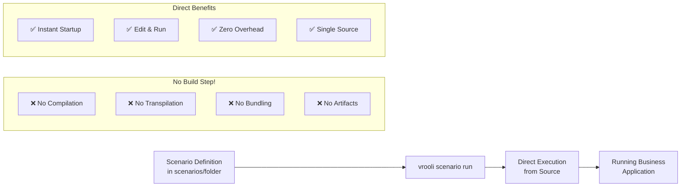
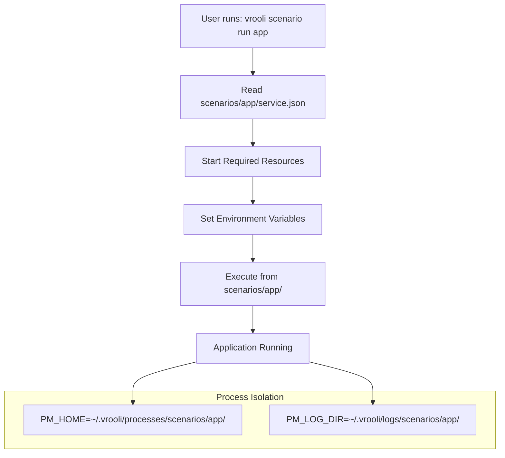

# Direct Scenario Execution System

> **Prerequisites**: See [Prerequisites Guide](./getting-started/prerequisites.md) for required tools installation.

This guide covers Vrooli's revolutionary **direct execution model** where scenarios run directly from their source location without any build or conversion steps.

## Architecture Overview

Vrooli operates as a **resource orchestration platform** that runs scenarios directly from the `scenarios/` directory to create business applications. There are **no build steps, no artifacts, and no conversion process**.

### Direct Execution Model



### Key Innovation

- **Scenarios ARE the Application**: No conversion to standalone apps
- **Direct Execution**: Run directly from `scenarios/<name>/` folder
- **Zero Build Time**: Changes take effect immediately
- **Single Source of Truth**: Everything lives in the scenarios directory

## Lifecycle Management

### Core Commands

The Vrooli CLI provides direct execution commands:

```bash
# Run a scenario directly from source
vrooli scenario run <name>

# Test scenario integration (also runs directly)
vrooli scenario test <name>

# List available scenarios
vrooli scenario list

# Check scenario configuration / remediation guidance
vrooli scenario status <name>
```

### What About "vrooli build"?

The `vrooli build` command **does not build anything**. It only:
- Validates scenario configurations
- Checks resource availability
- Verifies deployment readiness
- Ensures service.json is valid

```bash
# Validate scenarios (no building occurs!)
vrooli build

# This just checks configurations, doesn't create artifacts
vrooli build --validate-only
```

## Scenario Configuration

Each scenario includes a `service.json` file that defines its runtime configuration:

```json
{
  "service": {
    "name": "research-assistant",
    "displayName": "AI Research Assistant",
    "description": "Enterprise-grade AI research platform"
  },
  "resources": {
    "ai": {
      "ollama": {
        "enabled": true,
        "required": true
      }
    },
    "storage": {
      "postgres": {
        "enabled": true,
        "required": true
      },
      "qdrant": {
        "enabled": true,
        "required": false
      }
    }
  },
  "runtime": {
    "ports": {
      "ui": 3000,
      "api": 5000
    },
    "environment": {
      "NODE_ENV": "production"
    }
  }
}
```

## Direct Execution Flow

### How Scenarios Run



### No Intermediate Steps

Traditional systems:
```
Write Code → Compile → Bundle → Package → Deploy → Run
```

Vrooli's direct execution:
```
scenarios/my-app/ → vrooli scenario run my-app → Running!
```

## Testing as Validation

Since there's no build process, testing serves as validation:

```bash
# Test a scenario (runs it and validates functionality)
vrooli scenario test customer-portal

# This actually:
# 1. Starts the scenario directly
# 2. Runs integration tests
# 3. Validates resource connectivity
# 4. Confirms business logic
```

### Test Script Example

```bash
#!/bin/bash
# scenarios/customer-portal/test.sh

source ../../framework/helpers/test-helpers.sh

test_scenario() {
    log_info "Testing customer portal direct execution"
    
    # Verify resources are available
    check_service_health "ollama" "http://localhost:11434"
    check_service_health "postgres" "postgresql://localhost:5432"
    
    # Test that scenario runs correctly
    test_api_endpoint "http://localhost:3000/api/health"
    test_database_connection
    test_ai_integration
    
    log_success "Scenario runs correctly from source"
}

test_scenario
```

## Deployment = Running

In Vrooli, deployment simply means running the scenario in a production environment:

### Local "Deployment"
```bash
# Run locally
cd scenarios/invoice-generator
../../scripts/manage.sh develop
```

### Production "Deployment"
```bash
# Run in production (same code, different environment)
ENVIRONMENT=production vrooli scenario run invoice-generator
```

### Key Points
- **No Build Artifacts**: Nothing to deploy except the source
- **No Container Images**: Unless the scenario specifically needs them
- **No Compilation**: Interpreted languages run as-is
- **Environment-Based**: Same source code, different runtime settings

## Resource Integration

Scenarios leverage shared local resources without building or bundling:

### Resource Access
- Resources run independently (Ollama, PostgreSQL, Redis, etc.)
- Scenarios connect via APIs and standard protocols
- No resource code is bundled into scenarios
- Resources are shared across all scenarios

### Resource Declaration
Scenarios declare required resources in service.json:

```json
{
  "resources": {
    "storage": {
      "postgres": {
        "enabled": true,
        "initialization": {
          "schemas": ["initialization/postgres/schema.sql"]
        }
      }
    },
    "ai": {
      "ollama": {
        "enabled": true,
        "models": ["llama3.1:8b", "codellama:13b"]
      }
    }
  }
}
```

## Development Workflow

### Instant Development Cycle

```bash
# 1. Edit scenario files
vim scenarios/my-app/index.js

# 2. Run immediately (no build needed!)
vrooli scenario run my-app

# 3. See changes instantly
# No compilation, no waiting, just results
```

### Hot Reloading
Some scenarios support hot reloading during development:

```bash
# Start with development mode
cd scenarios/my-app
DEVELOPMENT=true ../../scripts/manage.sh develop

# Edit files - changes appear instantly
# No rebuild, no restart, just automatic updates
```

## Benefits of Direct Execution

### For Developers
- **Zero Build Time**: Start working immediately
- **Instant Feedback**: Changes visible instantly
- **No Build Failures**: Can't fail what doesn't exist
- **Simple Mental Model**: Code runs as written

### For the System
- **Reduced Complexity**: No build pipeline to maintain
- **Fewer Dependencies**: No build tools needed
- **Less Disk Usage**: No artifacts or build outputs
- **Faster CI/CD**: Nothing to compile or package

### For Operations
- **Simple Deployment**: Just sync the source files
- **Easy Rollback**: Previous version is just older source
- **Transparent Debugging**: Debug actual source, not compiled output
- **Minimal Infrastructure**: No artifact repositories needed

## Common Misconceptions

### "But what about TypeScript/JSX/etc?"

Scenarios that need transpilation handle it internally during execution:
- TypeScript can run via ts-node or Deno
- JSX can use runtime transforms
- The platform doesn't force a build step

### "How do you optimize for production?"

- Resources (databases, AI models) are already optimized
- Scenarios are lightweight orchestration code
- Performance comes from resource efficiency, not bundling

### "What about dependencies?"

- Resource dependencies are managed by resources themselves
- Scenario dependencies are minimal (usually just configuration)
- No need to bundle what's already available

## Migration from Old System

The previous build system assumed conversion to standalone applications. The new direct execution model recognizes that:

1. **Scenarios are configurations, not applications to build**
2. **Resources provide the heavy lifting, scenarios orchestrate**
3. **Direct execution eliminates entire categories of complexity**
4. **The simplest approach is often the best**

## Examples

### Running a Simple Scenario
```bash
# Just run it - no build needed
vrooli scenario run hello-world
```

### Running a Complex Business Application
```bash
# Even complex apps run directly
vrooli scenario run enterprise-portal

# Check its configuration
cat scenarios/enterprise-portal/service.json

# Edit and re-run immediately
vim scenarios/enterprise-portal/config.js
vrooli scenario run enterprise-portal  # Changes applied!
```

### Testing Before "Deployment"
```bash
# Validate everything works
vrooli scenario test invoice-generator

# "Deploy" to production (just run it there)
ssh production-server
cd vrooli
vrooli scenario run invoice-generator
```

## Summary

Vrooli's direct execution model eliminates the traditional build/deploy pipeline entirely:

- ✅ **No Build Step**: Scenarios run directly from source
- ✅ **No Artifacts**: No compiled outputs or bundles
- ✅ **Instant Updates**: Edit and run immediately
- ✅ **Single Source**: scenarios/ folder is the only truth
- ✅ **Zero Overhead**: No build time, no build failures
- ✅ **Simple Deployment**: Just run the scenario

This revolutionary approach makes Vrooli incredibly fast, simple, and reliable for creating business applications worth $10K-50K each.
