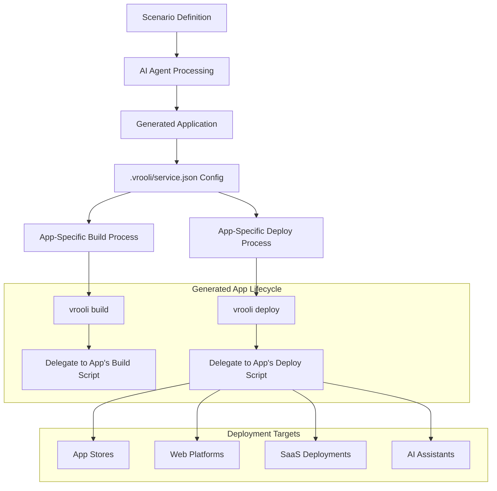
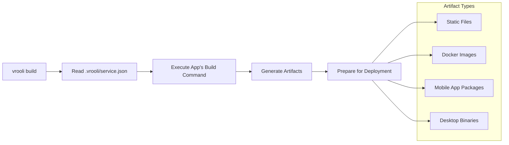
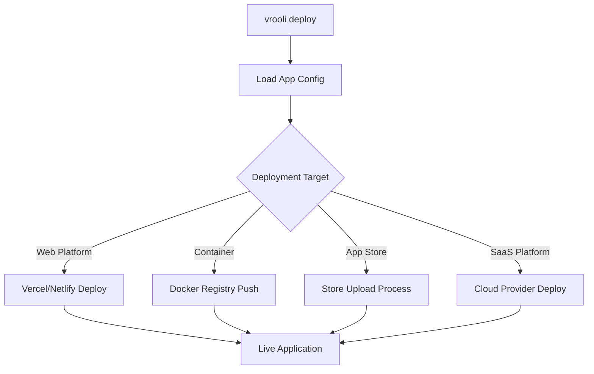

# Build & Deploy System

> **Prerequisites**: See [Prerequisites Guide](./getting-started/prerequisites.md) for required tools installation.

This guide covers Vrooli's scenario-based build and deploy system, where AI-generated applications manage their own build and deployment processes.

## Architecture Overview

Vrooli operates as an **AI intelligence system** that generates complete applications from scenarios. Unlike traditional platforms that build and deploy themselves, Vrooli's architecture works as follows:

### Current Architecture (Scenario-Based)



### Key Concepts

- **Scenarios**: Define complete business applications (SaaS platforms, AI assistants, mobile apps)
- **Generated Apps**: Complete applications created by AI agents from scenario definitions
- **Lifecycle Delegation**: Build/deploy commands delegate to each app's specific configuration
- **Self-Contained Apps**: Each generated app knows how to build and deploy itself

## Lifecycle Management

### Universal Commands

The Vrooli CLI provides universal lifecycle commands that delegate to each application's specific implementation:

```bash
# Build an application (delegates to app's build process)
vrooli build [options]

# Deploy an application (delegates to app's deploy process) 
vrooli deploy [options]

# Setup development environment
vrooli develop

# Run application-specific tests
vrooli test [test-type]
```

### Application Configuration

Each generated application includes a `.vrooli/service.json` file that defines its lifecycle:

```json
{
  "name": "my-scenario-app",
  "type": "web-application",
  "lifecycle": {
    "build": {
      "command": "npm run build",
      "output": "dist/",
      "artifacts": ["static-files", "docker-image"]
    },
    "deploy": {
      "command": "scripts/deploy.sh",
      "targets": ["vercel", "docker"],
      "environment": "production"
    },
    "develop": {
      "command": "npm run dev",
      "ports": [3000, 5432],
      "resources": ["postgresql", "redis"]
    }
  }
}
```

## Build Process Flow

### Application-Specific Building



### Example Build Configurations

Different scenario-generated apps have different build requirements:

#### SaaS Web Application
```json
{
  "lifecycle": {
    "build": {
      "command": "pnpm build",
      "artifacts": ["static-bundle", "docker-image"],
      "environment": {
        "NODE_ENV": "production"
      }
    }
  }
}
```

#### Mobile Application
```json
{
  "lifecycle": {
    "build": {
      "command": "scripts/build-mobile.sh",
      "artifacts": ["android-apk", "ios-ipa"],
      "platforms": ["android", "ios"]
    }
  }
}
```

#### AI Assistant
```json
{
  "lifecycle": {
    "build": {
      "command": "python setup.py build",
      "artifacts": ["model-package", "inference-container"],
      "requirements": ["tensorflow", "transformers"]
    }
  }
}
```

## Deployment System

### Universal Deployment Interface

```bash
# Deploy to configured targets
vrooli deploy

# Deploy to specific environment
vrooli deploy --environment production

# Deploy to specific platform
vrooli deploy --target vercel

# Dry run deployment
vrooli deploy --dry-run
```

### Deployment Delegation

Each application defines its own deployment strategy:



## Scenario Examples

### E-commerce Platform Scenario
Generated app includes:
- React frontend build process
- Node.js backend containerization
- Database migration scripts
- Payment gateway integration
- Deployment to AWS/Vercel

### AI Chatbot Scenario  
Generated app includes:
- Model training pipeline
- Inference server containerization
- API endpoint generation
- Deployment to cloud AI platforms

### Mobile Productivity App Scenario
Generated app includes:
- React Native build process
- Platform-specific configurations
- App store submission automation
- Cross-platform compatibility

## Development Workflow

### Local Development

```bash
# Start development environment
vrooli develop

# This delegates to the app's develop configuration:
# - Starts required resources (databases, caches)
# - Launches development servers
# - Sets up hot reloading
# - Configures development proxies
```

### Testing Integration

```bash
# Run application tests
vrooli test unit
vrooli test integration
vrooli test e2e

# Each test type delegates to app-specific test suites
```

## Resource Integration

Generated applications can leverage shared local resources:

### Available Resources
- **Databases**: PostgreSQL, Redis, Neo4j
- **AI Services**: Ollama, OpenAI-compatible APIs
- **Automation**: N8n workflows
- **Storage**: MinIO, local file systems
- **Monitoring**: Prometheus, logging services

### Resource Declaration

Applications declare required resources in their service configuration:

```json
{
  "resources": {
    "postgresql": {
      "version": "15",
      "databases": ["app_data", "analytics"]
    },
    "redis": {
      "version": "7",
      "purpose": "caching"
    },
    "ollama": {
      "models": ["llama2", "codellama"]
    }
  }
}
```

## Benefits of This Architecture

### For Developers
- **No Platform Lock-in**: Each app defines its own build/deploy strategy
- **Technology Freedom**: Apps can use any tech stack
- **Resource Sharing**: Efficient use of local development resources

### For the System
- **Compound Intelligence**: Each built app becomes a permanent capability
- **Recursive Improvement**: Apps can build better apps
- **Scalable Complexity**: System handles increasingly complex scenarios

### For Deployment
- **Flexible Targets**: Apps deploy where they make most sense (app stores, web, cloud)
- **Optimized Processes**: Each app uses deployment strategy suited to its purpose
- **Business Value**: Generated apps can generate real revenue

## Migration from Old System

The previous build system focused on building/deploying Vrooli itself. The new system recognizes that:

1. **Vrooli is the intelligence, not the product**
2. **Generated apps are the products that get deployed**
3. **Build/deploy varies by application type and target**
4. **The system grows smarter with each scenario**

This architectural shift enables Vrooli to create everything from simple websites to complex SaaS businesses, each with deployment strategies optimized for their specific use case.