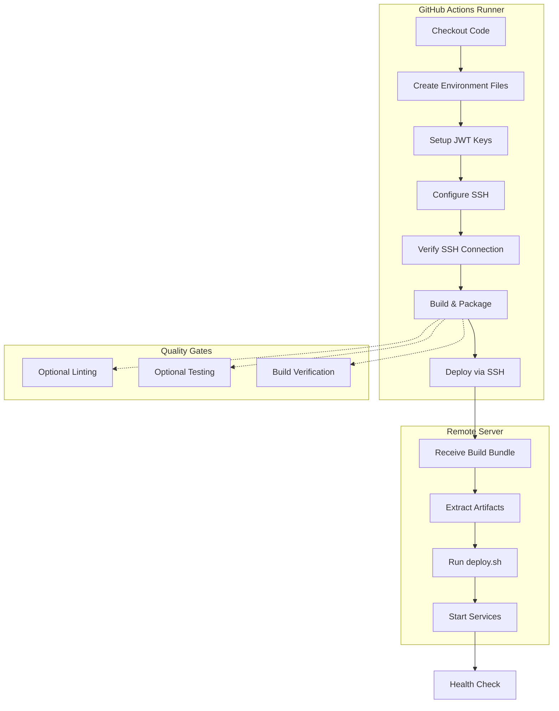

# CI/CD Pipeline

This guide covers Vrooli's sophisticated CI/CD pipeline, which provides automated testing, building, and deployment across multiple environments using GitHub Actions and the advanced scripting infrastructure.

> **Prerequisites**: See [Prerequisites Guide](./getting-started/prerequisites.md) for required tools installation.
> **SSH Setup**: For comprehensive SSH key configuration, see [SSH Setup Guide](./getting-started/ssh-setup.md).
> **Environment Variables**: For complete variable reference, see [Environment Variables Guide](./getting-started/environment-variables.md).
> **Server Deployment**: For server setup and configuration, see [Server Deployment Guide](./server-deployment.md).
> **Troubleshooting**: For CI/CD issues, see [Troubleshooting Guide](./troubleshooting.md#cicd-pipeline-issues).

## Overview

Vrooli's CI/CD system provides:

- 🚀 **Multi-Environment Deployment**: Staging (from `dev` branch) and production (from `master` branch)
- 🔐 **Advanced Secret Management**: Environment files, JWT keys, and SSH deployment keys
- 🏗️ **Sophisticated Build Process**: Integration with the advanced `build.sh` script
- 📦 **Remote Deployment**: Build locally, transfer securely, deploy remotely via SSH
- 🛡️ **Quality Control**: Optional linting and testing with conditional execution
- ⚡ **Performance Optimized**: Concurrent execution and intelligent caching

## Pipeline Architecture

### Workflow Overview



## GitHub Actions Workflows

### 1. Development Pipeline (`dev.yml`)

Triggers on `dev` branch pushes and pull requests:

```yaml
name: Dev CI/CD
on:
  push:
    branches: [dev]
  pull_request:
    branches: [dev]
  workflow_dispatch:  # Manual trigger with options
```

**Environment**: `staging`  
**Target Server**: Staging environment  
**Deployment Strategy**: Docker-based deployment for rapid iteration

### 2. Production Pipeline (`master.yml`)

Triggers on `master` branch pushes and pull requests:

```yaml
name: Master CI/CD
on:
  push:
    branches: [master]
  pull_request:
    branches: [master]
  workflow_dispatch:  # Manual trigger with options
```

**Environment**: `production`  
**Target Server**: Production environment  
**Deployment Strategy**: Production-optimized Docker deployment

## Secret Management

> **Complete Environment Guide**: For comprehensive environment variables documentation, see [Environment Variables Guide](./getting-started/environment-variables.md).

### Required GitHub Secrets

#### Environment Configuration
- **`ENV_FILE_CONTENT`**: Complete environment file content (`.env-dev` for staging, `.env-prod` for production)

#### JWT Key Management
- **`JWT_PRIV_PEM`**: JWT private key for token signing
- **`JWT_PUB_PEM`**: JWT public key for token verification

#### SSH Deployment
- **`VPS_SSH_PRIVATE_KEY`**: SSH private key for secure server access
- **`VPS_DEPLOY_USER`**: SSH username for deployment (e.g., `root`)
- **`VPS_DEPLOY_HOST`**: Server hostname or IP address

### Environment-Specific Secrets

#### Development Environment (dev.yml)
```bash
# Uses GitHub Environment: development
ENV_FILE_CONTENT=<content-of-.env-dev>
JWT_PRIV_PEM=<dev-jwt-private-key>
JWT_PUB_PEM=<dev-jwt-public-key>
VPS_DEPLOY_USER=<dev-server-user>
VPS_DEPLOY_HOST=<dev-server-host>
VPS_SSH_PRIVATE_KEY=<dev-ssh-key>
```

#### Production Environment (master.yml)
```bash
# Uses GitHub Environment: production
ENV_FILE_CONTENT=<content-of-.env-prod>
JWT_PRIV_PEM=<production-jwt-private-key>
JWT_PUB_PEM=<production-jwt-public-key>
VPS_DEPLOY_USER=<production-server-user>
VPS_DEPLOY_HOST=<production-server-host>
VPS_SSH_PRIVATE_KEY=<production-ssh-key>
```

## Pipeline Execution Flow

### 1. Environment Preparation

> **Complete Development Guide**: For detailed environment setup, see [Development Environment](./development-environment.md).

```bash
# Create environment file from secret
echo "${{ secrets.ENV_FILE_CONTENT }}" > .env-dev  # or .env-prod

# Create JWT key files
echo "${{ secrets.JWT_PRIV_PEM }}" > jwt_priv_dev.pem
echo "${{ secrets.JWT_PUB_PEM }}" > jwt_pub_dev.pem
```

### 2. SSH Configuration

> **Complete SSH Guide**: For comprehensive SSH setup and troubleshooting, see [SSH Setup Guide](./getting-started/ssh-setup.md).

```bash
# Configure SSH for secure deployment
mkdir -p ~/.ssh
echo -e "Host *\n \tStrictHostKeyChecking no\n" > ~/.ssh/config
chmod 600 ~/.ssh/config

# Setup deployment key
echo "${{ secrets.VPS_SSH_PRIVATE_KEY }}" > ~/.ssh/deploy_key
chmod 600 ~/.ssh/deploy_key
```

### 3. Build Process

Advanced build using the sophisticated `build.sh` script:

```bash
bash scripts/main/build.sh \
  --environment development \    # or production
  --ci-cd yes \                 # CI/CD mode
  --bundles zip \               # Create ZIP bundle
  --artifacts docker \          # Build Docker artifacts
  --binaries none \             # Skip binary builds in CI
  --dest local \                # Save locally for transfer
  --yes yes \                   # Auto-confirm prompts
  --location remote \           # Remote deployment target
  --lint "$LINT_ENABLED" \      # Conditional linting
  --test "$TEST_ENABLED"        # Conditional testing
```

### 4. Remote Deployment

```bash
# Deploy via SSH to remote server
ssh -i ~/.ssh/deploy_key -o StrictHostKeyChecking=no \
  ${{ secrets.VPS_DEPLOY_USER }}@${{ secrets.VPS_DEPLOY_HOST }} \
  'bash ~/Vrooli/scripts/main/deploy.sh \
    --environment development \
    --source docker \
    --yes yes'
```

## Quality Control Features

### Conditional Execution

The pipeline supports optional quality control steps:

```bash
# Workflow dispatch inputs
workflow_dispatch:
  inputs:
    run_lint:
      description: 'Run linting step'
      type: boolean
      default: false
    run_test:
      description: 'Run tests step' 
      type: boolean
      default: false
```

### Linting Integration

When enabled, runs comprehensive code quality checks:

```bash
# Automatic linting detection
RUN_LINT: ${{ github.event.inputs.run_lint != 'false' }}

# Integrated with build script
--lint "${{ env.RUN_LINT == 'true' && 'yes' || 'no' }}"
```

**Linting Tools:**
- ESLint for TypeScript/JavaScript
- ShellCheck for shell scripts
- Prettier for code formatting

### Testing Integration

When enabled, runs the full test suite:

```bash
# Automatic test detection
RUN_TEST: ${{ github.event.inputs.run_test != 'false' }}

# Integrated with build script
--test "${{ env.RUN_TEST == 'true' && 'yes' || 'no' }}"
```

**Testing Framework:**
- BATS for shell script testing
- Mocha/Chai/Sinon for unit tests
- Playwright for E2E testing (future)

## Deployment Strategies

### Docker-Based Deployment

Both pipelines use Docker deployment for consistency and isolation:

```bash
# Build creates Docker images and bundles
--artifacts docker --bundles zip

# Deploy extracts and runs containers
--source docker --environment <env>
```

**Deployment Process:**
1. **Extract Bundle**: Unpack ZIP bundle on remote server
2. **Load Images**: Import Docker images from bundle
3. **Update Configuration**: Apply environment-specific settings
4. **Container Orchestration**: Start/restart services with Docker Compose
5. **Health Verification**: Confirm services are running correctly

### Environment-Specific Configuration

#### Staging Deployment
```bash
# Rapid iteration environment
ENVIRONMENT=development
NODE_ENV=development
SECRETS_SOURCE=file  # File-based secrets for simplicity
```

#### Production Deployment
```bash
# Production-optimized environment
ENVIRONMENT=production
NODE_ENV=production
SECRETS_SOURCE=vault  # Vault-based secrets for security
```

## Build Integration

### Integration with Advanced Build System

The CI/CD pipeline leverages the sophisticated `build.sh` script:

#### CI/CD Specific Options
```bash
--ci-cd yes              # Enables CI/CD mode
--yes yes               # Auto-confirms all prompts
--location remote       # Optimizes for remote deployment
```

#### Quality Control Integration
```bash
--lint yes/no           # Conditional linting
--test yes/no           # Conditional testing
--sudo-mode skip        # Skips sudo operations in CI
```

#### Artifact Optimization
```bash
--bundles zip           # Creates deployment-ready bundles
--artifacts docker      # Docker-focused artifacts
--binaries none         # Skips binary builds in CI
--dest local           # Saves for SSH transfer
```

### Build Caching Strategy

Optimizations for CI/CD performance:

```bash
# Package management caching
- PNPM store caching between runs
- Node modules cached by dependency hash
- Docker layer caching for faster builds

# Build artifact caching
- TypeScript compilation cache
- ESLint cache for faster linting
- Test result caching for faster re-runs
```

## Advanced Features

### Concurrency Control

```yaml
concurrency:
  group: dev        # or master
  cancel-in-progress: true
```

**Benefits:**
- ✅ Prevents concurrent deployments to same environment
- ✅ Cancels outdated builds when new commits pushed
- ✅ Optimizes CI/CD resource usage

### Environment Protection

Production pipeline uses GitHub Environment protection:

```yaml
environment: production  # Requires manual approval for production
```

**Protection Rules:**
- Required reviewers for production deployments
- Deployment branch restrictions
- Environment-specific secrets isolation

### Health Verification

Automatic health checks after deployment:

```bash
# Built into deploy.sh script
- Container status verification
- Service health endpoint checks
- Database connectivity validation
- API response verification
```

## Setting Up CI/CD

### 1. Server Preparation

> **Complete Server Setup**: For comprehensive server setup, see [Server Deployment Guide](./server-deployment.md).

Prepare your deployment server:

```bash
# Run setup with CI/CD configuration
bash scripts/main/setup.sh --ci-cd yes

# Ensure Docker and deployment tools are installed
# Configure firewall and security settings
# Set up deployment directory structure
```

### 2. SSH Key Generation

> **Complete SSH Guide**: For comprehensive SSH key setup, see [SSH Setup Guide](./getting-started/ssh-setup.md).

Generate deployment-specific SSH keys:

```bash
# Generate environment-specific keys
ssh-keygen -t ed25519 -f ~/.ssh/vrooli_staging_deploy -C "vrooli-staging-deploy"
ssh-keygen -t ed25519 -f ~/.ssh/vrooli_production_deploy -C "vrooli-production-deploy"

# Copy public keys to servers
ssh-copy-id -i ~/.ssh/vrooli_staging_deploy.pub user@staging-server
ssh-copy-id -i ~/.ssh/vrooli_production_deploy.pub user@production-server
```

### 3. GitHub Configuration

#### Environment Setup
1. **Go to**: Repository Settings → Environments
2. **Create Environments**: `staging` and `production`
3. **Configure Protection**: Add required reviewers for production

#### Secret Configuration
1. **Go to**: Repository Settings → Secrets and Variables → Actions
2. **Select Environment**: staging or production
3. **Add Required Secrets**: Environment files, JWT keys, SSH keys

#### Environment File Preparation

> **Complete Environment Guide**: For comprehensive environment variables, see [Environment Variables Guide](./getting-started/environment-variables.md).

```bash
# Staging environment (.env-dev)
ENVIRONMENT=development
NODE_ENV=development
SECRETS_SOURCE=file
# ... other staging-specific variables

# Production environment (.env-prod)  
ENVIRONMENT=production
NODE_ENV=production
SECRETS_SOURCE=vault
# ... other production-specific variables
```

### 4. JWT Key Management

Generate environment-specific JWT keys:

```bash
# Generate staging keys
openssl genrsa -out jwt_priv_staging.pem 2048
openssl rsa -in jwt_priv_staging.pem -pubout -out jwt_pub_staging.pem

# Generate production keys
openssl genrsa -out jwt_priv_production.pem 2048
openssl rsa -in jwt_priv_production.pem -pubout -out jwt_pub_production.pem

# Add to GitHub secrets (properly formatted)
cat jwt_priv_staging.pem | tr '\n' '\n'    # Ensure proper line endings
cat jwt_pub_staging.pem | tr '\n' '\n'     # Ensure proper line endings
```

## Monitoring and Troubleshooting

### Pipeline Monitoring

Monitor deployments through GitHub Actions:

```bash
# GitHub Actions dashboard
- View real-time pipeline execution
- Monitor build logs and artifacts
- Track deployment success/failure rates
- Set up notification webhooks

# Server-side monitoring
ssh user@server 'docker ps'              # Container status
ssh user@server 'docker logs <container>' # Service logs
ssh user@server 'curl localhost:5329/health' # Health checks
```

### Troubleshooting Issues

> **Complete Troubleshooting**: For comprehensive troubleshooting of CI/CD pipeline issues, including SSH connection failures, environment file problems, build failures, and deployment issues, see [Troubleshooting Guide](./troubleshooting.md#cicd-pipeline-issues).

Common troubleshooting categories:
- **SSH Connection Failures**: Key format, connection testing, server configuration
- **Environment File Issues**: Content validation, special characters, syntax errors  
- **Build Failures**: Script logs, dependency verification, local testing
- **Deployment Failures**: Service status, health checks, container management

### Debug Mode

Enable verbose logging for troubleshooting:

```bash
# In workflow files, add debug environment
env:
  DEBUG: 1
  VERBOSE: 1

# Check detailed logs in GitHub Actions
# Enable SSH debugging
ssh -vvv -i ~/.ssh/deploy_key user@server
```

## Performance Optimization

### Build Speed Improvements

```bash
# Parallel builds
export MAKEFLAGS="-j$(nproc)"

# Docker layer caching
# Optimize Dockerfile layer order
# Use multi-stage builds

# Dependency caching
# Cache node_modules between builds
# Use PNPM store efficiently
```

### Deployment Optimization

```bash
# Bundle optimization
- Compress artifacts for faster transfer
- Use rsync for incremental updates
- Parallel deployment steps where possible

# Health check optimization
- Faster health check endpoints
- Parallel service verification
- Intelligent retry strategies
```

## Security Considerations

### Secret Management Best Practices

```bash
# Environment separation
- Use GitHub Environments for secret isolation
- Separate staging and production secrets
- Regular secret rotation

# SSH key security
- Use Ed25519 keys for better security
- Separate keys per environment
- Regular key rotation

# Access control
- Limit deployment permissions
- Use required reviewers for production
- Monitor deployment activities
```

### Audit and Compliance

```bash
# Deployment tracking
- All deployments logged in GitHub Actions
- Commit SHA tracking for rollback capability
- Environment-specific deployment history

# Security scanning
- Dependency vulnerability scanning
- Container image security scanning
- Secret scanning in commits
```

This comprehensive CI/CD guide ensures secure, reliable, and efficient automated deployment for Vrooli across multiple environments.

## Related Documentation

- **Prerequisites**: [Prerequisites Guide](./getting-started/prerequisites.md)
- **SSH Setup**: [SSH Setup Guide](./getting-started/ssh-setup.md)
- **Environment Variables**: [Environment Variables Reference](./getting-started/environment-variables.md)
- **Server Deployment**: [Server Deployment Guide](./server-deployment.md)
- **Build System**: [Build System Guide](./build-system.md)
- **Development Environment**: [Development Environment Setup](./development-environment.md)
- **Troubleshooting**: [Troubleshooting Guide](./troubleshooting.md) 