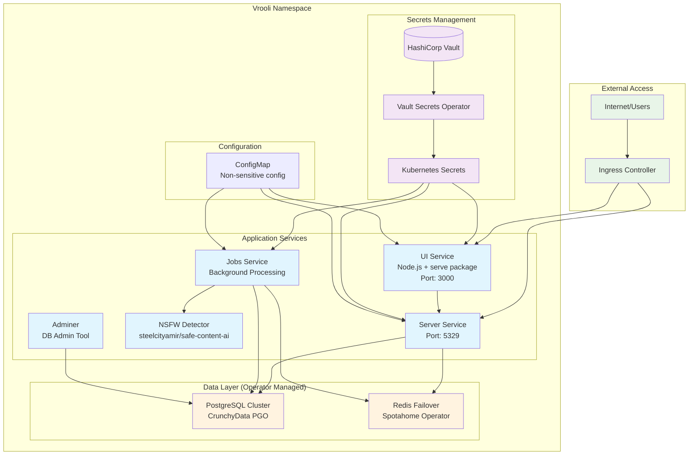
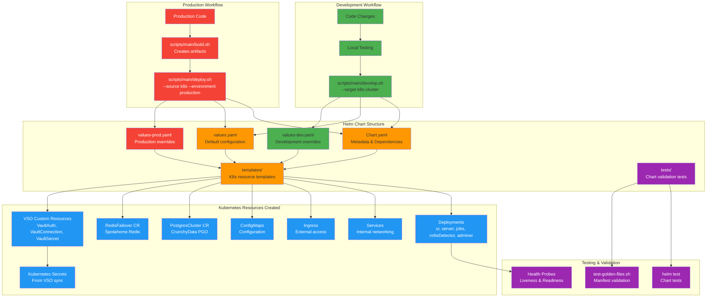

# Kubernetes Configuration for Vrooli

This directory [k8s/](../../k8s/) contains the Kubernetes configurations required to deploy the Vrooli application. We primarily use [Helm](https://helm.sh/) to package and manage these configurations.

## Architecture Overview

The following diagrams provide visual representations of the Vrooli Kubernetes architecture:

### Overall System Architecture



### Service Connectivity and Data Flow

```mermaid
graph LR
    subgraph "Frontend"
        UI[UI Container<br/>React App (built)<br/>Node.js + serve package<br/>Port: 3000]
    end
    
    subgraph "Backend Services"
        Server[Server Container<br/>API Server<br/>Port: 5329]
        Jobs[Jobs Container<br/>Background Processing]
    end
    
    subgraph "AI/ML Services"
        NSFW[NSFW Detector<br/>Content Moderation]
    end
    
    subgraph "Data Persistence"
        direction TB
        PGCluster[PostgreSQL Cluster]
        PGPrimary[Primary Instance]
        PGReplica[Replica Instance]
        PGBackup[pgBackRest Backups]
        
        RedisCluster[Redis Failover Cluster]
        RedisMaster[Redis Master]
        RedisReplica[Redis Replica]
        RedisSentinel[Redis Sentinel]
        
        PGCluster --> PGPrimary
        PGCluster --> PGReplica
        PGCluster --> PGBackup
        
        RedisCluster --> RedisMaster
        RedisCluster --> RedisReplica
        RedisCluster --> RedisSentinel
    end
    
    subgraph "Development Tools"
        Adminer[Adminer<br/>DB Admin Interface]
    end
    
    UI -->|HTTP API Calls| Server
    Server -->|SQL Queries| PGPrimary
    Server -->|Cache Operations| RedisMaster
    Jobs -->|SQL Operations| PGPrimary
    Jobs -->|Cache Operations| RedisMaster
    Jobs -->|Content Analysis| NSFW
    Adminer -->|Admin Access| PGPrimary
    
    PGPrimary -.->|Replication| PGReplica
    RedisMaster -.->|Replication| RedisReplica
    RedisSentinel -.->|Monitoring| RedisMaster
    RedisSentinel -.->|Monitoring| RedisReplica
    
    classDef frontend fill:#e3f2fd
    classDef backend fill:#fff3e0
    classDef ai fill:#f3e5f5
    classDef data fill:#e8f5e8
    classDef tools fill:#fce4ec
    
    class UI frontend
    class Server,Jobs backend
    class NSFW ai
    class PGCluster,PGPrimary,PGReplica,PGBackup,RedisCluster,RedisMaster,RedisReplica,RedisSentinel data
    class Adminer tools
```

### Secrets Management Flow

```mermaid
graph TD
    subgraph "HashiCorp Vault"
        VaultServer[Vault Server]
        
        subgraph "Secret Paths"
            SharedConfig[secret/data/vrooli/config/shared-all<br/>Non-sensitive configuration]
            SharedSecrets[secret/data/vrooli/secrets/shared-server-jobs<br/>Sensitive server/jobs secrets]
            PostgresSecrets[secret/data/vrooli/secrets/postgres<br/>Database credentials]
            RedisSecrets[secret/data/vrooli/secrets/redis<br/>Redis credentials]
            DockerSecrets[secret/data/vrooli/dockerhub/pull-credentials<br/>Image pull secrets]
        end
    end
    
    subgraph "Kubernetes Cluster"
        subgraph "Vault Secrets Operator"
            VaultAuth[VaultAuth CR<br/>K8s authentication]
            VaultConnection[VaultConnection CR<br/>Vault endpoint config]
            VaultSecret1[VaultSecret CR<br/>shared-config-all]
            VaultSecret2[VaultSecret CR<br/>shared-secrets-server-jobs]
            VaultSecret3[VaultSecret CR<br/>postgres]
            VaultSecret4[VaultSecret CR<br/>redis]
            VaultSecret5[VaultSecret CR<br/>dockerhub-pull-secret]
        end
        
        subgraph "Kubernetes Secrets"
            K8sSecret1[vrooli-config-shared-all<br/>ConfigMap alternative]
            K8sSecret2[vrooli-secrets-shared-server-jobs<br/>Server/Jobs secrets]
            K8sSecret3[vrooli-postgres-creds<br/>DB access]
            K8sSecret4[vrooli-redis-creds<br/>Cache access]
            K8sSecret5[vrooli-dockerhub-pull-secret<br/>Image pull secret]
        end
        
        subgraph "Application Pods"
            UIPod[UI Pod<br/>Access: shared-config-all]
            ServerPod[Server Pod<br/>Access: all secrets]
            JobsPod[Jobs Pod<br/>Access: all secrets]
        end
    end
    
    VaultServer --> SharedConfig
    VaultServer --> SharedSecrets
    VaultServer --> PostgresSecrets
    VaultServer --> RedisSecrets
    VaultServer --> DockerSecrets
    
    VaultAuth --> VaultServer
    VaultConnection --> VaultServer
    
    SharedConfig --> VaultSecret1 --> K8sSecret1
    SharedSecrets --> VaultSecret2 --> K8sSecret2
    PostgresSecrets --> VaultSecret3 --> K8sSecret3
    RedisSecrets --> VaultSecret4 --> K8sSecret4
    DockerSecrets --> VaultSecret5 --> K8sSecret5
    
    K8sSecret1 --> UIPod
    K8sSecret1 --> ServerPod
    K8sSecret1 --> JobsPod
    
    K8sSecret2 --> ServerPod
    K8sSecret2 --> JobsPod
    K8sSecret3 --> ServerPod
    K8sSecret3 --> JobsPod
    K8sSecret4 --> ServerPod
    K8sSecret4 --> JobsPod
    
    K8sSecret5 -.->|ImagePullSecret| UIPod
    K8sSecret5 -.->|ImagePullSecret| ServerPod
    K8sSecret5 -.->|ImagePullSecret| JobsPod
    
    classDef vault fill:#4285f4,color:#fff
    classDef vso fill:#ff9800,color:#fff
    classDef k8ssecret fill:#4caf50,color:#fff
    classDef pod fill:#9c27b0,color:#fff
    
    class VaultServer,SharedConfig,SharedSecrets,PostgresSecrets,RedisSecrets,DockerSecrets vault
    class VaultAuth,VaultConnection,VaultSecret1,VaultSecret2,VaultSecret3,VaultSecret4,VaultSecret5 vso
    class K8sSecret1,K8sSecret2,K8sSecret3,K8sSecret4,K8sSecret5 k8ssecret
    class UIPod,ServerPod,JobsPod pod
```



### Deployment and Build Flow



## What is Kubernetes?

Briefly, [Kubernetes](https://kubernetes.io/) (often abbreviated as K8s) is an open-source system for automating deployment, scaling, and management of containerized applications. It groups containers that make up an application into logical units for easy management and discovery.

## What is Helm?

[Helm](https://helm.sh/) is a package manager for Kubernetes. It helps you define, install, and upgrade even the most complex Kubernetes applications. Helm uses a packaging format called "charts."

A [Helm chart](https://helm.sh/docs/topics/charts/) is a collection of files that describe a related set of Kubernetes resources. It allows you to:
*   Define your application resources (Deployments, Services, ConfigMaps, Secrets, etc.) as templates.
*   Manage application configuration through values files.
*   Package and version your application for easy distribution and deployment.
*   Manage the lifecycle of your deployed applications (install, upgrade, rollback, test).

## Directory Structure Overview

Our Kubernetes configurations are primarily located within the [k8s/chart/](../../k8s/chart/) directory, which represents our Helm chart for the Vrooli application:

```
k8s/
├── chart/                # Helm chart for the Vrooli application
│   ├── Chart.yaml        # Metadata about the chart (name, version, dependencies)
│   ├── values.yaml       # Default configuration values for the chart
│   ├── values-dev.yaml   # Environment-specific values for 'development'
│   ├── values-prod.yaml  # Environment-specific values for 'production'
│   ├── .helmignore       # Specifies files to ignore when packaging the chart
│   ├── templates/        # Directory of templates that generate Kubernetes manifests
│   │   ├── _helpers.tpl  # Common helper functions and partials
│   │   ├── deployment.yaml # For ui, server, jobs, nsfwDetector
│   │   ├── service.yaml    # For ui, server, jobs, nsfwDetector services
│   │   ├── configmap.yaml  # For general application configuration
│   │   ├── ingress.yaml    # For exposing services externally
│   │   ├── pgo-postgrescluster.yaml    # CR for CrunchyData PostgreSQL Operator
│   │   ├── spotahome-redis-failover.yaml # CR for Spotahome Redis Operator
│   │   ├── vso-auth.yaml         # VaultAuth CR for Vault Secrets Operator
│   │   ├── vso-connection.yaml   # VaultConnection CR for VSO
│   │   ├── vso-secrets.yaml      # VaultSecret CRs for VSO (syncs Vault secrets to K8s)
│   │   ├── NOTES.txt       # Post-installation notes
│   │   └── tests/          # Directory for templated test files
│   │       ├── configmap-value-test.yaml
│   │       ├── nsfwDetector-test.yaml
│   │       ├── jobs-test.yaml
│   │       ├── server-test.yaml
│   │       └── ui-test.yaml
│   ├── tests/            # Chart-level tests (non-templated)
│   │   └── test-golden-files.sh # Script for golden file testing
│
└── README.md             # This file (explaining the k8s directory structure and usage)
```

## Vrooli Helm Chart Details ([k8s/chart/](../../k8s/chart/))

This section provides specific details about the Vrooli Helm chart located in the `k8s/chart/` directory.

### Prerequisites

#### Basic Requirements
- Kubernetes 1.19+ cluster
- Helm 3.x installed
- kubectl configured to access your cluster
- Container images (`ui`, `server`, `jobs`, etc.) available in your configured container registry (see `image.registry` value in `k8s/chart/values.yaml`)

#### Required Kubernetes Operators

The Vrooli application depends on three critical Kubernetes operators that must be installed before deployment:

1. **CrunchyData PostgreSQL Operator (PGO)** - v5.8.2
   - Manages high-availability PostgreSQL clusters with automatic failover
   - Handles automated backups via pgBackRest (S3, PVC, or other storage)
   - Provides connection pooling with pgBouncer for performance
   - Includes pgMonitor for comprehensive observability
   - Creates and manages the `vrooli-pg` PostgreSQL cluster
   - **Installation Script:** [`k8s_cluster::install_pgo_operator`](../../scripts/helpers/setup/target/k8s_cluster.sh)

2. **Spotahome Redis Operator** - v1.2.4
   - Manages Redis master-replica configurations with automatic failover
   - Uses Redis Sentinel for monitoring and failover decisions
   - Supports persistent storage (PVC) or ephemeral storage (emptyDir)
   - Includes Redis exporter for Prometheus metrics
   - Creates and manages Redis cluster for caching and session storage
   - **Installation Script:** [`k8s_cluster::install_spotahome_redis_operator`](../../scripts/helpers/setup/target/k8s_cluster.sh)

3. **Vault Secrets Operator (VSO)** - Latest version
   - Syncs secrets from HashiCorp Vault to Kubernetes Secrets automatically
   - Supports multiple authentication methods (Token, AppRole, Kubernetes)
   - Provides secret templating and data transformation capabilities
   - Manages 5 distinct secret categories for Vrooli (see Vault Policies below)
   - **Installation Script:** [`k8s_cluster::install_vso_helm_chart`](../../scripts/helpers/setup/target/k8s_cluster.sh)

#### Automated Prerequisites Check

The deployment scripts include comprehensive dependency checkers that verify all requirements:

**Enhanced Dependency Check (Recommended):**
```bash
# Comprehensive check for all dependencies (operators, Vault, storage, networking)
bash scripts/helpers/deploy/k8s-dependencies-check.sh --environment dev

# Check for production environment
bash scripts/helpers/deploy/k8s-dependencies-check.sh --environment prod

# Check only (no setup instructions)
bash scripts/helpers/deploy/k8s-dependencies-check.sh --check-only --environment dev
```

**Operators-Only Check:**
```bash
# Check operators only (non-destructive)
bash scripts/helpers/deploy/k8s-prerequisites.sh --check-only yes

# Install missing operators interactively
bash scripts/helpers/deploy/k8s-prerequisites.sh

# Install missing operators automatically (no prompts)
bash scripts/helpers/deploy/k8s-prerequisites.sh --yes yes
```

**Automated Setup for Development:**
For development environments, operators and dependencies are automatically installed when running:
```bash
# Full development setup with all dependencies
export SECRETS_SOURCE=vault  # Enable Vault setup
bash scripts/main/develop.sh --target k8s-cluster
```

**Note:** The `develop.sh` script automatically:
- Installs all three required operators (PGO, Redis, VSO)
- Sets up development Vault (if `SECRETS_SOURCE=vault`)
- Configures Vault Kubernetes authentication
- Creates the required Vault role (`vrooli-vso-sync-role`)

For production environments, the k8s_cluster setup script automatically checks for and installs missing operators during deployment.

#### Manual Operator Installation

If you prefer to install operators manually, use these exact versions tested with Vrooli:

```bash
# Install CrunchyData PostgreSQL Operator v5.8.2
helm repo add crunchydata https://charts.crunchydata.com
helm repo update crunchydata
helm install pgo crunchydata/pgo \
  --version 5.8.2 \
  --namespace postgres-operator \
  --create-namespace \
  --wait --timeout 10m

# Install Spotahome Redis Operator v1.2.4
helm repo add redis-operator https://spotahome.github.io/redis-operator
helm repo update redis-operator
helm install spotahome-redis-operator redis-operator/redis-operator \
  --version 1.2.4 \
  --namespace redis-operator \
  --create-namespace \
  --wait --timeout 10m

# Install Vault Secrets Operator (latest stable)
helm repo add hashicorp https://helm.releases.hashicorp.com
helm repo update hashicorp
helm install vault-secrets-operator hashicorp/vault-secrets-operator \
  --namespace vault-secrets-operator-system \
  --create-namespace \
  --wait --timeout 5m

# Verify installations
kubectl get pods -n postgres-operator
kubectl get pods -n redis-operator
kubectl get pods -n vault-secrets-operator-system
```

#### Complete Development Environment Setup

For a full development environment with all operators and Vault configuration:

```bash
# Set secrets source to use Vault (optional for dev)
export SECRETS_SOURCE=vault

# Complete setup including Minikube, operators, and Vault
bash scripts/main/develop.sh --target k8s-cluster

# Alternative: Just the Kubernetes setup portion
bash scripts/helpers/setup/target/k8s_cluster.sh
```

This automatically:
- Installs kubectl, Helm, and Minikube (if needed)
- Installs all three required operators
- Sets up development Vault with proper policies (if `SECRETS_SOURCE=vault`)
- Configures Vault Kubernetes authentication
- Creates the required Vault role for VSO (`vrooli-vso-sync-role`)

#### Additional Prerequisites for Production

- **HashiCorp Vault Instance**: Must be accessible from the cluster with:
  - Kubernetes authentication enabled
  - Required policies configured (see Vault Policies section below)
  - Secrets populated at the correct paths
- **Docker Registry Access**: Credentials configured for pulling private images
- **Storage Classes**: Configured for PostgreSQL and Redis persistent volumes
- **Ingress Controller**: If external access is required

#### Vault Policies and Authentication

The Vrooli application uses a granular approach to secrets management with 5 distinct Vault policies:

**Policy Files Location:** [`/k8s/dev-support/vault-policies/`](../../k8s/dev-support/vault-policies/)

1. **`vrooli-config-shared-all-read-policy.hcl`**
   - **Path:** `secret/data/vrooli/config/shared-all`
   - **Access:** UI, Server, Jobs services
   - **Purpose:** Non-sensitive configuration (e.g., `VITE_GOOGLE_TRACKING_ID`, `VITE_STRIPE_PUBLISHABLE_KEY`)

2. **`vrooli-secrets-shared-server-jobs-read-policy.hcl`**
   - **Path:** `secret/data/vrooli/secrets/shared-server-jobs`
   - **Access:** Server, Jobs services only
   - **Purpose:** Sensitive API keys (e.g., `OPENAI_API_KEY`, `ANTHROPIC_API_KEY`, `STRIPE_SECRET_KEY`)

3. **`vrooli-secrets-postgres-read-policy.hcl`**
   - **Path:** `secret/data/vrooli/secrets/postgres`
   - **Access:** Server, Jobs services
   - **Purpose:** Database credentials (`DB_NAME`, `DB_USER`, `DB_PASSWORD`)

4. **`vrooli-secrets-redis-read-policy.hcl`**
   - **Path:** `secret/data/vrooli/secrets/redis`
   - **Access:** Server, Jobs services
   - **Purpose:** Redis authentication (`REDIS_PASSWORD`)

5. **`vrooli-secrets-dockerhub-read-policy.hcl`**
   - **Path:** `secret/data/vrooli/dockerhub/*`
   - **Access:** All services (as imagePullSecret)
   - **Purpose:** Container registry credentials

**Vault Role Configuration:**
- **Role Name:** `vrooli-vso-sync-role`
- **Authentication Method:** Kubernetes
- **Bound Service Accounts:** `default` (configurable)
- **Bound Namespaces:** `*` (configurable)
- **Assigned Policies:** All 5 policies above

**Automatic Configuration Script:** [`k8s_cluster::configure_dev_vault`](../../scripts/helpers/setup/target/k8s_cluster.sh)

This function automatically:
- Enables Kubernetes authentication in Vault
- Applies all 5 Vault policies
- Creates the `vrooli-vso-sync-role` with proper bindings
- Enables KVv2 secrets engine at `secret/`

### Chart Structure (within [k8s/chart/](../../k8s/chart/))

The primary components of the Helm chart in [k8s/chart/](../../k8s/chart/) are:
*   `Chart.yaml`: Contains metadata about the chart.
*   `values.yaml`: Provides default configuration values.
*   `values-dev.yaml`, `values-prod.yaml`: Offer environment-specific overrides for `values.yaml`.
*   `.helmignore`: Specifies patterns for files to exclude when packaging.
*   `templates/`: This directory contains the core Kubernetes manifest templates:
    *   `_helpers.tpl`: Common helper templates and partials used across other template files.
    *   `deployment.yaml`: Generates Kubernetes Deployments for services like `ui`, `server`, `jobs`, and `nsfwDetector` based on configurations in `values.yaml`.
    *   `service.yaml`: Generates Kubernetes Services to expose the deployments internally within the cluster.
    *   `configmap.yaml`: Creates a ConfigMap for non-sensitive application configuration.
    *   `pgo-postgrescluster.yaml`: Defines a `PostgresCluster` Custom Resource for the [CrunchyData PostgreSQL Operator (PGO)](https://www.crunchydata.com/products/crunchy-postgresql-for-kubernetes/). PGO manages the deployment, high availability, backups, and other operational aspects of PostgreSQL.
    *   `spotahome-redis-failover.yaml`: Defines a `RedisFailover` Custom Resource for the [Spotahome Redis Operator](https://github.com/spotahome/redis-operator). This operator manages a Redis master-replica setup with Sentinel for automatic failover.
    *   `ingress.yaml`: Defines Ingress rules for managing external access to the services (e.g., HTTP/HTTPS routing).
    *   `vso-auth.yaml`, `vso-connection.yaml`, `vso-secrets.yaml`: These files define Custom Resources for the [Vault Secrets Operator (VSO)](https://developer.hashicorp.com/vault/docs/platform/k8s/vso). They configure how VSO authenticates with Vault (`VaultAuth`), where Vault is located (`VaultConnection`), and which secrets to sync from Vault into Kubernetes `Secret` objects (`VaultSecret`).
    *   `NOTES.txt`: Contains informative notes displayed to the user after a successful Helm chart installation.
    *   `templates/tests/`: This subdirectory holds templated test files (e.g., `ui-test.yaml`, `server-test.yaml`, `jobs-test.yaml`, `nsfwDetector-test.yaml`, `configmap-value-test.yaml`). These are run by `helm test` to verify a release.
*   `tests/`: This top-level directory within the chart contains non-templated test scripts.
    *   `test-golden-files.sh`: A script used for "golden file" testing, which compares rendered Kubernetes manifests against a set of pre-defined "golden" manifests to detect unintended changes. This is particularly useful for ensuring consistency and catching regressions in manifest generation.

### Understanding the File Structure: Why So Many Files?

The number of files in the Helm chart might seem extensive at first, but this modular structure is a key aspect of Helm's design and follows Kubernetes best practices. A well-organized, multi-file chart is significantly easier to manage and scale than a monolithic one, especially for complex applications like Vrooli. Here's why this approach is beneficial for both human developers and AI agents:

*   **Separation of Concerns:** Each file typically addresses a specific Kubernetes resource type (e.g., `deployment.yaml` for Deployments, `service.yaml` for Services) or a particular aspect of the deployment (e.g., `_helpers.tpl` for reusable template logic, `values.yaml` for configuration). This makes the chart easier for anyone (human or AI) to understand, navigate, and maintain.
*   **Modularity and Reusability:** Helper templates in `_helpers.tpl` allow for common patterns (like label generation or name formatting) to be defined once and reused across multiple templates, reducing redundancy and ensuring consistency.
*   **Resource Specialization:** Different Kubernetes resources have distinct schemas, purposes, and lifecycles. For example:
    *   `Deployments` are ideal for stateless applications that can be easily scaled and updated.
    *   Stateful applications like PostgreSQL and Redis are managed by dedicated Kubernetes Operators (CrunchyData PGO for PostgreSQL, Spotahome Redis Operator for Redis). These operators utilize Custom Resource Definitions (`PostgresCluster`, `RedisFailover`) defined in `pgo-postgrescluster.yaml` and `spotahome-redis-failover.yaml` respectively. This approach encapsulates complex stateful set management, HA, and operational logic within the operators.
    *   The Vault Secrets Operator (VSO) utilizes its own Custom Resource Definitions (`VaultAuth`, `VaultConnection`, `VaultSecret`), which are naturally managed in separate files according to their specific schemas.
*   **Configuration Abstraction:** The template files (`templates/`) define the *structure* and *logic* of your application's deployment, including the Custom Resources for operators. The `values.yaml` (and its environment-specific overrides like `values-dev.yaml` and `values-prod.yaml`) provide the *data* and *configuration parameters* for these operators and other resources. This clear separation allows for deploying the same application with different settings (e.g., for dev, staging, prod) without modifying the core templates.
*   **Targeted Testing:** Test definitions are logically separated:
    *   `templates/tests/` for Helm's built-in testing framework, allowing for tests that are templatized and run as part of the Helm lifecycle.
    *   `tests/` (at the chart root) for broader, potentially non-templated testing mechanisms like the `test-golden-files.sh` script.
*   **Scalability and Maintainability:** As your application grows more complex, this organized structure scales more effectively than monolithic configuration files. It's easier to add new components, modify existing ones, or troubleshoot issues when concerns are clearly delineated. For AI agents, this means more precise targeting of files for modifications or analysis.
*   **Improved AI Interaction:** For AI agents like myself, a well-structured chart with clear separation of concerns is crucial. It allows for more accurate file identification, easier understanding of resource relationships, and more precise code generation or modification. Instead of parsing a massive, complex file, I can focus on the specific template or value file relevant to the task at hand.

In essence, the Helm chart's file organization promotes clarity, maintainability, and adherence to Kubernetes conventions. This structured approach is vital for efficient and reliable management of complex applications by both human operators and AI-driven automation.

### Installing the Chart

To deploy the Vrooli application using this Helm chart, you will use commands like `helm install` or `helm upgrade --install`. These commands are orchestrated by our project scripts:
*   **Local Kubernetes Development (e.g., Minikube):** The `scripts/helpers/develop/target/k8s_cluster.sh` script (invoked by `scripts/main/develop.sh --target k8s-cluster`) deploys the chart directly from the [k8s/chart/](../../k8s/chart/) source directory. It typically uses [k8s/chart/values.yaml](../../k8s/chart/values.yaml) as the base and applies overrides from [k8s/chart/values-dev.yaml](../../k8s/chart/values-dev.yaml).
*   **Staging/Production Deployments:** The `scripts/main/deploy.sh -s k8s` script uses a packaged Helm chart (`.tgz` file) that was created by `scripts/main/build.sh`.
    *   The [build.sh](../../scripts/main/build.sh) script packages the contents of [k8s/chart/](../../k8s/chart/) (including its [values.yaml](../../k8s/chart/values.yaml)).
    *   Crucially, `build.sh` also copies environment-specific values files (e.g., [k8s/chart/values-dev.yaml](../../k8s/chart/values-dev.yaml), [k8s/chart/values-prod.yaml](../../k8s/chart/values-prod.yaml)) into a separate location within the build artifact (specifically, to `ARTIFACTS_DIR/helm-value-files/`).
    *   The [deploy.sh](../../scripts/main/deploy.sh) script then uses the packaged chart (`.tgz`) and applies the appropriate environment-specific values file *from the build artifact* (e.g., `ARTIFACTS_DIR/helm-value-files/values-prod.yaml`) using the `-f` flag.

The general Helm command structure (as used by the scripts) looks similar to this:
`helm upgrade --install <release-name> <path-to-chart-source-or-package> -f <base-values.yaml> -f <environment-specific-values.yaml> --namespace <target-namespace> --create-namespace`

**Key Takeaway for Values Files:**
*   For local development targeting Minikube (via [develop.sh](../../scripts/main/develop.sh)), customizations are made directly in [k8s/chart/values-dev.yaml](../../k8s/chart/values-dev.yaml).
*   For staging/production deployments (via [build.sh](../../scripts/main/build.sh) then [deploy.sh](../../scripts/main/deploy.sh)), the `values-<env>.yaml` (e.g., [values-prod.yaml](../../k8s/chart/values-prod.yaml)) from the [k8s/chart/](../../k8s/chart/) directory at the time of the build is packaged into the deployment artifact and used during the Helm upgrade. Ensure this file is correct before running `build.sh`.

**Important:**
*   For **production deployments** (using [deploy.sh](../scripts/main/deploy.sh)):
    *   Always ensure the [k8s/chart/values-prod.yaml](../../k8s/chart/values-prod.yaml) in your source code is accurate and committed *before* running [build.sh](../../scripts/main/build.sh). This file's content will be included in the build artifact and used for the production deployment.
    *   Double-check all configurations, especially image tags, resource allocations, secret paths, and external endpoints within this `values-prod.yaml`.
    *   The [scripts/helpers/deploy/k8s.sh](../../scripts/helpers/deploy/k8s.sh) script will abort if it's a production deployment and the corresponding `values-prod.yaml` is not found in the build artifact.
*   For **local development deployments** (e.g., to Minikube via [develop.sh](../../scripts/main/develop.sh)):
    *   The script uses `k8s/chart/values-dev.yaml` directly from your workspace.

### Uninstalling the Chart

To uninstall a release (e.g., `vrooli-dev` from the `staging` namespace):
```bash
helm uninstall vrooli-dev --namespace staging
# For production:
# helm uninstall vrooli-prod --namespace production
```

### Configuration Parameters

The following table lists some of the key configurable parameters of the Vrooli chart and their default values as typically defined in [k8s/chart/values.yaml](../../k8s/chart/values.yaml). Refer to the actual [values.yaml](../../k8s/chart/values.yaml), [values-dev.yaml](../../k8s/chart/values-dev.yaml), and [values-prod.yaml](../../k8s/chart/values-prod.yaml) files in the [k8s/chart/](../../k8s/chart/) directory for the most up-to-date and complete list of configurations.

| Parameter                             | Description                                                                 | Default Value (from chart README)           |
| ------------------------------------- | --------------------------------------------------------------------------- | ------------------------------------------- |
| `nameOverride`                        | String to override the chart name component of resource names               | `""`                                        |
| `fullnameOverride`                    | String to fully override the `Release.Name-chartName` aresource names       | `""`                                        |
| `image.registry`                      | Global image registry (e.g., `docker.io/yourusername`). Combined with service repo names unless repo is a full path. | `docker.io/{{ .Values.dockerhubUsername }}`      |
| `image.pullPolicy`                    | Global image pull policy for all services                                   | `IfNotPresent`                              |
| `replicaCount.ui`                     | Number of replicas for the UI service                                       | `1`                                         |
| `replicaCount.server`                 | Number of replicas for the Server service                                   | `1`                                         |
| `replicaCount.jobs`                   | Number of replicas for the Jobs service                                     | `1`                                         |
| `services.ui.repository`              | Image name or full path for UI service. If name, combined with `image.registry`. | `ui`                                        |
| `services.ui.tag`                     | Image tag for UI service. **Note:** For deployments via `deploy.sh`, this may be overridden by the script itself. See "Image Tag Management" below. | `development` (typically overridden by env values)  |
| `services.ui.port`                    | Container port for UI service                                               | `3000`                                      |
| `services.ui.probes.livenessPath`     | Liveness probe HTTP path for UI service                                     | `/healthcheck` (or specific health endpoint)|
| `services.ui.probes.readinessPath`    | Readiness probe HTTP path for UI service                                    | `/healthcheck` (or specific health endpoint)|
| `services.server.repository`          | Image name or full path for Server service. If name, combined with `image.registry`. | `server`                                    |
| `services.server.tag`                 | Image tag for Server service. **Note:** For deployments via `deploy.sh`, this may be overridden by the script itself. See "Image Tag Management" below. | `development` (typically overridden by env values)  |
| `services.server.port`                | Container port for Server service                                           | `5329`                                      |
| `services.server.probes.livenessPath` | Liveness probe HTTP path for Server service                                 | `/healthcheck`                              |
| `services.server.probes.readinessPath`| Readiness probe HTTP path for Server service                                | `/healthcheck`                              |
| `services.jobs.repository`            | Image name or full path for Jobs service. If name, combined with `image.registry`. | `jobs`                                      |
| `services.jobs.tag`                   | Image tag for Jobs service. **Note:** For deployments via `deploy.sh`, this may be overridden by the script itself. See "Image Tag Management" below. | `development` (typically overridden by env values)  |
| `services.jobs.probes.livenessPath`   | Liveness probe HTTP path for Jobs service                                   | `/healthcheck` (if applicable)              |
| `services.jobs.probes.readinessPath`  | Readiness probe HTTP path for Jobs service                                  | `/healthcheck` (if applicable)              |
| `config.env`                          | Environment setting (e.g., development, production)                       | `development`                               |
| `secrets`                             | Deprecated in favor of VSO. Defines Kubernetes Secrets directly.            | `{}` (Prefer VSO for secret management)     |
| `persistence.postgres.enabled`        | Enable PersistentVolumeClaim for PostgreSQL                                 | `true`                                      |
| `persistence.postgres.size`           | Size for PostgreSQL PVC                                                     | `1Gi`                                       |
| `persistence.postgres.storageClass`   | StorageClass for PostgreSQL PVC (e.g., `gp2`, `standard`). Omit for default. | `""`                                        |
| `persistence.redis.enabled`           | Enable PersistentVolumeClaim for Redis                                      | `true`                                      |
| `persistence.redis.size`              | Size for Redis PVC                                                          | `512Mi`                                     |
| `persistence.redis.storageClass`      | StorageClass for Redis PVC. Omit for default.                               | `""`                                        |
| `ingress.enabled`                     | Enable Ingress resource                                                     | `false` (typically true for prod/staging)   |
| `ingress.className`                   | Ingress controller class name (e.g., `nginx`, `traefik`)                    | `""` (set if required by your Ingress controller) |
| `ingress.hosts`                       | Array of host rules for Ingress. Each host entry includes `host` and `paths`. | `[]`                                        |
| `ingress.tls`                         | Array of TLS configurations for Ingress, including `secretName` and `hosts`.  | `[]`                                        |
| `vso.enabled`                         | Enable Vault Secrets Operator integration                                   | `true`                                      |
| `vso.vaultAddr`                       | Address of the Vault instance                                               | `http://vault.vault.svc.cluster.local:8200` |
| `vso.k8sAuthMount`                    | Path where Kubernetes auth method is mounted in Vault                       | `kubernetes`                                |
| `vso.k8sAuthRole`                     | Vault role for VSO to assume                                                | `vrooli-vso-sync-role` (updated)            |
| `vso.secrets.sharedConfigAll.enabled` | Enable syncing shared, non-sensitive config for all services via VSO        | `true`                                      |
| `vso.secrets.sharedConfigAll.vaultPath`| Vault path for shared, non-sensitive config (e.g., `secret/data/vrooli/config/shared-all`)| `secret/data/vrooli/config/shared-all`    |
| `vso.secrets.sharedConfigAll.k8sSecretName`| K8s Secret name for shared, non-sensitive config                          | `vrooli-config-shared-all`                |
| `vso.secrets.sharedSecretsServerJobs.enabled`| Enable syncing sensitive secrets for server/jobs via VSO                | `true`                                      |
| `vso.secrets.sharedSecretsServerJobs.vaultPath`| Vault path for sensitive server/jobs secrets (e.g., `secret/data/vrooli/secrets/shared-server-jobs`)| `secret/data/vrooli/secrets/shared-server-jobs` |
| `vso.secrets.sharedSecretsServerJobs.k8sSecretName`| K8s Secret name for sensitive server/jobs secrets                   | `vrooli-secrets-shared-server-jobs`     |
| `vso.secrets.postgres.enabled`        | Enable syncing PostgreSQL credentials via VSO                               | `true`                                      |
| `vso.secrets.postgres.vaultPath`      | Vault path for PostgreSQL credentials (e.g., `secret/data/vrooli/secrets/postgres`) | `secret/data/vrooli/secrets/postgres`     |
| `vso.secrets.postgres.k8sSecretName`  | Kubernetes Secret name for PostgreSQL credentials                           | `vrooli-postgres-creds`                     |
| `vso.secrets.redis.enabled`           | Enable syncing Redis credentials via VSO                                    | `true`                                      |
| `vso.secrets.redis.vaultPath`         | Vault path for Redis credentials (e.g., `secret/data/vrooli/secrets/redis`)    | `secret/data/vrooli/secrets/redis`        |
| `vso.secrets.redis.k8sSecretName`     | Kubernetes Secret name for Redis credentials                                | `vrooli-redis-creds`                        |
| `vso.secrets.dockerhubPullSecret.enabled` | Enable syncing Docker Hub pull credentials via VSO                       | `true`                                      |
| `vso.secrets.dockerhubPullSecret.vaultPath` | Vault path for Docker Hub pull credentials (e.g., `secret/data/vrooli/dockerhub/pull-credentials`) | `secret/data/vrooli/dockerhub/pull-credentials` |
| `vso.secrets.dockerhubPullSecret.k8sSecretName` | K8s Secret name for Docker Hub pull credentials                    | `vrooli-dockerhub-pull-secret`            |
| `vso.secrets.dockerhubPullSecret.type` | Type of the K8s Secret for Docker Hub credentials                         | `kubernetes.io/dockerconfigjson`            |

*(This is a subset of parameters. Refer to [k8s/chart/values.yaml](../../k8s/chart/values.yaml), and the source [k8s/chart/values-dev.yaml](../../k8s/chart/values-dev.yaml) and [k8s/chart/values-prod.yaml](../../k8s/chart/values-prod.yaml) files for all options and their detailed comments. The environment-specific files are packaged into build artifacts for deployment.)*

### Important Operational Notes (from chart README)

*   **Container Registry & Image Tags:** The Docker image repositories and tags for your services (`server`, `jobs`, `ui`) are primarily configured within the Helm chart's values files.
    *   **Values Files:**
        *   The base [k8s/chart/values.yaml](../../k8s/chart/values.yaml) provides defaults.
        *   Environment-specific overrides (e.g., image tags, replica counts) should be set in [k8s/chart/values-dev.yaml](../../k8s/chart/values-dev.yaml) (for local/Minikube development via [develop.sh](../../scripts/main/develop.sh)) and [k8s/chart/values-prod.yaml](../../k8s/chart/values-prod.yaml) (for production deployments via [build.sh](../../scripts/main/build.sh) and [deploy.sh](../../scripts/main/deploy.sh)).
        *   When [build.sh](../../scripts/main/build.sh) runs, it copies the `values-<env>.yaml` files from [k8s/chart/](../../k8s/chart/) into the build artifact. The [deploy.sh](../../scripts/main/deploy.sh) script then uses this artifact-bundled `values-<env>.yaml` file.
    *   A global registry is defined in `.Values.image.registry` (e.g., `docker.io/yourusername`).
    *   Ensure these settings point to your actual container registry and the correct image versions for each service and environment.
    *   **Image Tag Management for [deploy.sh](../../scripts/main/deploy.sh):**
        *   Tags for production deployments are injected into [values-prod.yaml](../../k8s/chart/values-prod.yaml) during the build process when you supply a `--version` flag to [build.sh](../../scripts/main/build.sh). Without `--version`, [build.sh](../../scripts/main/build.sh) uses the version from `package.json` but does not modify Helm chart files.
        *   No script-based `--set` overrides are applied during deployment; Helm uses the tags defined in the values files.
    *Example in [values.yaml](../../k8s/chart/values.yaml) (structure may vary based on chart design):*
    ```yaml
    image:
      registry: "docker.io/{{ .Values.dockerhubUsername }}" # Defaults to Docker Hub, using dockerhubUsername
      pullPolicy: IfNotPresent

    dockerhubUsername: "your_dockerhub_username_here" # Change this to your Docker Hub username

    services:
      server:
        # 'server' will be combined with image.registry: e.g., docker.io/your_dockerhub_username_here/server
        repository: server
        tag: latest
      ui:
        repository: ui
        tag: latest
      nsfwDetector:
        # This is a full path and will be used as-is, ignoring image.registry
        repository: steelcityamir/safe-content-ai
        tag: "1.1.0"
    # ... and so on for other services
    ```
*   **Configuration Values:**
    *   Thoroughly review and customize [k8s/chart/values.yaml](../../k8s/chart/values.yaml).
    *   For local development via [develop.sh](../../scripts/main/develop.sh) --target k8s-cluster, edit [k8s/chart/values-dev.yaml](../../k8s/chart/values-dev.yaml) directly.
    *   For staging/production deployments via [deploy.sh](../../scripts/main/deploy.sh), ensure [k8s/chart/values-prod.yaml](../../k8s/chart/values-prod.yaml) is correct in your source code *before* running [build.sh](../../scripts/main/build.sh). The [build.sh](../../scripts/main/build.sh) script will package this file into the build artifact, and [deploy.sh](../../scripts/main/deploy.sh) will use that packaged version.
    These files manage settings like database connection strings, API keys, resource requests/limits, replica counts, etc.
*   **Secrets Management (Vault Integration):** This chart is designed to integrate with HashiCorp Vault via the Vault Secrets Operator (VSO) for managing sensitive data.
    *   **Prerequisites:** A running HashiCorp Vault instance and the Vault Secrets Operator must be installed and configured in your Kubernetes cluster. The [scripts/helpers/setup/target/k8s_cluster.sh](../../scripts/helpers/setup/target/k8s_cluster.sh) script can assist with setting up a development Vault instance, including creating necessary policies and roles.
    *   **Important KVv2 Path Convention:** When defining Vault policies or `vaultPath` in VSO configurations for the KVv2 secrets engine (mounted at `secret/`), always ensure the path includes the `/data/` segment (e.g., `secret/data/vrooli/your-path`). Failure to do so will result in permission errors or secrets not being synced.
    *   **Vault Policies & Roles:**
        *   Five distinct Vault policies are defined in [k8s/dev-support/vault-policies/](../../k8s/dev-support/vault-policies/):
            *   `vrooli-config-shared-all-read-policy.hcl`: For non-sensitive configuration accessible by UI, server, and jobs. (Path: `secret/data/vrooli/config/shared-all`)
            *   `vrooli-secrets-shared-server-jobs-read-policy.hcl`: For sensitive secrets accessible only by server and jobs. (Path: `secret/data/vrooli/secrets/shared-server-jobs`)
            *   `vrooli-secrets-postgres-read-policy.hcl`: For PostgreSQL credentials. (Path: `secret/data/vrooli/secrets/postgres`)
            *   `vrooli-secrets-redis-read-policy.hcl`: For Redis credentials. (Path: `secret/data/vrooli/secrets/redis`)
            *   `vrooli-secrets-dockerhub-read-policy.hcl`: For Docker Hub pull credentials. (Path: `secret/data/vrooli/dockerhub/*`)
        *   These policies are applied by [scripts/helpers/setup/target/k8s_cluster.sh](../../scripts/helpers/setup/target/k8s_cluster.sh) during development Vault setup.
        *   A Vault Kubernetes authentication role named `vrooli-vso-sync-role` is created and bound to these policies. This is the role VSO uses.
    *   **Helm Chart Configuration:**
        *   Enable VSO integration by setting `.Values.vso.enabled: true`. This is generally the default.
        *   Configure `.Values.vso.vaultAddr` to point to your Vault service.
        *   Set the Vault role VSO should use via `.Values.vso.k8sAuthRole: "vrooli-vso-sync-role"`.
        *   Define which secrets to sync under `.Values.vso.secrets`. This section now has a more granular structure:
            ```yaml
            # Example structure in values.yaml
            vso:
              # ... other VSO settings
              secrets:
                sharedConfigAll: # Non-sensitive, for UI, server, jobs
                  enabled: true
                  vaultPath: "secret/data/vrooli/config/shared-all"
                  k8sSecretName: "vrooli-config-shared-all"
                  # type: Opaque (default)
                  # templates: ... (if specific data transformation is needed)
                sharedSecretsServerJobs: # Sensitive, for server, jobs
                  enabled: true
                  vaultPath: "secret/data/vrooli/secrets/shared-server-jobs"
                  k8sSecretName: "vrooli-secrets-shared-server-jobs"
                postgres: # For PostgreSQL
                  enabled: true
                  vaultPath: "secret/data/vrooli/secrets/postgres"
                  k8sSecretName: "vrooli-postgres-creds"
                redis: # For Redis
                  enabled: true
                  vaultPath: "secret/data/vrooli/secrets/redis"
                  k8sSecretName: "vrooli-redis-creds"
                dockerhubPullSecret: # For Docker Hub credentials
                  enabled: true
                  vaultPath: "secret/data/vrooli/dockerhub/pull-credentials" # Example path
                  k8sSecretName: "vrooli-dockerhub-pull-secret"
                  type: kubernetes.io/dockerconfigjson
                  templates:
                    .dockerconfigjson: |
                      {
                        "auths": {
                          "https://index.docker.io/v1/": {
                            "username": "{{ .Data.username }}",
                            "password": "{{ .Data.password }}",
                            "auth": "{{ printf \"%s:%s\" .Data.username .Data.password | b64enc }}"
                          }
                        }
                      }
            ```
        *   The [deploy.sh](../../scripts/main/deploy.sh) flow relies on these configurations being correctly set in the `values-<env>.yaml` file that is packaged into the build artifact.
    *   **Workflow:** When deployed, the Helm chart creates `VaultConnection`, `VaultAuth`, and individual `VaultSecret` custom resources (one for each entry under `vso.secrets`). The VSO controller then syncs the specified Vault paths into distinct Kubernetes `Secret` objects (e.g., `vrooli-config-shared-all`, `vrooli-secrets-shared-server-jobs`, etc.).
    *   **Application Usage:**
        *   The [k8s/chart/templates/deployment.yaml](../../k8s/chart/templates/deployment.yaml) template has been updated to mount these granular secrets into the appropriate pods (UI, server, jobs) using `envFrom`.
        *   The UI deployment will only have access to `vrooli-config-shared-all`.
        *   The server and jobs deployments will have access to `vrooli-config-shared-all`, `vrooli-secrets-shared-server-jobs`, `vrooli-postgres-creds`, and `vrooli-redis-creds`.
        *   The `vrooli-dockerhub-pull-secret` is used as an `imagePullSecret` for all deployments.
*   **UI Service Architecture:** The UI service uses a unified approach across all deployment methods (VPS, Docker Compose, Kubernetes):
    *   **Build Process**: React app is built into static files during the Docker build process
    *   **Serving**: Static files are served using the Node.js `serve` package on port 3000
    *   **Container Base**: Uses the same Node.js base image as server/jobs services (not nginx)
    *   **Routing**: SPA routing is handled by the `serve` package configuration
    *   **Consistency**: This approach ensures identical behavior across development, VPS production, and Kubernetes deployments
    *   **External Access**: In VPS deployments, Caddy reverse proxy routes traffic; in Kubernetes, Ingress controllers handle routing

*   **Health Checks & Probes:** All Vrooli services implement comprehensive health check endpoints for Kubernetes monitoring:
    *   **Server Service**: Implements `/healthcheck` endpoint on port 5329 with comprehensive system health monitoring including database, Redis, queues, external services, and more. See [packages/server/src/services/health.ts](../../packages/server/src/services/health.ts) for full implementation.
    *   **Jobs Service**: Implements `/healthcheck` endpoint on port 4001 (same as main service port) that validates Redis connectivity and reports recent cron job execution status. See [packages/jobs/src/index.ts](../../packages/jobs/src/index.ts) lines 336-390.
    *   **UI Service**: Uses HTTP probes on port 3000 to validate that the serve package is properly serving the React application.
    *   **NSFW Detector**: External service using TCP socket probes on port 8000 for connectivity validation.
    
    Health check configuration in [templates/deployment.yaml](../../k8s/chart/templates/deployment.yaml) uses the `services.<name>.probes` section in [values.yaml](../../k8s/chart/values.yaml) to define probe paths, ports, and timing. All services use HTTP probes except NSFW Detector which uses TCP socket probes.
*   **Resource Allocation:** The CPU and memory `requests` and `limits` defined in the chart's templates (and configurable via `services.<name>.resources` in `values.yaml` or environment-specific values files) are crucial for stable operation. Monitor your application's performance and adjust these as needed for each environment.
*   **Stateful Services (PostgreSQL, Redis):**
    High availability and lifecycle management for PostgreSQL and Redis are handled by dedicated Kubernetes Operators:
    *   **PostgreSQL:** Managed by the [CrunchyData PostgreSQL Operator (PGO)](https://www.crunchydata.com/products/crunchy-postgresql-for-kubernetes/). Configuration is defined via a `PostgresCluster` Custom Resource, templated in [k8s/chart/templates/pgo-postgrescluster.yaml](../../k8s/chart/templates/pgo-postgrescluster.yaml). PGO handles instance provisioning, replication, failover, backups (with pgBackRest), and connection pooling (with pgBouncer). Configuration for PGO (instance count, storage, users, backups, etc.) is managed under the `pgoPostgresql` section in your [values.yaml](../../k8s/chart/values.yaml) file.
    *   **Redis:** Managed by the [Spotahome Redis Operator](https://github.com/spotahome/redis-operator). Configuration is defined via a `RedisFailover` Custom Resource, templated in [k8s/chart/templates/spotahome-redis-failover.yaml](../../k8s/chart/templates/spotahome-redis-failover.yaml). The operator sets up a master-replica Redis deployment with Sentinel for monitoring and automatic failover. Configuration for the Redis Operator (replica counts, storage, auth, Sentinel settings) is managed under the `spotahomeRedis` section in your [values.yaml](../../k8s/chart/values.yaml) file.

    Persistent storage for these operator-managed services is defined within their respective Custom Resource configurations in [values.yaml](../../k8s/chart/values.yaml) and realized by the operators themselves.
    Ensure you configure:
    1.  The `pgoPostgresql` and `spotahomeRedis` sections in your [values.yaml](../../k8s/chart/values.yaml) file (and environment-specific overrides) for images, ports, resources, instance/replica counts, persistence, authentication, and any operator-specific settings.
    Alternatively, if you are using external database services (e.g., managed cloud databases), ensure the chart reflects this:
    *   Set `pgoPostgresql.enabled: false` and `spotahomeRedis.enabled: false` in your [values.yaml](../../k8s/chart/values.yaml) files.
    *   Manage connection strings to your external databases via secrets (ideally through VSO).

*   **NSFW Detector GPU Usage (if applicable):**
    If the `nsfwDetector` service is part of your stack and can use GPUs:
    -   This requires your Kubernetes nodes to have GPUs and the appropriate device plugins (e.g., NVIDIA device plugin) installed and configured.
    -   Enable GPU usage by setting the relevant flags in your [values.yaml](../../k8s/chart/values.yaml) file (e.g., `services.nsfwDetector.gpu.enabled: true`).
    -   Optionally, adjust GPU type (e.g., `services.nsfwDetector.gpu.type: "nvidia.com/gpu"`) and count.

This Helm chart provides a structured and maintainable way to manage your Kubernetes deployments as the Vrooli application evolves.

## Common Helm & Kubernetes Commands

This section lists common commands useful for managing the Vrooli Helm chart and interacting with your Kubernetes deployments.

**Key Helm Commands for Chart Management:**

Ensure your `kubectl` context is pointing to the correct cluster before running installation or upgrade commands.

*   **Lint the Chart (Source):**
    Checks the chart in your local [k8s/chart/](../../k8s/chart/) directory.
    ```bash
    helm lint k8s/chart/
    ```

*   **Template the Chart (Dry Run - Local Render from Source):**
    Renders templates locally from [k8s/chart/](../../k8s/chart/) using specified values files. Useful for debugging.
    ```bash
    # Example for development values from source, targeting 'dev' namespace
    helm template vrooli-dev k8s/chart/ -f k8s/chart/values.yaml -f k8s/chart/values-dev.yaml --namespace dev > rendered-dev-manifests.yaml
    ```

*   **Dry Run Install/Upgrade (Server-Side Validation, Simulating `deploy.sh`):**
    This simulates how [deploy.sh](../../scripts/main/deploy.sh) would run, using a *packaged chart* and *specific values file from an artifact*.
    To truly simulate [deploy.sh](../../scripts/main/deploy.sh), you would first run [build.sh](../../scripts/main/build.sh) to create the `.tgz` chart package and the `helm-value-files/` in an artifact structure.
    Then, you would point Helm to the packaged chart and the relevant extracted values file:
    ```bash
    # Assuming build artifacts for version 0.1.0 are in ./build_output/0.1.0/artifacts/
    # And packaged chart is ./build_output/0.1.0/artifacts/k8s-chart-packages/vrooli-0.1.0.tgz
    # And prod values are ./build_output/0.1.0/artifacts/helm-value-files/values-prod.yaml

    # Example for production values from (simulated) artifact, targeting 'production' namespace
    helm upgrade --install vrooli-prod ./build_output/0.1.0/artifacts/k8s-chart-packages/vrooli-0.1.0.tgz \
      -f ./build_output/0.1.0/artifacts/helm-value-files/values-prod.yaml \
      # Add any --set overrides that deploy.sh would add, like image tags
      --set services.server.tag=0.1.0 \ 
      --namespace production --create-namespace --dry-run --debug
    ```

*   **Development Deployment (via `scripts/main/develop.sh`):**
    This script handles deploying the chart directly from your [k8s/chart/](../../k8s/chart/) source to Minikube.
    ```bash
    # Example:
    bash scripts/main/develop.sh --target k8s-cluster 
    # This uses k8s/chart/values-dev.yaml by default.
    ```

*   **Staging/Production Deployment (via `scripts/main/deploy.sh -s k8s`):**
    This script uses a packaged chart and values from the build artifact.
    ```bash
    # Example for deploying 'prod' environment, version from $VERSION variable
    # Ensure $VERSION is set, e.g., export VERSION="$(node -p "require('./package.json').version")"
    # export ENVIRONMENT="prod" (or staging)
    # bash scripts/main/deploy.sh -s k8s -e "$ENVIRONMENT" -v "$VERSION"
    # (Example command, check deploy.sh for exact arguments)
    ```

*   **Run Helm Tests:**
    Executes the tests defined in [k8s/chart/templates/tests/](../../k8s/chart/templates/tests/) against a deployed release.
    ```bash
    # Example for 'vrooli-dev' release in 'staging' namespace
    helm test vrooli-dev --namespace staging
    ```

*   **Check Release Status:**
    Displays the status of a deployed release.
    ```bash
    helm status vrooli-dev --namespace staging
    ```

*   **List Releases:**
    Lists all Helm releases in a specific namespace or all namespaces.
    ```bash
    helm list -n staging
    helm list --all-namespaces
    ```

*   **Uninstall a Release:**
    Removes all resources associated with a Helm release.
    ```bash
    helm uninstall vrooli-dev --namespace staging
    helm uninstall vrooli-prod --namespace production
    ```

**Essential Kubectl Commands for Inspection:**

Ensure your `kubectl` context is pointing to the correct cluster. Replace `<your-namespace>` with the target namespace (e.g., `staging`, `production`).

*   **Get All Resources in Namespace:**
    ```bash
    kubectl get all -n <your-namespace>
    ```
*   **Get Pods:**
    ```bash
    kubectl get pods -n <your-namespace>
    kubectl get pods -n <your-namespace> -o wide # For more details like IP and Node
    ```
*   **View Pod Logs:**
    ```bash
    kubectl logs <pod-name> -n <your-namespace>
    kubectl logs <pod-name> -n <your-namespace> -f # To follow logs
    kubectl logs <pod-name> -c <container-name> -n <your-namespace> # If pod has multiple containers
    kubectl logs -l app.kubernetes.io/name=vrooli -l app.kubernetes.io/component=server -n <your-namespace> -f --tail=100 # Follow logs for all server pods
    ```
*   **Describe a Resource (e.g., Pod, Service, Deployment):** Provides detailed information about a resource, useful for troubleshooting. Includes events, current status, and configuration.
    ```bash
    kubectl describe pod <pod-name> -n <your-namespace>
    kubectl describe service <service-name> -n <your-namespace>
    ```
*   **Execute a Command in a Pod (Shell Access):**
    ```bash
    kubectl exec -it <pod-name> -n <your-namespace> -- /bin/sh # Or /bin/bash
    ```
*   **Port Forward to a Pod/Service:** Access a pod or service directly on your local machine.
    ```bash
    kubectl port-forward pod/<pod-name> <local-port>:<pod-port> -n <your-namespace>
    kubectl port-forward service/<service-name> <local-port>:<service-port> -n <your-namespace>
    # Example: Forward local port 8080 to the UI service's port 3000
    # kubectl port-forward service/vrooli-dev-ui 3000:3000 -n staging
    ```
*   **Get ConfigMaps or Secrets:**
    ```bash
    kubectl get configmaps -n <your-namespace>
    kubectl get secrets -n <your-namespace>
    kubectl get secret <secret-name> -n <your-namespace> -o yaml # To view secret content (often base64 encoded)
    ```

**Deploying the Vrooli Chart Locally (Using `scripts/main/develop.sh` for Minikube):**

The [develop.sh](../../scripts/main/develop.sh) --target k8s-cluster command is the primary way to deploy to a local Minikube setup.
*   It uses the Helm chart directly from your [k8s/chart/](../../k8s/chart/) source directory.
*   It applies [k8s/chart/values.yaml](../../k8s/chart/values.yaml) and overrides it with [k8s/chart/values-dev.yaml](../../k8s/chart/values-dev.yaml).
*   It also applies further overrides via `--set` for image tags (setting them to `dev`) and potentially `image.pullPolicy`.

*   **Secrets Management (Vault Integration for Local K8s Development):**
    *   When using [develop.sh](../../scripts/main/develop.sh) --target k8s-cluster with Vault enabled (via [setup.sh](../../scripts/main/setup.sh) --secrets-source vault):
        *   The [scripts/helpers/setup/target/k8s_cluster.sh](../../scripts/helpers/setup/target/k8s_cluster.sh) script will configure the local Minikube Vault instance with the policies and the `vrooli-vso-sync-role`.
        *   The VSO configurations in [k8s/chart/values-dev.yaml](../../k8s/chart/values-dev.yaml) (e.g., `vso.enabled`, `vso.vaultAddr`, `vso.k8sAuthRole: "vrooli-vso-sync-role"`, and the granular `vso.secrets` structure) are used.
        *   Ensure these point to your local/dev Vault instance and the correct secret paths as defined by the policies (e.g., `secret/data/vrooli/config/shared-all`).

This Helm chart provides a structured and maintainable way to manage your Kubernetes deployments as the Vrooli application evolves.

## Troubleshooting Kubernetes Operators

### Operator Installation Issues

#### Check Operator Status
```bash
# Verify all operators are running
kubectl get pods -n postgres-operator
kubectl get pods -n redis-operator
kubectl get pods -n vault-secrets-operator-system

# Check operator logs if pods are failing
kubectl logs -n postgres-operator -l postgres-operator.crunchydata.com/control-plane=postgres-operator
kubectl logs -n redis-operator -l app.kubernetes.io/name=redis-operator
kubectl logs -n vault-secrets-operator-system -l app.kubernetes.io/name=vault-secrets-operator
```

#### Verify Custom Resource Definitions (CRDs)
```bash
# Check if CRDs are properly installed
kubectl get crd postgresclusters.postgres-operator.crunchydata.com
kubectl get crd redisfailovers.databases.spotahome.com
kubectl get crd vaultsecrets.secrets.hashicorp.com
kubectl get crd vaultauths.secrets.hashicorp.com
kubectl get crd vaultconnections.secrets.hashicorp.com

# If CRDs are missing, reinstall the operator
./scripts/helpers/deploy/k8s-prerequisites.sh --yes yes
```

### PostgreSQL Operator (PGO) Troubleshooting

#### Check PostgreSQL Cluster Status
```bash
# List PostgreSQL clusters
kubectl get postgrescluster -A

# Check cluster status and events
kubectl describe postgrescluster vrooli-pg -n <namespace>

# Check PGO operator logs
kubectl logs -n postgres-operator -l postgres-operator.crunchydata.com/control-plane=postgres-operator

# Check PostgreSQL pod logs
kubectl logs -n <namespace> -l postgres-operator.crunchydata.com/cluster=vrooli-pg
```

#### Common PGO Issues
- **Storage Class Issues:** Ensure the specified `storageClass` exists in your cluster
- **Resource Constraints:** Check if cluster has sufficient CPU/memory for PostgreSQL instances
- **Backup Failures:** Verify S3 credentials and bucket permissions for production backups

### Redis Operator Troubleshooting

#### Check Redis Failover Status
```bash
# List Redis failover instances
kubectl get redisfailover -A

# Check failover status
kubectl describe redisfailover vrooli-rf -n <namespace>

# Check Redis pods
kubectl get pods -n <namespace> -l app.kubernetes.io/part-of=redis-failover
kubectl logs -n <namespace> -l app.kubernetes.io/component=redis
kubectl logs -n <namespace> -l app.kubernetes.io/component=sentinel
```

#### Redis Authentication Issues
- **Secret Name Mismatch:** Ensure Redis operator `secretPath` matches VSO secret name (`vrooli-redis-creds`)
- **Missing Password Key:** Verify the secret contains a `password` key with the Redis password
- **Connection Failures:** Check if Redis services are accessible and authentication is working

### Vault Secrets Operator (VSO) Troubleshooting

#### Check VSO Custom Resources
```bash
# Check VaultAuth status
kubectl get vaultauth -A
kubectl describe vaultauth <name> -n <namespace>

# Check VaultConnection status
kubectl get vaultconnection -A
kubectl describe vaultconnection <name> -n <namespace>

# Check VaultSecret status
kubectl get vaultsecret -A
kubectl describe vaultsecret <name> -n <namespace>

# Check VSO operator logs
kubectl logs -n vault-secrets-operator-system -l app.kubernetes.io/name=vault-secrets-operator
```

#### Common VSO Issues
- **Vault Connectivity:** Ensure Vault is accessible from the cluster at the configured address
- **Authentication Failures:** Verify Kubernetes authentication is enabled and role exists in Vault
- **Policy Issues:** Check if the Vault role has proper policies assigned for secret paths
- **Path Errors:** Ensure secret paths include `/data/` for KVv2 engine (e.g., `secret/data/vrooli/config/shared-all`)

#### VSO Secret Sync Debugging
```bash
# Check if secrets are being created
kubectl get secrets -A | grep vrooli

# Check secret content (base64 encoded)
kubectl get secret vrooli-config-shared-all -n <namespace> -o yaml

# Force secret refresh (delete VaultSecret to recreate)
kubectl delete vaultsecret <name> -n <namespace>
# Wait for operator to recreate it
```

### Quick Diagnosis Script

For a comprehensive health check, use the prerequisites script:

```bash
# Check all operators and provide detailed status
./scripts/helpers/deploy/k8s-prerequisites.sh --check-only yes

# This script validates:
# - CRD installations
# - Operator pod status
# - Vault connectivity (if applicable)
# - Basic functionality tests
```

### Getting Help

If you encounter persistent issues:

1. **Check Logs:** Always start with operator logs and resource descriptions
2. **Verify Prerequisites:** Ensure all dependencies are properly installed
3. **Test Connectivity:** Verify network access between components
4. **Review Configuration:** Double-check Helm values and secret paths
5. **Operator Documentation:** Consult official documentation for each operator:
   - [CrunchyData PGO Documentation](https://access.crunchydata.com/documentation/postgres-operator/5.8.2/)
   - [Spotahome Redis Operator](https://github.com/spotahome/redis-operator)
   - [Vault Secrets Operator](https://developer.hashicorp.com/vault/docs/platform/k8s/vso)

The automated scripts in this repository provide robust error handling and logging to help diagnose issues quickly. 