# AI Inference Server — Reference Architecture for **Vrooli**

> **Scope:** A single bare-metal box that hosts  
> * one **“planning HQ”** swarm running local GPU models  
> * 3-5 **project swarms** (Claude-Code, Gemini-CLI, etc.) isolated from each other  
> * remote access from phone (terminal, browser, voice chat)

| Layer | Tech | Why |
|-------|------|-----|
| Hardware | Your chosen CPU / NVIDIA GPU(s) | CUDA support + PCIe passthrough |
| **Host OS** | **Ubuntu 24.04 LTS** | Long-term support, kernel 6.8, easy driver updates |
| Hypervisor | **Proxmox VE 8.2** (installed *on* Ubuntu) | KVM VMs + LXC containers, slick web UI, ZFS, backups |
| Mesh VPN | **Tailscale** | Zero-config private network & SSH from phone |
| Reverse Proxy | **Caddy** (or Traefik) | Automatic HTTPS for every swarm |
| Monitoring | Prometheus + Grafana + Loki | Unified metrics & logs |
| Storage | ZFS on root | Snapshots / roll-backs per container |

---

## 1. Topology at a Glance

```mermaid
graph TB
    subgraph "Bare-metal Server"
        Host["Ubuntu 24.04 LTS<br/>ZFS rpool<br/>Proxmox VE 8.2"]
        
        subgraph "Virtual Machines & Containers"
            PlanHQ["🧠 /plan-hq<br/>(KVM VM)<br/>GPU Passthrough<br/>Vrooli UI, Vector DB<br/>LLMs, Whisper"]
            
            ProjX["📁 /proj-x<br/>(LXC Container)<br/>Remote LLM calls<br/>Upwork project #1"]
            
            ProjY["📁 /proj-y<br/>(LXC Container)<br/>Remote LLM calls<br/>Upwork project #2"]
            
            VrooliDev["🔧 /vrooli-dev<br/>(LXC Container)<br/>Vrooli development"]
            
            OpsTools["📊 /ops-tools<br/>(LXC Container)<br/>Grafana, Prometheus<br/>Loki"]
        end
        
        Host --> PlanHQ
        Host --> ProjX
        Host --> ProjY
        Host --> VrooliDev
        Host --> OpsTools
    end
    
    subgraph "External Access"
        Phone["📱 Mobile Device<br/>(Tailscale)"]
        Internet["🌐 Internet"]
    end
    
    Phone -.->|"SSH/HTTPS<br/>via Tailscale"| PlanHQ
    PlanHQ -.->|"Message Bus"| ProjX
    PlanHQ -.->|"Message Bus"| ProjY
    PlanHQ -.->|"Message Bus"| VrooliDev
    
    ProjX -->|"Outbound Only"| Internet
    ProjY -->|"Outbound Only"| Internet
    VrooliDev -->|"Outbound Only"| Internet
    
    %% Styling
    classDef vm fill:#e1f5fe,stroke:#01579b,stroke-width:2px
    classDef container fill:#f3e5f5,stroke:#4a148c,stroke-width:2px
    classDef external fill:#fff3e0,stroke:#e65100,stroke-width:2px
    classDef host fill:#e8f5e9,stroke:#1b5e20,stroke-width:2px
    
    class PlanHQ vm
    class ProjX,ProjY,VrooliDev,OpsTools container
    class Phone,Internet external
    class Host host
```



*East-West traffic* is denied by Proxmox firewalls; containers see only outbound internet and `/plan-hq`’s message bus.

---

## 2. Installation Walk-Through

### 2.1 Flash & Install Ubuntu

```bash
# Flash ISO → USB, boot, choose ZFS on root
sudo apt update && sudo apt upgrade
````

### 2.2 Layer Proxmox on Top

```bash
# Add Proxmox repo & key (official instructions)
sudo apt install proxmox-ve postfix open-iscsi
sudo systemctl enable --now pveproxy
```

> **Kernel switch:** Ubuntu will boot the **pve** kernel; verify with `uname -r`.

### 2.3 GPU Passthrough Checklist

1. Enable IOMMU in BIOS (`Intel VT-d` / `AMD-VI`).
2. Append kernel params:

```bash
sudo nano /etc/default/grub
# GRUB_CMDLINE_LINUX_DEFAULT="quiet intel_iommu=on iommu=pt vfio-pci.ids=10de:2726"
sudo update-grub
```

3. Load modules:

```bash
echo -e "vfio\nvfio_pci\nvfio_iommu_type1\nvfio_virqfd" | \
  sudo tee /etc/modules-load.d/vfio.conf
sudo update-initramfs -u
```

4. Reboot → `lspci -k` should show your GPU bound to `vfio-pci`.

### 2.4 Create ZFS Datasets

```bash
# one dataset per guest for snapshot hygiene
zfs create -o mountpoint=/rpool/containers rpool/containers
```

### 2.5 Spin Up Guests

| Guest        | Template                   | Resources                                          | Special steps                                            |
| ------------ | -------------------------- | -------------------------------------------------- | -------------------------------------------------------- |
| `/plan-hq`   | Ubuntu 22.04 cloud-init VM | **GPU passthrough**, 8 vCPU, 32 GB RAM, 200 GB SSD | Install CUDA 12, nvidia-docker-toolkit                   |
| `/proj-*`    | Debian 12 LXC              | 2 vCPU, 4 GB RAM, 20 GB disk                       | `pct set <id> --unprivileged 1`, bind-mount project repo |
| `/ops-tools` | Debian 12 LXC              | 2 vCPU, 2 GB RAM                                   | docker-compose stack (grafana/prometheus/loki)           |

### 2.6 Join Tailscale

```bash
curl -fsSL https://tailscale.com/install.sh | sh
sudo tailscale up --auth-key <preauth-key> --hostname plan-hq
```

Tag ACLs:

```jsonc
{
  "acl": [
    { "action": "accept", "src": ["tag:phone"], "dst": ["tag:plan-hq:*"] }
  ],
  "tagOwners": {
    "tag:plan-hq": ["user:you@example.com"],
    "tag:proj": ["user:you@example.com"]
  }
}
```

### 2.7 Caddy Reverse Proxy

```bash
docker run -d --name caddy \
  -v $PWD/Caddyfile:/etc/caddy/Caddyfile \
  -v caddy_data:/data -v caddy_config:/config \
  --network host caddy:2
```

`Caddyfile` sample:

```
plan.example.com {
  reverse_proxy 127.0.0.1:3000
}

proj-x.example.com {
  reverse_proxy 10.0.0.123:8080
}
```

Certificates auto-renew; for tailnet-only access use `https://plan-hq.tailnet-yourname.ts.net`.

---

## 3. Mobile Workflow

| Need           | Tool                   | How-to                                                  |
| -------------- | ---------------------- | ------------------------------------------------------- |
| **Terminal**   | Tailscale SSH          | Open TS app → tap `/plan-hq` → “SSH”                    |
| **Browser**    | Mobile Chrome / Safari | Visit `https://plan.example.com`                        |
| **Voice chat** | Vrooli UI + WebRTC     | Whisper.cpp gRPC endpoint on `/plan-hq`; UI streams mic |

---

## 4. Snapshot / Roll-Back Recipes

```bash
# Before risky deploy
zfs snapshot rpool/containers/proj-x@pre-deploy

# Roll back
pct shutdown 104
zfs rollback rpool/containers/proj-x@pre-deploy
pct start 104
```

Automate with Proxmox **Scheduled Jobs** or a simple cron.

---

## 5. Monitoring

1. **node-exporter** on host & guests.
2. **dcgm-exporter** inside `/plan-hq` for GPU metrics.
3. **pve\_exporter** on host for VM/CT stats.
4. Dashboards: import *Proxmox VE*, *NVIDIA DCGM*, *ZFS* premade boards into Grafana.

---

## 6. Hardening Checklist

* `ufw default deny incoming` on host; allow 8006 (Proxmox UI), 443 (Caddy).
* Proxmox firewall **Enable** (Datacenter → Firewall). Create group `project-ct`, rule `DROP` intra-group.
* LXC containers unprivileged (`root` inside maps to uid 100000 outside).
* Tailscale ACLs restrict each project tag from reaching the others.
* Off-box encrypted backups → Proxmox Backup Server *or* `borg` to USB/NAS.

---

## 7. Future Upgrades

| Upgrade             | Reason                                 | Quick note                                              |
| ------------------- | -------------------------------------- | ------------------------------------------------------- |
| **Second GPU**      | Split planning vs. experimental models | Add another `vfio-pci.ids` entry, passthrough to new VM |
| **NVIDIA MPS**      | Share single GPU across micro-models   | `sudo nvidia-smi -i 0 -c EXCLUSIVE_PROCESS`             |
| **Harbor registry** | Private Docker / OCI images            | `helm upgrade --install harbor ...`                     |
| **Linkerd**         | Per-swarm mTLS & observability         | Inject sidecars only where swarms must talk             |

---

## 8. FAQ / Troubleshooting

| Symptom                             | Fix                                                                                    |                                                  |
| ----------------------------------- | -------------------------------------------------------------------------------------- | ------------------------------------------------ |
| GPU disappears after kernel upgrade | Re-check `vfio-pci.ids` matches new device ID; rerun `update-initramfs`.               |                                                  |
| Container stuck “waiting for lock”  | `rm /var/lock/lxc/*`, or `qm unlock <id>`.                                             |                                                  |
| Tailscale unreachable after reboot  | Ensure `tailscaled` is **enabled** in each guest: `systemctl enable --now tailscaled`. |                                                  |
| High ZFS ARC eating RAM             | Tune: \`echo "options zfs zfs\_arc\_max=\$((16\*1024\*\*3))"                           | sudo tee /etc/modprobe.d/zfs.conf\` then reboot. |
