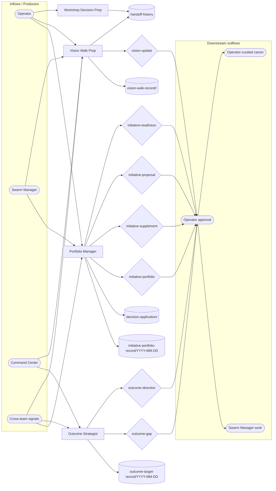

# Director Swarm Operating Model

**Status:** initial contract canon. This document defines how `director-swarm` works as a coherent system: portfolio hygiene, initiative interpretation, outcome gap routing, and morning vision-walk preparation.

The current document adopts the generic team operating-model shape from `path:docs/agent-system/OPERATING_GRAPHS.md`.

## Mission

Director Swarm keeps Vrooli's initiative portfolio flowing through Swarm Manager and surfaces outcome-driven strategy as Command Center comes online.

## Scope

Director Swarm owns:

- portfolio ranking criteria, initiative theme interpretation, and roadmap positioning;
- decision context preparation for new initiatives, initiative supplements, readiness judgments, outcome gaps, and vision drift;
- approved decision application where Swarm Manager tooling supports the exact action;
- outcome-category framing for Command Center and the gap-closure loop that turns missing metrics into capability work;
- morning vision-walk briefing across portfolio, monetization, marketing, meta-optimization, infra-health, and life-audit signals.

Director Swarm does not own:

- live initiative status, dependencies, backlog items, or execution evidence, which belong to Swarm Manager;
- operator-authored vision or architecture canon, which members may flag but not rewrite;
- monetization strategy, marketing strategy, scenario QA, infra-health reliability canon, or meta-optimization policy;
- deployment, external execution, code changes, or team deployment.

## Operating Loops

Director Swarm has four loops:

1. **Portfolio interpretation loop** - compare active and proposed work against [`../strategy/PORTFOLIO_PHILOSOPHY.md`](../strategy/PORTFOLIO_PHILOSOPHY.md), then propose bounded `initiative-portfolio`, `initiative-proposal`, `initiative-supplement`, or `initiative-readiness` decisions.
2. **Roadmap positioning loop** - keep [`../strategy/ROADMAP.md`](../strategy/ROADMAP.md) aligned with Swarm Manager's initiative set without duplicating live status.
3. **Outcome gap loop** - read Command Center gaps when available, use [`../evidence/OUTCOMES_CHARTER.md`](../evidence/OUTCOMES_CHARTER.md) for category framing, and raise `outcome-gap` or `outcome-direction` decisions.
4. **Vision-walk preparation loop** - compile read-only operator briefings and flag drift against `path:VISION.md` or `path:docs/concepts/ARCHITECTURE.md` through `vision-update`.

## Operating Graph

This graph is the team-level contract. It shows how operator direction, Swarm Manager state, Command Center metrics, and cross-team signals flow into director-swarm members, then out through approved decisions, knowledge records, and read-only handoffs.

<!-- prompt-manager-graph:
id: director-swarm-operating-model
scope: team
team: director-swarm
mode: contract
actor_alias.operator: external:operator
actor_alias.swarm manager: external:swarm-manager
actor_alias.command center: external:command-center
actor_alias.cross-team signals: external:cross-team-signals
-->


## Topic Catalog

| Topic family | Status | Owner / primary writer | Primary readers | Purpose |
|---|---|---|---|---|
| `topic:decision-application/<decision-id>` | live | `member:portfolio-manager` | `member:portfolio-manager` | Record exact accepted-decision application work and avoid duplicate application. |
| `topic:initiative-portfolio-record/YYYY-MM-DD` | live | `member:portfolio-manager` | `member:portfolio-manager`, `external:operator` | Snapshot portfolio interpretation against the ranking criteria. |
| `topic:outcome-target-record/YYYY-MM-DD` | live | `member:outcome-strategist` | `member:outcome-strategist`, `external:operator` | Snapshot outcome target or gap interpretation when Command Center evidence exists. |
| `topic:vision-walk-record/<date>/<slug>` | live | `member:vision-walk-prep` | `member:vision-walk-prep`, `external:operator` | Read-only morning vision-walk briefing material. |

## Decisions

| Decision context | Owner | Purpose | Expected evidence / trigger | Accepted effect |
|---|---|---|---|---|
| `initiative-portfolio` | `member:portfolio-manager` | Rank initiatives as active now, track, or defer. | Swarm Manager state, `topic:initiative-portfolio-record/YYYY-MM-DD`, or operator direction shows portfolio emphasis drift. | Updates Swarm Manager portfolio metadata or `path:docs/director-swarm/strategy/PORTFOLIO_PHILOSOPHY.md`. |
| `initiative-supplement` | `member:portfolio-manager` | Propose supporting backlog work under existing initiatives. | An existing initiative lacks a bounded supporting backlog item. | Creates or updates a Swarm Manager backlog item under the owning initiative. |
| `initiative-proposal` | `member:portfolio-manager` | Propose candidate new initiatives for operator approval. | A durable outcome needs multiple dependent backlog items under one shared outcome. | Creates a Swarm Manager initiative and may update `path:docs/director-swarm/strategy/ROADMAP.md`. |
| `initiative-readiness` | `member:portfolio-manager` | Judge whether backlog items are detailed enough to execute. | A backlog item is ambiguous, underspecified, or ready for execution. | Updates Swarm Manager backlog readiness or routes clarification to the operator. |
| `outcome-gap` | `member:outcome-strategist` | Request missing Command Center data pipelines or instrumentation. | Command Center exposes a `gap` metric or `path:docs/director-swarm/evidence/OUTCOMES_CHARTER.md` has an unresolved `pending-command-center` marker. | Creates capability work for Command Center or the owning implementation team. |
| `outcome-direction` | `member:outcome-strategist` | Recommend a portfolio emphasis change from measured outcome evidence. | Measured Command Center data shows a material portfolio misalignment. | Updates portfolio emphasis through Swarm Manager or `path:docs/director-swarm/strategy/PORTFOLIO_PHILOSOPHY.md`. |
| `vision-update` | `member:vision-walk-prep` | Surface operator-north-star or architecture drift without editing canon directly. | A proposed direction conflicts with `path:VISION.md` or `path:docs/concepts/ARCHITECTURE.md`. | Routes an operator-authored update to `path:VISION.md`, `path:docs/concepts/ARCHITECTURE.md`, or rejects the drifting proposal. |

## External Inputs / Triggers

| Producer / trigger | Entry surface | Drainer | Routing rule |
|---|---|---|---|
| `external:operator` | `decision:initiative-portfolio`, `decision:initiative-proposal`, `decision:vision-update` | `member:portfolio-manager`, `member:vision-walk-prep` | Operator direction can seed portfolio or vision decisions, but accepted effects still require approval. |
| `external:swarm-manager` | `topic:initiative-portfolio-record/YYYY-MM-DD` | `member:portfolio-manager` | Live initiative state informs portfolio interpretation; do not copy live status into the PoR. |
| `external:command-center` | `topic:outcome-target-record/YYYY-MM-DD`, `decision:outcome-gap` | `member:outcome-strategist` | Metric gaps route to outcome-gap decisions; measured outcome evidence may route to outcome-direction. |
| `external:cross-team-signals` | `topic:vision-walk-record/<date>/<slug>` | `member:vision-walk-prep` | Cross-team signals become read-only briefing material unless a specific owner raises a decision. |

## Outputs / Downstream Consumers

| Output | Surface | Consumer | Purpose |
|---|---|---|---|
| Approved initiative decisions | `decision:initiative-portfolio`, `decision:initiative-proposal`, `decision:initiative-supplement`, `decision:initiative-readiness` | `external:operator`, `external:swarm-manager` | Move portfolio work into accepted Swarm Manager state. |
| Approved outcome-gap decisions | `decision:outcome-gap`, `decision:outcome-direction` | `external:operator`, `external:command-center`, owning implementation teams | Turn missing or surprising metrics into routed capability work. |
| Vision-walk handoffs | `topic:vision-walk-record/<date>/<slug>`, handoff history | `external:operator` | Prepare morning review without changing canon directly. |
| Operator-curated PoR updates | `path:docs/director-swarm/` | `member:portfolio-manager`, `member:outcome-strategist`, `member:vision-walk-prep` | Keep durable strategy and evidence canon aligned after approval. |

## Feedback / Capability Improvement Loop

1. `member:portfolio-manager` compares Swarm Manager state with `topic:initiative-portfolio-record/YYYY-MM-DD` and raises `decision:initiative-portfolio` when strategy and live portfolio diverge.
2. `member:outcome-strategist` checks Command Center gaps against `topic:outcome-target-record/YYYY-MM-DD` and raises `decision:outcome-gap` when a missing metric blocks outcome judgment.
3. `member:vision-walk-prep` consolidates cross-team signals into `topic:vision-walk-record/<date>/<slug>` and raises `decision:vision-update` only when the operator north star or architecture canon needs review.
4. Accepted decisions update Swarm Manager, Command Center capability work, or `path:docs/director-swarm/` canon; rejected decisions remain evidence for future review.

## Current Implementation Gaps

- `external:command-center` still has `pending-command-center` surfaces, so target-state is for `member:outcome-strategist` to consume live metric gaps rather than placeholder evidence.
- `path:docs/director-swarm/manifest.json` is present, but target-state is for prompt-manager PoR manifest validation to run automatically against this folder.
- `path:docs/director-swarm/operating/OPERATING_MODEL.md` is newly documented, and target-state is clean validate, diff, and coverage output once graph tooling consumes this team id.

## Adoption / Validation

```bash
prompt-manager graph operating-model validate --team director-swarm --id director-swarm-operating-model
prompt-manager graph operating-model diff --team director-swarm --id director-swarm-operating-model
prompt-manager graph operating-model coverage --team director-swarm --id director-swarm-operating-model
```
