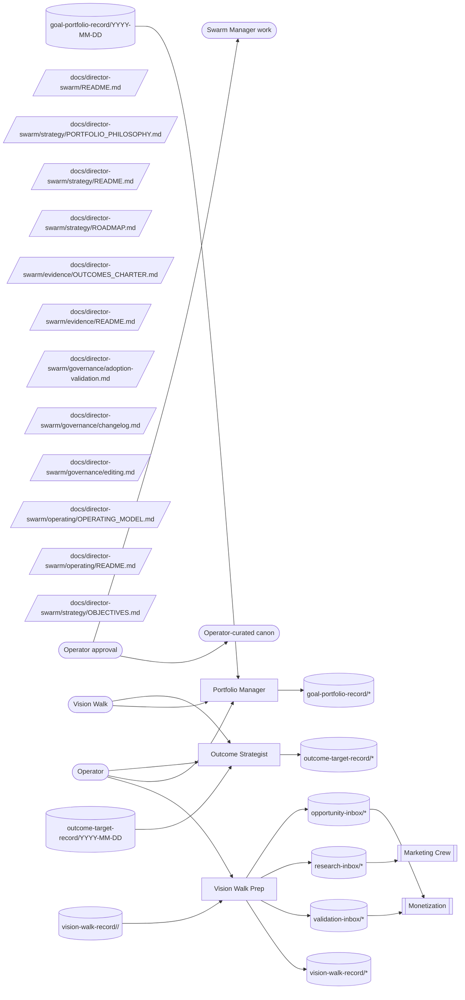

# Director Swarm Operating Model

**Status:** contract canon. This document defines how `director-swarm` works as a coherent system: portfolio hygiene, goal interpretation, outcome gap routing, prediction calibration, and morning vision-walk preparation.

**Loop status:** paused — recorded in the heartbeat control plane as `paused-manual` on 2026-07-24 (resume via `prompt-manager team heartbeat-control director-swarm resume`). Current-state values across this PoR reflect the pause, not loop failure. On resume, the first heartbeat follows the resume protocol in `portfolio-manager/HEARTBEAT.md`.

The current document adopts the generic team operating-model shape from `path:docs/agent-system/OPERATING_GRAPHS.md`.

Durable corpus belongs to the Source Ledger scope team:director-swarm. Members file each actionable finding once through the unified Swarm Manager work feed; operator disposition is read from that same work item.
## Mission

Director Swarm keeps Vrooli's goal portfolio flowing through Swarm Manager and surfaces outcome-driven strategy from Command Center's measured outcomes and gaps registry.

**Objectives served.** `I1` — capability compounding. `I3` — enablement, as **ranking authority only** (resolved by operator decision 2026-08-09): `member:portfolio-manager` applies the instrument rule ([`../strategy/PORTFOLIO_PHILOSOPHY.md`](../strategy/PORTFOLIO_PHILOSOPHY.md) §"The instrument rule") so a goal producing a sensor, measurement surface, or actuator borrows the band of the highest-ranked goal it unblocks. Detection of missing instruments is **not** this team's lane — it stays distributed across every team's friction reporting and `capability-work` filing, and `team:meta-optimization` drains the inbox. `I3` is scored by the `no-sensor` target count in `prompt-manager graph audit`, trending down.

This team also **owns the objective set itself** ([`../strategy/OBJECTIVES.md`](../strategy/OBJECTIVES.md)): it curates the operator's stated intent, holds the coverage rule that joins objectives to the team roster, and raises `outcome-direction` or `capability-work` work items when coverage reports a hole. Owning the file does not mean authoring the objectives — those are operator-authored.

**Outcome contribution.** Primary: **The Forge** (engineering velocity) — goal throughput and backlog burn-down are direct portfolio outputs — and **Panorama** (aggregate view), where this team owns cross-category composition and the capability gaps blocking outcome visibility. Supporting: **The Hive**, by deciding which scenarios receive attention. The swarm-tier map of which team moves which outcome lives in [`../evidence/OUTCOMES_CHARTER.md`](../evidence/OUTCOMES_CHARTER.md) §"Team contribution map"; this paragraph is this team's own statement of it.

## Scope

Director Swarm owns:

- portfolio ranking criteria, goal theme interpretation, and roadmap positioning;
- work-routing contract preparation for new goals, goal supplements, readiness judgments, outcome gaps, and vision drift;
- approved work item application where Swarm Manager tooling supports the exact action;
- outcome-category framing for Command Center, the gap-closure loop that turns missing metrics into capability work, and the prediction ledger that scores past portfolio work items against measured outcomes;
- routing of cross-team `capability-work` work items into goal or backlog proposals;
- morning vision-walk briefing across portfolio, monetization, marketing, meta-optimization, infra-health, and life-audit signals.

Director Swarm does not own:

- live goal status, milestones, dependencies, backlog items, or execution evidence, which belong to Swarm Manager (see `path:scenarios/swarm-manager/docs/concepts/OPERATOR-JOURNEYS.md` for the operator loop this team feeds);
- operator-authored vision or architecture canon, which members may flag but not rewrite;
- monetization strategy, marketing strategy, scenario QA, infra-health reliability canon, or meta-optimization policy;
- deployment, external execution, code changes, or team deployment.

## The Portfolio Control Loop

The portfolio loop is the team's reason to exist, so its architecture is stated plainly: today it runs open-loop — steering comes forward from `path:docs/director-swarm/strategy/PORTFOLIO_PHILOSOPHY.md` and operator taste, and nothing feeds back how past portfolio work items turned out. The prediction ledger in `path:docs/director-swarm/evidence/OUTCOMES_CHARTER.md` §"Prediction ledger" is the error signal that closes it: portfolio work items carry falsifiable predictions, `outcome-strategist` scores matured predictions against measured evidence, and systematic misprediction becomes the evidence trail for revising the ranking criteria themselves. Until Command Center exposes stable metrics, the scoring side is sparse by design — predictions are still recorded from day one so a scoreable cohort exists when the sensors arrive.

## Operating Loops

Director Swarm has four loops:

1. **Portfolio interpretation loop** - compare active and proposed work against [`../strategy/PORTFOLIO_PHILOSOPHY.md`](../strategy/PORTFOLIO_PHILOSOPHY.md), then propose bounded `goal-portfolio`, `goal-proposal`, `goal-supplement`, or `goal-readiness` work items, each carrying its required prediction block. Apply the instrument rule in this loop: when a goal's output is an instrument, name the goal it unblocks, propose the borrowed band as a `goal-portfolio` decision, and model the relationship as a Swarm Manager dependency so sequencing follows from the existing algorithm rather than from a second ranking authority.
2. **Roadmap positioning loop** - keep [`../strategy/ROADMAP.md`](../strategy/ROADMAP.md) aligned with Swarm Manager's goal set without duplicating live status: the roadmap holds `goal:` typed references plus theme and positioning only, and each `member:portfolio-manager` heartbeat diffs live goal names against those references, proposing a bounded `goal-portfolio` work item on any delta.
3. **Outcome and calibration loop** - read Command Center gaps when available, use [`../evidence/OUTCOMES_CHARTER.md`](../evidence/OUTCOMES_CHARTER.md) for category framing, score matured predictions, and raise `outcome-gap` or `outcome-direction` work items.
4. **Vision-walk preparation loop** - compile read-only operator briefings, state the self-improvement loop ladder honestly, and flag drift against `path:VISION.md` or `path:docs/concepts/ARCHITECTURE.md` through `vision-update`.

## Operating Graph

This graph is the team-level contract. It shows how operator direction and vision-walk sessions flow into director-swarm members, then out through approved work items, knowledge records, and read-only handoffs.

<!-- prompt-manager-graph:
id: director-swarm-operating-model
scope: team
team: director-swarm
mode: contract
actor_alias.operator: external:operator
actor_alias.vision walk: external:vision-walk
-->

Swarm Manager goal state and Command Center metrics are tool-read surfaces, not knowledge producers: members inspect them directly (`swarm-manager goals context`, Command Center `/api/v1/gaps`) and never copy live status into the PoR.

## Topic Catalog

| Topic family | Status | Owner / primary writer | Primary readers | Purpose |
|---|---|---|---|---|
| `topic:goal-portfolio-record/*` | live | member:portfolio-manager | member:portfolio-manager | Snapshot portfolio interpretation against the ranking criteria. |
| `topic:goal-portfolio-record/YYYY-MM-DD` | live | member:portfolio-manager | member:portfolio-manager | Snapshot portfolio interpretation against the ranking criteria. |
| `topic:opportunity-inbox/*` | live | member:vision-walk-prep |  | Route vision-walk revenue-opportunity signal into the monetization opportunity queue for that team's drainer to classify. |
| `topic:outcome-target-record/*` | live | member:outcome-strategist | member:outcome-strategist | Snapshot outcome target, gap, or prediction-score interpretation when Command Center evidence exists. |
| `topic:outcome-target-record/YYYY-MM-DD` | live | member:outcome-strategist | member:outcome-strategist | Snapshot outcome target, gap, or prediction-score interpretation when Command Center evidence exists. |
| `topic:research-inbox/*` | live | member:vision-walk-prep |  | Route vision-walk research signal into the marketing research queue for that team's drainer to classify. |
| `topic:validation-inbox/*` | live | member:vision-walk-prep |  | Route vision-walk demand-validation signal into the monetization validation queue for that team's drainer to classify. |
| `topic:vision-walk-record/*` | live | member:vision-walk-prep | member:vision-walk-prep | Read-only morning vision-walk briefing material. |
| `topic:vision-walk-record/<date>/<slug>` | live | member:vision-walk-prep | member:vision-walk-prep | Read-only morning vision-walk briefing material. |

## External Inputs / Triggers

| Producer / trigger | Entry surface | Drainer | Routing rule |
|---|---|---|---|
| Operator | direct member context, `external:swarm-manager-work` | portfolio-manager, outcome-strategist, vision-walk-prep | Operator direction can seed portfolio or vision work items, but accepted effects still require approval. |
| Vision walk | direct member context | portfolio-manager, outcome-strategist | Morning-walk conclusions seed bounded work items; the walk itself never mutates state directly. |

## Outputs / Downstream Consumers

| Output | Surface | Consumer | Purpose |
|---|---|---|---|
| Approved goal work items | `external:swarm-manager-work` | operator, `external:swarm-manager-work` | Move portfolio work into accepted Swarm Manager state. |
| Approved outcome work items | `external:swarm-manager-work` | operator, `external:swarm-manager-work` | Turn missing or surprising metrics into routed capability work. |
| Vision-walk briefings | `topic:vision-walk-record/<date>/<slug>` | operator | Prepare morning review without changing canon directly. |
| Cross-team vision-walk signal | `topic:research-inbox/*`, `topic:opportunity-inbox/*`, `topic:validation-inbox/*` | `team:marketing-crew`, `team:monetization` | Hand vision-walk signal to the peer team that owns the domain, so the receiving drainer classifies it under its own taxonomy. |
| Prediction calibration evidence | `topic:outcome-target-record/YYYY-MM-DD`, `path:docs/director-swarm/strategy/PORTFOLIO_PHILOSOPHY.md`, `path:docs/director-swarm/evidence/OUTCOMES_CHARTER.md` | operator, portfolio-manager | Feed scored predictions back into ranking-criteria revisions through approved work items. |

## Feedback / Capability Improvement Loop

1. `member:portfolio-manager` compares Swarm Manager state with `topic:goal-portfolio-record/YYYY-MM-DD` and raises Swarm Manager work item (goal-portfolio) when strategy and live portfolio diverge, attaching the required prediction block.
2. `member:outcome-strategist` checks Command Center gaps against `topic:outcome-target-record/YYYY-MM-DD` and raises Swarm Manager work item (outcome-gap) when a missing metric blocks outcome judgment.
3. `member:outcome-strategist` scores matured predictions from past portfolio work items against measured evidence and records hits, misses, and unmeasurables in `topic:outcome-target-record/YYYY-MM-DD`; systematic misprediction routes to Swarm Manager work item (outcome-direction) proposing a ranking-criteria revision.
4. `member:vision-walk-prep` consolidates cross-team signals into `topic:vision-walk-record/<date>/<slug>` and raises Swarm Manager work item (vision-update) only when the operator north star or architecture canon needs review.
5. Accepted work items update Swarm Manager, Command Center capability work, or `path:docs/director-swarm/` canon; rejected work items remain evidence for future review.

## Current Implementation Gaps

- `external:command-center` still shows registry `gap`/`partial` for several outcome categories (see the Outcomes Charter §"Sensor map" for the per-category observation), so prediction scoring runs sparse: predictions are recorded on every qualifying work item now, and target-state is for `member:outcome-strategist` to score them against live Command Center metrics.
- Swarm Manager's goal-workflow tail is dead today (audited 2026-07-23: `POST /goals/{name}/workflow-runs/{id}/apply` has no production caller, and `add_item` proposals are rejected at goal scope), so goal `plan`/`discover`/`milestone-review` runs strand their proposals; `member:portfolio-manager` must treat goal creation and backlog creation as the only accepted effects that land, and target-state is a closed apply loop owned by the Swarm Manager workstream (`path:scenarios/swarm-manager/docs/concepts/OPERATOR-JOURNEYS.md` names the loop this restores).
- The command-center CLI exposes no `gaps` or `dashboards` verb, so sensor reads are raw HTTP against an on-demand scenario; target-state is a thin CLI sensor verb raised through Swarm Manager work item (outcome-gap).
- `goal:` references in `path:docs/director-swarm/strategy/ROADMAP.md` are validated only by the `member:portfolio-manager` heartbeat diff today; target-state is knowledge-observatory docs health resolving `goal:` markers against swarm-manager automatically (see `path:docs/reference/machine-readable-references.md` §"Validation Ownership").
- `path:docs/director-swarm/manifest.json` is present, but target-state is for prompt-manager PoR manifest validation to run automatically against this folder.
- Team heartbeats are paused; target-state is re-enabled heartbeats whose first pass follows the resume protocol in `portfolio-manager/HEARTBEAT.md`.
- `member:vision-walk-prep` declares cross-team inbox outputs (`research-inbox/*` to marketing-crew, `opportunity-inbox/*` and `validation-inbox/*` to monetization) that are deliberately absent from this team's contract graph; target-state keeps them owned by the receiving teams' topic catalogs, so the validator's declared-output warnings on them are accepted.

## Adoption / Validation

- `prompt-manager graph operating-model validate --team director-swarm --id director-swarm-operating-model`
- `prompt-manager graph operating-model diff --team director-swarm --id director-swarm-operating-model`
- `prompt-manager graph operating-model coverage --team director-swarm --id director-swarm-operating-model`
