# SubroutineExecutor to Unified Execution Migration Guide

## Overview

This guide documents the migration of core execution logic from the legacy `SubroutineExecutor` class in `packages/shared/src/run/executor.ts` to the new unified execution architecture. The migration preserves all critical business logic while adapting it to work with the new 3-tier execution system.

## Current State Analysis

### Legacy SubroutineExecutor Architecture

The current `SubroutineExecutor` contains substantial business logic that must be preserved:

```mermaid
graph TB
    subgraph "Legacy SubroutineExecutor (executor.ts)"
        SubroutineExecutor[SubroutineExecutor<br/>🎯 Abstract base class<br/>📊 Complex business logic]
        
        subgraph "Core Business Logic"
            RoutineTypeDetection[Routine Type Detection<br/>📋 Single vs Multi-step<br/>🔍 Resource type analysis]
            IOMapping[I/O Mapping & Validation<br/>📝 Form structure analysis<br/>✅ Input requirements<br/>🔗 Standards integration]
            TestMode[Test Mode Support<br/>🧪 Dummy value generation<br/>💰 Zero-credit execution]
            ExecutionFlow[Execution Flow Control<br/>🔄 Manual vs Auto input gen<br/>✋ Manual execution confirmation<br/>📊 Status management]
        end
        
        subgraph "Step Orchestration"
            StepExecution[Step Execution<br/>🎯 Single-step routine execution<br/>🌿 Multi-step routine navigation<br/>⚡ Boundary event handling]
            ContextManagement[Context Management<br/>📊 Parent-child relationships<br/>🔄 Context inheritance<br/>📋 Variable mapping]
            ProgressTracking[Progress Tracking<br/>📈 Metrics updates<br/>🌿 Branch management<br/>📝 Step creation]
        end
    end
    
    SubroutineExecutor --> RoutineTypeDetection
    SubroutineExecutor --> IOMapping
    SubroutineExecutor --> TestMode
    SubroutineExecutor --> ExecutionFlow
    SubroutineExecutor --> StepExecution
    SubroutineExecutor --> ContextManagement
    SubroutineExecutor --> ProgressTracking
    
    classDef legacy fill:#ffebee,stroke:#c62828,stroke-width:2px
    classDef logic fill:#e8f5e8,stroke:#1b5e20,stroke-width:2px
    classDef orchestration fill:#e1f5fe,stroke:#01579b,stroke-width:2px
    
    class SubroutineExecutor legacy
    class RoutineTypeDetection,IOMapping,TestMode,ExecutionFlow logic
    class StepExecution,ContextManagement,ProgressTracking orchestration
```



### Key Legacy Components Requiring Migration

#### 1. **Core Execution Flow Logic** (`SubroutineExecutor.run()`)
- Manual vs automatic input generation
- Manual execution confirmation
- Test mode vs real execution
- Input validation and requirement checking
- Status management and branching

#### 2. **I/O Processing System**
- `buildIOMapping()` - Complex form analysis and standards integration
- `findElementStructure()` - Converting form elements to LLM structures
- Input requirement validation
- Default value handling

#### 3. **Test Mode Infrastructure**
- `generateDummyValue()` - Type-aware dummy value generation
- `dummyRun()` - Zero-credit execution simulation

#### 4. **Step Execution Orchestration** (`executeStep()`)
- Single-step vs multi-step routine handling
- Navigator integration for graph traversal
- Context preparation and mapping
- Boundary event handling
- Error management and runtime events

#### 5. **Context and Progress Management**
- `updateRunAfterStep()` - Critical run progress updates
- Context inheritance and merging
- Branch creation and management
- Metrics tracking and credit accounting

## Target Architecture Integration

### New Unified Execution System

```mermaid
graph TB
    subgraph "Target Unified Execution Architecture"
        direction TB
        
        subgraph "Tier 3: Execution Strategies"
            UEE[UnifiedExecutionEngine<br/>🎯 Strategy coordinator<br/>📊 Context management]
            
            ReasoningStrategy[ReasoningStrategy<br/>🧠 AI reasoning<br/>🔍 Meta-cognitive]
            DeterministicStrategy[DeterministicStrategy<br/>⚙️ Structured execution<br/>✅ Reliable processes]
            ConversationalStrategy[ConversationalStrategy<br/>💬 Multi-turn AI<br/>🤝 Interactive]
        end
        
        subgraph "Enhanced Execution Components"
            RoutineExecutor[RoutineExecutor<br/>🎯 Routine-specific logic<br/>📊 Migrated business logic]
            IOProcessor[IOProcessor<br/>📝 Form analysis<br/>🔗 Standards integration]
            TestExecutor[TestExecutor<br/>🧪 Test mode support<br/>💰 Zero-credit simulation]
            ContextManager[ContextManager<br/>📊 Context lifecycle<br/>🔄 Inheritance management]
        end
        
        subgraph "Integration Layer"
            EnhancedSubroutineExecutor[EnhancedSubroutineExecutor<br/>🔗 RunStateMachine bridge<br/>📊 Legacy compatibility]
        end
    end
    
    UEE --> ReasoningStrategy
    UEE --> DeterministicStrategy
    UEE --> ConversationalStrategy
    
    ReasoningStrategy --> RoutineExecutor
    DeterministicStrategy --> RoutineExecutor
    ConversationalStrategy --> RoutineExecutor
    
    RoutineExecutor --> IOProcessor
    RoutineExecutor --> TestExecutor
    RoutineExecutor --> ContextManager
    
    EnhancedSubroutineExecutor --> UEE
    
    classDef unified fill:#e8f5e8,stroke:#1b5e20,stroke-width:3px
    classDef strategy fill:#f3e5f5,stroke:#4a148c,stroke-width:2px
    classDef component fill:#fff3e0,stroke:#e65100,stroke-width:2px
    classDef integration fill:#e1f5fe,stroke:#01579b,stroke-width:2px
    
    class UEE unified
    class ReasoningStrategy,DeterministicStrategy,ConversationalStrategy strategy
    class RoutineExecutor,IOProcessor,TestExecutor,ContextManager component
    class EnhancedSubroutineExecutor integration
```



## Migration Plan

### Phase 1: Core Component Extraction

#### Step 1.1: Create RoutineExecutor Component
**Goal**: Extract core routine execution logic into a dedicated component

```typescript
// NEW: packages/server/src/services/execution/routineExecutor.ts
export class RoutineExecutor {
    constructor(
        private ioProcessor: IOProcessor,
        private testExecutor: TestExecutor,
        private contextManager: ContextManager,
        private logger: PassableLogger,
    ) {}

    /**
     * Migrated from SubroutineExecutor.run()
     * Main execution flow for single-step routines
     */
    async executeRoutine(
        context: ExecutionContext,
        strategy: ExecutionStrategy,
    ): Promise<ExecutionResult> {
        // Determine routine type
        if (this.isMultiStepRoutine(context.routine)) {
            throw new Error("Multi-step routines should be handled by navigation");
        }

        // Build I/O mapping (migrated from buildIOMapping)
        const ioMapping = await this.ioProcessor.buildIOMapping(
            context.routine,
            context.ioMapping,
            this.logger,
        );

        // Check missing inputs and handle generation strategy
        const missingInputs = this.ioProcessor.findMissingRequiredInputs(ioMapping);
        
        if (missingInputs.length > 0) {
            return await this.handleMissingInputs(context, ioMapping, missingInputs, strategy);
        }

        // Check manual execution confirmation
        if (context.config.decisionConfig.subroutineExecution === "Manual") {
            return await this.handleManualExecutionConfirmation(context, ioMapping);
        }

        // Execute routine (test mode or real execution)
        if (context.config.testMode) {
            return await this.testExecutor.executeTestMode(ioMapping);
        } else {
            return await strategy.executeRoutine(context, ioMapping);
        }
    }

    // Migrated utility methods
    private isSingleStepRoutine(routine: ResourceVersion): boolean { /* ... */ }
    private isMultiStepRoutine(routine: ResourceVersion): boolean { /* ... */ }
    private async handleMissingInputs(...): Promise<ExecutionResult> { /* ... */ }
    private async handleManualExecutionConfirmation(...): Promise<ExecutionResult> { /* ... */ }
}
```

#### Step 1.2: Create IOProcessor Component
**Goal**: Extract I/O mapping and validation logic

```typescript
// NEW: packages/server/src/services/execution/ioProcessor.ts
export class IOProcessor {
    /**
     * Migrated from SubroutineExecutor.buildIOMapping()
     * Complex form analysis and standards integration
     */
    async buildIOMapping(
        routine: ResourceVersion,
        providedInputs: IOMap,
        logger: PassableLogger,
    ): Promise<SubroutineIOMapping> {
        // Migrate all buildIOMapping logic
        const mapping: SubroutineIOMapping = { inputs: {}, outputs: {} };
        const parsedRoutine = RoutineVersionConfig.parse(routine, logger, { useFallbacks: true });
        
        // Process inputs with standards integration
        await this.processInputs(parsedRoutine, providedInputs, mapping);
        
        // Process outputs with standards integration  
        await this.processOutputs(parsedRoutine, providedInputs, mapping);
        
        return mapping;
    }

    /**
     * Migrated from SubroutineExecutor.findElementStructure()
     * Convert form elements to LLM-understandable structures
     */
    findElementStructure(
        formElement: FormInputType | undefined,
        io: InternalRoutineInputConfig | InternalRoutineOutputConfig,
    ): { defaultValue: unknown | undefined, props: SubroutineOutputDisplayInfoProps } {
        // Migrate all findElementStructure logic
        // ... complex form element analysis logic
    }

    findMissingRequiredInputs(ioMapping: SubroutineIOMapping): string[] {
        return Object.entries(ioMapping.inputs)
            .filter(([, input]) => input.isRequired && input.value === undefined)
            .map(([name]) => name);
    }

    // Additional utility methods for input validation
}
```

#### Step 1.3: Create TestExecutor Component
**Goal**: Extract test mode functionality

```typescript
// NEW: packages/server/src/services/execution/testExecutor.ts
export class TestExecutor {
    /**
     * Migrated from SubroutineExecutor.dummyRun()
     * Zero-credit execution simulation
     */
    async executeTestMode(ioMapping: SubroutineIOMapping): Promise<ExecutionResult> {
        const result: ExecutionResult = {
            success: true,
            ioMapping: { ...ioMapping },
            creditsUsed: BigInt(0),
            timeElapsed: 0,
            toolCallsCount: 0,
            metadata: { strategy: "test_mode" },
        };

        // Generate dummy inputs for required missing inputs
        for (const [key, input] of Object.entries(ioMapping.inputs)) {
            if (input.isRequired && input.value === undefined) {
                result.ioMapping.inputs[key] = {
                    ...input,
                    value: this.generateDummyValue(input),
                };
            }
        }

        // Generate dummy outputs
        for (const [key, output] of Object.entries(ioMapping.outputs)) {
            if (output.value === undefined) {
                result.ioMapping.outputs[key] = {
                    ...output,
                    value: this.generateDummyValue(output),
                };
            }
        }

        return result;
    }

    /**
     * Migrated from SubroutineExecutor.generateDummyValue()
     * Type-aware dummy value generation
     */
    private generateDummyValue(ioInfo: SubroutineInputDisplayInfo | SubroutineOutputDisplayInfo): unknown {
        // Migrate all generateDummyValue logic
        if (ioInfo.defaultValue !== undefined) return ioInfo.defaultValue;
        if (!ioInfo.props) return undefined;
        
        const { type } = ioInfo.props;
        switch (type) {
            case "Boolean": return true;
            case "Integer": return 0;
            case "Number": return 0;
            case "URL": return "https://example.com";
            default:
                if (type.startsWith("List of")) return [];
                if (type.startsWith("JSON")) return {};
                return "dummy_value";
        }
    }
}
```

### Phase 2: Strategy Implementation

#### Step 2.1: Implement DeterministicStrategy
**Goal**: Handle structured, reliable routine execution

```typescript
// NEW: packages/server/src/services/execution/strategies/deterministicStrategy.ts
export class DeterministicStrategy implements ExecutionStrategy {
    readonly name = "deterministic";

    constructor(
        private routineExecutor: RoutineExecutor,
        private toolRunner: ToolRunner,
        private logger: PassableLogger,
    ) {}

    async execute(dependencies: ExecutionDependencies): Promise<ExecutionResult> {
        const { context } = dependencies;
        
        // Use RoutineExecutor for core logic
        return await this.routineExecutor.executeRoutine(context, this);
    }

    /**
     * Strategy-specific routine execution
     * Handles API calls, data transformations, etc.
     */
    async executeRoutine(
        context: ExecutionContext,
        ioMapping: SubroutineIOMapping,
    ): Promise<ExecutionResult> {
        // Implementation depends on routine type and configuration
        // For deterministic execution:
        // 1. Validate all inputs strictly
        // 2. Execute API calls or code execution
        // 3. Return structured outputs
        
        // This is where the actual "work" happens that was previously
        // in the concrete SubroutineExecutor implementations
    }

    async estimateCost(context: ExecutionContext): Promise<bigint> {
        // Cost estimation for deterministic operations
        return BigInt(10); // Base cost for deterministic operations
    }
}
```

#### Step 2.2: Implement ReasoningStrategy
**Goal**: Handle AI reasoning and meta-cognitive processes

```typescript
// NEW: packages/server/src/services/execution/strategies/reasoningStrategy.ts
export class ReasoningStrategy implements ExecutionStrategy {
    readonly name = "reasoning";

    constructor(
        private routineExecutor: RoutineExecutor,
        private reasoningEngine: ReasoningEngine,
        private toolRunner: ToolRunner,
        private logger: PassableLogger,
    ) {}

    async execute(dependencies: ExecutionDependencies): Promise<ExecutionResult> {
        const { context } = dependencies;
        
        // Use RoutineExecutor for core flow, but with AI reasoning
        return await this.routineExecutor.executeRoutine(context, this);
    }

    /**
     * AI-powered routine execution with reasoning
     */
    async executeRoutine(
        context: ExecutionContext,
        ioMapping: SubroutineIOMapping,
    ): Promise<ExecutionResult> {
        // For reasoning execution:
        // 1. Use AI to understand the routine's purpose
        // 2. Generate inputs intelligently if missing
        // 3. Execute with reasoning and adaptation
        // 4. Use tools as needed
        // 5. Validate and format outputs
        
        return await this.reasoningEngine.executeWithReasoning(context, ioMapping);
    }

    async estimateCost(context: ExecutionContext): Promise<bigint> {
        // Cost estimation for AI reasoning (higher cost)
        const baseTokens = 1000; // Estimate based on routine complexity
        const costPerToken = BigInt(1); // Credits per token
        return BigInt(baseTokens) * costPerToken;
    }
}
```

### Phase 3: Step Execution Migration

#### Step 3.1: Enhanced Step Execution Logic
**Goal**: Migrate complex step execution from `SubroutineExecutor.executeStep()`

```typescript
// ENHANCED: packages/server/src/services/execution/unifiedSubroutineExecutor.ts
export class UnifiedSubroutineExecutor implements EnhancedSubroutineExecutor {
    constructor(
        private unifiedEngine: IUnifiedExecutionEngine,
        private strategyFactory: StrategyFactory,
        private routineExecutor: RoutineExecutor,
        private contextManager: ContextManager,
        private logger: PassableLogger,
    ) {}

    /**
     * Migrated and enhanced from SubroutineExecutor.executeStep()
     * Handles both single-step and multi-step routine execution
     */
    async executeStep(
        context: ExecutionContext,
        currentLocation: Location,
        dependencies: ExecutionDependencies,
    ): Promise<ExecutionResult> {
        const routine = context.routine;
        
        // Handle different routine types (migrated logic)
        if (routine.resourceSubType?.startsWith("Routine")) {
            if (this.routineExecutor.isSingleStepRoutine(routine)) {
                return await this.executeSingleStepRoutine(context, dependencies);
            } else {
                return await this.executeMultiStepRoutine(context, currentLocation, dependencies);
            }
        } else if (routine.resourceType === "Project") {
            return await this.executeProjectNavigation(context, dependencies);
        } else {
            throw new Error(`Unsupported routine type: ${routine.resourceSubType}`);
        }
    }

    /**
     * Execute single-step routine with strategy selection
     */
    private async executeSingleStepRoutine(
        context: ExecutionContext,
        dependencies: ExecutionDependencies,
    ): Promise<ExecutionResult> {
        // Select appropriate strategy
        const strategy = this.strategyFactory.selectStrategy(context.routine);
        
        // Execute using unified engine
        return await this.unifiedEngine.executeWithStrategy(strategy, context);
    }

    /**
     * Handle multi-step routine navigation (migrated from executeStep)
     */
    private async executeMultiStepRoutine(
        context: ExecutionContext,
        currentLocation: Location,
        dependencies: ExecutionDependencies,
    ): Promise<ExecutionResult> {
        // Migrate complex multi-step routine logic:
        // 1. Parse child graph configuration
        // 2. Get child navigator
        // 3. Prepare child context
        // 4. Get available start locations
        // 5. Handle deferred decisions
        // 6. Create new branches for navigation
        
        // This preserves all the complex BPMN navigation logic
    }
}
```

#### Step 3.2: Progress Tracking Migration
**Goal**: Migrate `updateRunAfterStep()` logic

```typescript
// ENHANCED: packages/server/src/services/execution/progressTracker.ts
export class ProgressTracker {
    /**
     * Migrated from SubroutineExecutor.updateRunAfterStep()
     * Critical run progress and metrics management
     */
    updateRunAfterExecution(
        run: RunProgress,
        branch: BranchProgress,
        executionResult: ExecutionResult,
        services: RunStateMachineServices,
    ): void {
        // Migrate all updateRunAfterStep logic:
        // 1. Update branch status
        // 2. Update credits spent
        // 3. Add/update step progress
        // 4. Handle deferred decisions
        // 5. Create new branches for multi-step routines
        // 6. Update subcontext with results
        // 7. Track metrics and complexity
    }

    /**
     * Migrated step creation logic
     */
    private createStepProgress(
        location: Location,
        routine: ResourceVersion | null,
        state: InitializedRunState,
    ): RunProgressStep {
        // Migrate createStepProgress logic
    }
}
```

### Phase 4: Context Integration

#### Step 4.1: Enhanced Context Management
**Goal**: Migrate context handling from SubroutineContextManager integration

```typescript
// ENHANCED: packages/server/src/services/execution/contextManager.ts
export class ContextManager {
    /**
     * Create ExecutionContext from RunStateMachine state
     */
    async createExecutionContext(
        run: RunProgress,
        branch: BranchProgress,
        routine: ResourceVersion,
        subcontext: SubroutineContext,
        userData: RunTriggeredBy,
        swarmContext?: SwarmContext,
    ): Promise<ExecutionContext> {
        // Build comprehensive ExecutionContext with:
        // 1. Routine information
        // 2. I/O mapping from subcontext
        // 3. Execution limits from run config
        // 4. Swarm context inheritance
        // 5. Current location and navigation state
    }

    /**
     * Update context after execution
     */
    updateContextAfterExecution(
        context: ExecutionContext,
        result: ExecutionResult,
    ): ExecutionContext {
        // Update context with execution results
        // Preserve important state for next steps
    }

    /**
     * Merge execution result back to subcontext
     */
    mergeResultToSubcontext(
        subcontext: SubroutineContext,
        result: ExecutionResult,
    ): SubroutineContext {
        // Integration with existing SubroutineContextManager
        // Preserve existing context merging logic
    }
}
```

### Phase 5: Integration and Testing

#### Step 5.1: Strategy Factory Implementation
**Goal**: Smart strategy selection based on routine configuration

```typescript
// NEW: packages/server/src/services/execution/strategies/strategyFactory.ts
export class StrategyFactory implements IStrategyFactory {
    constructor(
        private reasoningStrategy: ReasoningStrategy,
        private deterministicStrategy: DeterministicStrategy,
        private conversationalStrategy: ConversationalStrategy,
        private logger: PassableLogger,
    ) {}

    selectStrategy(routine: ResourceVersion): ExecutionStrategy {
        // Check routine configuration for explicit strategy
        const routineConfig = RoutineVersionConfig.parse(routine, this.logger);
        if (routineConfig.executionStrategy) {
            return this.getStrategyByName(routineConfig.executionStrategy);
        }

        // Auto-detect based on routine characteristics
        return this.autoDetectStrategy(routine);
    }

    private autoDetectStrategy(routine: ResourceVersion): ExecutionStrategy {
        // Analyze routine to determine best strategy:
        // - Check for API integrations -> Deterministic
        // - Check for reasoning requirements -> Reasoning  
        // - Check for user interaction -> Conversational
        // - Default based on complexity
        
        if (this.hasApiIntegrations(routine)) {
            return this.deterministicStrategy;
        }
        
        if (this.requiresReasoning(routine)) {
            return this.reasoningStrategy;
        }
        
        return this.deterministicStrategy; // Safe default
    }
}
```

#### Step 5.2: Backward Compatibility Layer
**Goal**: Ensure existing code continues to work

```typescript
// ENHANCED: packages/shared/src/run/executor.ts
export abstract class SubroutineExecutor {
    // Keep existing abstract methods for backward compatibility
    public abstract runSubroutine(...): Promise<...>;
    public abstract generateMissingInputs(...): Promise<...>;
    public abstract estimateCost(...): Promise<string>;

    // Mark old methods as deprecated but keep them working
    /** @deprecated Use UnifiedExecutionEngine instead */
    public async executeStep(...): Promise<ExecuteStepResult> {
        // Delegate to new system if available, otherwise use legacy
        if (this.hasUnifiedEngine()) {
            return this.delegateToUnifiedEngine(...);
        }
        return this.legacyExecuteStep(...);
    }

    /** @deprecated Use UnifiedExecutionEngine instead */
    public updateRunAfterStep(...): void {
        // Delegate to new ProgressTracker if available
    }

    // Keep all utility methods that are still useful
    public isSingleStepRoutine(resource: ResourceVersion): boolean { /* ... */ }
    public isMultiStepRoutine(resource: ResourceVersion): boolean { /* ... */ }
    // ... other utility methods
}
```

## Implementation Timeline

### Phase 1: Foundation (2-3 weeks)
- Extract RoutineExecutor, IOProcessor, TestExecutor components
- Migrate core business logic
- Create comprehensive unit tests

### Phase 2: Strategy Implementation (2-3 weeks)  
- Implement DeterministicStrategy with migrated logic
- Implement ReasoningStrategy with AI integration
- Create ConversationalStrategy foundation

### Phase 3: Step Execution (3-4 weeks)
- Migrate complex executeStep logic
- Implement multi-step routine handling
- Migrate progress tracking and context management

### Phase 4: Integration (2-3 weeks)
- Complete strategy factory implementation
- Ensure backward compatibility
- Integration testing with RunStateMachine

### Phase 5: Testing & Validation (1-2 weeks)
- Comprehensive testing of all execution paths
- Performance testing and optimization
- Documentation and migration verification

**Total Estimated Duration**: 10-15 weeks

## Migration Priorities

### High Priority (Must Migrate)
1. **Core execution flow** (`SubroutineExecutor.run()`) - Critical business logic
2. **I/O mapping and validation** - Essential for routine execution
3. **Test mode functionality** - Required for development and testing
4. **Step execution orchestration** - Core to RunStateMachine integration
5. **Context and progress management** - Critical for state consistency

### Medium Priority (Should Migrate)
1. **Boundary event handling** - Important for BPMN compliance
2. **Navigation integration** - Required for multi-step routines
3. **Error handling and recovery** - Important for robustness
4. **Manual execution flows** - User interaction features

### Lower Priority (Can Enhance Later)
1. **Performance optimizations** - Can be improved incrementally
2. **Advanced strategy selection** - Can start with simple rules
3. **Extended test coverage** - Can be expanded over time

## Success Criteria

### Functional Requirements
- [ ] All existing routine execution scenarios work correctly
- [ ] Test mode continues to function with zero credits
- [ ] Manual input generation and execution confirmation work
- [ ] Multi-step routine navigation works correctly
- [ ] Context inheritance and merging work properly
- [ ] Progress tracking and metrics are accurate

### Technical Requirements  
- [ ] Code is properly modularized into logical components
- [ ] Strategy pattern is fully implemented
- [ ] Backward compatibility is maintained
- [ ] Performance is equivalent or better than legacy system
- [ ] Comprehensive test coverage exists

### Integration Requirements
- [ ] RunStateMachine integration works seamlessly
- [ ] Swarm context flows correctly into routine execution
- [ ] State synchronization works bidirectionally
- [ ] Credit and resource tracking is accurate across tiers

This migration represents a significant architectural improvement while preserving all critical business logic. The modular approach ensures that the migration can be done incrementally with thorough testing at each phase. 