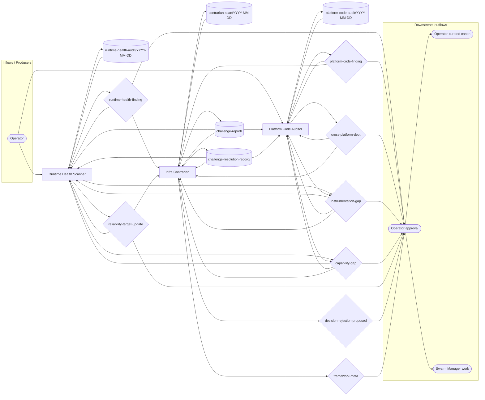

# Infra Health Operating Model

**Status:** initial contract canon. This document defines how `infra-health` turns runtime signals, platform-code audits, and contrarian review into operator-routed reliability work.

The current document adopts the generic team operating-model shape from `path:docs/agent-system/OPERATING_GRAPHS.md`.

## Mission

Infra Health protects Vrooli's local platform by turning runtime signals, internal platform-code audits, instrumentation gaps, and cross-platform assumptions into durable findings the operator can act on.

## Scope

Infra Health owns:

- aggregate reliability signals from autoheal, system-monitor, lifecycle history, and durable incident records;
- internal Vrooli platform-code audit findings for CLI, setup, lifecycle, harness, infra scripts, and repo-contract surfaces;
- reliability targets and honesty-flagged current-state interpretation;
- instrumentation gaps that block measured findings;
- cross-platform debt for tier-2+ deployment planning;
- contrarian review of infra-health decisions and stale decision hygiene.

Infra Health does not own:

- per-scenario code quality, which belongs to scenario-qa;
- skill, agent, and prompt optimization, which belongs to meta-optimization;
- live incident response or privileged remediation, which belongs to system-monitor, autoheal, agent-manager, and the operator;
- external observability dashboards;
- direct platform code changes.

## Operating Loops

Infra Health has three loops:

1. **Runtime health loop** - `runtime-health-scanner` selects one signal per heartbeat, checks repeat failures, heal loops, slow restarts, and investigation clusters, then raises bounded runtime or reliability-target decisions.
2. **Platform code audit loop** - `platform-code-auditor` audits one internal platform slice against architecture, security, coverage, documentation, cross-platform readiness, feedback surfaces, and instrumentation gaps.
3. **Contrarian hygiene loop** - `infra-contrarian` challenges pending decisions against the failure-mode rubric, runs stale decision review, and proposes framework-meta updates only when the team contract itself needs repair.

## Operating Graph

This graph is the team-level contract. It shows the runtime-declared relationships for infra-health: operator-seeded work, member-owned evidence topics, decision ownership, challenge review, and downstream routing.

<!-- prompt-manager-graph:
id: infra-health-operating-model
scope: team
team: infra-health
mode: contract
actor_alias.operator: external:operator
actor_alias.decision owners: none
-->


## Topic Catalog

| Topic family | Status | Owner / primary writer | Primary readers | Purpose |
|---|---|---|---|---|
| `topic:runtime-health-audit/YYYY-MM-DD` | live | runtime-health-scanner | runtime-health-scanner | Snapshot one runtime-health signal or quiet-day review. |
| `topic:platform-code-audit/YYYY-MM-DD` | live | platform-code-auditor | platform-code-auditor | Snapshot one internal platform-code audit slice. |
| `topic:contrarian-scan/YYYY-MM-DD` | live | infra-contrarian | infra-contrarian | Stale decision and failure-mode review snapshot. |
| `topic:challenge-report/<decision-id>` | live | infra-contrarian | runtime-health-scanner, platform-code-auditor, infra-contrarian | Append-only challenge against a pending infra-health decision. |
| `topic:challenge-resolution-record/<decision-id>` | live | infra-contrarian | runtime-health-scanner, platform-code-auditor, infra-contrarian | Latest-state record for an infra-health challenge. |

## Decisions

| Decision context | Owner | Purpose | Expected evidence / trigger | Accepted effect |
|---|---|---|---|---|
| `runtime-health-finding` | runtime-health-scanner | Route an aggregate runtime pattern to operator review. | Repeat failure, heal loop, slow restart trend, investigation cluster, or quiet-day finding. | Downstream swarm-manager work is created, reliability interpretation is updated, or no-action evidence is recorded. |
| `platform-code-finding` | platform-code-auditor | Route an internal platform-code quality or reliability finding. | One audited slice shows a material architecture, security, coverage, documentation, feedback, or reliability issue. | Downstream Swarm Manager fix, chore, or execute backlog work is created or the finding is rejected with evidence. |
| `cross-platform-debt` | platform-code-auditor | Record a platform assumption that matters for tier-2+ deployment. | Source inspection or measured target-platform run shows a Linux-only or host-specific assumption. | `path:docs/infra-health/evidence/CROSS_PLATFORM_LEDGER.md` is updated or tier-activated work is created. |
| `instrumentation-gap` | runtime-health-scanner, platform-code-auditor | Name a missing stat or signal that blocked a finding. | A finding cannot become measured because no structured event, CLI, report, or history exists. | `path:docs/infra-health/evidence/INSTRUMENTATION_ROADMAP.md` is updated or downstream capability work is routed. |
| `capability-gap` | runtime-health-scanner, platform-code-auditor | Request a missing CLI verb, scenario, or tool capability. | A team member or director-swarm cannot perform required infra-health work with current tools. | Gap routes to director-swarm, Swarm Manager, or downstream implementation work. |
| `reliability-target-update` | runtime-health-scanner | Adjust a reliability target based on baseline evidence. | 30+ days of measured data show the target should tighten or loosen for non-temporary reasons. | `path:docs/infra-health/strategy/RELIABILITY_TARGETS.md` is updated. |
| `decision-rejection-proposed` | infra-contrarian | Recommend rejecting or revising a pending infra-health decision. | Failure-mode review finds alarm noise, polishing, premature cross-platform work, instrumentation sprawl, target drift, scope creep, or measurement gaps. | Decision is rejected, revised, superseded, or retained with explicit evidence. |
| `framework-meta` | infra-contrarian | Update infra-health rubric, triage ladder, or decision discipline. | Repeated review shows the operating contract itself is wrong or underspecified. | Operating model, governance docs, team config, or future manifest entries are updated. |

## External Inputs / Triggers

| Producer / trigger | Entry surface | Drainer | Routing rule |
|---|---|---|---|
| Operator | direct member context for runtime or platform-code work | runtime-health-scanner, platform-code-auditor | Operator direction can seed work, but accepted effects still require decision flow. |
| Runtime health evidence | `topic:runtime-health-audit/YYYY-MM-DD` or `runtime-health-finding` | runtime-health-scanner | Repeat failures, heal loops, slow restarts, and investigation clusters route to runtime findings or instrumentation gaps. |
| Platform-code evidence | `topic:platform-code-audit/YYYY-MM-DD` or `platform-code-finding` | platform-code-auditor | One internal platform slice is audited per heartbeat; no direct code edits. |
| Challenge evidence | `topic:challenge-report/<decision-id>` and `topic:challenge-resolution-record/<decision-id>` | decision owners and infra-contrarian | Decision owners read challenge evidence before defending or revising infra-health decisions. |

## Outputs / Downstream Consumers

| Output | Surface | Consumer | Purpose |
|---|---|---|---|
| Runtime findings | `runtime-health-finding`, `runtime-health-audit/*` | runtime-health-scanner, infra-contrarian, Swarm Manager via decisions | Turn aggregate runtime patterns into routed work or no-action evidence. |
| Platform-code findings | `platform-code-finding`, `platform-code-audit/*` | platform-code-auditor, infra-contrarian, Swarm Manager via decisions | Route internal platform quality issues without direct code mutation. |
| Instrumentation gaps | `instrumentation-gap` decisions | operator, director-swarm, Swarm Manager, owning scenarios | Convert missing stats into implementation work. |
| Capability gaps | `capability-gap` decisions | operator, director-swarm, Swarm Manager, owning scenarios | Convert missing tools or scenario capabilities into implementation work. |
| Portability ledger updates | `cross-platform-debt`, `path:docs/infra-health/evidence/CROSS_PLATFORM_LEDGER.md` | platform-code-auditor, deployment planning | Keep future tier risk visible without prematurely blocking current work. |
| Challenge evidence | `challenge-report/*`, `challenge-resolution-record/*` | infra-health decision owners and operator | Prevent weak infra-health findings from becoming unchallenged work. |

## Feedback / Capability Improvement Loop

1. `member:runtime-health-scanner` searches for one material runtime signal and raises a finding only when the signal has evidence and a bounded consequence.
2. `member:platform-code-auditor` audits one internal platform slice and raises a finding only when the affected surface and owner are concrete.
3. `member:infra-contrarian` reviews pending decisions against failure modes and records challenges or quiet scans.
4. Accepted `runtime-health-finding`, `platform-code-finding`, `instrumentation-gap`, `capability-gap`, `cross-platform-debt`, or `reliability-target-update` decisions update Swarm Manager work, capability roadmaps, reliability targets, cross-platform ledger entries, or operating canon.
5. When a capability ships, the follow-up `instrumentation-gap` or `reliability-target-update` decision updates the affected PoR evidence, active prompts, and migration markers together.

## Current Implementation Gaps

- `path:docs/infra-health/manifest.json` is present, but target-state is for prompt-manager PoR manifest validation to run automatically against this folder.
- Many reliability values remain `pending-telemetry` until the instrumentation roadmap closes enough gaps to produce measured baselines.
- `path:docs/infra-health/operating/OPERATING_MODEL.md` is newly documented, and target-state is clean validate, diff, and coverage output once graph tooling consumes this team id.

## Adoption / Validation

```bash
prompt-manager graph operating-model validate --team infra-health --id infra-health-operating-model
prompt-manager graph operating-model diff --team infra-health --id infra-health-operating-model
prompt-manager graph operating-model coverage --team infra-health --id infra-health-operating-model
```

- `prompt-manager graph operating-model validate --team infra-health --id infra-health-operating-model`
- `prompt-manager graph operating-model diff --team infra-health --id infra-health-operating-model`
- `prompt-manager graph operating-model coverage --team infra-health --id infra-health-operating-model`
