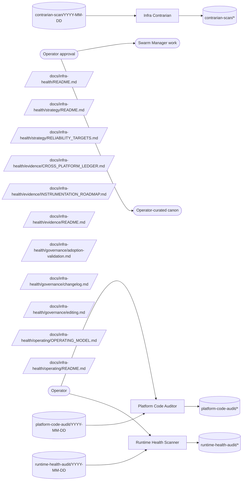

# Infra Health Operating Model

**Status:** initial contract canon. This document defines how `infra-health` turns runtime signals, platform-code audits, and contrarian review into operator-routed reliability work.

**Loop status:** paused — recorded in the heartbeat control plane as `paused-manual` on 2026-07-24 (`prompt-manager team heartbeat-control infra-health pause`); the scheduler holds all member heartbeats until `… resume`. Current-state values and honesty flags across this PoR reflect the pause, not loop failure. On resume, the first heartbeat follows the resume protocol in `runtime-health-scanner/HEARTBEAT.md`.

The current document adopts the generic team operating-model shape from `path:docs/agent-system/OPERATING_GRAPHS.md`.

Durable corpus belongs to the Source Ledger scope team:infra-health. Members file each actionable finding once through the unified Swarm Manager work feed; operator disposition is read from that same work item.
## Mission

Infra Health protects Vrooli's local platform by turning runtime signals, internal platform-code audits, instrumentation gaps, and cross-platform assumptions into durable findings the operator can act on.

**Objective served.** `I2` — coherence: the system stays reliable and stays reasonable-about as it grows (`path:docs/director-swarm/strategy/OBJECTIVES.md`). Instrumental, and therefore justified only by the terminal objectives it protects — reliability work that no terminal objective needs is polishing, which is a failure mode this team's contrarian already rules on.

**Outcome contribution.** Primary: **Mission Control** (system overview) — reliability targets and instrumentation close the sensor holes that make aggregate platform health readable at all. This team is second-order: its output is the capacity of the other teams rather than a revenue, growth, or scenario outcome of its own, so its first-order targets live in [`../strategy/RELIABILITY_TARGETS.md`](../strategy/RELIABILITY_TARGETS.md) rather than in a Command Center category. The swarm-tier map of which team moves which outcome lives in `path:docs/director-swarm/evidence/OUTCOMES_CHARTER.md` §"Team contribution map"; this paragraph is this team's own statement of it.

## Scope

Infra Health owns:

- aggregate reliability signals from autoheal, system-monitor, lifecycle history, and durable incident records;
- internal Vrooli platform-code audit findings for CLI, setup, lifecycle, harness, infra scripts, and repo-contract surfaces;
- reliability targets and honesty-flagged current-state interpretation;
- instrumentation gaps that block measured findings;
- cross-platform debt for tier-2+ deployment planning;
- contrarian review of infra-health work items and stale work item hygiene.

Infra Health does not own:

- per-scenario code quality, which belongs to scenario-qa;
- skill, agent, and prompt optimization, which belongs to meta-optimization;
- live incident response or privileged remediation, which belongs to system-monitor, autoheal, agent-manager, and the operator;
- external observability dashboards;
- direct platform code changes.

## Platform Under Control

Infra-health supervises a layered stack. Each layer absorbs what it can at its own timescale; infra-health is the outermost, slowest loop. The control layers *above* this map — how the supervised platform substrate sits under Vrooli's recursive self-improvement loop — are defined once in `path:docs/concepts/RECURSIVE_SELF_IMPROVEMENT.md` § Control topology; this map is the substrate that topology rests on.

| Layer | Timescale | Owns | Key surfaces |
|---|---|---|---|
| Commissioning — `vrooli setup`, host tools, host safeguards | once per host change | Provisioning: tool installs, opt-in host-state changes (kernel params, DNS, firewall), log access, permissions. The only layer where sudo exists. | `path:docs/configuration/host/tools.md`, `path:docs/configuration/host/safeguards.md`, `.vrooli/operator-state.json` |
| Capacity broker — `vrooli capacity` | ms–seconds (admission), minutes (sweep) | GPU/RAM/CPU claim arbitration: claims, priorities, degrade-before-preempt, idle unload, observed-usage tracking | `vrooli capacity list\|reconcile\|recommend\|policy`, system-monitor `/capacity` page |
| Autoheal — `vrooli-autoheal` | seconds–minutes | Restart/heal, durable incidents, operator-routed remediation artifacts | `vrooli-autoheal check history`, `actions uptime\|trends\|transitions`, `incidents latest` |
| System-monitor | minutes–hours | CPU/memory/GPU/disk metrics, threshold alerts, automated investigations, capacity UX | `system-monitor` CLI/API, investigations |
| Capability owners — search-hub, test-genie, prompt-manager, meta-optimization-manager, … | per-query / per-run | Capability-level degradation handling over self-declared members: scan → validate → aggregate loops. Each owner owns its capability contract (schema, scanner, validation ladder, derived availability aggregate) — never a member roster. | member `.vrooli/` declarations (e.g. `test-genie.json`, `search.json`), test-genie phase validation, owner status/coverage surfaces |
| Infra-health (this team) | heartbeats–days | Aggregate patterns, reliability targets, instrumentation gaps, cross-platform debt | this PoR |

Routing rules:

1. **Escalation rule.** A signal belongs to infra-health iff the inner layers repeatedly failed to absorb it. One OOM kill is the capacity broker's or autoheal's problem; the same scenario OOM-ing weekly despite holding claims is an infra-health finding.
2. **Sudo boundary.** Privileged host mutation exists only at commissioning time and in operator-run autoheal remediation artifacts. A finding whose fix needs sudo cannot be fixed by any runtime loop — route it as a proposed host tool, host safeguard, or setup change, or as an autoheal remediation artifact the operator runs.
3. **Supervise, don't operate.** Infra-health checks that the inner loops' coverage and honesty hold (e.g. every GPU resident holds a claim; heal success stays in band). It never actuates them directly — no policy-lever changes, no degrade/preempt, no restarts.
4. **Sampling rule.** The one-signal-per-heartbeat cadence must beat the recurrence rate of the pattern classes it is meant to catch. A pattern class that recurs faster than heartbeats can cover it is itself a finding (cadence or tooling gap), not a reason to skip signals.
5. **Sensor-integrity rule.** A reading is evidence only if its check passes the sensor-integrity rules in `path:docs/infra-health/strategy/RELIABILITY_TARGETS.md` (ghost, saturated, shelved, unit rule — ISA-18.2/EEMUA 191 discipline). Discriminate sensor fault from plant fault before routing plant-side work; a degraded alarm channel is the alarm-flood target's finding, never a reason to silently distrust all sensors.
6. **Contract-not-roster rule.** A capability owner owns the contract, not the roster: membership is by declaration in the member's own `.vrooli/` config, discovery is by scan, conformance is graded through test-genie's phase rail, and capability health is the owner's derived aggregate over currently-declared members. Infra-health supervises the *machinery* — the owner's scanner works, its sensor is honest, its aggregate stays in band — and consumes only derived aggregates. Infra-health never names a member: every set in this PoR is defined by a derivation query (ask SDA for the core-set closure, ask the owner for its load-bearing members), never by enumeration. Capability-level degradation escalates to infra-health only per the escalation rule (rule 1). Per-member performance deadbands live in the member's own declaration (e.g. `search.json` `performance` block), not in reliability targets. Capability-architecture improvements (search performance, embedding centralization, provider-less availability) are the owner's or meta-optimization's roadmap work — infra-health supplies the measured out-of-band aggregate that justifies them, nothing more.
7. **Substrate-degradation elevation.** Substrate degradation that impairs the improvement loop's own machinery — the agent runtime, prompt store, and sandboxes that meta-optimization's experiments run through — is priority-elevated over ordinary findings: a cascade failure here starves the loop that makes every future agent more capable. Meta-optimization is an authorized external raiser of `capability-work` for this substrate (alongside director-swarm), because it observes the impairment from the loop side that infra-health's sensors do not reach.

## Operating Loops

Infra Health has three loops:

1. **Runtime health loop** - `runtime-health-scanner` selects one signal per heartbeat, checks repeat failures, heal loops, slow restarts, and investigation clusters, then raises bounded runtime or reliability-target work items.
2. **Platform code audit loop** - `platform-code-auditor` audits one internal platform slice against architecture, security, coverage, documentation, cross-platform readiness, feedback surfaces, and instrumentation gaps.
3. **Contrarian hygiene loop** - `infra-contrarian` challenges pending work items against the failure-mode rubric, runs stale work item review, and proposes framework-meta updates only when the team contract itself needs repair.

## Operating Graph

This graph is the team-level contract. It shows the runtime-declared relationships for infra-health: operator-seeded work, member-owned evidence topics, work ownership, challenge review, and downstream routing.

<!-- prompt-manager-graph:
id: infra-health-operating-model
scope: team
team: infra-health
mode: contract
actor_alias.operator: external:operator
actor_alias.work owners: none
-->

## Topic Catalog

| Topic family | Status | Owner / primary writer | Primary readers | Purpose |
|---|---|---|---|---|
| `topic:contrarian-scan/*` | live | member:infra-contrarian | member:infra-contrarian | Stale work-item and failure-mode review snapshot. |
| `topic:contrarian-scan/YYYY-MM-DD` | live | member:infra-contrarian | member:infra-contrarian | Stale work-item and failure-mode review snapshot. |
| `topic:platform-code-audit/*` | live | member:platform-code-auditor | member:platform-code-auditor | Snapshot one internal platform-code audit slice. |
| `topic:platform-code-audit/YYYY-MM-DD` | live | member:platform-code-auditor | member:platform-code-auditor | Snapshot one internal platform-code audit slice. |
| `topic:runtime-health-audit/*` | live | member:runtime-health-scanner | member:runtime-health-scanner | Snapshot one runtime-health signal or quiet-day review. |
| `topic:runtime-health-audit/YYYY-MM-DD` | live | member:runtime-health-scanner | member:runtime-health-scanner | Snapshot one runtime-health signal or quiet-day review. |

## External Inputs / Triggers

| Producer / trigger | Entry surface | Drainer | Routing rule |
|---|---|---|---|
| Operator | direct member context for runtime or platform-code work | runtime-health-scanner, platform-code-auditor | Operator direction can seed work, but accepted effects still require work item flow. |
| Runtime health evidence | `topic:runtime-health-audit/YYYY-MM-DD` or `runtime-health-finding` | runtime-health-scanner | Repeat failures, heal loops, slow restarts, and investigation clusters route to runtime findings or instrumentation gaps. |
| Platform-code evidence | `topic:platform-code-audit/YYYY-MM-DD` or `platform-code-finding` | platform-code-auditor | One internal platform slice is audited per heartbeat; no direct code edits. |

## Outputs / Downstream Consumers

| Output | Surface | Consumer | Purpose |
|---|---|---|---|
| Runtime findings | `runtime-health-finding`, `runtime-health-audit/*` | runtime-health-scanner, infra-contrarian, Swarm Manager via work items | Turn aggregate runtime patterns into routed work or no-action evidence. |
| Platform-code findings | `platform-code-finding`, `platform-code-audit/*` | platform-code-auditor, infra-contrarian, Swarm Manager via work items | Route internal platform quality issues without direct code mutation. |
| Instrumentation gaps | `external:swarm-manager-work` | operator, director-swarm, `external:swarm-manager-work` | Convert missing stats into implementation work. |
| Capability gaps | `external:swarm-manager-work` | operator, director-swarm, `external:swarm-manager-work` | Convert missing tools or scenario capabilities into implementation work. |
| Portability ledger updates | `cross-platform-debt`, `path:docs/infra-health/evidence/CROSS_PLATFORM_LEDGER.md` | platform-code-auditor, deployment planning | Keep future tier risk visible without prematurely blocking current work. |

## Feedback / Capability Improvement Loop

1. `member:runtime-health-scanner` searches for one material runtime signal and raises a finding only when the signal has evidence and a bounded consequence.
2. `member:platform-code-auditor` audits one internal platform slice and raises a finding only when the affected surface and owner are concrete.
3. `member:infra-contrarian` reviews pending work items against failure modes and records challenges or quiet scans.
4. Accepted findings from `topic:runtime-health-audit/*`, `topic:platform-code-audit/*`, and `topic:contrarian-scan/*` update Swarm Manager work, capability roadmaps, reliability targets, cross-platform ledger entries, or operating canon.
5. When a capability ships, the follow-up `topic:runtime-health-audit/*` or `topic:contrarian-scan/*` entry updates the affected PoR evidence, active prompts, and migration markers together.

## Current Implementation Gaps

- `path:docs/infra-health/manifest.json` is present, but target-state is for prompt-manager PoR manifest validation to run automatically against this folder.
- Many reliability values remain `pending-telemetry` until the instrumentation roadmap closes enough gaps to produce measured baselines.
- `path:docs/infra-health/operating/OPERATING_MODEL.md` is newly documented, and target-state is clean validate, diff, and coverage output once graph tooling consumes this team id.

## Adoption / Validation

- `prompt-manager graph operating-model validate --team infra-health --id infra-health-operating-model`
- `prompt-manager graph operating-model diff --team infra-health --id infra-health-operating-model`
- `prompt-manager graph operating-model coverage --team infra-health --id infra-health-operating-model`
