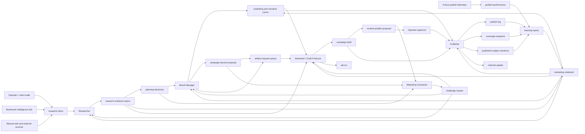
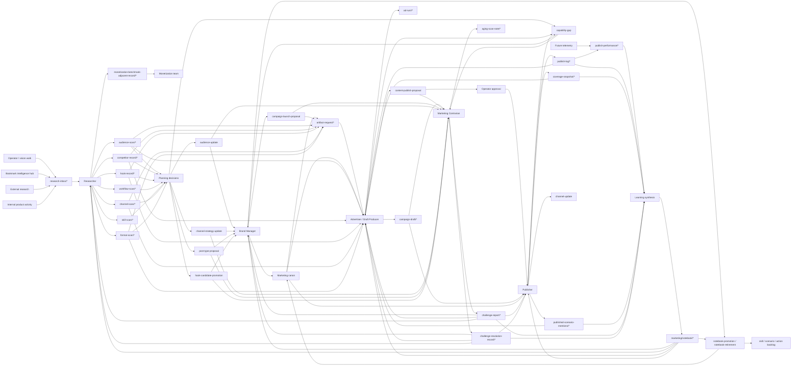

# Marketing Operating Model

**Status:** target-state canon. This document defines how the marketing-crew should work as a coherent system: loops, roles, topic surfaces, decision handoffs, and known gaps. It is the bridge between the strategic plan-of-record in `path:docs/marketing/` and the live team implementation under `path:scenarios/prompt-manager/store/teams/marketing-crew/`.

The current implementation mostly matches this model after the first adoption pass. Topic families marked with `future` are target-state surfaces that should not be treated as live declarations until the marketing team config and member `topics.json` files are updated.

## Mission

Marketing turns evidence into public-facing artifacts without losing Vrooli's builder voice or overstating product reality. The team owns external voice, audience framing, campaign planning, content drafting, publishing discipline, and the learning loop that improves those systems over time.

Marketing does not own monetization strategy, product roadmap, or operator approval. It proposes; the operator accepts, rejects, or edits.

## Operating Loops

Marketing has five loops:

1. **Research loop** — collect operator, bookmark, web, market, competitor, channel, and format signals; route them into durable evidence or decisions.
2. **Planning loop** — decide what should be marketed, to whom, on which channel, and why now.
3. **Draft loop** — turn campaign or artifact requests into draft artifacts with sources, audience, lane, channel, format, and honesty flags.
4. **Review and publish loop** — challenge proposals, approve or reject, release accepted artifacts, and record what actually shipped.
5. **Learning loop** — turn publish logs, coverage state, telemetry, and repeated production lessons into notebook entries, canon updates, skills, scenarios, or retirements.

The loops are sequential when a full campaign flows through the system, but members may also operate independently when their trigger fires. For example, the researcher can add evidence without a campaign; the publisher can update coverage without a new draft; the brand-manager can retire stale notebook debt without changing a campaign.

## System Diagrams

The first diagram is the compact operating-loop view. It is useful when checking role boundaries, approval gates, and whether evidence flows through planning, drafting, publishing, and learning.

The second diagram is the full topic-level view. It is the reference shape for validating whether topic producers, readers, decisions, and durable logs form a coherent marketing system.

## Topic Catalog

These are the knowledge-topic families the target operating model uses. Current live declarations may lag this catalog; the implementation should be reconciled after this document is accepted.

| Topic family | Status | Owner / primary writer | Primary readers | Purpose |
|---|---|---|---|---|
| `topic:research-inbox/*` | live | operator, vision-walk, bookmark-intelligence-hub, researcher | researcher | Raw unrouted research signal. The researcher drains this queue, then retags, deletes, or routes each item. |
| `topic:audience-scan/*` | live | researcher | brand-manager, advertisers, researcher | Audience pain, vocabulary, buyer triggers, objections, and persona evidence. |
| `topic:competitor-record/*` | live but under-consumed | researcher | researcher, brand-manager, advertisers | Competitor pricing, packaging, positioning, changelog, or claim evidence. Should feed positioning and campaign decisions. |
| `topic:hook-record/*` | live but under-consumed | researcher | advertisers, researcher, brand-manager | Reusable hook and framing observations. Should feed draft generation and hook-library promotion. |
| `topic:workflow-scan/*` | live | researcher | researcher, brand-manager, advertisers, meta-optimization or director-swarm when relevant | External workflows, playbooks, agent setups, or business processes worth deconstructing. |
| `topic:skill-scan/*` | live | researcher | researcher, brand-manager, advertisers, meta-optimization | External skills, prompts, reusable processes, or capability ideas. Raise `capability-gap` when blocked. |
| `topic:channel-scan/*` | live | researcher | publisher, brand-manager, advertisers | Evidence that a channel is worth activating, deprioritizing, or handling differently. |
| `topic:format-scan/*` | live | researcher | advertisers, publisher, brand-manager | Evidence that a post format or channel-native format is worth using or codifying. |
| `topic:monetization-benchmark-adjacent-record/*` | live | researcher | monetization team | Pricing, packaging, or market facts discovered by marketing but owned strategically by monetization. |
| `topic:artifact-request/oss/*` | live | brand-manager | oss-advertiser, publisher | Work queue for requested OSS-lane draft artifacts. It should carry campaign, audience, channel, format, source decision, and acceptance criteria. |
| `topic:artifact-request/subscription/*` | live | brand-manager | subscription-advertiser, publisher | Work queue for requested subscription-lane draft artifacts. It should carry campaign, SKU/bundle, audience, channel, format, source decision, and acceptance criteria. |
| `topic:campaign-draft/*` | live | advertisers | publisher, marketing-contrarian, brand-manager | Draft artifacts ready to support a `content-publish-proposal`. Lane is metadata, not a separate pipeline. |
| `topic[future]:ad-run/*` | target | advertisers | brand-manager, publisher, researcher | Normalized advertiser run summaries. This should eventually replace separate `oss-ad-run/*` and `subscription-ad-run/*` surfaces. |
| `topic:oss-ad-run/*` | live transitional | oss-advertiser | brand-manager, publisher, researcher | Current OSS-lane run log. Transitional until `topic[future]:ad-run/<lane>/*` exists. |
| `topic:subscription-ad-run/*` | live transitional | subscription-advertiser | brand-manager, publisher, researcher | Current subscription-lane run log. Transitional until `topic[future]:ad-run/<lane>/*` exists. |
| `topic:publish-log/*` | live | publisher | advertisers, brand-manager, researcher, publisher | Record of what actually shipped: draft, channel, URL, post id, series, previous URL, and release notes. |
| `topic:coverage-snapshot/*` | live | publisher | advertisers, brand-manager, publisher | Current marketing coverage by SKU, lane, channel, or campaign. |
| `topic[future]:published-scenario-mentions/*` | target | publisher | advertisers, marketing-contrarian | Familiarity tracking for named scenarios, agents, and concepts, so drafts introduce subjects correctly for each audience. Current storage is JSONL. |
| `topic[future]:publish-performance/*` | target | publisher or future growth analyst | researcher, brand-manager, publisher, advertisers | Telemetry and qualitative performance: impressions, clicks, replies, saves, conversion, comments, channel-specific notes. |
| `topic:marketing/notebook/*` | live | any marketing member | brand-manager, researcher, advertisers, publisher | Working debt: repeated lessons, workarounds, craft observations, campaign lessons. Must be drained and promoted or retired. |
| `topic:brand-snapshot/*` | live | brand-manager | brand-manager, researcher, advertisers | Snapshot of canon drift, notebook state, campaign signals, and promotion/retirement candidates. |
| `topic:challenge-report/*` | live | marketing-contrarian | decision owners, operator | Append-only challenge evidence for pending marketing decisions. |
| `topic:challenge-resolution-record/*` | live | marketing-contrarian | decision owners, operator | Latest challenge state: open, author-responded, resolved, escalated, overridden, or stale. |
| `topic:aging-scan-note/*` | live | marketing-contrarian | marketing-contrarian, operator | Stale-decision hygiene notes. |

## Decisions

Decision contexts are the operator-reviewed gates that move work between loops.

| Decision context | Owner | Purpose |
|---|---|---|
| `audience-update` | researcher | Change persona or audience canon after converging evidence. |
| `channel-strategy-update` | researcher | Activate, deprioritize, or strategically reposition a channel. |
| `post-type-proposal` | researcher | Add or materially change a post type. |
| `hook-candidate-promotion` | researcher | Promote a stable hook into `path:docs/marketing/strategies/hook-library.md`. |
| `campaign-launch-proposal` | brand-manager | Create, change, or close a campaign. |
| `brand-guideline-update` | brand-manager | Change marketing, brand, strategy, research, rich-media, or narrative canon. |
| `notebook-promotion` | brand-manager | Promote notebook debt into a skill, plan-of-record file, scenario, or config. |
| `notebook-retirement` | brand-manager | Delete notebook debt that is obsolete or transient. |
| `content-publish-proposal` | advertiser or publisher | Ask operator to approve a draft or release package. |
| `channel-update` | publisher | Change per-platform rules based on publish friction or platform drift. |
| `coverage-gap` | advertiser or publisher | Surface missing or stale coverage for a SKU, lane, channel, or campaign. |
| `capability-gap` | researcher, advertiser, publisher | Surface missing source access, tooling, scenario, skill, scheduler, media, telemetry, or account capability. |
| `decision-rejection-proposed` | marketing-contrarian | Recommend rejecting or revising a flawed pending decision. |
| `framework-update` | marketing-contrarian | Add or revise review failure modes after repeated evidence. |

## Roles

### Researcher

Owns evidence, not copy. The researcher drains `topic:research-inbox/*`, performs or requests analysis methods, writes durable observations, and raises planning decisions when evidence converges. The researcher should not draft publishable artifacts or edit marketing canon directly.

Primary responsibilities:

- classify and route raw research signal;
- maintain audience, competitor, hook, workflow, skill, channel, format, and benchmark-adjacent evidence;
- propose audience, channel, post-type, hook, and capability decisions;
- label weak evidence honestly;
- route monetization-adjacent facts to monetization.

### Brand Manager

Owns canon and campaign planning, not routine draft production. The brand-manager reads research evidence, publish outcomes, coverage state, and notebook debt; then proposes canon, campaign, promotion, or retirement decisions.

Primary responsibilities:

- steward `path:docs/marketing/` and `path:docs/narrative/` through accepted decisions;
- maintain the campaign model;
- drain `topic:marketing/notebook/*` and propose promotion or retirement;
- turn repeated lessons into permanent structure;
- prevent campaign sprawl when signal is weak.

### Advertiser / Draft Producer

The draft pipeline is shared. OSS and subscription are lanes, not separate mechanics. The current implementation has separate `oss-advertiser` and `subscription-advertiser` members; they should converge on the same workflow while retaining different lane expertise.

Primary responsibilities:

- consume artifact requests, active campaign slots, evidence, canon, channel rules, and coverage state;
- produce `topic:campaign-draft/*` entries with lane, audience, channel, format, source refs, claims, and honesty flags;
- raise `content-publish-proposal`, `coverage-gap`, or `capability-gap` decisions;
- record run summaries;
- avoid direct publishing and canon edits.

Lane examples:

- `oss` — builder-in-public, dev logs, OSS framework positioning, contributor acquisition;
- `subscription` — SKU, bundle, launch, demo, and buyer-facing scenario marketing;
- `community` — contributor onboarding, tutorials, forum/subreddit fit;
- `persona` — AI-UGC or persona-actor content when the disclosure and account model is active.

### Publisher

Owns release execution and publish state. The publisher does not invent core claims or approve its own unreviewed content. It polishes accepted drafts for platform fit, releases or records manual release steps, and updates the operational state that future drafts depend on.

Primary responsibilities:

- execute accepted `content-publish-proposal` decisions;
- maintain `topic:publish-log/*`, `topic:coverage-snapshot/*`, and subject-mention state;
- detect channel-rule drift and raise `channel-update`;
- detect missing scheduling, posting, account, or media capability and raise `capability-gap`;
- keep publish state queryable for later series, channels, and campaigns.

### Marketing Contrarian

Owns challenge and stale-decision hygiene. The contrarian reviews planning, canon, campaign, channel, and publish decisions against the marketing failure-mode framework. It does not generate positive marketing work.

Primary responsibilities:

- score pending marketing decisions;
- write challenge reports only for concrete failure-mode hits;
- maintain challenge-resolution state;
- propose rejection or framework updates when warranted;
- run stale-decision hygiene.

## Notebook Drainage

The notebook is not a destination of last resort. It is a temporary holding area for patterns that are real but not yet permanent.

Every notebook entry must eventually resolve to one of four outcomes:

1. **Promote to a skill** when it is executable procedure.
2. **Promote to plan-of-record** when it is strategic canon.
3. **Promote to a scenario or config change** when automation should replace the workaround.
4. **Retire** when the note was transient, duplicated, or superseded.

Read responsibility is explicit:

- brand-manager drains the notebook for promotions and retirements;
- researcher reads audience, channel, format, hook, and campaign lessons for evidence patterns;
- advertisers read craft, campaign, and workaround entries relevant to drafts;
- publisher reads posting, channel, media, and scheduling workarounds;
- marketing-contrarian reads notebook-derived proposals when scoring whether the proposed permanent structure actually resolves the debt.

If a notebook family grows for multiple heartbeats without promotion, retirement, or a clear revisit marker, that is a system smell. The brand-manager should raise either `notebook-promotion`, `notebook-retirement`, or `capability-gap`.

## Current Implementation Gaps

The live marketing team is aligned with the first adoption pass, but it is not finished.

1. `topic[future]:ad-run/*` is still target-state. Current run logs remain split across `topic:oss-ad-run/*` and `topic:subscription-ad-run/*`.
2. `topic[future]:published-scenario-mentions/*` is still JSONL-backed state rather than a declared topic family.
3. Publish telemetry is not modeled yet. `topic[future]:publish-performance/*` should remain future until social accounts, scheduler integration, and measurement sources exist.
4. Account operations are not yet a topic model: account activation, warming, posting cadence, persona accounts, credentials, and scheduler state are deferred to `social-media-scheduler` and channel decisions.
5. `oss-advertiser` and `subscription-advertiser` still exist as separate members. That is acceptable while their lane expertise differs, but their mechanics should remain identical. Merge them only if the separate-member split starts creating duplicate work or coordination drift.
6. Hot operational state is split between knowledge topics and JSONL files. This is acceptable during migration, but each surface should declare whether it is authoritative knowledge, append-only operational log, or transition artifact.

## Adoption Sequence

Adopt this model in order:

1. Keep this document and `path:docs/marketing/README.md` as the target-state plan-of-record.
2. Keep `path:scenarios/prompt-manager/store/teams/marketing-crew/team.json` registered against this model.
3. Keep member `RESPONSIBILITIES.md` and `HEARTBEAT.md` files aligned with the five loops.
4. Keep member `topics.json` files aligned with the research outputs, lane-specific artifact requests, publish-log reads, and notebook reads.
5. Rerun `prompt-manager graph topics --json` and decide which remaining warnings are accepted operator-only logs versus real gaps.

Do not make the validator quiet before the operating model is coherent. The topic graph is a check on the model, not a substitute for it.
