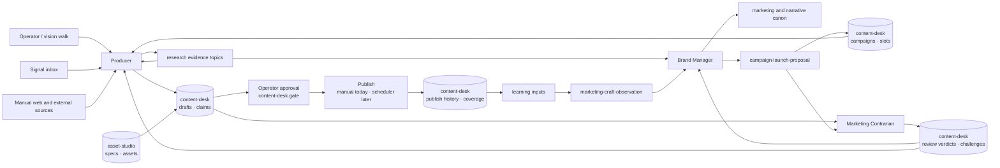
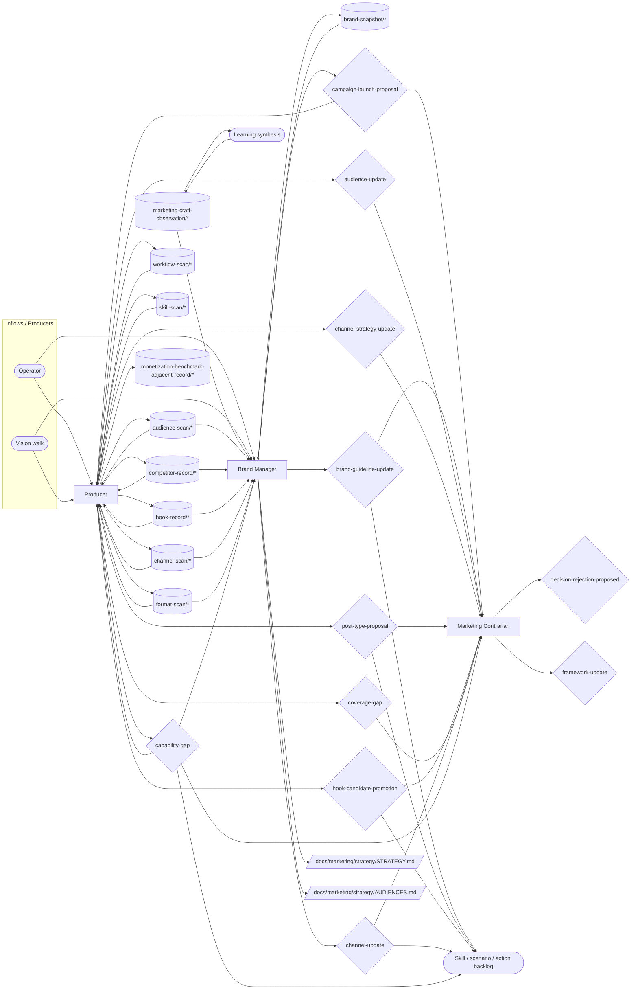

# Marketing Operating Model

**Status:** target-state canon. This document defines how the marketing-crew works as a coherent system: loops, roles, topic surfaces, decision handoffs, and known gaps. It is the bridge between the strategic plan-of-record in `path:docs/marketing/` and the live team implementation under `path:scenarios/prompt-manager/store/teams/marketing-crew/`.

The current document adopts the generic team operating-model shape from `path:docs/agent-system/OPERATING_GRAPHS.md`.

**Revised after capability consolidation.** The roster collapsed from six members to three, and roughly half the former topic families moved into the `content-desk` scenario as queryable state. The method is recorded in `prompt-manager skill read team-capability-consolidation`. Topic families marked `future` are target-state surfaces and are not live declarations.

The team is currently **paused** (`enabled: false`) pending completion of `content-desk` and `asset-studio`.

## Mission

Marketing turns evidence into public-facing artifacts without losing Vrooli's builder voice or overstating product reality. The team owns external voice, audience framing, campaign planning, content drafting, publishing discipline, and the learning loop that improves those systems over time.

Marketing does not own monetization strategy, product roadmap, or operator approval. It proposes; the operator accepts, rejects, or edits.

**Objective served.** `T1` — income (primary) and `T3` — contribution, via the OSS surface (`path:docs/director-swarm/strategy/OBJECTIVES.md`). Both are **terminal**: this team serves what the operator wants directly, not the system's capacity to want it. `T3` is served only partially today — the OSS discovery channel exists, but nothing yet addresses whether another operator can actually run this system.

**Outcome contribution.** Primary: **Broadcast** (marketing & growth) — campaigns, channels, and publishing move funnel stages. Supporting: **Ledger**, by supplying the funnel that revenue lines convert. The swarm-tier map of which team moves which outcome lives in `path:docs/director-swarm/evidence/OUTCOMES_CHARTER.md` §"Team contribution map"; this paragraph is this team's own statement of it.

## Scope

Marketing owns the operating path from marketing signal to public-facing artifact or marketing-canon change:

- research signal intake and durable evidence;
- audience, channel, format, campaign, and brand-canon proposals;
- draft artifact production for every lane;
- challenge reports for weak marketing decisions;
- learning-loop promotion from typed production observations into skills, plan-of-record docs, scenarios, capability gaps, or retirements.

Marketing does not own product prioritization, monetization strategy, legal approval, social-account credential operations, scheduler infrastructure, or the final decision to publish. Those surfaces route through decisions, cross-team output, or explicit capability gaps.

## What the team no longer carries

Three capabilities left the team contract and became scenario state. This is the single largest change to this document, and it is why the roster is half its former size.

| Capability | Now owned by | Was |
|---|---|---|
| Campaign records, artifact slots, drafts, claims, review verdicts, publish history, coverage, subject familiarity | `content-desk` | ~13 topic families and five `.jsonl` files in the team's shared store |
| Character / scene / product identities, prompt specs, render provenance, produced assets, AI-UGC disclosure state | `asset-studio` | `path:docs/marketing/catalogs/rich-media/` JSON, hand-composed at production time |
| Account activation, warming, cadence, credentials, posting execution | `social-media-scheduler` (not yet modernized) | unowned; deferred in every prior revision |

The rule that decided each row: **evidence and judgment stay knowledge topics; operational state with a lifecycle becomes scenario data.** A surface with a status, a gate, or a query worth running is modelled badly by an append-only topic family.

Two consequences worth stating plainly:

- **`content-publish-proposal` no longer exists as a decision context.** Operator approval did not disappear — it moved from a prompt-manager decision into `content-desk`'s operator-only approval gate, where a draft cannot reach `approved` while it cites an unverified claim or names a post type that is still v0. The gate is executable; the decision was not.
- **Stale-decision hygiene is no longer a topic family.** It is governance configuration: `operatingContract.governance.staleDecisionPolicy`, owned by `marketing-contrarian`, firing after 14 heartbeats.

## Operating Loops

Marketing has five loops:

1. **Research loop** — collect operator, bookmark, web, market, competitor, channel, and format signals; route them into durable evidence or decisions.
2. **Planning loop** — decide what should be marketed, to whom, on which channel, and why now.
3. **Draft loop** — turn open campaign slots into drafts with declared claims, sources, audience, lane, channel, and format.
4. **Review and publish loop** — challenge proposals, score drafts against failure modes, and let the operator approve. Release and publish history live in `content-desk`.
5. **Learning loop** — turn publish history, coverage state, and repeated production lessons into typed observations, canon updates, skills, scenarios, capability gaps, or retirements.

The loops are sequential when a full campaign flows through the system, but members may also operate independently when their trigger fires. The producer can gather evidence without an open campaign; the brand-manager can promote or retire stale typed observations without changing a campaign.

**The learning loop has never had data.** The publish history it is meant to consume is empty. It becomes real with the first published artifact recorded in `content-desk`, not before.

## Operating Graph

The first diagram is the compact operating-loop view. It is useful when checking role boundaries, approval gates, and whether evidence flows through planning, drafting, publishing, and learning.

The second diagram is the full topic-level view. It is the reference shape for validating whether topic producers, readers, decisions, and durable logs form a coherent marketing system.

<!-- prompt-manager-graph:
id: marketing-operating-model
scope: team
team: marketing-crew
mode: contract
actor_group.marketing-members: team-members
actor_group.decision-owners: none
actor_group.benchmark-consumers: none
actor_alias.any marketing member: group:marketing-members
actor_alias.decision owner: group:decision-owners
actor_alias.monetization team: group:benchmark-consumers
actor_alias.decision owners: group:decision-owners
actor_alias.learning synthesis: process:learning-synthesis
actor_alias.meta-optimization: external:meta-optimization
actor_alias.director-swarm: external:director-swarm
-->

## Topic Catalog

These are the knowledge-topic families the team still owns. Everything absent from this table that appeared in a prior revision moved to `content-desk`; see §"What the team no longer carries".

| Topic family | Status | Owner / primary writer | Primary readers | Purpose |
|---|---|---|---|---|
| `topic:audience-scan/*` | live | producer | producer, brand-manager | Audience pain, vocabulary, buyer triggers, objections, and persona evidence. |
| `topic:competitor-record/*` | live | producer | producer, brand-manager | Competitor pricing, packaging, positioning, changelog, or claim evidence. |
| `topic:hook-record/*` | live | producer | producer, brand-manager | Reusable hook and framing observations; the promotion source for the hook library. |
| `topic:workflow-scan/*` | live | producer | producer | External workflows, playbooks, agent setups, or business processes worth deconstructing. |
| `topic:skill-scan/*` | live | producer | producer | External skills, prompts, reusable processes, or capability ideas. |
| `topic:channel-scan/*` | live | producer | producer, brand-manager | Evidence that a channel is worth activating, deprioritizing, or handling differently. |
| `topic:format-scan/*` | live | producer | producer, brand-manager | Evidence that a post format or channel-native format is worth using or codifying. |
| `topic:monetization-benchmark-adjacent-record/*` | live | producer | monetization team | Pricing, packaging, or market facts found by marketing but owned strategically by monetization. |
| `topic:marketing-craft-observation/*` | live | learning synthesis | brand-manager | Typed production observations that may feed canon, skill, scenario, capability-gap, or retirement decisions. |
| `topic:brand-snapshot/*` | live | brand-manager | brand-manager | Snapshot of canon drift, typed learning state, campaign signals, and promotion/retirement candidates. |

Evidence topics are append-only and carry no lifecycle. If a proposed topic family needs a status, a gate, or a query, it is scenario state and belongs in `content-desk` — that test is the boundary, and it is the one this revision applied.

## Decisions

Decision contexts are the operator-reviewed gates that move work between loops. Validation enforces graph/table parity, owner edges, expected evidence, and accepted downstream effects.

Governance settings are carried across this revision unchanged: approval mode, a team pending ceiling of 12, supersession required before a new decision, and stale-decision escalation after 14 heartbeats. They were tuned for the previous shape and the new shape has produced no data yet.

| Decision context | Owner | Purpose | Expected evidence / trigger | Accepted effect |
|---|---|---|---|---|
| `audience-update` | producer | Change persona or audience canon after converging evidence. | Audience scans, competitor records, channel evidence, or repeated publish feedback. | Operator applies or rejects audience-canon changes. |
| `channel-strategy-update` | producer | Activate, deprioritize, or strategically reposition a channel. | Channel scans, publish friction, platform drift, or audience-channel mismatch. | Channel strategy and downstream campaign slots change. |
| `post-type-proposal` | producer | Add or materially change a post type. | Format scans, hook records, channel scans, or repeated draft lessons. | Post-type canon changes; activation state is then enforced by `content-desk`. |
| `hook-candidate-promotion` | producer | Promote a stable hook into `path:docs/marketing/strategy/patterns/hook-library.md`. | Hook records with repeated applicability and source context. | Hook-library canon gains a reusable pattern. |
| `coverage-gap` | producer | Surface missing or stale coverage for a SKU, lane, channel, or campaign. | Coverage state from `content-desk`, or a campaign with unfilled slots. | Gap is accepted, deferred, or converted into campaign slots. |
| `campaign-launch-proposal` | brand-manager | Create, change, or close a campaign. | Research evidence, coverage state, campaign lessons, or operator direction. | Campaign record and its slot budget are created or changed in `content-desk`. |
| `brand-guideline-update` | brand-manager | Change marketing, brand, strategy, research, rich-media, or narrative canon. | Brand snapshot, typed production observations, challenge notes, or repeated artifact issues. | Plan-of-record docs change through operator-curated edits. |
| `channel-update` | brand-manager | Change per-platform rules based on publish friction or platform drift. | Publish friction, platform behavior changes, or repeated release workarounds. | Channel rules change after operator approval. Held by brand-manager only until account operations have a scheduler-side home. |
| `capability-gap` | producer | Surface missing source access, tooling, scenario, skill, scheduler, media, telemetry, or account capability. | Work is blocked by missing capability rather than weak judgment. | Gap routes to director-swarm, meta-optimization, or a downstream backlog. |
| `decision-rejection-proposed` | marketing-contrarian | Recommend rejecting or revising a flawed pending decision. | Challenge evidence with a concrete failure mode. | Operator rejects, revises, or overrides the challenged decision. |
| `framework-update` | marketing-contrarian | Add or revise review failure modes after repeated evidence. | Repeated challenge evidence not covered by current framework. | Review framework changes through operator-approved canon edits. |

**Publishing has no decision context.** It is a gate in `content-desk`: a draft reaches `approved` only by operator action, only with every cited claim verified, and only when its post type is active. The former `content-publish-proposal` is retired, not relocated.

## External Inputs / Triggers

| Producer / trigger | Entry surface | Drainer | Routing rule |
|---|---|---|---|
| Operator | `topic:audience-scan/*` | producer | Raw signal reaches the producer directly and is classified into the evidence family it belongs to. |
| Vision walk | `topic:channel-scan/*` | producer | Signals become evidence, campaign proposals, campaign slots, or capability gaps. |
| Operator | `decision:campaign-launch-proposal` | brand-manager | Direction that is already a concrete planning call enters as a decision rather than as evidence. |
| Repeated production lessons | `topic:marketing-craft-observation/*` | brand-manager | Drained into canon, skills, scenarios, capability gaps, or retirement. |

Two triggers are deliberately absent from this table because the runtime does not declare them. The **signal inbox** is not listed in any member's `external_producers`, and **open campaign slots** live in `content-desk`, which is not a participant in the team contract graph. Both are described in §"Operating Loops" and tracked as gaps 4 and 10.

## Outputs / Downstream Consumers

| Output | Surface | Consumer | Purpose |
|---|---|---|---|
| Audience evidence | `topic:audience-scan/*` | producer, brand-manager | Persona, objection, and buyer-trigger evidence for planning and drafting. |
| Competitive and hook evidence | `topic:competitor-record/*` | producer, brand-manager | Positioning and framing evidence. |
| Channel and format evidence | `topic:channel-scan/*` | producer, brand-manager | Where and in what shape to publish. |
| Monetization-adjacent facts | `topic:monetization-benchmark-adjacent-record/*` | producer | Pricing and packaging facts held for routing to monetization; see gap 9. |
| Brand drift snapshots | `topic:brand-snapshot/*` | brand-manager | Canon drift, typed learning state, and promotion or retirement candidates. |
| Canon changes | `docs/marketing/strategy/STRATEGY.md` | all marketing members and cross-team consumers | Keep public-facing voice coherent. |
| Audience canon changes | `docs/marketing/strategy/AUDIENCES.md` | all marketing members | Keep persona definitions coherent across lanes. |
| Capability gaps | `decision:capability-gap` | producer, brand-manager, marketing-contrarian | Route blocked work to the right improvement path; escalation targets are named in the decision body. |
| Coverage gaps | `decision:coverage-gap` | marketing-contrarian | Convert missing coverage into campaign slots or an accepted deferral after review. |

Campaign records, drafts, claims, review verdicts, publish history, and produced assets are **not** listed here. They are scenario state in `content-desk` and `asset-studio`, queried through those scenarios rather than emitted as team outputs.

## Feedback / Capability Improvement Loop

Marketing improves itself through four explicit exits:

1. **Typed learning observations** — repeated lessons and workarounds enter `topic:marketing-craft-observation/*`; the brand-manager drains them into canon, skills, scenarios, capability gaps, or retirement.
2. **Decision challenge** — marketing-contrarian raises `decision:decision-rejection-proposed` when a pending decision has concrete failure-mode evidence, and `decision:framework-update` when the failure falls outside the current framework.
3. **Capability gaps** — the producer raises `capability-gap` when missing access, tooling, scheduler support, media generation, telemetry, account state, or scenario capability blocks the work.
4. **Coverage gaps** — the producer raises `coverage-gap` when a SKU, lane, channel, or campaign lacks sufficient marketing coverage.

General code/scenario defects should use scenario-qa's `report-bug` flow. System-level friction that is not a defect should use meta-optimization's `report-friction` flow. Marketing should not turn every local frustration into a marketing-craft observation when a universal observation flow is the correct destination.

## Roles

Three members. Every remaining separation is a control, a clock, or a judgment boundary — the pipeline-stage separations the previous roster encoded are now enforced by gates in `content-desk`.

### Producer

Owns evidence and drafts. The former researcher and the two lane advertisers merged into this role: lane is a field on a draft, not a pipeline, and research that is not driving a draft is speculative.

Primary responsibilities:

- draw open work from active campaign slots and draft against it;
- gather the audience, competitor, hook, workflow, external-skill, channel, and format evidence a draft needs;
- declare every factual assertion as a claim with evidence attached, preferring a re-runnable check over a citation;
- append raw observations before proposing interpretation, and propose canon changes only when evidence converges;
- verify feature claims against monetization canon before drafting subscription-lane material;
- route monetization-adjacent facts to monetization without duplicating their canon.

Hard limits: never publish, never approve its own draft, never edit plan-of-record canon directly.

### Brand Manager

Owns canon and campaign planning. Reads research evidence, publish outcomes, coverage state, and typed production observations; proposes canon, campaign, capability-gap, skill, scenario, or retirement decisions.

Primary responsibilities:

- steward `path:docs/marketing/` and `path:docs/narrative/` through accepted decisions;
- convert accepted campaign planning into campaign records with a declared artifact slot budget — slots are a hard cap, not a target, and are what bound in-flight work and operator review load;
- drain `topic:marketing-craft-observation/*` and propose promotion or retirement through the relevant owned decision;
- detect voice, positioning, campaign, or narrative drift from recent drafts and published artifacts;
- prevent campaign sprawl when signal is weak.

Temporary: `channel-update` is held here, inherited from the retired publisher role. It moves when account operations gain a scheduler-side home.

### Marketing Contrarian

Owns challenge and stale-decision hygiene. It does not generate positive marketing work, and it is the one separation that could not be merged into the producer.

Primary responsibilities:

- score pending proposals and drafts against framework-level and type-level failure modes, including the AI-UGC guardrails;
- **hunt factual assertions the producer made but did not declare as claims** — this is the compensating control for author self-reporting, and the reason this role remains separate;
- maintain resolution state for each open challenge;
- run stale-decision hygiene per the governance policy;
- propose framework updates only when observed failures fall outside the current framework;
- check that the pipeline boundary holds: evidence → draft → operator approval → publish record.

## Typed Learning Drainage

Typed learning observations are not a destination of last resort. They are structured evidence for patterns that are real but not yet permanent.

Every marketing-craft observation must eventually resolve to one of four outcomes:

1. **Promote to a skill** when it is executable procedure.
2. **Promote to plan-of-record** when it is strategic canon.
3. **Promote to a scenario or config change** when automation should replace the workaround.
4. **Retire** when the observation was transient, duplicated, or superseded.

Append and read responsibilities are deliberately different:

- any marketing member may write typed marketing-craft observations when the lesson is truly marketing-specific;
- brand-manager drains typed observations and proposes promotion or retirement through the relevant owned decision;
- producer consumes promoted canon and skill updates, not raw craft observations by default;
- marketing-contrarian reviews observation-derived proposals when scoring whether the proposed permanent structure actually resolves the issue.

If a marketing-craft observation family grows for multiple heartbeats without promotion, retirement, or a clear revisit marker, that is a system smell. The brand-manager should raise the relevant canon, skill, scenario, config, or `capability-gap` decision.

## Current Implementation Gaps

1. **The team is paused** via `enabled: false` in `scenarios/prompt-manager/store/teams/marketing-crew/team.json`. `content-desk` and `asset-studio` are under development. The roster and this document are migrated ahead of them deliberately — roster re-derivation needs the scenarios' domain maps and gates, not their code. *Target state: the team is enabled once step 9 of Adoption / Validation passes.*
2. **No paired tool skill exists yet.** The producer's drafting mechanics are intentionally unversed in specific commands until `content-desk`'s CLI surface settles. *Target state: an `x-content-desk` tool skill authored through `team-tool-mapping`, cited in the producer's available skills.*
3. **No state import has run.** The team's shared `.jsonl` files remain the only copy of publish, coverage, mention, and draft state, and must not be deleted before `content-desk`'s importer has consumed them. *Target state: import complete with counts verified per source file, and the shared files retired.*
4. **`research-inbox/*` is no longer declared by any member.** Raw signal now reaches the producer through direct member context, so the signal inbox is not a backed trigger. *Target state: either a declared intake family with the signal inbox listed in the producer's `external_producers`, or an explicit decision that direct context is sufficient.*
5. **`decision-application/<decision-id>` is no longer declared.** It tracked publisher follow-through on accepted publish decisions. *Target state: retired permanently — with `content-publish-proposal` gone, its purpose is served by the approval record in `content-desk`.*
6. **Account operations remain unowned.** Activation, warming, cadence, persona accounts, and credentials are deferred to `social-media-scheduler`, which is still pre-template. *Target state: those capabilities live in a modernized scheduler, and `channel-update` moves there from brand-manager.*
7. **Publishing is manual.** An approved draft is posted by the operator and recorded in `content-desk`. *Target state: manual remains correct at current volume — one brand account, no persona accounts — and is revisited only when the scheduler exists.*
8. **Ten of twelve post types are v0.** They have strategic canon and no paired skill, so `content-desk` will refuse to approve drafts of those types. *Target state: at least one image or video type activated to v1, giving `asset-studio` a consumer.*
9. **The cross-team route to monetization is undeclared.** The producer writes `monetization-benchmark-adjacent-record/*` but no runtime relationship carries it to the monetization team. *Target state: a declared cross-team relationship, or an accepted decision that the monetization team polls the family itself.*
10. **Scenario state is outside the contract graph.** The `marketing-operating-model` graph validates topics, decisions, members, and declared externals; it has no node kind for scenario-owned state, so the campaigns, drafts, claims, and publish history held in `content-desk` cannot appear in it. *Target state: unchanged — the compact loop diagram carries the system view, and this graph stays a team contract.*

## Adoption / Validation

Adopt this model in order:

1. Keep this document and `path:docs/marketing/README.md` as the target-state plan-of-record.
2. Keep `path:scenarios/prompt-manager/store/teams/marketing-crew/team.json` registered against this model.
3. Keep member `RESPONSIBILITIES.md` and `HEARTBEAT.md` files aligned with the five loops.
4. Keep member `topics.json` files aligned with the ten live evidence and learning topic families.
5. Run `prompt-manager graph operating-model validate --team marketing-crew --id marketing-operating-model`.
6. Run `prompt-manager graph operating-model diff --team marketing-crew --id marketing-operating-model`.
7. Run `prompt-manager graph operating-model coverage --team marketing-crew --id marketing-operating-model`.
8. Rerun `prompt-manager graph topics --json` and decide which remaining warnings are accepted operator-only logs versus real gaps.
9. Resume the team only after `content-desk`'s CLI surface is settled, its paired skill exists, and the state import has run with verified counts.

Do not make the validator quiet before the operating model is coherent. The topic graph is a check on the model, not a substitute for it.
