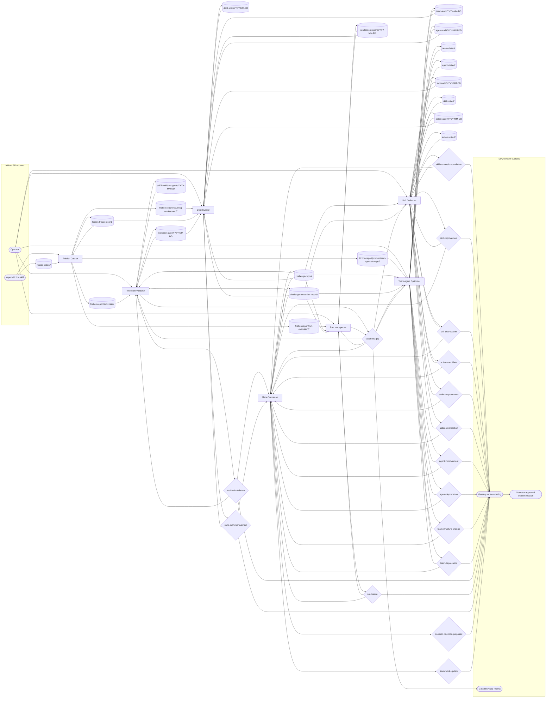

# Meta Optimization Operating Model

**Status:** initial contract canon. This document defines how `meta-optimization` works as a coherent system: cross-team friction intake, audits of the prompt-manager meta-layer, programmatic conversion pressure, skeptical review, and durable improvement loops.

The current document adopts the generic team operating-model shape from `path:docs/agent-system/OPERATING_GRAPHS.md`. It is intentionally paired with `path:docs/marketing/operating/OPERATING_MODEL.md` and `path:docs/scenario-qa/operating/OPERATING_MODEL.md` as a third, recursive-improvement archetype for operating-model validation.

## Mission

Meta Optimization applies evolutionary pressure to Vrooli's development meta-layer so skills, Actions, agents, teams, toolchain behavior, and run-derived lessons become cheaper, sharper, more programmatic, and easier to retire when stale.

Meta Optimization does not directly implement the changes it proposes. It audits, routes friction, challenges weak proposals, raises decisions, and sends accepted work to the owning surface or operator.

## Scope

Meta Optimization owns:

- universal cross-team friction intake through `report-friction` and `friction-inbox/*`;
- scoped friction records for toolchain, run execution, prompt-team-agent storage, and recurring workarounds;
- toolchain audits and manual-fallback violation proposals;
- run lesson audits and process improvement proposals;
- team and agent architecture audits;
- skill and Action audits, conversion candidates, improvements, and deprecations;
- promotion or retirement of stable meta-layer lessons from typed knowledge topics;
- contrarian review of pending meta-layer decisions;
- capability-gap decisions when self-improvement is blocked by missing tools, docs, telemetry, or ownership.

Meta Optimization does not own scenario code quality, monetization strategy, product roadmap, deployment infrastructure, social publishing, or direct scenario implementation. Those surfaces route to their owning teams through decisions, backlog items, or capability gaps.

## Operating Loops

Meta Optimization has six loops:

1. **Friction intake loop** — drain universal `friction-inbox/*`, classify scope, route to scoped friction topics, and record daily triage throughput.
2. **Toolchain loop** — inspect whether agents use programmatic toolchains instead of manual fallback work; raise `toolchain-violation` or `capability-gap` decisions.
3. **Run lesson loop** — inspect recent runs for repeated errors, retries, slowness, or deterministic manual sequences; raise durable `run-lesson` or `capability-gap` decisions.
4. **Team and agent loop** — audit team/member structure against the meta-layer architecture; raise improvement, deprecation, structure-change, or capability-gap decisions.
5. **Skill and Action loop** — audit skills and Actions for conversion, improvement, deprecation, and measurement-backed promotion.
6. **Challenge and debt loop** — challenge stale, weak, or excessive decisions; promote stable typed evidence into canon, skills, Actions, CLI backlog, team changes, capability gaps, or retirement.

The Skill and Action loop has two clear axes that compose rather than compete. **Destination clarity** is covered by `path:docs/agent-system/SKILL_AUTHORING.md` §"Destination over direction: maturity ladders for audit-shaped skills" — does the skill name a verifiable end state? **Implementation maturity** is covered by `path:docs/agent-system/PROMOTION_LADDER.md` — prose → CLI wrapper → Action → retired. Destination clarity is the *precondition* for climbing the implementation ladder: there is nothing to mechanize until the skill has named its target artifact. The Skill Maturity Score in `path:scenarios/development-toolchain-validator/` P1-005 is the programmatic reading of the destination axis (weighted by structural config, CLI tool assertions, and conflict-free passing), and feeds the conversion / improvement / deprecation decisions this loop raises.

The loops are intentionally independent. A friction report can route without becoming a decision; a run lesson can create a capability gap without touching skills; a contrarian review can resolve a decision without generating new work.

## Operating Graph

This graph is the team-level contract. It shows how cross-team friction and operator-triggered audit work enter the team, which members write and drain each topic, which decisions gate changes, and how challenge records keep the self-improvement system from over-correcting.

<!-- prompt-manager-graph:
id: meta-optimization-operating-model
scope: team
team: meta-optimization
mode: contract
actor_alias.operator: external:operator
actor_alias.report-friction: external:report-friction
actor_alias.any team: external:report-friction
actor_alias.decision owners: none
-->

## Topic Catalog

| Topic family | Status | Owner / primary writer | Primary readers | Purpose |
|---|---|---|---|---|
| `topic:friction-inbox/<scope>/<slug>` | live | external:report-friction | `friction-curator` | Universal-source friction intake written by any team through the report-friction skill and drained by friction-curator. |
| `topic:friction-triage-record/<YYYY-MM-DD>` | live | `friction-curator` | `friction-curator`, `debt-curator` | Daily snapshot of friction-inbox throughput, routing, dropped/reclassified entries, overflow, and by-scope counts. |
| `topic:friction-report/toolchain/<YYYY-MM-DD>/<slug>` | live | `friction-curator` | `toolchain-validator` | Routed friction showing toolchain, CLI, Action, or manual-fallback pain that should feed toolchain validation. |
| `topic:friction-report/run-execution/<YYYY-MM-DD>/<slug>` | live | `friction-curator` | `run-introspector` | Routed friction from agent run execution: retries, slowness, brittle sequences, missing observability, or repeated run failures. |
| `topic:friction-report/prompt-team-agent-storage/<YYYY-MM-DD>/<slug>` | live | `friction-curator` | `team-agent-optimizer` | Routed friction about prompt-manager team, member, topic, storage, prompt, or coordination structure. |
| `topic:friction-report/recurring-workaround/<YYYY-MM-DD>/<slug>` | live | `friction-curator` | `debt-curator` | Routed recurring workaround evidence that may become canon, a skill, an Action, CLI backlog, team-structure change, capability gap, or retirement. |
| `topic:toolchain-audit/YYYY-MM-DD` | live | `toolchain-validator` | `toolchain-validator` | Snapshot of toolchain usage, manual fallback violations, and programmatic conversion opportunities. |
| `topic:self-health/test-genie/YYYY-MM-DD` | live | `toolchain-validator` | `toolchain-validator` | Periodic snapshot of Test Genie's own reliability ledger, provider conformance, and catalog health from `test-genie health --json`. |
| `topic:run-lesson-report/YYYY-MM-DD` | live | `run-introspector` | `run-introspector` | Snapshot of durable lessons from recent agent runs, including repeated deterministic work that should use or become Actions. |
| `topic:team-audit/YYYY-MM-DD` | live | `team-agent-optimizer` | `team-agent-optimizer` | Snapshot audit of team structure, role boundaries, coordination surfaces, and capability architecture. |
| `topic:agent-audit/YYYY-MM-DD` | live | `team-agent-optimizer` | `team-agent-optimizer` | Snapshot audit of member and agent file structure, responsibilities, prompts, and role drift. |
| `topic:team-visited/<team-id>` | live | `team-agent-optimizer` | `team-agent-optimizer` | Visited tracker used to avoid repeatedly auditing the same team before the rotation completes. |
| `topic:agent-visited/<agent-id>` | live | `team-agent-optimizer` | `team-agent-optimizer` | Visited tracker used to avoid repeatedly auditing the same agent before the rotation completes. |
| `topic:skill-audit/YYYY-MM-DD` | live | `skill-optimizer` | `skill-optimizer` | Snapshot audit of skill drift, usage, promotion-ladder readiness, and improvement/deprecation candidates. |
| `topic:skill-visited/<skill-id>` | live | `skill-optimizer` | `skill-optimizer` | Visited tracker used to avoid repeatedly auditing the same skill before the rotation completes. |
| `topic:action-audit/YYYY-MM-DD` | live | `skill-optimizer` | `skill-optimizer` | Snapshot audit of Action candidates, Action contracts, Action improvements, and deprecation opportunities. |
| `topic:action-visited/<action-id>` | live | `skill-optimizer` | `skill-optimizer` | Visited tracker used to avoid repeatedly auditing the same Action before the rotation completes. |
| `topic:debt-scan/YYYY-MM-DD` | live | `debt-curator` | `debt-curator` | Snapshot scan of stable typed evidence and recurring workaround evidence selected for promotion, routing, or retirement. |
| `topic:challenge-report/<decision-id>` | live | `meta-contrarian` | `toolchain-validator`, `run-introspector`, `team-agent-optimizer`, `skill-optimizer`, `debt-curator`, `meta-contrarian` | Append-only contrarian challenge evidence for meta-optimization decisions. |
| `topic:challenge-resolution-record/<decision-id>` | live | `meta-contrarian` | `toolchain-validator`, `run-introspector`, `team-agent-optimizer`, `skill-optimizer`, `debt-curator`, `meta-contrarian` | Latest-state record for a meta-optimization challenge: open, author-responded, resolved, escalated, overridden, or stale. |

## Decisions

| Decision context | Owner | Purpose | Expected evidence / trigger | Accepted effect |
|---|---|---|---|---|
| `skill-conversion-candidate` | `skill-optimizer` | Propose converting repeated prose guidance into a structured skill or stronger skill workflow. | Skill audit evidence, repeated run lessons, challenge evidence, or promotion-ladder signals. | Operator-approved skill authoring, skill migration, or Action/CLI backlog routing. |
| `skill-improvement` | `skill-optimizer` | Improve a high-usage or drifted skill. | Skill audit evidence, challenge records, usage failures, or repeated friction. | Operator-approved edit to the owning skill documentation or supporting assets. |
| `skill-deprecation` | `skill-optimizer` | Archive or retire an unused, obsolete, unsafe, or superseded skill. | Skill audit evidence showing low use, bad fit, or replacement by stronger capability. | Operator-approved deprecation, migration note, and removal from active selection surfaces. |
| `action-candidate` | `skill-optimizer` | Propose a new Action or promote a draft Action to active. | Repeated deterministic CLI work, missing discoverability, baseline token/manual-work cost, and measurement plan. | Operator-approved Action implementation or backlog item routed to the owning tool surface. |
| `action-improvement` | `skill-optimizer` | Improve an existing Action contract, examples, permissions, validation, run eligibility, or discoverability. | Action audit evidence, run lesson, challenge record, or failed dry-run/validation result. | Operator-approved Action contract or implementation improvement. |
| `action-deprecation` | `skill-optimizer` | Archive an Action that is unused, unsafe, obsolete, or superseded. | Action audit evidence showing disuse, danger, duplication, or replacement. | Operator-approved Action retirement and active-surface cleanup. |
| `agent-improvement` | `team-agent-optimizer` | Improve an agent or member file, role boundary, prompt surface, or responsibility contract. | Team/agent audit evidence, prompt-team-agent-storage friction, or challenge evidence. | Operator-approved edit to the owning agent/member surface. |
| `agent-deprecation` | `team-agent-optimizer` | Archive a dormant, redundant, or harmful agent. | Agent audit evidence showing inactivity, duplicated ownership, or mismatch with team mission. | Operator-approved deprecation or migration to an owning role/member surface. |
| `team-structure-change` | `team-agent-optimizer` | Change role boundaries, member composition, coordination mode, topic ownership, or team contract shape. | Team audit evidence, topic-flow gaps, repeated friction, or capability architecture review. | Operator-approved team config, member, topic, or operating-model update. |
| `team-deprecation` | `team-agent-optimizer` | Archive a dormant, redundant, or mission-mismatched team. | Team audit evidence showing no active purpose, obsolete ownership, or replacement by another team. | Operator-approved team retirement and migration of any live responsibilities. |
| `toolchain-violation` | `toolchain-validator` | Identify manual fallback, bypassed toolchain, or programmatic tool misuse. | Toolchain audit evidence or routed toolchain friction. | Operator-approved remediation request to the owning tool, skill, Action, or agent surface. |
| `run-lesson` | `run-introspector` | Promote a durable process lesson from recent run traces. | Repeated run failures, retries, slowness, manual sequences, or missing actionability. | Operator-approved process, prompt, skill, Action, CLI backlog, or documentation update. |
| `capability-gap` | `toolchain-validator`, `run-introspector`, `team-agent-optimizer` | Declare a missing capability blocking better self-improvement or downstream team effectiveness. | Audit evidence showing the team cannot proceed without a missing tool, data source, prompt surface, validation rule, or owner. | Gap routed to the appropriate owning team, backlog, or operator decision path. |
| `meta-self-improvement` | `debt-curator` | Promote, route, or retire mature meta-optimization evidence and recurring workaround evidence. | Repeated typed evidence, friction triage records, recurring workaround reports, audits, or run lessons. | Operator-approved canon, skill, Action, CLI backlog, team-structure change, capability gap, or retirement route. |
| `decision-rejection-proposed` | `meta-contrarian` | Recommend rejecting stale, weak, excessive, or poorly evidenced pending decisions. | Challenge report, stale decision scan, missing measurement, unsafe boundary, or premature conversion. | Operator rejects or asks owner to supersede/rework the decision. |
| `framework-update` | `meta-contrarian` | Update the failure-mode or review framework used to challenge meta-layer decisions. | Repeated challenge patterns showing the current framework misses or over-flags a class of failure. | Operator-approved update to the relevant framework canon or prompt guidance. |

## External Inputs / Triggers

| Producer / trigger | Entry surface | Drainer | Routing rule |
|---|---|---|---|
| Cross-team friction | `report-friction` skill to `friction-inbox/<scope>/<slug>` | `friction-curator` | Universal-source intake; any team can write, but the curator routes rather than analyzes. |
| Operator audit trigger | Member heartbeat trigger | `toolchain-validator`, `run-introspector`, `team-agent-optimizer`, `skill-optimizer`, `debt-curator` | Used for scheduled or directed audits across each lane. |
| Stable typed evidence | `friction-report/recurring-workaround/*`, `run-lesson-report/*`, audit topics, and `debt-scan/*` | `debt-curator` | Raw synthesis is not canon until promoted or retired by decision. |
| Challenge evidence | `challenge-report/<decision-id>` and `challenge-resolution-record/<decision-id>` | Relevant decision owner | Challenge records feed owners back into rework, supersession, or rejection. |

## Outputs / Downstream Consumers

| Output | Surface | Consumer | Purpose |
|---|---|---|---|
| Accepted skill and Action decisions | `skill-*`, `action-*`, and `meta-self-improvement` decisions | Operator and owning implementation surface | Route accepted implementation or backlog work. |
| Accepted team and agent decisions | `agent-*`, `team-*`, and capability architecture decisions | Operator and owning team/member surface | Route team config, member docs, or prompt-surface work. |
| Toolchain and run decisions | `toolchain-violation`, `run-lesson`, and `capability-gap` decisions | Operator, toolchain owners, skill owners, Action owners | Carry evidence for durable fixes. |
| Challenge records | `challenge-report/*` and `challenge-resolution-record/*` | Decision owners and operator | Document why a proposal was challenged, revised, rejected, or allowed. |
| Friction triage and scoped reports | `friction-triage-record/*` and scoped `friction-report/*` topics | Meta-optimization members and future operating-model validators | Show whether the universal-source intake is being drained and routed. |

## Feedback / Capability Improvement Loop

Meta Optimization is the recursive-improvement team. Its feedback loop should stay explicit:

1. Any team observes friction and writes `friction-inbox/<scope>/<slug>` through `report-friction`.
2. The `friction-curator` routes the signal to a scoped friction topic and records daily throughput.
3. The owning audit member synthesizes repeated signals into `skill-*`, `action-*`, `agent-*`, `team-*`, `toolchain-violation`, `run-lesson`, or `capability-gap` decisions.
4. The `meta-contrarian` challenges weak or excessive proposals before operator acceptance.
5. Accepted `skill-*`, `action-*`, `agent-*`, `team-*`, `toolchain-violation`, `run-lesson`, or `capability-gap` decisions update skills, Actions, agents, teams, toolchain behavior, canon, or capability backlog.
6. Future runs expose whether `friction-report/*` volume, repeated work, manual fallback, stale prompts, or decision churn decreased.

If this loop does not produce measurable downstream change, the correct response is not more proposal volume. The correct response is a better measurement path, narrower decision scope, clearer ownership, or a capability gap.

## Current Implementation Gaps

- **Readiness measurement + prioritization is now programmatic** via the `meta-optimization-manager` scenario (the fleet-readiness control plane, "EM one altitude up"). Instead of hand-running `test-genie health --json`, `prompt-manager graph health --json`, and `search-hub providers list --json` and synthesizing the picture in prose, the team reads it directly:
  - `meta-optimization-manager coverage status --json` — per-projection (Answer/Validate/Guide) coverage joined live against each owner, paired with denominator-confidence.
  - `meta-optimization-manager focus next --json` / `gaps list --json` — the ranked next-best gaps (impact × importance) and the gaps registry (with `gaps note <id> --add` to store explored-but-unbuilt approaches).
  - `meta-optimization-manager convergence status --json` — per-template four-lens fitness + gold-star reference-scenario health.
  - `meta-optimization-manager trials run` / `trials history --json` / `trials coverage --json` — the empirical local-model gate (explicit-invocation only) and its success/tokens/time trend + Guide-gate coverage.
  The aggregator only *measures and directs*; the *improvement* stays agentic (the loops above). It never stores numerators — coverage is computed live and only short-TTL snapshots are cached. The manual multi-CLI scorekeeping this team used previously is superseded by these commands.
- The operating graph and topic catalog are now explicit for this team; validation should be used to keep the graph, `team.json::topicCatalog`, and member `topics.json` files aligned.
- `Decision context` rows are structurally registered, but accepted decision effects are still mostly prose. A later validator should compare the decision catalog against downstream implementation/routing contracts the same way topic validation compares topic flows.
- `friction-report/*` routing is deterministic today. If routed scopes stop fitting the current members, add a decision-backed routing context rather than letting the curator become an analyst.

## Adoption / Validation

Adoption target:

- `path:docs/meta-optimization/operating/OPERATING_MODEL.md` is registered as a plan-of-record document for `meta-optimization`.
- `team.json::topicCatalog` mirrors this document's Topic Catalog purpose text.
- Member `topics.json` files back every live graph edge between external producers, topics, members, and decisions.
- The operating-model validator reports no unbacked live edges, missing live runtime flows, or topic catalog drift for `meta-optimization-operating-model`.

Validation commands:

- `prompt-manager graph operating-model validate --team meta-optimization --id meta-optimization-operating-model`
- `prompt-manager graph operating-model diff --team meta-optimization --id meta-optimization-operating-model`
- `prompt-manager graph operating-model coverage --team meta-optimization --id meta-optimization-operating-model`
