# Meta Optimization Operating Model

> **Loop status:** paused since ~2026-06; recorded in the heartbeat control plane as `paused-manual` on 2026-07-24 (resume via `prompt-manager team heartbeat-control meta-optimization resume`). The first heartbeat after resume follows each member's `HEARTBEAT.md` resume protocol — for the skill-and-Action lane, `skill-optimizer/HEARTBEAT.md`. The experiment lane additionally requires the substrate-validity rule (`skill-optimizer` RESPONSIBILITIES §"Skill Experiments") and the registered `skill-experiment-promotion` decision context, both now in place.

**Status:** initial contract canon. This document defines how `meta-optimization` works as a coherent system: cross-team friction intake, audits of the prompt-manager meta-layer, programmatic conversion pressure, skeptical review, and durable improvement loops.

The current document adopts the generic team operating-model shape from `path:docs/agent-system/OPERATING_GRAPHS.md`. It is intentionally paired with `path:docs/marketing/operating/OPERATING_MODEL.md` and `path:docs/scenario-qa/operating/OPERATING_MODEL.md` as a third, recursive-improvement archetype for operating-model validation.

## Mission

Meta Optimization applies evolutionary pressure to Vrooli's development meta-layer so skills, Actions, agents, teams, toolchain behavior, and run-derived lessons become cheaper, sharper, more programmatic, and easier to retire when stale.

Meta Optimization does not directly implement the changes it proposes. It audits, routes friction, challenges weak proposals, raises decisions, and sends accepted work to the owning surface or operator.

**Objective served.** `I2` — coherence (`path:docs/director-swarm/strategy/OBJECTIVES.md`). This team also **audits the derivation** from objectives to team structure: `director-swarm` owns what the objectives are, and this team checks that the roster, the outcome categories, and the framework still follow from them. The split in one line — meta-optimization asks whether the machine is well-built; director-swarm asks whether it is pointed at the right thing. Authoring an objective is outside this team's authority in either direction.

**Outcome contribution.** Supporting: **The Forge** (engineering velocity) — cheaper skills, Actions, and agent runs are what make goal throughput less expensive — and **Mission Control**, via framework coherence. This team is second-order: its output is the capacity of the other teams rather than an outcome of its own, so its first-order targets live in `path:docs/agent-system/FRAMEWORK_HEALTH.md` rather than in a Command Center category. The swarm-tier map of which team moves which outcome lives in `path:docs/director-swarm/evidence/OUTCOMES_CHARTER.md` §"Team contribution map"; this paragraph is this team's own statement of it.

## Scope

Meta Optimization owns:

- universal cross-team friction intake through `report-friction` and `friction-inbox/*`;
- scoped friction records for toolchain, run execution, prompt-team-agent storage, and recurring workarounds;
- toolchain audits and manual-fallback violation proposals;
- run lesson audits and process improvement proposals;
- team and agent architecture audits;
- skill and Action audits, conversion candidates, improvements, and deprecations;
- promotion or retirement of stable meta-layer lessons from typed knowledge topics;
- contrarian review of pending meta-layer decisions;
- capability-gap decisions when self-improvement is blocked by missing tools, docs, telemetry, or ownership.

Meta Optimization does not own scenario code quality, monetization strategy, product roadmap, deployment infrastructure, social publishing, or direct scenario implementation. Those surfaces route to their owning teams through decisions, backlog items, or capability gaps.

## Operating Loops

Meta Optimization has six loops:

1. **Friction intake loop** — drain universal `friction-inbox/*`, classify scope, route to scoped friction topics, and record daily triage throughput.
2. **Toolchain loop** — inspect whether agents use programmatic toolchains instead of manual fallback work; raise `toolchain-violation` or `capability-gap` decisions.
3. **Run lesson loop** — inspect recent runs for repeated errors, retries, slowness, or deterministic manual sequences; raise durable `run-lesson` or `capability-gap` decisions.
4. **Team and agent loop** — audit team/member structure against the meta-layer architecture, including the **state-in-prose** defect class from `path:docs/agent-system/OPERATING_GRAPHS.md` §"State belongs to scenarios; prose holds judgment" (doc-held data whose owning scenario exists routes to promotion work; incubating data without a named target routes to a marker fix or capability gap); raise improvement, deprecation, structure-change, or capability-gap decisions.
5. **Skill and Action loop** — audit skills and Actions for conversion, improvement, deprecation, and measurement-backed promotion.
6. **Challenge and debt loop** — challenge stale, weak, or excessive decisions; promote stable typed evidence into canon, skills, Actions, CLI backlog, team changes, capability gaps, or retirement.

The Skill and Action loop has three axes that compose rather than compete:

- **Destination clarity** — does the skill name a verifiable end state? Covered by `path:docs/agent-system/SKILL_AUTHORING.md` §"Destination over direction: maturity ladders for audit-shaped skills".
- **Implementation maturity** — prose → CLI wrapper → Action → retired. Covered by `path:docs/agent-system/PROMOTION_LADDER.md`.
- **Conditioning quality** — does the skill's text converge behavior (focality, interpretive entropy, verifiability, attention economy), or is it a hand-rolled rule pile a named standard should replace? Covered by `path:docs/agent-system/SKILL_AUTHORING.md` §"Skills are conditioning signals".

Destination clarity is the *precondition* for climbing the implementation ladder: there is nothing to mechanize until the skill has named its target artifact.

The measured edge of the loop is prompt-manager's skill-experiment machinery: immutable workflow-dispatch assignments and independently evaluated, assignment-bound verdicts are controlled evidence; organic skill reads are observational only. Attribution follows the lane: the controlled lane rides on dispatch assignments and needs no identity token, while observational exposure receipts come from token-carrying CLI reads — agent-manager's own service-side reads are deliberately unattributed. The `skill-optimizer` can author and analyze contestable experiments, but `experiment conclude` only publishes a pending `skill-experiment-promotion` decision to this team. Conclusion is itself gated on **substrate validity**: before concluding, the attributed outcomes' run terminal causes are reclassified, runs that ended in infra-class causes are excluded and recounted, and conclusion is withheld if the recount drops any arm below the protocol minimum (`skill-optimizer` RESPONSIBILITIES §"Skill Experiments"). Promotion then requires the frozen protocol gates, a signed clear audit receipt, separately signed holdout confirmation, and the operator accepting that exact decision in `meta-optimization`. No optimizer, ledger topic, audit prose, or alternative decision can write the skill directly. The ledger lives in `topic:skill-experiment/<skill-id>/<experiment-id>`.

The loops are intentionally independent. A friction report can route without becoming a decision; a run lesson can create a capability gap without touching skills; a contrarian review can resolve a decision without generating new work.

### Member loop kinds

Projection of each member's `topics.json::loop_kind` — where that member's loop keeps its memory between heartbeats. Semantics and the validation rules live in `path:docs/agent-system/TOPICS_SCHEMA.md` §"Loop kinds"; runtime remains the source of truth, and this table is the human-readable view of it.

| Member | Loop kind | Coverage ledger | Population |
|---|---|---|---|
| `friction-curator` | `queue` | not applicable — the unrouted inbox is the record | — |
| `skill-optimizer` | `sweep` | `topic:skill-visited/<skill-id>`, `topic:action-visited/<action-id>` | `skill`, `action` |
| `team-agent-optimizer` | `sweep` | `topic:team-visited/<team-id>`, `topic:agent-visited/<agent-id>` | `team`, `agent` |
| `debt-curator` | `pending-declaration` | — | — |
| `meta-contrarian` | `pending-declaration` | — | — |
| `run-introspector` | `pending-declaration` | — | — |
| `toolchain-validator` | `pending-declaration` | — | — |

`pending-declaration` rows are the honest state, not an oversight: the value is a judgment call this team owns, and the four remaining members are genuinely arguable between `sweep` and `generative`. Each raises a `loop_kind_missing` warning until declared. A member declared `sweep` without a coverage ledger is an error, so the declaration and the ledger land together.

## Operating Graph

This graph is the team-level contract. It shows how cross-team friction and operator-triggered audit work enter the team, which members write and drain each topic, which decisions gate changes, and how challenge records keep the self-improvement system from over-correcting.

<!-- prompt-manager-graph:
id: meta-optimization-operating-model
scope: team
team: meta-optimization
mode: contract
actor_alias.operator: external:operator
actor_alias.report-friction: external:report-friction
actor_alias.any team: external:report-friction
actor_alias.decision owners: none
-->

```mermaid
flowchart LR
  %% @node ACCEPT external:operator-approved-implementation
  ACCEPT([Operator-approved implementation])
  %% @node ACTC decision:action-candidate
  ACTC{action-candidate}
  %% @node ACTDEP decision:action-deprecation
  ACTDEP{action-deprecation}
  %% @node ACTIMP decision:action-improvement
  ACTIMP{action-improvement}
  %% @node ACTIONAUD topic:action-audit/YYYY-MM-DD
  ACTIONAUD[(action-audit/YYYY-MM-DD)]
  %% @node ACTIONVIS topic:action-visited/<action-id>
  ACTIONVIS[(action-visited/<action-id>)]
  %% @node AGDEP decision:agent-deprecation
  AGDEP{agent-deprecation}
  %% @node AGENTAUD topic:agent-audit/YYYY-MM-DD
  AGENTAUD[(agent-audit/YYYY-MM-DD)]
  %% @node AGENTVIS topic:agent-visited/<agent-id>
  AGENTVIS[(agent-visited/<agent-id>)]
  %% @node AGIMP decision:agent-improvement
  AGIMP{agent-improvement}
  %% @node CAP decision:capability-gap
  CAP{capability-gap}
  %% @node CHAL topic:challenge-report/<decision-id>
  CHAL[(challenge-report/<decision-id>)]
  %% @node DC member:debt-curator
  DC[Debt Curator]
  %% @node DEBT topic:debt-scan/YYYY-MM-DD
  DEBT[(debt-scan/YYYY-MM-DD)]
  %% @node DIR team:director-swarm
  DIR[[Director Swarm]]
  %% @node DREJ decision:decision-rejection-proposed
  DREJ{decision-rejection-proposed}
  %% @node FC member:friction-curator
  FC[Friction Curator]
  %% @node FHAUD topic:framework-health-audit/YYYY-MM-DD
  FHAUD[(framework-health-audit/YYYY-MM-DD)]
  %% @node FIN topic:friction-inbox/<scope>/<slug>
  FIN[(friction-inbox/<scope>/<slug>)]
  %% @node FPTA topic:friction-report/prompt-team-agent-storage/<YYYY-MM-DD>/<slug>
  FPTA[(friction-report/prompt-team-agent-storage/<YYYY-MM-DD>/<slug>)]
  %% @node FREC topic:friction-report/recurring-workaround/<YYYY-MM-DD>/<slug>
  FREC[(friction-report/recurring-workaround/<YYYY-MM-DD>/<slug>)]
  %% @node FRUN topic:friction-report/run-execution/<YYYY-MM-DD>/<slug>
  FRUN[(friction-report/run-execution/<YYYY-MM-DD>/<slug>)]
  %% @node FTOOL topic:friction-report/toolchain/<YYYY-MM-DD>/<slug>
  FTOOL[(friction-report/toolchain/<YYYY-MM-DD>/<slug>)]
  %% @node FTRI topic:friction-triage-record/<YYYY-MM-DD>
  FTRI[(friction-triage-record/<YYYY-MM-DD>)]
  %% @node FUP decision:framework-update
  FUP{framework-update}
  %% @node GAPROUTE process:capability-gap-routing
  GAPROUTE([Capability-gap routing])
  %% @node INFRA team:infra-health
  INFRA[[Infra Health]]
  %% @node MC member:meta-contrarian
  MC[Meta Contrarian]
  %% @node MKT team:marketing-crew
  MKT[[Marketing Crew]]
  %% @node MON team:monetization
  MON[[Monetization]]
  %% @node MSIM decision:meta-self-improvement
  MSIM{meta-self-improvement}
  %% @node OP external:operator
  OP([Operator])
  %% @node OWN process:owner-routing
  OWN([Owning surface routing])
  %% @node QA_IN team:scenario-qa
  QA_IN[[Scenario QA]]
  %% @node RES topic:challenge-resolution-record/<decision-id>
  RES[(challenge-resolution-record/<decision-id>)]
  %% @node RF external:report-friction
  RF([report-friction skill])
  %% @node RI member:run-introspector
  RI[Run Introspector]
  %% @node RLESSD decision:run-lesson
  RLESSD{run-lesson}
  %% @node RUNLESS topic:run-lesson-report/YYYY-MM-DD
  RUNLESS[(run-lesson-report/YYYY-MM-DD)]
  %% @node SELFHEALTH topic:self-health/test-genie/YYYY-MM-DD
  SELFHEALTH[(self-health/test-genie/YYYY-MM-DD)]
  %% @node SKCONV decision:skill-conversion-candidate
  SKCONV{skill-conversion-candidate}
  %% @node SKDEP decision:skill-deprecation
  SKDEP{skill-deprecation}
  %% @node SKEXP topic:skill-experiment/<skill-id>/<experiment-id>
  SKEXP[(skill-experiment/<skill-id>/<experiment-id>)]
  %% @node SKEXPPROMO decision:skill-experiment-promotion
  SKEXPPROMO{skill-experiment-promotion}
  %% @node SKGRAD decision:skill-graduation
  SKGRAD{skill-graduation}
  %% @node SKILLAUD topic:skill-audit/YYYY-MM-DD
  SKILLAUD[(skill-audit/YYYY-MM-DD)]
  %% @node SKILLVIS topic:skill-visited/<skill-id>
  SKILLVIS[(skill-visited/<skill-id>)]
  %% @node SKIMP decision:skill-improvement
  SKIMP{skill-improvement}
  %% @node SO member:skill-optimizer
  SO[Skill Optimizer]
  %% @node TAO member:team-agent-optimizer
  TAO[Team Agent Optimizer]
  %% @node TCV decision:toolchain-violation
  TCV{toolchain-violation}
  %% @node TDEP decision:team-deprecation
  TDEP{team-deprecation}
  %% @node TEAMAUD topic:team-audit/YYYY-MM-DD
  TEAMAUD[(team-audit/YYYY-MM-DD)]
  %% @node TEAMVIS topic:team-visited/<team-id>
  TEAMVIS[(team-visited/<team-id>)]
  %% @node TOOL topic:toolchain-audit/YYYY-MM-DD
  TOOL[(toolchain-audit/YYYY-MM-DD)]
  %% @node TSTRUCT decision:team-structure-change
  TSTRUCT{team-structure-change}
  %% @node TV member:toolchain-validator
  TV[Toolchain Validator]
  %% @node DOCSMETAOPTI por:docs/meta-optimization/README.md
  DOCSMETAOPTI[/docs/meta-optimization/README.md/]
  %% @node DOCSMETAOPTI2 por:docs/meta-optimization/governance/adoption-validation.md
  DOCSMETAOPTI2[/docs/meta-optimization/governance/adoption-validation.md/]
  %% @node DOCSMETAOPTI3 por:docs/meta-optimization/governance/changelog.md
  DOCSMETAOPTI3[/docs/meta-optimization/governance/changelog.md/]
  %% @node DOCSMETAOPTI4 por:docs/meta-optimization/governance/editing.md
  DOCSMETAOPTI4[/docs/meta-optimization/governance/editing.md/]
  %% @node DOCSMETAOPTI5 por:docs/meta-optimization/operating/OPERATING_MODEL.md
  DOCSMETAOPTI5[/docs/meta-optimization/operating/OPERATING_MODEL.md/]
  %% @node DOCSMETAOPTI6 por:docs/meta-optimization/operating/README.md
  DOCSMETAOPTI6[/docs/meta-optimization/operating/README.md/]
  %% @node ACTIONAUDIT topic:action-audit/*
  ACTIONAUDIT[(action-audit/*)]
  %% @node ACTIONVISITE topic:action-visited/*
  ACTIONVISITE[(action-visited/*)]
  %% @node AGENTAUDIT topic:agent-audit/*
  AGENTAUDIT[(agent-audit/*)]
  %% @node AGENTVISITED topic:agent-visited/*
  AGENTVISITED[(agent-visited/*)]
  %% @node CHALLENGEREP topic:challenge-report/*
  CHALLENGEREP[(challenge-report/*)]
  %% @node CHALLENGERES topic:challenge-resolution-record/*
  CHALLENGERES[(challenge-resolution-record/*)]
  %% @node DEBTSCAN topic:debt-scan/*
  DEBTSCAN[(debt-scan/*)]
  %% @node FRAMEWORKHEA topic:framework-health-audit/*
  FRAMEWORKHEA[(framework-health-audit/*)]
  %% @node FRICTIONINBO topic:friction-inbox/*
  FRICTIONINBO[(friction-inbox/*)]
  %% @node FRICTIONREPO topic:friction-report/prompt-team-agent-storage/*
  FRICTIONREPO[(friction-report/prompt-team-agent-storage/*)]
  %% @node FRICTIONREPO2 topic:friction-report/recurring-workaround/*
  FRICTIONREPO2[(friction-report/recurring-workaround/*)]
  %% @node FRICTIONREPO3 topic:friction-report/run-execution/*
  FRICTIONREPO3[(friction-report/run-execution/*)]
  %% @node FRICTIONREPO4 topic:friction-report/toolchain/*
  FRICTIONREPO4[(friction-report/toolchain/*)]
  %% @node FRICTIONTRIA topic:friction-triage-record/*
  FRICTIONTRIA[(friction-triage-record/*)]
  %% @node RUNLESSONREP topic:run-lesson-report/*
  RUNLESSONREP[(run-lesson-report/*)]
  %% @node SELFHEALTHTE topic:self-health/test-genie/*
  SELFHEALTHTE[(self-health/test-genie/*)]
  %% @node SKILLAUDIT topic:skill-audit/*
  SKILLAUDIT[(skill-audit/*)]
  %% @node SKILLEXPERIM topic:skill-experiment/*
  SKILLEXPERIM[(skill-experiment/*)]
  %% @node SKILLVISITED topic:skill-visited/*
  SKILLVISITED[(skill-visited/*)]
  %% @node TEAMAUDIT topic:team-audit/*
  TEAMAUDIT[(team-audit/*)]
  %% @node TEAMVISITED topic:team-visited/*
  TEAMVISITED[(team-visited/*)]
  %% @node TOOLCHAINAUD topic:toolchain-audit/*
  TOOLCHAINAUD[(toolchain-audit/*)]

  ACTC --> MC
  ACTC --> OWN
  ACTDEP --> MC
  ACTDEP --> OWN
  ACTIMP --> MC
  ACTIMP --> OWN
  AGDEP --> MC
  AGDEP --> OWN
  AGIMP --> MC
  AGIMP --> OWN
  CAP --> MC
  CAP --> SO
  CAP --> GAPROUTE
  DREJ --> OWN
  FUP --> OWN
  MSIM --> MC
  MSIM --> OWN
  RLESSD --> MC
  RLESSD --> OWN
  SKCONV --> MC
  SKCONV --> OWN
  SKDEP --> MC
  SKDEP --> OWN
  SKEXPPROMO --> MC
  SKEXPPROMO --> OWN
  SKGRAD --> MC
  SKGRAD --> OWN
  SKIMP --> MC
  SKIMP --> OWN
  TDEP --> MC
  TDEP --> OWN
  TSTRUCT --> MC
  TSTRUCT --> OWN
  TCV --> MC
  TCV --> OWN
  OP --> DC
  OP --> RI
  OP --> SO
  OP --> TAO
  OP --> TV
  RF --> FC
  RF --> FRICTIONINBO
  DC --> MSIM
  DC --> DEBTSCAN
  FC --> FRICTIONREPO
  FC --> FRICTIONREPO2
  FC --> FRICTIONREPO3
  FC --> FRICTIONREPO4
  FC --> FRICTIONTRIA
  MC --> DREJ
  MC --> FUP
  MC --> CHALLENGEREP
  MC --> CHALLENGERES
  RI --> CAP
  RI --> RLESSD
  RI --> RUNLESSONREP
  SO --> ACTC
  SO --> ACTDEP
  SO --> ACTIMP
  SO --> SKCONV
  SO --> SKDEP
  SO --> SKEXPPROMO
  SO --> SKGRAD
  SO --> SKIMP
  SO --> ACTIONAUDIT
  SO --> ACTIONVISITE
  SO --> SKILLAUDIT
  SO --> SKILLEXPERIM
  SO --> SKILLVISITED
  TAO --> AGDEP
  TAO --> AGIMP
  TAO --> CAP
  TAO --> TDEP
  TAO --> TSTRUCT
  TAO --> AGENTAUDIT
  TAO --> AGENTVISITED
  TAO --> FRAMEWORKHEA
  TAO --> TEAMAUDIT
  TAO --> TEAMVISITED
  TV --> CAP
  TV --> TCV
  TV --> SELFHEALTHTE
  TV --> TOOLCHAINAUD
  OWN --> ACCEPT
  DIR --> FRICTIONINBO
  INFRA --> FRICTIONINBO
  MKT --> FRICTIONINBO
  MON --> FRICTIONINBO
  QA_IN --> FRICTIONINBO
  ACTIONAUD --> DC
  ACTIONAUD --> SO
  ACTIONVIS --> SO
  AGENTAUD --> DC
  AGENTAUD --> TAO
  AGENTVIS --> TAO
  CHALLENGEREP --> DC
  CHALLENGEREP --> RI
  CHALLENGEREP --> SO
  CHALLENGEREP --> TAO
  CHALLENGEREP --> TV
  CHAL --> MC
  CHALLENGERES --> DC
  CHALLENGERES --> RI
  CHALLENGERES --> SO
  CHALLENGERES --> TAO
  CHALLENGERES --> TV
  RES --> MC
  DEBT --> DC
  FHAUD --> TAO
  FRICTIONINBO --> FC
  FIN --> FC
  FPTA --> TAO
  FREC --> DC
  FRUN --> RI
  FTOOL --> TV
  FTRI --> DC
  FTRI --> FC
  RUNLESS --> DC
  RUNLESS --> RI
  SELFHEALTH --> TV
  SKILLAUD --> DC
  SKILLAUD --> SO
  SKEXP --> MC
  SKEXP --> SO
  SKILLVIS --> SO
  TEAMAUD --> DC
  TEAMAUD --> TAO
  TEAMVIS --> TAO
  TOOL --> DC
  TOOL --> TV
```

## Topic Catalog

| Topic family | Status | Owner / primary writer | Primary readers | Purpose |
|---|---|---|---|---|
| `topic:action-audit/*` | live | member:skill-optimizer | member:debt-curator, member:skill-optimizer | Snapshot audit of Action candidates, Action contracts, Action improvements, and deprecation opportunities. |
| `topic:action-audit/YYYY-MM-DD` | live | member:skill-optimizer | member:debt-curator, member:skill-optimizer | Snapshot audit of Action candidates, Action contracts, Action improvements, and deprecation opportunities. |
| `topic:action-visited/*` | live | member:skill-optimizer | member:skill-optimizer | Visited tracker used to avoid repeatedly auditing the same Action before the rotation completes. |
| `topic:action-visited/<action-id>` | live | member:skill-optimizer | member:skill-optimizer | Visited tracker used to avoid repeatedly auditing the same Action before the rotation completes. |
| `topic:agent-audit/*` | live | member:team-agent-optimizer | member:debt-curator, member:team-agent-optimizer | Snapshot audit of member and agent file structure, responsibilities, prompts, and role drift. |
| `topic:agent-audit/YYYY-MM-DD` | live | member:team-agent-optimizer | member:debt-curator, member:team-agent-optimizer | Snapshot audit of member and agent file structure, responsibilities, prompts, and role drift. |
| `topic:agent-visited/*` | live | member:team-agent-optimizer | member:team-agent-optimizer | Visited tracker used to avoid repeatedly auditing the same agent before the rotation completes. |
| `topic:agent-visited/<agent-id>` | live | member:team-agent-optimizer | member:team-agent-optimizer | Visited tracker used to avoid repeatedly auditing the same agent before the rotation completes. |
| `topic:challenge-report/*` | live | member:meta-contrarian | member:debt-curator, member:meta-contrarian, member:run-introspector, member:skill-optimizer, member:team-agent-optimizer, member:toolchain-validator | Append-only contrarian challenge evidence for meta-optimization decisions. |
| `topic:challenge-report/<decision-id>` | live | member:meta-contrarian | member:debt-curator, member:meta-contrarian, member:run-introspector, member:skill-optimizer, member:team-agent-optimizer, member:toolchain-validator | Append-only contrarian challenge evidence for meta-optimization decisions. |
| `topic:challenge-resolution-record/*` | live | member:meta-contrarian | member:debt-curator, member:meta-contrarian, member:run-introspector, member:skill-optimizer, member:team-agent-optimizer, member:toolchain-validator | Latest-state record for a meta-optimization challenge: open, author-responded, resolved, escalated, overridden, or stale. |
| `topic:challenge-resolution-record/<decision-id>` | live | member:meta-contrarian | member:debt-curator, member:meta-contrarian, member:run-introspector, member:skill-optimizer, member:team-agent-optimizer, member:toolchain-validator | Latest-state record for a meta-optimization challenge: open, author-responded, resolved, escalated, overridden, or stale. |
| `topic:debt-scan/*` | live | member:debt-curator | member:debt-curator | Snapshot scan of stable typed evidence and recurring workaround evidence selected for promotion, routing, or retirement. |
| `topic:debt-scan/YYYY-MM-DD` | live | member:debt-curator | member:debt-curator | Snapshot scan of stable typed evidence and recurring workaround evidence selected for promotion, routing, or retirement. |
| `topic:framework-health-audit/*` | live | member:team-agent-optimizer | member:team-agent-optimizer | Dated reading of every sensor in `path:docs/agent-system/FRAMEWORK_HEALTH.md` plus the findings that cycle produced, so framework health has a trend rather than a single current value. |
| `topic:framework-health-audit/YYYY-MM-DD` | live | member:team-agent-optimizer | member:team-agent-optimizer | Dated reading of every sensor in `path:docs/agent-system/FRAMEWORK_HEALTH.md` plus the findings that cycle produced, so framework health has a trend rather than a single current value. |
| `topic:friction-inbox/*` | live |  | member:friction-curator | Universal-source friction intake written by any team through the report-friction skill and drained by friction-curator. |
| `topic:friction-inbox/<scope>/<slug>` | live |  | member:friction-curator | Universal-source friction intake written by any team through the report-friction skill and drained by friction-curator. |
| `topic:friction-report/prompt-team-agent-storage/*` | live | member:friction-curator | member:team-agent-optimizer | Routed friction about prompt-manager team, member, topic, storage, prompt, or coordination structure. |
| `topic:friction-report/prompt-team-agent-storage/<YYYY-MM-DD>/<slug>` | live | member:friction-curator | member:team-agent-optimizer | Routed friction about prompt-manager team, member, topic, storage, prompt, or coordination structure. |
| `topic:friction-report/recurring-workaround/*` | live | member:friction-curator | member:debt-curator | Routed recurring workaround evidence that may become canon, a skill, an Action, CLI backlog, team-structure change, capability gap, or retirement. |
| `topic:friction-report/recurring-workaround/<YYYY-MM-DD>/<slug>` | live | member:friction-curator | member:debt-curator | Routed recurring workaround evidence that may become canon, a skill, an Action, CLI backlog, team-structure change, capability gap, or retirement. |
| `topic:friction-report/run-execution/*` | live | member:friction-curator | member:run-introspector | Routed friction from agent run execution: retries, slowness, brittle sequences, missing observability, or repeated run failures. |
| `topic:friction-report/run-execution/<YYYY-MM-DD>/<slug>` | live | member:friction-curator | member:run-introspector | Routed friction from agent run execution: retries, slowness, brittle sequences, missing observability, or repeated run failures. |
| `topic:friction-report/toolchain/*` | live | member:friction-curator | member:toolchain-validator | Routed friction showing toolchain, CLI, Action, or manual-fallback pain that should feed toolchain validation. |
| `topic:friction-report/toolchain/<YYYY-MM-DD>/<slug>` | live | member:friction-curator | member:toolchain-validator | Routed friction showing toolchain, CLI, Action, or manual-fallback pain that should feed toolchain validation. |
| `topic:friction-triage-record/*` | live | member:friction-curator | member:debt-curator, member:friction-curator | Daily snapshot of friction-inbox throughput, routing, dropped/reclassified entries, overflow, and by-scope counts. |
| `topic:friction-triage-record/<YYYY-MM-DD>` | live | member:friction-curator | member:debt-curator, member:friction-curator | Daily snapshot of friction-inbox throughput, routing, dropped/reclassified entries, overflow, and by-scope counts. |
| `topic:run-lesson-report/*` | live | member:run-introspector | member:debt-curator, member:run-introspector | Snapshot of durable lessons from recent agent runs, including repeated deterministic work that should use or become Actions. |
| `topic:run-lesson-report/YYYY-MM-DD` | live | member:run-introspector | member:debt-curator, member:run-introspector | Snapshot of durable lessons from recent agent runs, including repeated deterministic work that should use or become Actions. |
| `topic:self-health/test-genie/*` | live | member:toolchain-validator | member:toolchain-validator | Periodic snapshot of Test Genie's own reliability ledger, provider conformance, and catalog health from `test-genie health --json`. |
| `topic:self-health/test-genie/YYYY-MM-DD` | live | member:toolchain-validator | member:toolchain-validator | Periodic snapshot of Test Genie's own reliability ledger, provider conformance, and catalog health from `test-genie health --json`. |
| `topic:skill-audit/*` | live | member:skill-optimizer | member:debt-curator, member:skill-optimizer | Snapshot audit of skill drift, usage, promotion-ladder readiness, and improvement/deprecation candidates. |
| `topic:skill-audit/YYYY-MM-DD` | live | member:skill-optimizer | member:debt-curator, member:skill-optimizer | Snapshot audit of skill drift, usage, promotion-ladder readiness, and improvement/deprecation candidates. |
| `topic:skill-experiment/*` | live | member:skill-optimizer | member:meta-contrarian, member:skill-optimizer | Experiment ledger for a skill A/B experiment: hypothesis, arm rationale, report snapshots, contrarian challenge, and conclusion evidence. |
| `topic:skill-experiment/<skill-id>/<experiment-id>` | live | member:skill-optimizer | member:meta-contrarian, member:skill-optimizer | Experiment ledger for a skill A/B experiment: hypothesis, arm rationale, report snapshots, contrarian challenge, and conclusion evidence. |
| `topic:skill-visited/*` | live | member:skill-optimizer | member:skill-optimizer | Visited tracker used to avoid repeatedly auditing the same skill before the rotation completes. |
| `topic:skill-visited/<skill-id>` | live | member:skill-optimizer | member:skill-optimizer | Visited tracker used to avoid repeatedly auditing the same skill before the rotation completes. |
| `topic:team-audit/*` | live | member:team-agent-optimizer | member:debt-curator, member:team-agent-optimizer | Snapshot audit of team structure, role boundaries, coordination surfaces, and capability architecture. |
| `topic:team-audit/YYYY-MM-DD` | live | member:team-agent-optimizer | member:debt-curator, member:team-agent-optimizer | Snapshot audit of team structure, role boundaries, coordination surfaces, and capability architecture. |
| `topic:team-visited/*` | live | member:team-agent-optimizer | member:team-agent-optimizer | Visited tracker used to avoid repeatedly auditing the same team before the rotation completes. |
| `topic:team-visited/<team-id>` | live | member:team-agent-optimizer | member:team-agent-optimizer | Visited tracker used to avoid repeatedly auditing the same team before the rotation completes. |
| `topic:toolchain-audit/*` | live | member:toolchain-validator | member:debt-curator, member:toolchain-validator | Snapshot of toolchain usage, manual fallback violations, and programmatic conversion opportunities. |
| `topic:toolchain-audit/YYYY-MM-DD` | live | member:toolchain-validator | member:debt-curator, member:toolchain-validator | Snapshot of toolchain usage, manual fallback violations, and programmatic conversion opportunities. |

## Decisions

Every decision's *text* satisfies the operator-legibility contract (`path:docs/agent-system/DECISIONS.md` § Operator legibility): plain summary first, terms defined at first use, rationale in normal prose.

| Decision context | Owner | Purpose | Expected evidence / trigger | Accepted effect |
|---|---|---|---|---|
| `skill-conversion-candidate` | `skill-optimizer` | Propose converting repeated prose guidance into a structured skill or stronger skill workflow. | Skill audit evidence, repeated run lessons, challenge evidence, or promotion-ladder signals. | Operator-approved skill authoring, skill migration, or Action/CLI backlog routing. |
| `skill-improvement` | `skill-optimizer` | Improve a high-usage or drifted skill. | Skill audit evidence, challenge records, usage failures, or repeated friction. | Operator-approved edit to the owning skill documentation or supporting assets. |
| `skill-deprecation` | `skill-optimizer` | Archive or retire an unused, obsolete, unsafe, or superseded skill. | Skill audit evidence showing low use, bad fit, or replacement by stronger capability. | Operator-approved deprecation, migration note, and removal from active selection surfaces. |
| `skill-graduation` | `skill-optimizer` | Record that a steer skill's detection has graduated into a programmatic engine by setting its `programmaticHome` pointer. Challenged by `meta-contrarian`. | Skill audit evidence that the named programmatic home actually exists and runs. | Operator-approved `prompt-manager skill update --programmatic-home <engine:id>`, which auto-prunes the lens from the scenario-qa quality-auditor's derived rotation. |
| `skill-experiment-promotion` | `skill-optimizer` | Adopt an experiment's winning variant as the skill's content. Minted as pending by the server on `experiment conclude`; gated by `experiment promote`. Challenged by `meta-contrarian`. | Experiment report (per-arm serves/outcomes, posterior, cost), a server-verifiable clear audit receipt, and a separately signed holdout confirmation; substrate-validity recount clean. | Operator-accepted matching decision permits `experiment promote` to apply the non-control variant to the owning `SKILL.md`. |
| `action-candidate` | `skill-optimizer` | Propose a new Action or promote a draft Action to active. | Repeated deterministic CLI work, missing discoverability, baseline token/manual-work cost, and measurement plan. | Operator-approved Action implementation or backlog item routed to the owning tool surface. |
| `action-improvement` | `skill-optimizer` | Improve an existing Action contract, examples, permissions, validation, run eligibility, or discoverability. | Action audit evidence, run lesson, challenge record, or failed dry-run/validation result. | Operator-approved Action contract or implementation improvement. |
| `action-deprecation` | `skill-optimizer` | Archive an Action that is unused, unsafe, obsolete, or superseded. | Action audit evidence showing disuse, danger, duplication, or replacement. | Operator-approved Action retirement and active-surface cleanup. |
| `agent-improvement` | `team-agent-optimizer` | Improve an agent or member file, role boundary, prompt surface, or responsibility contract. | Team/agent audit evidence, prompt-team-agent-storage friction, or challenge evidence. | Operator-approved edit to the owning agent/member surface. |
| `agent-deprecation` | `team-agent-optimizer` | Archive a dormant, redundant, or harmful agent. | Agent audit evidence showing inactivity, duplicated ownership, or mismatch with team mission. | Operator-approved deprecation or migration to an owning role/member surface. |
| `team-structure-change` | `team-agent-optimizer` | Change role boundaries, member composition, coordination mode, topic ownership, or team contract shape. | Team audit evidence, topic-flow gaps, repeated friction, or capability architecture review. | Operator-approved team config, member, topic, or operating-model update. |
| `team-deprecation` | `team-agent-optimizer` | Archive a dormant, redundant, or mission-mismatched team. | Team audit evidence showing no active purpose, obsolete ownership, or replacement by another team. | Operator-approved team retirement and migration of any live responsibilities. |
| `toolchain-violation` | `toolchain-validator` | Identify manual fallback, bypassed toolchain, or programmatic tool misuse. | Toolchain audit evidence or routed toolchain friction. | Operator-approved remediation request to the owning tool, skill, Action, or agent surface. |
| `run-lesson` | `run-introspector` | Promote a durable process lesson from recent run traces. | Repeated run failures, retries, slowness, manual sequences, or missing actionability. | Operator-approved process, prompt, skill, Action, CLI backlog, or documentation update. |
| `capability-gap` | `toolchain-validator`, `run-introspector`, `team-agent-optimizer` | Declare a missing capability blocking better self-improvement or downstream team effectiveness. | Audit evidence showing the team cannot proceed without a missing tool, data source, prompt surface, validation rule, or owner. | Gap routed to director-swarm's `capability-gap` decision context for portfolio routing, or directly to the owning team, backlog, or operator decision path. |
| `meta-self-improvement` | `debt-curator` | Promote, route, or retire mature meta-optimization evidence and recurring workaround evidence. | Repeated typed evidence, friction triage records, recurring workaround reports, audits, or run lessons. | Operator-approved canon, skill, Action, CLI backlog, team-structure change, capability gap, or retirement route. |
| `decision-rejection-proposed` | `meta-contrarian` | Recommend rejecting stale, weak, excessive, or poorly evidenced pending decisions. | Challenge report, stale decision scan, missing measurement, unsafe boundary, or premature conversion. | Operator rejects or asks owner to supersede/rework the decision. |
| `framework-update` | `meta-contrarian` | Update the failure-mode or review framework used to challenge meta-layer decisions, or the framework canon under `path:docs/agent-system/`. | Repeated challenge patterns showing the current framework misses or over-flags a class of failure; **or** a `framework-health-audit/*` record showing a sensor outside its deadband in `path:docs/agent-system/FRAMEWORK_HEALTH.md`. | Operator-approved update to the relevant framework canon or prompt guidance. |

## External Inputs / Triggers

| Producer / trigger | Entry surface | Drainer | Routing rule |
|---|---|---|---|
| Cross-team friction | `report-friction` skill to `friction-inbox/<scope>/<slug>` | `friction-curator` | Universal-source intake; any team can write, but the curator routes rather than analyzes. |
| Operator audit trigger | Member heartbeat trigger | `toolchain-validator`, `run-introspector`, `team-agent-optimizer`, `skill-optimizer`, `debt-curator` | Used for scheduled or directed audits across each lane. |
| Stable typed evidence | `friction-report/recurring-workaround/*`, `run-lesson-report/*`, audit topics, and `debt-scan/*` | `debt-curator` | Raw synthesis is not canon until promoted or retired by decision. |
| Challenge evidence | `challenge-report/<decision-id>` and `challenge-resolution-record/<decision-id>` | Relevant decision owner | Challenge records feed owners back into rework, supersession, or rejection. |

## Outputs / Downstream Consumers

| Output | Surface | Consumer | Purpose |
|---|---|---|---|
| Accepted skill and Action decisions | `skill-*`, `action-*`, and `meta-self-improvement` decisions | Operator and owning implementation surface | Route accepted implementation or backlog work. |
| Accepted team and agent decisions | `agent-*`, `team-*`, and capability architecture decisions | Operator and owning team/member surface | Route team config, member docs, or prompt-surface work. |
| Toolchain and run decisions | `toolchain-violation`, `run-lesson`, and `capability-gap` decisions | Operator, toolchain owners, skill owners, Action owners, director-swarm (accepted capability gaps) | Carry evidence for durable fixes. |
| Challenge records | `challenge-report/*` and `challenge-resolution-record/*` | Decision owners and operator | Document why a proposal was challenged, revised, rejected, or allowed. |
| Friction triage and scoped reports | `friction-triage-record/*` and scoped `friction-report/*` topics | Meta-optimization members and future operating-model validators | Show whether the universal-source intake is being drained and routed. |
| Framework health audits | `framework-health-audit/*` | `team-agent-optimizer`, operator, and `framework-update` decision owners | Carry a dated reading of every framework-health sensor plus that cycle's findings, so framework quality is a measured trend instead of a spot check. |

## Feedback / Capability Improvement Loop

Meta Optimization is the recursive-improvement team. Its feedback loop should stay explicit:

1. Any team observes friction and writes `friction-inbox/<scope>/<slug>` through `report-friction`.
2. The `friction-curator` routes the signal to a scoped friction topic and records daily throughput.
3. The owning audit member synthesizes repeated signals into `skill-*`, `action-*`, `agent-*`, `team-*`, `toolchain-violation`, `run-lesson`, or `capability-gap` decisions.
4. The `meta-contrarian` challenges weak or excessive proposals before operator acceptance.
5. Accepted `skill-*`, `action-*`, `agent-*`, `team-*`, `toolchain-violation`, `run-lesson`, or `capability-gap` decisions update skills, Actions, agents, teams, toolchain behavior, canon, or capability backlog.
6. Future runs expose whether `friction-report/*` volume, repeated work, manual fallback, stale prompts, or decision churn decreased.

If this loop does not produce measurable downstream change, the correct response is not more proposal volume. The correct response is a better measurement path, narrower decision scope, clearer ownership, or a capability gap.

## Current Implementation Gaps

- **Readiness measurement + prioritization is now programmatic** via the `meta-optimization-manager` scenario (the fleet-readiness control plane, "EM one altitude up"): `coverage status`, `focus next` / `gaps list`, `convergence status`, and `trials run|history|coverage` replace hand-running `test-genie health --json`, `prompt-manager graph health --json`, and `search-hub providers list --json`. The aggregator only *measures and directs*; the *improvement* stays agentic (the loops above), and no numerators are stored. Target state reached — the manual multi-CLI scorekeeping is superseded; per-command detail lives in the `meta-optimization-manager` CLI help.
- The operating graph and topic catalog are now explicit for this team; validation should be used to keep the graph, `team.json::topicCatalog`, and member `topics.json` files aligned.
- `Decision context` rows are structurally registered, but accepted decision effects are still mostly prose. A later validator should compare the decision catalog against downstream implementation/routing contracts the same way topic validation compares topic flows.
- `friction-report/*` routing is deterministic today. If routed scopes stop fitting the current members, add a decision-backed routing context rather than letting the curator become an analyst.
- The Skill Maturity Score is not yet built. The destination-clarity axis of the Skill and Action loop is meant to be read programmatically by a Skill Maturity Score in `path:scenarios/development-toolchain-validator/` (tracked as OT-P1-002), feeding the conversion / improvement / deprecation decisions the loop raises. It is planned, not shipped. Until it lands, the destination read stays agentic in the `skill-optimizer` audit; the score is a target-state signal, not a current input, and must not be cited in contract prose as if it exists.
- **Heartbeat coverage ledgers exist in this team only.** The `*-visited` topic pattern — `topic:skill-visited/<skill-id>`, `topic:action-visited/<action-id>`, `topic:team-visited/<team-id>`, `topic:agent-visited/<agent-id>` — gives a member memory across heartbeats: a usage-weighted priority ladder picks one target, the visited entry records that it was reached, and the tail eventually gets covered. No member of `team:director-swarm`, `team:infra-health`, `team:marketing-crew`, `team:monetization`, or `team:scenario-qa` declares any visited topic, so their heartbeats can re-examine the same target indefinitely and never reach the tail; progress there is incidental rather than swept. Target state: propagate the pattern per team with a domain-appropriate ladder, declared in each member's `topics.json` and its `HEARTBEAT.md` required-output sections. This is a `team-structure` or `capability-gap` item for `team-agent-optimizer`, not a defect in any one team's contract.
- **Experiment machinery is skill-scoped.** `prompt-manager experiment create|start|conclude` with weighted arms, holdout confirmation, and the substrate-validity rule is the only controlled-comparison mechanism in the agent system, and it can only arm skill text. A team wanting to test whether a doctrine change, ladder change, or member-structure change helped has no equivalent. Target state: generalize the arm/holdout/attribution machinery beyond `skill` as the armed unit; until then, non-skill changes are adopted on judgment and must not be described as measured.
- Held-out **trial** verdicts are named in the conclusion gate, but `meta-optimization-manager` trials are not yet wired to experiments. Two-lane verdict→outcome attribution back to `topic:skill-experiment/<skill-id>/<experiment-id>` is now built — the controlled lane rides armed promptRef dispatch assignments and the guardrail lane rides run-terminal outcomes — and the calibration pilot completed. What remains unwired is the `meta-optimization-manager` *trials* runner itself: it does no arm pre-resolution and posts no private-score verdicts, and `trials run` reuse keys on `(taskID, fixtureRev)` — which would mis-attribute a reused run across arms. Until that trials wiring ships, conclude on the built attribution lanes (armed assignments and run-terminal outcomes) plus divergence probes rather than trials verdicts; the operating graph and Topic Catalog gain a `meta-optimization-manager` producer into `topic:skill-experiment/<skill-id>/<experiment-id>` only when it does.

## Adoption / Validation

Adoption target:

- `path:docs/meta-optimization/operating/OPERATING_MODEL.md` is registered as a plan-of-record document for `meta-optimization`.
- `team.json::topicCatalog` mirrors this document's Topic Catalog purpose text.
- Member `topics.json` files back every live graph edge between external producers, topics, members, and decisions.
- The operating-model validator reports no unbacked live edges, missing live runtime flows, or topic catalog drift for `meta-optimization-operating-model`.

Validation commands:

- `prompt-manager graph operating-model validate --team meta-optimization --id meta-optimization-operating-model`
- `prompt-manager graph operating-model diff --team meta-optimization --id meta-optimization-operating-model`
- `prompt-manager graph operating-model coverage --team meta-optimization --id meta-optimization-operating-model`
