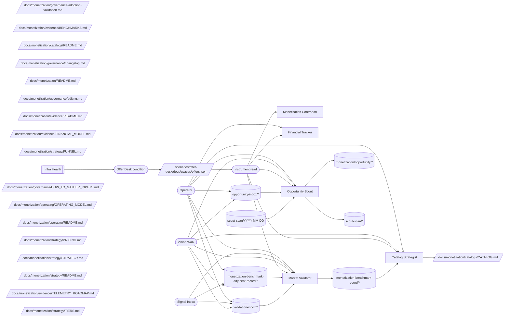

# Monetization Operating Model

## Mission

The monetization team owns the judgment that turns Vrooli's capabilities into
an honest path to default-alive: what is worth offering, how it is packaged,
which evidence changes the plan, and which gaps need work. Offer Desk is the
team's live instrument. It holds current offer, variant, channel, revenue-line,
deliverable, relationship, pricing, promotion, and financial-posture state;
Money Ledger supplies the financial observations that Offer Desk surfaces.

The instrument is an operational address, not a replacement for judgment.
Strategy, policy, rationale, taxonomies, and evidence method remain in the
surviving `docs/monetization/` corpus.

**Objective served.** `T1` — income, as primary (`path:docs/director-swarm/strategy/OBJECTIVES.md`). **Terminal**, not instrumental: "earn a living from my business" is a thing the operator wants directly, and it only looks self-referential because this operator's business is Vrooli itself. Another operator would run a different business and staff this same team shape against it. The derivation is short — packaging judgment plus the evidence that changes it plus honest financial posture *is* the path to income — which is why this team's risk is not mis-derivation but drift into activity that no offer or revenue line is waiting on.

**Outcome contribution.** Primary: **Ledger** (revenue and financial position) — offers, revenue lines, and pricing are what the category measures. Supporting: **Broadcast**, by supplying what marketing has to sell. The swarm-tier map of which team moves which outcome lives in `path:docs/director-swarm/evidence/OUTCOMES_CHARTER.md` §"Team contribution map"; this paragraph is this team's own statement of it.

## Scope

- Catalog and packaging judgment: active offers, bundles, delivery variants,
  channels, revenue lines, and deliverables.
- Promotion judgment: explicit triggers, evidence quality, operator gates, and
  refusal explanations.
- Financial posture judgment: read current actuals and declared goals from
  Money Ledger; never invent absent values or author ledger state here.
- Benchmark judgment: validate dated, applicable evidence and preserve
  uncertainty when a source is stale or unavailable.
- Opportunity judgment: classify signals, maintain revisit triggers, and route
  strong ideas into governed work.
- Shape judgment: keep the team aligned with the target model and surface
  deviations without restructuring the system itself.

## Operating Loops

| Loop | Owner | Input | Judgment | Durable result |
|---|---|---|---|---|
| Opportunity intake | `member:opportunity-scout` | `topic:opportunity-inbox/*` | Fit, hypotheses, revisit trigger, and whether a signal deserves work | `topic:monetization/opportunity/*`, `topic:scout-scan/*`, or a work item |
| Catalog and promotion | `member:catalog-strategist` | Offer Desk state plus benchmark records | Packaging, tier, lifecycle, and operator-gate interpretation | Offer Desk board state; surviving catalog judgment |
| Financial posture | `member:financial-tracker` | Offer Desk board and Money Ledger actuals/goals | Materiality, source age, and whether posture is known, degraded, or unavailable | Read-only posture interpretation and handoff; no duplicate ledger |
| Benchmark validation | `member:market-validator` | `topic:validation-inbox/*`, adjacent benchmark evidence | Applicability, staleness, and whether a comparison is decision-grade | `topic:monetization-benchmark-record/*` or a work item |
| Contrarian review | `member:monetization-contrarian` | Current instrument state and proposed work | Seven failure modes, channel guardrail, and target-model deviations | Challenge record or handoff; no positive proposal |

The loops are independent. Evidence may remain evidence without changing the
instrument, and an Offer Desk trigger may remain unsatisfied without becoming a
pricing decision. Financial posture remains explicitly UNKNOWN when Money
Ledger has no applicable observation.

## Operating Graph

This graph is the team-level contract: one live address, five judgment lanes,
typed evidence topics, and an independent condition watcher.

<!-- prompt-manager-graph:
id: monetization-operating-model
scope: team
team: monetization
mode: contract
actor_alias.operator: external:operator
actor_alias.marketing: team:marketing-crew
actor_alias.work owners: none
-->

`team:infra-health` is a directed condition watcher for the Offer Desk
instrument: `team:infra-health` → `process:offer-desk-condition` →
`por:scenarios/offer-desk/docs/spaces/offers.json`. It reports availability,
lifecycle, and service-condition gaps; it does not supply monetization
judgment. The watcher reports Offer Desk condition; Offer Desk supplies state
only and does not supply the watcher's judgment. Offer Desk likewise does not judge its own health or author the
denominator used by the watcher. This is the second sensor required by the
instrument contract.

## Topic Catalog

| Topic family | Status | Owner / primary writer | Primary readers | Purpose |
|---|---|---|---|---|
| `topic:monetization-benchmark-adjacent-record/*` | live |  | member:market-validator | Cross-team benchmark-adjacent evidence from marketing. |
| `topic:monetization-benchmark-record/*` | live | member:market-validator | member:catalog-strategist | Validated benchmark records. |
| `topic:monetization/opportunity/*` | live | member:opportunity-scout |  | Additional opportunity observations that are not yet promoted. |
| `topic:opportunity-inbox/*` | live |  | member:opportunity-scout | Intake for monetization opportunity signals classified by `monetization-opportunity`. |
| `topic:scout-scan/*` | live | member:opportunity-scout | member:opportunity-scout | Scout heartbeat summaries and pool snapshots. |
| `topic:scout-scan/YYYY-MM-DD` | live | member:opportunity-scout | member:opportunity-scout | Scout heartbeat summaries and pool snapshots. |
| `topic:validation-inbox/*` | live |  | member:market-validator | Validation requests classified by `monetization-validation`. |

## External Inputs / Triggers

| Producer / trigger | Entry surface | Drainer | Routing rule |
|---|---|---|---|
| `external:operator` opportunity | `topic:opportunity-inbox/*` | `member:opportunity-scout` | Classify, observe, promote to judgment, file work, or drop according to the monetization-opportunity taxonomy. |
| `external:operator` validation request | `topic:validation-inbox/*` | `member:market-validator` | Capture, refresh, preserve uncertainty, file work, or drop according to the monetization-validation taxonomy. |
| `external:signal-inbox` adjacent evidence | `topic:monetization-benchmark-adjacent-record/*` | `member:market-validator` | Validate the source, date, applicability, and materiality before writing a benchmark record. |
| `team:infra-health` condition observation | `por:scenarios/offer-desk/docs/spaces/offers.json` | `team:infra-health` | Route availability or health gaps without changing monetization judgment. |

## Outputs / Downstream Consumers

| Output | Surface | Consumer | Purpose |
|---|---|---|---|
| Current monetization state | `por:scenarios/offer-desk/docs/spaces/offers.json` | `member:catalog-strategist` | One address for catalog, promotion, and financial posture. |
| Validated benchmark record | `topic:monetization-benchmark-record/*` | `member:catalog-strategist` | Ground decisions without turning stale or inapplicable evidence into fact. |
| Opportunity judgment | `topic:monetization/opportunity/*` | `member:catalog-strategist` | Preserve a candidate's hypotheses and revisit trigger before activation. |
| Strategy and policy | `por:docs/monetization/strategy/STRATEGY.md` | `external:operator` | Carry rationale, principles, taxonomies, and evidence method not represented by the instrument. |
| Validation or capability handoff | `topic:validation-inbox/*` | `member:market-validator` | Route implementation or platform gaps with evidence and a boundary. |

## Feedback / Capability Improvement Loop

1. `member:financial-tracker` and `member:catalog-strategist` read
   `por:scenarios/offer-desk/docs/spaces/offers.json` first and record the
   source and age of any unavailable dependency.
2. `team:infra-health` observes `por:scenarios/offer-desk/docs/spaces/offers.json`
   independently and routes service or availability gaps; it never grades
   monetization decisions.
3. Repeated missing facts, stale evidence, or queue failures enter `topic:validation-inbox/*` for `member:market-validator` with the owning scenario named.
4. `member:monetization-contrarian` checks the change against
   `docs/agent-system/TARGET_MODEL.md` and the seven monetization failure modes
   before the team adopts a new surface.

## Current Implementation Gaps

- Channel attribution and retention metrics remain target-state until `docs/monetization/evidence/TELEMETRY_ROADMAP.md` has corresponding telemetry.
- Cross-scenario journey authoring remains an `experience-manager` capability
  gap; the team does not fake one page as ownership of both scenarios.
- Browser-floor capture has a provider boundary in `experience-manager` and
  Browser Automation Studio, while product-side `experience/` suites are clean.
- `por:scenarios/offer-desk/docs/spaces/offers.json` owns current machine state;
  the surviving `docs/monetization/` corpus still owns judgment and must not
  reintroduce duplicate state tables.
- Catalog identity is not considered repaired until the read-only `offer-desk offers catalog-verify`
  gate reports zero drift. Reconciliation is rerun after
  catalog imports, merges, or source changes; a nonzero result blocks adoption
  claims and names the duplicate, orphan, or extra-node evidence.

## Adoption / Validation

Validation commands:

- `prompt-manager graph operating-model validate --team monetization --id monetization-operating-model`
- `prompt-manager graph operating-model diff --team monetization --id monetization-operating-model`
- `prompt-manager graph operating-model coverage --team monetization --id monetization-operating-model`
- `prompt-manager graph instruments --json`
- `prompt-manager graph orientation-cost --json`

This operating model is registered through
`scenarios/prompt-manager/store/teams/monetization/team.json` and remains
discoverable from `docs/monetization/README.md`.
