# Monetization Operating Model

**Status:** explanatory PoR canon. This document defines how `monetization` works as a coherent system: opportunity intake, catalog strategy, financial tracking, validation, contrarian review, and operator-approved canon updates.

The current document adopts the generic team operating-model shape from `path:docs/agent-system/OPERATING_GRAPHS.md`.

## Mission

Monetization turns Vrooli's product capabilities, market signals, operator inputs, and financial constraints into a coherent SKU catalog, pricing posture, revenue-line strategy, channel discipline, and evidence-backed decisions.

The team does not own marketing voice, direct scenario implementation, deployment infrastructure, or portfolio prioritization. It owns monetization truth and proposes changes through operator-approved decisions.

**Objective served.** `T1` — income (`path:docs/director-swarm/strategy/OBJECTIVES.md`). This is a **terminal** objective, not an instrumental one: earning a living from the operator's business is a thing the operator wants, and it only looks self-referential because this operator's business happens to be Vrooli itself. Another operator would run a different business and staff this same team shape against it. One consequence binds this team's catalog work: a SKU revisit trigger answers *when do we sell this*, and does not transfer to *when do we build this* — the latter is an objective-level question owned by `director-swarm`.

**Outcome contribution.** Primary: **Ledger** (revenue & subscriptions) — catalog, tiers, and the financial model define the revenue lines the Ledger dashboard measures. Supporting: **Broadcast**, by owning what the funnel converts into. The swarm-tier map of which team moves which outcome lives in `path:docs/director-swarm/evidence/OUTCOMES_CHARTER.md` §"Team contribution map"; this paragraph is this team's own statement of it.

## Scope

Monetization owns:

- SKU catalog canon, base bundles, add-ons, and scenario-to-SKU mapping;
- delivery-tier, pricing, funnel, revenue-line, channel, and financial-model canon;
- opportunity classification and candidate-pool hygiene;
- validation-request classification, market benchmarks, and benchmark refresh proposals;
- runway, default-alive, time-allocation, services-trap, funnel, and retention warnings;
- contrarian review of material monetization proposals;
- taxonomy sidecars for monetization opportunity and validation request flows.

Monetization does not write marketing content, run campaigns, build scenarios, or edit non-monetization PoR surfaces. Those outputs route to owning teams through decisions, backlog items, or capability gaps.

## Operating Loops

Monetization has five loops:

1. **Opportunity loop** — drain `opportunity-inbox/*`, classify signals with the opportunity taxonomy, write candidate records or market scans, and raise catalog/channel/services decisions when thresholds fire.
2. **Catalog loop** — inspect candidate SKUs, tiers, services lines, channel triggers, and scenario-role changes; propose the smallest catalog or mapping decision that keeps the canon accurate.
3. **Financial loop** — read operator inputs and telemetry, compute runway/default-alive posture, flag material assumption, pricing, funnel, retention, and services-capacity changes.
4. **Validation loop** — drain validation requests, refresh stale benchmarks, capture market comps, and raise benchmark, pricing, or assumption-update decisions when evidence is material.
5. **Challenge loop** — review pending monetization decisions for catalog sprawl, premature activation, services trap, retention blindness, hallucinated metrics, positioning drift, and marketing-default failure modes.

The loops are intentionally independent. A market scan can remain evidence without changing canon; a catalog trigger can fire without a pricing change; a contrarian review can stay quiet when proposals are well-grounded.

## Operating Graph

This graph is the team-level contract. It shows how operator inputs, market signals, catalog state, validation requests, and challenge records move through the monetization team.

<!-- prompt-manager-graph:
id: monetization-operating-model
scope: team
team: monetization
mode: contract
actor_alias.operator: external:operator
actor_alias.marketing: team:marketing-crew
actor_alias.decision owners: none
-->

```mermaid
flowchart LR
  %% @node ADJ topic:monetization-benchmark-adjacent-record/*
  ADJ[(monetization-benchmark-adjacent-record/*)]
  %% @node ASSUMP decision:financial-model-assumption-update
  ASSUMP{financial-model-assumption-update}
  %% @node ATTRIB decision:channel-attribution-gap
  ATTRIB{channel-attribution-gap}
  %% @node BENCH topic:monetization-benchmark-record/*
  BENCH[(monetization-benchmark-record/*)]
  %% @node BENCHDEC decision:benchmark-update
  BENCHDEC{benchmark-update}
  %% @node BM por:docs/monetization/evidence/BENCHMARKS.md
  BM[/docs/monetization/evidence/BENCHMARKS.md/]
  %% @node CAND topic:candidate-sku-record/*
  CAND[(candidate-sku-record/*)]
  %% @node CAP decision:capability-gap
  CAP{capability-gap}
  %% @node CATALOG por:docs/monetization/catalogs/CATALOG.md
  CATALOG[/docs/monetization/catalogs/CATALOG.md/]
  %% @node CATPROMO decision:catalog-promotion
  CATPROMO{catalog-promotion}
  %% @node CHACT decision:channel-activation
  CHACT{channel-activation}
  %% @node CHAL topic:challenge-report/*
  CHAL[(challenge-report/*)]
  %% @node CS member:catalog-strategist
  CS[Catalog Strategist]
  %% @node FIN por:docs/monetization/evidence/FINANCIAL_MODEL.md
  FIN[/docs/monetization/evidence/FINANCIAL_MODEL.md/]
  %% @node FRAME decision:framework-update
  FRAME{framework-update}
  %% @node FT member:financial-tracker
  FT[Financial Tracker]
  %% @node FUNNEL decision:funnel-bottleneck
  FUNNEL{funnel-bottleneck}
  %% @node LEDGER topic:ledger-snapshot/*
  LEDGER[(ledger-snapshot/*)]
  %% @node LEDGERLOG topic:monetization-ledger-log/*
  LEDGERLOG[(monetization-ledger-log/*)]
  %% @node MAP decision:catalog-mapping-update
  MAP{catalog-mapping-update}
  %% @node MC member:monetization-contrarian
  MC[Monetization Contrarian]
  %% @node MSCAN topic:monetization/market-scan/*
  MSCAN[(monetization/market-scan/*)]
  %% @node MV member:market-validator
  MV[Market Validator]
  %% @node OIN topic:opportunity-inbox/*
  OIN[(opportunity-inbox/*)]
  %% @node OP external:operator
  OP([Operator])
  %% @node OPP topic:monetization/opportunity/*
  OPP[(monetization/opportunity/*)]
  %% @node OS member:opportunity-scout
  OS[Opportunity Scout]
  %% @node PRICE por:docs/monetization/strategy/PRICING.md
  PRICE[/docs/monetization/strategy/PRICING.md/]
  %% @node PRICEDEC decision:pricing-decision
  PRICEDEC{pricing-decision}
  %% @node REJECT decision:decision-rejection-proposed
  REJECT{decision-rejection-proposed}
  %% @node RES topic:challenge-resolution-record/*
  RES[(challenge-resolution-record/*)]
  %% @node RETENTION decision:retention-concern
  RETENTION{retention-concern}
  %% @node RETIRE decision:sku-retirement
  RETIRE{sku-retirement}
  %% @node RUNWAY decision:runway-warning
  RUNWAY{runway-warning}
  %% @node SCOUT topic:scout-scan/*
  SCOUT[(scout-scan/*)]
  %% @node SERVACT decision:services-activation
  SERVACT{services-activation}
  %% @node SERVCONV decision:services-conversion
  SERVCONV{services-conversion}
  %% @node SERVSUN decision:services-sunset
  SERVSUN{services-sunset}
  %% @node SI external:signal-inbox
  SI([Signal Inbox])
  %% @node SKU por:docs/monetization/catalogs/scenario-sku-map.json
  SKU[/docs/monetization/catalogs/scenario-sku-map.json/]
  %% @node SNAP topic:catalog-snapshot/*
  SNAP[(catalog-snapshot/*)]
  %% @node STRAP decision:services-trap-warning
  STRAP{services-trap-warning}
  %% @node STRAT por:docs/monetization/strategy/STRATEGY.md
  STRAT[/docs/monetization/strategy/STRATEGY.md/]
  %% @node VAIN topic:validation-inbox/*
  VAIN[(validation-inbox/*)]
  %% @node VW external:vision-walk
  VW([Vision Walk])
  %% @node DOCSMONETIZA por:docs/monetization/README.md
  DOCSMONETIZA[/docs/monetization/README.md/]
  %% @node DOCSMONETIZA2 por:docs/monetization/catalogs/README.md
  DOCSMONETIZA2[/docs/monetization/catalogs/README.md/]
  %% @node DOCSMONETIZA3 por:docs/monetization/evidence/README.md
  DOCSMONETIZA3[/docs/monetization/evidence/README.md/]
  %% @node DOCSMONETIZA4 por:docs/monetization/evidence/TELEMETRY_ROADMAP.md
  DOCSMONETIZA4[/docs/monetization/evidence/TELEMETRY_ROADMAP.md/]
  %% @node DOCSMONETIZA5 por:docs/monetization/governance/HOW_TO_GATHER_INPUTS.md
  DOCSMONETIZA5[/docs/monetization/governance/HOW_TO_GATHER_INPUTS.md/]
  %% @node DOCSMONETIZA6 por:docs/monetization/governance/adoption-validation.md
  DOCSMONETIZA6[/docs/monetization/governance/adoption-validation.md/]
  %% @node DOCSMONETIZA7 por:docs/monetization/governance/changelog.md
  DOCSMONETIZA7[/docs/monetization/governance/changelog.md/]
  %% @node DOCSMONETIZA8 por:docs/monetization/governance/editing.md
  DOCSMONETIZA8[/docs/monetization/governance/editing.md/]
  %% @node DOCSMONETIZA9 por:docs/monetization/operating/OPERATING_MODEL.md
  DOCSMONETIZA9[/docs/monetization/operating/OPERATING_MODEL.md/]
  %% @node DOCSMONETIZA10 por:docs/monetization/operating/README.md
  DOCSMONETIZA10[/docs/monetization/operating/README.md/]
  %% @node DOCSMONETIZA11 por:docs/monetization/strategy/FUNNEL.md
  DOCSMONETIZA11[/docs/monetization/strategy/FUNNEL.md/]
  %% @node DOCSMONETIZA12 por:docs/monetization/strategy/README.md
  DOCSMONETIZA12[/docs/monetization/strategy/README.md/]
  %% @node DOCSMONETIZA13 por:docs/monetization/strategy/TIERS.md
  DOCSMONETIZA13[/docs/monetization/strategy/TIERS.md/]
  %% @node CATALOGSNAPS topic:catalog-snapshot/YYYY-MM-DD
  CATALOGSNAPS[(catalog-snapshot/YYYY-MM-DD)]
  %% @node CHALLENGEREP topic:challenge-report/<decision-id>
  CHALLENGEREP[(challenge-report/<decision-id>)]
  %% @node CHALLENGERES topic:challenge-resolution-record/<decision-id>
  CHALLENGERES[(challenge-resolution-record/<decision-id>)]
  %% @node LEDGERSNAPSH topic:ledger-snapshot/YYYY-MM-DD
  LEDGERSNAPSH[(ledger-snapshot/YYYY-MM-DD)]
  %% @node MONETIZATION topic:monetization/market-scan/<slug>
  MONETIZATION[(monetization/market-scan/<slug>)]
  %% @node SCOUTSCANYYY topic:scout-scan/YYYY-MM-DD
  SCOUTSCANYYY[(scout-scan/YYYY-MM-DD)]

  BENCHDEC --> CS
  BENCHDEC --> FT
  BENCHDEC --> MC
  CAP --> CS
  CAP --> FT
  CAP --> MV
  CAP --> OS
  MAP --> MC
  CATPROMO --> MC
  CHACT --> MC
  ATTRIB --> MC
  ASSUMP --> MC
  FUNNEL --> MC
  PRICEDEC --> MC
  RETENTION --> MC
  RUNWAY --> MC
  SERVACT --> MC
  SERVCONV --> MC
  SERVSUN --> MC
  STRAP --> MC
  RETIRE --> MC
  OP --> CS
  OP --> FT
  OP --> MV
  OP --> OS
  OP --> ADJ
  OP --> OIN
  OP --> VAIN
  SI --> MV
  SI --> ADJ
  SI --> VAIN
  VW --> CS
  VW --> MV
  VW --> OS
  VW --> ADJ
  VW --> OIN
  VW --> VAIN
  CS --> MAP
  CS --> CATPROMO
  CS --> CHACT
  CS --> SERVACT
  CS --> SERVCONV
  CS --> SERVSUN
  CS --> RETIRE
  CS --> CATALOG
  CS --> SNAP
  FT --> ATTRIB
  FT --> ASSUMP
  FT --> FUNNEL
  FT --> PRICEDEC
  FT --> RETENTION
  FT --> RUNWAY
  FT --> STRAP
  FT --> LEDGER
  FT --> LEDGERLOG
  MV --> BENCHDEC
  MV --> CAP
  MV --> ASSUMP
  MV --> PRICEDEC
  MV --> BENCH
  MV --> MSCAN
  MC --> REJECT
  MC --> FRAME
  MC --> CHAL
  MC --> RES
  OS --> CAP
  OS --> CATPROMO
  OS --> CHACT
  OS --> SERVACT
  OS --> CAND
  OS --> OPP
  OS --> SCOUT
  CAND --> CS
  CATALOGSNAPS --> CS
  CHAL --> CS
  CHAL --> FT
  CHAL --> MV
  CHAL --> OS
  CHALLENGEREP --> MC
  RES --> CS
  RES --> FT
  RES --> MV
  RES --> OS
  CHALLENGERES --> MC
  LEDGERSNAPSH --> FT
  ADJ --> MV
  BENCH --> CS
  MONETIZATION --> MV
  OIN --> OS
  SCOUTSCANYYY --> OS
  VAIN --> MV
```

## Topic Catalog

| Topic family | Status | Owner / primary writer | Primary readers | Purpose |
|---|---|---|---|---|
| `topic:candidate-sku-record/*` | live | member:opportunity-scout | member:catalog-strategist | Candidate SKU, add-on, services-line, or channel records. |
| `topic:catalog-snapshot/*` | live | member:catalog-strategist | member:catalog-strategist | Snapshot of SKU, tier, channel, and services-line trigger state. |
| `topic:catalog-snapshot/YYYY-MM-DD` | live | member:catalog-strategist | member:catalog-strategist | Snapshot of SKU, tier, channel, and services-line trigger state. |
| `topic:challenge-report/*` | live | member:monetization-contrarian | member:catalog-strategist, member:financial-tracker, member:market-validator, member:monetization-contrarian, member:opportunity-scout | Append-only challenge evidence. |
| `topic:challenge-report/<decision-id>` | live | member:monetization-contrarian | member:catalog-strategist, member:financial-tracker, member:market-validator, member:monetization-contrarian, member:opportunity-scout | Append-only challenge evidence. |
| `topic:challenge-resolution-record/*` | live | member:monetization-contrarian | member:catalog-strategist, member:financial-tracker, member:market-validator, member:monetization-contrarian, member:opportunity-scout | Latest-state challenge resolution records. |
| `topic:challenge-resolution-record/<decision-id>` | live | member:monetization-contrarian | member:catalog-strategist, member:financial-tracker, member:market-validator, member:monetization-contrarian, member:opportunity-scout | Latest-state challenge resolution records. |
| `topic:ledger-snapshot/*` | live | member:financial-tracker | member:financial-tracker | Financial posture snapshot. |
| `topic:ledger-snapshot/YYYY-MM-DD` | live | member:financial-tracker | member:financial-tracker | Financial posture snapshot. |
| `topic:monetization-benchmark-adjacent-record/*` | live |  | member:market-validator | Cross-team benchmark-adjacent evidence from marketing. |
| `topic:monetization-benchmark-record/*` | live | member:market-validator | member:catalog-strategist | Validated benchmark records. |
| `topic:monetization-ledger-log/*` | live | member:financial-tracker |  | Append-only monetization ledger events used to produce current financial posture snapshots. |
| `topic:monetization/market-scan/*` | live | member:market-validator | member:market-validator | Market-scan evidence. |
| `topic:monetization/market-scan/<slug>` | live | member:market-validator | member:market-validator | Market-scan evidence. |
| `topic:monetization/opportunity/*` | live | member:opportunity-scout |  | Additional opportunity observations that are not yet promoted. |
| `topic:opportunity-inbox/*` | live |  | member:opportunity-scout | Intake for monetization opportunity signals classified by `monetization-opportunity`. |
| `topic:scout-scan/*` | live | member:opportunity-scout | member:opportunity-scout | Scout heartbeat summaries and pool snapshots. |
| `topic:scout-scan/YYYY-MM-DD` | live | member:opportunity-scout | member:opportunity-scout | Scout heartbeat summaries and pool snapshots. |
| `topic:validation-inbox/*` | live |  | member:market-validator | Validation requests classified by `monetization-validation`. |

## Decisions

| Decision context | Owner | Purpose | Expected evidence / trigger | Accepted effect |
|---|---|---|---|---|
| `capability-gap` | `member:opportunity-scout`, `member:market-validator` | Route a missing tool, data source, prompt surface, validation rule, or owner that blocks monetization work. | A member cannot proceed without a named missing capability. | Creates a routed capability request for the owning team or operator. |
| `catalog-promotion` | `member:catalog-strategist`, `member:opportunity-scout` | Promote scenario, SKU, add-on, services line, or candidate for operator review. | `topic:candidate-sku-record/*` or `topic:catalog-snapshot/*` shows trigger fired. | Updates `path:docs/monetization/catalogs/CATALOG.md` or catalog entry files. |
| `catalog-mapping-update` | `member:catalog-strategist` | Update scenario-to-SKU membership or role mapping. | Scenario role changed or SKU mapping no longer matches reality. | Updates `path:docs/monetization/catalogs/scenario-sku-map.json`. |
| `channel-activation` | `member:catalog-strategist`, `member:opportunity-scout` | Activate a discovery channel when prerequisites and telemetry exist. | `topic:catalog-snapshot/*` or opportunity evidence shows activation trigger fired. | Updates `path:docs/monetization/catalogs/channels/README.md` and channel entry files. |
| `services-activation` | `member:catalog-strategist`, `member:opportunity-scout` | Activate a candidate services line. | Candidate has validation hypothesis, fixed-duration pilot, and productization target. | Updates `path:docs/monetization/catalogs/revenue-lines/README.md` and relevant revenue-line file. |
| `sku-retirement` | `member:catalog-strategist` | Retire a SKU, add-on, tier, or services line that no longer coheres or missed its target. | Candidate, benchmark, or catalog snapshot evidence shows a sustained mismatch. | Updates `path:docs/monetization/catalogs/CATALOG.md` or the relevant revenue-line entry. |
| `services-conversion` | `member:catalog-strategist` | Convert a services engagement into a subscription or productized offering. | Services evidence shows a repeatable productization opportunity. | Updates catalog and revenue-line canon. |
| `services-sunset` | `member:catalog-strategist` | Sunset a services line that missed its productization target or sunset date. | Catalog snapshot shows the line exceeded its time or conversion guardrail. | Updates revenue-line canon and pauses the line. |
| `pricing-decision` | `member:financial-tracker`, `member:market-validator` | Set or adjust price for SKU, tier, bundle, or revenue line. | Benchmark or financial signal materially affects price band. | Updates `path:docs/monetization/strategy/PRICING.md`. |
| `financial-model-assumption-update` | `member:financial-tracker`, `member:market-validator` | Revise a load-bearing financial or market assumption. | `topic:monetization-benchmark-record/*`, `topic:ledger-snapshot/*`, or operator input contradicts current model. | Updates `path:docs/monetization/evidence/FINANCIAL_MODEL.md`. |
| `runway-warning` | `member:financial-tracker` | Alert operator to material runway/default-alive gap. | `topic:ledger-snapshot/*` shows material runway change. | Updates `path:docs/monetization/evidence/FINANCIAL_MODEL.md` assumptions or the operator decision log. |
| `channel-attribution-gap` | `member:financial-tracker` | Identify a live or pilot channel that lacks decision-grade attribution telemetry. | Channel evidence lacks attribution required for monetization decisions. | Updates telemetry roadmap or blocks channel expansion pending measurement. |
| `services-trap-warning` | `member:financial-tracker` | Warn when services work exceeds guardrails. | Services time or services/subscription ratio breaches limits. | Updates `path:docs/monetization/catalogs/revenue-lines/README.md` discipline or pauses services work. |
| `benchmark-update` | `member:market-validator` | Promote refreshed or new benchmark into canon. | Market validation crosses taxonomy materiality threshold. | Updates `path:docs/monetization/evidence/BENCHMARKS.md`. |
| `funnel-bottleneck` | `member:financial-tracker` | Name the current measured funnel bottleneck. | Telemetry identifies a stage as materially blocked. | Updates `path:docs/monetization/strategy/FUNNEL.md` or `path:docs/monetization/evidence/TELEMETRY_ROADMAP.md`. |
| `retention-concern` | `member:financial-tracker` | Flag materially worse retention than target. | Measured retention metric misses target. | Updates `path:docs/monetization/strategy/FUNNEL.md` or financial assumptions. |
| `decision-rejection-proposed` | `member:monetization-contrarian` | Recommend rejecting or revising a weak proposal. | Pending decision hits a named failure mode. | Operator rejects, revises, or overrides decision. |
| `framework-update` | `member:monetization-contrarian` | Add a recurring flaw missing from the failure-mode framework. | Multiple proposals reveal an uncovered failure pattern. | Updates contrarian framework or operating model. |

## External Inputs / Triggers

| Producer / trigger | Entry surface | Drainer | Routing rule |
|---|---|---|---|
| `external:operator` monetization opportunity | `topic:opportunity-inbox/*` | `member:opportunity-scout` | Classify via `taxonomies/monetization-opportunity/taxonomy.json`; observe, promote, file decision, or raise capability gap. |
| `external:operator` validation request | `topic:validation-inbox/*` | `member:market-validator` | Classify via `taxonomies/monetization-validation/taxonomy.json`; capture, refresh, or raise decision by materiality threshold. |
| `team:marketing-crew` benchmark-adjacent evidence | `topic:monetization-benchmark-adjacent-record/*` | `member:market-validator` | Validate with `signal-classifier`; producer owns front-matter shape, validator owns benchmark disposition. |
| Operator-provided financial inputs | `topic:ledger-snapshot/*` | `member:financial-tracker` | Interpret per `path:docs/monetization/governance/HOW_TO_GATHER_INPUTS.md`; do not edit operator state. |

## Outputs / Downstream Consumers

| Output | Surface | Consumer | Purpose |
|---|---|---|---|
| SKU catalog updates | `path:docs/monetization/catalogs/CATALOG.md` | `team:director-swarm`, `team:marketing-crew`, `external:operator` | Keep bundle, add-on, and candidate catalog authoritative. |
| Scenario-to-SKU mapping | `path:docs/monetization/catalogs/scenario-sku-map.json` | `team:marketing-crew`, `team:director-swarm`, downstream scenarios | Drive tier alignment, campaign claims, and bundle membership. |
| Pricing and tier canon | `path:docs/monetization/strategy/PRICING.md` | `team:marketing-crew`, `external:operator` | Keep external pricing claims consistent with monetization truth. |
| Market benchmarks | `path:docs/monetization/evidence/BENCHMARKS.md` | `member:financial-tracker`, `external:operator` | Ground pricing, financial assumptions, and validation requests. |
| Ledger snapshots | `topic:ledger-snapshot/*` | `external:operator`, `member:monetization-contrarian` | Surface current runway, burn, revenue, and default-alive status. |
| Challenge records | `topic:challenge-report/*`, `topic:challenge-resolution-record/*` | `external:operator`, decision owners | Preserve skeptical review state for material decisions. |

## Feedback / Capability Improvement Loop

1. `member:financial-tracker` flags missing telemetry in `topic:ledger-snapshot/*` and routes the gap through `decision:channel-attribution-gap`.
2. `member:market-validator` raises `capability-gap` when source access blocks `topic:monetization-benchmark-record/*` rather than inventing values.
3. `member:catalog-strategist` uses `topic:catalog-snapshot/*` to detect stale SKU, tier, channel, and services-line assumptions.
4. `member:monetization-contrarian` writes `topic:challenge-report/*` only for concrete failure modes and keeps latest state in `topic:challenge-resolution-record/*`.
5. Repeated gaps become `decision:framework-update`, `decision:financial-model-assumption-update`, or capability-gap decisions routed to the owning team.

## Current Implementation Gaps

- `topic[future]:channel-attribution/*` is target-state until channel attribution telemetry exists.
- `topic[future]:retention-metric/*` is target-state until subscription lifecycle telemetry ships.
- `path:docs/monetization/interfaces/` is target-state; current inputs and outputs still fit inside this operating model.
- `path:docs/monetization/evidence/TELEMETRY_ROADMAP.md` remains the primary bridge from aspirational monetization logic to measured signals.

## Adoption / Validation

Validation commands:

- `prompt-manager graph operating-model validate --team monetization --id monetization-operating-model`
- `prompt-manager graph operating-model diff --team monetization --id monetization-operating-model`
- `prompt-manager graph operating-model coverage --team monetization --id monetization-operating-model`

This operating model must stay registered through `scenarios/prompt-manager/store/teams/monetization/team.json` and discoverable from `docs/monetization/README.md`.
