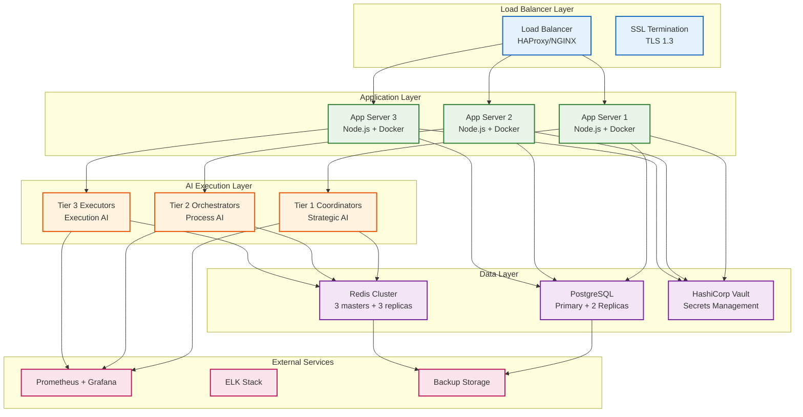

# Production Operations & Deployment Guide

> ⚠️ **Status:** Operational reference only. The deployment procedures described here pre-date the tiered deployment plan. Pair this document with the [Deployment Hub](../deployment/README.md) to understand which pieces remain relevant (monitoring, incident response) versus which are legacy (multi-server topology, packaging scripts).

This guide covers everything needed to successfully deploy, monitor, and maintain Vrooli in production environments.

## 📋 Table of Contents

- [Production Architecture](#production-architecture)
- [Pre-Deployment Checklist](#pre-deployment-checklist)
- [Deployment Procedures](#deployment-procedures)
- [Monitoring & Alerting](#monitoring--alerting)
- [Backup & Recovery](#backup--recovery)
- [Security Hardening](#security-hardening)
- [Performance Optimization](#performance-optimization)
- [Troubleshooting](#troubleshooting)
- [Incident Response](#incident-response)

## 🏗️ Production Architecture (Legacy Topology)

### **Historical Topology**



### **Minimum Production Requirements (Legacy)**

#### **Compute Resources**
- **Application Servers**: 3x instances (4 CPU, 16GB RAM, 100GB SSD)
- **Database**: 1x primary + 2x replicas (8 CPU, 32GB RAM, 500GB SSD)
- **Redis**: 3x masters + 3x replicas (2 CPU, 8GB RAM, 50GB SSD)
- **Load Balancer**: 2x instances (2 CPU, 4GB RAM, 20GB SSD)

#### **Network Requirements**
- **Bandwidth**: Minimum 1Gbps, recommended 10Gbps
- **Latency**: <5ms between services in same region
- **Availability**: 99.9% uptime SLA minimum

#### **Storage Requirements**
- **Database**: 500GB initial, plan for 50GB growth/month
- **Redis**: 50GB initial, plan for 10GB growth/month
- **Logs**: 100GB initial, plan for 20GB growth/month
- **Backups**: 3x database size for retention

## ✅ Pre-Deployment Checklist

### **Infrastructure Preparation**

#### **DNS & Certificates**
- [ ] Domain configured with proper DNS records
- [ ] SSL certificates obtained and configured
- [ ] CDN configured for static assets (optional)
- [ ] DNS failover configured for high availability

#### **Security Setup**
- [ ] Firewall rules configured (only required ports open)
- [ ] VPN access configured for admin access
- [ ] SSH keys configured (no password authentication)
- [ ] Intrusion detection system configured
- [ ] Security scanning completed

#### **Monitoring & Logging**
- [ ] Prometheus configured with proper targets
- [ ] Grafana dashboards imported
- [ ] ELK stack configured for log aggregation
- [ ] Alerting rules configured
- [ ] PagerDuty/OpsGenie integration setup

### **Application Preparation**

#### **Environment Configuration**
- [ ] Production environment variables configured
- [ ] HashiCorp Vault setup with secrets
- [ ] Database connection strings configured
- [ ] Redis cluster endpoints configured
- [ ] External service API keys configured

#### **Database Setup**
- [ ] PostgreSQL cluster configured
- [ ] Database migrations applied
- [ ] Backup strategy implemented
- [ ] Monitoring configured (slow query log, etc.)
- [ ] Read replicas configured

#### **Application Build**
- [ ] Production Docker images built
- [ ] Image vulnerability scanning completed
- [ ] Container registry configured
- [ ] Health check endpoints tested
- [ ] Load testing completed

### **Deployment Validation**

#### **Functionality Testing**
- [ ] All API endpoints functional
- [ ] Authentication/authorization working
- [ ] AI execution tiers communicating properly
- [ ] External integrations working
- [ ] WebSocket connections stable

#### **Performance Testing**
- [ ] Load testing completed (expected concurrent users)
- [ ] Database performance validated
- [ ] Redis performance validated
- [ ] Memory usage within limits
- [ ] Response times meet SLA requirements

## 🚀 Deployment Procedures

### **Method 1: Kubernetes Deployment (Recommended)**

#### **Cluster Setup**
```bash
# Install Kubernetes cluster (example with kubeadm)
kubeadm init --pod-network-cidr=10.244.0.0/16

# Install CNI plugin
kubectl apply -f https://raw.githubusercontent.com/flannel-io/flannel/master/Documentation/kube-flannel.yml

# Install Helm
curl https://raw.githubusercontent.com/helm/helm/main/scripts/get-helm-3 | bash
```

#### **Deploy Vrooli**
```bash
# Clone the repository
git clone https://github.com/vrooli/vrooli.git
cd vrooli

# Configure values for production
cp k8s/values.yaml k8s/values.prod.yaml
# Edit k8s/values.prod.yaml with production settings

# Deploy with Helm
helm install vrooli ./k8s/helm/vrooli -f k8s/values.prod.yaml

# Verify deployment
kubectl get pods -n vrooli
kubectl get services -n vrooli
```

#### **Production Helm Values**
```yaml
# k8s/values.prod.yaml
replicaCount: 3

image:
  repository: vrooli/server
  tag: "1.0.0"
  pullPolicy: IfNotPresent

resources:
  limits:
    cpu: 2000m
    memory: 4Gi
  requests:
    cpu: 1000m
    memory: 2Gi

postgresql:
  enabled: true
  primary:
    persistence:
      size: 500Gi
  readReplicas:
    replicaCount: 2

redis:
  enabled: true
  cluster:
    enabled: true
    nodes: 6

monitoring:
  enabled: true
  prometheus:
    enabled: true
  grafana:
    enabled: true

ingress:
  enabled: true
  annotations:
    nginx.ingress.kubernetes.io/ssl-redirect: "true"
    cert-manager.io/cluster-issuer: "letsencrypt-prod"
  hosts:
    - host: api.vrooli.com
      paths:
        - path: /
          pathType: Prefix
  tls:
    - secretName: vrooli-tls
      hosts:
        - api.vrooli.com
```

### **Method 2: Docker Compose Deployment**

#### **Production Docker Compose**
```yaml
# docker-compose.prod.yml
version: '3.8'

services:
  app:
    image: vrooli/server:1.0.0
    deploy:
      replicas: 3
      restart_policy:
        condition: on-failure
        delay: 5s
        max_attempts: 3
    environment:
      - NODE_ENV=production
      - DATABASE_URL=${DATABASE_URL}
      - REDIS_URL=${REDIS_URL}
    depends_on:
      - postgres
      - redis
    networks:
      - vrooli-network

  postgres:
    image: postgres:15
    environment:
      - POSTGRES_DB=vrooli
      - POSTGRES_USER=${POSTGRES_USER}
      - POSTGRES_PASSWORD=${POSTGRES_PASSWORD}
    volumes:
      - postgres_data:/var/lib/postgresql/data
      - ./backup:/backup
    ports:
      - "5432:5432"
    networks:
      - vrooli-network

  redis:
    image: redis:7-alpine
    command: redis-server --appendonly yes
    volumes:
      - redis_data:/data
    ports:
      - "6379:6379"
    networks:
      - vrooli-network

  nginx:
    image: nginx:alpine
    ports:
      - "80:80"
      - "443:443"
    volumes:
      - ./nginx.conf:/etc/nginx/nginx.conf
      - ./ssl:/etc/ssl
    depends_on:
      - app
    networks:
      - vrooli-network

volumes:
  postgres_data:
  redis_data:

networks:
  vrooli-network:
    driver: bridge
```

#### **Deployment Commands**
```bash
# Deploy to production
docker compose -f docker-compose.prod.yml up -d

# Scale application
docker compose -f docker-compose.prod.yml up -d --scale app=5

# Update application
docker compose -f docker-compose.prod.yml pull
docker compose -f docker-compose.prod.yml up -d --no-deps app

# View logs
docker compose -f docker-compose.prod.yml logs -f app
```

### **Method 3: Traditional VM Deployment**

#### **Server Setup**
```bash
# Install Node.js
curl -fsSL https://deb.nodesource.com/setup_18.x | sudo -E bash -
sudo apt-get install -y nodejs

# Install PM2 for process management
npm install -g pm2

# Create application user
sudo useradd -r -s /bin/false vrooli
sudo mkdir -p /opt/vrooli
sudo chown vrooli:vrooli /opt/vrooli

# Deploy application
cd /opt/vrooli
git clone https://github.com/vrooli/vrooli.git .
npm install --production
npm run build
```

#### **PM2 Configuration**
```javascript
// ecosystem.config.js
module.exports = {
  apps: [{
    name: 'vrooli-scenario',
    script: 'scripts/manage.sh',
    args: 'develop',
    instances: 1,
    env: {
      NODE_ENV: 'production',
      PORT: 3001
    },
    error_file: '/var/log/vrooli/err.log',
    out_file: '/var/log/vrooli/out.log',
    log_file: '/var/log/vrooli/combined.log',
    time: true
  }]
};
```

```bash
# Start application
pm2 start ecosystem.config.js
pm2 startup
pm2 save
```

## 📊 Monitoring & Alerting

### **Key Metrics to Monitor**

#### **Application Metrics**
- **Response Time**: API endpoint response times
- **Error Rate**: HTTP 4xx/5xx error rates
- **Throughput**: Requests per second
- **Active Connections**: WebSocket connections
- **AI Execution**: Tier coordination performance

#### **Infrastructure Metrics**
- **CPU Usage**: Server CPU utilization
- **Memory Usage**: RAM and swap usage
- **Disk Usage**: Storage utilization and I/O
- **Network Usage**: Bandwidth and latency
- **Database Performance**: Query performance, connection pool

### **Alerting Rules**

#### **Critical Alerts (Immediate Response)**
```yaml
# prometheus-alerts.yml
groups:
  - name: vrooli-critical
    rules:
      - alert: ServiceDown
        expr: up{job="vrooli"} == 0
        for: 30s
        labels:
          severity: critical
        annotations:
          summary: "Vrooli service is down"

      - alert: HighErrorRate
        expr: rate(http_requests_total{status=~"5.."}[5m]) > 0.1
        for: 2m
        labels:
          severity: critical
        annotations:
          summary: "High error rate detected"

      - alert: DatabaseDown
        expr: up{job="postgres"} == 0
        for: 30s
        labels:
          severity: critical
        annotations:
          summary: "PostgreSQL database is down"

      - alert: RedisDown
        expr: up{job="redis"} == 0
        for: 30s
        labels:
          severity: critical
        annotations:
          summary: "Redis is down"
```

#### **Warning Alerts (Monitor Closely)**
```yaml
  - name: vrooli-warning
    rules:
      - alert: HighResponseTime
        expr: histogram_quantile(0.95, rate(http_request_duration_seconds_bucket[5m])) > 2
        for: 5m
        labels:
          severity: warning
        annotations:
          summary: "High response time detected"

      - alert: HighCPUUsage
        expr: 100 - (avg by(instance) (rate(node_cpu_seconds_total{mode="idle"}[5m])) * 100) > 80
        for: 10m
        labels:
          severity: warning
        annotations:
          summary: "High CPU usage"

      - alert: HighMemoryUsage
        expr: (node_memory_MemTotal_bytes - node_memory_MemAvailable_bytes) / node_memory_MemTotal_bytes > 0.85
        for: 10m
        labels:
          severity: warning
        annotations:
          summary: "High memory usage"
```

### **Grafana Dashboards**

#### **Application Dashboard**
- Request rate and response time
- Error rate by endpoint
- Active user sessions
- AI execution metrics
- Database query performance

#### **Infrastructure Dashboard**
- Server resource utilization
- Network traffic
- Database connections
- Redis performance
- Disk usage trends

## 💾 Backup & Recovery

### **Backup Strategy**

#### **Database Backups**
```bash
#!/bin/bash
# backup-database.sh

TIMESTAMP=$(date +%Y%m%d_%H%M%S)
BACKUP_DIR="/backup/postgresql"
DB_NAME="vrooli"

# Create backup directory
mkdir -p $BACKUP_DIR

# Perform backup
pg_dump -U postgres -h localhost $DB_NAME | gzip > $BACKUP_DIR/vrooli_$TIMESTAMP.sql.gz

# Cleanup old backups (keep 30 days)
find $BACKUP_DIR -name "vrooli_*.sql.gz" -mtime +30 -delete

# Upload to S3
aws s3 cp $BACKUP_DIR/vrooli_$TIMESTAMP.sql.gz s3://vrooli-backups/postgresql/
```

#### **Redis Backups**
```bash
#!/bin/bash
# backup-redis.sh

TIMESTAMP=$(date +%Y%m%d_%H%M%S)
BACKUP_DIR="/backup/redis"

# Create backup directory
mkdir -p $BACKUP_DIR

# Save Redis data
redis-cli BGSAVE

# Copy RDB file
cp /var/lib/redis/dump.rdb $BACKUP_DIR/dump_$TIMESTAMP.rdb

# Compress backup
gzip $BACKUP_DIR/dump_$TIMESTAMP.rdb

# Upload to S3
aws s3 cp $BACKUP_DIR/dump_$TIMESTAMP.rdb.gz s3://vrooli-backups/redis/
```

#### **Automated Backup Schedule**
```bash
# Add to crontab
# Database backup every 6 hours
0 */6 * * * /opt/vrooli/scripts/backup-database.sh

# Redis backup every 2 hours
0 */2 * * * /opt/vrooli/scripts/backup-redis.sh

# Full system backup daily at 2 AM
0 2 * * * /opt/vrooli/scripts/backup-system.sh
```

### **Recovery Procedures**

#### **Database Recovery**
```bash
# Stop application
pm2 stop vrooli-server

# Restore from backup
gunzip -c /backup/postgresql/vrooli_20240101_020000.sql.gz | psql -U postgres -d vrooli

# Restart application
pm2 start vrooli-server

# Verify functionality
curl -f http://localhost:3001/health
```

#### **Redis Recovery**
```bash
# Stop Redis
systemctl stop redis

# Restore RDB file
gunzip -c /backup/redis/dump_20240101_020000.rdb.gz > /var/lib/redis/dump.rdb

# Set proper permissions
chown redis:redis /var/lib/redis/dump.rdb

# Start Redis
systemctl start redis

# Verify data
redis-cli ping
```

### **Disaster Recovery**

#### **Recovery Time Objectives (RTO)**
- **Database**: 15 minutes
- **Application**: 5 minutes
- **Full System**: 30 minutes

#### **Recovery Point Objectives (RPO)**
- **Database**: 6 hours maximum data loss
- **Redis**: 2 hours maximum data loss
- **User Files**: 24 hours maximum data loss

#### **Disaster Recovery Checklist**
- [ ] Identify scope of failure
- [ ] Activate disaster recovery team
- [ ] Communicate with stakeholders
- [ ] Restore from backups
- [ ] Verify system functionality
- [ ] Monitor for issues
- [ ] Document incident and lessons learned

## 🔁 Autoheal Watchdog

The **vrooli-autoheal** scenario provides comprehensive self-healing infrastructure monitoring with a web dashboard, persistent health history, and verified auto-recovery.

### Installation

```bash
# Start the vrooli-autoheal scenario
vrooli scenario start vrooli-autoheal

# Install OS watchdog for boot persistence (survives reboots)
cd scenarios/vrooli-autoheal && ./cli/vrooli-autoheal install
# Use --system for system-wide installation (requires sudo)
```

### Features

- **21 health checks**: Infrastructure (network, DNS, Docker, Cloudflared), system resources (disk, swap, ports, zombies), and Vrooli resources/scenarios
- **Verified auto-healing**: Recovery actions re-check health after execution to confirm success
- **Web dashboard**: Real-time status, trends, timeline, and manual recovery triggers at the scenario's UI port
- **OS watchdog**: systemd (Linux), launchd (macOS), or Windows Task Scheduler integration for boot persistence
- **Health history**: PostgreSQL-backed 24-hour retention with trend analysis

### CLI Commands

```bash
./cli/vrooli-autoheal status          # View current health status
./cli/vrooli-autoheal tick --force    # Run all health checks immediately
./cli/vrooli-autoheal watchdog        # Check OS watchdog installation status
./cli/vrooli-autoheal checks          # List all registered health checks
```

### Uninstallation

```bash
./cli/vrooli-autoheal uninstall       # Remove OS watchdog service
vrooli scenario stop vrooli-autoheal  # Stop the scenario
```

## 🔒 Security Hardening

### **Operating System Security**

#### **System Hardening**
```bash
# Update system
apt update && apt upgrade -y

# Configure firewall
ufw enable
ufw allow ssh
ufw allow 80/tcp
ufw allow 443/tcp
ufw allow 5432/tcp
ufw allow 6379/tcp

# Disable root login
sed -i 's/PermitRootLogin yes/PermitRootLogin no/' /etc/ssh/sshd_config

# Configure fail2ban
apt install fail2ban
systemctl enable fail2ban
systemctl start fail2ban

# Set up log monitoring
apt install auditd
systemctl enable auditd
systemctl start auditd
```

#### **Network Security**
```bash
# Configure iptables
iptables -A INPUT -p tcp --dport 22 -m conntrack --ctstate NEW -m recent --set
iptables -A INPUT -p tcp --dport 22 -m conntrack --ctstate NEW -m recent --update --seconds 60 --hitcount 4 -j DROP

# SSL/TLS configuration
# Use modern TLS configuration
ssl_protocols TLSv1.2 TLSv1.3;
ssl_ciphers ECDHE-RSA-AES256-GCM-SHA512:DHE-RSA-AES256-GCM-SHA512:ECDHE-RSA-AES256-GCM-SHA384;
ssl_prefer_server_ciphers off;
```

### **Application Security**

#### **Environment Variables**
```bash
# Use HashiCorp Vault for secrets
export VAULT_ADDR="https://vault.company.com"
export VAULT_TOKEN="$(vault write -field=token auth/aws/login role=vrooli)"

# Retrieve secrets from Vault
DATABASE_PASSWORD=$(vault kv get -field=password secret/vrooli/database)
JWT_SECRET=$(vault kv get -field=secret secret/vrooli/jwt)
```

#### **Container Security**
```dockerfile
# Use non-root user
FROM node:18-alpine
RUN addgroup -g 1001 -S nodejs && adduser -S vrooli -u 1001

# Security updates
RUN apk update && apk upgrade

# Use specific versions
COPY package*.json ./
RUN npm ci --only=production

# Run as non-root
USER vrooli
EXPOSE 3001
CMD ["node", "dist/index.js"]
```

### **Database Security**

#### **PostgreSQL Security**
```sql
-- Create dedicated database user
CREATE USER vrooli_app WITH PASSWORD 'secure_password';
GRANT CONNECT ON DATABASE vrooli TO vrooli_app;
GRANT USAGE ON SCHEMA public TO vrooli_app;
GRANT SELECT, INSERT, UPDATE, DELETE ON ALL TABLES IN SCHEMA public TO vrooli_app;

-- Enable SSL
ALTER SYSTEM SET ssl = on;
ALTER SYSTEM SET ssl_cert_file = '/etc/ssl/certs/server.crt';
ALTER SYSTEM SET ssl_key_file = '/etc/ssl/private/server.key';

-- Configure authentication
# In pg_hba.conf
hostssl vrooli vrooli_app 0.0.0.0/0 md5
```

#### **Redis Security**
```bash
# Configure Redis authentication
echo "requirepass your_secure_password" >> /etc/redis/redis.conf

# Disable dangerous commands
echo "rename-command FLUSHDB ''" >> /etc/redis/redis.conf
echo "rename-command FLUSHALL ''" >> /etc/redis/redis.conf
echo "rename-command DEBUG ''" >> /etc/redis/redis.conf

# Enable SSL/TLS
echo "tls-port 6380" >> /etc/redis/redis.conf
echo "tls-cert-file /etc/ssl/certs/redis.crt" >> /etc/redis/redis.conf
echo "tls-key-file /etc/ssl/private/redis.key" >> /etc/redis/redis.conf
```

## ⚡ Performance Optimization

### **Application Optimization**

#### **Node.js Performance**
```javascript
// Configure PM2 for optimal performance
module.exports = {
  apps: [{
    name: 'vrooli-server',
    script: 'dist/index.js',
    instances: 'max',
    exec_mode: 'cluster',
    node_args: [
      '--max-old-space-size=4096',
      '--optimize-for-size'
    ],
    env: {
      UV_THREADPOOL_SIZE: 16,
      NODE_ENV: 'production'
    }
  }]
};
```

#### **Database Optimization**
```sql
-- Add database indexes
CREATE INDEX CONCURRENTLY idx_users_email ON users(email);
CREATE INDEX CONCURRENTLY idx_runs_status ON runs(status);
CREATE INDEX CONCURRENTLY idx_swarms_created_at ON swarms(created_at);

-- Configure PostgreSQL for performance
ALTER SYSTEM SET shared_buffers = '2GB';
ALTER SYSTEM SET effective_cache_size = '6GB';
ALTER SYSTEM SET maintenance_work_mem = '512MB';
ALTER SYSTEM SET checkpoint_completion_target = 0.9;
ALTER SYSTEM SET wal_buffers = '16MB';
ALTER SYSTEM SET default_statistics_target = 100;
ALTER SYSTEM SET random_page_cost = 1.1;
```

#### **Redis Optimization**
```bash
# Configure Redis for performance
echo "maxmemory 4gb" >> /etc/redis/redis.conf
echo "maxmemory-policy allkeys-lru" >> /etc/redis/redis.conf
echo "save 900 1" >> /etc/redis/redis.conf
echo "save 300 10" >> /etc/redis/redis.conf
echo "save 60 10000" >> /etc/redis/redis.conf
```

### **Caching Strategy**

#### **Application-Level Caching**
```typescript
// Redis caching implementation
import Redis from 'ioredis';

const redis = new Redis({
  host: process.env.REDIS_HOST,
  port: parseInt(process.env.REDIS_PORT || '6379'),
  password: process.env.REDIS_PASSWORD,
  retryDelayOnFailover: 100,
  enableOfflineQueue: false,
  maxRetriesPerRequest: 3
});

// Cache frequently accessed data
export const cacheGet = async (key: string): Promise<string | null> => {
  try {
    return await redis.get(key);
  } catch (error) {
    logger.error('Cache get error', { key, error });
    return null;
  }
};

export const cacheSet = async (key: string, value: string, ttl: number = 3600): Promise<void> => {
  try {
    await redis.setex(key, ttl, value);
  } catch (error) {
    logger.error('Cache set error', { key, error });
  }
};
```

#### **CDN Configuration**
```nginx
# NGINX CDN configuration
location /static/ {
    expires 1y;
    add_header Cache-Control "public, immutable";
    add_header Vary Accept-Encoding;
    gzip on;
    gzip_vary on;
    gzip_types
        text/plain
        text/css
        text/xml
        text/javascript
        application/javascript
        application/xml+rss
        application/json;
}
```

## 🔧 Troubleshooting

### **Common Issues & Solutions**

#### **High Memory Usage**
```bash
# Identify memory-consuming processes
ps aux --sort=-%mem | head -20

# Check Node.js heap usage
curl http://localhost:3001/health/memory

# Monitor garbage collection
node --expose-gc --trace-gc dist/index.js

# Solution: Increase memory limit or optimize code
export NODE_OPTIONS="--max-old-space-size=8192"
```

#### **Database Performance Issues**
```sql
-- Identify slow queries
SELECT query, mean_time, calls, total_time 
FROM pg_stat_statements 
ORDER BY mean_time DESC 
LIMIT 10;

-- Check for long-running queries
SELECT pid, now() - pg_stat_activity.query_start AS duration, query 
FROM pg_stat_activity 
WHERE (now() - pg_stat_activity.query_start) > interval '5 minutes';

-- Kill long-running queries
SELECT pg_terminate_backend(pid) FROM pg_stat_activity WHERE pid = <pid>;
```

#### **Redis Connection Issues**
```bash
# Check Redis status
redis-cli ping

# Monitor Redis connections
redis-cli info clients

# Check memory usage
redis-cli info memory

# Clear cache if needed
redis-cli flushall
```

#### **AI Execution Issues**
```typescript
// Debug AI tier coordination
const debugExecution = async (swarmId: string) => {
  // Check tier states
  const tier1State = await swarmStateStore.getState(swarmId);
  const tier2State = await runStateStore.getState(swarmId);
  
  // Check event bus
  const events = await eventBus.getEvents(swarmId);
  
  // Log coordination status
  logger.info('Execution debug', {
    swarmId,
    tier1State,
    tier2State,
    events: events.slice(-10)
  });
};
```

### **Performance Debugging**

#### **Application Profiling**
```bash
# CPU profiling
node --prof dist/index.js
# Generate report after running
node --prof-process isolate-0x*.log > profile.txt

# Memory profiling
node --inspect dist/index.js
# Connect Chrome DevTools to localhost:9229
```

#### **Database Profiling**
```sql
-- Enable query logging
ALTER SYSTEM SET log_statement = 'all';
ALTER SYSTEM SET log_min_duration_statement = 1000;

-- Analyze query performance
EXPLAIN (ANALYZE, BUFFERS) SELECT * FROM users WHERE email = 'user@example.com';
```

## 🚨 Incident Response

### **Incident Response Process**

#### **Severity Levels**
- **P0 - Critical**: Complete service outage
- **P1 - High**: Major feature unavailable
- **P2 - Medium**: Minor feature issues
- **P3 - Low**: Enhancement requests

#### **Response Procedures**

**P0 - Critical Incident**
1. **Immediate (0-5 minutes)**
   - Acknowledge alert
   - Assess scope of impact
   - Activate incident response team
   - Create incident channel

2. **Short-term (5-30 minutes)**
   - Identify root cause
   - Implement immediate fix or rollback
   - Communicate with stakeholders
   - Document actions taken

3. **Medium-term (30-120 minutes)**
   - Verify fix effectiveness
   - Monitor for related issues
   - Conduct initial post-incident review
   - Update stakeholders

4. **Long-term (2+ hours)**
   - Conduct full post-incident review
   - Implement preventive measures
   - Update documentation
   - Share lessons learned

### **Incident Response Playbooks**

#### **Database Outage**
```bash
# 1. Check database status
systemctl status postgresql
pg_isready -h localhost -p 5432

# 2. Check logs
tail -f /var/log/postgresql/postgresql-15-main.log

# 3. If disk space issue
df -h
# Clean up log files if needed
find /var/log -name "*.log" -mtime +7 -delete

# 4. Restart if needed
systemctl restart postgresql

# 5. Verify application connectivity
curl -f http://localhost:3001/health
```

#### **High CPU Usage**
```bash
# 1. Identify CPU-intensive processes
top -c
htop

# 2. Check application metrics
curl http://localhost:3001/metrics

# 3. If Node.js process consuming CPU
# Get process dump
kill -SIGUSR1 <pid>

# 4. Scale horizontally if needed
pm2 scale vrooli-server +2

# 5. Monitor improvement
watch -n 5 'ps aux | grep node'
```

#### **Memory Leak**
```bash
# 1. Check memory usage
free -h
ps aux --sort=-%mem | head -10

# 2. Generate heap dump
curl http://localhost:3001/debug/heap-dump

# 3. Restart affected processes
pm2 restart vrooli-server

# 4. Monitor memory usage
watch -n 30 'free -h'
```

### **Communication Templates**

#### **Incident Notification**
```
Subject: [P0] Vrooli Service Outage - Investigating

We are currently experiencing a service outage affecting all users. 

Status: Investigating
Started: 2024-01-01 10:30 UTC
Affected: All users unable to access the platform

We are actively investigating the issue and will provide updates every 15 minutes.

Next update: 2024-01-01 10:45 UTC
```

#### **Resolution Notification**
```
Subject: [RESOLVED] Vrooli Service Outage

The service outage has been resolved. All systems are now operational.

Root Cause: Database connection pool exhaustion
Resolution: Increased connection pool size and restarted services
Duration: 45 minutes

We apologize for the inconvenience. A full post-incident review will be published within 24 hours.
```

---

## 📞 Support & Escalation

### **Support Contacts**
- **DevOps Team**: devops@vrooli.com
- **On-Call Engineer**: +1-555-0123
- **Incident Commander**: incidents@vrooli.com

### **Escalation Matrix**
- **L1 Support**: Basic troubleshooting (Response: 30 minutes)
- **L2 Support**: Advanced technical issues (Response: 1 hour)
- **L3 Support**: Complex system issues (Response: 2 hours)
- **Engineering**: Code changes required (Response: 4 hours)

This production operations guide provides comprehensive coverage of deployment, monitoring, and incident response procedures for Vrooli in production environments. Regular updates and training ensure teams are prepared for successful production operations.
