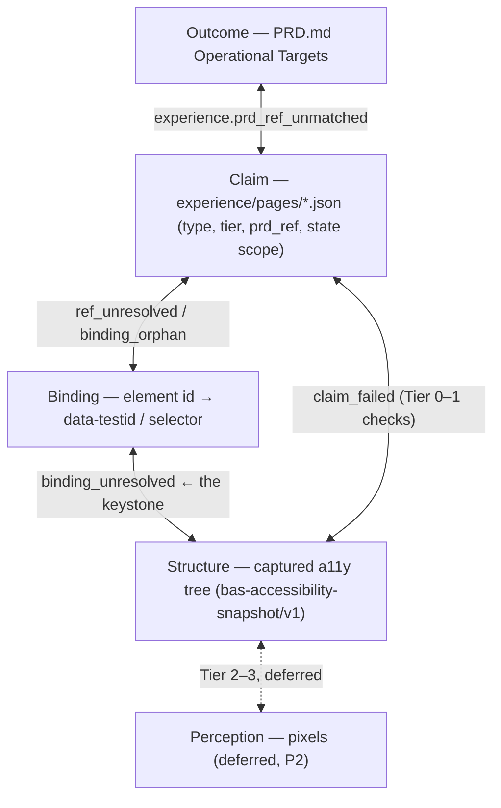
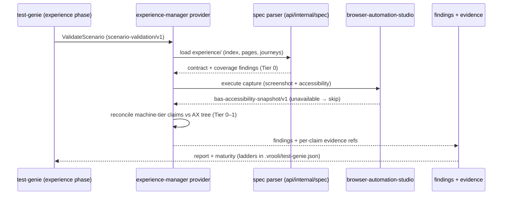
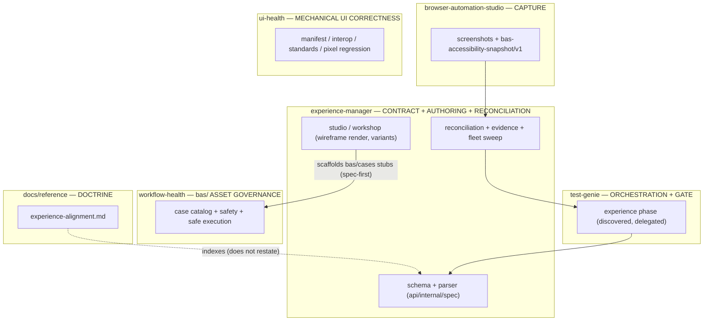

# Experience Alignment: the ladder, its rungs, and what each rung guarantees

This doctrine pins how Vrooli keeps a scenario's **intended experience**
consistent with what its built UI **actually presents to a user** — the
experience track of design-first validation. It is the sibling of
[`intent-alignment.md`](intent-alignment.md), which runs the same discipline on
the capability track (stated purpose ↔ decomposition ↔ code). This doc is the
mental model behind the `scenario-experience-spec/v1` contract, the
`experience-manager` scenario, and the live test-genie `experience` phase.
Read it before reasoning about where an experience check belongs.

> **Status:** v1 doctrine, active. The page/journey contract froze after a
> three-page spike (2026-07-04). The first planned minor event (2026-07-10)
> added `experience-component` documents for reusable component contracts while
> preserving the same finding registry. The parser, finding docs, tests,
> provider phase, reconciliation, authoring, rendering, autofix, attestation,
> fleet sweep, and generated template scaffold now use the same code registry
> (see [Anti-drift](#anti-drift-ratchet)).
>
> **Founding example:** business-health's traceability Matrix passed every
> capability-track gate, yet its spec surfaced **8 machine-checkable experience
> defects** (no at-a-glance verdict, a computed-but-never-rendered count,
> bookkeeping ranked above problems, an unannounced dialog, flattened status
> vocabulary…). A scenario can be fully business-green and still fail to
> communicate — that gap is exactly what this track exists to close.

## Two design-first tracks, one idea

Both tracks root in the PRD; each has its own testable contract, evidence,
owner, and doctrine. This table also heads `intent-alignment.md` — it is
orientation only, not part of either doc's invariant registry.

| | Capability track | Experience track |
|---|---|---|
| Prose intent | `PRD.md` operational targets | `PRD.md` operational targets |
| Testable contract | `requirements/` | `experience/` (index + pages + journeys + components) |
| Contract schema | canonical PRD template + `packages/intent-go` | `scenario-experience-spec/v1` JSON schema |
| Evidence | test/validation refs | BAS captures + reconciliations + attestations |
| Validation owner | business-health (+ cartographer detectors) | experience-manager |
| Doctrine | [`intent-alignment.md`](intent-alignment.md) | this doc |

## This doc holds a model, not data or rules

The same three-layer split as the sibling doc. Conflating the layers is how
experience tooling would drift; keep them separate:

| Layer | What it is | Generic or per-scenario | Where it lives | Copies |
|---|---|---|---|---|
| **Doctrine** (this doc) | the ladder, the adjacent-rung rule, the invariants, the gate policy | **generic** — a model, no data | repo-root `docs/reference/experience-alignment.md` | exactly **one** |
| **Contract** | `scenario-experience-spec/v1` schema + the spec parser | generic, machine-readable | `.vrooli/schemas/scenario-experience-spec.schema.json` (canonical) + `scenarios/experience-manager/api/internal/spec` (parser) | one |
| **Instance data** | the actual pages, claims, bindings, journeys | **per-scenario** | each scenario's `experience/` | one per scenario |

Two deliberate differences from the capability track:

- **The JSON schema is canonical and the Go parser mirrors it** — the inverse
  of intent-go, where the Go `CapabilityClaim` type is canonical. On-disk
  artifacts follow the repo's JSON-schema convention (`scenario-ui-manifest`
  precedent); proto/Connect is reserved for experience-manager's service
  endpoints.
- **The parser is an internal package, not a shared one.** experience-manager
  is the only consumer today (duplicate-before-extract). intent-go is
  legitimately shared (business-health + architecture-cartographer) — it is
  precedent for *when* to extract, not for starting shared. Cross-scenario
  consumers (e.g. workflow-health's spec↔case drift checks) go through the
  CLI/API, never a Go import.

## The experience ladder

Experience intent lives at five **altitudes**. The ladder is the relationship
between artifacts that exist (or are captured) per scenario:

| Altitude | Artifact | Unit | Example |
|---|---|---|---|
| **Outcome** | `PRD.md` Operational Targets | an OT line | `OT-P0-004 \| Authoring studio \| …` |
| **Claim** | `experience/pages/<page>.json` | a typed claim (carries `tier`, `prd_ref`, state scope) | `save-dominates-while-editing` (type `single-dominant-action`, tier `machine`) |
| **Binding** | the page's `bindings` block | element id → `data-testid` / selector | `studio-form → [data-testid="studio-spec-form"]` |
| **Structure** | captured accessibility tree | an AX node (role, accessible name, geometry, testid join) | `bas-accessibility-snapshot/v1` node |
| **Perception** | captured pixels | a perceived region / importance rank | **deferred** (P2 perception tier) |



### The adjacent-rung rule (the load-bearing invariant)

**Validation only ever compares adjacent rungs.** Never match PRD prose against
pixels — they are too far apart in abstraction and the result is noise.
Cross-ladder questions ("does this OT's page actually communicate it?") are
answered *transitively* by composing adjacent checks. This is what keeps
findings actionable ("this claim's *binding* resolves to no *AX node*", never
"this page doesn't look right") and is the direct transplant of the rule that
keeps the capability track's semantic matching tractable.

The **keystone** edge is Binding ↔ Structure: the join of a spec's bindings
into the captured accessibility tree is what proves the spec grounds in the
real UI — exactly analogous to the requirement↔domain join on the capability
track. Everything above it is bookkeeping; everything below it is evidence.

## Four tiers of technique (weakest-gating last)

| Tier | Technique | Catches | Class | Gateable? |
|---|---|---|---|---|
| **0 Spine** | ID/route/binding graph joins + schema conformance | broken refs, orphan claims, unresolved bindings, missing coverage | deterministic | **yes** |
| **1 Geometric** | deterministic geometry/order over the captured AX tree: reading order (RTL-aware), viewport visibility, role/name distinctness | failed machine-tier claims (hierarchy, reachability, distinguishability) | deterministic | yes |
| **2 Learned-deterministic** | fixed-weight visual-importance model (UMSI-class) scoring the render against declared communication priorities | attention/priority divergence the AX tree cannot see | **learned-det** | advisory → **promotable** after calibration |
| **3 Judge** | VLM/LLM judgment ("does this page communicate X?") | semantic gaps beyond geometry | heuristic | no (advisory) |

Tier 2 is a class the capability track does not have: a model with frozen
weights is *deterministic* (same image → same heatmap), so unlike a sampling
model it has an honest promotion path to gating once calibrated against pages
whose intended priority is known. Until then it is capped at `WARNING` like
Tier 3. AI enters the system *only* behind the Tier 2/3 line, quarantined off
the CI hot path — the gating core is Tiers 0–1 and fully deterministic
(**v1 ships zero-ML**: Tiers 0–1 only).

### Claim tiers × technique tiers (who may gate)

Authors declare per-claim **enforcement tiers** — `machine`, `manual`
(attested with expiry), `aspirational` (advisory, never rejected) — and the
claim `type` vocabulary is open (unknown types parse and degrade to
aspirational; `custom`-type claims cannot be `machine`, enforced in-schema).
A finding **gates** only when *all* hold:

1. the claim is `machine` tier (author's intent to gate),
2. a Tier 0–1 check exists for its type (validator's honest capability) — a
   machine claim with no checker degrades to `experience.claim_unverifiable`,
   visible debt, never silent,
3. the page is `status: active` (`draft` pages reconcile advisory-only), and
4. the gate knob is `strict`.

## Affordance Claims

Experience specs must capture the affordances that make a component usable, not
only the fact that the component exists. Presence claims answer "is there a
table/list/form/control?" Affordance claims answer "can the intended user do
the expected work with it?"

Authoring guidance uses these default heuristics:

- Tables with more than 10 expected rows should declare sort on decision
  columns, filter on stable categories or statuses, and search when users need
  to find a known row.
- Lists, queues, galleries, and catalogs should declare search and filtering
  when users choose among many durable items.
- Forms should declare required-field, invalid-value, submit-failure, and
  success-feedback states.
- Destructive actions should declare confirmation, cancellation, and
  post-action feedback.
- Long-running actions should declare progress, retry, failure, and
  stale/refresh affordances.

The `affordance-present` machine claim is the deterministic path when the
expected controls can be recognized in the captured accessibility tree. The
claim names expected controls in `params.affordances` and scopes them with
`params.targetRole` or the first referenced element's role. Use manual or
aspirational `custom` claims only when the current checker cannot honestly
recognize the affordance yet. The invariant is the same either way: declare the
user-visible affordance and bind it to concrete controls so automation can
evaluate it without changing the scenario's intent.

## The invariants (active registry)

Each rung-edge is one or more named invariants. This table is active: non-P2
codes are emitted by the parser/check pipeline, documented under
`scenarios/experience-manager/docs/findings/`, and covered by the ratchet
tests. Adding or renaming a code without updating parser docs and tests is a
CI failure.

| Code | Edge | Tier | Class | Default severity | Status |
|---|---|---|---|---|---|
| `experience.registry_invalid` | experience-manager capability registry → schema and cross-registry validation | 0 | det | error | active |
| `experience.schema_invalid` | document → validates against `scenario-experience-spec/v1` | 0 | det | error | active |
| `experience.index_parity` | `experience/index.json` ↔ on-disk pages/journeys/components, both directions | 0 | det | error | active |
| `experience.ref_unresolved` | claim→element/state, sketch→element, journey step→page/state, component state→example all resolve | 0 | det | error | active |
| `experience.prd_ref_unmatched` | page/claim `prd_ref` resolves to a real OT | 0 | det | error | active (mirror of `intent.prd_ref_unmatched`) |
| `experience.binding_orphan` | bindings ↔ declared elements, both directions; machine-tier claims reference bound elements | 0 | det | error | active |
| `experience.tier_violation` | tier semantics hold (custom ≠ machine; unknown type ⇒ aspirational) | 0 | det | error | active |
| `experience.route_unspecced` | UI route → has a page entry | 0 | det | warning | active |
| `experience.state_missing` | DESIGN.md-required UX state → declared on the page | 0 | det | warning (advisory `info` when no DESIGN.md — absent seed is not an error) | active |
| `experience.binding_unresolved` | binding → matches a node in the captured AX tree | 0 | det | error | active — **keystone** |
| `experience.claim_failed` | machine-tier claim → holds against captured structure | 0–1 | det | error | active |
| `experience.affordance_missing` | `affordance-present` machine-tier claim → expected component controls are present in captured structure | 1 | det | error | active |
| `experience.claim_unverifiable` | machine-tier claim → has a Tier 0–1 checker | 0 | det | warning | active |
| `experience.capture_unavailable` | active page → capture obtained (BAS reachable) | 0 | det | info (**skipped, never failed**) | active |
| `experience.attestation_expired` | manual-tier claim → unexpired attestation | 0 | det | warning | active (mirror of `business_manual_expired`) |
| `experience.claim_unproven` | active-page machine claim → has recorded evidence | 0 | det | warning | active (mirror of `business_unproven_claim`) |
| `experience.floor_no_document_horizontal_overflow` | inherited page floor → document width stays inside captured viewport | 1 | det | error | active |
| `experience.floor_viewport_fill` | inherited page floor → app surface fills captured viewport | 1 | det | error | active |
| `experience.floor_chrome_pinned` | inherited page floor → app chrome remains reachable inside viewport geometry | 1 | det | error | active |
| `experience.floor_safe_area_tap_targets` | inherited mobile floor → interactive targets avoid unsafe device-edge zones | 1 | det | error | active |
| `experience.floor_single_line_chrome` | inherited page floor → chrome labels remain single-line at captured viewports | 1 | det | error | active |
| `experience.floor_tap_target_size` | inherited mobile floor → visible controls provide comfortable touch targets | 1 | det | error | active |
| `experience.importance_mismatch` | declared communication priorities ↔ learned importance ranking | 2 | learned-det | warning | **deferred** (seam only, P2) |
| `experience.glance_judge_mismatch` | page ↔ its communication intent (VLM judge) | 3 | heuristic | warning | **deferred** (seam only, P2) |

Journey *runtime* coherence (steps executable, states reachable, friction
budget) is deliberately absent: it is P2 work built on workflow-health
execution, and it will register its codes here when designed.

### Inherited Experience Floors

Active page specs inherit a small baseline claim pack before reconciliation:
no document-level horizontal overflow, viewport fill, pinned chrome,
safe-area tap targets, single-line chrome, and mobile tap-target size. These
are floor expectations every application page should satisfy without authors
copying boilerplate claims into every `experience/pages/*.json` file.

Floors are still open-world: a page can opt out with `floorOptOuts[]`, naming
the floor and a reason. An opt-out suppresses only that inherited floor on that
page; authored claims and all other floors continue to run.

Component specs inherit only component-appropriate floors: harness-stage
horizontal overflow and tap-target size for interactive examples. Page-shell
floors such as viewport fill, pinned chrome, safe-area, and single-line chrome
do not apply to isolated reusable components.

### Component evidence presentation

React Component Library may present an `experience-component` contract beside
the catalog asset that owns it. This is a read model, not a second contract:
the versioned `examples.json` mapping, states, claims, and tiers remain owned by
the component document. The library UI reads through its own API, which obtains
the latest persisted reconciliation evidence from Experience Manager.

The presentation must show the enforcement tier and the latest verdict for
each declared claim. No evidence row means **unproven**, not passing; an
unavailable capture means **evidence unavailable**. Manual and aspirational
claims remain visible as intent, but are never represented as automatically
proven. When the capture reference is a navigable artifact, expose a link so a
reader can inspect its provenance.

## Severity & gate policy

Tier 0–1 findings are deterministic and **may** gate, under an
`EXPERIENCE_ALIGNMENT_GATE` knob rolling out `off → advisory → strict`
(the same discipline as `INTENT_ALIGNMENT_GATE` and
`TEST_GENIE_ARCHITECTURE_GATE`). Three additional policies are specific to
this track:

- **Presence-keyed applicability.** The `experience` phase applies only to
  scenarios with an `experience/` folder. Spec *absence* is fleet-sweep debt,
  never a failed suite — no scenario turns red for not having adopted the
  track yet. Promotion to broader gating happens only after fleet coverage
  makes it meaningful.
- **Draft vs. active pages.** `status: draft` pages (design-first, page not
  yet built) reconcile advisory-only; `status: active` pages are
  gate-eligible. Authoring a spec before the page exists is the intended
  workflow, not a violation.
- **Capture degradation.** BAS unreachable ⇒ reconciliation findings are
  *skipped*, never failed — the phase reports honestly reduced coverage.

Tier 2–3 findings are capped at `WARNING` and never gate regardless of the
knob (Tier 2 may earn promotion post-calibration; Tier 3 never gates).

### Strict Promotion Criteria

`EXPERIENCE_ALIGNMENT_GATE=strict` is not the default until all of these are
true at the same time:

1. Fleet coverage includes the cockpit reference set: experience-manager,
   git-control-tower, business-health, and web-console, each with clean
   `spec_contract` and `structure_reconciliation` capabilities or documented
   calibration failures.
2. The viewport matrix is stable for desktop and mobile captures, and any
   `experience.capture_unavailable` result is demonstrably infrastructure
   degradation rather than a checker defect.
3. Inherited floors have red-first and green-after proof on at least one
   non-experience-manager scenario; git-control-tower is the reference for the
   desktop panels to mobile tabs transformation.
4. Manual-tier claims either carry fresh attestations or are explicitly scoped
   as non-gating transformation intent pending interaction/state capture.
5. The gate has passed at least one full managed suite run for the cockpit set
   with only documented calibration debt remaining.

## How findings flow (no new pipeline)

Experience findings reuse the existing delegated-provider machinery end to
end: test-genie discovers the phase from experience-manager's
`.vrooli/test-genie.json` (which also carries the maturity ladders under
`maturity.capabilities[]`), calls the shared `scenario-validation/v1` contract,
and gates on the response like any other health provider.



## Ownership boundaries (one concern, one home)



The boundary with ui-health, including the gray zones, is assigned — a finding
class both scenarios could plausibly emit is the drift signal to watch:

| Concern | Owner | Rationale |
|---|---|---|
| manifest/slots, interop lint, standards (i18n/tokens), runtime render, pixel-threshold regression | **ui-health** | *is the UI built correctly* |
| spec registry, coverage, reconciliation, saliency, journeys, state coverage | **experience-manager** | *is it the intended experience* |
| static a11y **lint** (rules over source) | ui-health | mechanical correctness |
| a11y-**tree**-as-oracle reconciliation | experience-manager | the tree is this track's Structure rung |
| pixel baselines / visual **regression** | ui-health | "did it change" |
| perceptual/saliency **judgment** (P2) | experience-manager | "does it communicate" |

The rule that prevents sprawl, transplanted from the capability track:
**the contract lives in exactly one schema, parsing in exactly one package,
capture in exactly one engine, gating in exactly one phase.** No code outside
`scenarios/experience-manager` may parse `experience/` files — consumers
(workflow-health drift checks, future tooling) integrate through the CLI/API.
This is the anti-recurrence measure for two historical failure modes: the
three disagreeing PRD parsers (retired by intent-go) and the interop rules
once scattered across three scenarios (retired by ui-health's consolidation).

## Contract (frozen — validated by spike, 2026-07-04)

A three-page spike froze the contract with zero schema changes:

- **Self-referential** — experience-manager's own Studio page (the scenario is
  its own first dogfood; 39 claims across its five pages: 27 machine, 7
  manual, 5 aspirational).
- **Calibration** — business-health's Matrix, spec'd to *intent*: 8 of 16
  claims are expected to fail reconciliation against the current build, with
  the expected-failure list machine-encoded in an `x-spike` block. This is the
  ready-made acceptance fixture for reconciliation: the checker is correct
  when it reproduces exactly that split.
- **Hostile** — web-console's workspace: no router (single surface, overlays
  as states), no ARIA role for a terminal (the namespaced custom-role escape
  hatch proved *required*), no DESIGN.md (states authored from observed
  behavior), and orthogonal display modes (handled by `x-` claim scoping).

One schema covers four document kinds, discriminated by a top-level `kind`
(`experience-index` / `experience-page` / `experience-journey` /
`experience-component`). A page carries identity → ranked communication
priorities (≤ 7) → states → elements (ARIA role + accessible name only) →
claims → bindings → optional sketch. A component carries component identity
and `examplesRef` → priorities → example-anchored states → elements → claims →
bindings.

### Scenario-To-Library Graduation

When a scenario-local component becomes reusable, promote the experience
contract with the implementation. The TSX moves to
`scenarios/react-component-library/library/components/<Slug>/versions/<version>/`,
named example states move beside it in `examples.json`, and reusable
page element/claim intent moves into
`scenarios/react-component-library/experience/components/<slug>.json` as
an `experience-component` document. The component document's
`states[].example` values must reference named examples in that
versioned `examples.json`, and `component.examplesRef` keeps the spec
anchored to the catalog artifact. See
`scenarios/react-component-library/docs/concepts/FLOWS.md` for the
operational checklist.

The spike-confirmed rules the parser **must** encode — the analog of
intent-go's three extractor rules:

1. **Open-world is structural, not aspirational prose.** Unknown claim types
   parse and degrade to aspirational; every object accepts `x-` extension
   properties; nothing is ever flagged for being unmentioned. The spec is a
   floor, never a census.
2. **The intent/bindings split is the flap-killer.** Elements are ARIA role +
   accessible name; the `bindings` block is the *only* volatile section (and
   the selector SSOT that `bas/` scaffolding reads). Restyles touch bindings,
   never claims.
3. **The sketch is non-normative.** It exists for wireframe rendering and
   scaffolding on an abstract 12-column grid and is never validated against
   the built UI.
4. **Orthogonal display dimensions ride `x-` scoping** (e.g.
   `x-display-mode`), not the `states` axis. Promotion trigger: a third
   scenario needing it ⇒ a generalized `dimensions` axis in a schema minor
   version.
5. **DESIGN.md absence degrades gracefully.** Its UX-state contract
   (loading/error/empty/stale/partial/retry/disabled) *seeds* state coverage;
   with no DESIGN.md the seed check becomes an advisory note, never an error.
6. **Draft/active is the design-first hinge.** Specs are authored before pages
   exist (`draft`, advisory) and flipped `active` when built (gate-eligible).

## Anti-drift (ratchet)

The sibling doc's triangle applies here. The full triangle is active as a
ratchet test:

```
   this doc's invariant code  ──(CI: code sets identical)──▶  parser finding code
            ▲                                                        │
            └───────(CI: every fixture maps to a row)──── golden test fixture ◀──┘
                                        (CI: every code has a fixture)
```

**Doc invariant codes == parser finding codes == tested codes.** The Matrix
`x-spike` block remains the calibration fixture that proves the reconciliation
edge emits the expected advisory findings.

## Cross-references

- [`intent-alignment.md`](intent-alignment.md) — the capability-track sibling;
  shares the orienting table above and the three-layer doctrine model.
- [`architecture-validation-responsibilities.md`](architecture-validation-responsibilities.md)
  — the horizontal axis (structural soundness) both tracks complement.
- `.vrooli/schemas/scenario-experience-spec.schema.json` — the canonical
  contract (`scenario-experience-spec/v1`).
- `scenarios/experience-manager/docs/internal/SWARM_MANAGER_WORK.md` — the durable
  decision log behind every rule in this doc (each row carries context,
  consequences, and a revisit trigger).
- [`docs/design/governance.md`](../design/governance.md) — DESIGN.md as
  styling/token contract; its UX-state contract seeds state coverage here.
- `scenarios/browser-automation-studio/docs/SEAMS.md` §30 — the frozen
  `bas-accessibility-snapshot/v1` capture contract (the Structure rung).
- [`machine-readable-references.md`](machine-readable-references.md) — the
  typed-reference syntax spec artifacts use.
