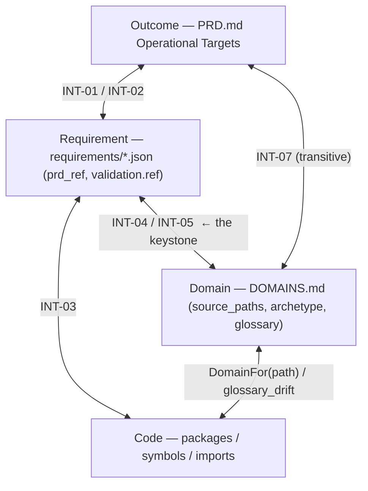
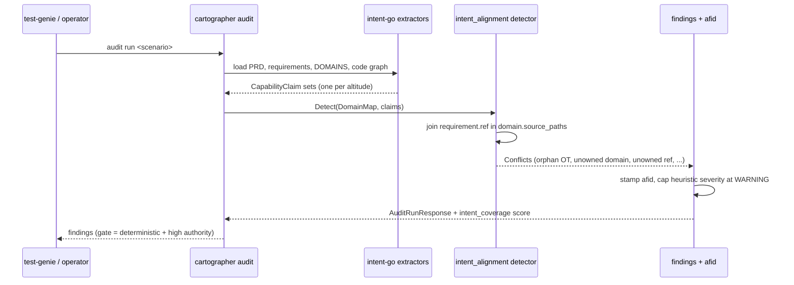
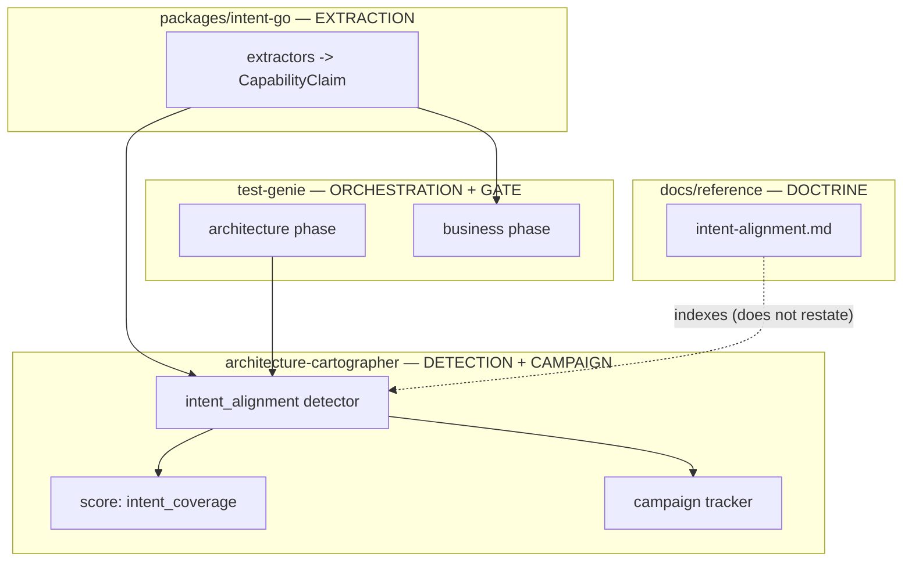

# Intent Alignment: the ladder, its rungs, and what each rung guarantees

This doctrine pins how Vrooli keeps a scenario's **stated purpose** consistent
with its **decomposition** and its **code** — the *vertical* axis of architecture
validation. Where [`architecture-validation-responsibilities`](architecture-validation-responsibilities.md)
governs whether the structure is internally sound (cycles, layering, coupling —
the *horizontal* axis), this governs whether the structure actually expresses what
the product set out to do. It is the mental model behind the `intent_alignment`
detector family in architecture-cartographer and the `intent_coverage` score
category. Read it before reasoning about where an intent check belongs.

> **Status:** v1 doctrine. The deterministic invariants (Tier 0) consolidate
> checks that already exist (scattered across test-genie); the requirement↔domain
> join (the keystone) and the semantic tiers are new. The **Contract** section
> below is frozen after a real-data spike confirmed it fits actual `PRD.md`,
> `requirements/`, and `DOMAINS.md` artifacts.

## Two design-first tracks, one idea

Vrooli runs the same design-first discipline on two parallel tracks: the
**capability track** (does the structure do what the product intends — this
doc) and the **experience track** (does the built UI communicate what the
design intends — [`experience-alignment.md`](experience-alignment.md)). Both
root in the PRD; each has its own testable contract, evidence, owner, and
doctrine. This table is orientation only — it is not part of the anti-drift
registry below and adds no invariants.

| | Capability track | Experience track |
|---|---|---|
| Prose intent | `PRD.md` operational targets | `PRD.md` operational targets |
| Testable contract | `requirements/` | `experience/` (index + pages + journeys) |
| Contract schema | canonical PRD template + `packages/intent-go` | `scenario-experience-spec/v1` JSON schema |
| Evidence | test/validation refs | BAS captures + reconciliations + attestations |
| Validation owner | business-health (+ cartographer detectors) | experience-manager |
| Doctrine | this doc | [`experience-alignment.md`](experience-alignment.md) |

## This doc holds a model, not data or rules

There are three layers. Conflating them is how "screaming architecture" tooling
drifts. Keep them separate:

| Layer | What it is | Generic or per-scenario | Where it lives | Copies |
|---|---|---|---|---|
| **Doctrine** (this doc) | the ladder, the adjacent-rung rule, the invariants, the gate policy | **generic** — a model, no data | repo-root `docs/reference/intent-alignment.md` | exactly **one** |
| **Contract** | `CapabilityClaim` type, the parsers, the finding codes | generic, machine-readable | `packages/intent-go` (+ `packages/proto/schemas/architecture/v1`) | one |
| **Instance data** | the actual outcomes, requirements, domains | **per-scenario** | each scenario's `PRD.md`, `requirements/`, `docs/concepts/DOMAINS.md` | one per scenario |

This document is **generic on purpose** — it is doctrine, exactly like its sibling
`architecture-validation-responsibilities.md`, which is also repo-root even though
architecture-cartographer is its primary implementer. Cross-scenario doctrine
lives at repo root regardless of which scenario enforces it. The doctrine *never*
restates instance data; it tells you how the per-scenario artifacts relate.

## The intent ladder

Intent lives at four **altitudes**. Each artifact already exists on disk in every
scenario; the ladder is the relationship between them.

| Altitude | Artifact | Unit | Example |
|---|---|---|---|
| **Outcome** | `PRD.md` Operational Targets | an OT line | `OT-P0-004 \| Core Analysis \| …` |
| **Requirement** | `requirements/<module>/module.json` | a requirement (carries `prd_ref` + `validation[].ref`) | `IMG-P0-004` |
| **Domain** | `docs/concepts/DOMAINS.md` | a Domain Inventory row (`source_paths`, archetype, glossary) | `analysis` owns `api/internal/analysis/**` |
| **Code** | packages / symbols / imports | the extracted graph | `api/internal/analysis/autoscan.go` |



### The adjacent-rung rule (the load-bearing invariant)

**Validation only ever compares adjacent rungs.** Never match outcome prose
against raw symbols — they are too far apart in abstraction and the result is
noise. Cross-ladder questions ("does this OT reach code?") are answered
*transitively* by composing adjacent checks, never by a single long-range
comparison. This rule is what keeps findings actionable ("this *outcome* has no
owning *domain*", not "this sentence doesn't resemble this function") and keeps
the semantic matcher's job tractable.

## Four tiers of technique (weakest-gating last)

Any rung-edge can be validated with progressively more powerful — and less
reliable — techniques. The tier determines the finding's **class**, which
determines whether it can gate.

| Tier | Technique | Catches | Class | Gateable? |
|---|---|---|---|---|
| **0 Spine** | ID + path graph joins (`prd_ref`, `validation.ref`, `source_paths`) | orphan outcomes, undeclared domains, unowned code, broken refs | deterministic | **yes** |
| **1 Lexical** | controlled vocabulary: glossary terms ↔ PRD/requirement vocabulary | a domain speaking words its outcomes never use | deterministic | yes |
| **2 Embedding** | semantic similarity (outcome × domain) via `packages/ai-go/search` | synonym-aware coverage gaps (e.g. "billing" vs "invoicing") | **heuristic** | no (advisory) |
| **3 LLM judge** | "does this domain's code match its stated responsibility?" | semantic lies (a `payment` domain full of booking logic) | heuristic | no (advisory) |

Heuristic findings are auto-capped at `WARNING` and never gate — the same
discipline the structural detectors already use. AI enters the system *only*
behind the Tier 2/3 line, clearly fenced from the deterministic gating core.

## The invariants (the anti-drift registry)

Each rung-edge is one or more **named invariants**. This table is the canonical
registry: the codes here are CI-asserted to equal the finding codes the detector
emits and the codes that have golden fixtures (see [Anti-drift](#anti-drift)).
Adding a row without a detector + test fails the build.

| Code | Edge | Tier | Class | Default severity | Status |
|---|---|---|---|---|---|
| `intent.prd_ref_unmatched` | requirement → its `prd_ref` resolves to a real OT | 0 | det | error | **exists** (was `business_prd_ref_unmatched`) |
| `intent.ot_orphan` | outcome → has ≥1 requirement pointing at it | 0 | det | warning | exists (CLI `lint_prd` only → promote to pipeline) |
| `intent.ref_missing` | requirement → `validation[].ref` exists on disk | 0 | det | error | exists (was `InvalidReferenceRule`) |
| `intent.req_unowned_domain` | requirement's `validation.ref` code path ∈ some domain `source_paths`, and not a transport/Non-Domain zone | 0 | det | error | **new — keystone** |
| `intent.req_transport_owned` | requirement's `validation.ref` lands in a declared transport zone / `## Non-Domains` entry (e.g. `api/.../handlers`) | 0 | det | info | **new** (spike-discovered companion to the keystone) |
| `intent.domain_unrequired` | domain → has ≥1 requirement pointing into its `source_paths` | 0 | det | warning | **new — "undeclared purpose"** |
| `intent.ot_no_domain` | outcome → reaches a domain transitively (via its requirements) | 0 | det | warning | new |
| `intent.vocab_drift` | domain glossary ↔ PRD/requirement vocabulary | 1 | det (lexical) | warning | new |
| `intent.semantic_coverage_gap` | outcome ↔ domain by embedding similarity | 2 | heuristic | warning | **deferred** (seam only) |
| `intent.responsibility_mismatch` | domain code ↔ its stated responsibility (LLM) | 3 | heuristic | warning | **deferred** (seam only) |

Candidate (not yet scheduled): `intent.code_unrequired` — a source file under a
domain that no requirement covers. Held back because "every file needs a
requirement" is too strict for many scenarios; revisit as advisory `info` once
the spine is adopted.

## Severity & gate policy

Tier 0–1 findings are deterministic and **may** gate, under an
`INTENT_ALIGNMENT_GATE` env knob that rolls out `off → advisory → strict`
(mirroring how `TEST_GENIE_ARCHITECTURE_GATE` was introduced):

- `off` — never gate; findings are advisory and feed the campaign nudge only.
- `advisory` (rollout default) — surface prominently, do not fail CI.
- `strict` — fail on deterministic `error`/`blocker` findings.

Tier 2–3 findings are heuristic, capped at `WARNING`, and never gate regardless
of the knob. As with the structural audit, transport/tool errors fail the phase
independently of the finding gate.

## How findings flow (no new pipeline)

Intent findings reuse the *existing* architecture-cartographer machinery
end to end — the `ArchitectureFinding` proto contract, the `afid` stable ID, the
campaign tracker, and the score matrix. The only additions are one shared
extractor feeding the detector and one new detector plugged into the registry.



## Ownership boundaries (one concern, one home)



The rule that prevents sprawl: **extraction lives in exactly one package,
detection in exactly one detector family, gating in exactly one phase, the
campaign in exactly one place.** A ratchet test forbids any new code that
re-parses `PRD.md` / `requirements/` / `DOMAINS.md` outside `packages/intent-go`.
This *retired* the historical duplication — the same OT set was once
extracted by two disagreeing regexes inside test-genie alone, plus a third
parser in the (since-deleted) PRD control-tower scenario; today
`packages/intent-go` is the only parser and `business-health` is the only
contract authority.

## Contract (frozen — validated by spike, 2026-06-18)

A real-data spike against `image-tools` and `swarm-manager` confirmed every
PRD outcome, requirement, and domain row maps cleanly onto the shape below, and
that the keystone join surfaces genuine gaps (image-tools requirements place code
under `api/internal/ai/` that no domain declares; swarm-manager requirements
validate at the `handlers` transport layer rather than a product domain). The
spike also surfaced three rules the extractor **must** encode — without them the
deterministic checks are dominated by false positives:

1. **A `validation[].ref` is a mini-format, not a bare path.** It may carry a
   `#fragment` (doc anchor), a `::TestName` suffix (a specific test), and/or a
   glob (`api/internal/ops/*_test.go`). The extractor normalizes a ref into
   `{path, member, kind}`; on-disk and domain checks use `path` only (a glob
   contributes its literal directory prefix to the join).
2. **`validation[].type` gates the path checks.** A `manual`/attended validation
   carries a prose `ref` ("Attended pilot: EM steers 2+ scenarios…"), not a path.
   Only `test`/`code`-typed validations are path- and domain-checked.
3. **The domain join is transport / Non-Domain aware.** A ref into a declared
   transport zone or a `## Non-Domains` entry (e.g. `api/.../handlers`) is not
   "broken-unowned" — it is legitimately not a product domain. Such refs emit
   `intent.req_transport_owned` (info), not the keystone error.

```go
// packages/intent-go
type Altitude string
const (
    Outcome     Altitude = "outcome"     // PRD Operational Target
    Requirement Altitude = "requirement" // requirements module entry
    Domain      Altitude = "domain"      // DOMAINS.md inventory row
    Code        Altitude = "code"        // package / symbol
)

type RefKind string
const (
    RefCode   RefKind = "code"   // path under api/ cli/ ui/ → domain-ownable
    RefDoc    RefKind = "doc"    // docs/… or *.md → not domain-ownable
    RefManual RefKind = "manual" // prose ref from a manual/attended validation
)

// Ref is the normalized form of one validation[].ref entry (rule 1).
type Ref struct {
    Raw    string  // verbatim from validation[].ref
    Path   string  // file-path component (#frag and ::Test stripped; glob prefix kept)
    Member string  // ::TestName, if present
    Kind   RefKind
    Glob   bool
}

// CapabilityClaim is the single normalized intent unit. Every extractor emits
// this shape so the detector is artifact-agnostic.
type CapabilityClaim struct {
    ID         string   // OT-P0-004 | IMG-P0-004 | domain:analysis | pkg:api/internal/analysis
    Altitude   Altitude
    Text       string   // human description — fuel for Tier 2/3 matching
    Anchor     string   // file[:line] provenance
    Refs       []Ref    // normalized outbound edges (requirements only; empty for others)
    Provenance string   // which extractor emitted it
}
```

`packages/intent-go` implements this verbatim. The throwaway spike that froze it
is not retained; its logic is reborn as the real extractor in Phase 1.

## Anti-drift

A doctrine doc becomes a *source* of drift when it holds rules or data that also
live in code. This one holds neither — it holds an index of invariants, and each
invariant is one corner of a triangle CI keeps closed:

```
   this doc's invariant code  ──(CI: code sets identical)──▶  detector finding code
            ▲                                                          │
            └────────(CI: every fixture maps to a row)──── golden test fixture ◀──┘
                                          (CI: every code has a fixture)
```

A single ratchet test asserts these three sets are equal:
**doc invariant codes == detector finding codes == tested codes.** Add an
invariant here with no detector → CI fails. Emit a finding code with no row
here → CI fails. The doc therefore cannot silently drift from the code; it is a
human-readable view of machine-enforced facts.

## Cross-references

- [`experience-alignment.md`](experience-alignment.md) — the experience-track
  sibling of this doctrine: the same ladder discipline applied to what the
  built UI communicates (claims ↔ bindings ↔ captured accessibility tree).
- [`architecture-validation-responsibilities`](architecture-validation-responsibilities.md)
  — the horizontal axis (structural soundness) this complements; intent alignment
  is the new vertical axis.
- `packages/intent-go` — the extraction contract (`CapabilityClaim`) and per-artifact extractors.
- `scenarios/architecture-cartographer/.../conflicts/detectors/intentalignment/` — the detector family.
- [`architecture-cartographer/docs/reference/domains-contract.md`](../../scenarios/architecture-cartographer/docs/reference/domains-contract.md)
  — the `DOMAINS.md` machine contract this builds on.
- [`docs/reference/machine-readable-references.md`](machine-readable-references.md)
  — the `[REQ: OT-…]` / `[CODE: …]` reference syntax intent claims align with.
- `scenarios/prompt-manager/store/skills/packs/core/screaming-architecture-audit/SKILL.md`
  — the audit procedure that consumes these findings.
