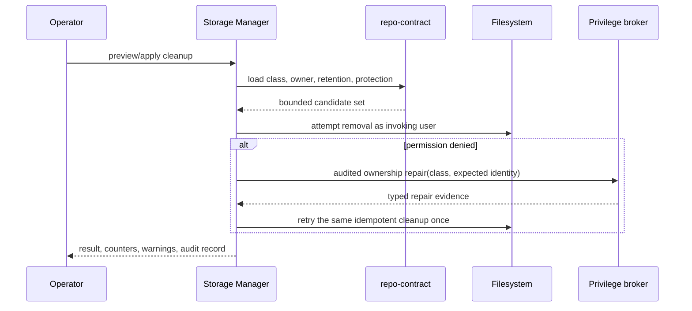
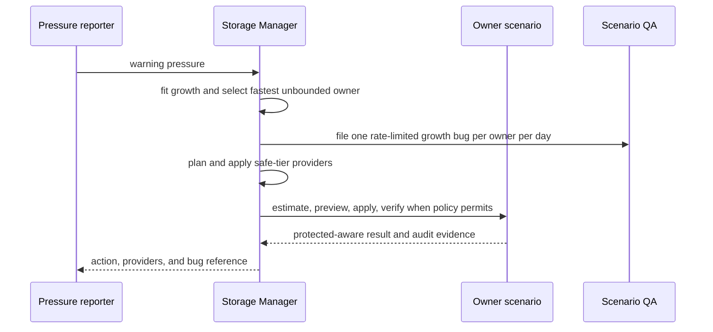
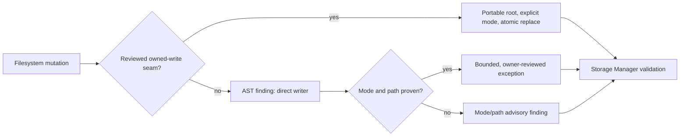

# Storage retention budgets

## Pressure recovery

Storage Manager separates scheduled retention from pressure recovery. Use the
server-owned recovery controller when free space is low:

```bash
storage-manager recovery run --trigger manual --partition / --json
storage-manager recovery wait --run-id <run-id> --json
storage-manager recovery history --json
storage-manager storage retention --json
storage-manager storage writers --top 10 --json
storage-manager storage infra-health --json
```

Recovery acts in rung order and stops at its free-space target or authority
boundary. `safe` and proven `regenerable` roots are autonomous. An owner entry
is autonomous only when it is regenerable and declares an age or byte budget.
Conditional providers require a host-local standing approval. Read the
[recovery controller](../../scenarios/storage-manager/docs/concepts/RECOVERY-CONTROLLER.md),
[recovery ladder](../../scenarios/storage-manager/docs/concepts/RECOVERY-LADDER.md),
and [root specification](../../scenarios/storage-manager/docs/reference/root-spec.md)
before changing a declaration.

## Capacity-ledger retention

Capacity claims expose canonical UTC `created_at` and `updated_at` values in
`vrooli capacity list --json` and in the human table. For terminal claims,
`updated_at` is the terminal transition time used by the GC sweep; active
claims use it as the last mutation timestamp. The default terminal retention
window remains 24 hours until a measured churn sample justifies changing it.
Operators should compare the observed terminal-row rate with the projected
24-hour steady-state count before changing that policy.

The 2026-08-28 ledger measurement covered `2026-08-27T08:44:19Z` through
`2026-08-28T09:01:31Z`: 12,744 rows were present, including 12,103
`test-genie` rows and 641 resource rows; 12,743 rows were terminal. The observed
24-hour churn is therefore approximately 12,103 rows, predicting a steady-state
row count of about 12,103 under the current one-day window (the measured total
is 12,744 because the sample spans slightly more than one day and includes
resource churn). This retires the earlier under-500 target as unreachable while
the test harness creates one terminal claim per check. The capacity sweep is
covered by `internal/maintenance` tests and removes terminal rows older than
the configured window; reducing the window would not solve the avoidable
test-genie claim creation.

## Generated artifact placement contract

Generated artifacts are owner-managed runtime data, not source-tree residents.
Scenario code MUST NOT contain a filesystem path segment that names the
physical artifact location. It MUST request a typed storage class and construct
logical names through the shared authority instead.

The repository-wide authority is `packages/artifactpaths`. Its
`ScenarioRoot`, `PhaseCacheRoot`, and `ScenarioPath` helpers resolve Test Genie
run evidence and caches through `packages/api-core/storage`. The storage class
vocabulary (`config`, `data`, `cache`, `logs`, `state`, and `test_runs`) is
declared by `.vrooli/repo-contract.json`; scenario `storage.entries` and
`retention.budgets` declarations state ownership and policy without repeating
physical directories.

The rule has two enforcement layers:

- `.ast-grep/rules/no-artifact-path-literal.yml` rejects artifact-location
  literals in production code.
- Storage Manager reads owner and cleanup-provider declarations, then either
  prunes a declared runtime-home class or delegates Estimate, Preview, and
  Apply to the owner. It never walks another scenario's private storage.

A relocation therefore changes the repository contract, not scenario code.
Tests may inject an explicit root, but production constructors MUST fail rather
than fall back to a source-tree directory when storage resolution fails.

### The one source-tree exception: `/scratch`

Storage Manager reaps exactly one path inside the repository checkout, and only
this one: the repo-root `/scratch` directory, through its `agent-scratch`
provider (`hostpaths.ScratchRoots`).

`/scratch` sits at the repository root deliberately. It is the fallback an agent
finds when it runs `ls`, needs somewhere to put temporary work, and has not been
given a better location — the safety net for models that do not reliably follow
the placement rules above. Moving it out of the checkout would remove the
property that makes it work.

It is a bounded exception, not a softening of the rule:

- **It is gitignored** (`/scratch/` in `.gitignore`), so nothing tracked can be
  destroyed by reaping it. Anything worth keeping must be promoted to a real
  home before it is committed; that promotion is the point at which it stops
  being scratch.
- **It is declared** in `.vrooli/repo-contract.json` under `scratch`, so the
  reaped path is a contract surface rather than a literal someone hardcoded.
- **It is disposable by construction.** Every other rule here separates
  generated artifacts from source; `/scratch` contains no source by definition,
  which is why reaping it does not violate the separation the rule protects.
- **It stays off by default.** The provider ships `ProviderModeDisabled` with
  operator approval, on a 7-day `MinAge` (3 days under `balanced`, 1 under
  `aggressive`), and treats each top-level entry as a unit so a capture is never
  half-deleted.

No other checkout path may be added to a cleanup provider on this precedent. A
second one would mean the placement contract above is not being followed, and
the fix is to route the writer through a storage class — not to widen this
exception.

The rationale, measurements, and rejected alternatives are preserved in the
[artifact retention and storage authority design record](../architecture/artifact-retention-and-storage-authority.html)
(`/home/matthalloran8/Vrooli/docs/architecture/artifact-retention-and-storage-authority.html`).

## Control-plane runtime-home contract

The shared `.vrooli/repo-contract.json` is authoritative for control-plane
runtime-home classes. `bin`, `cache`, `logs`, `metrics`, `processes`, `build`,
`test_runs`, and `artifacts` are regenerable and may be previewed or reclaimed
by Storage Manager only when their contract retention policy permits it.
`plans`, `state`, `config`, `data`, `runtime_db`, `secrets`, `secrets_enc`, and
`backups` are protected and have no cleanup provider.

Retention precedence is conservative: the repository contract supplies the
default, an active profile may narrow it, an operator override may narrow it
again, and an owner-specific policy may narrow it further. No lower layer may
make a protected entry deletable, shorten its minimum age, or raise its byte
ceiling. Missing policy means `cleanup: never`; malformed policy rejects the
contract instead of broadening cleanup.

`protect_active` protects process and Test Genie lease markers (including lock,
socket, `.active`, `.lease`, `.running`, and in-progress markers) during both
preview and apply. `keep_count` is an additional floor: the newest entries are
retained even when age and byte limits would otherwise select them. These rules
are independent of `regenerable`: regeneration permits cleanup only when the
contract also grants cleanup authority.

### Runtime-home cleanup sequence



Storage Manager never broadens a contract policy. It refuses protected or
undeclared entries, protects active lease markers, attempts the removal first,
and requests at most one bounded broker repair before retrying the same
candidate. A missing broker, unsupported ownership operation, partial repair,
or failed retry is returned as typed evidence; it is not converted into a
shell or `sudo` fallback. The cleanup result exposes repair and retry counters
so operators can distinguish ordinary reclamation from ownership drift.

## Growth and policy control

Storage Manager reconciles the persisted cleanup policy with the complete
provider registry whenever it loads a profiled policy. Missing provider IDs are
added with the active profile defaults, existing entries are preserved exactly,
and the policy version changes only when the row changes. The audit event
`policy.reconciled` names every provider added. An operator can still disable a
provider deliberately; reconciliation does not re-enable it.

`storage-manager storage growth --window 24h` reads persisted census samples and
fits each owner/entry with ordinary least squares. Each row reports bytes per
hour, sample count, R², confidence, current bytes, and either a time-to-ceiling
projection or `unbounded`. Device time-to-full requires at least six snapshots;
owner trends require at least three. The command does not scan the filesystem.

`GET /api/v1/storage/budget-health` sums every declared `max_bytes` ceiling and
compares the reservation with the latest device capacity. It reports `healthy`
below the warning fraction, `warning` above the warning fraction, and
`unreasonable` when the declarations exceed physical capacity. Age-only budgets
are excluded from this byte reservation because they do not reserve a fixed
amount of space. The same report is included in
`GET /api/v1/retention/owners`, and an unreasonable aggregate adds a validation
finding instead of silently accepting an impossible reservation.

Every storage entry must state `regenerable`. An omitted value is a schema
error, not an implicit `false`. A regenerable entry without `max_age` or
`max_bytes` produces `RETENTION_CEILING_UNBOUNDED`; a ceiling with no workload
headroom produces `CEILING_NOT_BINDING`. A measured value cannot be a ceiling:
it is already satisfied by the measurement it copied and therefore cannot
detect excess.

Owner-delegated cleanup uses three owner-controlled endpoints:
`GET /api/v1/cleanup/estimate`, `POST /api/v1/cleanup/preview`, and
`POST /api/v1/cleanup/apply`. Preview returns protected items explicitly;
apply requires the preview, approval mode, and an idempotency key. A provider
reports whether its client is unavailable, its owner is unreachable, or its
owner does not implement the contract. It never silently converts those cases
to a zero-byte success.

### Owner automatic cleanup policy

Browser Automation Studio and web-console also run a delayed, owner-local
automatic sweep. The sweep uses an age floor, an optional oldest-first byte cap
per sweep, and an optional keep-newest count. It never removes a live or
protected item. The owner endpoint remains available for a larger,
preview-first operator run.

The controls are environment variables so an installation can choose its own
retention without changing code:

| Owner | Enable | Age floor | Byte cap per sweep | Keep newest | Interval |
|---|---|---|---|---|---|
| browser-automation-studio | `BAS_OWNER_RETENTION_ENABLED` | `BAS_OWNER_RETENTION_MAX_AGE` | `BAS_OWNER_RETENTION_MAX_BYTES` | `BAS_OWNER_RETENTION_KEEP_COUNT` | `BAS_OWNER_RETENTION_INTERVAL` |
| web-console | `WC_OWNER_RETENTION_ENABLED` | `WC_OWNER_RETENTION_MAX_AGE` | `WC_OWNER_RETENTION_MAX_BYTES` | `WC_OWNER_RETENTION_KEEP_COUNT` | `WC_OWNER_RETENTION_INTERVAL` |

Defaults are enabled, 7 days for browser evidence, 30 days for web-console
archives, no byte cap, no keep-count override, and a 15-minute interval. A
zero byte cap means “no per-sweep cap”; it does not mean “delete everything”.
The HTTP query accepts either raw bytes or binary units such as `1GiB` for
`max_bytes`.
The declared `storage.entries` age budget remains the repository-level
governance contract and should be changed alongside the runtime setting.



### Filesystem writer review



Intentional exceptions are reviewed by owner, scope, reason, and removal
trigger. The validator does not silently suppress direct writers; an exception
must be represented as a bounded record and remains visible in the report.

Ownership repair is a separate compatibility operation. Setup records it in
the project-scoped `migrations.json` ledger and skips the broad migration only
after a durable `complete` record. `vrooli doctor` reports diagnostics without
mutation; `vrooli doctor --repair-file-permissions` is the explicit bounded
repair path. Repair is lstat-based, contained under the contract root, does not
follow symlinks, and records post-repair verification. A missing privilege
broker or unsupported platform is reported as unavailable; there is no sudo
fallback.

A scenario, resource, tool, or safeguard declares how much history it may keep,
and the framework enforces it. Declaring `"pruner": "builtin"` needs no Go code
at all.

- Engine: `packages/api-core/retention`
- Schema: `.vrooli/schemas/common.schema.json#/definitions/retention`
- Accepted on: `service.schema.json`, `resource.schema.json`,
  `tool.schema.json`, `safeguard.schema.json`

## Storage declarations are evidence, not guesses

The storage surface is a ledger of paths the owner actually writes, mounts, or
controls. A component with no owned path must still declare an explicit empty
`storage.entries` object with a rationale; omission means the adoption audit
cannot tell “no storage” from “not audited.” Platform maps may use
`$USER_HOME`, `$USER_CONFIG_DIR`, `$USER_CACHE_DIR`, `$USER_STATE_DIR`, and
`$TEMP_DIR`. A `null` platform value means the owner intentionally has no
portable host path on that platform.

Use the upstream tool's discovery or configuration mechanism when a path is not
stable: `pnpm store path` reports pnpm's active store, Go documents
`GOPATH/pkg/mod` as the default module cache and `GOMODCACHE` as its override,
and Docker-compatible macOS providers expose their VM/backend disk location
through provider configuration rather than a fixed host path. The repository
records these as bounded defaults plus relocation guidance, never as a guessed
Docker Desktop, Colima, or other provider VM path.

References: [pnpm store](https://pnpm.io/cli/store), [Go module cache](https://go.dev/ref/mod),
[Docker daemon storage](https://docs.docker.com/engine/daemon/), and [Docker Desktop disk image settings](https://docs.docker.com/desktop/settings-and-maintenance/settings/).

## `storage.entries` declaration surface

`storage.entries` is the owner-neutral declaration for durable filesystem
surfaces. It is accepted on scenario, resource, tool, and safeguard manifests.
Each entry declares its accountability rung (`owned`, `relocatable`, or
`pinned`), `kind`, storage `class`, `regenerable` and `sensitive` flags,
rationale, optional `budget` and `reclaim` metadata, and optional relocation
lever. The owner may declare `platforms`; an entry may narrow that set.

Use `$USER_HOME`, `$USER_CONFIG_DIR`, `$USER_CACHE_DIR`, `$USER_STATE_DIR`,
`$USER_DATA_DIR`, and `$TEMP_DIR` for portable locations. Use a complete
`linux`/`macos`/`windows` path map only when layouts genuinely differ. An
explicit `null` branch declares intentional platform absence. XDG variable
names are not portable declaration tokens.

The placement verifier and `storage-manager validate fleet` resolve these
declarations for a selected platform. The cross-platform lint reports
non-portable paths, platform mismatches, missing branches, and platform maps
that can be replaced by a portable token. See
[`storage-steer`](../../scenarios/prompt-manager/store/skills/packs/core/storage-steer/SKILL.md)
for authoring guidance and the decision table.

## Why an age bound alone is not a bound

This is the one thing to take away, and it is the reason the package exists.

On 2026-07-31 `~/.vrooli/data` held 613 GB of a 1.8 TB disk. A single file,
`autoheal.sqlite`, was 453 GB of it — 41% of the machine.

vrooli-autoheal's retention policy was **correctly configured and running the
whole time**. It kept 30 days. It deleted nothing, because:

| measurement | value |
|---|---|
| `page_count` × `page_size` | 118,683,487 × 4096 = 453 GiB |
| `freelist_count` | 0 — all live data, not unreturned free pages |
| `system_events` rows | 846,306,653 |
| `occurred_at` span | 2026-07-14 → 2026-07-31, **17 days** |
| ingest rate | ~50M rows/day, ~574 bytes/row |

Nothing was older than 30 days, so a 30-day horizon had nothing to delete. The
ingest was not a bug: an AMDGPU kernel driver fault was emitting roughly 1000
journal lines per second, and autoheal was faithfully recording real events.

A 30-day horizon at that rate is a promise of roughly **1.4 TB**.

Retention expressed only in time is a storage promise proportional to an ingest
rate the component usually does not control. That is why:

- A budget must declare `max_age`, `max_bytes`, or both. A budget with neither
  is rejected by the schema and by the parser.
- A budget declaring only `max_age` is valid, but is **reported as unbounded in
  size**.
- The engine enforces whichever bound binds first and names it in
  `Result.BoundBy`.

## Declaring a budget

### A SQLite table

```json
"retention": {
  "budgets": {
    "system_events": {
      "target": {
        "kind": "sqlite_table",
        "class": "data",
        "database": "autoheal.sqlite",
        "table": "system_events",
        "time_column": "occurred_at"
      },
      "max_age": "30d",
      "max_bytes": "2GiB",
      "pruner": "builtin",
      "rationale": "Host journal ingest. Volume is host-driven, so the byte ceiling is the real bound."
    }
  }
}
```

### A directory

```json
"retention": {
  "budgets": {
    "render_cache": {
      "target": {
        "kind": "directory",
        "class": "cache",
        "path": "renders"
      },
      "max_age": "7d",
      "max_bytes": "5GiB"
    }
  }
}
```

The directory pruner removes **whole top-level entries**, oldest first. It does
not walk into them to delete individual files: a half-deleted subtree is harder
to reason about than a missing one.

### Fields

| field | meaning |
|---|---|
| `target.kind` | `sqlite_table`, `directory`, or `file` |
| `target.class` | storage class root the path is relative to: `config`, `data`, `cache`, `logs`, `state`. Defaults to `data`. |
| `target.database` / `target.table` / `target.time_column` | required for `sqlite_table` |
| `target.path` | required for `directory` and `file` |
| `max_age` | `^[0-9]+(h\|d)$` — e.g. `30d`, `72h` |
| `max_bytes` | `^[0-9]+(B\|KiB\|MiB\|GiB\|TiB)$` — e.g. `2GiB` |
| `pruner` | `builtin` (default) or `custom` |
| `rationale` | why this ceiling, and what drives the volume |

**Units are mandatory, and decimal units (`GB`, `MB`) are deliberately not
accepted.** A bare integer reads as either bytes or gigabytes depending on the
reader, the mistake is invisible in review, and a 1000x error in a byte ceiling
is a disk outage.

Paths are relative to the component's own storage class root and resolve through
`api-core/storage`, so a shadow variant prunes its own data and never live's.
Hardcoding a scenario name into a path bypasses that isolation.

## A byte ceiling bounds its own table

`max_bytes` on a `sqlite_table` budget bounds **that table plus its indexes**,
measured through `dbstat`. Indexes are included because they are storage the
table causes: `system_events` held 0.5 GiB of rows and 0.37 GiB of indexes, and a
ceiling ignoring the second number understates the table's cost by 40%.

Several tables in one database may each carry their own ceiling, and they are
independent.

An earlier version of this engine measured the whole database **file** instead,
on the reasoning that `page_count` is O(1) while `dbstat` walks pages. That was
optimising against the wrong risk, and the live database proved it:

| object | size after the 2026-07-31 remediation |
|---|---|
| `health_results` | 12.2 GiB |
| `host_inventory_snapshots` | 1.7 GiB |
| `system_events` + its indexes | 0.86 GiB |
| **file total** | **15.1 GiB** |

A 2 GiB *file* ceiling declared on `system_events` was therefore unsatisfiable no
matter how much of that table was deleted — and the engine dutifully deleted it
toward empty chasing a number only `health_results` could have moved. A ceiling
the budgeted table cannot satisfy by shrinking is not a budget on that table.

`dbstat` costs seconds on a database of any sane size, and a database that is not
of sane size is the condition this package exists to prevent.

Note what that table also shows: `health_results` had a 30-day age bound and no
ceiling, and had quietly become the largest object in the file. **The same
failure this document opens with, one table over.** Every table that grows should
carry a ceiling, not just the one that happened to fail first.

Byte ceilings are evaluated at page granularity and rounded **down** to the page
below, because storage is allocated in whole pages and rounding up would leave a
target permanently a fraction of a page over its ceiling.

## builtin or custom

Choose **`builtin`** whenever "delete the oldest" is the right rule. You write no
Go code; the manifest is the entire integration.

Choose **`custom`** when the component owns a domain selection rule no generic
age rule can express. architecture-cartographer is the reference case: its rule
is *keep the newest N snapshots per scenario*. A generic age rule would delete
the only snapshot of a stable scenario while keeping twenty of a noisy one — a
correctness regression, not a tuning difference.

The split of responsibility: **the framework owns whether a target is within
budget; the component owns which items die.**

A `custom` budget requires the component to register a `retention.Pruner` under
the budget's manifest key:

```go
registry := retention.NewRegistry()
if err := registry.Register("graph_snapshots", myPruner); err != nil { … }

manager, err := retention.NewForScenario(retention.ScenarioConfig{
    Registry: registry,
})
```

A budget naming a pruner nothing registered fails at **construction**, with
`ErrPrunerNotRegistered`. It never silently falls back to the builtin pruner: a
silent fallback would apply a generic age rule to data with a domain selection
rule and delete the wrong items.

## Wiring it up

```go
manager, err := retention.NewForScenario(retention.ScenarioConfig{
    Scenario:     "vrooli-autoheal",
    OpenDatabase: func(string) (retention.Execer, error) { return db, nil },
    RunOnStart:   true,
    OnFinding:    func(f retention.Finding) { log.Printf("RETENTION FINDING: %s", f) },
})
if err != nil { return err }
manager.Start(ctx)
defer manager.Stop()
```

A manifest with **no** `retention` block yields a manager with no budgets and no
error, and `Start`/`Stop` are no-ops on it. Declaring a budget is not mandatory,
and a component that declares nothing keeps working unchanged.

## `BoundBytes` is a finding, not a routine success

`Result.BoundBy` reports which bound determined the retained set:

| value | meaning |
|---|---|
| `BoundNone` | no bound was reached; nothing constrained what was kept |
| `BoundAge` | the age horizon determined the retained set; the ceiling was never approached |
| `BoundBytes` | **the size ceiling determined the retained set** |

`BoundBytes` means the producer is generating data faster than its declared
horizon allows. It is a signal about the producer, and `OnFinding` receives a
`Finding` naming the budget, the scenario, the resolved target, the declared
rationale, and the measured usage.

Reporting it is what keeps retention from hiding the defect it compensates for.
Had a 2GiB ceiling been in place during the AMDGPU flood, the disk would have
stayed healthy and the driver fault would have burned I/O unnoticed and
indefinitely.

## Prune before compact — this order cannot be reversed

`VACUUM` writes a **complete new copy of the result** and then swaps it in. Its
cost is therefore the size **after** pruning.

On the host this engine was written for:

| order | space needed | outcome |
|---|---|---|
| compact, then prune | ~453 GB against 226 GB available | fails part-way through a write |
| prune, then compact | ~the budget size | works |

So the engine always prunes first, and refuses to compact when free space is
below the projected copy size rather than failing mid-write. A skipped
compaction is reported in `Result.CompactSkipped` / `CompactSkipReason` and
logged — a skipped compaction nobody can see is a silent one, and the space it
leaves behind is not explained by anything else.

Two further rules follow from the same reasoning:

- **Deletes are batched with a WAL checkpoint between batches.** Deleting 846M
  rows in one statement builds a journal larger than the data, which moves the
  disk problem into the WAL rather than solving it.
- **A scheduled cycle has a wall-clock allowance** (`DefaultCycleDuration`). A
  cycle that hits it stops cleanly, reports `Incomplete`, and resumes on the next
  tick, so a table needing hours of deletes converges across many cycles instead
  of holding the write lock and starving the ingest path it is protecting.

### Incremental auto-vacuum, and why the full VACUUM is operator-only

A database at `auto_vacuum = 0` never returns freed pages to the filesystem. On
an already-created database, setting `PRAGMA auto_vacuum = INCREMENTAL` is
recorded but does **not** take effect until a full `VACUUM` rewrites the file.
Setting the pragma and assuming it worked is how a retention job silently frees
nothing — a prior incident database held 73 GB of file for 3.26 GB of live
payload in exactly that state.

So:

- **Incremental reclamation always runs.** Once a database is in incremental
  mode, returning pages costs no second copy. Without it the file never shrinks
  and a byte bound can never be satisfied.
- **The one-time full VACUUM is off by default** (`AllowFullVacuum`). It rewrites
  the whole database and must never happen as a side effect of startup. It
  belongs to an explicit operator command.

If a byte bound cannot be met because the file will not shrink, the pruner stops
and reports the overage rather than deleting the table toward nothing chasing a
size that will not move.

### Delete, or rebuild?

Batched deletion is right for a **steady cycle**, where each pass removes a small
slice. It is the wrong tool for a **one-off reduction that discards almost
everything**, because its cost scales with what is removed.

Measured on the 455 GiB `autoheal.sqlite`: batched deletion ran at roughly **330
rows per second**, since every removed row costs random I/O across four indexes
on a file far larger than page cache. At that rate the 842M rows to remove would
have taken about **700 hours**.

`RebuildToBudget` inverts the scaling. It copies only the rows that **survive**,
in index order, into a fresh table built from the original's own DDL, recreates
every index, and drops the original. The whole operation is one transaction: it
completes, or the table is exactly as it was.

Two costs, measured on the same 455 GiB file:

| step | cost |
|---|---|
| copy the survivors | minutes — a bounded index walk over the retained set |
| `DROP TABLE` the original | ~3 hours — SQLite frees pages by walking the whole b-tree |

So the rebuild is dramatically faster than deleting, but it is not free: the drop
is still proportional to the *original* size. A fresh-file rebuild — build a new
database containing every table, then rename it over the original — would be
O(kept) end to end, because the old file is discarded by a single unlink. That
is the right shape for the next one of these.

The order inside the rebuild is load-bearing. The original keeps its index on the
time column until the copy is finished; dropping the indexes first (the obvious
way to free their names for the replacements) turns "the newest N rows" from a
bounded index walk into a full scan plus an external sort of comparable size to
the database. On a disk with less free space than the file, that does not merely
run slowly — it runs out of room.

Use `--rebuild` for a large one-off reduction; leave it off for routine work.

### The operator command

vrooli-autoheal's is the reference. Run it with the scenario **stopped** — and
verify it stayed stopped. A scenario that supervises itself can restart its own
API: vrooli-autoheal's watchdog loop brought the API back about three minutes
after `vrooli scenario stop`, putting a second writer on the file mid-rebuild.

```bash
vrooli scenario stop vrooli-autoheal
vrooli scenario status vrooli-autoheal # must report stopped before continuing
vrooli-autoheal retention status                  # measure, change nothing
vrooli-autoheal retention enforce --dry-run       # what would go
vrooli-autoheal retention enforce --compact       # prune, then rewrite
vrooli-autoheal retention enforce --rebuild       # keep-the-survivors fast path
vrooli scenario start vrooli-autoheal
```

If the watchdog restarts the API after `vrooli scenario stop`, abort the
retention operation and report the control-plane stop defect. Host-process
remediation belongs to the control plane; do not terminate watchdog processes
out of band.

Both `--compact` and `--rebuild` print the projected copy size and the available
free space before rewriting anything, and refuse when the copy would not fit.

### A misspelled `time_column` is caught, not obeyed

SQLite reinterprets a double-quoted identifier that matches no column as a
**string literal**. So `ORDER BY "occured_at"` does not error — it sorts every
row by the same constant, turning "oldest first" into an arbitrary order and
deleting the wrong rows silently. The pruner therefore verifies the declared
column exists before it touches anything, and fails with `ErrInvalidTarget`.

## `retention` versus `durable_data`

These two blocks look similar and mean near-opposite things. They are
deliberately separate keys.

| | `retention` | `durable_data` |
|---|---|---|
| Question it answers | "this may never exceed this much" | "preserve this" |
| Consumer | `packages/api-core/retention` | data-backup-manager discovery |
| Effect | deletes data down to a ceiling | includes data in backups |
| Key flag | `max_bytes` / `max_age` — the bound | `regenerable` — the backup include/exclude switch |
| `regenerable: false` means | *nothing; not a retention instruction* | irreplaceable — must be backed up |

`regenerable: false` means **preserve**. A retention engine reading it would
conclude autoheal's database must never be trimmed, which inverts the meaning of
the field. That is why retention is not an extension of `durable_data`.

The two sets barely overlap: `secrets_enc` needs backup and never grows;
`~/.cache/go-build` needs retention and must never be backed up. Only some
entries, such as `autoheal.sqlite`, need both.

## Owner inventory and cross-platform storage facts

`storage-manager storage inventory` and `GET /api/v1/storage/inventory` read the
native manifests for every scenario, resource, tool, and safeguard. The typed
loader in `packages/api-core/storage/owners.go` preserves the original portable
path, retention budget, durable-data declaration, relocation lever, and any
validation finding. It does not assume that a missing declaration means that
the owner has no storage; missing and malformed declarations remain findings.

The portable contract uses an explicit platform map when an upstream tool or
resource has different defaults. The following are the upstream facts used when
authoring declarations:

| Owner surface | Linux | macOS | Windows | Operator lever |
|---|---|---|---|---|
| Go build cache | user cache directory `/go-build` | user cache directory `/go-build` | user cache directory `/go-build` | `GOCACHE` |
| Go module cache | `$GOPATH/pkg/mod` | `$GOPATH/pkg/mod` | `$GOPATH/pkg/mod` | `GOMODCACHE` |
| uv cache | `$XDG_CACHE_HOME/uv` or `$HOME/.cache/uv` | same Unix convention | `%LOCALAPPDATA%\\uv\\cache` | `UV_CACHE_DIR` |
| Docker Engine daemon data | `/var/lib/docker` | Provider VM/backend (Docker Desktop, Colima, OrbStack, or Rancher Desktop); do not treat it as a native host directory | `C:\\ProgramData\\docker` | provider settings or daemon `data-root` |
| Ollama models | `/usr/share/ollama/.ollama/models` for the standard installer | `~/.ollama/models` | `C:\\Users\\%username%\\.ollama\\models` | `OLLAMA_MODELS` |
| PostgreSQL cluster | no universal default; `-D`/`PGDATA` | no universal default; `-D`/`PGDATA` | no universal default; `-D`/`PGDATA` | `PGDATA` or service/container bind mount |

These values are verified against the upstream documentation: [Go command
cache and environment variables](https://go.dev/cmd/go/), [Go module cache
reference](https://go.dev/ref/mod), [uv storage directories](https://docs.astral.sh/uv/reference/storage/),
[pnpm store path/prune](https://pnpm.io/cli/store), [Docker daemon data-root
and defaults](https://docs.docker.com/engine/daemon/), [Ollama model storage](https://docs.ollama.com/faq),
and [PostgreSQL data directory selection](https://www.postgresql.org/docs/current/app-pg-ctl.html).

The pnpm declaration is intentionally a discovered store rather than a guessed
hard-coded path: `pnpm store path` is the authoritative location for the active
installation, and `pnpm store prune` is the safe owner operation for removing
unreferenced packages. The inventory records the declared lever and the
runtime census records when the path could not be resolved.

Where a path appears in **both** blocks, they must agree about what it is.
`runtime.ValidateRetentionAgainstDurableData` rejects a `sqlite_table` target
that `durable_data` calls a directory, and a `directory` target it calls a
formatted file.

## See also

The `undeclared-workload` provider is a separate, conditional cleanup surface.
It previews only abandoned workloads with evidence tied to a Vrooli declaration,
requires operator approval, and never removes unmanaged or declared work. Its
preview and audit records use the same storage-manager cleanup contract as
disk retention; disposal is not an automatic retention sweep.

- [`packages/api-core/retention`](../../packages/api-core/retention/doc.go) — package documentation
- [`packages/api-core/storage`](../../packages/api-core/storage/doc.go) — where the class roots and shadow isolation come from
- [Environment management](environment-management.md) — profiles and storage roots
